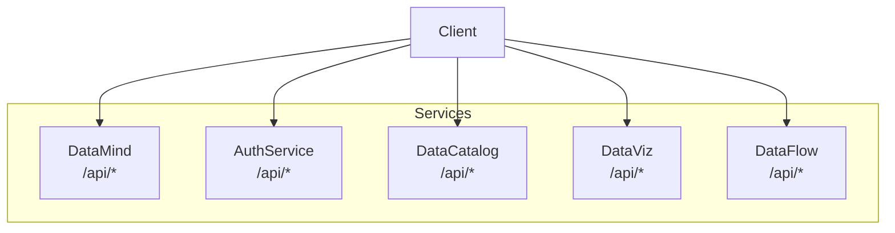
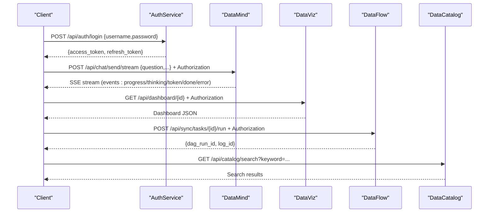
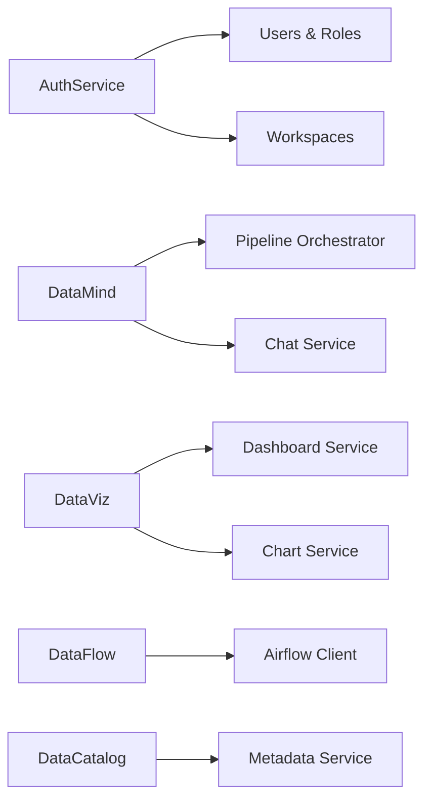

# API Reference

<cite>
**Referenced Files in This Document**
- [services/datamind/main.py](file://services/datamind/main.py)
- [services/authservice/main.py](file://services/authservice/main.py)
- [services/datacatalog/main.py](file://services/datacatalog/main.py)
- [services/dataviz/main.py](file://services/dataviz/main.py)
- [services/dataflow/main.py](file://services/dataflow/main.py)
- [services/datamind/api/chat.py](file://services/datamind/api/chat.py)
- [services/datamind/api/pipeline.py](file://services/datamind/api/pipeline.py)
- [services/authservice/api/auth.py](file://services/authservice/api/auth.py)
- [services/authservice/api/workspaces.py](file://services/authservice/api/workspaces.py)
- [services/datacatalog/api/catalog.py](file://services/datacatalog/api/catalog.py)
- [services/datacatalog/api/metadata.py](file://services/datacatalog/api/metadata.py)
- [services/dataviz/api/dashboard.py](file://services/dataviz/api/dashboard.py)
- [services/dataflow/api/sync.py](file://services/dataflow/api/sync.py)
- [services/shared/common/mcp_base.py](file://services/shared/common/mcp_base.py)
</cite>

## Table of Contents
1. [Introduction](#introduction)
2. [Project Structure](#project-structure)
3. [Core Components](#core-components)
4. [Architecture Overview](#architecture-overview)
5. [Detailed Component Analysis](#detailed-component-analysis)
6. [Dependency Analysis](#dependency-analysis)
7. [Performance Considerations](#performance-considerations)
8. [Troubleshooting Guide](#troubleshooting-guide)
9. [Conclusion](#conclusion)
10. [Appendices](#appendices)

## Introduction
This document provides comprehensive API reference documentation for AI-DataHub’s REST APIs and real-time streaming interfaces. It covers:
- Authentication and authorization
- Chat and NL2SQL pipelines with SSE streaming
- Workspace management and RBAC
- Dashboard, charts, and reports
- Data sync and workflow orchestration
- Metadata catalog operations
- MCP (Model Context Protocol) integration endpoints

It also includes client implementation guidelines, error handling patterns, versioning notes, and security considerations to help you integrate reliably.

## Project Structure
AI-DataHub is a microservices-based system exposing multiple FastAPI services:
- DataMind (AI engine): chat, pipeline execution, query history, model config
- AuthService: authentication, users, roles, workspaces, audit
- DataCatalog: metadata, glossary, metrics, tags, datasources, menu
- DataViz: dashboards, charts, reports, component data
- DataFlow: sync tasks, workflows, scheduled tasks, notifications

Each service registers its routers under consistent URL prefixes and exposes health endpoints.

**Diagram sources**
- [services/datamind/main.py:55-63](file://services/datamind/main.py#L55-L63)
- [services/authservice/main.py:53-58](file://services/authservice/main.py#L53-L58)
- [services/datacatalog/main.py:40-50](file://services/datacatalog/main.py#L40-L50)
- [services/dataviz/main.py:54-58](file://services/dataviz/main.py#L54-L58)
- [services/dataflow/main.py:52-56](file://services/dataflow/main.py#L52-L56)

**Section sources**
- [services/datamind/main.py:40-63](file://services/datamind/main.py#L40-L63)
- [services/authservice/main.py:37-58](file://services/authservice/main.py#L37-L58)
- [services/datacatalog/main.py:25-50](file://services/datacatalog/main.py#L25-L50)
- [services/dataviz/main.py:38-58](file://services/dataviz/main.py#L38-L58)
- [services/dataflow/main.py:36-56](file://services/dataflow/main.py#L36-L56)

## Core Components
- Authentication: JWT login, refresh, logout; workspace-scoped access via middleware and dependencies.
- Chat/NL2SQL: Send messages with streaming or non-streaming responses; conversation CRUD.
- Pipeline Execution: Execute quick/deep/agent pipelines with SSE events.
- Workspace Management: Create/update/delete workspaces, manage members, bind datasources/MCP servers/agents.
- Dashboards & Charts: Full CRUD for dashboards and charts, layout management, snapshot retrieval, chart refresh.
- Data Sync: Create/manage sync tasks, trigger executions via Airflow, view logs.
- Catalog & Metadata: Search catalog, list tables, admin metadata sync and CRUD.
- MCP Integration: SSE-based MCP server endpoints for external tool connectivity.

**Section sources**
- [services/authservice/api/auth.py:21-51](file://services/authservice/api/auth.py#L21-L51)
- [services/datamind/api/chat.py:35-91](file://services/datamind/api/chat.py#L35-L91)
- [services/datamind/api/pipeline.py:42-101](file://services/datamind/api/pipeline.py#L42-L101)
- [services/authservice/api/workspaces.py:40-169](file://services/authservice/api/workspaces.py#L40-L169)
- [services/dataviz/api/dashboard.py:97-387](file://services/dataviz/api/dashboard.py#L97-L387)
- [services/dataflow/api/sync.py:71-209](file://services/dataflow/api/sync.py#L71-L209)
- [services/datacatalog/api/catalog.py:12-60](file://services/datacatalog/api/catalog.py#L12-L60)
- [services/datacatalog/api/metadata.py:18-146](file://services/datacatalog/api/metadata.py#L18-L146)
- [services/shared/common/mcp_base.py:45-68](file://services/shared/common/mcp_base.py#L45-L68)

## Architecture Overview
The system uses FastAPI routers per feature area, protected by shared auth dependencies. Streaming endpoints return Server-Sent Events (SSE). Workspaces provide multi-tenant isolation for resources like dashboards and datasources.

**Diagram sources**
- [services/authservice/api/auth.py:21-51](file://services/authservice/api/auth.py#L21-L51)
- [services/datamind/api/chat.py:35-63](file://services/datamind/api/chat.py#L35-L63)
- [services/dataviz/api/dashboard.py:197-212](file://services/dataviz/api/dashboard.py#L197-L212)
- [services/dataflow/api/sync.py:156-185](file://services/dataflow/api/sync.py#L156-L185)
- [services/datacatalog/api/catalog.py:12-26](file://services/datacatalog/api/catalog.py#L12-L26)

## Detailed Component Analysis

### Authentication API
- Base path: /api/auth
- Methods:
  - POST /api/auth/login
    - Request body: username, password
    - Response: access_token, refresh_token
    - Errors: 401 invalid credentials, 403 business error message
  - POST /api/auth/refresh
    - Request body: refresh_token
    - Response: new access token
    - Errors: 401 invalid refresh token
  - POST /api/auth/logout
    - Response: success flag and message
- Notes:
  - Stateless JWT; clients should discard tokens on logout.
  - Protected endpoints use get_current_user dependency.

**Section sources**
- [services/authservice/api/auth.py:12-51](file://services/authservice/api/auth.py#L12-L51)

### Chat API (NL2SQL)
- Base path: /api/chat
- Methods:
  - POST /api/chat/send
    - Request: question, history[], datasource_id?, model_id?, pipeline_mode?, retrieval_strategy?, workspace_id?
    - Response: final result object
    - Auth: required
  - POST /api/chat/send/stream
    - Same request as above
    - Response: SSE stream with event types and data payloads
    - Headers: Cache-Control no-cache, X-Accel-Buffering no
  - GET /api/chat/conversations
    - Query: workspace_id?
    - Response: list of conversations
  - GET /api/chat/conversations/{conv_id}
    - Response: conversation with messages
  - DELETE /api/chat/conversations/{conv_id}
    - Response: success
- Error handling:
  - 404 when conversation not found
  - Streaming errors wrapped in SSE error/done events

**Section sources**
- [services/datamind/api/chat.py:23-91](file://services/datamind/api/chat.py#L23-L91)
- [services/datamind/api/chat.py:96-178](file://services/datamind/api/chat.py#L96-L178)

### Pipeline Execution API
- Base path: /api/pipeline
- Methods:
  - POST /api/pipeline/execute
    - Request: question, history[], datasource_id?, model_id?, pipeline_mode (quick|deep|agent), workflow_id?, retrieval_strategy?, workspace_id?
    - Response: SSE stream with events (progress, thinking, token, done, error)
    - Behavior: checks client disconnect and stops stream accordingly
- Error handling:
  - Streams an error event followed by a done event containing error details

**Section sources**
- [services/datamind/api/pipeline.py:24-101](file://services/datamind/api/pipeline.py#L24-L101)

### Workspace Management API
- Base path: /api/workspaces
- Methods:
  - GET /api/workspaces
    - Response: user’s workspaces with membership role and default flag
  - POST /api/workspaces
    - Request: name, description?, icon?, color?
    - Response: created workspace
  - PUT /api/workspaces/{workspace_id}
    - Request: fields to update
    - Response: updated workspace
    - Auth: owner/admin or global admin
  - DELETE /api/workspaces/{workspace_id}
    - Auth: admin only
  - GET /api/workspaces/{workspace_id}/users
    - Response: users in workspace
  - POST /api/workspaces/{workspace_id}/users
    - Request: user_id, role (member by default)
    - Auth: owner/admin or global admin
  - DELETE /api/workspaces/{workspace_id}/users/{target_user_id}
    - Auth: owner/admin or global admin
  - POST /api/workspaces/{workspace_id}/set-default
    - Sets the workspace as current user’s default
  - GET /api/workspaces/{workspace_id}/tools
    - Response: datasources, mcp_servers, agents bound to workspace
  - POST /api/workspaces/{workspace_id}/datasources
    - Query: datasource_id, is_primary?
    - Auth: owner/admin or global admin
  - DELETE /api/workspaces/{workspace_id}/datasources/{datasource_id}
    - Auth: owner/admin or global admin
  - POST /api/workspaces/{workspace_id}/mcp-servers
    - Query: mcp_server_id
    - Auth: owner/admin or global admin
  - DELETE /api/workspaces/{workspace_id}/mcp-servers/{mcp_server_id}
    - Auth: owner/admin or global admin
- Error handling:
  - 403 for unauthorized access
  - 404 for missing resources
  - 400 for invalid operations (e.g., removing owner)

**Section sources**
- [services/authservice/api/workspaces.py:19-169](file://services/authservice/api/workspaces.py#L19-L169)
- [services/authservice/api/workspaces.py:174-463](file://services/authservice/api/workspaces.py#L174-L463)

### Dashboard & Charts API
- Base path: /api/dashboard
- Methods:
  - GET /api/dashboard/
    - Response: dashboards list (workspace scoped)
  - POST /api/dashboard/
    - Request: name, description?, layout?, filters?, params?, status?, is_public?, is_default?, carousel_interval?, workspace_id?
    - Response: {id}
  - GET /api/dashboard/snapshots
    - Query: days?
    - Response: recent snapshots
  - GET /api/dashboard/snapshots/{snapshot_id}/data
    - Response: snapshot data rows
  - POST /api/dashboard/reorder
    - Request: orders[]
    - Response: {success}
  - POST /api/dashboard/preview
    - Request: source_type, source_id
    - Response: preview data
  - GET /api/dashboard/datasources
    - Response: aggregated available data sources
  - GET /api/dashboard/{dashboard_id}
    - Response: dashboard with charts
  - PUT /api/dashboard/{dashboard_id}
    - Request: fields to update
    - Response: {success}
  - DELETE /api/dashboard/{dashboard_id}
    - Response: {success}
  - POST /api/dashboard/{dashboard_id}/copy
    - Response: copied dashboard
  - POST /api/dashboard/{dashboard_id}/charts
    - Request: name, chart_type, sql_query?, config?, position?, source_type?, source_id?
    - Response: {id}
  - PUT /api/dashboard/{dashboard_id}/charts/{chart_id}
    - Request: fields to update
    - Response: {success}
  - DELETE /api/dashboard/{dashboard_id}/charts/{chart_id}
    - Response: {success}
  - POST /api/dashboard/{dashboard_id}/charts/{chart_id}/refresh
    - Request: params?, page_limit?, page_offset?, count_sql?
    - Response: refreshed data
  - POST /api/dashboard/{dashboard_id}/refresh
    - Request: params?
    - Response: refreshed all charts
  - PUT /api/dashboard/{dashboard_id}/layout
    - Request: layouts[]
    - Response: {success}
- Error handling:
  - 404 for missing dashboards/charts/snapshots
  - 400 for SQL execution failures or validation errors
  - 500 for internal errors

**Section sources**
- [services/dataviz/api/dashboard.py:29-387](file://services/dataviz/api/dashboard.py#L29-L387)

### Data Sync API
- Base path: /api/sync
- Methods:
  - GET /api/sync/tasks
    - Query: page?, size?, status?
    - Response: paginated tasks
  - POST /api/sync/tasks
    - Request: name, description, source_type, source_config, target_type, target_config, sync_mode (full|incremental), schedule?, task_config?
    - Response: {id, dag_id}
  - GET /api/sync/tasks/{task_id}
    - Response: task details
  - PUT /api/sync/tasks/{task_id}
    - Request: fields to update
    - Behavior: regenerates DAG if source/target config or sync_mode changes
    - Response: {success}
  - DELETE /api/sync/tasks/{task_id}
    - Response: {success}
  - POST /api/sync/tasks/{task_id}/run
    - Response: {success, dag_run_id, log_id}
  - GET /api/sync/tasks/{task_id}/logs
    - Query: page?, size?
    - Response: paginated logs
  - GET /api/sync/logs
    - Query: task_id?, page?, size?
    - Response: paginated logs
- Error handling:
  - 400 for invalid sync_mode or missing DAG
  - 404 for missing tasks
  - 502 for Airflow trigger failures

**Section sources**
- [services/dataflow/api/sync.py:25-209](file://services/dataflow/api/sync.py#L25-L209)

### Catalog API
- Base path: /api/catalog
- Methods:
  - GET /api/catalog/search
    - Query: keyword (required), type? (table|column|metric|term), workspace_id?, limit?
    - Response: search results across catalog entities
  - GET /api/catalog/tables
    - Query: page?, size?, datasource_id?, search?, workspace_id?
    - Response: paginated table list with metadata
  - GET /api/catalog/tables/{table_name}
    - Query: workspace_id?
    - Response: table detail with columns or 404

**Section sources**
- [services/datacatalog/api/catalog.py:12-60](file://services/datacatalog/api/catalog.py#L12-L60)

### Metadata Admin API
- Base path: /api/admin
- Methods:
  - POST /api/admin/sync/metadata
    - Request: datasource_id?
    - Response: sync result
  - POST /api/admin/sync/metadata/columns
    - Request: datasource_id, table_name
    - Response: sync result
  - GET /api/admin/metadata
    - Query: page?, size?, table_name?, column_name?, datasource_id?
    - Response: paginated field metadata
  - GET /api/admin/metadata/{row_id}
    - Response: single metadata record
  - POST /api/admin/metadata
    - Request: metadata fields
    - Response: create result
  - PUT /api/admin/metadata/{row_id}
    - Request: metadata fields
    - Response: update result
  - DELETE /api/admin/metadata/{row_id}
    - Response: delete result
  - GET /api/admin/table-info
    - Query: page?, size?, table_name?, datasource_id?
    - Response: paginated table info
  - GET /api/admin/table-info/{row_id}
    - Response: single table info
  - POST /api/admin/table-info
    - Request: table info fields
    - Response: create result
  - PUT /api/admin/table-info/{row_id}
    - Request: table info fields
    - Response: update result
  - DELETE /api/admin/table-info/{row_id}
    - Response: delete result
  - POST /api/admin/metadata/clear-by-datasource
    - Request: datasource_id
    - Response: clear result
  - POST /api/admin/metadata/clear-by-table
    - Request: datasource_id, table_name
    - Response: clear result
- Auth: requires admin role

**Section sources**
- [services/datacatalog/api/metadata.py:18-146](file://services/datacatalog/api/metadata.py#L18-L146)

### MCP Integration Endpoints
- Purpose: Expose MCP servers over SSE for external tool connectivity.
- Implementation:
  - SSE transport endpoint for connection establishment
  - Message posting endpoint for subsequent requests
- Typical usage:
  - Connect via SSE path
  - Send messages to message path
  - Receive tool calls and results through the established session

**Section sources**
- [services/shared/common/mcp_base.py:45-68](file://services/shared/common/mcp_base.py#L45-L68)

## Dependency Analysis
- Routers are mounted under service-specific prefixes, enabling clear separation of concerns.
- Shared auth middleware enforces user context and workspace scoping where applicable.
- Services depend on:
  - Database connections for persistence
  - External orchestrators (Airflow) for workflow execution
  - LLM/RAG components for NL2SQL and agent modes
- Potential coupling points:
  - Workspace boundaries affect visibility of datasources, MCP servers, and agents
  - Pipeline mode influences downstream processing paths

**Diagram sources**
- [services/authservice/main.py:53-58](file://services/authservice/main.py#L53-L58)
- [services/datamind/main.py:55-63](file://services/datamind/main.py#L55-L63)
- [services/dataviz/main.py:54-58](file://services/dataviz/main.py#L54-L58)
- [services/dataflow/main.py:52-56](file://services/dataflow/main.py#L52-L56)
- [services/datacatalog/main.py:40-50](file://services/datacatalog/main.py#L40-L50)

**Section sources**
- [services/authservice/main.py:53-58](file://services/authservice/main.py#L53-L58)
- [services/datamind/main.py:55-63](file://services/datamind/main.py#L55-L63)
- [services/dataviz/main.py:54-58](file://services/dataviz/main.py#L54-L58)
- [services/dataflow/main.py:52-56](file://services/dataflow/main.py#L52-L56)
- [services/datacatalog/main.py:40-50](file://services/datacatalog/main.py#L40-L50)

## Performance Considerations
- Streaming endpoints:
  - Use SSE for chat and pipeline execution to reduce latency and improve UX
  - Ensure proxies do not buffer responses; headers include Cache-Control no-cache and X-Accel-Buffering no
- Pagination:
  - All list endpoints support page and size parameters; enforce upper bounds to avoid large payloads
- Background tasks:
  - Use background tasks for long-running operations (e.g., DAG triggers) to keep API responsive
- Connection limits:
  - Tune Uvicorn workers and database connection pools based on expected concurrency
- Caching:
  - Consider caching frequent read-only queries (e.g., catalog search) at the gateway or application layer

[No sources needed since this section provides general guidance]

## Troubleshooting Guide
Common issues and resolutions:
- Authentication failures:
  - Verify login returns valid tokens; ensure Authorization header is set for protected endpoints
  - Refresh tokens when access tokens expire
- Streaming interruptions:
  - Check proxy settings for SSE compatibility; ensure no buffering or timeouts
  - Handle client disconnects gracefully; streams stop when disconnected
- Workspace permissions:
  - Ensure user has appropriate role (owner/admin) for workspace operations
  - Validate workspace membership before accessing resources
- Data sync errors:
  - Confirm DAG configuration exists before triggering execution
  - Inspect Airflow logs for task-level errors
- Catalog and metadata:
  - Use admin endpoints to sync metadata after datasource changes
  - Validate table names and datasource IDs in requests

**Section sources**
- [services/authservice/api/auth.py:21-51](file://services/authservice/api/auth.py#L21-L51)
- [services/datamind/api/pipeline.py:65-101](file://services/datamind/api/pipeline.py#L65-L101)
- [services/authservice/api/workspaces.py:96-169](file://services/authservice/api/workspaces.py#L96-L169)
- [services/dataflow/api/sync.py:156-185](file://services/dataflow/api/sync.py#L156-L185)
- [services/datacatalog/api/metadata.py:18-31](file://services/datacatalog/api/metadata.py#L18-L31)

## Conclusion
AI-DataHub provides a robust set of REST APIs for chat-driven analytics, workspace collaboration, dashboard management, data synchronization, and metadata operations. Real-time communication is enabled via SSE for streaming responses. Security is enforced through JWT-based authentication and workspace-scoped access controls. Follow the documented schemas and error patterns to build reliable integrations.

[No sources needed since this section summarizes without analyzing specific files]

## Appendices

### Versioning
- Each service defines a version in its FastAPI app metadata (e.g., version="1.0.0").
- Maintain backward compatibility when modifying response schemas; consider introducing new routes for breaking changes.

**Section sources**
- [services/datamind/main.py:40-44](file://services/datamind/main.py#L40-L44)
- [services/authservice/main.py:37-42](file://services/authservice/main.py#L37-L42)
- [services/datacatalog/main.py:25-29](file://services/datacatalog/main.py#L25-L29)
- [services/dataviz/main.py:38-43](file://services/dataviz/main.py#L38-L43)
- [services/dataflow/main.py:36-41](file://services/dataflow/main.py#L36-L41)

### Security Considerations
- Use HTTPS in production; configure CORS appropriately.
- Enforce authentication on all sensitive endpoints using get_current_user and require_admin dependencies.
- Validate and sanitize inputs to prevent injection attacks.
- Limit exposure of admin endpoints to authorized users only.

**Section sources**
- [services/datamind/main.py:46-53](file://services/datamind/main.py#L46-L53)
- [services/authservice/main.py:44-51](file://services/authservice/main.py#L44-L51)
- [services/datacatalog/main.py:31-38](file://services/datacatalog/main.py#L31-L38)
- [services/dataviz/main.py:45-52](file://services/dataviz/main.py#L45-L52)
- [services/dataflow/main.py:43-50](file://services/dataflow/main.py#L43-L50)

### Client Implementation Guidelines
- Authentication:
  - Call login to obtain tokens; attach access token to Authorization header for protected endpoints
  - Implement token refresh logic using refresh endpoint when access token expires
- Streaming:
  - For SSE endpoints, parse event lines and handle data payloads accordingly
  - Handle disconnects and reconnection strategies
- Rate limiting:
  - Implement client-side backoff and retry with exponential delay
  - Respect any rate-limit headers from upstream proxies
- Error handling:
  - Map HTTP status codes to user-friendly messages
  - Log detailed error contexts for debugging

[No sources needed since this section provides general guidance]