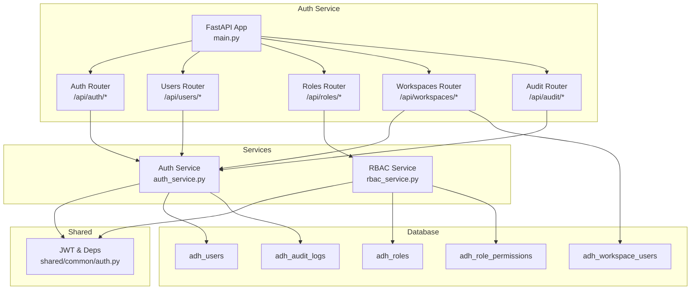
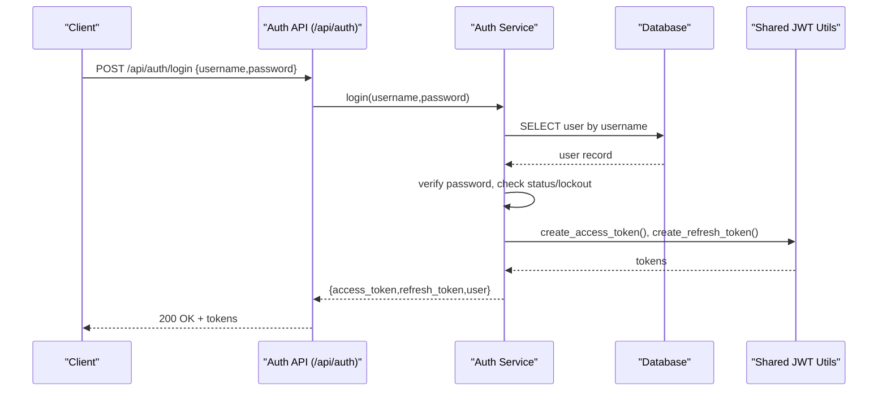
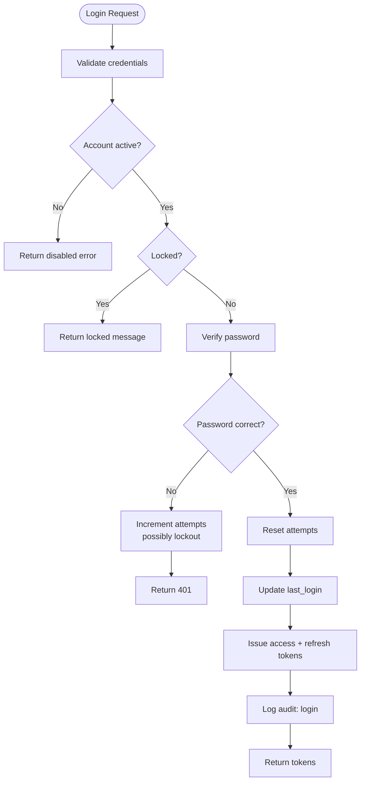
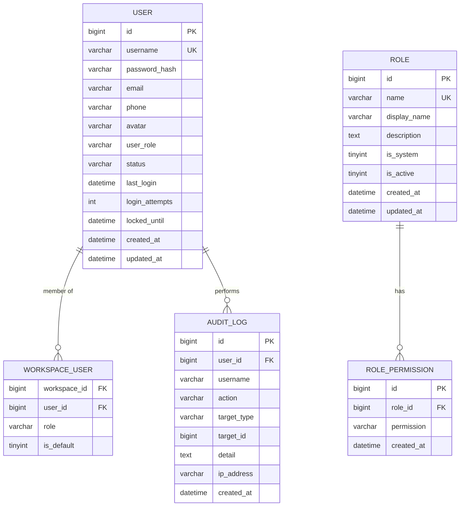
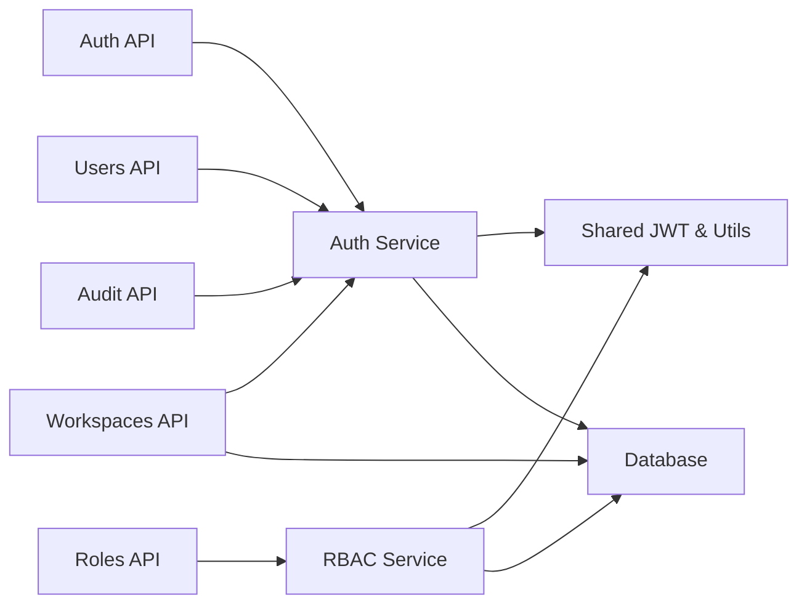

# Authentication & Authorization

<cite>
**Referenced Files in This Document**
- [main.py](file://services/authservice/main.py)
- [auth.py](file://services/authservice/api/auth.py)
- [users.py](file://services/authservice/api/users.py)
- [roles.py](file://services/authservice/api/roles.py)
- [workspaces.py](file://services/authservice/api/workspaces.py)
- [audit.py](file://services/authservice/api/audit.py)
- [auth_service.py](file://services/authservice/services/auth_service.py)
- [rbac_service.py](file://services/authservice/services/rbac_service.py)
- [auth.py](file://services/shared/common/auth.py)
- [init.sql](file://docker/mysql/init.sql)
- [role_migration.sql](file://services/shared/migrations/role_migration.sql)
- [role_permission_migration.sql](file://services/shared/migrations/role_permission_migration.sql)
</cite>

## Table of Contents
1. Introduction
2. Project Structure
3. Core Components
4. Architecture Overview
5. Detailed Component Analysis
6. Dependency Analysis
7. Performance Considerations
8. Troubleshooting Guide
9. Conclusion

## Introduction
This document provides comprehensive API documentation for authentication and authorization in the system, focusing on:
- JWT-based authentication flow (login, refresh, logout)
- User management and account settings
- Role-Based Access Control (RBAC) and permissions
- Workspace-level access control and resource isolation
- Audit logging endpoints
- Security considerations including token security, brute-force protection, and rate limiting guidance

The service is implemented as a FastAPI application exposing REST endpoints under /api/auth, /api/users, /api/roles, /api/workspaces, and /api/audit.

## Project Structure
The authentication and authorization subsystem is organized into:
- API layer: FastAPI routers for auth, users, roles, workspaces, audit
- Service layer: Business logic for authentication, RBAC, user management, workspace operations
- Shared utilities: JWT validation, dependencies, encryption helpers
- Database schema: Users, roles, permissions, audit logs, workspace membership

**Diagram sources**
- [main.py:54-58](file://services/authservice/main.py#L54-L58)
- [auth.py:21-51](file://services/authservice/api/auth.py#L21-L51)
- [users.py:44-166](file://services/authservice/api/users.py#L44-L166)
- [roles.py:30-82](file://services/authservice/api/roles.py#L30-L82)
- [workspaces.py:40-463](file://services/authservice/api/workspaces.py#L40-L463)
- [audit.py:12-22](file://services/authservice/api/audit.py#L12-L22)
- [auth_service.py:126-224](file://services/authservice/services/auth_service.py#L126-L224)
- [rbac_service.py:27-275](file://services/authservice/services/rbac_service.py#L27-L275)
- [auth.py:58-85](file://services/shared/common/auth.py#L58-L85)

**Section sources**
- [main.py:1-71](file://services/authservice/main.py#L1-L71)

## Core Components
- Authentication endpoints: login, refresh, logout
- User management: profile, update profile, change password; admin CRUD with status management
- RBAC: role CRUD, permission assignment to roles, permission checks
- Workspaces: list/create/update/delete, member management, default workspace selection, binding datasources/MCP servers/agents
- Audit logs: list with filters (admin only)

Key behaviors:
- JWT tokens: HS256, access token expires in 24 hours, refresh token in 7 days
- Brute-force protection: lockout after repeated failed attempts
- Password policy: minimum length and complexity requirements
- Sensitive fields: email/phone encrypted at rest
- Workspace isolation: membership-based access control

**Section sources**
- [auth.py:21-51](file://services/authservice/api/auth.py#L21-L51)
- [users.py:44-166](file://services/authservice/api/users.py#L44-L166)
- [roles.py:30-82](file://services/authservice/api/roles.py#L30-L82)
- [workspaces.py:40-463](file://services/authservice/api/workspaces.py#L40-L463)
- [audit.py:12-22](file://services/authservice/api/audit.py#L12-L22)
- [auth_service.py:22-29](file://services/authservice/services/auth_service.py#L22-L29)
- [auth_service.py:72-90](file://services/authservice/services/auth_service.py#L72-L90)
- [auth_service.py:126-224](file://services/authservice/services/auth_service.py#L126-L224)

## Architecture Overview
The system uses a layered architecture:
- API layer exposes REST endpoints with FastAPI routers
- Service layer encapsulates business logic for auth, RBAC, and workspace operations
- Shared module provides JWT decoding and FastAPI dependencies for current user and admin enforcement
- Database stores users, roles, permissions, workspace memberships, and audit logs

**Diagram sources**
- [auth.py:21-32](file://services/authservice/api/auth.py#L21-L32)
- [auth_service.py:126-193](file://services/authservice/services/auth_service.py#L126-L193)
- [auth_service.py:95-113](file://services/authservice/services/auth_service.py#L95-L113)

## Detailed Component Analysis

### Authentication Endpoints
- POST /api/auth/login
  - Authenticates user, returns access and refresh tokens
  - Enforces account status and lockout rules
  - Logs successful login
- POST /api/auth/refresh
  - Exchanges refresh token for new token pair
  - Validates token type and user status
- POST /api/auth/logout
  - Stateless logout; clients should discard tokens

**Diagram sources**
- [auth_service.py:126-193](file://services/authservice/services/auth_service.py#L126-L193)
- [auth_service.py:229-276](file://services/authservice/services/auth_service.py#L229-L276)

**Section sources**
- [auth.py:21-51](file://services/authservice/api/auth.py#L21-L51)
- [auth_service.py:126-224](file://services/authservice/services/auth_service.py#L126-L224)

### User Management Endpoints
- GET /api/users/me
  - Returns current user profile
- PUT /api/users/me
  - Updates current user profile fields
- PUT /api/users/me/password
  - Changes current user’s password
- Admin endpoints (require admin):
  - GET /api/users/ — list users with pagination and filters
  - POST /api/users/ — create user
  - PUT /api/users/{user_id} — update user
  - PUT /api/users/{user_id}/password — reset user password
  - PUT /api/users/{user_id}/status — enable/disable user
  - DELETE /api/users/{user_id} — delete user

Security notes:
- Self-modification restrictions enforced for password reset and status changes
- Audit logs recorded for administrative actions

**Section sources**
- [users.py:44-166](file://services/authservice/api/users.py#L44-L166)
- [auth_service.py:306-571](file://services/authservice/services/auth_service.py#L306-L571)

### RBAC Endpoints
- GET /api/roles/ — list all roles
- POST /api/roles/ — create role (admin)
- PUT /api/roles/{role_id} — update role (admin)
- DELETE /api/roles/{role_id} — delete role (admin)
- GET /api/roles/{role_id}/permissions — get role permissions
- PUT /api/roles/{role_id}/permissions — set role permissions (admin)

Permission model:
- Permissions are stored as strings (e.g., "users:read")
- Admin users have wildcard permissions
- Permission checks can be performed via service functions

**Section sources**
- [roles.py:30-82](file://services/authservice/api/roles.py#L30-L82)
- [rbac_service.py:27-275](file://services/authservice/services/rbac_service.py#L27-L275)

### Workspace Endpoints
- GET /api/workspaces/ — list workspaces for current user
- POST /api/workspaces/ — create workspace (current user becomes owner)
- PUT /api/workspaces/{workspace_id} — update workspace (owner/admin or global admin)
- DELETE /api/workspaces/{workspace_id} — delete workspace (admin)
- GET /api/workspaces/{workspace_id}/users — list members
- POST /api/workspaces/{workspace_id}/users — add member (owner/admin or global admin)
- DELETE /api/workspaces/{workspace_id}/users/{target_user_id} — remove member (owner/admin or global admin)
- POST /api/workspaces/{workspace_id}/set-default — set default workspace
- GET /api/workspaces/{workspace_id}/tools — list bound datasources, MCP servers, agents
- POST /api/workspaces/{workspace_id}/datasources — bind datasource (owner/admin or global admin)
- DELETE /api/workspaces/{workspace_id}/datasources/{datasource_id} — unbind datasource
- POST /api/workspaces/{workspace_id}/mcp-servers — bind MCP server (owner/admin or global admin)
- DELETE /api/workspaces/{workspace_id}/mcp-servers/{mcp_server_id} — unbind MCP server

Access control:
- Membership checks enforce workspace boundaries
- Owner/admin roles required for sensitive operations
- Default workspace selection per user supported

**Section sources**
- [workspaces.py:40-463](file://services/authservice/api/workspaces.py#L40-L463)

### Audit Logging Endpoints
- GET /api/audit/logs — list audit logs with filters (admin only)

Audit events include:
- Login success/failure
- Account lockouts
- User creation/update/reset/status changes
- Role and permission changes
- Workspace operations

**Section sources**
- [audit.py:12-22](file://services/authservice/api/audit.py#L12-L22)
- [auth_service.py:576-624](file://services/authservice/services/auth_service.py#L576-L624)

### Data Models and Schema
Core tables involved:
- adh_users: user accounts, roles, status, lockout info
- adh_roles: role definitions
- adh_role_permissions: role-to-permission mappings
- adh_workspace_users: workspace membership and roles
- adh_audit_logs: audit trail

**Diagram sources**
- [init.sql:273-307](file://docker/mysql/init.sql#L273-L307)
- [role_migration.sql:9-58](file://services/shared/migrations/role_migration.sql#L9-L58)
- [role_permission_migration.sql:9-43](file://services/shared/migrations/role_permission_migration.sql#L9-L43)

## Dependency Analysis
Component relationships:
- API routers depend on service modules for business logic
- Services use shared JWT utilities and database connections
- Workspace endpoints perform direct SQL queries for membership and resource binding
- RBAC service enforces permission checks based on user roles

**Diagram sources**
- [main.py:54-58](file://services/authservice/main.py#L54-L58)
- [auth_service.py:126-224](file://services/authservice/services/auth_service.py#L126-L224)
- [rbac_service.py:27-275](file://services/authservice/services/rbac_service.py#L27-L275)
- [workspaces.py:40-463](file://services/authservice/api/workspaces.py#L40-L463)

**Section sources**
- [main.py:54-58](file://services/authservice/main.py#L54-L58)
- [auth_service.py:126-224](file://services/authservice/services/auth_service.py#L126-L224)
- [rbac_service.py:27-275](file://services/authservice/services/rbac_service.py#L27-L275)
- [workspaces.py:40-463](file://services/authservice/api/workspaces.py#L40-L463)

## Performance Considerations
- Token operations are stateless and fast; avoid unnecessary token revalidation
- Use pagination for user listing and audit logs to limit payload size
- Workspace queries join membership tables; ensure indexes exist on frequently filtered columns
- Avoid excessive audit log writes in tight loops; batch where possible
- Encrypt/decrypt sensitive fields only when needed; cache decrypted values in short-lived sessions if appropriate

[No sources needed since this section provides general guidance]

## Troubleshooting Guide
Common issues and resolutions:
- Invalid or expired token: Ensure client sends valid access token; refresh using refresh endpoint before expiry
- Account locked: Wait for lockout period or contact admin to reset attempts
- Permission denied: Verify user role and assigned permissions; confirm workspace membership
- Workspace access errors: Confirm user is a member and has required role (owner/admin)
- Audit logs missing: Check database connectivity and write permissions

Operational tips:
- Monitor login attempts and lockout events in audit logs
- Validate password policies during user creation and updates
- Regularly review workspace memberships and role assignments

**Section sources**
- [auth_service.py:126-224](file://services/authservice/services/auth_service.py#L126-L224)
- [auth_service.py:229-276](file://services/authservice/services/auth_service.py#L229-L276)
- [workspaces.py:96-169](file://services/authservice/api/workspaces.py#L96-L169)
- [audit.py:12-22](file://services/authservice/api/audit.py#L12-L22)

## Conclusion
The authentication and authorization system provides a robust foundation for secure access control:
- JWT-based authentication with refresh tokens supports seamless session management
- RBAC enables fine-grained permissions through roles and permission sets
- Workspace isolation ensures data and resources are scoped appropriately
- Comprehensive audit logging supports compliance and operational visibility
- Built-in protections against brute force attacks and weak passwords enhance security

For production deployments, consider adding rate limiting at the gateway level and implementing token revocation lists for enhanced security.

[No sources needed since this section summarizes without analyzing specific files]