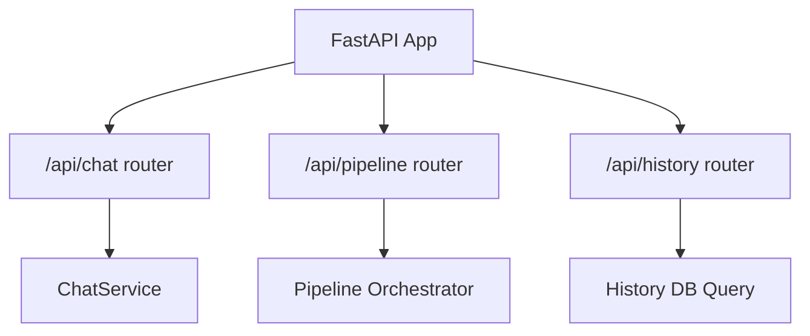
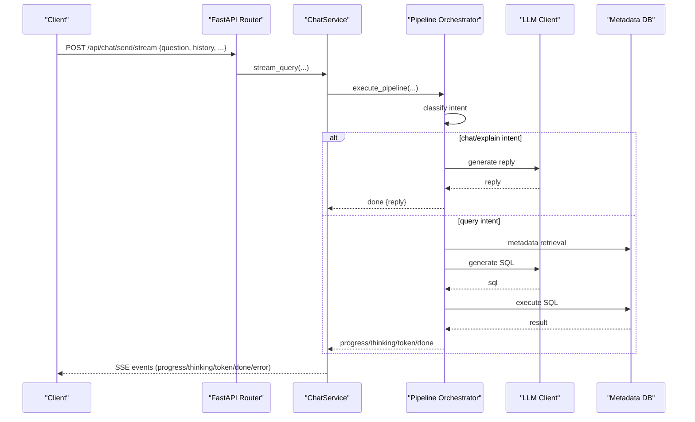
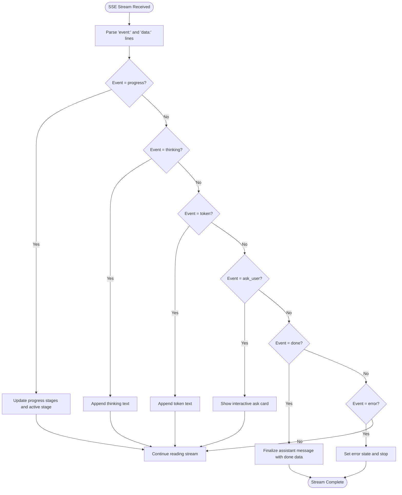
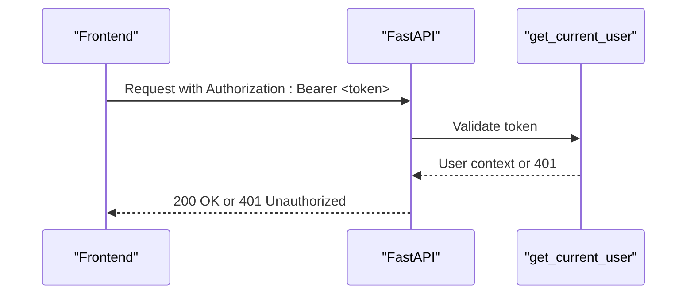
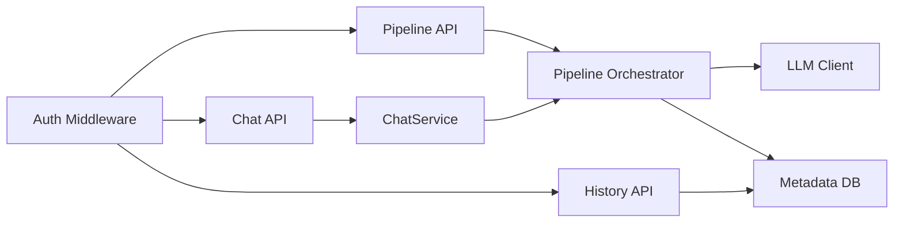

# Chat & Pipeline APIs

<cite>
**Referenced Files in This Document**
- [main.py](file://services/datamind/main.py)
- [chat.py](file://services/datamind/api/chat.py)
- [pipeline.py](file://services/datamind/api/pipeline.py)
- [history.py](file://services/datamind/api/history.py)
- [chat_service.py](file://services/datamind/services/chat_service.py)
- [pipeline_orchestrator.py](file://services/datamind/nl2sql/orchestrator/pipeline_orchestrator.py)
- [schemas.py](file://services/shared/models/schemas.py)
- [auth.py](file://services/shared/common/auth.py)
- [client.ts](file://frontend/src/api/client.ts)
- [chatStore.ts](file://frontend/src/stores/chatStore.ts)
</cite>

## Table of Contents
1. Introduction
2. Project Structure
3. Core Components
4. Architecture Overview
5. Detailed Component Analysis
6. Dependency Analysis
7. Performance Considerations
8. Troubleshooting Guide
9. Conclusion

## Introduction
This document provides comprehensive API documentation for AI-DataHub’s chat and pipeline processing endpoints. It covers:
- Natural language query processing via POST /api/chat/send (streaming and non-streaming)
- Batch-style pipeline execution via POST /api/pipeline/execute
- Conversation history retrieval via GET /api/history
- SSE streaming responses, request/response schemas, error handling, and authentication
- Examples for quick mode, deep analysis, and agent mode workflows
- Real-time chat behavior using SSE (not WebSocket), including message formats, connection lifecycle, and error recovery

## Project Structure
The DataMind service exposes REST endpoints grouped by feature. The FastAPI application mounts routers under prefixed paths:
- /api/chat — conversational NL2SQL endpoints
- /api/pipeline — pipeline execution endpoint
- /api/history — query audit history
- Other routers are mounted but out of scope for this document

**Diagram sources**
- [main.py:55-63](file://services/datamind/main.py#L55-L63)
- [chat.py:10-18](file://services/datamind/api/chat.py#L10-L18)
- [pipeline.py:11-19](file://services/datamind/api/pipeline.py#L11-L19)
- [history.py:10-15](file://services/datamind/api/history.py#L10-L15)

**Section sources**
- [main.py:28-63](file://services/datamind/main.py#L28-L63)

## Core Components
- Chat endpoints:
  - POST /api/chat/send/stream — SSE streaming response to a natural language question
  - POST /api/chat/send — non-streaming final result
  - Conversation management endpoints for listing, retrieving, and deleting conversations
- Pipeline endpoint:
  - POST /api/pipeline/execute — SSE streaming execution across quick/deep/agent modes
- History endpoint:
  - GET /api/history — paginated query audit log with filters

Authentication:
- All protected endpoints require a valid JWT token via Authorization: Bearer <token>
- get_current_user dependency validates tokens and returns user context

SSE format:
- Events use text/event-stream with event lines and data lines
- Common events include progress, thinking, token, ask_user, done, and error

**Section sources**
- [chat.py:21-91](file://services/datamind/api/chat.py#L21-L91)
- [pipeline.py:22-101](file://services/datamind/api/pipeline.py#L22-L101)
- [history.py:18-87](file://services/datamind/api/history.py#L18-L87)
- [auth.py:58-76](file://services/shared/common/auth.py#L58-L76)

## Architecture Overview
High-level flow from client to backend orchestration:

**Diagram sources**
- [chat.py:35-63](file://services/datamind/api/chat.py#L35-L63)
- [chat_service.py:22-71](file://services/datamind/services/chat_service.py#L22-L71)
- [pipeline_orchestrator.py:73-169](file://services/datamind/nl2sql/orchestrator/pipeline_orchestrator.py#L73-L169)

## Detailed Component Analysis

### Chat Endpoints
- POST /api/chat/send/stream
  - Request body fields:
    - question: string
    - history: array of conversation messages
    - datasource_id: integer (default 0)
    - model_id: integer or null
    - pipeline_mode: string ("quick", "deep", "agent")
    - retrieval_strategy: string or null
    - workspace_id: integer (default 0)
  - Response: SSE stream with events:
    - progress: stage, message, elapsed
    - thinking: incremental text
    - token: incremental text
    - ask_user: interactive prompt from agent
    - done: final payload with intent, reply, sql, warnings, result, timings, chart_type, brief, tokens, workflow_info, tool_calls
    - error: error message
  - Authentication: required (JWT)
  - Notes: StreamingResponse with no-cache headers; supports client disconnect detection

- POST /api/chat/send
  - Same request schema as streaming variant
  - Returns final JSON result collected from the orchestrator’s done event

- Conversation management
  - GET /api/chat/conversations?workspace_id=... — list recent conversations
  - GET /api/chat/conversations/{conv_id} — retrieve conversation with messages
  - DELETE /api/chat/conversations/{conv_id} — delete conversation

Examples:
- Quick mode: set pipeline_mode="quick" for fast SQL-only queries
- Deep analysis: set pipeline_mode="deep" for full RAG + loop engine
- Agent mode: set pipeline_mode="agent" for autonomous tool calling and MCP integration

**Section sources**
- [chat.py:21-91](file://services/datamind/api/chat.py#L21-L91)
- [chat_service.py:22-111](file://services/datamind/services/chat_service.py#L22-L111)
- [pipeline_orchestrator.py:73-169](file://services/datamind/nl2sql/orchestrator/pipeline_orchestrator.py#L73-L169)

### Pipeline Execution Endpoint
- POST /api/pipeline/execute
  - Request body fields:
    - question: string
    - history: array of conversation messages
    - datasource_id: integer (default 0)
    - model_id: integer or null
    - pipeline_mode: string ("quick", "deep", "agent")
    - workflow_id: integer or null
    - retrieval_strategy: string or null
    - workspace_id: integer (default 0)
  - Response: SSE stream with events:
    - progress: stage, message, elapsed
    - thinking: incremental text
    - token: incremental text
    - ask_user: interactive prompt from agent
    - done: final payload similar to chat done
    - error: error message
  - Authentication: required (JWT)
  - Notes: Uses _sse_event helper to format events; handles client disconnects and wraps exceptions into error/done events

Example workflows:
- Quick mode: direct NL2SQL path without agent routing
- Deep mode: metadata retrieval, LLM analysis, SQL generation, execution
- Agent mode: agent planning, tool calls, MCP interactions, iterative refinement

**Section sources**
- [pipeline.py:22-101](file://services/datamind/api/pipeline.py#L22-L101)
- [pipeline_orchestrator.py:172-237](file://services/datamind/nl2sql/orchestrator/pipeline_orchestrator.py#L172-L237)

### History Endpoint
- GET /api/history
  - Query parameters:
    - days: integer (1–90, default 7)
    - status: "success" | "error" (optional)
    - datasource_id: integer (optional)
    - workspace_id: integer (default 0)
    - page: integer (>=1)
    - page_size: integer (1–200, default 50)
  - Response:
    - data: array of audit items
    - total: count matching filters
    - page: current page
    - page_size: items per page
    - total_pages: computed pages
  - Notes: Paginates over adh_query_audit with optional filters; safe fallback on errors

**Section sources**
- [history.py:18-87](file://services/datamind/api/history.py#L18-L87)

### SSE Event Formats and Message Flow
Event types and payloads:
- progress: { stage, message, elapsed }
- thinking: { text }
- token: { text }
- ask_user: { request_id, question, options }
- done: { intent, reply, sql, warnings, result, timings, chart_type, brief, tokens, workflow_info, tool_calls, error? }
- error: { message }

Frontend handling:
- Reads SSE line-by-line, parses event/data pairs
- Updates UI incrementally for thinking and token streams
- Handles ask_user interaction and resumes stream after respondToAsk
- Finalizes assistant message with done payload

**Diagram sources**
- [chatStore.ts:470-567](file://frontend/src/stores/chatStore.ts#L470-L567)
- [chat_store.ts:553-631](file://frontend/src/stores/chatStore.ts#L553-L631)

**Section sources**
- [chatStore.ts:470-631](file://frontend/src/stores/chatStore.ts#L470-L631)

### Authentication Requirements
- All protected endpoints require a valid JWT token in the Authorization header
- Token validation extracts user_id, username, role
- Expired or invalid tokens return 401 Unauthorized
- Frontend attaches token automatically and refreshes on 401

**Diagram sources**
- [auth.py:58-76](file://services/shared/common/auth.py#L58-L76)
- [client.ts:37-41](file://frontend/src/api/client.ts#L37-L41)
- [client.ts:44-79](file://frontend/src/api/client.ts#L44-L79)

**Section sources**
- [auth.py:58-76](file://services/shared/common/auth.py#L58-L76)
- [client.ts:37-79](file://frontend/src/api/client.ts#L37-L79)

### Error Handling Patterns
- Server-side:
  - Pipeline orchestrator yields error events and ensures a final done event even on failures
  - Chat service wraps exceptions and emits error/done events
  - History endpoint returns empty results with safe defaults on errors
- Client-side:
  - SSE parser throws on parse errors; handled by setting error state
  - AbortController used to cancel requests; frontend marks messages as cancelled
  - No done event triggers a fallback error message

**Section sources**
- [pipeline_orchestrator.py:190-237](file://services/datamind/nl2sql/orchestrator/pipeline_orchestrator.py#L190-L237)
- [chat_service.py:62-71](file://services/datamind/services/chat_service.py#L62-L71)
- [history.py:79-87](file://services/datamind/api/history.py#L79-L87)
- [chatStore.ts:553-567](file://frontend/src/stores/chatStore.ts#L553-L567)
- [chatStore.ts:580-599](file://frontend/src/stores/chatStore.ts#L580-L599)
- [chatStore.ts:652-692](file://frontend/src/stores/chatStore.ts#L652-L692)

### WebSocket Connections
- This implementation uses Server-Sent Events (SSE) for real-time chat, not WebSockets
- SSE is initiated via HTTP POST with Accept: text/event-stream and streamed back
- Connection lifecycle managed by client-side fetch reader and AbortController
- Error recovery includes retry logic, token refresh, and graceful fallbacks

[No sources needed since this section clarifies SSE vs WebSocket usage]

## Dependency Analysis
Component relationships and coupling:

**Diagram sources**
- [chat.py:10-18](file://services/datamind/api/chat.py#L10-L18)
- [pipeline.py:11-19](file://services/datamind/api/pipeline.py#L11-L19)
- [history.py:10-15](file://services/datamind/api/history.py#L10-L15)
- [chat_service.py:22-111](file://services/datamind/services/chat_service.py#L22-L111)
- [pipeline_orchestrator.py:73-237](file://services/datamind/nl2sql/orchestrator/pipeline_orchestrator.py#L73-L237)
- [auth.py:58-76](file://services/shared/common/auth.py#L58-L76)

**Section sources**
- [main.py:55-63](file://services/datamind/main.py#L55-L63)
- [chat_service.py:22-111](file://services/datamind/services/chat_service.py#L22-L111)
- [pipeline_orchestrator.py:73-237](file://services/datamind/nl2sql/orchestrator/pipeline_orchestrator.py#L73-L237)

## Performance Considerations
- Use quick mode for low-latency SQL-only queries
- Deep mode incurs additional metadata retrieval and LLM calls
- Agent mode may involve multiple tool calls and MCP interactions; expect longer latency
- SSE streaming reduces perceived latency by delivering incremental updates
- Pagination on history endpoint prevents large dataset transfers
- Avoid unnecessary history payloads; slim message saving reduces storage and network overhead

[No sources needed since this section provides general guidance]

## Troubleshooting Guide
Common issues and resolutions:
- 401 Unauthorized: Ensure Authorization header contains a valid Bearer token; check token expiration and refresh flow
- SSE stream ends without done: Frontend shows fallback error; verify server logs for missing done events
- ask_user interaction not resuming: Confirm respondToAsk call reaches backend; ensure stream remains open
- History returns empty: Check filter parameters and database connectivity; review error handling in history endpoint

**Section sources**
- [auth.py:58-76](file://services/shared/common/auth.py#L58-L76)
- [client.ts:44-79](file://frontend/src/api/client.ts#L44-L79)
- [chatStore.ts:580-599](file://frontend/src/stores/chatStore.ts#L580-L599)
- [history.py:79-87](file://services/datamind/api/history.py#L79-L87)

## Conclusion
AI-DataHub’s chat and pipeline APIs provide flexible natural language query processing through SSE streaming. Clients can choose between quick, deep, and agent modes to balance speed and capability. Robust authentication, clear error handling, and pagination ensure reliable operation. For real-time experiences, prefer SSE over WebSockets as implemented here.

[No sources needed since this section summarizes without analyzing specific files]