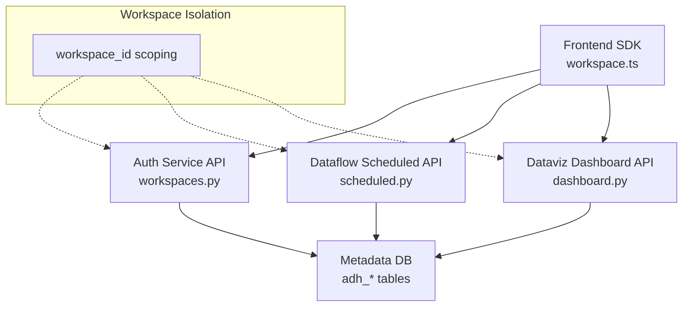
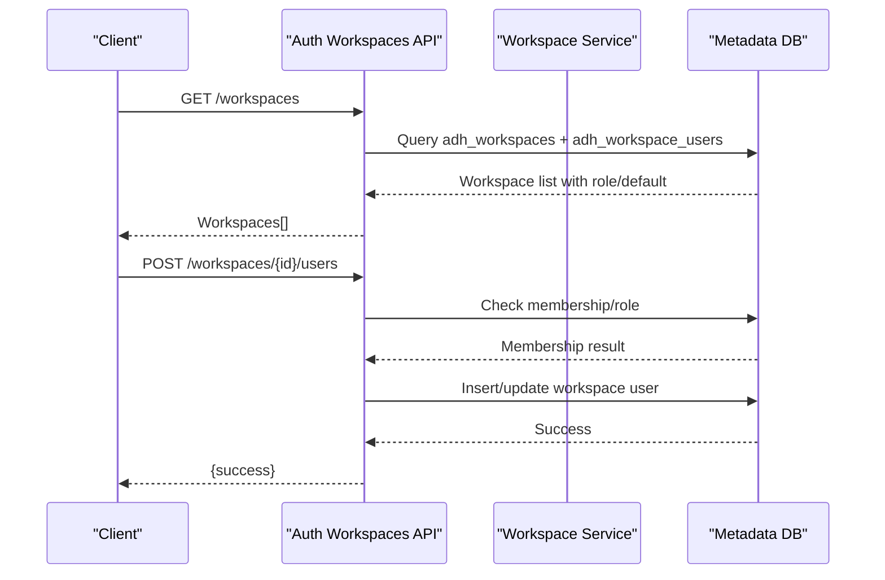
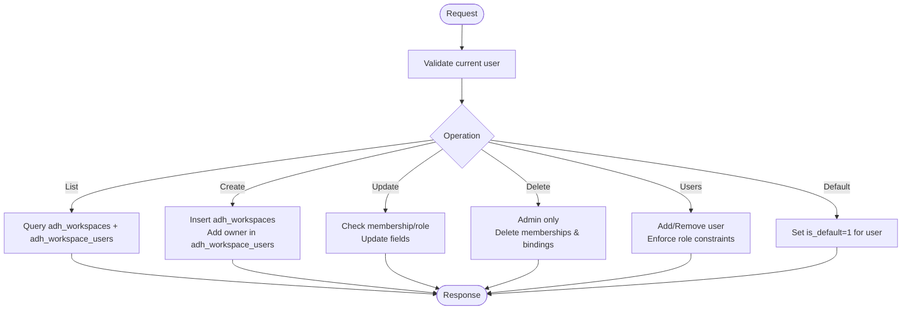
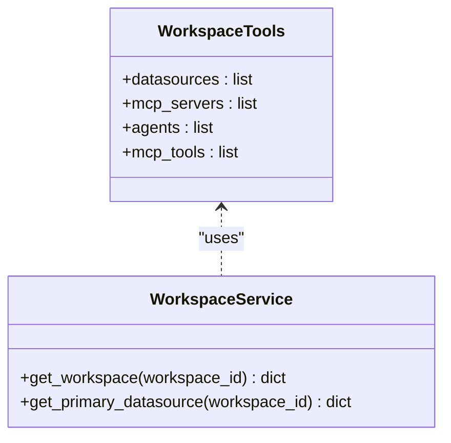
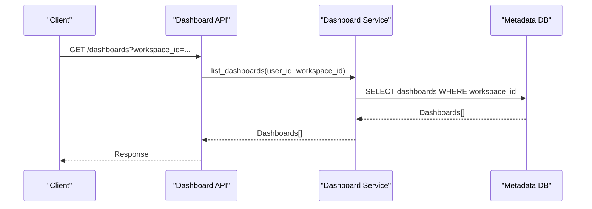
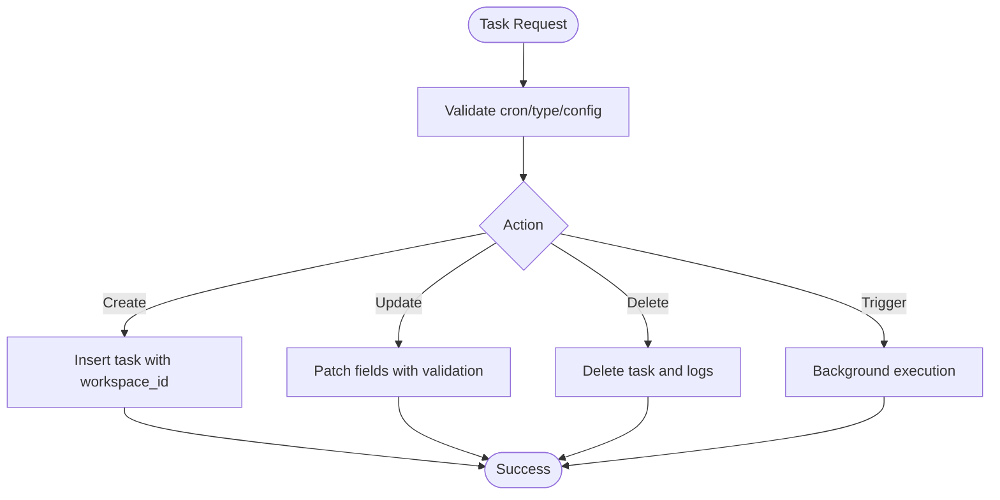
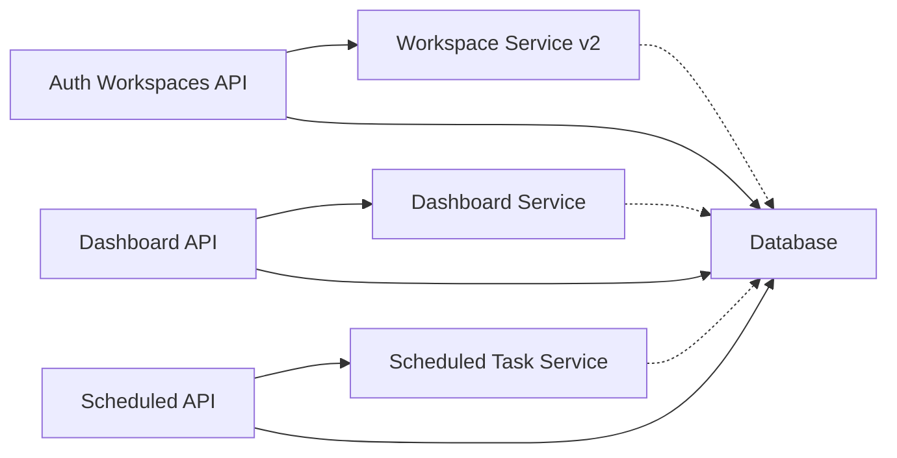

# Workspace Management

<cite>
**Referenced Files in This Document**
- [workspaces.py](file://services/authservice/api/workspaces.py)
- [workspace_service.py](file://services/dataflow/services/workspace_service.py)
- [workspace_service_v2.py](file://services/dataflow/services/workspace_service_v2.py)
- [dashboard.py](file://services/dataviz/api/dashboard.py)
- [scheduled.py](file://services/dataflow/api/scheduled.py)
- [auth.py](file://services/shared/common/auth.py)
- [workspace.ts](file://frontend/src/api/workspace.ts)
- [workspace_migration.sql](file://docker/mysql/workspace_migration.sql)
- [workspace_migration_v2.sql](file://docker/mysql/workspace_migration_v2.sql)
</cite>

## Table of Contents
1. Introduction
2. Project Structure
3. Core Components
4. Architecture Overview
5. Detailed Component Analysis
6. Dependency Analysis
7. Performance Considerations
8. Troubleshooting Guide
9. Conclusion
10. Appendices

## Introduction
This document provides comprehensive API documentation for workspace management with multi-tenant isolation and resource organization. It covers:
- Workspace CRUD operations, member management, and configuration settings
- Workspace-scoped resources: data sources, dashboards, scheduled tasks
- Data isolation mechanisms via workspace_id scoping
- Cross-workspace collaboration patterns through membership roles
- Examples for setup, user invitations, and resource sharing
- Notes on quotas, billing integration points, and administrative oversight
- Versioning support for workspace configurations and rollback procedures

## Project Structure
The workspace system spans multiple services:
- Authentication service exposes workspace endpoints for membership and tool binding
- Dataflow service provides workspace service logic (v1 and v2)
- Dataviz service exposes dashboard APIs scoped by workspace context
- Dataflow scheduled task API is workspace-scoped for tasks, logs, channels, templates
- Frontend SDK wraps workspace API calls
- Database migrations define workspace tables and add workspace_id to core entities

**Diagram sources**
- [workspaces.py:40-169](file://services/authservice/api/workspaces.py#L40-L169)
- [scheduled.py:92-168](file://services/dataflow/api/scheduled.py#L92-L168)
- [dashboard.py:97-121](file://services/dataviz/api/dashboard.py#L97-L121)
- [workspace_migration_v2.sql:58-120](file://docker/mysql/workspace_migration_v2.sql#L58-L120)

**Section sources**
- [workspaces.py:1-464](file://services/authservice/api/workspaces.py#L1-L464)
- [workspace_service.py:1-173](file://services/dataflow/services/workspace_service.py#L1-L173)
- [workspace_service_v2.py:1-417](file://services/dataflow/services/workspace_service_v2.py#L1-L417)
- [dashboard.py:1-388](file://services/dataviz/api/dashboard.py#L1-L388)
- [scheduled.py:1-446](file://services/dataflow/api/scheduled.py#L1-L446)
- [auth.py:88-99](file://services/shared/common/auth.py#L88-L99)
- [workspace.ts:1-142](file://frontend/src/api/workspace.ts#L1-L142)
- [workspace_migration.sql:1-129](file://docker/mysql/workspace_migration.sql#L1-L129)
- [workspace_migration_v2.sql:1-159](file://docker/mysql/workspace_migration_v2.sql#L1-L159)

## Core Components
- Workspace API (Auth Service): List, create, update, delete workspaces; manage users and default workspace; bind datasources and MCP servers; list workspace tools
- Workspace Service (Dataflow): Async helpers for workspace CRUD, user management, datasource association, primary datasource selection, and workspace context resolution
- Dashboard API (Dataviz): Workspace-scoped listing and creation; charts and snapshots; layout and refresh operations
- Scheduled Task API (Dataflow): Workspace-scoped tasks, logs, notification channels, report templates; manual trigger and stats
- Auth utilities: JWT validation, current user extraction, workspace ID extraction from query/header

**Section sources**
- [workspaces.py:40-169](file://services/authservice/api/workspaces.py#L40-L169)
- [workspace_service.py:20-165](file://services/dataflow/services/workspace_service.py#L20-L165)
- [workspace_service_v2.py:33-154](file://services/dataflow/services/workspace_service_v2.py#L33-L154)
- [dashboard.py:97-121](file://services/dataviz/api/dashboard.py#L97-L121)
- [scheduled.py:92-168](file://services/dataflow/api/scheduled.py#L92-L168)
- [auth.py:58-99](file://services/shared/common/auth.py#L58-L99)

## Architecture Overview
Multi-tenant isolation is enforced primarily by the workspace_id field added to core tables and by membership checks in workspace endpoints. The frontend sets or passes workspace context via headers/query parameters where applicable. Services enforce access control based on workspace membership and roles.

**Diagram sources**
- [workspaces.py:40-61](file://services/authservice/api/workspaces.py#L40-L61)
- [workspaces.py:204-243](file://services/authservice/api/workspaces.py#L204-L243)
- [workspace_service_v2.py:175-192](file://services/dataflow/services/workspace_service_v2.py#L175-L192)

**Section sources**
- [workspace_migration_v2.sql:58-120](file://docker/mysql/workspace_migration_v2.sql#L58-L120)
- [auth.py:88-99](file://services/shared/common/auth.py#L88-L99)

## Detailed Component Analysis

### Workspace CRUD and Membership
- List workspaces: Returns workspaces the current user belongs to, including role and default flag
- Create workspace: Creates a workspace and adds creator as owner
- Update workspace: Requires owner/admin or global admin; updates name/description/icon/color/config
- Delete workspace: Admin-only; removes memberships and datasource bindings
- Manage users: Add/remove users; cannot remove owner; supports role assignment
- Default workspace: Set per-user default workspace

**Diagram sources**
- [workspaces.py:40-169](file://services/authservice/api/workspaces.py#L40-L169)
- [workspaces.py:174-283](file://services/authservice/api/workspaces.py#L174-L283)
- [workspaces.py:302-323](file://services/authservice/api/workspaces.py#L302-L323)

**Section sources**
- [workspaces.py:40-169](file://services/authservice/api/workspaces.py#L40-L169)
- [workspaces.py:174-283](file://services/authservice/api/workspaces.py#L174-L283)
- [workspaces.py:302-323](file://services/authservice/api/workspaces.py#L302-L323)

### Workspace Tools and Resource Binding
- Get workspace tools: Lists datasources, MCP servers, agents bound to a workspace
- Bind/unbind datasources: Mark primary datasource; enforce admin role in workspace
- Bind/unbind MCP servers: Associate MCP servers with workspace

**Diagram sources**
- [workspaces.py:326-371](file://services/authservice/api/workspaces.py#L326-L371)
- [workspace_service.py:20-60](file://services/dataflow/services/workspace_service.py#L20-L60)
- [workspace_service.py:110-139](file://services/dataflow/services/workspace_service.py#L110-L139)

**Section sources**
- [workspaces.py:326-463](file://services/authservice/api/workspaces.py#L326-L463)
- [workspace_service.py:20-139](file://services/dataflow/services/workspace_service.py#L20-L139)

### Dashboard Resources (Workspace-Scoped)
- List dashboards: Scoped by workspace context extracted from request
- Create dashboard: Accepts workspace_id in payload; service enforces ownership/scoping
- Charts and snapshots: CRUD and refresh operations within dashboard scope
- Layout and reorder: Batch updates for chart positions

**Diagram sources**
- [dashboard.py:97-121](file://services/dataviz/api/dashboard.py#L97-L121)
- [auth.py:88-99](file://services/shared/common/auth.py#L88-L99)

**Section sources**
- [dashboard.py:97-388](file://services/dataviz/api/dashboard.py#L97-L388)

### Scheduled Tasks (Workspace-Scoped)
- List/create/update/delete tasks: All scoped by workspace_id
- Execution logs: Paginated listing, status updates, cleanup of stale logs
- Notification channels: Create/update/test/delete channels scoped by workspace
- Report templates: System built-in plus workspace custom templates

**Diagram sources**
- [scheduled.py:111-168](file://services/dataflow/api/scheduled.py#L111-L168)
- [scheduled.py:185-203](file://services/dataflow/api/scheduled.py#L185-L203)

**Section sources**
- [scheduled.py:92-446](file://services/dataflow/api/scheduled.py#L92-L446)

### Frontend SDK Integration
- Provides typed interfaces for workspace, datasources, MCP servers, agents
- Wraps endpoints for list/get/create/update/delete, set-default, tools, and resource bindings

**Section sources**
- [workspace.ts:1-142](file://frontend/src/api/workspace.ts#L1-L142)

## Dependency Analysis
- Workspace endpoints depend on authentication middleware and database connections
- Workspace service v2 introduces async methods and explicit workspace context handling
- Dashboard and scheduled APIs rely on workspace_id scoping for isolation
- Migrations ensure workspace_id exists across core tables and provide indexes for performance

**Diagram sources**
- [workspaces.py:40-169](file://services/authservice/api/workspaces.py#L40-L169)
- [workspace_service_v2.py:33-154](file://services/dataflow/services/workspace_service_v2.py#L33-L154)
- [dashboard.py:97-121](file://services/dataviz/api/dashboard.py#L97-L121)
- [scheduled.py:92-168](file://services/dataflow/api/scheduled.py#L92-L168)

**Section sources**
- [workspace_migration_v2.sql:58-120](file://docker/mysql/workspace_migration_v2.sql#L58-L120)

## Performance Considerations
- Use workspace_id indexes added in migration v2 to optimize queries across tables
- Prefer primary datasource selection to reduce fallback queries
- Paginate scheduled task logs and lists to avoid large payloads
- Avoid unnecessary JSON parsing; parse config fields only when needed

[No sources needed since this section provides general guidance]

## Troubleshooting Guide
Common issues and resolutions:
- Permission denied when updating/deleting workspaces: Ensure requester has owner/admin role or global admin
- Cannot remove owner: Enforced by endpoint logic
- Invalid cron expression: Validated before task creation/update
- Stale running logs: Use cleanup endpoint to mark old running logs as timeout
- Missing workspace context: Ensure workspace_id is passed via query parameter or header where required

**Section sources**
- [workspaces.py:96-169](file://services/authservice/api/workspaces.py#L96-L169)
- [workspaces.py:246-283](file://services/authservice/api/workspaces.py#L246-L283)
- [scheduled.py:111-168](file://services/dataflow/api/scheduled.py#L111-L168)
- [scheduled.py:265-271](file://services/dataflow/api/scheduled.py#L265-L271)

## Conclusion
The workspace management system provides robust multi-tenant isolation through workspace_id scoping and membership-based access control. It supports full lifecycle management of workspaces, members, and associated resources like datasources, dashboards, and scheduled tasks. Administrative capabilities include deletion and role enforcement, while versioning and rollback strategies can be implemented using workspace config fields and audit logs.

[No sources needed since this section summarizes without analyzing specific files]

## Appendices

### API Reference Summary

- Workspace CRUD
  - GET /workspaces: List workspaces for current user
  - POST /workspaces: Create workspace (creator becomes owner)
  - PUT /workspaces/{id}: Update workspace (owner/admin or global admin)
  - DELETE /workspaces/{id}: Delete workspace (admin only)

- Member Management
  - GET /workspaces/{id}/users: List users in workspace
  - POST /workspaces/{id}/users: Add user with role
  - DELETE /workspaces/{id}/users/{target_user_id}: Remove user (not owner)
  - POST /workspaces/{id}/set-default: Set user's default workspace

- Workspace Tools and Resources
  - GET /workspaces/{id}/tools: List datasources, MCP servers, agents
  - POST /workspaces/{id}/datasources?datasource_id=&is_primary=: Bind datasource
  - DELETE /workspaces/{id}/datasources/{datasource_id}: Unbind datasource
  - POST /workspaces/{id}/mcp-servers?mcp_server_id=: Bind MCP server
  - DELETE /workspaces/{id}/mcp-servers/{mcp_server_id}: Unbind MCP server

- Dashboard (Workspace-Scoped)
  - GET /dashboards: List dashboards (workspace context)
  - POST /dashboards: Create dashboard (include workspace_id)
  - GET /dashboards/{id}: Get dashboard with charts
  - PUT /dashboards/{id}: Update dashboard
  - DELETE /dashboards/{id}: Delete dashboard
  - POST /dashboards/{id}/charts: Add chart
  - PUT /dashboards/{id}/charts/{chart_id}: Update chart
  - DELETE /dashboards/{id}/charts/{chart_id}: Remove chart
  - POST /dashboards/{id}/charts/{chart_id}/refresh: Refresh chart
  - POST /dashboards/{id}/refresh: Refresh all charts
  - PUT /dashboards/{id}/layout: Batch update chart positions

- Scheduled Tasks (Workspace-Scoped)
  - GET /tasks: List tasks (workspace filter)
  - POST /tasks: Create task (validate cron/type/config)
  - PUT /tasks/{id}: Update task
  - DELETE /tasks/{id}: Delete task
  - PATCH /tasks/{id}/toggle: Enable/disable task
  - POST /tasks/{id}/trigger: Manual trigger (background)
  - GET /tasks/{id}/logs: List execution logs
  - PATCH /logs/{id}/status: Update log status
  - POST /logs/cleanup-stale: Cleanup stale running logs
  - GET /channels: List notification channels (workspace filter)
  - POST /channels: Create channel (workspace scoped)
  - PUT /channels/{id}: Update channel
  - DELETE /channels/{id}: Delete channel
  - POST /channels/{id}/test: Test channel connectivity
  - GET /templates: List report templates (system + workspace)
  - POST /templates: Create template (workspace scoped)
  - PUT /templates/{id}: Update template
  - DELETE /templates/{id}: Delete template

**Section sources**
- [workspaces.py:40-463](file://services/authservice/api/workspaces.py#L40-L463)
- [dashboard.py:97-388](file://services/dataviz/api/dashboard.py#L97-L388)
- [scheduled.py:92-446](file://services/dataflow/api/scheduled.py#L92-L446)

### Data Isolation and Migration Details
- Workspace tables and associations created in migrations
- workspace_id added to core tables for isolation
- Indexes added for performance
- Default workspace and memberships seeded during migration

**Section sources**
- [workspace_migration.sql:1-129](file://docker/mysql/workspace_migration.sql#L1-L129)
- [workspace_migration_v2.sql:1-159](file://docker/mysql/workspace_migration_v2.sql#L1-L159)

### Quotas, Billing, and Administrative Oversight
- Quotas and billing integration points are not explicitly implemented in the analyzed codebase
- Administrative oversight includes audit logging and workspace deletion capabilities
- Role-based access control ensures only authorized users can perform sensitive operations

[No sources needed since this section provides general guidance]

### Versioning and Rollback Procedures
- Workspace configuration stored as JSON in config field
- Versioning can be implemented by maintaining versioned configs and audit logs
- Rollback procedures involve restoring previous config versions and re-applying changes

**Section sources**
- [workspaces.py:64-93](file://services/authservice/api/workspaces.py#L64-L93)
- [workspace_service_v2.py:70-134](file://services/dataflow/services/workspace_service_v2.py#L70-L134)