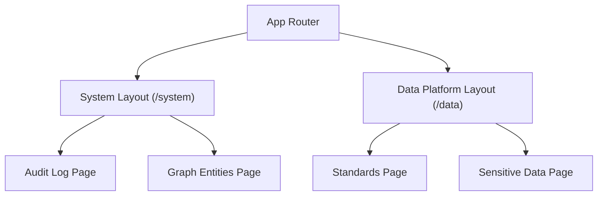
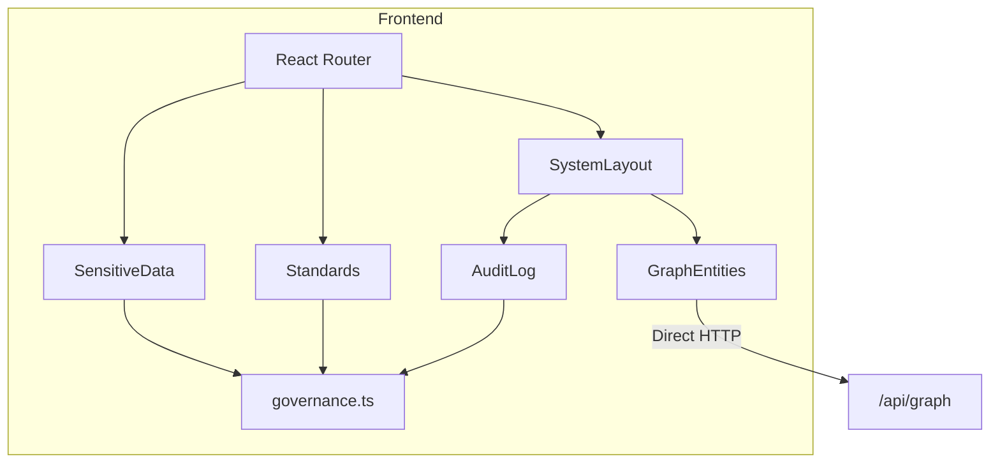
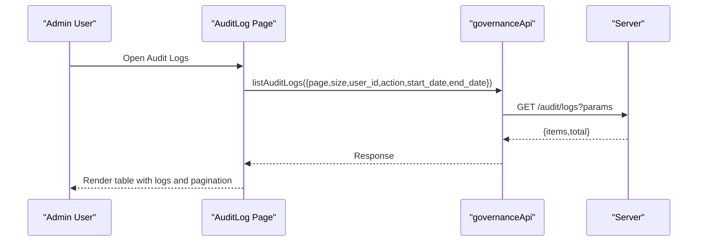
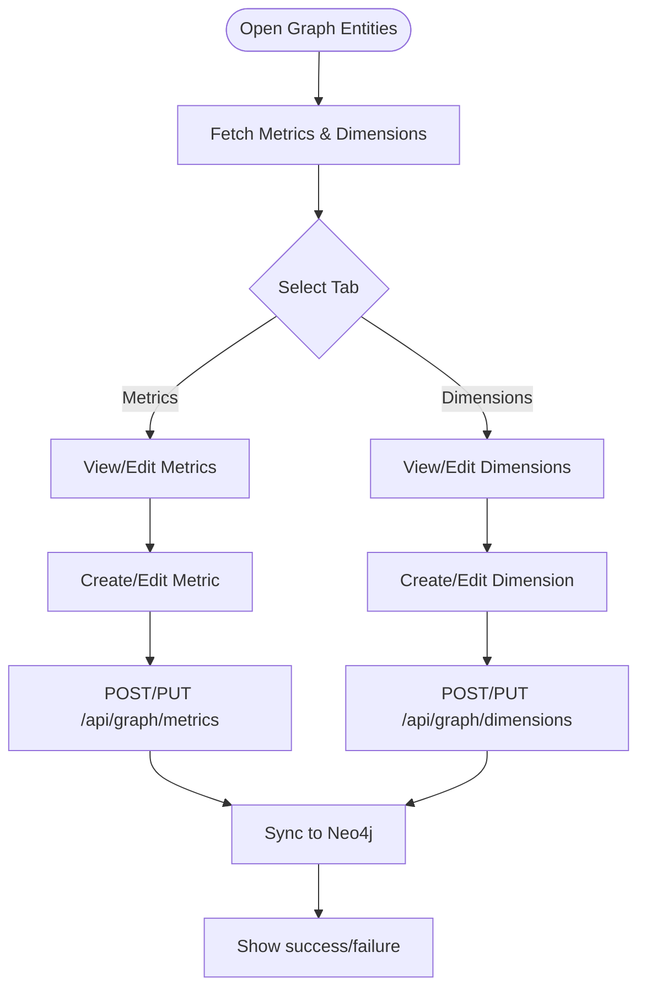
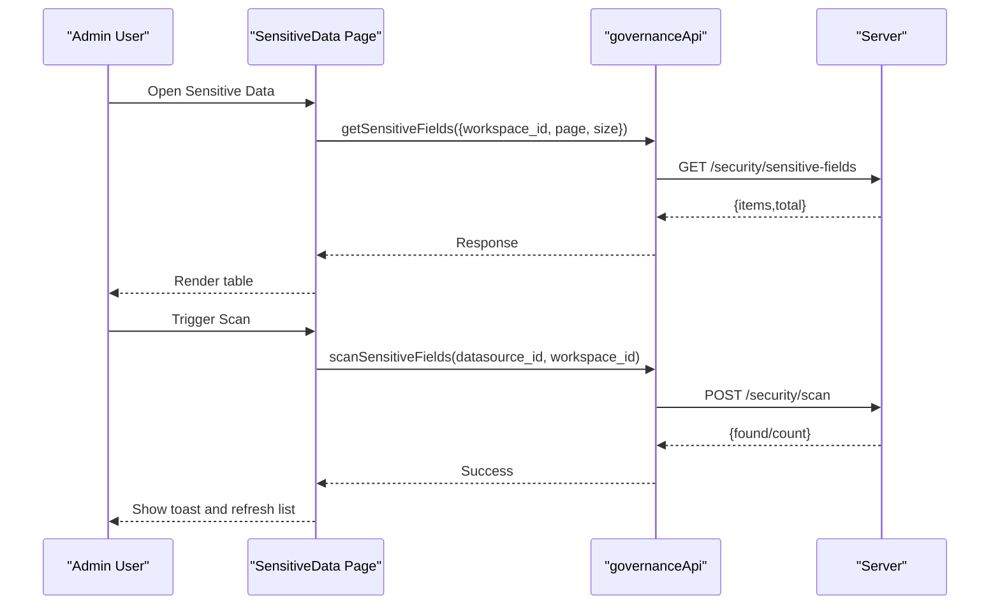
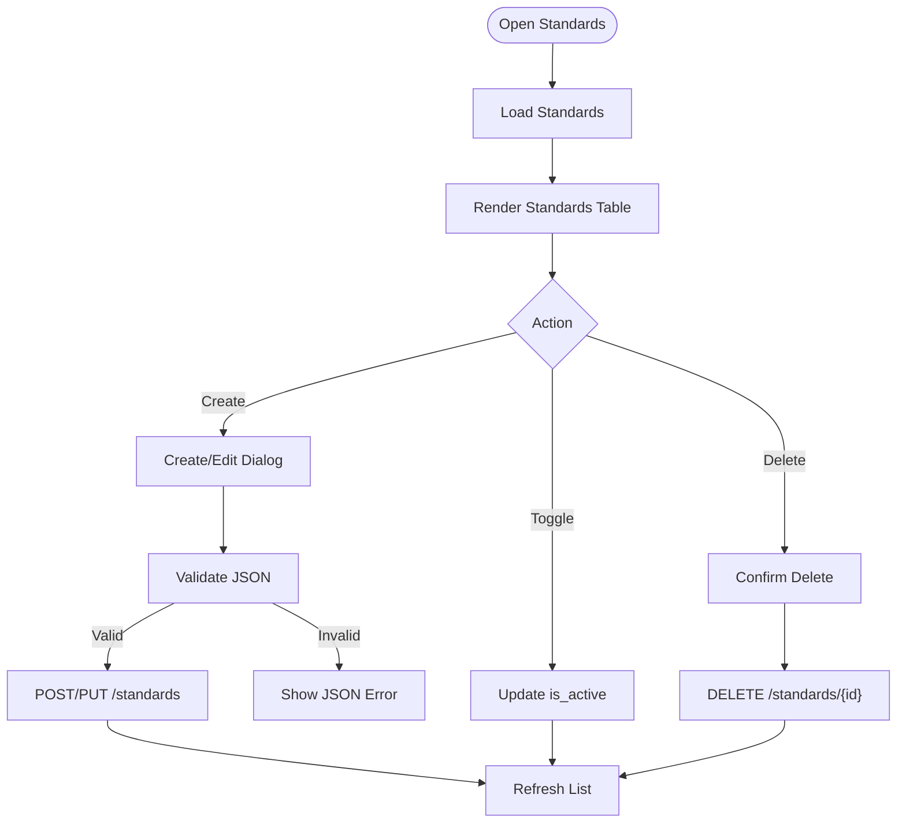
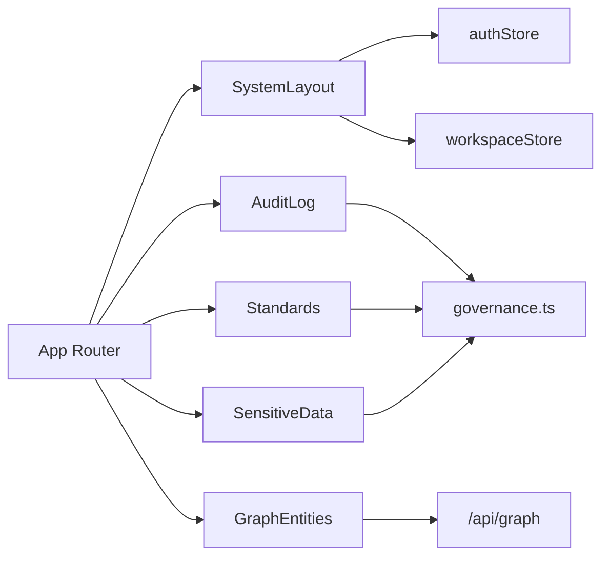

# Admin Panel Interface

<cite>
**Referenced Files in This Document**
- [App.tsx](file://frontend/src/App.tsx)
- [SystemLayout.tsx](file://frontend/src/components/SystemLayout.tsx)
- [Admin.tsx](file://frontend/src/pages/Admin.tsx)
- [AuditLog.tsx](file://frontend/src/pages/admin/AuditLog.tsx)
- [GraphEntities.tsx](file://frontend/src/pages/admin/GraphEntities.tsx)
- [SensitiveData.tsx](file://frontend/src/pages/admin/SensitiveData.tsx)
- [Standards.tsx](file://frontend/src/pages/admin/Standards.tsx)
- [governance.ts](file://frontend/src/api/governance.ts)
</cite>

## Table of Contents
1. Introduction
2. Project Structure
3. Core Components
4. Architecture Overview
5. Detailed Component Analysis
6. Dependency Analysis
7. Performance Considerations
8. Troubleshooting Guide
9. Conclusion

## Introduction
This document explains the AI-DataHub admin panel interface with a focus on administrative modules for audit logging, graph entity management, sensitive data handling, and data standards management. It describes navigation, UI components, form interactions, data visualization features, and step-by-step workflows for common administrative tasks such as viewing audit logs, managing data entities, configuring sensitive data rules, and maintaining data quality standards.

## Project Structure
The admin panel is organized under three primary areas:
- System configuration mode at /system/* with a sidebar menu that includes Audit Logs and other system tools.
- Data platform mode at /data/* that exposes governance-related pages like Standards and Sensitive Data.
- A shared Admin page used to embed specific tabs (e.g., users, brand settings).

**Diagram sources**
- [App.tsx:107-160](file://frontend/src/App.tsx#L107-L160)
- [SystemLayout.tsx:34-54](file://frontend/src/components/SystemLayout.tsx#L34-L54)

**Section sources**
- [App.tsx:96-160](file://frontend/src/App.tsx#L96-L160)
- [SystemLayout.tsx:34-54](file://frontend/src/components/SystemLayout.tsx#L34-L54)

## Core Components
- Navigation and layout: The SystemLayout provides a collapsible sidebar with sections for AI templates, knowledge management, integrations, permissions, and system tools. It renders an Outlet for child routes and supports theme switching and user actions.
- Routing: App.tsx defines routes for /system, /data, and workspace-scoped paths. It maps admin features like Audit Logs, Standards, and Sensitive Data to their respective pages.
- Shared API client: governance.ts centralizes API calls for roles, audit logs, standards, and sensitive fields, including pagination and workspace context.

Key responsibilities:
- SystemLayout: Renders navigation, handles non-admin redirection, and manages mobile/desktop menus.
- App routing: Declares protected routes and redirects legacy URLs.
- Governance API: Encapsulates endpoints for audit logs, standards, and sensitive data operations.

**Section sources**
- [SystemLayout.tsx:56-199](file://frontend/src/components/SystemLayout.tsx#L56-L199)
- [App.tsx:96-160](file://frontend/src/App.tsx#L96-L160)
- [governance.ts:57-95](file://frontend/src/api/governance.ts#L57-L95)

## Architecture Overview
The admin panel follows a React SPA architecture with route-based layouts and modular pages. Each admin module is a self-contained component that fetches data via the governance API or direct HTTP calls and renders tables, dialogs, and forms.

**Diagram sources**
- [App.tsx:107-160](file://frontend/src/App.tsx#L107-L160)
- [SystemLayout.tsx:34-54](file://frontend/src/components/SystemLayout.tsx#L34-L54)
- [governance.ts:57-95](file://frontend/src/api/governance.ts#L57-L95)
- [GraphEntities.tsx:54-59](file://frontend/src/pages/admin/GraphEntities.tsx#L54-L59)

## Detailed Component Analysis

### Audit Logging
Purpose:
- View and filter system operation logs by user, action type, and date range.
- Paginate results and refresh the list.

User interface:
- Filters: User ID input, Action dropdown (create/update/delete/login/logout/query/export/import/execute), Start Date, End Date.
- Table columns: User, Action (with color-coded badges), Target Type, Target ID, Detail, IP Address, Time.
- Pagination controls and refresh button.

Form interactions:
- Clicking Refresh triggers a GET request to list audit logs with current filters and pagination.
- Changing any filter resets to page 1 and reloads.

Data flow:
- Calls governanceApi.listAuditLogs(params) which uses client.get('/audit/logs', { params }).
- Displays items and total count; shows loading state while fetching.

Common tasks:
- Viewing recent activity: Open Audit Logs from System menu, optionally filter by action or date, then review entries.
- Investigating a user’s actions: Enter User ID and apply filters to narrow down logs.

**Diagram sources**
- [AuditLog.tsx:50-68](file://frontend/src/pages/admin/AuditLog.tsx#L50-L68)
- [governance.ts:68-76](file://frontend/src/api/governance.ts#L68-L76)

**Section sources**
- [AuditLog.tsx:40-213](file://frontend/src/pages/admin/AuditLog.tsx#L40-L213)
- [governance.ts:68-76](file://frontend/src/api/governance.ts#L68-L76)

### Graph Entity Management
Purpose:
- Manage metrics and dimensions used for analysis and knowledge graphs.
- Sync configured entities to Neo4j.

User interface:
- Tabs for Metrics and Dimensions.
- Stats cards showing counts and status.
- Search bar to filter by name, English name, or category.
- CRUD dialogs for creating/editing metrics and dimensions.
- Sync button to push changes to the graph database.

Form interactions:
- Metric dialog fields: name, name_en, formula, unit, agg_type, target_table, target_column, category, description.
- Dimension dialog fields: name, name_en, level, hierarchy (JSON), target_table, target_column, category, description.
- Create/Update/Delete operations call backend endpoints under /api/graph.

Data flow:
- Fetch metrics and dimensions via axios to /api/graph/metrics and /api/graph/dimensions.
- Sync triggers POST /api/graph/sync and reports success with counts.

Common tasks:
- Adding a metric: Open Metrics tab, click Add, fill fields, save.
- Editing a dimension: Open Dimensions tab, edit desired entry, update.
- Syncing to graph: Click Sync to Neo4j and confirm success message.

**Diagram sources**
- [GraphEntities.tsx:88-111](file://frontend/src/pages/admin/GraphEntities.tsx#L88-L111)
- [GraphEntities.tsx:115-173](file://frontend/src/pages/admin/GraphEntities.tsx#L115-L173)
- [GraphEntities.tsx:177-234](file://frontend/src/pages/admin/GraphEntities.tsx#L177-L234)
- [GraphEntities.tsx:238-252](file://frontend/src/pages/admin/GraphEntities.tsx#L238-L252)

**Section sources**
- [GraphEntities.tsx:63-630](file://frontend/src/pages/admin/GraphEntities.tsx#L63-L630)

### Sensitive Data Handling
Purpose:
- Identify and configure sensitive fields across datasources with sensitivity levels and masking strategies.
- Scan datasources to auto-detect sensitive fields.

User interface:
- List table showing table_name, column_name, sensitivity_level (color-coded), mask_type, datasource_id, created_at.
- Actions: Add field, Edit, Delete, Refresh.
- Auto-scan bar: Input datasource ID and trigger scan to discover sensitive fields.

Form interactions:
- Create/Edit dialog fields: datasource_id, table_name, column_name, sensitivity_level (low/medium/high/critical), mask_type (full_mask/partial_mask/hash/encrypt/truncate/redact).
- Validation ensures required fields are present before saving.
- Delete confirmation dialog prevents accidental removal.

Data flow:
- Loads sensitive fields via governanceApi.getSensitiveFields with workspace context.
- Creates/updates/deletes via governanceApi methods.
- Scans via governanceApi.scanSensitiveFields with datasource_id and workspace_id.

Common tasks:
- Adding a sensitive rule: Click Add, fill fields, save.
- Scanning a datasource: Enter datasource ID, click Scan, view discovered fields.
- Updating a rule: Edit existing entry, adjust sensitivity or mask type, save.

**Diagram sources**
- [SensitiveData.tsx:70-84](file://frontend/src/pages/admin/SensitiveData.tsx#L70-L84)
- [SensitiveData.tsx:145-162](file://frontend/src/pages/admin/SensitiveData.tsx#L145-L162)
- [governance.ts:88-95](file://frontend/src/api/governance.ts#L88-L95)

**Section sources**
- [SensitiveData.tsx:57-409](file://frontend/src/pages/admin/SensitiveData.tsx#L57-L409)
- [governance.ts:88-95](file://frontend/src/api/governance.ts#L88-L95)

### Data Standards Management
Purpose:
- Define and manage data standards for naming, encoding, measurement, and format compliance.
- Toggle active status to enable/disable enforcement.

User interface:
- Table listing standard name, type (color-coded), description, active toggle, created_at.
- Create/Edit dialog with JSON rule configuration and validation feedback.
- Delete confirmation dialog.

Form interactions:
- Fields: name, standard_type (naming/encoding/measurement/format), description, rule_config (JSON).
- On save, validates JSON; if invalid, displays error message.
- Toggle switch updates is_active via updateStandard.

Data flow:
- Loads standards via governanceApi.listStandards with workspace context.
- Creates/updates/deletes via governanceApi methods.
- Toggles active status using updateStandard with is_active flag.

Common tasks:
- Creating a standard: Click New Standard, select type, enter name/description, provide JSON rule config, save.
- Enabling/disabling: Use toggle switch to activate or deactivate a standard.
- Editing rules: Open edit dialog, modify JSON, save with validation.

**Diagram sources**
- [Standards.tsx:59-73](file://frontend/src/pages/admin/Standards.tsx#L59-L73)
- [Standards.tsx:94-125](file://frontend/src/pages/admin/Standards.tsx#L94-L125)
- [Standards.tsx:139-148](file://frontend/src/pages/admin/Standards.tsx#L139-L148)
- [governance.ts:78-86](file://frontend/src/api/governance.ts#L78-L86)

**Section sources**
- [Standards.tsx:47-352](file://frontend/src/pages/admin/Standards.tsx#L47-L352)
- [governance.ts:78-86](file://frontend/src/api/governance.ts#L78-L86)

### Navigation and Access Control
- SystemLayout restricts access to non-admin users by redirecting them back to the workspace chat.
- Sidebar menu groups features into sections: AI template configuration, knowledge management, integration configuration, permission management, and system tools.
- Routes under /system include models, agents, workflows, prompts, knowledge base, notification channels, report templates, users, workspaces, roles, audit logs, and monitoring.

Common navigation steps:
- From the main app, navigate to /system to access the system configuration area.
- Use the sidebar to jump to Audit Logs, Roles, Users, Workspaces, etc.
- Return to workspace via “Back to Workspace” button.

**Section sources**
- [SystemLayout.tsx:70-76](file://frontend/src/components/SystemLayout.tsx#L70-L76)
- [SystemLayout.tsx:34-54](file://frontend/src/components/SystemLayout.tsx#L34-L54)
- [App.tsx:140-160](file://frontend/src/App.tsx#L140-L160)

## Dependency Analysis
- Pages depend on the governance API for standardized operations (audit logs, standards, sensitive fields).
- Graph Entities uses direct HTTP calls to /api/graph endpoints for metrics and dimensions.
- SystemLayout depends on auth store for user role checks and workspace store for default workspace context.
- App routes connect UI components to URL paths, enabling deep linking and navigation.

**Diagram sources**
- [governance.ts:57-95](file://frontend/src/api/governance.ts#L57-L95)
- [GraphEntities.tsx:54-59](file://frontend/src/pages/admin/GraphEntities.tsx#L54-L59)
- [SystemLayout.tsx:17-20](file://frontend/src/components/SystemLayout.tsx#L17-L20)
- [App.tsx:140-160](file://frontend/src/App.tsx#L140-L160)

**Section sources**
- [governance.ts:57-95](file://frontend/src/api/governance.ts#L57-L95)
- [GraphEntities.tsx:54-59](file://frontend/src/pages/admin/GraphEntities.tsx#L54-L59)
- [SystemLayout.tsx:17-20](file://frontend/src/components/SystemLayout.tsx#L17-L20)
- [App.tsx:140-160](file://frontend/src/App.tsx#L140-L160)

## Performance Considerations
- Pagination: Most lists implement server-side pagination to reduce payload sizes and improve rendering performance.
- Loading states: Spinners and disabled buttons prevent redundant requests during async operations.
- Filtering: Client-side search in Graph Entities reduces network calls but may impact large datasets; consider server-side filtering for scalability.
- Toast notifications: Provide immediate feedback without blocking the UI.

[No sources needed since this section provides general guidance]

## Troubleshooting Guide
Common issues and resolutions:
- Audit logs not loading: Check network errors and ensure filters are valid; verify authentication token presence.
- Sensitive data scan fails: Ensure datasource_id is correct and workspace context is set; check server response for error messages.
- Standards JSON validation error: Fix malformed JSON in rule_config; use a validator tool to confirm syntax.
- Graph sync failures: Verify /api/graph endpoints availability and authentication headers; check Neo4j connectivity.

Error handling patterns:
- Try-catch blocks around API calls display toast errors on failure.
- Confirmation dialogs prevent accidental deletions.
- Disabled states on buttons indicate ongoing operations.

**Section sources**
- [AuditLog.tsx:50-68](file://frontend/src/pages/admin/AuditLog.tsx#L50-L68)
- [SensitiveData.tsx:104-131](file://frontend/src/pages/admin/SensitiveData.tsx#L104-L131)
- [Standards.tsx:94-125](file://frontend/src/pages/admin/Standards.tsx#L94-L125)
- [GraphEntities.tsx:115-173](file://frontend/src/pages/admin/GraphEntities.tsx#L115-L173)

## Conclusion
The AI-DataHub admin panel provides a cohesive interface for administrators to monitor system activity, manage analytical entities, enforce data security through sensitive field rules, and maintain data quality via standards. With clear navigation, robust forms, and consistent data flows, administrators can efficiently perform CRUD operations, configure policies, and keep systems healthy. For best results, leverage pagination, validate inputs, and use confirmation dialogs to avoid unintended changes.