# Administration

<cite>
**Referenced Files in This Document**
- [PromptManager.tsx](file://frontend/src/pages/admin/PromptManager.tsx)
- [ModelCenter.tsx](file://frontend/src/pages/admin/ModelCenter.tsx)
- [WorkflowConfig.tsx](file://frontend/src/pages/admin/WorkflowConfig.tsx)
- [ScheduledTasks.tsx](file://frontend/src/pages/admin/ScheduledTasks.tsx)
- [NotificationChannels.tsx](file://frontend/src/pages/admin/NotificationChannels.tsx)
- [ReportTemplates.tsx](file://frontend/src/pages/admin/ReportTemplates.tsx)
- [MCPMarket.tsx](file://frontend/src/pages/admin/MCPMarket.tsx)
- [DataManagement.tsx](file://frontend/src/pages/admin/DataManagement.tsx)
- [scheduled.py](file://services/dataflow/api/scheduled.py)
- [model_config.py](file://services/aiplatform/api/model_config.py)
- [mcp_market.py](file://services/aiplatform/api/mcp_market.py)
- [admin_compat.py](file://services/datacatalog/api/admin_compat.py)
- [langfuse_client.py](file://services/shared/common/llm/langfuse_client.py)
</cite>

## Table of Contents
1. Introduction
2. Project Structure
3. Core Components
4. Architecture Overview
5. Detailed Component Analysis
6. Dependency Analysis
7. Performance Considerations
8. Troubleshooting Guide
9. Conclusion

## Introduction
This document provides comprehensive administration guidance for the AI-DataHub system. It covers the admin panel interface and backend capabilities for:
- User management, workspace administration, and system monitoring
- Prompt management with versioning and rollback
- Workflow configuration for Loop Engineering pipeline steps
- Agent configuration including enabling/disabling agents and datasources
- Scheduled task administration (cron jobs), notification channels, and report templates
- Model center for LLM providers and models
- MCP market for browsing and installing external tools
- Data management for table metadata, business terms, and SQL templates
- Monitoring and observability using Langfuse for LLM tracing, token usage tracking, and cost monitoring

The goal is to help administrators configure, operate, and maintain AI-DataHub effectively across all administrative domains.

## Project Structure
AI-DataHub exposes a rich admin UI under frontend/src/pages/admin that integrates with backend services:
- Frontend admin pages provide interactive interfaces for prompts, workflows, scheduled tasks, notifications, templates, model center, MCP market, and data management.
- Backend APIs implement CRUD operations, validation, execution scheduling, and integrations (e.g., MCP market, LLM config, metadata).

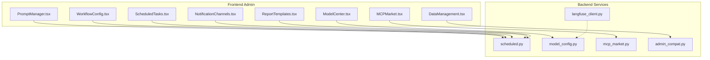

**Diagram sources**
- [PromptManager.tsx:100-179](file://frontend/src/pages/admin/PromptManager.tsx#L100-L179)
- [ModelCenter.tsx:11-59](file://frontend/src/pages/admin/ModelCenter.tsx#L11-L59)
- [WorkflowConfig.tsx:209-298](file://frontend/src/pages/admin/WorkflowConfig.tsx#L209-L298)
- [ScheduledTasks.tsx:71-122](file://frontend/src/pages/admin/ScheduledTasks.tsx#L71-L122)
- [NotificationChannels.tsx:75-148](file://frontend/src/pages/admin/NotificationChannels.tsx#L75-L148)
- [ReportTemplates.tsx:69-143](file://frontend/src/pages/admin/ReportTemplates.tsx#L69-L143)
- [MCPMarket.tsx:310-340](file://frontend/src/pages/admin/MCPMarket.tsx#L310-L340)
- [DataManagement.tsx:9-59](file://frontend/src/pages/admin/DataManagement.tsx#L9-L59)
- [scheduled.py:92-203](file://services/dataflow/api/scheduled.py#L92-L203)
- [model_config.py:58-117](file://services/aiplatform/api/model_config.py#L58-L117)
- [mcp_market.py:18-107](file://services/aiplatform/api/mcp_market.py#L18-L107)
- [admin_compat.py:17-179](file://services/datacatalog/api/admin_compat.py#L17-L179)
- [langfuse_client.py:29-67](file://services/shared/common/llm/langfuse_client.py#L29-L67)

**Section sources**
- [PromptManager.tsx:100-179](file://frontend/src/pages/admin/PromptManager.tsx#L100-L179)
- [ModelCenter.tsx:11-59](file://frontend/src/pages/admin/ModelCenter.tsx#L11-L59)
- [WorkflowConfig.tsx:209-298](file://frontend/src/pages/admin/WorkflowConfig.tsx#L209-L298)
- [ScheduledTasks.tsx:71-122](file://frontend/src/pages/admin/ScheduledTasks.tsx#L71-L122)
- [NotificationChannels.tsx:75-148](file://frontend/src/pages/admin/NotificationChannels.tsx#L75-L148)
- [ReportTemplates.tsx:69-143](file://frontend/src/pages/admin/ReportTemplates.tsx#L69-L143)
- [MCPMarket.tsx:310-340](file://frontend/src/pages/admin/MCPMarket.tsx#L310-L340)
- [DataManagement.tsx:9-59](file://frontend/src/pages/admin/DataManagement.tsx#L9-L59)
- [scheduled.py:92-203](file://services/dataflow/api/scheduled.py#L92-L203)
- [model_config.py:58-117](file://services/aiplatform/api/model_config.py#L58-L117)
- [mcp_market.py:18-107](file://services/aiplatform/api/mcp_market.py#L18-L107)
- [admin_compat.py:17-179](file://services/datacatalog/api/admin_compat.py#L17-L179)
- [langfuse_client.py:29-67](file://services/shared/common/llm/langfuse_client.py#L29-L67)

## Core Components
- Prompt Management: Create, edit, version, and rollback prompt templates used by agents and pipelines. Supports variable substitution and change logs.
- Workflow Configuration: Visualize and understand quick, deep, and agent modes; select retrieval strategies for metadata search.
- Scheduled Tasks: Manage cron-based tasks (SQL or agent), toggle activation, trigger manually, view logs, and clean up stale runs.
- Notification Channels: Configure DingTalk, Feishu, WeCom, Email, Webhook; test connectivity; customize message templates.
- Report Templates: Author Markdown/HTML reports with Jinja2 variables; preview and manage built-in vs custom templates.
- Model Center: Configure LLM providers/models, set defaults, manage embedding models, and update system configs.
- MCP Market: Browse registry, import from npm, install MCP servers with environment variables and extra args.
- Data Management: View/edit table metadata, relations, SQL templates, business terms, and run queries in playground.

**Section sources**
- [PromptManager.tsx:100-179](file://frontend/src/pages/admin/PromptManager.tsx#L100-L179)
- [WorkflowConfig.tsx:6-118](file://frontend/src/pages/admin/WorkflowConfig.tsx#L6-L118)
- [ScheduledTasks.tsx:71-122](file://frontend/src/pages/admin/ScheduledTasks.tsx#L71-L122)
- [NotificationChannels.tsx:75-148](file://frontend/src/pages/admin/NotificationChannels.tsx#L75-L148)
- [ReportTemplates.tsx:69-143](file://frontend/src/pages/admin/ReportTemplates.tsx#L69-L143)
- [ModelCenter.tsx:11-59](file://frontend/src/pages/admin/ModelCenter.tsx#L11-L59)
- [MCPMarket.tsx:310-340](file://frontend/src/pages/admin/MCPMarket.tsx#L310-L340)
- [DataManagement.tsx:9-59](file://frontend/src/pages/admin/DataManagement.tsx#L9-L59)

## Architecture Overview
The admin workflow spans frontend components calling backend APIs, which orchestrate services and storage. Observability via Langfuse can be enabled to trace LLM calls.

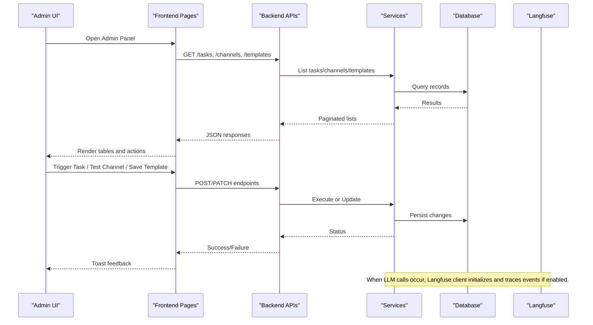

**Diagram sources**
- [scheduled.py:92-203](file://services/dataflow/api/scheduled.py#L92-L203)
- [model_config.py:58-117](file://services/aiplatform/api/model_config.py#L58-L117)
- [mcp_market.py:18-107](file://services/aiplatform/api/mcp_market.py#L18-L107)
- [admin_compat.py:17-179](file://services/datacatalog/api/admin_compat.py#L17-L179)
- [langfuse_client.py:29-67](file://services/shared/common/llm/langfuse_client.py#L29-L67)

## Detailed Component Analysis

### Prompt Management
Administrators can create new prompts, edit them (which creates a new version), view version history, and roll back to previous versions. The UI supports searching, grouping by key, and viewing system/user prompt templates with variable references.

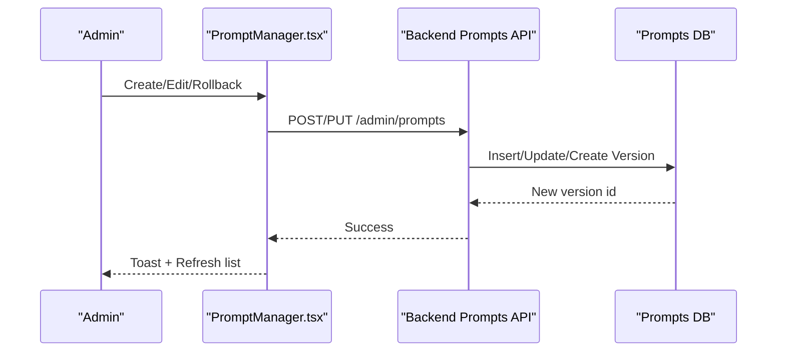

**Diagram sources**
- [PromptManager.tsx:100-179](file://frontend/src/pages/admin/PromptManager.tsx#L100-L179)

**Section sources**
- [PromptManager.tsx:100-179](file://frontend/src/pages/admin/PromptManager.tsx#L100-L179)

### Workflow Configuration
The Workflow Config page documents three query modes:
- Quick mode: Fast RAG retrieval, suitable for simple single-table queries.
- Deep mode: Full RAG with loop self-repair for complex multi-table queries and result analysis.
- Agent mode: Autonomous decision-making with tool and MCP integration.

Retrieval strategies include full_table, column_first, two_stage, and bidirectional, each suited to different scenarios.

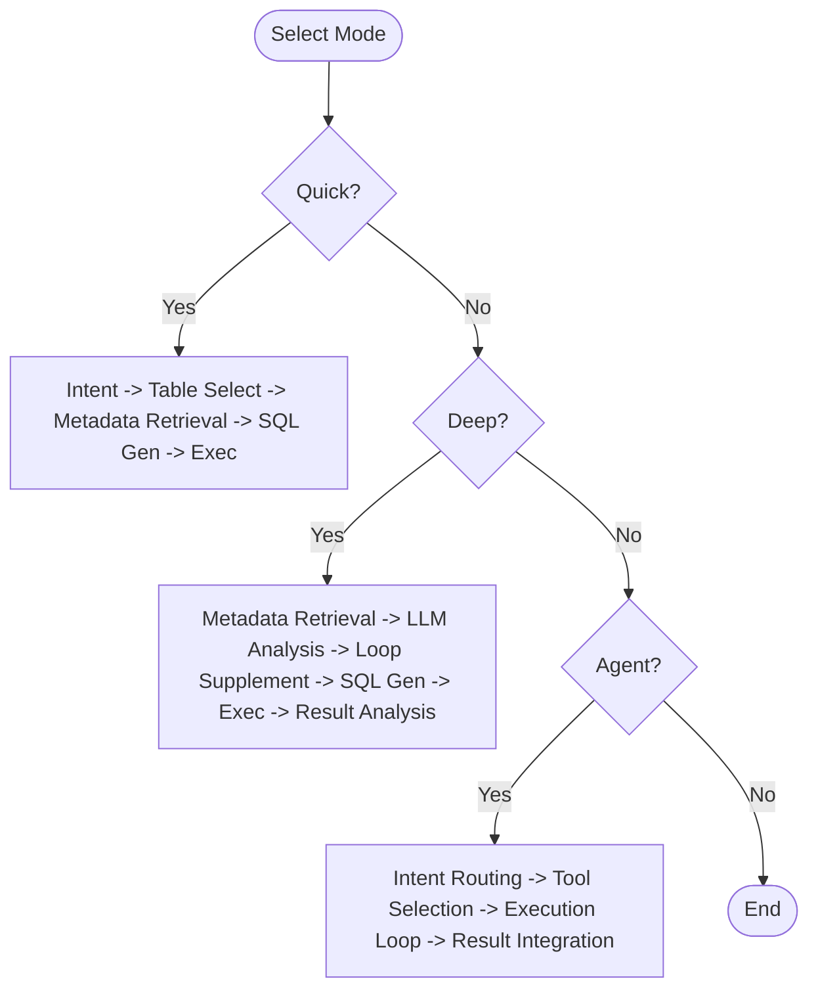

**Diagram sources**
- [WorkflowConfig.tsx:6-118](file://frontend/src/pages/admin/WorkflowConfig.tsx#L6-L118)

**Section sources**
- [WorkflowConfig.tsx:6-118](file://frontend/src/pages/admin/WorkflowConfig.tsx#L6-L118)

### Scheduled Task Administration
Manage cron-based tasks for SQL or agent execution. Administrators can:
- List, create, update, delete tasks
- Toggle activation
- Manually trigger tasks
- View execution logs and stats
- Clean up stale running logs

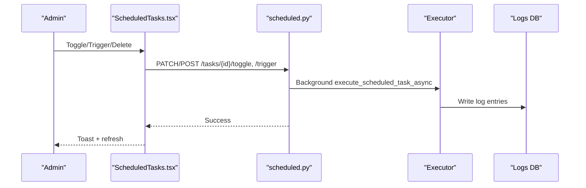

**Diagram sources**
- [ScheduledTasks.tsx:71-122](file://frontend/src/pages/admin/ScheduledTasks.tsx#L71-L122)
- [scheduled.py:111-203](file://services/dataflow/api/scheduled.py#L111-L203)

**Section sources**
- [ScheduledTasks.tsx:71-122](file://frontend/src/pages/admin/ScheduledTasks.tsx#L71-L122)
- [scheduled.py:92-203](file://services/dataflow/api/scheduled.py#L92-L203)

### Notification Channels
Configure multiple channel types (DingTalk, Feishu, WeCom, Email, Webhook) with per-channel configuration fields and message templates. Test connectivity directly from the UI.

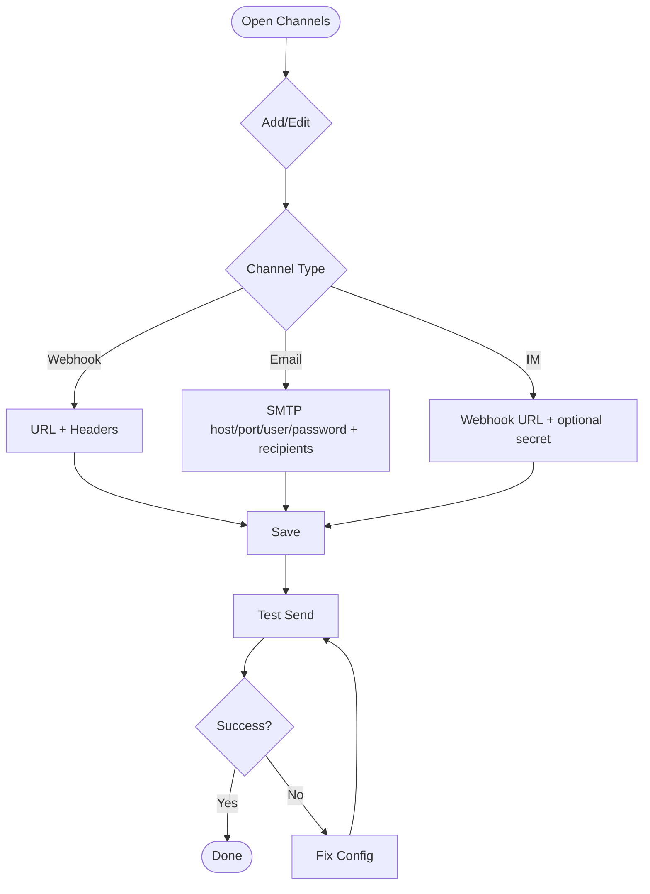

**Diagram sources**
- [NotificationChannels.tsx:75-148](file://frontend/src/pages/admin/NotificationChannels.tsx#L75-L148)
- [scheduled.py:298-368](file://services/dataflow/api/scheduled.py#L298-L368)

**Section sources**
- [NotificationChannels.tsx:75-148](file://frontend/src/pages/admin/NotificationChannels.tsx#L75-L148)
- [scheduled.py:298-368](file://services/dataflow/api/scheduled.py#L298-L368)

### Report Templates
Create and manage Markdown or HTML report templates using Jinja2 syntax. Preview content and use available variables for dynamic reporting. System templates are protected from deletion.

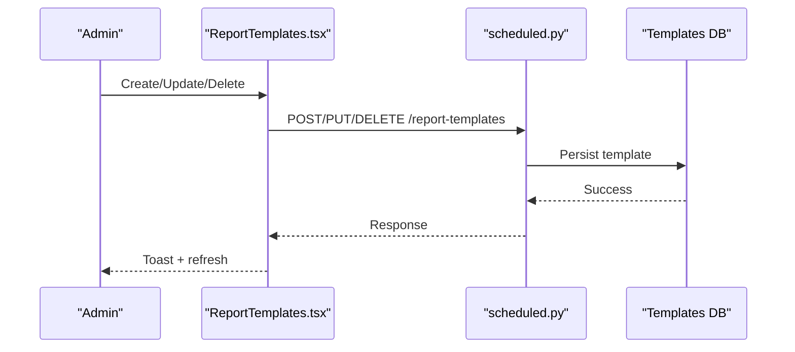

**Diagram sources**
- [ReportTemplates.tsx:69-143](file://frontend/src/pages/admin/ReportTemplates.tsx#L69-L143)
- [scheduled.py:375-429](file://services/dataflow/api/scheduled.py#L375-L429)

**Section sources**
- [ReportTemplates.tsx:69-143](file://frontend/src/pages/admin/ReportTemplates.tsx#L69-L143)
- [scheduled.py:375-429](file://services/dataflow/api/scheduled.py#L375-L429)

### Model Center
Configure LLM providers and models, set default models, manage embedding configurations, and update system-wide settings.

```mermaid
classDiagram
class ModelCenterUI {
+listModels()
+createModel()
+updateModel()
+setDefaultModel()
+getEmbeddingConfig()
+updateEmbeddingConfig()
+getSystemConfig()
+updateSystemConfig()
}
class ModelConfigAPI {
+GET /llm
+POST /llm
+PUT /llm/{id}
+DELETE /llm/{id}
+PUT /llm/{id}/default
+GET /embedding
+PUT /embedding
+POST /embedding/reload
+GET /system
+PUT /system
}
ModelCenterUI --> ModelConfigAPI : "calls"
```

**Diagram sources**
- [ModelCenter.tsx:11-59](file://frontend/src/pages/admin/ModelCenter.tsx#L11-L59)
- [model_config.py:58-117](file://services/aiplatform/api/model_config.py#L58-L117)

**Section sources**
- [ModelCenter.tsx:11-59](file://frontend/src/pages/admin/ModelCenter.tsx#L11-L59)
- [model_config.py:58-117](file://services/aiplatform/api/model_config.py#L58-L117)

### MCP Market
Browse the MCP registry, search categories, import from npm, and install MCP servers with required environment variables and extra arguments.

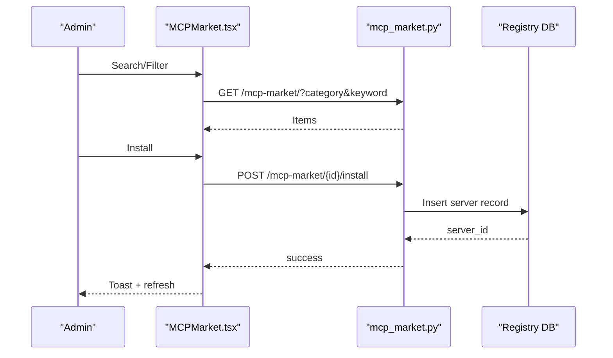

**Diagram sources**
- [MCPMarket.tsx:310-340](file://frontend/src/pages/admin/MCPMarket.tsx#L310-L340)
- [mcp_market.py:18-107](file://services/aiplatform/api/mcp_market.py#L18-L107)

**Section sources**
- [MCPMarket.tsx:310-340](file://frontend/src/pages/admin/MCPMarket.tsx#L310-L340)
- [mcp_market.py:18-107](file://services/aiplatform/api/mcp_market.py#L18-L107)

### Data Management
Access tabs for datasources, table metadata, relations, SQL templates, business terms, and a SQL playground. Backed by compatibility endpoints for metadata and table info.

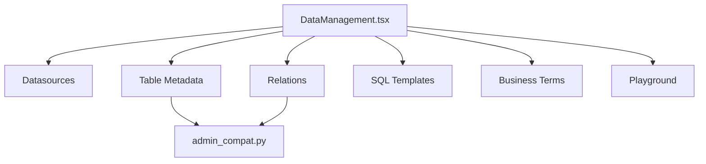

**Diagram sources**
- [DataManagement.tsx:9-59](file://frontend/src/pages/admin/DataManagement.tsx#L9-L59)
- [admin_compat.py:17-179](file://services/datacatalog/api/admin_compat.py#L17-L179)

**Section sources**
- [DataManagement.tsx:9-59](file://frontend/src/pages/admin/DataManagement.tsx#L9-L59)
- [admin_compat.py:17-179](file://services/datacatalog/api/admin_compat.py#L17-L179)

### Monitoring and Observability (Langfuse)
Enable Langfuse to trace LLM calls, track token usage, and monitor costs. The client initializes before any LLM client creation to patch SDKs automatically. Use decorators to observe generations and flush events when needed.

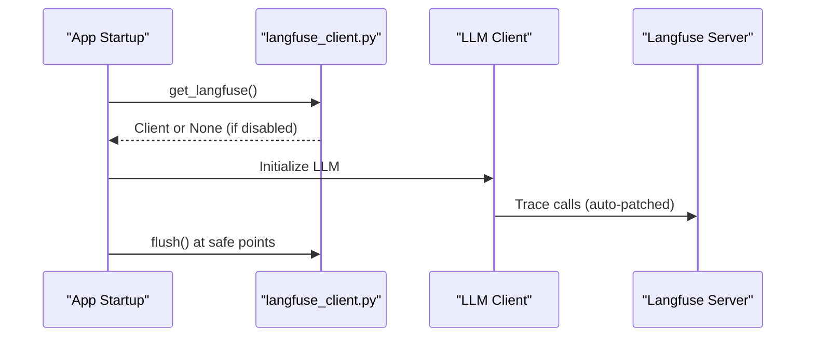

**Diagram sources**
- [langfuse_client.py:29-67](file://services/shared/common/llm/langfuse_client.py#L29-L67)

**Section sources**
- [langfuse_client.py:29-67](file://services/shared/common/llm/langfuse_client.py#L29-L67)

## Dependency Analysis
Key dependencies between admin components and backend services:
- PromptManager depends on backend prompt endpoints (via client calls).
- ScheduledTasks, NotificationChannels, and ReportTemplates depend on scheduled.py endpoints.
- ModelCenter depends on model_config.py endpoints.
- MCPMarket depends on mcp_market.py endpoints.
- DataManagement depends on admin_compat.py for metadata/table info.
- Langfuse client is initialized early to enable tracing across LLM calls.

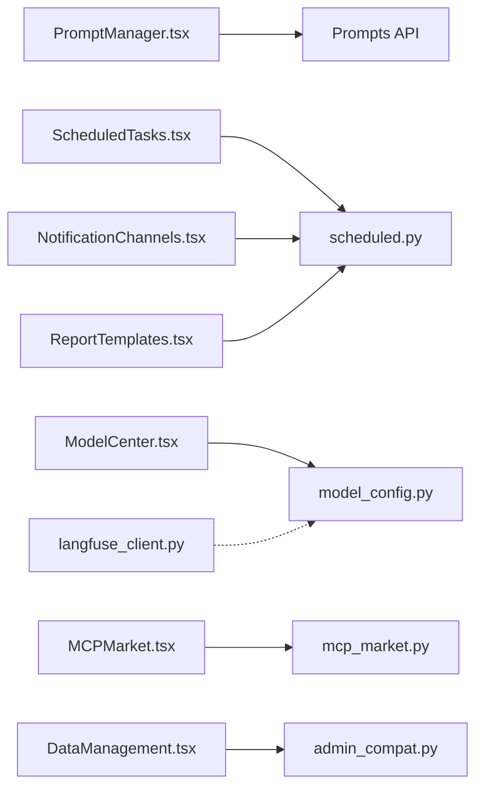

**Diagram sources**
- [PromptManager.tsx:100-179](file://frontend/src/pages/admin/PromptManager.tsx#L100-L179)
- [ScheduledTasks.tsx:71-122](file://frontend/src/pages/admin/ScheduledTasks.tsx#L71-L122)
- [NotificationChannels.tsx:75-148](file://frontend/src/pages/admin/NotificationChannels.tsx#L75-L148)
- [ReportTemplates.tsx:69-143](file://frontend/src/pages/admin/ReportTemplates.tsx#L69-L143)
- [ModelCenter.tsx:11-59](file://frontend/src/pages/admin/ModelCenter.tsx#L11-L59)
- [MCPMarket.tsx:310-340](file://frontend/src/pages/admin/MCPMarket.tsx#L310-L340)
- [DataManagement.tsx:9-59](file://frontend/src/pages/admin/DataManagement.tsx#L9-L59)
- [scheduled.py:92-203](file://services/dataflow/api/scheduled.py#L92-L203)
- [model_config.py:58-117](file://services/aiplatform/api/model_config.py#L58-L117)
- [mcp_market.py:18-107](file://services/aiplatform/api/mcp_market.py#L18-L107)
- [admin_compat.py:17-179](file://services/datacatalog/api/admin_compat.py#L17-L179)
- [langfuse_client.py:29-67](file://services/shared/common/llm/langfuse_client.py#L29-L67)

**Section sources**
- [PromptManager.tsx:100-179](file://frontend/src/pages/admin/PromptManager.tsx#L100-L179)
- [ScheduledTasks.tsx:71-122](file://frontend/src/pages/admin/ScheduledTasks.tsx#L71-L122)
- [NotificationChannels.tsx:75-148](file://frontend/src/pages/admin/NotificationChannels.tsx#L75-L148)
- [ReportTemplates.tsx:69-143](file://frontend/src/pages/admin/ReportTemplates.tsx#L69-L143)
- [ModelCenter.tsx:11-59](file://frontend/src/pages/admin/ModelCenter.tsx#L11-L59)
- [MCPMarket.tsx:310-340](file://frontend/src/pages/admin/MCPMarket.tsx#L310-L340)
- [DataManagement.tsx:9-59](file://frontend/src/pages/admin/DataManagement.tsx#L9-L59)
- [scheduled.py:92-203](file://services/dataflow/api/scheduled.py#L92-L203)
- [model_config.py:58-117](file://services/aiplatform/api/model_config.py#L58-L117)
- [mcp_market.py:18-107](file://services/aiplatform/api/mcp_market.py#L18-L107)
- [admin_compat.py:17-179](file://services/datacatalog/api/admin_compat.py#L17-L179)
- [langfuse_client.py:29-67](file://services/shared/common/llm/langfuse_client.py#L29-L67)

## Performance Considerations
- Prompt editing creates new versions; keep prompt sizes reasonable to avoid large payloads.
- Scheduled tasks should use appropriate cron schedules and timeouts to prevent resource contention.
- MCP installations may require environment variables; validate inputs to reduce retries.
- Report templates with heavy HTML rendering should be optimized for performance.
- Enable Langfuse only when needed to avoid overhead; flush periodically to ensure event delivery.

[No sources needed since this section provides general guidance]

## Troubleshooting Guide
Common issues and resolutions:
- Cron expression invalid: Ensure valid cron syntax when creating/updating tasks.
- Task not executing: Check task status, last run time, and logs; clean stale running logs if necessary.
- Notification channel failures: Verify webhook URLs, SMTP settings, and secrets; use test endpoint to diagnose.
- Report template errors: Validate Jinja2 syntax; preview content to catch issues early.
- MCP installation fails: Confirm required environment variables and network access; check logs for errors.
- LLM tracing missing: Ensure Langfuse is enabled and initialized before LLM clients; call flush at safe points.

**Section sources**
- [scheduled.py:111-157](file://services/dataflow/api/scheduled.py#L111-L157)
- [scheduled.py:265-290](file://services/dataflow/api/scheduled.py#L265-L290)
- [scheduled.py:352-368](file://services/dataflow/api/scheduled.py#L352-L368)
- [ReportTemplates.tsx:104-143](file://frontend/src/pages/admin/ReportTemplates.tsx#L104-L143)
- [MCPMarket.tsx:99-127](file://frontend/src/pages/admin/MCPMarket.tsx#L99-L127)
- [langfuse_client.py:29-67](file://services/shared/common/llm/langfuse_client.py#L29-L67)

## Conclusion
AI-DataHub’s admin capabilities provide a comprehensive toolkit for managing prompts, workflows, scheduled tasks, notifications, templates, models, MCP tools, and data assets. With robust APIs and an intuitive UI, administrators can configure systems efficiently, monitor performance, and maintain reliability. Enabling Langfuse enhances observability for LLM-driven features, supporting token usage tracking and cost monitoring.

[No sources needed since this section summarizes without analyzing specific files]