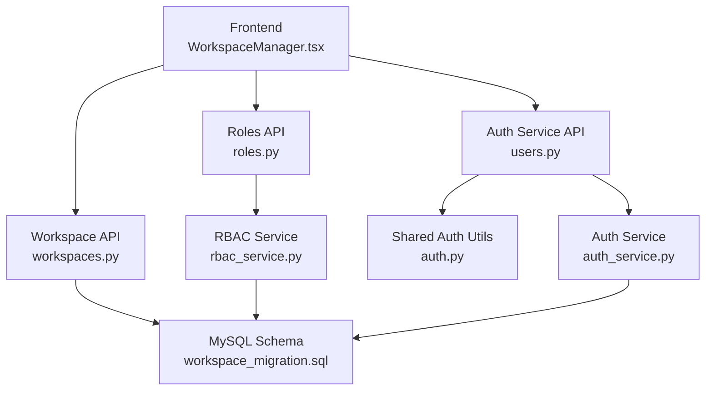
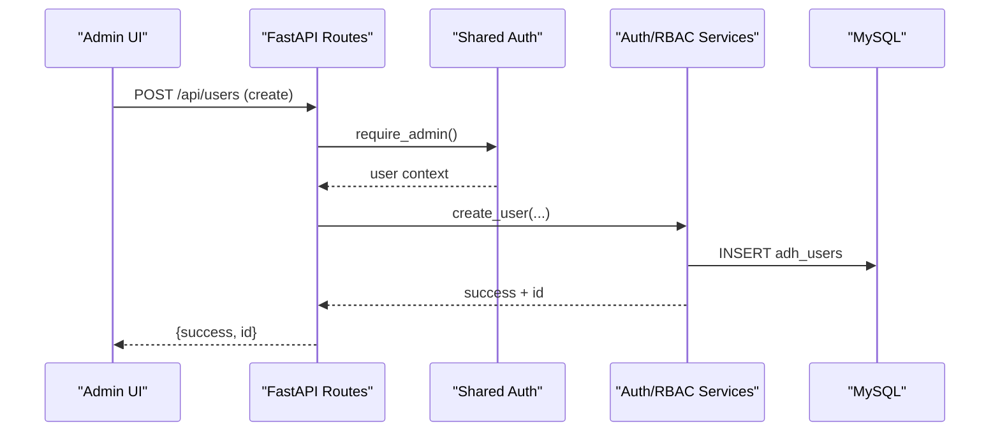
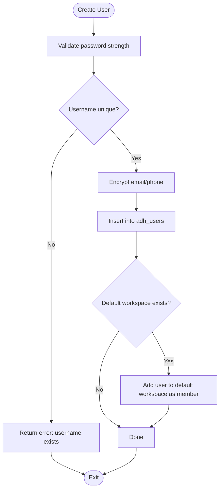
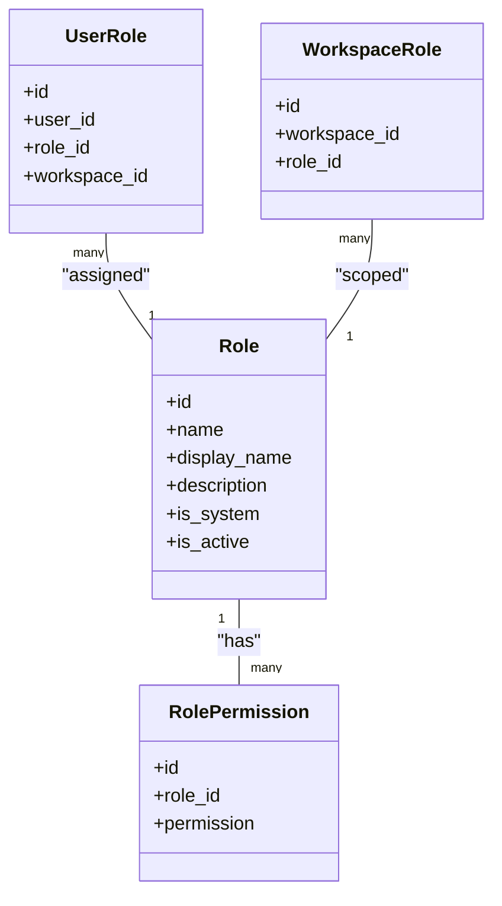
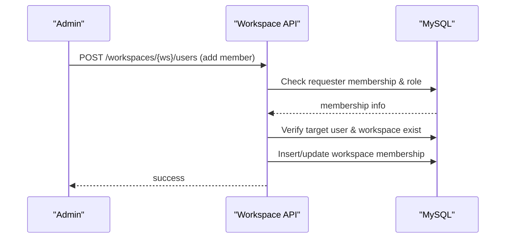
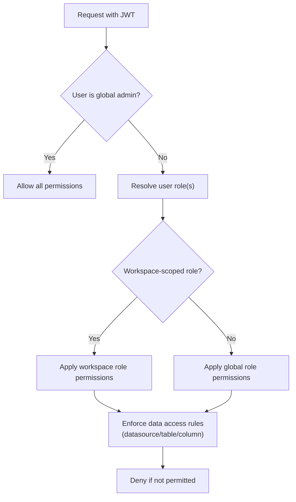
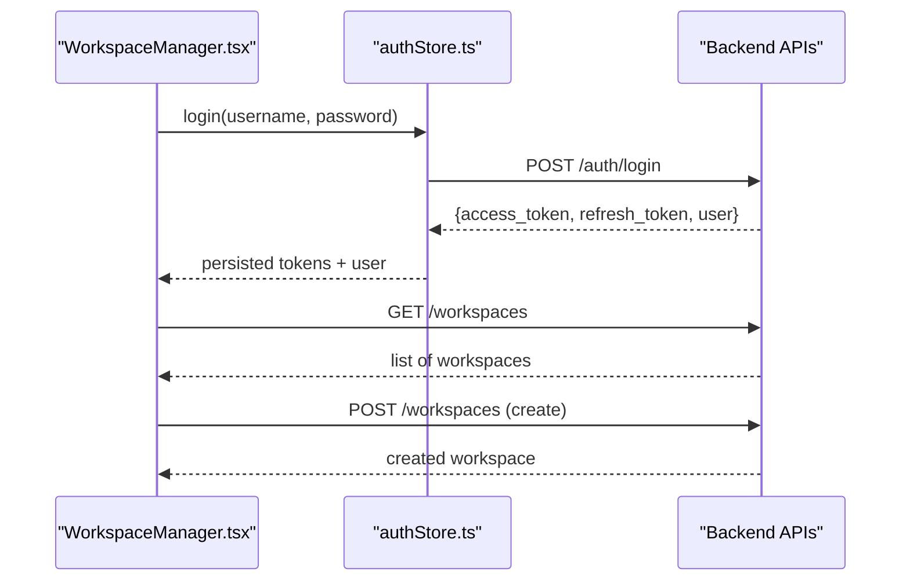
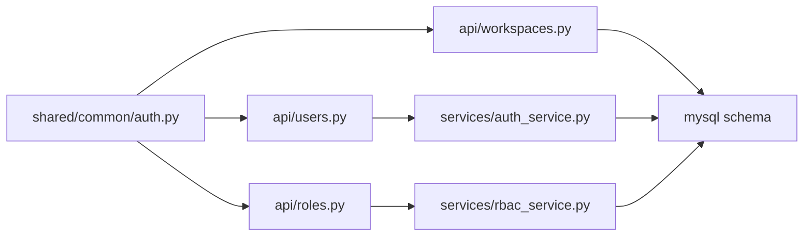

# User & Workspace Management

<cite>
**Referenced Files in This Document**
- [users.py](file://services/authservice/api/users.py)
- [roles.py](file://services/authservice/api/roles.py)
- [workspaces.py](file://services/authservice/api/workspaces.py)
- [auth_service.py](file://services/authservice/services/auth_service.py)
- [rbac_service.py](file://services/authservice/services/rbac_service.py)
- [auth.py](file://services/shared/common/auth.py)
- [workspace_migration.sql](file://docker/mysql/workspace_migration.sql)
- [role_migration.sql](file://services/shared/migrations/role_migration.sql)
- [role_permission_migration.sql](file://services/shared/migrations/role_permission_migration.sql)
- [WorkspaceManager.tsx](file://frontend/src/pages/WorkspaceManager.tsx)
- [authStore.ts](file://frontend/src/stores/authStore.ts)
</cite>

## Table of Contents
1. Introduction
2. Project Structure
3. Core Components
4. Architecture Overview
5. Detailed Component Analysis
6. Dependency Analysis
7. Performance Considerations
8. Troubleshooting Guide
9. Conclusion
10. Appendices

## Introduction
This document explains how AI-DataHub manages users and workspaces with a focus on:
- User account lifecycle: creation, modification, password management, activation/deactivation, and deletion
- Role-based access control (RBAC): predefined roles, custom role creation, and permission assignment
- Multi-tenant workspace isolation: workspace creation, member assignment, default workspace selection, and resource binding (datasources, MCP servers, agents)
- Permission inheritance and security boundaries across workspaces
- Practical administrative scenarios such as onboarding new users, setting up team workspaces, and managing enterprise-level access controls

## Project Structure
AI-DataHub implements user and workspace administration through a FastAPI service layer backed by MySQL, with a React frontend for administrative UIs. The key modules are:
- Authentication and user management APIs under the authservice
- RBAC service for roles and permissions
- Workspace APIs for multi-tenant isolation and resource binding
- Database migrations defining schema for users, roles, permissions, and workspaces
- Frontend pages and stores for interactive administration

**Diagram sources**
- [users.py:1-167](file://services/authservice/api/users.py#L1-L167)
- [workspaces.py:1-464](file://services/authservice/api/workspaces.py#L1-L464)
- [roles.py:1-83](file://services/authservice/api/roles.py#L1-L83)
- [auth_service.py:1-625](file://services/authservice/services/auth_service.py#L1-L625)
- [rbac_service.py:1-275](file://services/authservice/services/rbac_service.py#L1-L275)
- [workspace_migration.sql:1-129](file://docker/mysql/workspace_migration.sql#L1-L129)

**Section sources**
- [users.py:1-167](file://services/authservice/api/users.py#L1-L167)
- [workspaces.py:1-464](file://services/authservice/api/workspaces.py#L1-L464)
- [roles.py:1-83](file://services/authservice/api/roles.py#L1-L83)
- [auth_service.py:1-625](file://services/authservice/services/auth_service.py#L1-L625)
- [rbac_service.py:1-275](file://services/authservice/services/rbac_service.py#L1-L275)
- [workspace_migration.sql:1-129](file://docker/mysql/workspace_migration.sql#L1-L129)

## Core Components
- User management API: endpoints to list, create, update, reset passwords, change status, and delete users; includes audit logging and admin-only protection
- RBAC service: CRUD for roles, assignment of permissions per role, and permission checks that treat global admin as having all permissions
- Workspace API: full lifecycle for workspaces, membership management, default workspace selection, and binding of datasources, MCP servers, and agents
- Shared authentication utilities: JWT decoding, current user extraction, admin requirement, login attempt lockout, and sensitive field encryption helpers
- Database schema: tables for users, roles, role attributes, workspace roles, role data access, and workspace resources

Key responsibilities:
- Enforce least privilege via roles and workspace-scoped memberships
- Provide secure password handling and account lockout
- Isolate resources per workspace while allowing controlled sharing via bindings

**Section sources**
- [users.py:14-167](file://services/authservice/api/users.py#L14-L167)
- [roles.py:14-83](file://services/authservice/api/roles.py#L14-L83)
- [workspaces.py:19-464](file://services/authservice/api/workspaces.py#L19-L464)
- [auth_service.py:72-113](file://services/authservice/services/auth_service.py#L72-L113)
- [rbac_service.py:27-275](file://services/authservice/services/rbac_service.py#L27-L275)
- [workspace_migration.sql:9-129](file://docker/mysql/workspace_migration.sql#L9-L129)

## Architecture Overview
The system uses a layered architecture:
- Frontend calls REST APIs for user and workspace operations
- API routes enforce authentication and authorization using shared dependencies
- Services implement business logic and interact with the database
- Migrations define the relational model for users, roles, permissions, and workspace resources

**Diagram sources**
- [users.py:92-104](file://services/authservice/api/users.py#L92-L104)
- [auth.py:79-85](file://services/shared/common/auth.py#L79-L85)
- [auth_service.py:380-428](file://services/authservice/services/auth_service.py#L380-L428)
- [workspace_migration.sql:9-25](file://docker/mysql/workspace_migration.sql#L9-L25)

## Detailed Component Analysis

### User Account Management
- Create user: validates password strength, hashes password, encrypts sensitive fields, enforces uniqueness, optionally auto-adds to default workspace, and logs audit
- Update user: supports updating username, email, phone, and role with uniqueness checks and encrypted storage
- Password management: users can change their own password; admins can reset another user’s password
- Status management: enable/disable accounts; disabled accounts cannot log in
- Delete user: removes user record; prevents self-deletion at API level

Security and safety features:
- Password policy enforcement and bcrypt hashing
- AES-256-GCM encryption for email/phone fields
- Audit logging for critical actions
- Login attempt tracking and temporary lockout

**Diagram sources**
- [auth_service.py:380-428](file://services/authservice/services/auth_service.py#L380-L428)
- [workspace_migration.sql:78-94](file://docker/mysql/workspace_migration.sql#L78-L94)

**Section sources**
- [users.py:14-167](file://services/authservice/api/users.py#L14-L167)
- [auth_service.py:72-113](file://services/authservice/services/auth_service.py#L72-L113)
- [auth_service.py:380-571](file://services/authservice/services/auth_service.py#L380-L571)

### Role-Based Access Control (RBAC)
- Predefined roles: system roles include admin, analyst, viewer
- Custom roles: create/update/delete roles with descriptions
- Permissions: store as resource:action strings; replace or add/remove per role
- Permission checks: admin users always have all permissions; others inherit from their assigned role

Database model highlights:
- adh_roles: role definitions with system flag
- adh_role_permissions: role-to-permission mapping
- adh_user_roles: user-to-role assignments scoped by workspace
- adh_workspace_roles: workspace-scoped role authorizations
- Data access permissions: datasource, table, and column-level access controls

**Diagram sources**
- [role_migration.sql:9-59](file://services/shared/migrations/role_migration.sql#L9-L59)
- [role_permission_migration.sql:9-44](file://services/shared/migrations/role_permission_migration.sql#L9-L44)
- [rbac_service.py:27-275](file://services/authservice/services/rbac_service.py#L27-L275)

**Section sources**
- [roles.py:14-83](file://services/authservice/api/roles.py#L14-L83)
- [rbac_service.py:27-275](file://services/authservice/services/rbac_service.py#L27-L275)
- [role_migration.sql:9-59](file://services/shared/migrations/role_migration.sql#L9-L59)
- [role_permission_migration.sql:9-44](file://services/shared/migrations/role_permission_migration.sql#L9-L44)

### Workspace Management and Multi-Tenant Isolation
- Create workspace: sets creator as owner, initializes empty config
- Update workspace: requires owner/admin role within workspace or global admin
- Delete workspace: admin-only; cascades removal of memberships and bindings
- Membership: add/remove users with roles; prevent removing owners
- Default workspace: set per-user default workspace
- Resource binding: bind datasources, MCP servers, and agents to a workspace; enforce admin role for binding changes

Access control:
- Workspace membership check helper ensures only members can access resources
- Administrative actions require owner/admin role within the workspace or global admin

**Diagram sources**
- [workspaces.py:204-243](file://services/authservice/api/workspaces.py#L204-L243)
- [workspace_migration.sql:27-69](file://docker/mysql/workspace_migration.sql#L27-L69)

**Section sources**
- [workspaces.py:38-298](file://services/authservice/api/workspaces.py#L38-L298)
- [workspace_migration.sql:9-129](file://docker/mysql/workspace_migration.sql#L9-L129)

### Permission Inheritance and Security Boundaries
- Global admin bypass: admin users have all permissions regardless of role assignments
- Workspace-scoped roles: roles can be authorized per workspace to limit scope
- Data access permissions: datasource, table, and column-level controls allow fine-grained masking and visibility
- Workspace isolation: resources bound to a workspace are only accessible to its members; default workspace provides baseline access for new users

**Diagram sources**
- [rbac_service.py:220-275](file://services/authservice/services/rbac_service.py#L220-L275)
- [role_permission_migration.sql:9-44](file://services/shared/migrations/role_permission_migration.sql#L9-L44)

**Section sources**
- [rbac_service.py:220-275](file://services/authservice/services/rbac_service.py#L220-L275)
- [role_permission_migration.sql:9-44](file://services/shared/migrations/role_permission_migration.sql#L9-L44)

### Frontend Integration
- Workspace manager UI allows creating, editing, and deleting workspaces; selecting templates; configuring allowed modes; and binding datasources, MCP servers, and agents
- Auth store handles login, token persistence, and user state updates

**Diagram sources**
- [WorkspaceManager.tsx:87-129](file://frontend/src/pages/WorkspaceManager.tsx#L87-L129)
- [authStore.ts:18-43](file://frontend/src/stores/authStore.ts#L18-L43)

**Section sources**
- [WorkspaceManager.tsx:87-800](file://frontend/src/pages/WorkspaceManager.tsx#L87-L800)
- [authStore.ts:18-43](file://frontend/src/stores/authStore.ts#L18-L43)

## Dependency Analysis
- API routes depend on shared authentication dependencies for current user extraction and admin enforcement
- Services encapsulate business logic and database interactions
- Migrations define the canonical schema used by services and APIs
- Frontend components call backend APIs and manage local auth state

**Diagram sources**
- [auth.py:58-85](file://services/shared/common/auth.py#L58-L85)
- [users.py:1-167](file://services/authservice/api/users.py#L1-L167)
- [roles.py:1-83](file://services/authservice/api/roles.py#L1-L83)
- [workspaces.py:1-464](file://services/authservice/api/workspaces.py#L1-L464)
- [auth_service.py:1-625](file://services/authservice/services/auth_service.py#L1-L625)
- [rbac_service.py:1-275](file://services/authservice/services/rbac_service.py#L1-L275)
- [workspace_migration.sql:1-129](file://docker/mysql/workspace_migration.sql#L1-L129)

**Section sources**
- [auth.py:58-85](file://services/shared/common/auth.py#L58-L85)
- [users.py:1-167](file://services/authservice/api/users.py#L1-L167)
- [roles.py:1-83](file://services/authservice/api/roles.py#L1-L83)
- [workspaces.py:1-464](file://services/authservice/api/workspaces.py#L1-L464)
- [auth_service.py:1-625](file://services/authservice/services/auth_service.py#L1-L625)
- [rbac_service.py:1-275](file://services/authservice/services/rbac_service.py#L1-L275)
- [workspace_migration.sql:1-129](file://docker/mysql/workspace_migration.sql#L1-L129)

## Performance Considerations
- Use pagination for user listing to avoid large result sets
- Prefer workspace-scoped queries to reduce cross-tenant data scanning
- Cache frequently accessed role permissions where appropriate to reduce repeated joins
- Ensure indexes on workspace_id, user_id, and role_id columns for efficient lookups
- Avoid unnecessary decryption of sensitive fields when not required by the response

[No sources needed since this section provides general guidance]

## Troubleshooting Guide
Common issues and resolutions:
- Token expired or invalid: ensure valid JWT and refresh flow; check server secret configuration
- Disabled account: re-enable via admin endpoint; verify status before login attempts
- Locked account due to failed attempts: wait for lockout period or reset attempts via admin operations
- Permission denied: confirm user has correct role and workspace membership; verify workspace-scoped role assignments
- Cannot remove owner: only non-owner members can be removed; transfer ownership first if necessary
- Duplicate username/email: resolve conflicts before creating or updating users

Operational tips:
- Review audit logs for actions like user creation, password resets, and workspace changes
- Validate workspace membership before performing administrative actions
- Confirm resource bindings are correctly associated with the intended workspace

**Section sources**
- [auth_service.py:126-193](file://services/authservice/services/auth_service.py#L126-L193)
- [auth_service.py:229-275](file://services/authservice/services/auth_service.py#L229-L275)
- [workspaces.py:246-283](file://services/authservice/api/workspaces.py#L246-L283)
- [users.py:125-167](file://services/authservice/api/users.py#L125-L167)

## Conclusion
AI-DataHub provides a robust foundation for user and workspace administration:
- Secure user lifecycle management with strong password policies and encryption
- Flexible RBAC with predefined and custom roles, plus granular data access controls
- Multi-tenant workspace isolation with clear membership and resource binding mechanisms
- Clear separation of concerns between API routes, services, and shared utilities
- Practical administrative workflows supported by both backend APIs and frontend interfaces

[No sources needed since this section summarizes without analyzing specific files]

## Appendices

### Common Administrative Scenarios

- Onboard a new user
  - Create user with a strong password and initial role
  - Optionally assign to default workspace automatically
  - Set user’s default workspace if needed
  - Log and verify via audit logs

- Set up a team workspace
  - Create workspace and configure description/icon/color
  - Add team members with appropriate roles (member/admin)
  - Bind required datasources, MCP servers, and agents
  - Set default workspace for relevant users

- Manage enterprise-level access controls
  - Define custom roles and assign precise permissions
  - Scope roles per workspace to enforce boundaries
  - Apply datasource/table/column-level access controls
  - Monitor and review audit logs regularly

[No sources needed since this section provides general guidance]