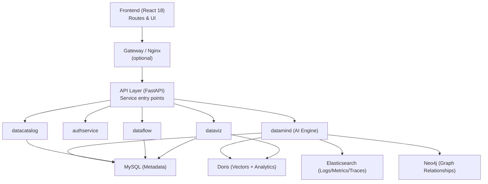
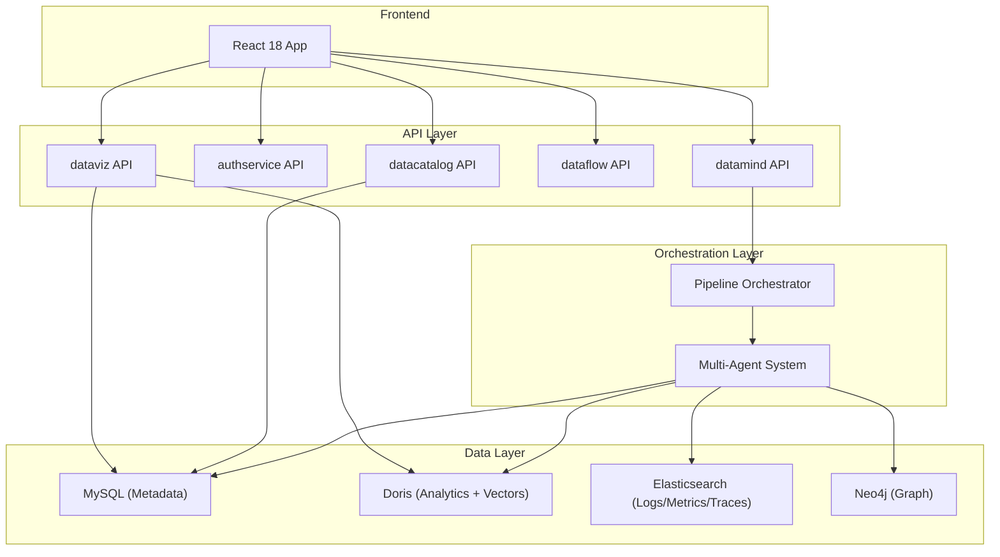
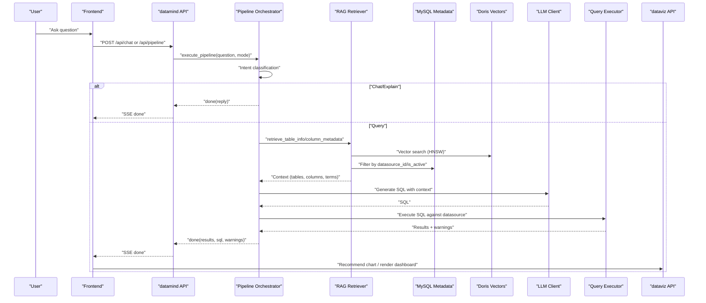
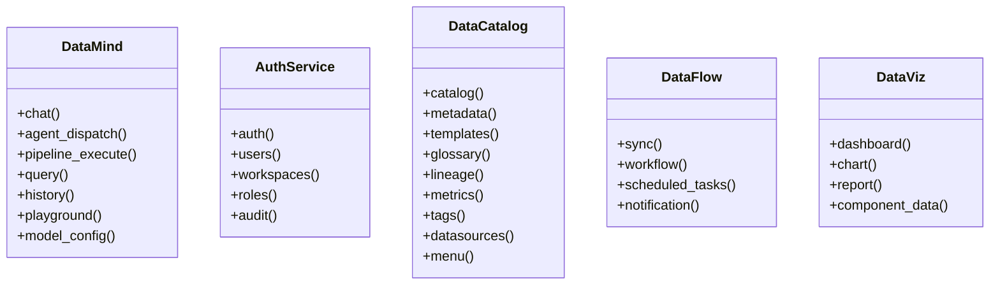
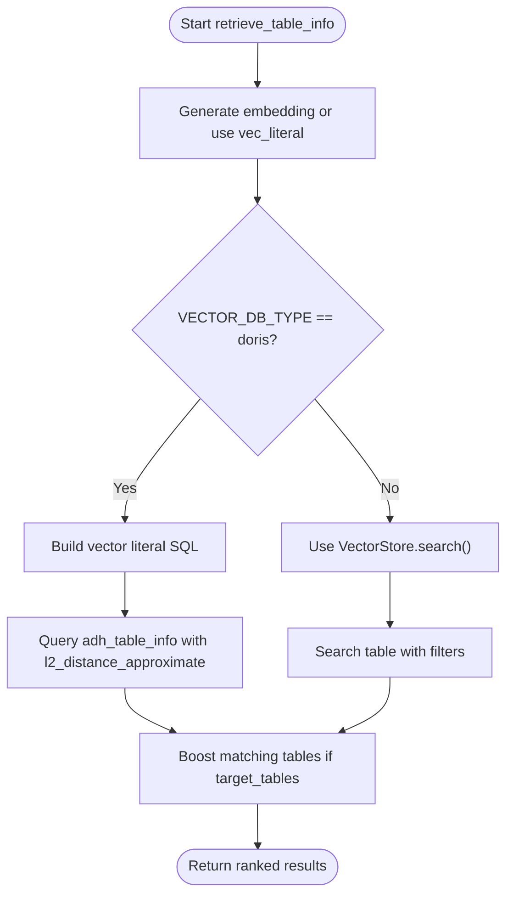
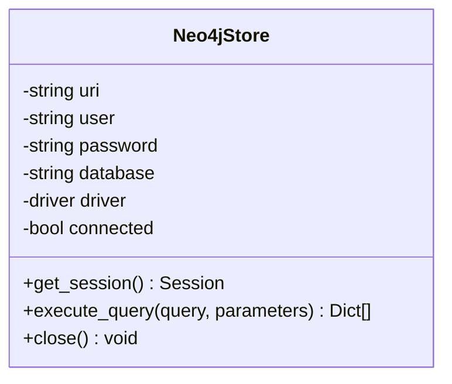
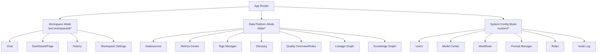
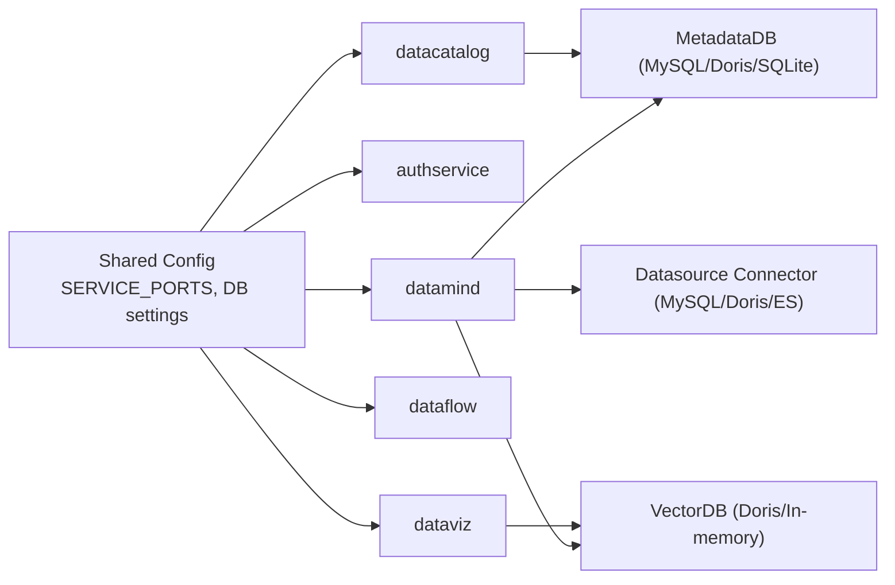

# Architecture Overview

<cite>
**Referenced Files in This Document**
- [README.md](file://README.md)
- [docker-compose.yml](file://docker-compose.yml)
- [docker-compose.full.yml](file://docker-compose.full.yml)
- [services/datamind/main.py](file://services/datamind/main.py)
- [services/authservice/main.py](file://services/authservice/main.py)
- [services/datacatalog/main.py](file://services/datacatalog/main.py)
- [services/dataflow/main.py](file://services/dataflow/main.py)
- [services/dataviz/main.py](file://services/dataviz/main.py)
- [frontend/src/App.tsx](file://frontend/src/App.tsx)
- [services/shared/common/config.py](file://services/shared/common/config.py)
- [services/shared/common/db/metadata_db.py](file://services/shared/common/db/metadata_db.py)
- [services/shared/common/db/datasource_db.py](file://services/shared/common/db/datasource_db.py)
- [services/datamind/rag/rag_retriever.py](file://services/datamind/rag/rag_retriever.py)
- [services/datamind/nl2sql/orchestrator/pipeline_orchestrator.py](file://services/datamind/nl2sql/orchestrator/pipeline_orchestrator.py)
- [services/datamind/rag/graph_rag/neo4j_store.py](file://services/datamind/rag/graph_rag/neo4j_store.py)
</cite>

## Table of Contents
1. Introduction
2. Project Structure
3. Core Components
4. Architecture Overview
5. Detailed Component Analysis
6. Dependency Analysis
7. Performance Considerations
8. Troubleshooting Guide
9. Conclusion

## Introduction
AI-DataHub is a natural language business intelligence platform with a multi-agent architecture that turns plain-language questions into SQL, executes them against analytics stores, and returns insights with auto-generated visualizations. The system separates concerns across a React 18 frontend, a FastAPI API layer, an orchestration layer for query pipelines, a multi-agent system for autonomous tool calling, and a data layer comprising Apache Doris (analytics and vectors), MySQL (metadata), Elasticsearch (logs/metrics/traces), and Neo4j (graph relationships).

The microservices breakdown includes:
- datamind: AI engine for NL2SQL, agent routing, RAG retrieval, knowledge base, and playground
- authservice: authentication, users, workspaces, roles, and audit
- datacatalog: metadata management, metrics, tags, glossary, lineage, datasources, and menus
- dataflow: data sync, workflow orchestration, scheduled tasks, and notifications
- dataviz: dashboards, charts, reports, and component data refresh

This document explains the high-level design, technology stack, service boundaries, data flows from user queries through intent classification, RAG retrieval, SQL generation, execution, and visualization, as well as scalability and deployment topology using Docker Compose.

**Section sources**
- [README.md:28-66](file://README.md#L28-L66)
- [README.md:295-307](file://README.md#L295-L307)

## Project Structure
At a high level:
- Frontend: React 18 application with workspace-scoped routes and admin/data platform modes
- Services: Python FastAPI microservices under services/
- Shared: Common configuration, database connectors, vector stores, LLM clients, and MCP client
- Data: Dockerized databases and init scripts under docker/
- Orchestration: Docker Compose files to run services and dependencies

**Diagram sources**
- [docker-compose.yml:3-41](file://docker-compose.yml#L3-L41)
- [docker-compose.full.yml:6-99](file://docker-compose.full.yml#L6-L99)
- [services/datamind/main.py:28-63](file://services/datamind/main.py#L28-L63)
- [services/authservice/main.py:37-58](file://services/authservice/main.py#L37-L58)
- [services/datacatalog/main.py:25-50](file://services/datacatalog/main.py#L25-L50)
- [services/dataflow/main.py:36-56](file://services/dataflow/main.py#L36-L56)
- [services/dataviz/main.py:38-58](file://services/dataviz/main.py#L38-L58)

**Section sources**
- [frontend/src/App.tsx:96-194](file://frontend/src/App.tsx#L96-L194)
- [docker-compose.yml:3-41](file://docker-compose.yml#L3-L41)
- [docker-compose.full.yml:6-99](file://docker-compose.full.yml#L6-L99)

## Core Components
- datamind: Exposes REST APIs for chat, agent dispatch, pipeline execution, query, history, playground, and model config; initializes agents on startup and flushes observability on shutdown
- authservice: Provides authentication, users, workspaces, roles, and audit endpoints
- datacatalog: Offers catalog, metadata, templates, glossary, lineage, metrics, tags, datasources, menu, and admin compatibility endpoints
- dataflow: Handles sync, workflow, scheduled tasks, and notifications via Airflow integration and Celery tasks
- dataviz: Manages dashboards, charts, reports, and component data refresh

Each service is a FastAPI application with CORS enabled, health checks, and route registration. Ports are centrally defined in shared configuration.

**Section sources**
- [services/datamind/main.py:28-98](file://services/datamind/main.py#L28-L98)
- [services/authservice/main.py:29-71](file://services/authservice/main.py#L29-L71)
- [services/datacatalog/main.py:25-61](file://services/datacatalog/main.py#L25-L61)
- [services/dataflow/main.py:28-75](file://services/dataflow/main.py#L28-L75)
- [services/dataviz/main.py:30-70](file://services/dataviz/main.py#L30-L70)
- [services/shared/common/config.py:122-140](file://services/shared/common/config.py#L122-L140)

## Architecture Overview
The system follows a layered microservices architecture:
- Frontend: React 18 SPA with workspace-scoped routing and admin/data platform views
- API Layer: FastAPI services exposing domain-specific endpoints
- Orchestration Layer: Pipeline orchestrator routes between quick, deep, and agent modes
- Multi-Agent System: Orchestrator dispatches to specialized agents with tool calling and parallel execution
- Data Layer: MySQL for metadata, Doris for analytics and vectors, Elasticsearch for logs/metrics/traces, Neo4j for graph relationships

**Diagram sources**
- [services/datamind/nl2sql/orchestrator/pipeline_orchestrator.py:73-237](file://services/datamind/nl2sql/orchestrator/pipeline_orchestrator.py#L73-L237)
- [services/shared/common/config.py:39-59](file://services/shared/common/config.py#L39-L59)
- [services/shared/common/config.py:114-116](file://services/shared/common/config.py#L114-L116)
- [services/shared/common/db/metadata_db.py:282-327](file://services/shared/common/db/metadata_db.py#L282-L327)
- [services/datamind/rag/rag_retriever.py:105-142](file://services/datamind/rag/rag_retriever.py#L105-L142)
- [services/datamind/rag/graph_rag/neo4j_store.py:13-85](file://services/datamind/rag/graph_rag/neo4j_store.py#L13-L85)

## Detailed Component Analysis

### Query Flow: Intent Classification → RAG Retrieval → SQL Generation → Execution → Visualization
This sequence shows how a user question traverses the system to produce results and recommendations.

**Diagram sources**
- [services/datamind/nl2sql/orchestrator/pipeline_orchestrator.py:99-188](file://services/datamind/nl2sql/orchestrator/pipeline_orchestrator.py#L99-L188)
- [services/datamind/rag/rag_retriever.py:74-142](file://services/datamind/rag/rag_retriever.py#L74-L142)
- [services/shared/common/db/metadata_db.py:295-327](file://services/shared/common/db/metadata_db.py#L295-L327)
- [services/shared/common/db/datasource_db.py:34-77](file://services/shared/common/db/datasource_db.py#L34-L77)

**Section sources**
- [services/datamind/nl2sql/orchestrator/pipeline_orchestrator.py:73-237](file://services/datamind/nl2sql/orchestrator/pipeline_orchestrator.py#L73-L237)
- [services/datamind/rag/rag_retriever.py:74-200](file://services/datamind/rag/rag_retriever.py#L74-L200)
- [services/shared/common/db/datasource_db.py:34-85](file://services/shared/common/db/datasource_db.py#L34-L85)

### Microservices Breakdown and Responsibilities
- datamind: AI engine providing chat, agent dispatch, pipeline execution, query, history, playground, and model config; initializes agent registry on startup and flushes Langfuse events on shutdown
- authservice: Authentication, users, workspaces, roles, audit; uses centralized ports and CORS
- datacatalog: Catalog, metadata, templates, glossary, lineage, metrics, tags, datasources, menu, admin compat
- dataflow: Sync, workflow, scheduled tasks, notifications; integrates with Airflow and Celery
- dataviz: Dashboards, charts, reports, component data refresh

**Diagram sources**
- [services/datamind/main.py:28-63](file://services/datamind/main.py#L28-L63)
- [services/authservice/main.py:37-58](file://services/authservice/main.py#L37-L58)
- [services/datacatalog/main.py:25-50](file://services/datacatalog/main.py#L25-L50)
- [services/dataflow/main.py:36-56](file://services/dataflow/main.py#L36-L56)
- [services/dataviz/main.py:38-58](file://services/dataviz/main.py#L38-L58)

**Section sources**
- [services/datamind/main.py:28-98](file://services/datamind/main.py#L28-L98)
- [services/authservice/main.py:29-71](file://services/authservice/main.py#L29-L71)
- [services/datacatalog/main.py:25-61](file://services/datacatalog/main.py#L25-L61)
- [services/dataflow/main.py:28-75](file://services/dataflow/main.py#L28-L75)
- [services/dataviz/main.py:30-70](file://services/dataviz/main.py#L30-L70)

### RAG Retrieval Strategy and Vector Store Integration
RAG retrieval combines BM25 sparse and vector dense search with RRF fusion to select relevant tables and columns. It supports filtering by datasource and boosts matching tables when target_tables are provided. For Doris, raw SQL leverages HNSW indexes; otherwise, it uses the VectorStore abstraction.

**Diagram sources**
- [services/datamind/rag/rag_retriever.py:74-142](file://services/datamind/rag/rag_retriever.py#L74-L142)
- [services/shared/common/config.py:47-59](file://services/shared/common/config.py#L47-L59)

**Section sources**
- [services/datamind/rag/rag_retriever.py:74-200](file://services/datamind/rag/rag_retriever.py#L74-L200)
- [services/shared/common/config.py:47-59](file://services/shared/common/config.py#L47-L59)

### Graph Relationships via Neo4j
Neo4j provides graph storage for relationships and knowledge graphs. The store manages connections lazily and exposes session-based queries.

**Diagram sources**
- [services/datamind/rag/graph_rag/neo4j_store.py:13-85](file://services/datamind/rag/graph_rag/neo4j_store.py#L13-L85)

**Section sources**
- [services/datamind/rag/graph_rag/neo4j_store.py:13-85](file://services/datamind/rag/graph_rag/neo4j_store.py#L13-L85)
- [services/shared/common/config.py:114-116](file://services/shared/common/config.py#L114-L116)

### Frontend Routing and Workspace Modes
The React app defines workspace-scoped routes (/ws/:workspaceId/*), data platform routes (/data/*), and system configuration routes (/system/*). It also handles legacy redirects and global floating assistant components.

**Diagram sources**
- [frontend/src/App.tsx:96-194](file://frontend/src/App.tsx#L96-L194)

**Section sources**
- [frontend/src/App.tsx:96-194](file://frontend/src/App.tsx#L96-L194)

## Dependency Analysis
Centralized configuration defines service ports, database types, and connection parameters. Metadata and vector databases are abstracted behind a unified interface, enabling MySQL/Doris/SQLite backends. External datasources (MySQL, Doris, Elasticsearch) are dynamically connected based on stored configurations.

**Diagram sources**
- [services/shared/common/config.py:39-59](file://services/shared/common/config.py#L39-L59)
- [services/shared/common/config.py:122-140](file://services/shared/common/config.py#L122-L140)
- [services/shared/common/db/metadata_db.py:282-327](file://services/shared/common/db/metadata_db.py#L282-L327)
- [services/shared/common/db/datasource_db.py:34-85](file://services/shared/common/db/datasource_db.py#L34-L85)

**Section sources**
- [services/shared/common/config.py:39-59](file://services/shared/common/config.py#L39-L59)
- [services/shared/common/config.py:122-140](file://services/shared/common/config.py#L122-L140)
- [services/shared/common/db/metadata_db.py:282-327](file://services/shared/common/db/metadata_db.py#L282-L327)
- [services/shared/common/db/datasource_db.py:34-85](file://services/shared/common/db/datasource_db.py#L34-L85)

## Performance Considerations
- Connection pooling: MetadataDB uses DBUtils pooled connections with configurable min/max cached and shared connections to reduce overhead
- Vector search optimization: Doris HNSW index enables approximate nearest neighbor search; raw SQL avoids ORM overhead
- Caching: RAG retriever maintains an LRU cache for retrieval results to reduce repeated computations
- Parallelism: Agent mode supports parallel dispatch for independent agents using asyncio.gather
- Observability: Langfuse integration tracks token usage and costs; optional but recommended for production tuning

[No sources needed since this section provides general guidance]

## Troubleshooting Guide
- Health checks: Each service exposes a health endpoint for container orchestration and monitoring
- Startup events: datamind initializes agent registry; services log start/shutdown events
- Error handling: Pipeline orchestrator ensures a final done event even if generators exit early; agent mode catches exceptions and yields error responses
- Database connectivity: MetadataDB and VectorDB provide context managers and pool stats for diagnostics; datasource connector raises clear errors for missing libraries or misconfiguration

**Section sources**
- [services/datamind/main.py:66-98](file://services/datamind/main.py#L66-L98)
- [services/authservice/main.py:61-71](file://services/authservice/main.py#L61-L71)
- [services/datacatalog/main.py:53-61](file://services/datacatalog/main.py#L53-L61)
- [services/dataflow/main.py:59-75](file://services/dataflow/main.py#L59-L75)
- [services/dataviz/main.py:61-70](file://services/dataviz/main.py#L61-L70)
- [services/datamind/nl2sql/orchestrator/pipeline_orchestrator.py:213-237](file://services/datamind/nl2sql/orchestrator/pipeline_orchestrator.py#L213-L237)
- [services/shared/common/db/metadata_db.py:149-162](file://services/shared/common/db/metadata_db.py#L149-L162)
- [services/shared/common/db/datasource_db.py:49-62](file://services/shared/common/db/datasource_db.py#L49-L62)

## Conclusion
AI-DataHub’s microservices architecture cleanly separates concerns across frontend, API, orchestration, multi-agent, and data layers. The system leverages FastAPI for scalable HTTP services, React 18 for responsive UIs, and a robust data layer combining MySQL, Doris, Elasticsearch, and Neo4j. The pipeline orchestrator provides flexible query modes (quick, deep, agent) with RAG-enhanced retrieval and autonomous agent tool calling. Deployment via Docker Compose simplifies local development and small-scale production runs, while the modular design supports horizontal scaling and service isolation.

[No sources needed since this section summarizes without analyzing specific files]