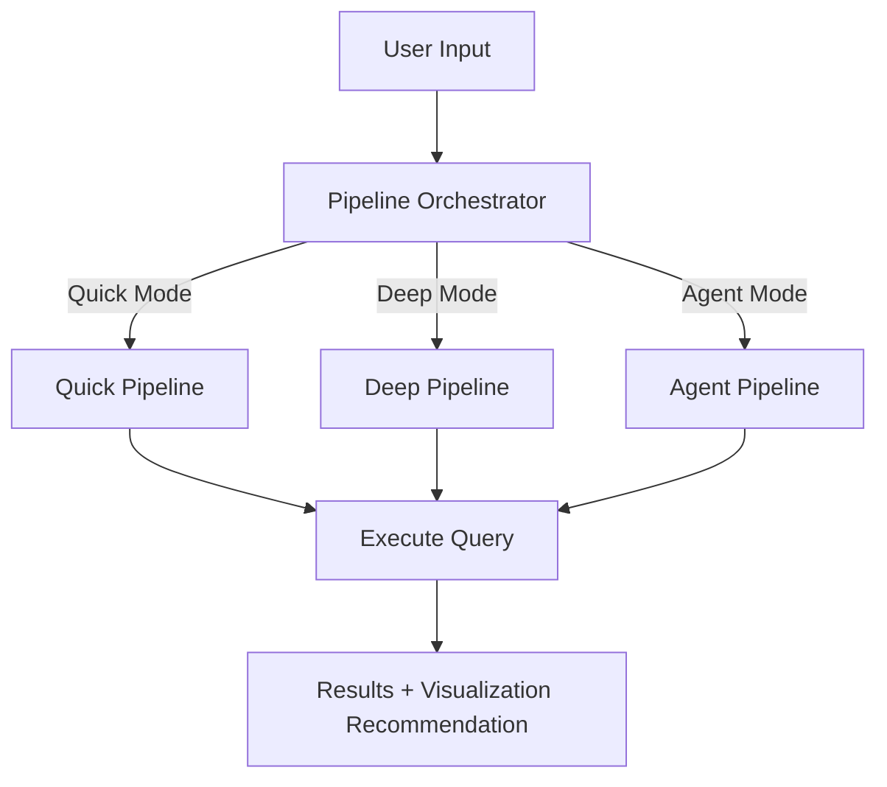
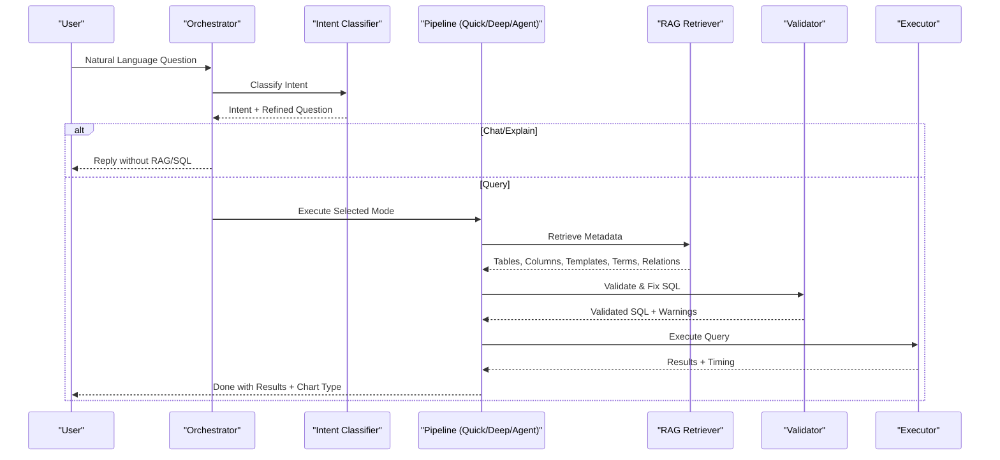
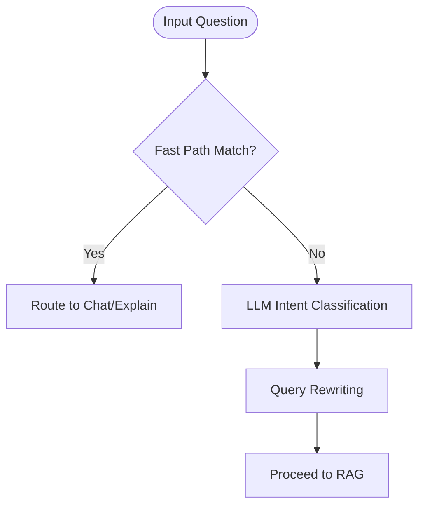
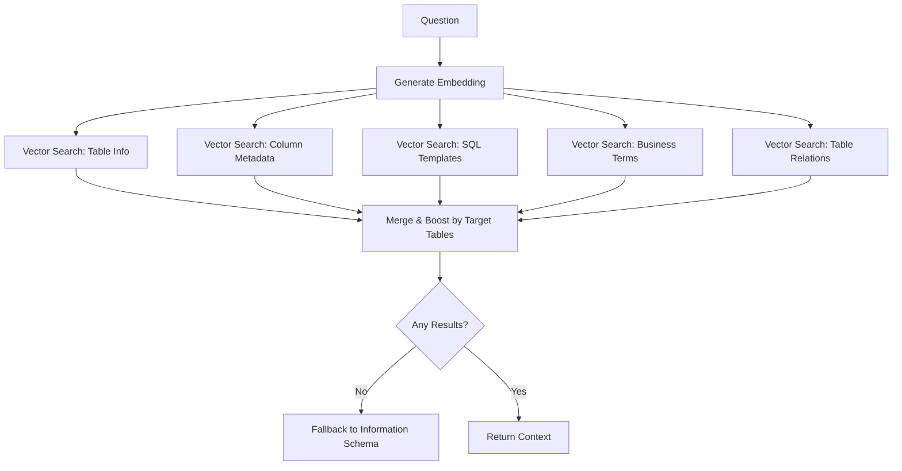
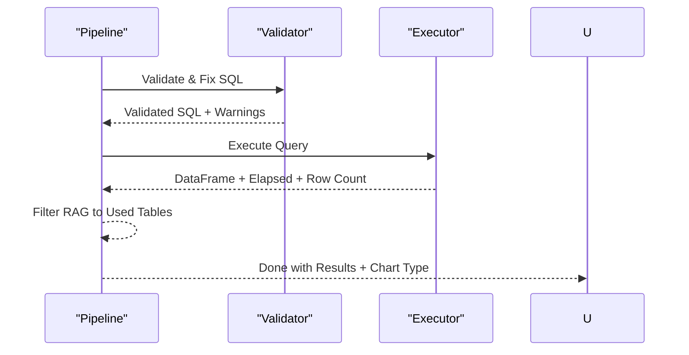
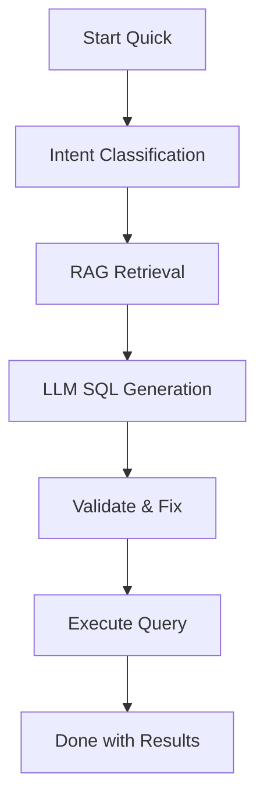
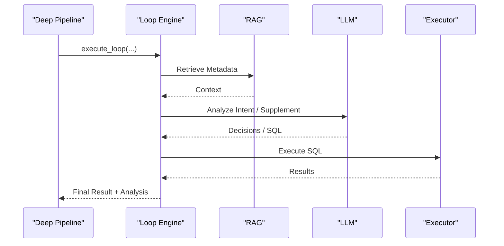
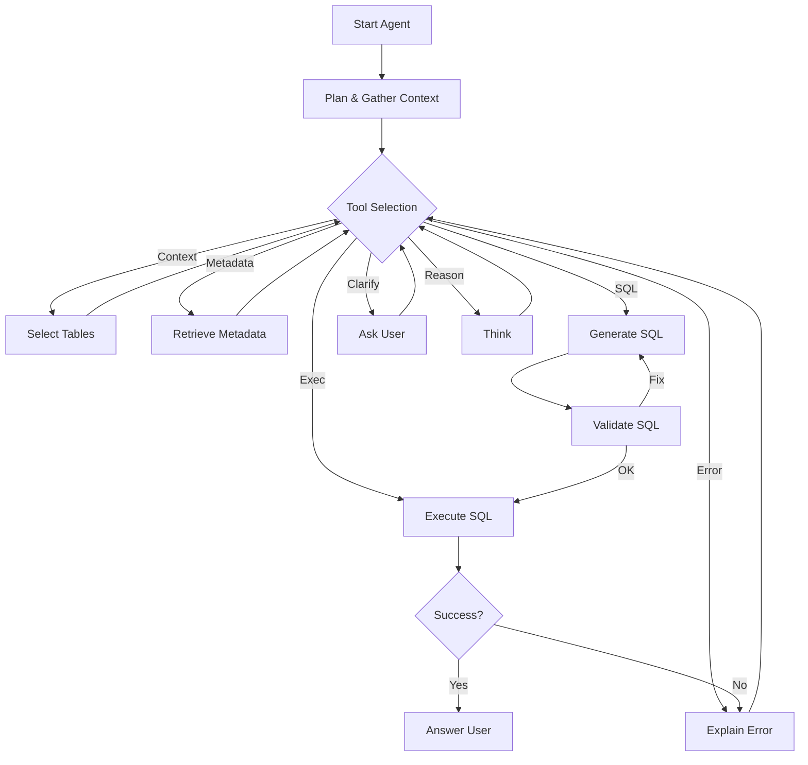
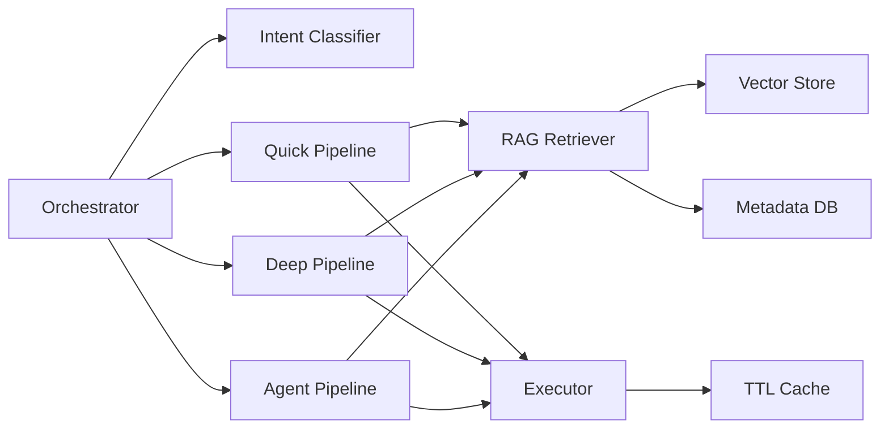

# Data Flow

<cite>
**Referenced Files in This Document**
- [pipeline_orchestrator.py](file://services/datamind/nl2sql/orchestrator/pipeline_orchestrator.py)
- [quick_pipeline.py](file://services/datamind/nl2sql/orchestrator/quick_pipeline.py)
- [deep_pipeline.py](file://services/datamind/nl2sql/orchestrator/deep_pipeline.py)
- [agent_pipeline.py](file://services/datamind/nl2sql/orchestrator/agent_pipeline.py)
- [intent_classifier.py](file://services/datamind/nl2sql/intent/intent_classifier.py)
- [rag_retriever.py](file://services/datamind/rag/rag_retriever.py)
- [query_executor.py](file://services/datamind/nl2sql/sql/query_executor.py)
- [loop_engine.py](file://services/datamind/nl2sql/orchestrator/workflow/loop_engine.py)
- [ttl_cache.py](file://services/shared/common/ttl_cache.py)
- [local.py](file://services/shared/common/cache/local.py)
</cite>

## Table of Contents
1. Introduction
2. Project Structure
3. Core Components
4. Architecture Overview
5. Detailed Component Analysis
6. Dependency Analysis
7. Performance Considerations
8. Troubleshooting Guide
9. Conclusion

## Introduction
This document explains the end-to-end data flow for AI-DataHub’s query processing pipeline, from natural language input to visualization recommendation. It covers:
- Intent classification and query rewriting
- RAG retrieval (tables, columns, templates, business terms, relations)
- SQL generation, validation, and execution
- Result processing and chart-type recommendation
- Three processing modes: Quick, Deep, and Agent
- Caching strategies, error recovery, and performance optimizations

## Project Structure
The pipeline is orchestrated by a central router that selects between Quick, Deep, and Agent modes based on user intent and configuration. Each mode implements a distinct data flow with different complexity and capabilities.

**Diagram sources**
- [pipeline_orchestrator.py:73-237](file://services/datamind/nl2sql/orchestrator/pipeline_orchestrator.py#L73-L237)
- [quick_pipeline.py:120-473](file://services/datamind/nl2sql/orchestrator/quick_pipeline.py#L120-L473)
- [deep_pipeline.py:39-219](file://services/datamind/nl2sql/orchestrator/deep_pipeline.py#L39-L219)
- [agent_pipeline.py:1-800](file://services/datamind/nl2sql/orchestrator/agent_pipeline.py#L1-L800)
- [query_executor.py:566-624](file://services/datamind/nl2sql/sql/query_executor.py#L566-L624)

**Section sources**
- [pipeline_orchestrator.py:73-237](file://services/datamind/nl2sql/orchestrator/pipeline_orchestrator.py#L73-L237)

## Core Components
- Intent Classifier: Fast-path regex plus LLM-based classification to route queries into chat, correction, explain, or query flows.
- RAG Retriever: Vector search over table info, column metadata, SQL templates, business terms, and table relations; includes BM25 hybrid retrieval and fallbacks.
- SQL Validator and Executor: Safety checks, limit enforcement, multi-datasource support (Doris/MySQL/Elasticsearch), audit logging.
- Orchestration Modes:
  - Quick: Streamlined NL2SQL path optimized for speed.
  - Deep: Full RAG loop engineering with metadata supplement and result analysis.
  - Agent: Autonomous tool-calling agent with MCP integration and multi-step reasoning.

**Section sources**
- [intent_classifier.py:82-199](file://services/datamind/nl2sql/intent/intent_classifier.py#L82-L199)
- [rag_retriever.py:30-800](file://services/datamind/rag/rag_retriever.py#L30-L800)
- [query_executor.py:193-256](file://services/datamind/nl2sql/sql/query_executor.py#L193-L256)
- [pipeline_orchestrator.py:73-237](file://services/datamind/nl2sql/orchestrator/pipeline_orchestrator.py#L73-L237)

## Architecture Overview
The system routes each request through an orchestrator that classifies intent and chooses the appropriate pipeline. All pipelines emit standardized SSE-like events (progress, token, thinking, done) for real-time UI updates.

**Diagram sources**
- [pipeline_orchestrator.py:73-237](file://services/datamind/nl2sql/orchestrator/pipeline_orchestrator.py#L73-L237)
- [intent_classifier.py:82-199](file://services/datamind/nl2sql/intent/intent_classifier.py#L82-L199)
- [rag_retriever.py:753-786](file://services/datamind/rag/rag_retriever.py#L753-L786)
- [query_executor.py:566-624](file://services/datamind/nl2sql/sql/query_executor.py#L566-L624)

## Detailed Component Analysis

### Intent Classification and Query Rewriting
- Fast-path detection for greetings, corrections, and explanations avoids LLM calls when possible.
- For ambiguous cases, an LLM call classifies intent and refines the question.
- Query rewriting normalizes pronouns, time expressions, and expands synonyms before RAG retrieval.

**Diagram sources**
- [intent_classifier.py:82-199](file://services/datamind/nl2sql/intent/intent_classifier.py#L82-L199)
- [quick_pipeline.py:211-225](file://services/datamind/nl2sql/orchestrator/quick_pipeline.py#L211-L225)

**Section sources**
- [intent_classifier.py:82-199](file://services/datamind/nl2sql/intent/intent_classifier.py#L82-L199)
- [quick_pipeline.py:211-225](file://services/datamind/nl2sql/orchestrator/quick_pipeline.py#L211-L225)

### RAG Retrieval
- Retrieves table info, column metadata, SQL templates, business terms, and table relations using vector similarity.
- Supports BM25 sparse retrieval combined with dense vector search via Reciprocal Rank Fusion for columns.
- Includes caching at module level (e.g., RAG results cache, column index cache).
- Falls back to information_schema if vector tables are empty or search fails.

**Diagram sources**
- [rag_retriever.py:74-143](file://services/datamind/rag/rag_retriever.py#L74-L143)
- [rag_retriever.py:149-257](file://services/datamind/rag/rag_retriever.py#L149-L257)
- [rag_retriever.py:369-463](file://services/datamind/rag/rag_retriever.py#L369-L463)
- [rag_retriever.py:492-547](file://services/datamind/rag/rag_retriever.py#L492-L547)
- [rag_retriever.py:550-646](file://services/datamind/rag/rag_retriever.py#L550-L646)
- [rag_retriever.py:674-750](file://services/datamind/rag/rag_retriever.py#L674-L750)
- [rag_retriever.py:753-786](file://services/datamind/rag/rag_retriever.py#L753-L786)

**Section sources**
- [rag_retriever.py:30-800](file://services/datamind/rag/rag_retriever.py#L30-L800)

### SQL Generation, Validation, and Execution
- SQL generation uses LLM prompts built from RAG context; supports streaming responses.
- Validation enforces read-only queries, blocks DDL/DML, ensures LIMIT clauses, and sanitizes output.
- Execution supports Doris/MySQL via pymysql and Elasticsearch via SQL/REST/DSL; includes preprocessing for ES-specific issues.
- Audit logging records user, question, SQL, status, timing, and errors.

**Diagram sources**
- [quick_pipeline.py:323-473](file://services/datamind/nl2sql/orchestrator/quick_pipeline.py#L323-L473)
- [query_executor.py:193-256](file://services/datamind/nl2sql/sql/query_executor.py#L193-L256)
- [query_executor.py:566-624](file://services/datamind/nl2sql/sql/query_executor.py#L566-L624)

**Section sources**
- [quick_pipeline.py:323-473](file://services/datamind/nl2sql/orchestrator/quick_pipeline.py#L323-L473)
- [query_executor.py:193-256](file://services/datamind/nl2sql/sql/query_executor.py#L193-L256)
- [query_executor.py:566-624](file://services/datamind/nl2sql/sql/query_executor.py#L566-L624)

### Processing Modes

#### Quick Mode
- Purpose: Fast, simple data queries with minimal overhead.
- Flow: Intent → RAG → LLM SQL Gen → Validate → Execute.
- Features: Query rewriting, sensitive keyword check, feasibility assessment, multi-step planning hints, streaming LLM tokens, result filtering to used tables.

**Diagram sources**
- [quick_pipeline.py:120-473](file://services/datamind/nl2sql/orchestrator/quick_pipeline.py#L120-L473)

**Section sources**
- [quick_pipeline.py:120-473](file://services/datamind/nl2sql/orchestrator/quick_pipeline.py#L120-L473)

#### Deep Mode
- Purpose: Complex analysis with full RAG loop engineering, metadata supplement, and result interpretation.
- Flow: Delegates to Loop Engine which iterates metadata retrieval, LLM analysis, optional metadata supplement, SQL generation, execution, and result analysis.
- Features: Configurable workflow steps, max rounds, reserved steps, progress callbacks, streaming tokens/thinking.

**Diagram sources**
- [deep_pipeline.py:39-219](file://services/datamind/nl2sql/orchestrator/deep_pipeline.py#L39-L219)
- [loop_engine.py:1-200](file://services/datamind/nl2sql/orchestrator/workflow/loop_engine.py#L1-L200)

**Section sources**
- [deep_pipeline.py:39-219](file://services/datamind/nl2sql/orchestrator/deep_pipeline.py#L39-L219)
- [loop_engine.py:1-200](file://services/datamind/nl2sql/orchestrator/workflow/loop_engine.py#L1-L200)

#### Agent Mode
- Purpose: Multi-step reasoning with autonomous tool calling, MCP tools, and sub-agent orchestration.
- Flow: Agent plan → tool selection (list_tables, select_tables, retrieve_metadata, generate_sql, validate_sql, execute_sql, explain_error, ask_user, think) → self-correction loops → final answer.
- Features: Tool result truncation, doom-loop detection, context compaction, ask-user interaction, workspace-scoped resources.

**Diagram sources**
- [agent_pipeline.py:477-724](file://services/datamind/nl2sql/orchestrator/agent_pipeline.py#L477-L724)
- [agent_pipeline.py:775-800](file://services/datamind/nl2sql/orchestrator/agent_pipeline.py#L775-L800)

**Section sources**
- [agent_pipeline.py:1-800](file://services/datamind/nl2sql/orchestrator/agent_pipeline.py#L1-L800)

### Data Transformation and State Management
- Inputs: Natural language question, conversation history, datasource_id, model_id, retrieval_strategy.
- Intermediate states:
  - Intent and refined question
  - Canonical query after rewriting
  - RAG context (tables, columns, templates, terms, relations)
  - Generated SQL and warnings
  - Execution results (columns, rows, row_count, elapsed_ms)
- Outputs: Structured event payloads including result, rag details, timings, chart_type, and mode.

**Section sources**
- [quick_pipeline.py:120-473](file://services/datamind/nl2sql/orchestrator/quick_pipeline.py#L120-L473)
- [deep_pipeline.py:39-219](file://services/datamind/nl2sql/orchestrator/deep_pipeline.py#L39-L219)
- [agent_pipeline.py:1-800](file://services/datamind/nl2sql/orchestrator/agent_pipeline.py#L1-L800)

## Dependency Analysis
Key dependencies across components:
- Orchestrator depends on Intent Classifier and three pipeline implementations.
- Pipelines depend on RAG Retriever, Prompt Builder, LLM Client, Validators, and Executor.
- Executor depends on connection managers and TTL cache for datasource configs.
- RAG depends on vector stores and metadata databases with fallbacks.

**Diagram sources**
- [pipeline_orchestrator.py:73-237](file://services/datamind/nl2sql/orchestrator/pipeline_orchestrator.py#L73-L237)
- [quick_pipeline.py:120-473](file://services/datamind/nl2sql/orchestrator/quick_pipeline.py#L120-L473)
- [deep_pipeline.py:39-219](file://services/datamind/nl2sql/orchestrator/deep_pipeline.py#L39-L219)
- [agent_pipeline.py:1-800](file://services/datamind/nl2sql/orchestrator/agent_pipeline.py#L1-L800)
- [rag_retriever.py:753-786](file://services/datamind/rag/rag_retriever.py#L753-L786)
- [query_executor.py:35-97](file://services/datamind/nl2sql/sql/query_executor.py#L35-L97)
- [ttl_cache.py:101-117](file://services/shared/common/ttl_cache.py#L101-L117)

**Section sources**
- [pipeline_orchestrator.py:73-237](file://services/datamind/nl2sql/orchestrator/pipeline_orchestrator.py#L73-L237)
- [rag_retriever.py:753-786](file://services/datamind/rag/rag_retriever.py#L753-L786)
- [query_executor.py:35-97](file://services/datamind/nl2sql/sql/query_executor.py#L35-L97)
- [ttl_cache.py:101-117](file://services/shared/common/ttl_cache.py#L101-L117)

## Performance Considerations
- Caching Strategies:
  - RAG results cache (in-memory LRU) reduces repeated retrievals for similar questions.
  - Column BM25 index cached per datasource accelerates sparse retrieval.
  - Datasource config cached with TTL to avoid frequent DB lookups.
  - Local cache backend provides thread-safe TTL and LRU eviction for single-process deployments.
- Optimization Techniques:
  - Hybrid retrieval (BM25 + vector) with RRF improves relevance and reduces noise.
  - Streaming LLM responses enable progressive UI updates and lower perceived latency.
  - Limit enforcement and query preprocessing reduce execution overhead and errors.
  - Fallback mechanisms ensure robustness when vector search fails or returns empty.
- Monitoring:
  - Timings captured per stage (intent, rag, llm, validate, execute) for performance analysis.
  - Audit logs record query outcomes, timing, and errors for traceability.

[No sources needed since this section provides general guidance]

## Troubleshooting Guide
Common issues and recovery mechanisms:
- Intent Classification Failures:
  - Fast-path fallback defaults to query intent; LLM exceptions return safe defaults.
- RAG Retrieval Failures:
  - Vector search exceptions logged; fallback to information_schema if no results.
  - Column sensitive filters applied to prevent leakage of restricted fields.
- SQL Validation Errors:
  - Strict read-only enforcement; multiple statements blocked; LIMIT required.
  - Preprocessing extracts clean SQL from LLM outputs and removes comments/markdown.
- Execution Errors:
  - Exceptions caught and re-raised with context; audit logs written even on failure.
  - Elasticsearch preprocessing fixes common LLM-generated SQL issues.
- Agent Mode Loops:
  - Doom-loop detection prevents repetitive tool calls; context compaction manages token budgets.
  - Ask-user interaction pauses loop until user response or timeout.

**Section sources**
- [intent_classifier.py:128-199](file://services/datamind/nl2sql/intent/intent_classifier.py#L128-L199)
- [rag_retriever.py:140-143](file://services/datamind/rag/rag_retriever.py#L140-L143)
- [rag_retriever.py:249-254](file://services/datamind/rag/rag_retriever.py#L249-L254)
- [query_executor.py:193-256](file://services/datamind/nl2sql/sql/query_executor.py#L193-L256)
- [query_executor.py:596-624](file://services/datamind/nl2sql/sql/query_executor.py#L596-L624)
- [agent_pipeline.py:38-59](file://services/datamind/nl2sql/orchestrator/agent_pipeline.py#L38-L59)
- [agent_pipeline.py:74-105](file://services/datamind/nl2sql/orchestrator/agent_pipeline.py#L74-L105)

## Conclusion
AI-DataHub’s query processing pipeline provides a robust, scalable architecture for transforming natural language into actionable insights. The three modes—Quick, Deep, and Agent—balance speed, depth, and autonomy to meet diverse analytical needs. Strong caching, validation, and error recovery ensure reliability, while streaming events and detailed timings enhance user experience and observability.

[No sources needed since this section summarizes without analyzing specific files]