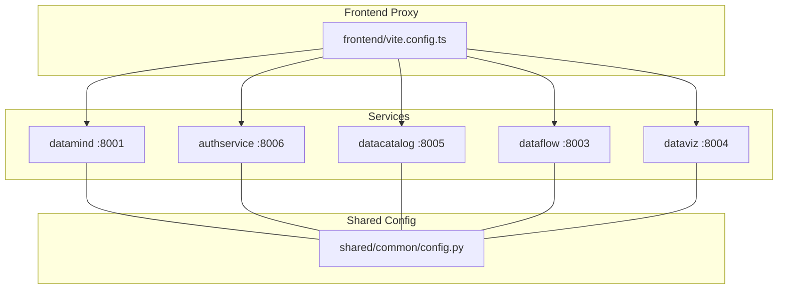
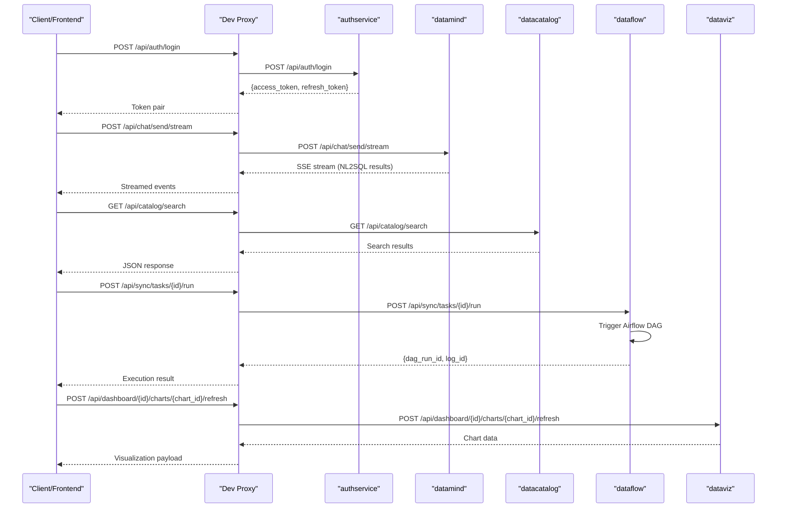
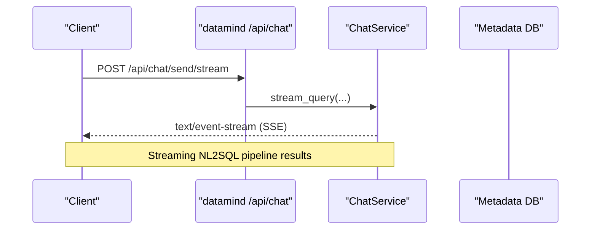
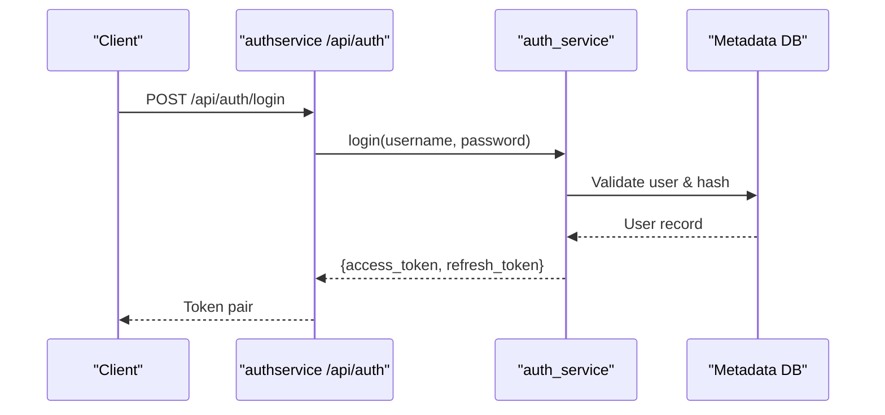
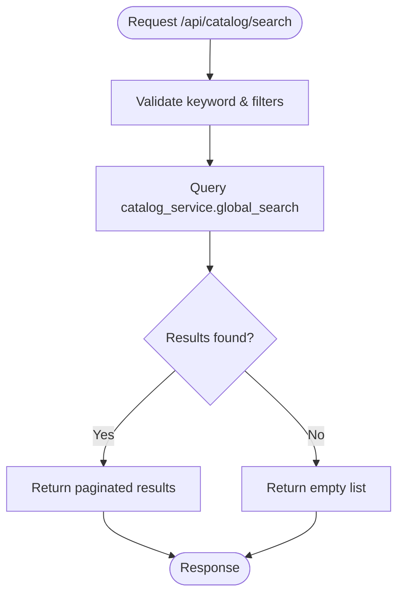
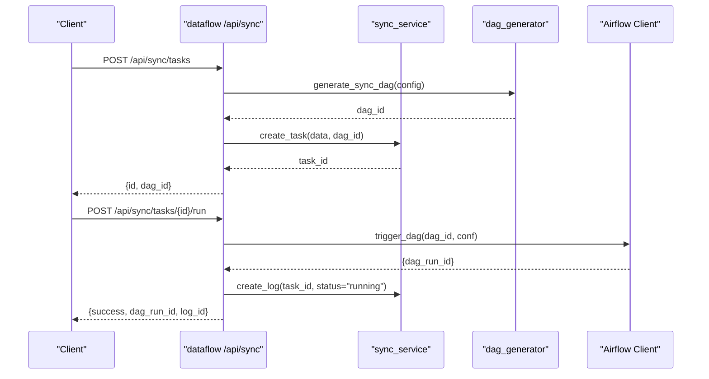
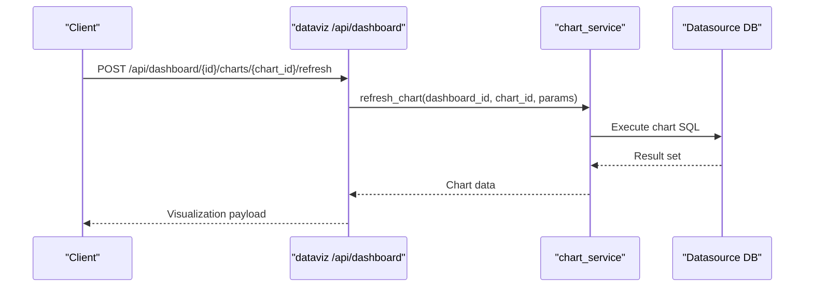
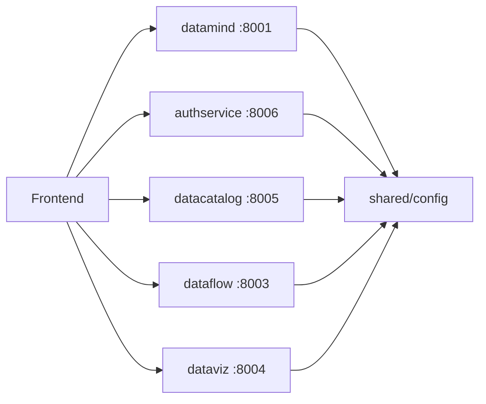

# Microservices Breakdown

<cite>
**Referenced Files in This Document**
- [main.py](file://services/datamind/main.py)
- [chat.py](file://services/datamind/api/chat.py)
- [config.py](file://services/shared/common/config.py)
- [auth.py](file://services/shared/common/auth.py)
- [main.py](file://services/authservice/main.py)
- [auth.py](file://services/authservice/api/auth.py)
- [main.py](file://services/datacatalog/main.py)
- [catalog.py](file://services/datacatalog/api/catalog.py)
- [main.py](file://services/dataflow/main.py)
- [sync.py](file://services/dataflow/api/sync.py)
- [main.py](file://services/dataviz/main.py)
- [dashboard.py](file://services/dataviz/api/dashboard.py)
- [docker-compose.yml](file://docker-compose.yml)
</cite>

## Table of Contents
1. [Introduction](#introduction)
2. [Project Structure](#project-structure)
3. [Core Components](#core-components)
4. [Architecture Overview](#architecture-overview)
5. [Detailed Component Analysis](#detailed-component-analysis)
6. [Dependency Analysis](#dependency-analysis)
7. [Performance Considerations](#performance-considerations)
8. [Troubleshooting Guide](#troubleshooting-guide)
9. [Conclusion](#conclusion)

## Introduction
This document provides a detailed breakdown of AI-DataHub’s microservices architecture, focusing on five core services: datamind (AI engine with NL2SQL, multi-agent orchestration, and RAG pipeline), authservice (authentication, authorization, RBAC), datacatalog (metadata management, glossary, tags), dataflow (workflow orchestration, scheduled tasks, sync operations), and dataviz (dashboard creation, chart generation, visualization services). For each service, we describe responsibilities, key endpoints, internal architecture, dependencies, storage patterns, communication protocols, error handling strategies, and scaling considerations.

## Project Structure
AI-DataHub is organized as a set of independent FastAPI-based microservices under services/, each exposing REST APIs and optionally MCP servers for AI tool integration. A shared configuration module centralizes environment-driven settings for databases, vector stores, LLMs, Redis, and service ports. Frontend proxies route API calls to the appropriate services during development.

**Diagram sources**
- [config.py:122-140](file://services/shared/common/config.py#L122-L140)
- [docker-compose.yml:1-48](file://docker-compose.yml#L1-L48)

**Section sources**
- [config.py:1-163](file://services/shared/common/config.py#L1-L163)
- [docker-compose.yml:1-48](file://docker-compose.yml#L1-L48)

## Core Components
- datamind: Exposes chat/NL2SQL streaming and non-streaming endpoints, agent dispatch, knowledge base, pipeline execution, query history, playground, and model config. It initializes an agent registry at startup and flushes observability events on shutdown.
- authservice: Provides login, token refresh, logout, user management, workspaces, roles, and audit logging. Uses JWT-based authentication and bcrypt password hashing with lockout policies.
- datacatalog: Offers catalog search, table listing/detail, metrics, tags, glossary, datasources, menu, and admin compatibility endpoints.
- dataflow: Manages sync tasks with Airflow DAG integration, workflow orchestration, scheduled tasks, and notifications. Includes CRUD for sync tasks, execution triggers, and logs.
- dataviz: Handles dashboards, charts, snapshots, report generation, and component data. Supports CRUD for dashboards/charts, layout updates, and data refresh from configured datasources.

**Section sources**
- [main.py:1-98](file://services/datamind/main.py#L1-L98)
- [main.py:1-71](file://services/authservice/main.py#L1-L71)
- [main.py:1-61](file://services/datacatalog/main.py#L1-L61)
- [main.py:1-75](file://services/dataflow/main.py#L1-L75)
- [main.py:1-70](file://services/dataviz/main.py#L1-L70)

## Architecture Overview
The system uses HTTP/REST for inter-service communication and exposes MCP servers for external AI tools. Each service mounts routers under consistent prefixes and includes CORS middleware. Shared configuration defines service ports and database/vector store connections. The frontend proxies route requests to the correct service based on path prefixes.

**Diagram sources**
- [chat.py:35-91](file://services/datamind/api/chat.py#L35-L91)
- [catalog.py:12-61](file://services/datacatalog/api/catalog.py#LL12-L61)
- [sync.py:156-185](file://services/dataflow/api/sync.py#L156-L185)
- [dashboard.py:331-354](file://services/dataviz/api/dashboard.py#L331-L354)
- [auth.py:21-51](file://services/authservice/api/auth.py#L21-L51)

**Section sources**
- [config.py:122-140](file://services/shared/common/config.py#L122-L140)
- [docker-compose.yml:1-48](file://docker-compose.yml#L1-L48)

## Detailed Component Analysis

### datamind (AI Engine: NL2SQL, Multi-Agent Orchestration, RAG Pipeline)
Responsibilities:
- Provide chat endpoints for NL2SQL with streaming and non-streaming responses.
- Manage conversations and query history.
- Initialize agent registry for deep/agent modes and flush observability events on shutdown.

Key Endpoints:
- POST /api/chat/send/stream: Streaming NL2SQL query execution.
- POST /api/chat/send: Non-streaming NL2SQL query execution.
- GET /api/chat/conversations: List user conversations.
- GET /api/chat/conversations/{conv_id}: Get conversation details.
- DELETE /api/chat/conversations/{conv_id}: Delete conversation.

Internal Architecture:
- FastAPI app mounts routers for chat, agent, knowledge, pipeline, query, history, playground, and model-config.
- Startup event pre-warms agent registry; shutdown flushes Langfuse events.

Dependencies:
- Shared auth dependency get_current_user for user context.
- Metadata DB via metadata_db connection for conversation persistence.

Storage Patterns:
- Conversations stored in adh_conversations with messages serialized as JSON.

Error Handling:
- Raises HTTPException for not found or invalid inputs.
- Graceful warnings on agent registry init failures.

Scaling Considerations:
- Use async streaming for long-running NL2SQL queries.
- Consider horizontal scaling behind a reverse proxy with appropriate timeouts for streaming.

**Diagram sources**
- [chat.py:35-63](file://services/datamind/api/chat.py#L35-L63)

**Section sources**
- [main.py:1-98](file://services/datamind/main.py#L1-L98)
- [chat.py:1-179](file://services/datamind/api/chat.py#L1-L179)

### authservice (Authentication, Authorization, RBAC)
Responsibilities:
- Authenticate users, issue JWT tokens, refresh access tokens, and handle logout.
- Manage users, roles, workspaces, and audit logs.

Key Endpoints:
- POST /api/auth/login: Login with username/password.
- POST /api/auth/refresh: Exchange refresh token for new access token.
- POST /api/auth/logout: Stateless logout (client discards tokens).

Internal Architecture:
- FastAPI app mounts routers for auth, users, workspaces, roles, and audit.
- Uses JWT HS256 with secret key from shared config.
- Implements login attempt tracking and account lockout.

Dependencies:
- Shared auth module for JWT validation, bcrypt hashing, and user CRUD.
- Metadata DB for user and audit tables.

Storage Patterns:
- Users stored in adh_users with encrypted sensitive fields (email, phone).
- Audit logs stored in adh_audit_logs.

Error Handling:
- Returns 401 for invalid credentials or expired tokens.
- Returns 403 for forbidden actions or locked accounts.

Scaling Considerations:
- Stateless JWT allows horizontal scaling; ensure secret key consistency across replicas.
- Consider rate limiting on login endpoints.

**Diagram sources**
- [auth.py:21-51](file://services/authservice/api/auth.py#L21-L51)
- [auth.py:234-289](file://services/shared/common/auth.py#L234-L289)

**Section sources**
- [main.py:1-71](file://services/authservice/main.py#L1-L71)
- [auth.py:1-52](file://services/authservice/api/auth.py#L1-L52)
- [auth.py:1-630](file://services/shared/common/auth.py#L1-L630)

### datacatalog (Metadata Management, Glossary, Tags)
Responsibilities:
- Provide global search across tables, columns, metrics, and terms.
- List and detail tables with pagination and filtering.
- Expose metrics, tags, glossary, datasources, menu, and admin compatibility endpoints.

Key Endpoints:
- GET /api/catalog/search: Global search with filters.
- GET /api/catalog/tables: Paginated table listing with datasource filter.
- GET /api/catalog/tables/{table_name}: Table detail with columns.

Internal Architecture:
- FastAPI app mounts routers for catalog, metadata, templates, glossary, lineage, metrics, tags, datasources, menu, and admin compat.
- Delegates business logic to catalog_service.

Dependencies:
- catalog_service for search and listing operations.
- Metadata DB for catalog data.

Storage Patterns:
- Catalog entries stored in metadata DB with workspace scoping.

Error Handling:
- Returns 404 when table not found.

Scaling Considerations:
- Use caching for frequent searches if needed.
- Index metadata fields for performance.

**Diagram sources**
- [catalog.py:12-26](file://services/datacatalog/api/catalog.py#L12-L26)

**Section sources**
- [main.py:1-61](file://services/datacatalog/main.py#L1-L61)
- [catalog.py:1-61](file://services/datacatalog/api/catalog.py#L1-L61)

### dataflow (Workflow Orchestration, Scheduled Tasks, Sync Operations)
Responsibilities:
- Manage sync tasks with Airflow DAG integration.
- Provide CRUD for sync tasks, trigger executions, and retrieve logs.
- Handle workflow orchestration and scheduled tasks.

Key Endpoints:
- GET /api/sync/tasks: List sync tasks with pagination.
- POST /api/sync/tasks: Create sync task and generate Airflow DAG.
- PUT /api/sync/tasks/{task_id}: Update sync task (regenerates DAG if config changed).
- DELETE /api/sync/tasks/{task_id}: Delete sync task and logs.
- POST /api/sync/tasks/{task_id}/run: Trigger sync execution via Airflow.
- GET /api/sync/tasks/{task_id}/logs: Get execution logs for a task.
- GET /api/sync/logs: Get all sync execution logs.

Internal Architecture:
- FastAPI app mounts routers for sync, workflow, scheduled tasks, and notifications.
- Uses BackgroundTasks for async operations and integrates with Airflow client.

Dependencies:
- sync_service for task CRUD and logging.
- dag_generator for generating Airflow DAGs.
- airflow_client for triggering DAG runs.

Storage Patterns:
- Sync tasks and logs stored in adh_sync_tasks and adh_sync_logs.

Error Handling:
- Validates sync_mode and raises 400 for invalid values.
- Raises 404 for missing tasks.
- Raises 502 when Airflow trigger fails.

Scaling Considerations:
- Offload DAG execution to Airflow for scalability.
- Use background tasks for long-running operations.

**Diagram sources**
- [sync.py:81-105](file://services/dataflow/api/sync.py#L81-L105)
- [sync.py:156-185](file://services/dataflow/api/sync.py#L156-L185)

**Section sources**
- [main.py:1-75](file://services/dataflow/main.py#L1-L75)
- [sync.py:1-210](file://services/dataflow/api/sync.py#L1-L210)

### dataviz (Dashboard Creation, Chart Generation, Visualization Services)
Responsibilities:
- Provide CRUD for dashboards and charts.
- Support dashboard layout updates, chart refresh, and snapshot retrieval.
- Generate reports and manage component data.

Key Endpoints:
- GET /api/dashboard/: List dashboards.
- POST /api/dashboard/: Create dashboard.
- GET /api/dashboard/{id}: Get dashboard with charts.
- PUT /api/dashboard/{id}: Update dashboard.
- DELETE /api/dashboard/{id}: Delete dashboard.
- POST /api/dashboard/{id}/copy: Copy dashboard with charts.
- POST /api/dashboard/{id}/charts: Add chart to dashboard.
- PUT /api/dashboard/{id}/charts/{chart_id}: Update chart.
- DELETE /api/dashboard/{id}/charts/{chart_id}: Remove chart.
- POST /api/dashboard/{id}/charts/{chart_id}/refresh: Refresh chart data.
- POST /api/dashboard/{id}/refresh: Refresh all charts.
- PUT /api/dashboard/{id}/layout: Batch update chart positions.
- GET /api/dashboard/snapshots: List recent snapshots.
- GET /api/dashboard/snapshots/{snapshot_id}/data: Get snapshot data.

Internal Architecture:
- FastAPI app mounts routers for dashboard, chart, report, and component_data.
- Uses dashboard_service, chart_service, and snapshot_service for business logic.

Dependencies:
- Shared auth dependency get_current_user and get_workspace_id for user context.
- Direct SQL execution via pymysql for chart data refresh.

Storage Patterns:
- Dashboards and charts stored in metadata DB with workspace scoping.
- Snapshots stored for chart execution history.

Error Handling:
- Raises 404 for missing dashboards/charts.
- Raises 400 for invalid SQL or parameters.
- Catches pymysql errors and returns descriptive messages.

Scaling Considerations:
- Use connection pooling for SQL execution.
- Cache frequently accessed dashboard layouts.

**Diagram sources**
- [dashboard.py:331-354](file://services/dataviz/api/dashboard.py#L331-L354)

**Section sources**
- [main.py:1-70](file://services/dataviz/main.py#L1-L70)
- [dashboard.py:1-388](file://services/dataviz/api/dashboard.py#L1-L388)

## Dependency Analysis
Inter-service dependencies are primarily HTTP/REST-based, with shared configuration defining service ports and database connections. The frontend proxies route requests to the appropriate services based on path prefixes.

**Diagram sources**
- [config.py:122-140](file://services/shared/common/config.py#L122-L140)

**Section sources**
- [config.py:1-163](file://services/shared/common/config.py#L1-L163)

## Performance Considerations
- Streaming Responses: datamind uses SSE for NL2SQL to provide real-time feedback for long-running queries.
- Background Tasks: dataflow uses BackgroundTasks for async operations like DAG triggers.
- Connection Pooling: dataviz executes SQL directly; consider connection pooling for high concurrency.
- Caching: Implement caching for frequent catalog searches and dashboard layouts.
- Timeouts: Configure appropriate timeouts for long-running AI and workflow operations.

[No sources needed since this section provides general guidance]

## Troubleshooting Guide
Common issues and resolutions:
- Authentication Failures: Check JWT secret key configuration and token expiration. Ensure passwords meet strength requirements and accounts are not locked.
- Database Connectivity: Verify metadata DB and vector DB configurations in shared config. Test connectivity and credentials.
- Airflow Integration: Ensure Airflow is reachable and DAGs are correctly generated. Check logs for trigger failures.
- SQL Execution Errors: Validate chart SQL syntax and datasource permissions. Review error messages for specific SQL issues.

**Section sources**
- [auth.py:234-289](file://services/shared/common/auth.py#L234-L289)
- [config.py:1-163](file://services/shared/common/config.py#L1-L163)
- [sync.py:156-185](file://services/dataflow/api/sync.py#L156-L185)
- [dashboard.py:331-354](file://services/dataviz/api/dashboard.py#L331-L354)

## Conclusion
AI-DataHub’s microservices architecture provides a modular, scalable foundation for AI-powered data analytics, governance, and visualization. Each service has clear responsibilities, well-defined endpoints, and robust error handling. The shared configuration and consistent API design enable easy integration and maintenance. By leveraging streaming, background tasks, and external orchestration (Airflow), the system supports both interactive and batch processing workflows. Proper scaling and caching strategies will further enhance performance and reliability.

[No sources needed since this section summarizes without analyzing specific files]