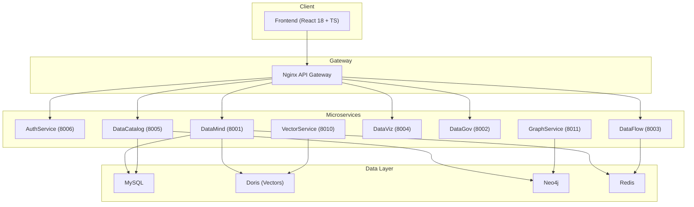
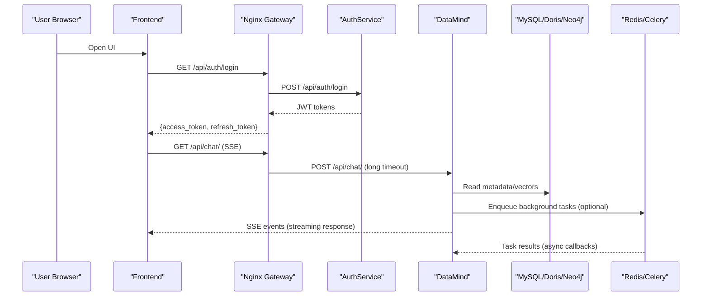
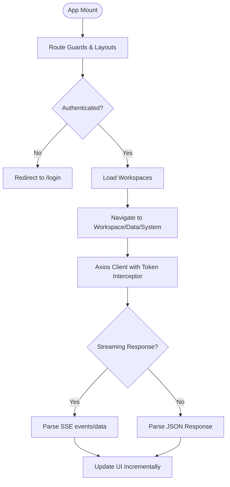
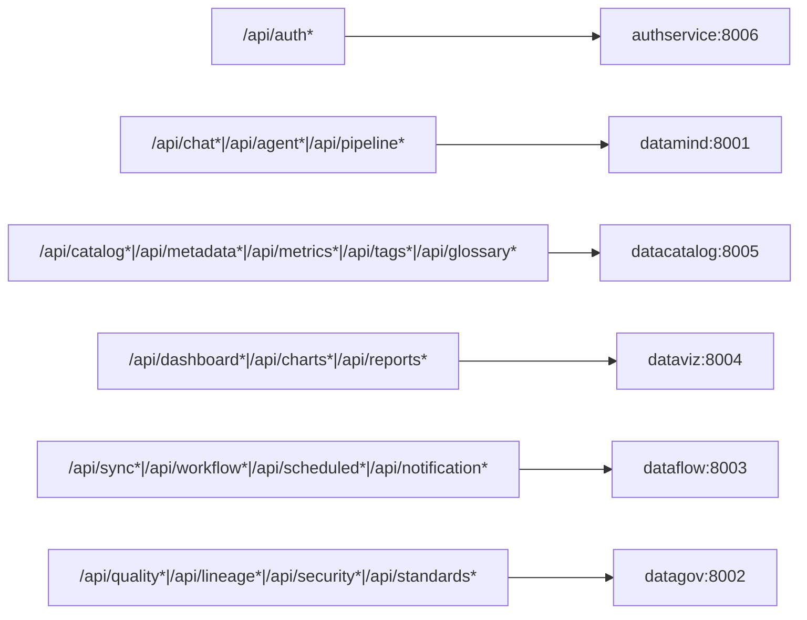
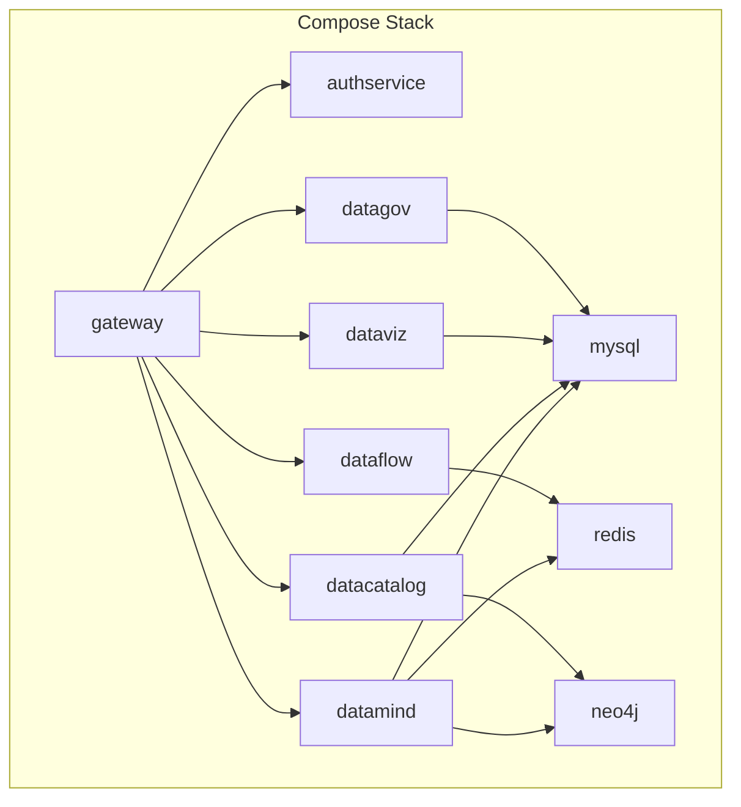
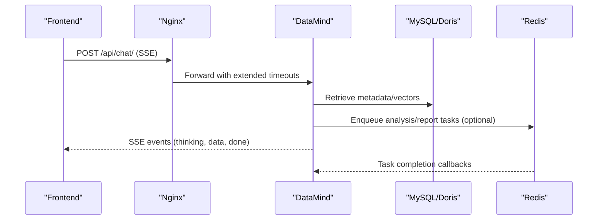

# System Architecture

<cite>
**Referenced Files in This Document**
- [docker-compose.yml](file://docker-compose.yml)
- [docker-compose.full.yml](file://docker-compose.full.yml)
- [services/docker-compose.yml](file://services/docker-compose.yml)
- [services/gateway/nginx.conf](file://services/gateway/nginx.conf)
- [services/authservice/main.py](file://services/authservice/main.py)
- [services/datamind/main.py](file://services/datamind/main.py)
- [services/datacatalog/main.py](file://services/datacatalog/main.py)
- [frontend/src/App.tsx](file://frontend/src/App.tsx)
- [frontend/src/api/client.ts](file://frontend/src/api/client.ts)
- [services/shared/common/config.py](file://services/shared/common/config.py)
- [services/dataflow/tasks/celery_app.py](file://services/dataflow/tasks/celery_app.py)
- [README.md](file://README.md)
</cite>

## Table of Contents
1. [Introduction](#introduction)
2. [Project Structure](#project-structure)
3. [Core Components](#core-components)
4. [Architecture Overview](#architecture-overview)
5. [Detailed Component Analysis](#detailed-component-analysis)
6. [Dependency Analysis](#dependency-analysis)
7. [Performance Considerations](#performance-considerations)
8. [Troubleshooting Guide](#troubleshooting-guide)
9. [Conclusion](#conclusion)
10. [Appendices](#appendices)

## Introduction
This document describes the system architecture of AI-DataHub, a multi-agent natural language business intelligence platform. It explains how the React 18 + TypeScript frontend communicates through an Nginx API gateway to a set of Python FastAPI microservices, which coordinate with data stores (MySQL, Doris vectors, Neo4j, Redis) and external LLM providers. It also details request flows including authentication, streaming responses via Server-Sent Events (SSE), background job processing with Celery/Redis, and service boundaries for scalability and fault tolerance.

## Project Structure
AI-DataHub is organized into:
- Frontend: React application served by Nginx or standalone container.
- Gateway: Nginx reverse proxy routing /api/* paths to microservices.
- Microservices: Auth, DataMind (AI engine), DataCatalog, DataFlow, DataViz, DataGov, VectorService, GraphService.
- Data Layer: MySQL (metadata), Doris (analytics/vector search), Neo4j (graph), Redis (queues/cache), optional Elasticsearch.

**Diagram sources**
- [services/gateway/nginx.conf:11-31](file://services/gateway/nginx.conf#L11-L31)
- [services/docker-compose.yml:42-194](file://services/docker-compose.yml#L42-L194)
- [services/shared/common/config.py:122-140](file://services/shared/common/config.py#L122-L140)

**Section sources**
- [services/docker-compose.yml:1-235](file://services/docker-compose.yml#L1-L235)
- [docker-compose.full.yml:1-107](file://docker-compose.full.yml#L1-L107)
- [services/gateway/nginx.conf:1-219](file://services/gateway/nginx.conf#L1-L219)

## Core Components
- Frontend: SPA with routes for workspace, data platform, and system modes; uses axios client with token refresh and SSE streaming for chat/agent responses.
- API Gateway: Nginx routes /api/* to microservices, configures timeouts and streaming headers for long-running LLM calls.
- AuthService: Handles authentication, users, workspaces, roles, audit.
- DataMind: AI engine providing NL2SQL, agent orchestration, RAG, knowledge base, pipelines, query execution, history, playground, model config.
- DataCatalog: Metadata, metrics, tags, glossary, lineage, datasources, menu.
- DataFlow: Data integration, scheduled tasks, workflows, notifications; uses Celery/Redis for async jobs.
- DataViz: Dashboards, charts, reports.
- DataGov: Quality, security, standards, lineage APIs.
- VectorService: Vector retrieval endpoints.
- GraphService: Knowledge graph operations.

**Section sources**
- [frontend/src/App.tsx:96-194](file://frontend/src/App.tsx#L96-L194)
- [frontend/src/api/client.ts:1-83](file://frontend/src/api/client.ts#L1-L83)
- [services/authservice/main.py:1-71](file://services/authservice/main.py#L1-L71)
- [services/datamind/main.py:1-98](file://services/datamind/main.py#L1-L98)
- [services/datacatalog/main.py:1-61](file://services/datacatalog/main.py#L1-L61)
- [services/dataflow/tasks/celery_app.py:1-108](file://services/dataflow/tasks/celery_app.py#L1-L108)

## Architecture Overview
The system follows a layered microservices architecture:
- Presentation layer: React SPA served via Nginx or containerized frontend.
- Gateway layer: Nginx reverse proxy with per-service upstreams and streaming support.
- Service layer: Domain-scoped FastAPI services exposing REST APIs.
- Data layer: Relational (MySQL), vector analytics (Doris), graph (Neo4j), caching/broker (Redis).

**Diagram sources**
- [services/gateway/nginx.conf:42-116](file://services/gateway/nginx.conf#L42-L116)
- [services/datamind/main.py:55-63](file://services/datamind/main.py#L55-L63)
- [services/shared/common/config.py:61-66](file://services/shared/common/config.py#L61-L66)

## Detailed Component Analysis

### Frontend (React 18 + TypeScript)
- Routing: Workspace mode (/ws/:id), Data Platform mode (/data/*), System mode (/system/*). Private routes enforce login state.
- HTTP Client: Axios instance under /api with Bearer token injection and automatic refresh on 401 using refresh_token stored in localStorage.
- Streaming: SSE reader parses event/data lines to render incremental assistant responses and thinking content.

**Diagram sources**
- [frontend/src/App.tsx:49-194](file://frontend/src/App.tsx#L49-L194)
- [frontend/src/api/client.ts:1-83](file://frontend/src/api/client.ts#L1-L83)

**Section sources**
- [frontend/src/App.tsx:96-194](file://frontend/src/App.tsx#L96-L194)
- [frontend/src/api/client.ts:1-83](file://frontend/src/api/client.ts#L1-L83)

### API Gateway (Nginx)
- Upstreams: Each microservice defined with host and port.
- Routing: /api/auth*, /api/chat*, /api/agent*, /api/pipeline*, /api/catalog*, /api/dashboard*, etc., proxied to respective services.
- Streaming: Disables buffering and sets HTTP/1.1 with Connection header for SSE; increases read/send timeouts for LLM calls.

**Diagram sources**
- [services/gateway/nginx.conf:11-31](file://services/gateway/nginx.conf#L11-L31)
- [services/gateway/nginx.conf:62-216](file://services/gateway/nginx.conf#L62-L216)

**Section sources**
- [services/gateway/nginx.conf:1-219](file://services/gateway/nginx.conf#L1-L219)

### AuthService
- Exposes REST endpoints for auth, users, workspaces, roles, audit.
- CORS enabled for cross-origin requests.
- Health endpoint for readiness checks.

**Section sources**
- [services/authservice/main.py:1-71](file://services/authservice/main.py#L1-L71)

### DataMind (AI Engine)
- FastAPI app with routers for chat, agent, knowledge, pipeline, query, history, playground, model-config.
- Startup initializes agent registry; shutdown flushes observability events.
- Long-lived LLM calls supported via gateway timeouts and SSE streaming from clients.

**Section sources**
- [services/datamind/main.py:1-98](file://services/datamind/main.py#L1-L98)

### DataCatalog
- Provides catalog, metadata, templates, glossary, lineage, metrics, tags, datasources, menu APIs.
- Health endpoint included.

**Section sources**
- [services/datacatalog/main.py:1-61](file://services/datacatalog/main.py#L1-L61)

### DataFlow (Background Jobs)
- Celery app configured with Redis broker/backend, queues (scheduled, default), task limits, retries, result expiry.
- Beat lock ensures single scheduler instance across multiple deployments.
- Dynamic schedule loading supports hot-reload of cron-based tasks.

**Section sources**
- [services/dataflow/tasks/celery_app.py:1-108](file://services/dataflow/tasks/celery_app.py#L1-L108)

### Configuration and Ports
- Centralized configuration defines database types/hosts, Redis URL, LLM settings, embedding model, Neo4j, service ports, MCP ports.
- Enables consistent environment setup across services.

**Section sources**
- [services/shared/common/config.py:1-163](file://services/shared/common/config.py#L1-L163)

## Dependency Analysis
- Container orchestration:
  - docker-compose.full.yml: MySQL, backend (legacy monolith), frontend with health checks and dependencies.
  - services/docker-compose.yml: Full microservices stack with gateway, services, Redis, Neo4j, and frontend.
- Service dependencies:
  - Gateway depends on all microservices.
  - DataMind depends on MySQL, Doris, Redis, Neo4j.
  - DataFlow depends on Redis (Celery).
  - DataCatalog depends on MySQL and Neo4j.
  - VectorService depends on Doris.
  - GraphService depends on Neo4j.

**Diagram sources**
- [services/docker-compose.yml:42-235](file://services/docker-compose.yml#L42-L235)
- [docker-compose.full.yml:7-99](file://docker-compose.full.yml#L7-L99)

**Section sources**
- [services/docker-compose.yml:1-235](file://services/docker-compose.yml#L1-L235)
- [docker-compose.full.yml:1-107](file://docker-compose.full.yml#L1-L107)

## Performance Considerations
- Streaming responses: Nginx disables buffering and sets HTTP/1.1 for SSE; increased timeouts accommodate LLM latency.
- Concurrency: Multiple workers can run for Celery; prefetch multiplier set to 1 for fairness; soft/hard time limits prevent long hangs.
- Caching: Redis used for broker/backend and distributed locks; TTL cache available in shared modules.
- Database tuning: MySQL max connections configured; vector dimension and distance parameters configurable.
- Observability: Langfuse integration for LLM tracing and cost monitoring; health endpoints for liveness/readiness.

[No sources needed since this section provides general guidance]

## Troubleshooting Guide
- Authentication failures:
  - Ensure /api/auth endpoints are reachable via gateway and tokens are correctly attached by the frontend client.
  - Check 401 handling and refresh flow in the axios interceptor.
- Streaming issues:
  - Verify Nginx proxy_read_timeout and proxy_http_version settings for SSE endpoints.
  - Confirm that the client reads event/data lines and handles [DONE].
- Background jobs not executing:
  - Validate Redis connectivity and Celery worker/beat processes.
  - Ensure scheduled tasks are loaded from the database and queues are correct.
- Service health:
  - Use /health endpoints exposed by each service to verify status.

**Section sources**
- [frontend/src/api/client.ts:36-83](file://frontend/src/api/client.ts#L36-L83)
- [services/gateway/nginx.conf:42-116](file://services/gateway/nginx.conf#L42-L116)
- [services/dataflow/tasks/celery_app.py:24-73](file://services/dataflow/tasks/celery_app.py#L24-L73)
- [services/authservice/main.py:61-63](file://services/authservice/main.py#L61-L63)
- [services/datamind/main.py:66-73](file://services/datamind/main.py#L66-L73)
- [services/datacatalog/main.py:53-56](file://services/datacatalog/main.py#L53-L56)

## Conclusion
AI-DataHub employs a clear separation of concerns across frontend, gateway, microservices, and data layers. The Nginx gateway centralizes routing and streaming configuration, while domain-specific FastAPI services encapsulate business logic. Data stores are specialized for their roles (relational, vector, graph, queue/cache). Scalability is achieved through independent service scaling, Celery workers, and Redis-backed queuing. Fault tolerance includes health checks, timeouts, retry policies, and single-scheduler locking. Monitoring points include service health endpoints and LLM observability via Langfuse.

[No sources needed since this section summarizes without analyzing specific files]

## Appendices

### Request Flow: Chat with Streaming

**Diagram sources**
- [services/gateway/nginx.conf:90-116](file://services/gateway/nginx.conf#L90-L116)
- [services/datamind/main.py:55-63](file://services/datamind/main.py#L55-L63)
- [services/shared/common/config.py:61-66](file://services/shared/common/config.py#L61-L66)

### Container Orchestration Summary
- Single-node quick start: docker-compose.yml (backend + frontend).
- Full stack: docker-compose.full.yml (MySQL + backend + frontend).
- Microservices stack: services/docker-compose.yml (gateway + all services + Redis + Neo4j + frontend).

**Section sources**
- [docker-compose.yml:1-48](file://docker-compose.yml#L1-L48)
- [docker-compose.full.yml:1-107](file://docker-compose.full.yml#L1-L107)
- [services/docker-compose.yml:1-235](file://services/docker-compose.yml#L1-L235)