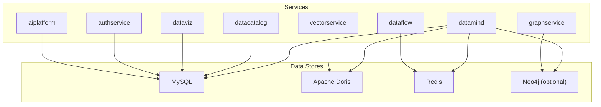
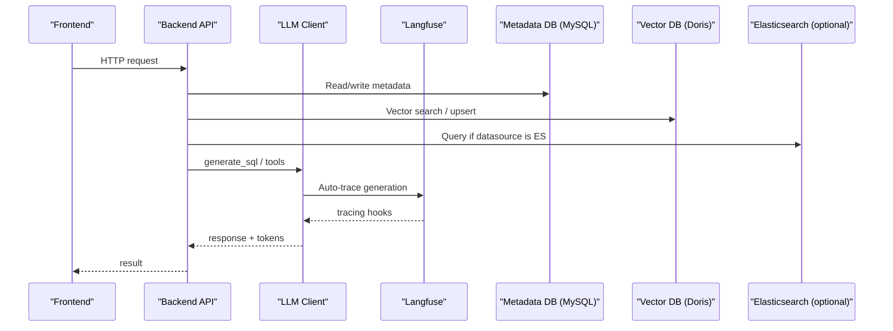
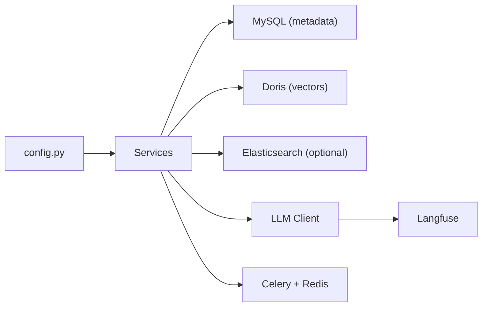

# Configuration & Deployment

<cite>
**Referenced Files in This Document**
- [docker-compose.yml](file://docker-compose.yml)
- [docker-compose.full.yml](file://docker-compose.full.yml)
- [Dockerfile](file://Dockerfile)
- [config.py](file://services/shared/common/config.py)
- [init.sql (MySQL)](file://docker/mysql/init.sql)
- [init.sql (Doris)](file://docker/doris/init.sql)
- [llm_client.py](file://services/shared/common/llm/llm_client.py)
- [langfuse_client.py](file://services/shared/common/llm/langfuse_client.py)
- [doris_store.py](file://services/shared/common/vector/doris_store.py)
- [metadata_db.py](file://services/shared/common/db/metadata_db.py)
- [datasource_db.py](file://services/shared/common/db/datasource_db.py)
- [query_executor.py](file://services/datamind/nl2sql/sql/query_executor.py)
- [celery_app.py](file://services/dataflow/tasks/celery_app.py)
- [README.md](file://README.md)
</cite>

## Table of Contents
1. Introduction
2. Project Structure
3. Core Components
4. Architecture Overview
5. Detailed Component Analysis
6. Dependency Analysis
7. Performance Considerations
8. Troubleshooting Guide
9. Conclusion
10. Appendices

## Introduction
This document provides comprehensive configuration and deployment guidance for AI-DataHub. It covers environment variables for database connections (MySQL, Apache Doris, Elasticsearch), LLM provider settings (Anthropic Claude, OpenAI-compatible APIs, local models), embedding model configuration, Langfuse observability setup, Docker-based deployment with docker-compose, database schema initialization and migrations, backup strategies, scaling considerations, load balancing, monitoring, troubleshooting, performance tuning, security hardening, and example deployment topologies (single-node, clustered, cloud-native).

## Project Structure
AI-DataHub is a microservice-oriented application with shared configuration and infrastructure components:
- Services: datamind, datacatalog, dataflow, dataviz, authservice, aiplatform, graphservice, vectorservice
- Shared libraries: common configuration, database connectors, vector stores, LLM clients, Langfuse integration
- Infrastructure: MySQL and Doris schemas, optional Neo4j, Redis for task queues and caching
- Deployment: Docker Compose files for development and full-stack deployments; containerized services

**Diagram sources**
- [docker-compose.full.yml:7-107](file://docker-compose.full.yml#L7-L107)
- [config.py:39-116](file://services/shared/common/config.py#L39-L116)
- [metadata_db.py:329-363](file://services/shared/common/db/metadata_db.py#L329-L363)

**Section sources**
- [docker-compose.full.yml:1-107](file://docker-compose.full.yml#L1-L107)
- [config.py:1-163](file://services/shared/common/config.py#L1-L163)

## Core Components
- Unified configuration layer reads environment variables and .env files to configure metadata DB, vector DB, Redis, LLM providers, embeddings, and observability.
- Database connectors support MySQL/Doris via pymysql and Elasticsearch via official client.
- Vector store abstraction supports Doris HNSW index for fast similarity search.
- LLM client integrates Anthropic Claude with optional thinking mode and streaming; Langfuse auto-tracing is enabled when configured.
- Task queue uses Celery with Redis broker/backend and multi-instance lock for Beat scheduler.

Key responsibilities:
- Environment-driven configuration centralization
- Secure credential handling via env vars and encrypted storage where applicable
- Pluggable vector backends and LLM providers
- Observability via Langfuse for LLM calls and token usage

**Section sources**
- [config.py:23-116](file://services/shared/common/config.py#L23-L116)
- [datasource_db.py:46-85](file://services/shared/common/db/datasource_db.py#L46-L85)
- [doris_store.py:32-88](file://services/shared/common/vector/doris_store.py#L32-L88)
- [llm_client.py:1-134](file://services/shared/common/llm/llm_client.py#L1-L134)
- [langfuse_client.py:1-68](file://services/shared/common/llm/langfuse_client.py#L1-L68)
- [celery_app.py:24-73](file://services/dataflow/tasks/celery_app.py#L24-L73)

## Architecture Overview
The system composes multiple services backed by relational and vector databases, with optional graph and cache layers. The frontend serves static assets and communicates with backend APIs.

**Diagram sources**
- [docker-compose.full.yml:37-83](file://docker-compose.full.yml#L37-L83)
- [config.py:39-116](file://services/shared/common/config.py#L39-L116)
- [llm_client.py:59-134](file://services/shared/common/llm/llm_client.py#L59-L134)
- [langfuse_client.py:29-68](file://services/shared/common/llm/langfuse_client.py#L29-L68)
- [doris_store.py:32-88](file://services/shared/common/vector/doris_store.py#L32-L88)
- [query_executor.py:258-366](file://services/datamind/nl2sql/sql/query_executor.py#L258-L366)

## Detailed Component Analysis

### Environment Variables and Configuration
- Metadata database (MySQL): METADATA_DB_TYPE, METADATA_DB_HOST, METADATA_DB_PORT, METADATA_DB_USER, METADATA_DB_PASSWORD, METADATA_DB_DATABASE
- Vector database (Doris or default/in-memory): VECTOR_DB_TYPE, VECTOR_DB_HOST, VECTOR_DB_PORT, VECTOR_DB_USER, VECTOR_DB_PASSWORD, VECTOR_DB_DATABASE, VECTOR_DIM, VECTOR_DISTANCE
- Redis: REDIS_URL (Celery broker/backend, distributed locks)
- LLM providers: ANTHROPIC_API_KEY, ANTHROPIC_BASE_URL, ANTHROPIC_MODEL; OpenAI-compatible via base_url and api_key stored in model config
- Embedding model: EMBEDDING_MODEL_PATH, EMBEDDING_DIM, HF_ENDPOINT, EMBEDDING_MODEL_CACHE_DIR
- Langfuse: LANGFUSE_PUBLIC_KEY, LANGFUSE_SECRET_KEY, LANGFUSE_BASE_URL
- Optional: QDRANT_* for alternative vector store; NEO4J_URI, NEO4J_USER, NEO4J_PASSWORD for graph features

Notes:
- Legacy aliases (CHATBI_*, DORIS_*) are supported but deprecated.
- Service ports and MCP ports are centrally defined.

**Section sources**
- [config.py:39-116](file://services/shared/common/config.py#L39-L116)
- [README.md:477-504](file://README.md#L477-L504)

### Database Schema Initialization and Migration
- MySQL schema includes tables for datasources, metadata, templates, business terms, dashboards, charts, conversations, users, audit logs, applications, prompts, workflows, agents, and LLM model configurations.
- Doris schema defines vector-enabled tables with HNSW indexes for efficient similarity search on table/column metadata, SQL templates, business terms, relations, and corrections.
- Initialization scripts are mounted into containers and executed on first run.

Recommendations:
- Run MySQL init script once to create the adh database and seed default admin user.
- For vector search, initialize Doris with HNSW-enabled tables matching EMBEDDING_DIM.
- Use migration scripts to evolve schema over time; version control all changes.

**Section sources**
- [init.sql (MySQL):1-614](file://docker/mysql/init.sql#L1-L614)
- [init.sql (Doris):1-182](file://docker/doris/init.sql#L1-L182)

### LLM Provider Settings and Streaming
- LLM client supports Anthropic Claude with optional extended thinking mode and streaming responses.
- Model configuration can be loaded from the database (adh_llm_models) or environment fallbacks.
- Token usage tracking is included in responses.

Operational notes:
- Ensure ANTHROPIC_API_KEY and model name are set.
- For OpenAI-compatible endpoints, configure base_url and api_key via model config API.
- Streaming yields events for real-time UI updates.

**Section sources**
- [llm_client.py:1-134](file://services/shared/common/llm/llm_client.py#L1-L134)
- [llm_client.py:137-202](file://services/shared/common/llm/llm_client.py#L137-L202)
- [llm_client.py:205-294](file://services/shared/common/llm/llm_client.py#L205-L294)

### Embedding Model Configuration
- Embedding model path and dimension are configurable via environment variables.
- Hugging Face endpoint can be customized for regions or mirrors.
- Cache directory persists across restarts via volume mount.

Best practices:
- Set EMBEDDING_DIM consistently with vector DB index dimensions.
- Use a persistent cache volume to avoid re-downloading models.

**Section sources**
- [config.py:95-98](file://services/shared/common/config.py#L95-L98)
- [docker-compose.full.yml:67-72](file://docker-compose.full.yml#L67-L72)

### Langfuse Observability Setup
- Langfuse is automatically initialized before any LLM client creation to enable monkey-patching of the Anthropic SDK.
- When keys are provided, all LLM calls (including streaming and thinking blocks) are traced without manual instrumentation.
- Flush method available to ensure events are sent at shutdown.

Configuration:
- Provide LANGFUSE_PUBLIC_KEY, LANGFUSE_SECRET_KEY, and optionally LANGFUSE_BASE_URL.

**Section sources**
- [langfuse_client.py:1-68](file://services/shared/common/llm/langfuse_client.py#L1-L68)
- [llm_client.py:1-10](file://services/shared/common/llm/llm_client.py#L1-L10)

### Vector Store and Search
- DorisVectorStore implements HNSW-based similarity search using l2_distance_approximate.
- Supports filters, output columns, and batch upserts with DELETE+INSERT pattern due to Doris DUPLICATE KEY semantics.
- Connection pool selection depends on VECTOR_DB_TYPE and configuration.

Performance tips:
- Tune HNSW parameters (max_degree, ef_construction) in Doris schema according to dataset size and latency requirements.
- Keep EMBEDDING_DIM aligned with index definitions.

**Section sources**
- [doris_store.py:32-88](file://services/shared/common/vector/doris_store.py#L32-L88)
- [doris_store.py:90-179](file://services/shared/common/vector/doris_store.py#L90-L179)
- [metadata_db.py:329-363](file://services/shared/common/db/metadata_db.py#L329-L363)

### Elasticsearch Integration
- Data source connections support Elasticsearch via official client with optional SSL and basic authentication.
- Query executor preprocesses SQL for ES compatibility and executes via ES SQL API.

Usage:
- Configure datasource with host, port, ssl, user, password.
- Ensure elasticsearch package is installed.

**Section sources**
- [datasource_db.py:46-85](file://services/shared/common/db/datasource_db.py#L46-L85)
- [query_executor.py:258-366](file://services/datamind/nl2sql/sql/query_executor.py#L258-L366)

### Task Queue and Scheduling
- Celery app configured with Redis broker/backend, queues for scheduled tasks, timeouts, retries, and result expiry.
- Multi-instance lock prevents duplicate schedulers across multiple Beat instances.

Scaling:
- Run multiple workers to handle concurrent tasks.
- Monitor queue depth and adjust concurrency based on resource availability.

**Section sources**
- [celery_app.py:24-73](file://services/dataflow/tasks/celery_app.py#L24-L73)
- [celery_app.py:76-108](file://services/dataflow/tasks/celery_app.py#L76-L108)

## Dependency Analysis
Core dependencies and relationships:
- Services depend on shared configuration for DB and LLM settings.
- Vector operations rely on Doris connection pool and HNSW indexes.
- LLM calls are intercepted by Langfuse when enabled.
- Task scheduling relies on Redis for coordination and persistence.

**Diagram sources**
- [config.py:39-116](file://services/shared/common/config.py#L39-L116)
- [metadata_db.py:329-363](file://services/shared/common/db/metadata_db.py#L329-L363)
- [llm_client.py:59-134](file://services/shared/common/llm/llm_client.py#L59-L134)
- [langfuse_client.py:29-68](file://services/shared/common/llm/langfuse_client.py#L29-L68)
- [celery_app.py:24-73](file://services/dataflow/tasks/celery_app.py#L24-L73)

**Section sources**
- [config.py:39-116](file://services/shared/common/config.py#L39-L116)
- [metadata_db.py:329-363](file://services/shared/common/db/metadata_db.py#L329-L363)
- [llm_client.py:59-134](file://services/shared/common/llm/llm_client.py#L59-L134)
- [langfuse_client.py:29-68](file://services/shared/common/llm/langfuse_client.py#L29-L68)
- [celery_app.py:24-73](file://services/dataflow/tasks/celery_app.py#L24-L73)

## Performance Considerations
- Vector search:
  - Align EMBEDDING_DIM with Doris HNSW index dimensions.
  - Tune max_degree and ef_construction for recall vs. latency trade-offs.
- Database connections:
  - Use connection pooling and appropriate timeouts for MySQL/Doris.
  - For Elasticsearch, set request_timeout and consider SSL for secure clusters.
- LLM calls:
  - Use streaming for responsive UIs; limit max_tokens to reduce latency and cost.
  - Enable thinking mode only when beneficial; fall back gracefully if unsupported.
- Task queue:
  - Scale workers horizontally; monitor queue depth and adjust concurrency.
  - Use Redis for distributed locking to prevent duplicate scheduling.

[No sources needed since this section provides general guidance]

## Troubleshooting Guide
Common issues and resolutions:
- LLM call failures:
  - Check API key and base URL; verify model availability and limits.
  - Review error messages and token usage; adjust max_tokens and context window.
- Vector search errors:
  - Ensure Doris HNSW indexes exist and match EMBEDDING_DIM.
  - Validate filter expressions and column names; check connection credentials.
- Elasticsearch connectivity:
  - Confirm protocol (http/https), SSL settings, and authentication.
  - Verify elasticsearch package installation and network access.
- Redis/Celery issues:
  - Ensure REDIS_URL is correct and reachable; check worker logs for connection errors.
  - If Beat lock fails, confirm Redis availability; scheduler will still run without lock.

**Section sources**
- [llm_client.py:132-134](file://services/shared/common/llm/llm_client.py#L132-L134)
- [doris_store.py:86-88](file://services/shared/common/vector/doris_store.py#L86-L88)
- [datasource_db.py:52-62](file://services/shared/common/db/datasource_db.py#L52-L62)
- [query_executor.py:258-275](file://services/datamind/nl2sql/sql/query_executor.py#L258-L275)
- [celery_app.py:82-108](file://services/dataflow/tasks/celery_app.py#L82-L108)

## Conclusion
AI-DataHub provides a flexible, environment-driven configuration model supporting multiple databases, LLM providers, and observability integrations. Docker Compose simplifies local and production deployments, while scalable components like Celery workers and vector stores enable horizontal growth. Properly configuring environment variables, initializing schemas, and tuning performance parameters ensures reliable operation across single-node, clustered, and cloud-native topologies.

[No sources needed since this section summarizes without analyzing specific files]

## Appendices

### Docker-Based Deployment
- Development:
  - Use docker-compose.yml to run backend and frontend with health checks and shared network.
  - Mount .env for easy configuration changes; persist embedding model cache.
- Full stack:
  - Use docker-compose.full.yml to include MySQL with init scripts and environment variables for metadata and vector DBs.
  - Expose configurable ports for backend and frontend; set service dependencies and health checks.

**Section sources**
- [docker-compose.yml:1-48](file://docker-compose.yml#L1-L48)
- [docker-compose.full.yml:1-107](file://docker-compose.full.yml#L1-L107)
- [Dockerfile:1-25](file://Dockerfile#L1-L25)

### Backup Strategies
- MySQL:
  - Regular logical backups using mysqldump or native tools; schedule incremental backups for large datasets.
  - Back up volumes containing MySQL data and embedding caches.
- Doris:
  - Snapshot-based backups for OLAP tables; ensure HNSW indexes are consistent post-recovery.
- Redis:
  - Enable AOF/RDB persistence; back up dump files and configuration.
- Elasticsearch:
  - Use snapshot repositories for cluster-wide backups; manage indices lifecycle.

[No sources needed since this section provides general guidance]

### Scaling Considerations
- Horizontal scaling:
  - Run multiple service replicas behind a load balancer; stateless design enables easy scaling.
  - Scale Celery workers proportionally to task load; monitor queue metrics.
- Vertical scaling:
  - Increase CPU/memory for LLM-heavy workloads; allocate sufficient RAM for embedding model cache.
  - Tune database connection pools and query timeouts based on workload patterns.
- Load balancing:
  - Place NGINX or cloud load balancer in front of services; route traffic based on paths or headers.
  - Configure health checks and session affinity if required.

[No sources needed since this section provides general guidance]

### Monitoring Setup
- Langfuse:
  - Configure keys and host to capture LLM traces, token usage, and streaming events.
- Celery/Fruit:
  - Use Flower or similar tools to monitor task queues, workers, and job durations.
- Database metrics:
  - Monitor MySQL/Doris/Elasticsearch performance counters; track slow queries and index efficiency.

**Section sources**
- [langfuse_client.py:29-68](file://services/shared/common/llm/langfuse_client.py#L29-L68)
- [celery_app.py:24-73](file://services/dataflow/tasks/celery_app.py#L24-L73)

### Security Hardening Recommendations
- Secrets management:
  - Store sensitive values in environment variables or secret managers; avoid committing secrets to code.
- Network security:
  - Restrict database ports to internal networks; use TLS for external connections.
- Access control:
  - Enforce least privilege for database users; rotate credentials regularly.
- Input validation:
  - Validate and sanitize inputs; enforce query restrictions (e.g., SELECT-only policies) for safety.

[No sources needed since this section provides general guidance]

### Example Deployment Topologies
- Single-node:
  - Run MySQL, Doris, Redis, and all services in one machine; suitable for development and small teams.
- Clustered:
  - Separate nodes for databases and services; scale workers and replicas independently.
- Cloud-native:
  - Use managed services (RDS, Doris-as-a-service, Redis, Elasticsearch); deploy services as containers or serverless functions; integrate with cloud load balancers and observability platforms.

[No sources needed since this section provides conceptual guidance]