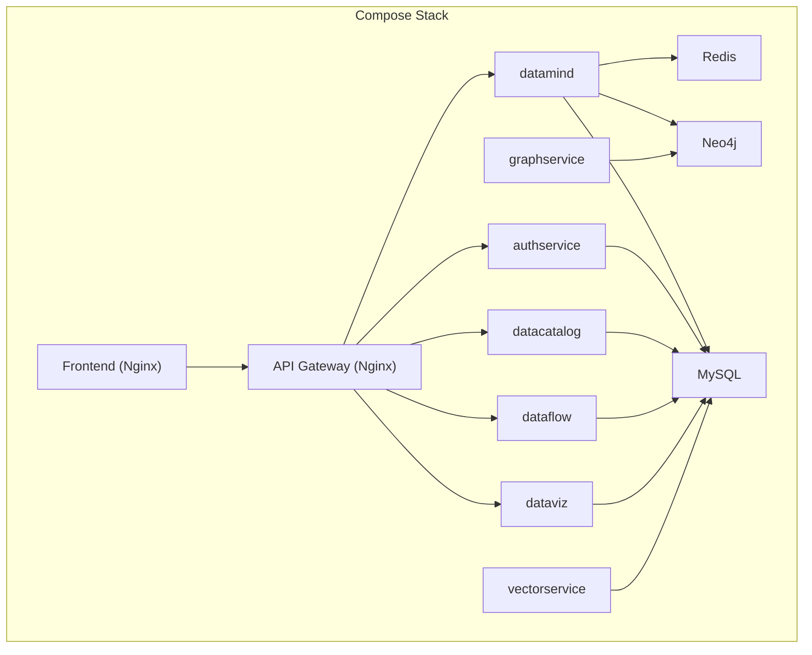
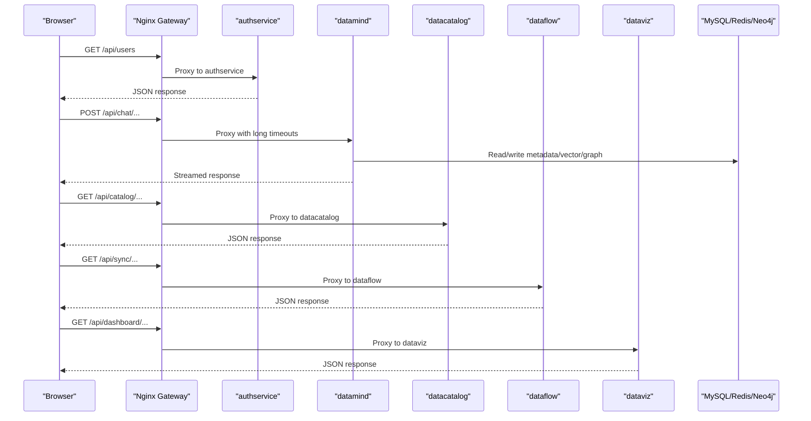
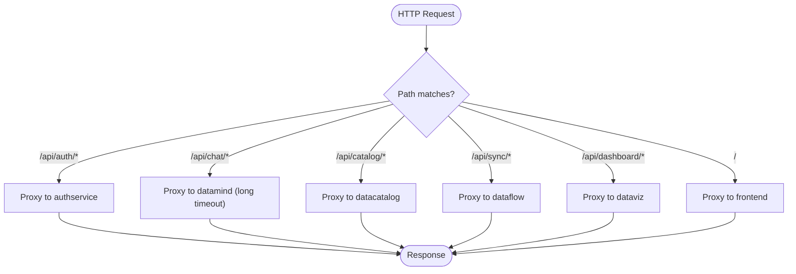
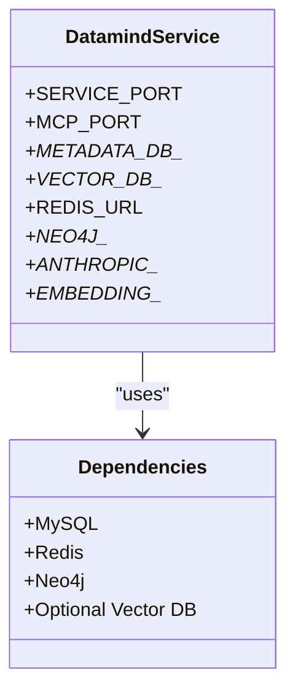
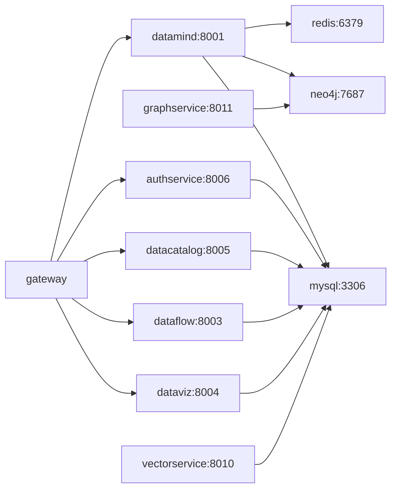

# Docker Deployment

<cite>
**Referenced Files in This Document**
- [docker-compose.yml](file://docker-compose.yml)
- [docker-compose.full.yml](file://docker-compose.full.yml)
- [services/docker-compose.yml](file://services/docker-compose.yml)
- [Dockerfile](file://Dockerfile)
- [services/datamind/Dockerfile](file://services/datamind/Dockerfile)
- [services/authservice/Dockerfile](file://services/authservice/Dockerfile)
- [services/datacatalog/Dockerfile](file://services/datacatalog/Dockerfile)
- [services/dataflow/Dockerfile](file://services/dataflow/Dockerfile)
- [services/dataviz/Dockerfile](file://services/dataviz/Dockerfile)
- [services/shared/vectorservice/Dockerfile](file://services/shared/vectorservice/Dockerfile)
- [services/shared/graphservice/Dockerfile](file://services/shared/graphservice/Dockerfile)
- [frontend/Dockerfile](file://frontend/Dockerfile)
- [services/gateway/nginx.conf](file://services/gateway/nginx.conf)
</cite>

## Table of Contents
1. [Introduction](#introduction)
2. [Project Structure](#project-structure)
3. [Core Components](#core-components)
4. [Architecture Overview](#architecture-overview)
5. [Detailed Component Analysis](#detailed-component-analysis)
6. [Dependency Analysis](#dependency-analysis)
7. [Performance Considerations](#performance-considerations)
8. [Troubleshooting Guide](#troubleshooting-guide)
9. [Conclusion](#conclusion)
10. [Appendices](#appendices)

## Introduction
This document provides comprehensive Docker deployment guidance for AI-DataHub, covering container orchestration with docker-compose for development and production, multi-service architecture (datamind, authservice, datacatalog, dataflow, dataviz, and shared services), networking, volumes, inter-service communication, health checks, logging, resource limits, scaling strategies, and troubleshooting. It also includes steps for local development, full-stack deployment, and cloud-native deployments on Kubernetes or Docker Swarm.

## Project Structure
AI-DataHub uses a modular microservice architecture orchestrated by Docker Compose:
- A single-node “full stack” compose file for quick local runs with MySQL
- A multi-service compose file under services/ that launches all microservices plus Redis and Neo4j
- An Nginx-based API gateway that routes HTTP requests to the appropriate service
- Frontend built with Node and served via Nginx
- Shared Python libraries and utilities packaged into each service image

**Diagram sources**
- [services/docker-compose.yml:42-230](file://services/docker-compose.yml#L42-L230)
- [services/gateway/nginx.conf:11-31](file://services/gateway/nginx.conf#L11-L31)
- [docker-compose.full.yml:8-106](file://docker-compose.full.yml#L8-L106)

**Section sources**
- [docker-compose.yml:1-48](file://docker-compose.yml#L1-L48)
- [docker-compose.full.yml:1-107](file://docker-compose.full.yml#L1-L107)
- [services/docker-compose.yml:1-235](file://services/docker-compose.yml#L1-L235)

## Core Components
- API Gateway (Nginx): Routes /api/* paths to backend microservices and serves the frontend at /.
- Microservices:
  - datamind: AI engine (chat, agents, pipelines, knowledge).
  - authservice: Authentication, users, roles, workspaces, audit.
  - datacatalog: Catalog, metadata, metrics, tags, glossary.
  - dataflow: Sync, workflow, scheduled tasks, notifications.
  - dataviz: Dashboards, charts, reports.
  - vectorservice: Vector search and retrieval.
  - graphservice: Knowledge graph operations backed by Neo4j.
- Infrastructure:
  - MySQL: Metadata and vector storage (in full-stack mode).
  - Redis: Caching and session store.
  - Neo4j: Graph database for knowledge graph.
- Frontend: Static assets built from Node and served by Nginx.

Key configuration highlights:
- Common environment variables are defined as a YAML anchor and reused across services.
- Each service exposes its own port and an optional MCP port.
- Health checks are configured for critical services (backend, MySQL).

**Section sources**
- [services/docker-compose.yml:11-36](file://services/docker-compose.yml#L11-L36)
- [services/docker-compose.yml:42-230](file://services/docker-compose.yml#L42-L230)
- [docker-compose.full.yml:46-83](file://docker-compose.full.yml#L46-L83)

## Architecture Overview
The system follows a layered architecture:
- Client browsers access the Nginx gateway on port 80.
- The gateway proxies API calls to the appropriate microservice based on URL path.
- Services communicate with shared infrastructure (MySQL, Redis, Neo4j) using internal Docker network names.
- Optional external vector DB (e.g., Doris) can be used via environment variables.

**Diagram sources**
- [services/gateway/nginx.conf:62-216](file://services/gateway/nginx.conf#L62-L216)
- [services/docker-compose.yml:42-230](file://services/docker-compose.yml#L42-L230)

## Detailed Component Analysis

### API Gateway (Nginx)
- Purpose: Central entry point for all HTTP traffic; routes /api/* to microservices and serves the frontend.
- Key behaviors:
  - Upstreams define service endpoints.
  - Long read/send timeouts for LLM streaming endpoints.
  - Access and error logs enabled for observability.
  - Health endpoint at /nginx-health.

**Diagram sources**
- [services/gateway/nginx.conf:11-31](file://services/gateway/nginx.conf#L11-L31)
- [services/gateway/nginx.conf:52-216](file://services/gateway/nginx.conf#L52-L216)

**Section sources**
- [services/gateway/nginx.conf:1-219](file://services/gateway/nginx.conf#L1-L219)

### datamind Service
- Role: AI engine providing chat, agent orchestration, pipeline execution, and knowledge management.
- Image: Built from Python slim with shared requirements and service-specific dependencies.
- Ports: Exposes 8001 and optionally an MCP port.
- Environment: Uses common env for DBs, Redis, Neo4j, LLM keys, embedding model settings.

**Diagram sources**
- [services/docker-compose.yml:129-143](file://services/docker-compose.yml#L129-L143)
- [services/datamind/Dockerfile:1-24](file://services/datamind/Dockerfile#L1-L24)

**Section sources**
- [services/datamind/Dockerfile:1-24](file://services/datamind/Dockerfile#L1-L24)
- [services/docker-compose.yml:129-143](file://services/docker-compose.yml#L129-L143)

### authservice
- Role: Handles authentication, authorization, user and role management, workspace scoping, and audit logging.
- Image: Python slim with shared and service-specific requirements.
- Ports: Exposes 8006 and optionally an MCP port.

**Section sources**
- [services/authservice/Dockerfile:1-24](file://services/authservice/Dockerfile#L1-L24)
- [services/docker-compose.yml:61-73](file://services/docker-compose.yml#L61-L73)

### datacatalog
- Role: Manages catalog entries, metadata, metrics, tags, glossaries, and templates.
- Image: Python slim with shared and service-specific requirements.
- Ports: Exposes 8005 and optionally an MCP port.

**Section sources**
- [services/datacatalog/Dockerfile:1-24](file://services/datacatalog/Dockerfile#L1-L24)
- [services/docker-compose.yml:78-90](file://services/docker-compose.yml#L78-L90)

### dataflow
- Role: Orchestrates data sync, workflows, scheduled tasks, and notifications. Integrates with Airflow via API.
- Image: Python slim with shared and service-specific requirements.
- Ports: Exposes 8003 and optionally an MCP port.

**Section sources**
- [services/dataflow/Dockerfile:1-24](file://services/dataflow/Dockerfile#L1-L24)
- [services/docker-compose.yml:148-163](file://services/docker-compose.yml#L148-L163)

### dataviz
- Role: Provides dashboards, charts, and report generation capabilities.
- Image: Python slim with shared and service-specific requirements.
- Ports: Exposes 8004 and optionally an MCP port.

**Section sources**
- [services/dataviz/Dockerfile:1-24](file://services/dataviz/Dockerfile#L1-L24)
- [services/docker-compose.yml:112-124](file://services/docker-compose.yml#L112-L124)

### Shared Services
- vectorservice: Vector search and retrieval, configurable to use MySQL or external vector DB.
- graphservice: Graph operations backed by Neo4j.

**Section sources**
- [services/shared/vectorservice/Dockerfile:1-22](file://services/shared/vectorservice/Dockerfile#L1-L22)
- [services/shared/graphservice/Dockerfile:1-22](file://services/shared/graphservice/Dockerfile#L1-L22)
- [services/docker-compose.yml:168-194](file://services/docker-compose.yml#L168-L194)

### Frontend
- Build stage: Node image installs dependencies and builds static assets.
- Runtime stage: Nginx serves built assets on port 80.
- In the full-stack compose, it depends on backend health.

**Section sources**
- [frontend/Dockerfile:1-25](file://frontend/Dockerfile#L1-L25)
- [docker-compose.yml:28-40](file://docker-compose.yml#L28-L40)
- [docker-compose.full.yml:86-98](file://docker-compose.full.yml#L86-L98)

## Dependency Analysis
- Networking: All services share a custom bridge network named chatbi. Services discover each other via service names (e.g., mysql, redis, neo4j, datamind).
- Volumes:
  - MySQL data persisted to a named volume.
  - Embedding model cache persisted to a named volume.
  - Redis and Neo4j data persisted to named volumes in the multi-service compose.
- Inter-service communication:
  - HTTP/REST via Nginx gateway routing.
  - Direct service-to-service calls using Docker DNS names and ports.
  - External vector DB connection via environment variables when not using MySQL for vectors.

**Diagram sources**
- [services/docker-compose.yml:42-230](file://services/docker-compose.yml#L42-L230)
- [services/gateway/nginx.conf:11-31](file://services/gateway/nginx.conf#L11-L31)

**Section sources**
- [services/docker-compose.yml:11-36](file://services/docker-compose.yml#L11-L36)
- [services/docker-compose.yml:211-230](file://services/docker-compose.yml#L211-L230)
- [docker-compose.full.yml:20-35](file://docker-compose.full.yml#L20-L35)

## Performance Considerations
- Timeouts and buffering:
  - Gateway sets longer proxy timeouts for LLM streaming endpoints to avoid premature disconnects.
  - Buffering is disabled for streaming to reduce latency.
- Resource limits:
  - Add CPU/memory limits per service in compose files for production to prevent noisy neighbor issues.
- Caching:
  - Use Redis for caching where applicable.
  - Persist embedding models to a volume to avoid re-downloading on restarts.
- Database tuning:
  - MySQL max connections and character set configured in full-stack compose.
- Scaling:
  - Horizontal scaling for stateless services (datamind, datacatalog, dataflow, dataviz, authservice) behind the gateway.
  - Ensure sticky sessions if needed for WebSocket/SSE flows.

[No sources needed since this section provides general guidance]

## Troubleshooting Guide
Common issues and resolutions:
- Network connectivity failures:
  - Verify all services are on the same Docker network (chatbi).
  - Confirm upstream hostnames match service names in gateway config.
  - Check firewall rules and port bindings on the host.
- Volume permissions:
  - Ensure write permissions for MySQL data directory and Redis/Neo4j volumes.
  - If using bind mounts, adjust host permissions accordingly.
- Service startup failures:
  - Inspect logs with docker logs <container>.
  - Validate environment variables (DB credentials, API keys, endpoints).
  - For MySQL, ensure init scripts run successfully and migrations complete.
- Health checks:
  - Backend health endpoint is used to gate frontend startup in simple stacks.
  - MySQL health check ensures readiness before dependent services start.
- Gateway errors:
  - Check Nginx access/error logs for upstream failures.
  - Validate location blocks map correctly to service routes.

**Section sources**
- [docker-compose.full.yml:30-35](file://docker-compose.full.yml#L30-L35)
- [docker-compose.full.yml:78-83](file://docker-compose.full.yml#L78-L83)
- [services/gateway/nginx.conf:33-40](file://services/gateway/nginx.conf#L33-L40)

## Conclusion
AI-DataHub’s Docker deployment offers a flexible, scalable microservices architecture with clear separation of concerns, robust networking, and persistent storage. Use the simple full-stack compose for rapid local development and the multi-service compose for advanced scenarios requiring Redis and Neo4j. The Nginx gateway centralizes routing and enables easy scaling and monitoring. Apply resource limits, health checks, and proper logging to operate reliably in production.

[No sources needed since this section summarizes without analyzing specific files]

## Appendices

### Deployment Scenarios

- Local development with docker-compose up
  - Use the root-level compose file to run backend and frontend locally.
  - The frontend waits for the backend health check before starting.
  - Embedding model cache is persisted across restarts.

  **Section sources**
  - [docker-compose.yml:1-48](file://docker-compose.yml#L1-L48)

- Production deployment with docker-compose full stack
  - Use the full-stack compose to launch MySQL, backend, and frontend together.
  - MySQL is initialized with schema and migrations.
  - Backend depends on MySQL health before starting.

  **Section sources**
  - [docker-compose.full.yml:1-107](file://docker-compose.full.yml#L1-L107)

- Multi-service stack (recommended for advanced usage)
  - Launch all microservices, Redis, and Neo4j via services/docker-compose.yml.
  - Configure environment variables for external vector DB if needed.
  - Use the Nginx gateway to route traffic to services.

  **Section sources**
  - [services/docker-compose.yml:1-235](file://services/docker-compose.yml#L1-L235)

- Cloud-native deployments (Kubernetes or Docker Swarm)
  - Convert compose definitions to Kubernetes manifests or Swarm services.
  - Map named volumes to persistent volumes (PV/PVC) in Kubernetes.
  - Expose the gateway via an Ingress controller or LoadBalancer.
  - Set resource requests/limits per service.
  - Use ConfigMaps/Secrets for sensitive configuration.

  [No sources needed since this section provides general guidance]

### Container Health Checks
- Backend health check probes the application health endpoint.
- MySQL health check pings the database server.
- Add similar health checks for other services as needed.

**Section sources**
- [docker-compose.yml:21-26](file://docker-compose.yml#L21-L26)
- [docker-compose.full.yml:30-35](file://docker-compose.full.yml#L30-L35)
- [docker-compose.full.yml:78-83](file://docker-compose.full.yml#L78-L83)

### Logging Configuration
- Nginx gateway logs access and error logs for request tracing and debugging.
- Application logs can be collected via Docker logging drivers or centralized logging solutions.

**Section sources**
- [services/gateway/nginx.conf:33-40](file://services/gateway/nginx.conf#L33-L40)

### Volume Management
- Named volumes for persistence:
  - MySQL data
  - Embedding model cache
  - Redis data
  - Neo4j data

**Section sources**
- [docker-compose.full.yml:20-22](file://docker-compose.full.yml#L20-L22)
- [docker-compose.full.yml:100-102](file://docker-compose.full.yml#L100-L102)
- [services/docker-compose.yml:216-230](file://services/docker-compose.yml#L216-L230)

### Inter-Service Communication Patterns
- HTTP/REST via Nginx gateway with path-based routing.
- Direct service-to-service calls using Docker DNS names and ports.
- Streaming support for SSE-enabled endpoints with adjusted timeouts.

**Section sources**
- [services/gateway/nginx.conf:42-49](file://services/gateway/nginx.conf#L42-L49)
- [services/gateway/nginx.conf:90-116](file://services/gateway/nginx.conf#L90-L116)

### Scaling Strategies
- Scale stateless services horizontally behind the gateway.
- Use connection pooling for databases.
- Monitor performance and adjust timeouts and resources accordingly.

[No sources needed since this section provides general guidance]