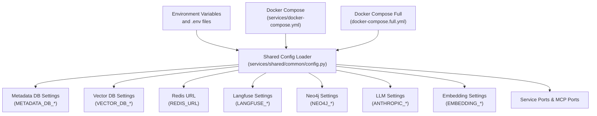
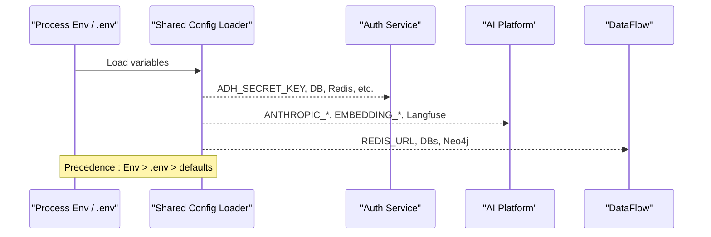
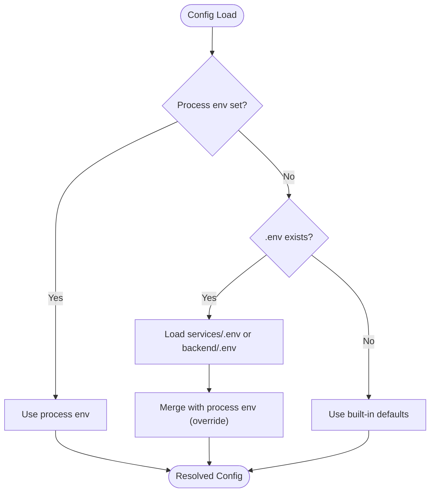
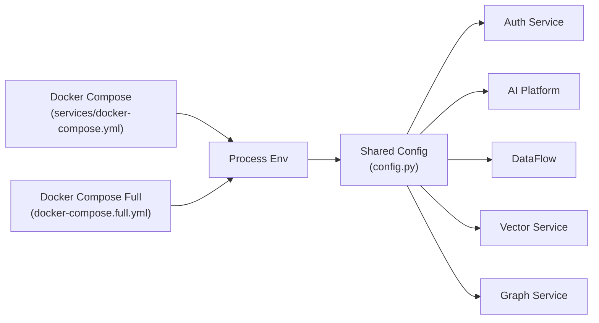

# Environment Configuration

<cite>
**Referenced Files in This Document**
- [config.py](file://services/shared/common/config.py)
- [docker-compose.yml](file://services/docker-compose.yml)
- [docker-compose.full.yml](file://docker-compose.full.yml)
- [README.md](file://README.md)
- [auth_service.py](file://services/authservice/services/auth_service.py)
- [model_config_service.py](file://services/aiplatform/services/model_config_service.py)
</cite>

## Table of Contents
1. Introduction
2. Project Structure
3. Core Components
4. Architecture Overview
5. Detailed Component Analysis
6. Dependency Analysis
7. Performance Considerations
8. Troubleshooting Guide
9. Conclusion

## Introduction
This document explains how AI-DataHub loads and applies environment configuration across all microservices. It covers database connections (metadata and vector stores), LLM provider settings, embedding model configuration, Redis setup, Langfuse observability, Neo4j graph database, service ports, configuration hierarchy and precedence, backward compatibility with legacy aliases, example .env setups for different environments, security best practices, and troubleshooting guidance.

## Project Structure
AI-DataHub centralizes configuration in a shared module that reads from the process environment and optional .env files. Docker Compose files define defaults and inject environment variables into services. The unified configuration is then consumed by services such as authentication, AI platform, and dataflow components.

**Diagram sources**
- [config.py:20-33](file://services/shared/common/config.py#L20-L33)
- [config.py:35-163](file://services/shared/common/config.py#L35-L163)
- [docker-compose.yml:11-36](file://services/docker-compose.yml#L11-L36)
- [docker-compose.full.yml:46-70](file://docker-compose.full.yml#L46-L70)

**Section sources**
- [config.py:20-33](file://services/shared/common/config.py#L20-L33)
- [docker-compose.yml:11-36](file://services/docker-compose.yml#L11-L36)
- [docker-compose.full.yml:46-70](file://docker-compose.full.yml#L46-L70)

## Core Components
- Metadata database (MySQL): METADATA_DB_TYPE, METADATA_DB_HOST, METADATA_DB_PORT, METADATA_DB_USER, METADATA_DB_PASSWORD, METADATA_DB_DATABASE
- Vector database (Doris or MySQL fallback): VECTOR_DB_TYPE, VECTOR_DB_HOST, VECTOR_DB_PORT, VECTOR_DB_USER, VECTOR_DB_PASSWORD, VECTOR_DB_DATABASE
- Redis: REDIS_URL (used as broker and result backend)
- Langfuse observability: LANGFUSE_PUBLIC_KEY, LANGFUSE_SECRET_KEY, LANGFUSE_BASE_URL
- Neo4j graph database: NEO4J_URI, NEO4J_USER, NEO4J_PASSWORD
- LLM provider (Anthropic): ANTHROPIC_API_KEY, ANTHROPIC_BASE_URL, ANTHROPIC_MODEL
- Embedding model: EMBEDDING_MODEL_PATH, EMBEDDING_DIM, EMBEDDING_HF_ENDPOINT, EMBEDDING_MODEL_CACHE_DIR
- Application keys: ADH_SECRET_KEY, ADH_DEFAULT_ADMIN_PASSWORD
- Service and MCP ports: SERVICE_PORTS, MCP_PORTS

Configuration loading order:
1. Process environment variables (highest precedence)
2. Optional .env file loaded by the shared config loader (services/.env preferred; falls back to backend/.env if present)
3. Built-in defaults defined in the shared config module

Backward compatibility:
- Legacy DORIS_* variables are still read and mapped to VECTOR_DB_* where applicable
- Legacy CHATBI_* variables are supported as fallbacks for ADH_* keys

**Section sources**
- [config.py:35-163](file://services/shared/common/config.py#L35-L163)
- [docker-compose.yml:11-36](file://services/docker-compose.yml#L11-L36)
- [docker-compose.full.yml:46-70](file://docker-compose.full.yml#L46-L70)

## Architecture Overview
The shared configuration module is the single source of truth for runtime settings. Services import these values directly. Docker Compose defines environment variables per service, ensuring consistent configuration across the stack.

**Diagram sources**
- [config.py:20-33](file://services/shared/common/config.py#L20-L33)
- [config.py:35-163](file://services/shared/common/config.py#L35-L163)
- [docker-compose.yml:11-36](file://services/docker-compose.yml#L11-L36)

## Detailed Component Analysis

### Database Connections
- Metadata DB (MySQL)
  - Keys: METADATA_DB_TYPE, METADATA_DB_HOST, METADATA_DB_PORT, METADATA_DB_USER, METADATA_DB_PASSWORD, METADATA_DB_DATABASE
  - Defaults: type mysql, host localhost, port 3306, user root, password empty, database adh
  - Backward compatibility: If DORIS_* variables exist, they can be used as fallbacks for metadata connection fields
- Vector DB (Doris or MySQL)
  - Keys: VECTOR_DB_TYPE, VECTOR_DB_HOST, VECTOR_DB_PORT, VECTOR_DB_USER, VECTOR_DB_PASSWORD, VECTOR_DB_DATABASE
  - Defaults: type default, host localhost, port 9030, user root, password empty, database adh
  - Vector search parameters: VECTOR_DIM (fallback from EMBEDDING_DIM), VECTOR_DISTANCE
  - Backward compatibility: DORIS_* variables map to VECTOR_DB_* when new variables are not set

Example usage in compose:
- Full stack uses MySQL for both metadata and vectors
- Microservices compose sets VECTOR_DB_TYPE=doris with Doris host/port/user/password

**Section sources**
- [config.py:35-59](file://services/shared/common/config.py#L35-L59)
- [docker-compose.full.yml:46-60](file://docker-compose.full.yml#L46-L60)
- [docker-compose.yml:11-23](file://services/docker-compose.yml#L11-L23)

### LLM Provider Settings (Anthropic)
- Keys: ANTHROPIC_API_KEY, ANTHROPIC_BASE_URL, ANTHROPIC_MODEL
- Defaults: base_url https://api.anthropic.com, model claude-sonnet-4-20250514
- Used by AI platform and agent orchestrators; also exposed as fallback system config when no database-stored model exists

**Section sources**
- [config.py:83-89](file://services/shared/common/config.py#L83-L89)
- [model_config_service.py:85-98](file://services/aiplatform/services/model_config_service.py#L85-L98)

### Embedding Model Configuration
- Keys: EMBEDDING_MODEL_PATH, EMBEDDING_DIM, EMBEDDING_HF_ENDPOINT, EMBEDDING_MODEL_CACHE_DIR
- Defaults: model path shibing624/text2vec-base-chinese, dim 768, HF endpoint mirror
- VECTOR_DIM can fall back to EMBEDDING_DIM for vector search dimensionality

**Section sources**
- [config.py:91-98](file://services/shared/common/config.py#L91-L98)
- [config.py:57-59](file://services/shared/common/config.py#L57-L59)

### Redis Setup
- Key: REDIS_URL
- Default: redis://localhost:6379/0
- Used as Celery broker and result backend, plus distributed locks

**Section sources**
- [config.py:61-65](file://services/shared/common/config.py#L61-L65)
- [docker-compose.yml:24](file://services/docker-compose.yml#L24)

### Langfuse Observability
- Keys: LANGFUSE_PUBLIC_KEY, LANGFUSE_SECRET_KEY, LANGFUSE_BASE_URL
- Behavior: When both public and secret keys are set, Langfuse is enabled; base URL defaults to cloud unless overridden

**Section sources**
- [config.py:67-74](file://services/shared/common/config.py#L67-L74)
- [docker-compose.yml:34-36](file://services/docker-compose.yml#L34-L36)

### Neo4j Graph Database
- Keys: NEO4J_URI, NEO4J_USER, NEO4J_PASSWORD
- Defaults: URI bolt://localhost:7687, user neo4j, password empty
- Used by graph-related services for knowledge graph operations

**Section sources**
- [config.py:110-116](file://services/shared/common/config.py#L110-L116)
- [docker-compose.yml:26-28](file://services/docker-compose.yml#L26-L28)

### Service Port Configurations
- SERVICE_PORTS: datamind 8001, datagov 8002, dataflow 8003, dataviz 8004, datacatalog 8005, authservice 8006, vectorservice 8010, graphservice 8011
- MCP_PORTS: datamind 31001, datagov 31002, dataflow 31003, dataviz 31004, datacatalog 31005, authservice 31006
- Docker Compose exposes these ports per service

**Section sources**
- [config.py:118-140](file://services/shared/common/config.py#L118-L140)
- [docker-compose.yml:61-194](file://services/docker-compose.yml#L61-L194)

### Configuration Hierarchy and Precedence
- Highest: Process environment variables (injected by Docker Compose or OS)
- Middle: .env file loaded by shared config loader (services/.env preferred; falls back to backend/.env)
- Lowest: Module-level defaults in shared config

Backward compatibility:
- DORIS_* variables are read and mapped to VECTOR_DB_* fields
- CHATBI_* variables are read as fallbacks for ADH_* keys

**Diagram sources**
- [config.py:20-33](file://services/shared/common/config.py#L20-L33)
- [config.py:35-163](file://services/shared/common/config.py#L35-L163)

**Section sources**
- [config.py:20-33](file://services/shared/common/config.py#L20-L33)
- [config.py:35-163](file://services/shared/common/config.py#L35-L163)

### Example .env Setups
Development (local MySQL + local Redis + local Neo4j):
- METADATA_DB_TYPE=mysql
- METADATA_DB_HOST=127.0.0.1
- METADATA_DB_PORT=3306
- METADATA_DB_USER=root
- METADATA_DB_PASSWORD=adh_test_2024
- METADATA_DB_DATABASE=adh
- VECTOR_DB_TYPE=mysql
- VECTOR_DB_HOST=127.0.0.1
- VECTOR_DB_PORT=3306
- VECTOR_DB_USER=root
- VECTOR_DB_PASSWORD=adh_test_2024
- VECTOR_DB_DATABASE=adh
- REDIS_URL=redis://127.0.0.1:6379/0
- NEO4J_URI=bolt://127.0.0.1:7687
- NEO4J_USER=neo4j
- NEO4J_PASSWORD=ai-datahub-2024
- ANTHROPIC_API_KEY=your-key
- ANTHROPIC_BASE_URL=https://api.anthropic.com
- ANTHROPIC_MODEL=claude-sonnet-4-20250514
- EMBEDDING_MODEL_PATH=shibing624/text2vec-base-chinese
- EMBEDDING_DIM=768
- LANGFUSE_PUBLIC_KEY=
- LANGFUSE_SECRET_KEY=
- LANGFUSE_BASE_URL=http://localhost:13000
- ADH_SECRET_KEY=change-me-in-production

Staging (Doris vector store + managed Redis + managed Neo4j):
- VECTOR_DB_TYPE=doris
- VECTOR_DB_HOST=<staging-doris-host>
- VECTOR_DB_PORT=9030
- VECTOR_DB_USER=<user>
- VECTOR_DB_PASSWORD=<password>
- VECTOR_DB_DATABASE=adh
- REDIS_URL=redis://<staging-redis>:6379/0
- NEO4J_URI=bolt://<staging-neo4j>:7687
- NEO4J_USER=<user>
- NEO4J_PASSWORD=<password>
- ANTHROPIC_API_KEY=<staging-key>
- EMBEDDING_MODEL_PATH=<staging-model-path>
- LANGFUSE_PUBLIC_KEY=<staging-public>
- LANGFUSE_SECRET_KEY=<staging-secret>
- LANGFUSE_BASE_URL=<staging-langfuse-url>
- ADH_SECRET_KEY=<strong-random-key>

Production (external databases, secure secrets via orchestration):
- All database URLs and credentials provided by your secrets manager
- REDIS_URL points to production Redis cluster
- NEO4J_URI points to production Neo4j
- ANTHROPIC_API_KEY and other secrets injected at runtime
- LANGFUSE_* configured for production observability
- ADH_SECRET_KEY set to a strong, unique value

Note: These examples reflect the variable names and defaults used by the project’s shared configuration and compose files.

**Section sources**
- [docker-compose.yml:11-36](file://services/docker-compose.yml#L11-L36)
- [docker-compose.full.yml:46-70](file://docker-compose.full.yml#L46-L70)
- [README.md:477-504](file://README.md#L477-L504)

### Security Best Practices
- Never commit secrets to version control; use environment variables or secrets managers
- Rotate ADH_SECRET_KEY regularly; it signs JWT tokens used by the auth service
- Restrict network access to Redis, Neo4j, and databases; use private networks in containers
- Use strong passwords for all databases and enable TLS where possible
- Limit Langfuse keys to necessary scopes; do not share secrets across environments
- Pin model versions and endpoints for reproducibility and security

**Section sources**
- [auth_service.py:16-28](file://services/authservice/services/auth_service.py#L16-L28)
- [config.py:76-81](file://services/shared/common/config.py#L76-L81)

## Dependency Analysis
Services depend on the shared configuration module for runtime settings. Docker Compose injects environment variables per service, which override defaults and .env values.

**Diagram sources**
- [docker-compose.yml:11-36](file://services/docker-compose.yml#L11-L36)
- [docker-compose.full.yml:46-70](file://docker-compose.full.yml#L46-L70)
- [config.py:20-33](file://services/shared/common/config.py#L20-L33)

**Section sources**
- [docker-compose.yml:11-36](file://services/docker-compose.yml#L11-L36)
- [docker-compose.full.yml:46-70](file://docker-compose.full.yml#L46-L70)
- [config.py:20-33](file://services/shared/common/config.py#L20-L33)

## Performance Considerations
- Choose an appropriate VECTOR_DB_TYPE and distance metric for your workload
- Tune EMBEDDING_DIM to balance accuracy and storage/performance
- Ensure Redis is sized for task throughput; monitor broker and result backend latency
- Use persistent volumes for embeddings cache to avoid repeated downloads
- Keep Neo4j indexes optimized for graph queries used by RAG pipelines

[No sources needed since this section provides general guidance]

## Troubleshooting Guide
Common issues and resolutions:
- Authentication failures
  - Verify ADH_SECRET_KEY matches across services; JWT signing will fail if mismatched
- Database connectivity errors
  - Confirm METADATA_DB_* and VECTOR_DB_* host, port, user, password, and database
  - For legacy setups, ensure DORIS_* variables are set if relying on backward compatibility
- Redis connection timeouts
  - Check REDIS_URL format and network reachability; validate container networking
- Neo4j connection refused
  - Validate NEO4J_URI, user, and password; ensure Neo4j container is healthy
- LLM calls failing
  - Verify ANTHROPIC_API_KEY and ANTHROPIC_BASE_URL; check model availability
- Embedding model download issues
  - Set EMBEDDING_HF_ENDPOINT to a reachable mirror; ensure EMBEDDING_MODEL_CACHE_DIR is writable
- Langfuse not recording
  - Ensure LANGFUSE_PUBLIC_KEY and LANGFUSE_SECRET_KEY are set; verify LANGFUSE_BASE_URL

**Section sources**
- [auth_service.py:16-28](file://services/authservice/services/auth_service.py#L16-L28)
- [config.py:35-163](file://services/shared/common/config.py#L35-L163)
- [docker-compose.yml:11-36](file://services/docker-compose.yml#L11-L36)
- [docker-compose.full.yml:46-70](file://docker-compose.full.yml#L46-L70)

## Conclusion
AI-DataHub uses a centralized configuration layer that prioritizes process environment variables, optional .env files, and built-in defaults. This design supports flexible deployments across development, staging, and production while maintaining backward compatibility with legacy variables. Follow the security and performance recommendations to ensure reliable operation, and use the troubleshooting guide to resolve common configuration issues quickly.

[No sources needed since this section summarizes without analyzing specific files]