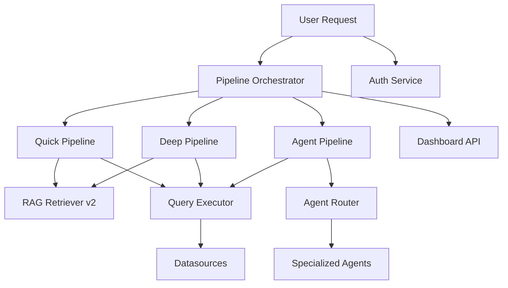
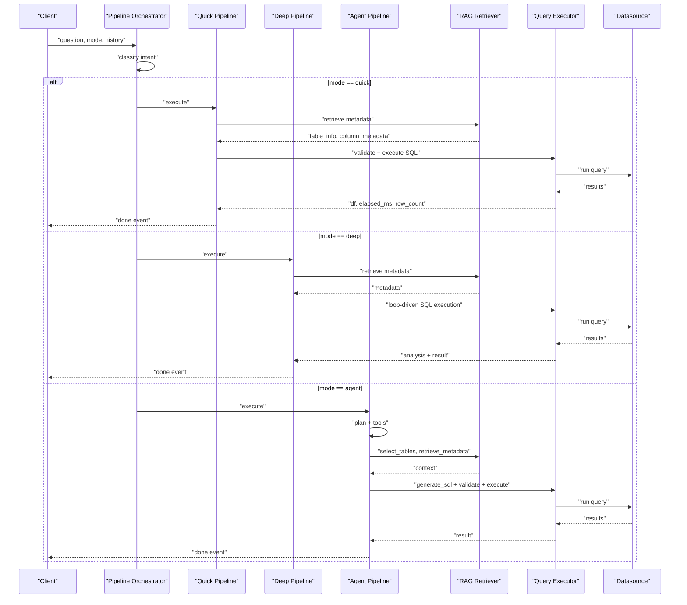
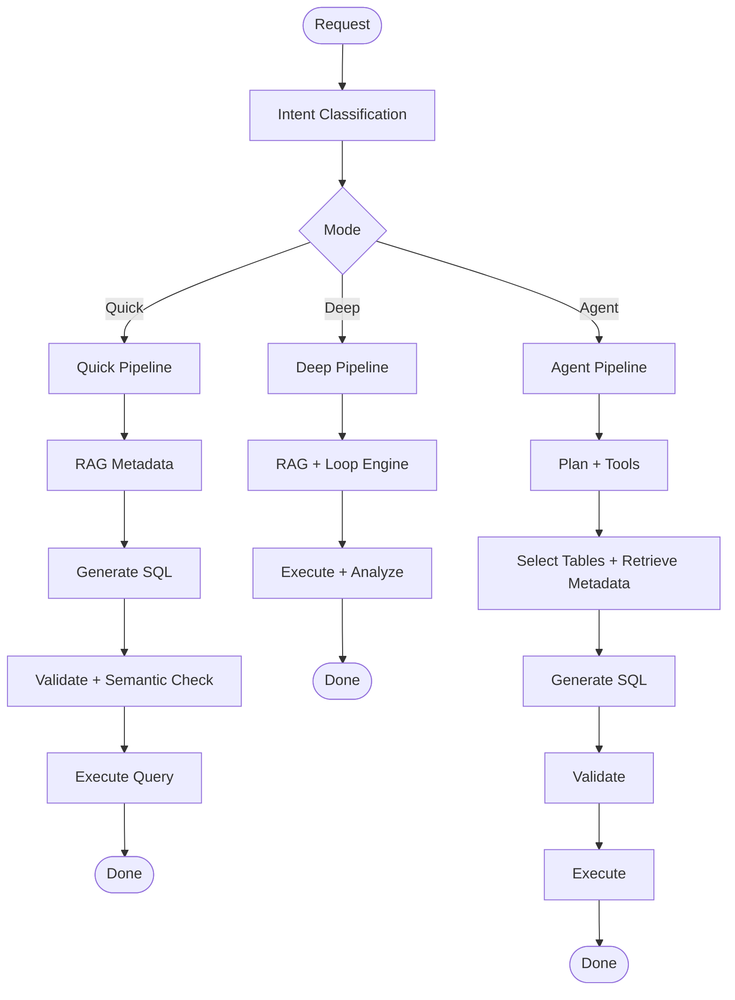
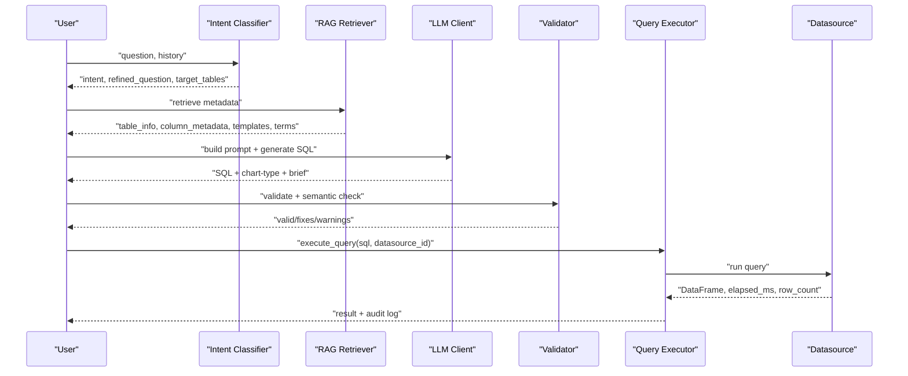
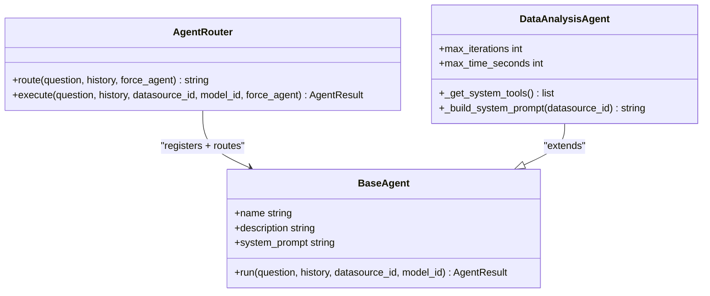
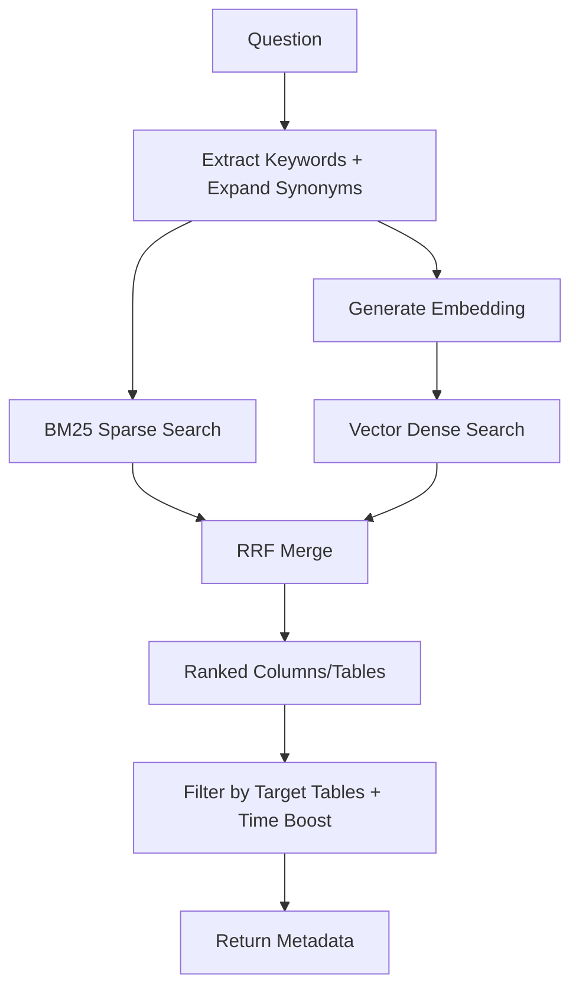
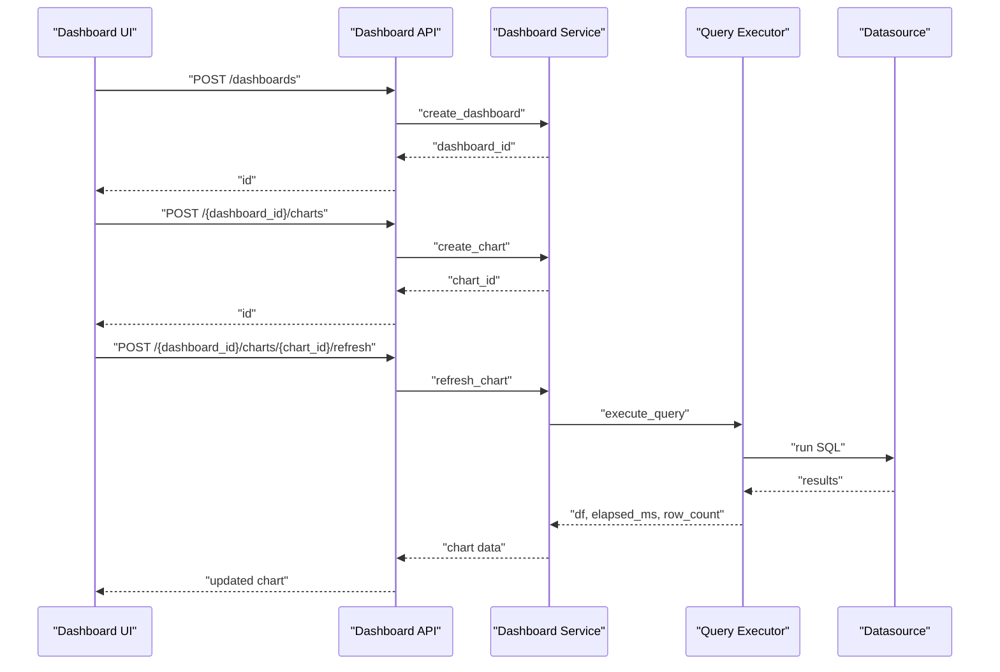
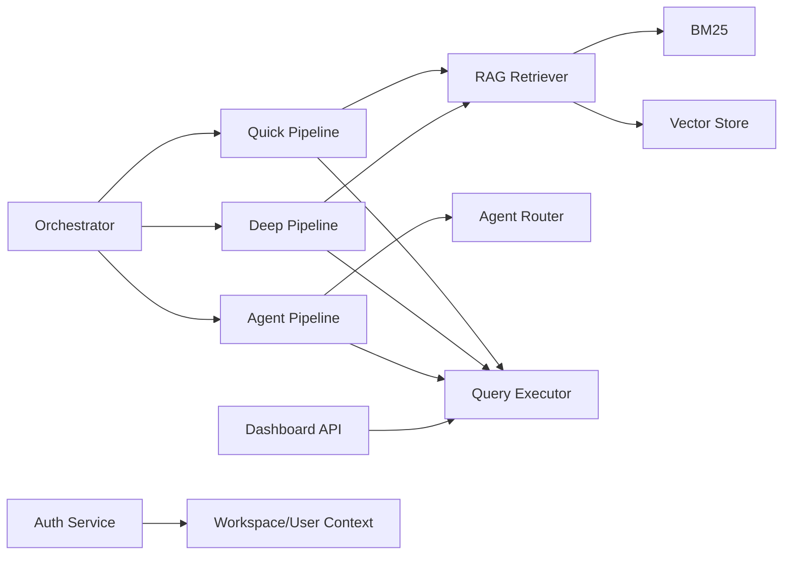

# Core Features

<cite>
**Referenced Files in This Document**
- [pipeline_orchestrator.py](file://services/datamind/nl2sql/orchestrator/pipeline_orchestrator.py)
- [quick_pipeline.py](file://services/datamind/nl2sql/orchestrator/quick_pipeline.py)
- [deep_pipeline.py](file://services/datamind/nl2sql/orchestrator/deep_pipeline.py)
- [agent_pipeline.py](file://services/datamind/nl2sql/orchestrator/agent_pipeline.py)
- [intent_classifier.py](file://services/datamind/nl2sql/intent/intent_classifier.py)
- [router.py](file://services/datamind/agent/router.py)
- [data_analysis_agent.py](file://services/datamind/agent/data_analysis_agent.py)
- [rag_retriever_v2.py](file://services/datamind/rag/rag_retriever_v2.py)
- [bm25.py](file://services/datamind/rag/bm25.py)
- [query_executor.py](file://services/datamind/nl2sql/sql/query_executor.py)
- [dashboard.py](file://services/dataviz/api/dashboard.py)
- [auth.py](file://services/authservice/api/auth.py)
</cite>

## Table of Contents
1. [Introduction](#introduction)
2. [Project Structure](#project-structure)
3. [Core Components](#core-components)
4. [Architecture Overview](#architecture-overview)
5. [Detailed Component Analysis](#detailed-component-analysis)
6. [Dependency Analysis](#dependency-analysis)
7. [Performance Considerations](#performance-considerations)
8. [Troubleshooting Guide](#troubleshooting-guide)
9. [Conclusion](#conclusion)

## Introduction
This document explains AI-DataHub’s core features with a focus on:
- Natural Language Query Processing across three modes: Quick, Deep, and Agent
- Multi-Agent orchestration with specialized agents for data analysis, log analysis, traffic analysis, user profiling, funnel analysis, retention analysis, anomaly detection, trend analysis, and report generation
- RAG pipeline combining BM25 sparse search with vector dense search for intelligent metadata retrieval
- Visualization & Dashboards for creation, charting, and real-time updates
- Enterprise features including JWT authentication, workspace isolation, audit logging, and security protections

## Project Structure
AI-DataHub implements a modular service architecture:
- NL2SQL orchestration routes queries through Quick, Deep, or Agent pipelines
- RAG retrievers provide hybrid metadata retrieval (BM25 + vector)
- Agents are registered and routed by an agent router
- Data execution is handled by a secure query executor
- Dashboards expose CRUD APIs for dashboards and charts
- Auth service provides JWT-based login and token refresh

**Diagram sources**
- [pipeline_orchestrator.py:73-237](file://services/datamind/nl2sql/orchestrator/pipeline_orchestrator.py#L73-L237)
- [quick_pipeline.py:120-473](file://services/datamind/nl2sql/orchestrator/quick_pipeline.py#L120-L473)
- [deep_pipeline.py:39-219](file://services/datamind/nl2sql/orchestrator/deep_pipeline.py#L39-L219)
- [agent_pipeline.py:1-800](file://services/datamind/nl2sql/orchestrator/agent_pipeline.py#L1-L800)
- [rag_retriever_v2.py:59-743](file://services/datamind/rag/rag_retriever_v2.py#L59-L743)
- [query_executor.py:566-679](file://services/datamind/nl2sql/sql/query_executor.py#L566-L679)
- [dashboard.py:97-388](file://services/dataviz/api/dashboard.py#L97-L388)
- [auth.py:21-52](file://services/authservice/api/auth.py#L21-L52)

**Section sources**
- [pipeline_orchestrator.py:73-237](file://services/datamind/nl2sql/orchestrator/pipeline_orchestrator.py#L73-L237)
- [dashboard.py:97-388](file://services/dataviz/api/dashboard.py#L97-L388)
- [auth.py:21-52](file://services/authservice/api/auth.py#L21-L52)

## Core Components
- Intent classification identifies whether the request is a query, chat, correction, or explanation
- Quick mode executes fast SQL-only flows with safety checks and minimal overhead
- Deep mode runs full RAG plus loop-driven workflows for complex queries
- Agent mode enables autonomous tool calling and multi-agent orchestration
- RAG retriever combines BM25 sparse retrieval with vector dense retrieval using RRF fusion
- Query executor enforces read-only SQL policies and supports multiple datasources
- Dashboard API manages dashboards, charts, snapshots, and refresh operations
- Auth service provides JWT login, refresh, and logout endpoints

**Section sources**
- [intent_classifier.py:82-199](file://services/datamind/nl2sql/intent/intent_classifier.py#L82-L199)
- [quick_pipeline.py:120-473](file://services/datamind/nl2sql/orchestrator/quick_pipeline.py#L120-L473)
- [deep_pipeline.py:39-219](file://services/datamind/nl2sql/orchestrator/deep_pipeline.py#L39-L219)
- [agent_pipeline.py:1-800](file://services/datamind/nl2sql/orchestrator/agent_pipeline.py#L1-L800)
- [rag_retriever_v2.py:264-348](file://services/datamind/rag/rag_retriever_v2.py#L264-L348)
- [bm25.py:22-173](file://services/datamind/rag/bm25.py#L22-L173)
- [query_executor.py:193-679](file://services/datamind/nl2sql/sql/query_executor.py#L193-L679)
- [dashboard.py:97-388](file://services/dataviz/api/dashboard.py#L97-L388)
- [auth.py:21-52](file://services/authservice/api/auth.py#L21-L52)

## Architecture Overview
The system routes natural language requests through a central orchestrator that selects the appropriate pipeline based on mode and intent. The Quick pipeline focuses on speed and safety for straightforward queries. The Deep pipeline leverages loop engineering and comprehensive RAG to handle complex analytical tasks. The Agent pipeline enables autonomous planning, tool use, and multi-agent coordination. All pipelines converge at the query executor, which ensures safe execution and audit logging. Dashboards and auth services operate as independent modules integrated via APIs.

**Diagram sources**
- [pipeline_orchestrator.py:73-237](file://services/datamind/nl2sql/orchestrator/pipeline_orchestrator.py#L73-L237)
- [quick_pipeline.py:120-473](file://services/datamind/nl2sql/orchestrator/quick_pipeline.py#L120-L473)
- [deep_pipeline.py:39-219](file://services/datamind/nl2sql/orchestrator/deep_pipeline.py#L39-L219)
- [agent_pipeline.py:1-800](file://services/datamind/nl2sql/orchestrator/agent_pipeline.py#L1-L800)
- [rag_retriever_v2.py:59-743](file://services/datamind/rag/rag_retriever_v2.py#L59-L743)
- [query_executor.py:566-679](file://services/datamind/nl2sql/sql/query_executor.py#L566-L679)

## Detailed Component Analysis

### Natural Language Query Processing: Three Modes
- Quick Mode: Fast path for direct SQL queries; includes intent classification, RAG metadata retrieval, sensitive keyword checks, feasibility assessment, multi-step planning, LLM SQL generation, validation, and execution. It rejects non-query intents requiring deeper capabilities.
- Deep Mode: Full RAG plus loop-driven workflow; integrates progress callbacks and streaming tokens; filters metadata to tables used in generated SQL; returns analysis summaries and workflow details.
- Agent Mode: Autonomous tool-calling agent with system tools for table selection, metadata retrieval, SQL generation/validation/execution, error explanation, reasoning, and user interaction; supports ask_user pauses and context compaction.

**Diagram sources**
- [pipeline_orchestrator.py:73-237](file://services/datamind/nl2sql/orchestrator/pipeline_orchestrator.py#L73-L237)
- [quick_pipeline.py:120-473](file://services/datamind/nl2sql/orchestrator/quick_pipeline.py#L120-L473)
- [deep_pipeline.py:39-219](file://services/datamind/nl2sql/orchestrator/deep_pipeline.py#L39-L219)
- [agent_pipeline.py:1-800](file://services/datamind/nl2sql/orchestrator/agent_pipeline.py#L1-L800)

**Section sources**
- [pipeline_orchestrator.py:73-237](file://services/datamind/nl2sql/orchestrator/pipeline_orchestrator.py#L73-L237)
- [quick_pipeline.py:120-473](file://services/datamind/nl2sql/orchestrator/quick_pipeline.py#L120-L473)
- [deep_pipeline.py:39-219](file://services/datamind/nl2sql/orchestrator/deep_pipeline.py#L39-L219)
- [agent_pipeline.py:1-800](file://services/datamind/nl2sql/orchestrator/agent_pipeline.py#L1-L800)

### Natural Language to SQL Conversion Process
- Intent Classification: Uses fast regex patterns for obvious cases and LLM-based classification for ambiguous inputs; extracts refined question, target tables, and optional reply for chat intents.
- Metadata Retrieval: Retrieves table info, column metadata, SQL templates, business terms, and relations via RAG strategies; supports fallback to information_schema when vector search yields no results.
- SQL Generation: Builds prompts with RAG context; supports correction prompts when previous SQL exists; streams LLM responses and parses JSON or extracts SQL from mixed text.
- Validation: Enforces read-only policy, blocks DDL/DML, requires LIMIT, sanitizes LLM output, and performs semantic validation against schema and time ranges.
- Execution: Routes to MySQL/Doris via pymysql or Elasticsearch via SQL/REST/DSL; logs audit records with user, datasource, timing, and status.

**Diagram sources**
- [intent_classifier.py:82-199](file://services/datamind/nl2sql/intent/intent_classifier.py#L82-L199)
- [rag_retriever_v2.py:59-743](file://services/datamind/rag/rag_retriever_v2.py#L59-L743)
- [quick_pipeline.py:202-473](file://services/datamind/nl2sql/orchestrator/quick_pipeline.py#L202-L473)
- [query_executor.py:566-679](file://services/datamind/nl2sql/sql/query_executor.py#L566-L679)

**Section sources**
- [intent_classifier.py:82-199](file://services/datamind/nl2sql/intent/intent_classifier.py#L82-L199)
- [rag_retriever_v2.py:59-743](file://services/datamind/rag/rag_retriever_v2.py#L59-L743)
- [quick_pipeline.py:202-473](file://services/datamind/nl2sql/orchestrator/quick_pipeline.py#L202-L473)
- [query_executor.py:193-679](file://services/datamind/nl2sql/sql/query_executor.py#L193-L679)

### Multi-Agent Orchestration System
- Agent Registration: Built-in Data Analysis Agent is always active; custom agents are loaded from database and registered dynamically.
- Routing: Fast-path regex matching from agent skill files; fallback to LLM-based routing with agent descriptions and conversation context.
- Specialized Agents: While the codebase explicitly defines a Data Analysis Agent, the architecture supports additional specialized agents such as log analysis, traffic analysis, user profiling, funnel analysis, retention analysis, anomaly detection, trend analysis, and report generation through configurable agent definitions and route patterns.
- Tool Use: Agents leverage system tools for table selection, metadata retrieval, SQL generation/validation/execution, error explanation, reasoning, and user interaction; support context compaction and doom-loop detection.

**Diagram sources**
- [router.py:17-266](file://services/datamind/agent/router.py#L17-L266)
- [data_analysis_agent.py:22-164](file://services/datamind/agent/data_analysis_agent.py#L22-L164)

**Section sources**
- [router.py:17-266](file://services/datamind/agent/router.py#L17-L266)
- [data_analysis_agent.py:22-164](file://services/datamind/agent/data_analysis_agent.py#L22-L164)
- [pipeline_orchestrator.py:18-70](file://services/datamind/nl2sql/orchestrator/pipeline_orchestrator.py#L18-L70)

### RAG Pipeline: BM25 Sparse + Vector Dense Search
- Hybrid Retrieval: Combines BM25 sparse retrieval with vector dense retrieval using Reciprocal Rank Fusion (RRF) to rank columns and tables.
- Metadata Sources: Retrieves table info, column metadata, SQL templates, business terms, table relations, and saved datasets; supports datasource filtering and fuzzy table matching.
- Fallback Strategy: Falls back to information_schema if vector search returns empty results; caches results with LRU strategy.
- Tokenization and Indexing: Builds BM25 index from cached column metadata; expands synonyms and normalizes keywords for better recall.

**Diagram sources**
- [rag_retriever_v2.py:264-348](file://services/datamind/rag/rag_retriever_v2.py#L264-L348)
- [bm25.py:22-173](file://services/datamind/rag/bm25.py#L22-L173)

**Section sources**
- [rag_retriever_v2.py:59-743](file://services/datamind/rag/rag_retriever_v2.py#L59-L743)
- [bm25.py:22-173](file://services/datamind/rag/bm25.py#L22-L173)

### Visualization & Dashboards
- Dashboard CRUD: Create, update, delete, copy dashboards with layout, filters, parameters, and public/default flags.
- Chart Management: Add, update, delete charts within dashboards; support various chart types and SQL sources.
- Real-time Updates: Refresh individual charts or all charts in a dashboard; preview saved queries/datasets; list aggregated data sources.
- Snapshots: List recent chart snapshots from chat executions and retrieve full snapshot data including rows.

**Diagram sources**
- [dashboard.py:97-388](file://services/dataviz/api/dashboard.py#L97-L388)
- [query_executor.py:566-679](file://services/datamind/nl2sql/sql/query_executor.py#L566-L679)

**Section sources**
- [dashboard.py:97-388](file://services/dataviz/api/dashboard.py#L97-L388)

### Enterprise Features
- JWT Authentication: Login endpoint validates credentials and returns token pair; refresh endpoint exchanges refresh token for new access token; logout clears client-side tokens.
- Workspace Isolation: Dashboard and other resources are scoped by workspace_id; middleware enforces current user and workspace context.
- Audit Logging: Query executor logs every executed query with user, role, datasource, SQL, status, timing, and errors; supports both success and error states.
- Security Protections: SQL validation enforces read-only policy, blocks DDL/DML, requires LIMIT, sanitizes LLM output, and detects sensitive keywords before execution.

**Section sources**
- [auth.py:21-52](file://services/authservice/api/auth.py#L21-L52)
- [query_executor.py:193-679](file://services/datamind/nl2sql/sql/query_executor.py#L193-L679)
- [dashboard.py:97-388](file://services/dataviz/api/dashboard.py#L97-L388)

## Dependency Analysis
The system exhibits clear separation of concerns:
- Orchestrator depends on pipelines and agent router
- Pipelines depend on RAG retriever and query executor
- Agent pipeline depends on agent router and system tools
- RAG retriever depends on vector store and BM25 implementation
- Dashboard API depends on services and query executor
- Auth service is independent but consumed by other services via middleware

**Diagram sources**
- [pipeline_orchestrator.py:73-237](file://services/datamind/nl2sql/orchestrator/pipeline_orchestrator.py#L73-L237)
- [quick_pipeline.py:120-473](file://services/datamind/nl2sql/orchestrator/quick_pipeline.py#L120-L473)
- [deep_pipeline.py:39-219](file://services/datamind/nl2sql/orchestrator/deep_pipeline.py#L39-L219)
- [agent_pipeline.py:1-800](file://services/datamind/nl2sql/orchestrator/agent_pipeline.py#L1-L800)
- [rag_retriever_v2.py:59-743](file://services/datamind/rag/rag_retriever_v2.py#L59-L743)
- [bm25.py:22-173](file://services/datamind/rag/bm25.py#L22-L173)
- [dashboard.py:97-388](file://services/dataviz/api/dashboard.py#L97-L388)
- [auth.py:21-52](file://services/authservice/api/auth.py#L21-L52)

**Section sources**
- [pipeline_orchestrator.py:73-237](file://services/datamind/nl2sql/orchestrator/pipeline_orchestrator.py#L73-L237)
- [rag_retriever_v2.py:59-743](file://services/datamind/rag/rag_retriever_v2.py#L59-L743)
- [dashboard.py:97-388](file://services/dataviz/api/dashboard.py#L97-L388)

## Performance Considerations
- Quick mode minimizes latency by skipping agent routing and loop engineering; suitable for straightforward queries.
- RAG retriever uses caching (LRU) and parallel threads for template, term, relation, and dataset searches to reduce latency.
- BM25 indexing is built once per datasource and reused; RRF fusion balances sparse and dense retrieval efficiently.
- Query executor caches datasource configurations and enforces read-only policies to prevent expensive or unsafe operations.
- Agent pipeline includes context compaction and tool result truncation to manage token budgets and avoid excessive memory usage.

[No sources needed since this section provides general guidance]

## Troubleshooting Guide
- Intent Classification Failures: If LLM classification fails, defaults to query intent; check history context and refine prompts.
- RAG Retrieval Empty Results: Falls back to information_schema; verify datasource configuration and metadata sync.
- SQL Validation Errors: Ensure SELECT/WITH only, include LIMIT, remove DDL/DML; use validator fixes and semantic checks.
- Query Execution Failures: Check datasource connectivity, SQL syntax, and permissions; review audit logs for error messages.
- Agent Mode Issues: Monitor tool call limits, doom-loop detection, and ask_user timeouts; ensure agents are registered and active.

**Section sources**
- [intent_classifier.py:82-199](file://services/datamind/nl2sql/intent/intent_classifier.py#L82-L199)
- [rag_retriever_v2.py:549-635](file://services/datamind/rag/rag_retriever_v2.py#L549-L635)
- [query_executor.py:193-679](file://services/datamind/nl2sql/sql/query_executor.py#L193-L679)
- [agent_pipeline.py:38-105](file://services/datamind/nl2sql/orchestrator/agent_pipeline.py#L38-L105)

## Conclusion
AI-DataHub provides a robust, extensible platform for natural language query processing with three distinct modes tailored to different complexity levels. The multi-agent system enables specialized analysis capabilities, while the RAG pipeline ensures accurate metadata retrieval through hybrid search. Dashboards offer flexible visualization and real-time updates, and enterprise features like JWT authentication, workspace isolation, audit logging, and security protections ensure safe, scalable deployment. The modular architecture supports future enhancements and integration with additional agents and data sources.

[No sources needed since this section summarizes without analyzing specific files]