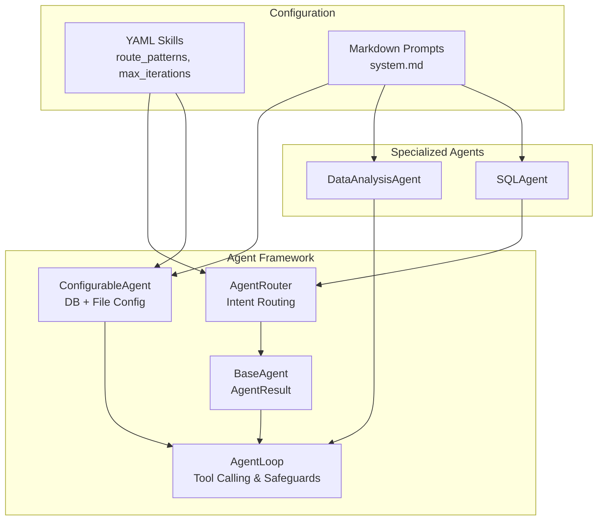
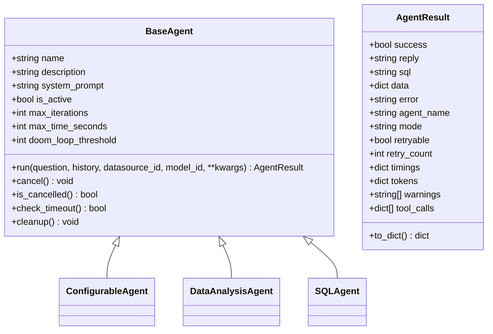
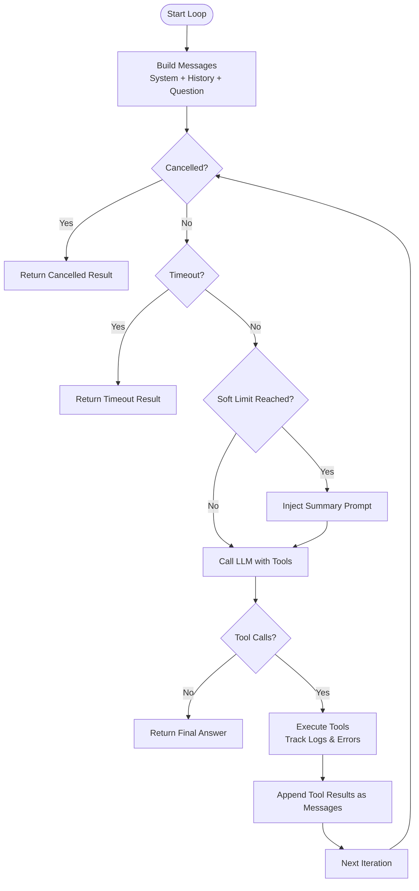
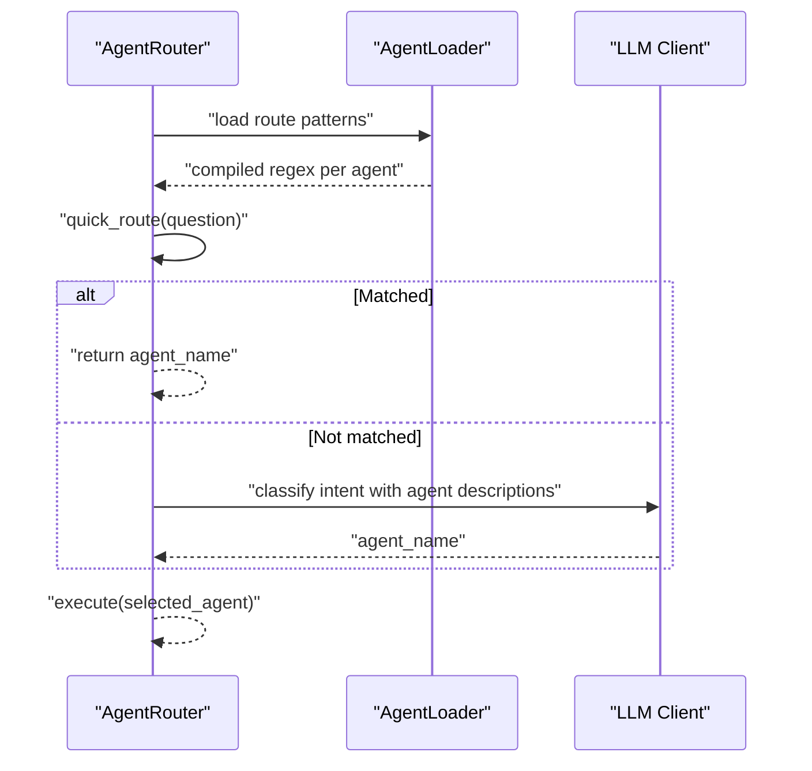
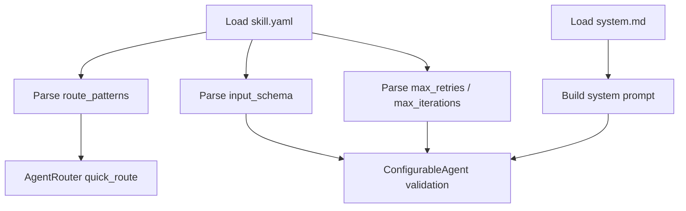
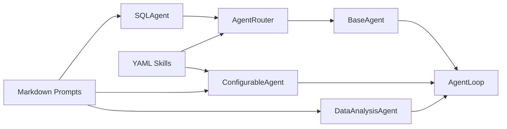

# Multi-Agent System

<cite>
**Referenced Files in This Document**
- [base.py](file://services/datamind/agent/base.py)
- [agent_loop.py](file://services/datamind/agent/agent_loop.py)
- [router.py](file://services/datamind/agent/router.py)
- [configurable_agent.py](file://services/datamind/agent/configurable_agent.py)
- [data_analysis_agent.py](file://services/datamind/agent/data_analysis_agent.py)
- [sql_agent.py](file://services/datamind/agent/sql_agent.py)
- [agent_loader.py](file://services/datamind/config/agent_loader.py)
- [skill.yaml (orchestrator)](file://services/datamind/config/agents/orchestrator/skill.yaml)
- [skill.yaml (data_analysis)](file://services/datamind/config/agents/data_analysis/skill.yaml)
- [skill.yaml (anomaly)](file://services/datamind/config/agents/anomaly/skill.yaml)
- [skill.yaml (traffic)](file://services/datamind/config/agents/traffic/skill.yaml)
</cite>

## Table of Contents
1. [Introduction](#introduction)
2. [Project Structure](#project-structure)
3. [Core Components](#core-components)
4. [Architecture Overview](#architecture-overview)
5. [Detailed Component Analysis](#detailed-component-analysis)
6. [Dependency Analysis](#dependency-analysis)
7. [Performance Considerations](#performance-considerations)
8. [Troubleshooting Guide](#troubleshooting-guide)
9. [Conclusion](#conclusion)
10. [Appendices](#appendices)

## Introduction
This document explains the AI-DataHub Multi-Agent System architecture with a focus on:
- The agent framework design: base agent class, agent loop with tool calling, and intelligent routing
- Built-in specialized agents: data analysis, log analysis, traffic analysis, user profiling, funnel analysis, retention analysis, anomaly detection, trend analysis, and report generation
- Orchestrator coordination and parallel execution patterns
- Agent configuration via YAML files, prompt engineering with markdown templates
- Tool calling patterns, soft limits, and error recovery mechanisms

The system is designed to be extensible, safe, and observable, enabling autonomous multi-step reasoning with robust safeguards against loops, timeouts, and resource exhaustion.

## Project Structure
At the core of the multi-agent system are:
- Base agent abstraction and result model
- A reusable LLM-driven agent loop for tool calling
- An intent router that selects the best agent per request
- Specialized agents for data analysis and SQL queries
- A configurable agent that loads behavior from database and file-based skills
- YAML skill definitions and markdown prompts for each agent



**Diagram sources**
- [base.py:17-129](file://services/datamind/agent/base.py#L17-L129)
- [agent_loop.py:23-423](file://services/datamind/agent/agent_loop.py#L23-L423)
- [router.py:167-266](file://services/datamind/agent/router.py#L167-L266)
- [configurable_agent.py:21-233](file://services/datamind/agent/configurable_agent.py#L21-L233)
- [data_analysis_agent.py:22-164](file://services/datamind/agent/data_analysis_agent.py#L22-L164)
- [sql_agent.py:15-74](file://services/datamind/agent/sql_agent.py#L15-L74)
- [agent_loader.py:1-163](file://services/datamind/config/agent_loader.py#L1-L163)

**Section sources**
- [base.py:17-129](file://services/datamind/agent/base.py#L17-L129)
- [agent_loop.py:23-423](file://services/datamind/agent/agent_loop.py#L23-L423)
- [router.py:167-266](file://services/datamind/agent/router.py#L167-L266)
- [configurable_agent.py:21-233](file://services/datamind/agent/configurable_agent.py#L21-L233)
- [data_analysis_agent.py:22-164](file://services/datamind/agent/data_analysis_agent.py#L22-L164)
- [sql_agent.py:15-74](file://services/datamind/agent/sql_agent.py#L15-L74)
- [agent_loader.py:1-163](file://services/datamind/config/agent_loader.py#L1-L163)

## Core Components
- BaseAgent and AgentResult define the contract for all agents, including lifecycle hooks, cancellation, timeout checks, and standardized results with timing, tokens, warnings, and tool call logs.
- AgentLoop implements the LLM-driven tool calling loop with:
  - Soft limit injection near max iterations to force summarization
  - Doom loop detection to prevent repeated identical tool calls
  - Cancellation and timeout handling
  - Token tracking and optional Langfuse tracing
- AgentRouter provides fast-path regex routing from YAML-defined route patterns and falls back to an LLM-based classifier when needed. It executes the selected agent and ensures cleanup.
- ConfigurableAgent reads DB-backed configuration and file-based skills/prompts, collects MCP tools, builds system prompts dynamically, and runs the AgentLoop.
- DataAnalysisAgent encapsulates NL2SQL capabilities by exposing a curated set of system tools and orchestrating them through AgentLoop.
- SQLAgent wraps the existing NL2SQL pipeline as an agent for standard data queries.

**Section sources**
- [base.py:17-129](file://services/datamind/agent/base.py#L17-L129)
- [agent_loop.py:23-423](file://services/datamind/agent/agent_loop.py#L23-L423)
- [router.py:167-266](file://services/datamind/agent/router.py#L167-L266)
- [configurable_agent.py:21-233](file://services/datamind/agent/configurable_agent.py#L21-L233)
- [data_analysis_agent.py:22-164](file://services/datamind/agent/data_analysis_agent.py#L22-L164)
- [sql_agent.py:15-74](file://services/datamind/agent/sql_agent.py#L15-L74)

## Architecture Overview
The system routes user questions to specialized agents using both fast regex matching and LLM classification. Each agent autonomously interacts with tools (MCP or system tools) via AgentLoop, which enforces safety policies and tracks execution metrics.

```mermaid
sequenceDiagram
participant User as "User"
participant Router as "AgentRouter"
participant Agent as "Selected Agent"
participant Loop as "AgentLoop"
participant Tools as "Tools (MCP/System)"
participant LLM as "LLM Client"
User->>Router : "question, history, datasource_id, model_id"
Router->>Router : "quick_route() regex match"
alt Regex matched
Router-->>Agent : "execute(agent.run)"
else No regex match
Router->>LLM : "classify intent"
LLM-->>Router : "agent_name"
Router->>Agent : "execute(agent.run)"
end
Agent->>Loop : "run(question, system_prompt, model_id, history)"
Loop->>LLM : "messages + tools"
LLM-->>Loop : "text or tool_calls"
alt tool_calls present
Loop->>Tools : "execute_tool_fn(name, input)"
Tools-->>Loop : "result"
Loop->>LLM : "tool_results as messages"
else no tool_calls
Loop-->>Agent : "final answer"
end
Agent-->>Router : "AgentResult"
Router-->>User : "reply, sql, data, timings, tokens, warnings"
```

**Diagram sources**
- [router.py:83-199](file://services/datamind/agent/router.py#L83-L199)
- [router.py:201-258](file://services/datamind/agent/router.py#L201-L258)
- [agent_loop.py:60-324](file://services/datamind/agent/agent_loop.py#L60-L324)
- [data_analysis_agent.py:56-101](file://services/datamind/agent/data_analysis_agent.py#L56-L101)
- [sql_agent.py:22-68](file://services/datamind/agent/sql_agent.py#L22-L68)

## Detailed Component Analysis

### Base Agent and Result Model
- BaseAgent defines the abstract interface and shared protections:
  - name, description, system_prompt, is_active
  - max_iterations, max_time_seconds, doom_loop_threshold
  - cancel(), is_cancelled(), check_timeout(), cleanup()
- AgentResult captures success, reply, sql, data, error, agent_name, mode, retryable, retry_count, timings, tokens, warnings, and tool_calls, with serialization support.



**Diagram sources**
- [base.py:17-129](file://services/datamind/agent/base.py#L17-L129)

**Section sources**
- [base.py:17-129](file://services/datamind/agent/base.py#L17-L129)

### Agent Loop: Tool Calling, Soft Limits, and Error Recovery
- AgentLoop drives the LLM interaction:
  - Builds initial messages from system prompt, recent history, and question
  - Iterates up to max_iterations with soft limit injection near the end to force summarization
  - Executes tool calls returned by the LLM and feeds results back into the conversation
  - Detects doom loops (repeated identical tool calls) and aborts safely
  - Tracks token usage and supports Langfuse tracing
  - Handles cancellation and timeout gracefully



**Diagram sources**
- [agent_loop.py:60-324](file://services/datamind/agent/agent_loop.py#L60-L324)

**Section sources**
- [agent_loop.py:60-324](file://services/datamind/agent/agent_loop.py#L60-L324)

### Intelligent Routing Mechanism
- Fast-path routing uses compiled regex patterns loaded from YAML skill files for each agent.
- Slow-path routing uses an LLM classifier to select the most appropriate agent based on descriptions and conversation context.
- If routing fails or no agent is found, it defaults to sql_agent.



**Diagram sources**
- [router.py:43-199](file://services/datamind/agent/router.py#L43-L199)
- [agent_loader.py:110-122](file://services/datamind/config/agent_loader.py#L110-L122)

**Section sources**
- [router.py:43-199](file://services/datamind/agent/router.py#L43-L199)
- [agent_loader.py:110-122](file://services/datamind/config/agent_loader.py#L110-L122)

### Built-in Specialized Agents
- DataAnalysisAgent: Uses curated system tools for table selection, metadata retrieval, SQL generation/validation/execution, and result analysis.
- SQLAgent: Wraps the existing NL2SQL pipeline as an agent, returning structured results.
- ConfigurableAgent: Loads dynamic behavior from DB and YAML skills, supporting MCP tool integration and custom prompts.

Additional specialized agents are defined via YAML skills and can be integrated similarly:
- Log Analysis Agent
- Traffic Analysis Agent
- User Profiling Agent
- Funnel Analysis Agent
- Retention Analysis Agent
- Anomaly Detection Agent
- Trend Analysis Agent
- Report Generation Agent

These agents share common patterns:
- Define route_patterns for fast routing
- Provide input_schema describing required/optional parameters
- Optionally override max_iterations and max_retries
- Use system.md prompts to guide behavior

**Section sources**
- [data_analysis_agent.py:22-164](file://services/datamind/agent/data_analysis_agent.py#L22-L164)
- [sql_agent.py:15-74](file://services/datamind/agent/sql_agent.py#L15-L74)
- [configurable_agent.py:21-233](file://services/datamind/agent/configurable_agent.py#L21-L233)
- [skill.yaml (data_analysis):1-23](file://services/datamind/config/agents/data_analysis/skill.yaml#L1-L23)
- [skill.yaml (anomaly):1-24](file://services/datamind/config/agents/anomaly/skill.yaml#L1-L24)
- [skill.yaml (traffic):1-27](file://services/datamind/config/agents/traffic/skill.yaml#L1-L27)

### Orchestrator Agent Role and Parallel Execution
- The orchestrator coordinates between specialized agents, selecting the right one per request and managing execution flow.
- While the provided code focuses on single-agent execution via the router, the framework supports orchestration patterns where multiple agents could be invoked concurrently using asyncio.gather. For example, an orchestrator could:
  - Route to multiple specialized agents in parallel (e.g., traffic analysis and anomaly detection)
  - Aggregate results and synthesize a final response
  - Apply soft limits and error recovery at the orchestrator level

Note: The current repository emphasizes single-agent routing; parallel orchestration can be implemented atop the same primitives (BaseAgent, AgentLoop, Router).

[No sources needed since this section describes conceptual orchestration patterns not directly implemented in the referenced files]

### Agent Configuration Through YAML and Markdown
- YAML skills define:
  - name, display_name, description
  - datasource_type constraints
  - route_patterns for fast routing
  - input_schema for required/optional parameters
  - max_retries and max_iterations overrides
- Markdown system prompts provide behavioral guidance and output requirements.
- The loader prioritizes DB overrides > skill.yaml > defaults, ensuring flexible runtime configuration.



**Diagram sources**
- [agent_loader.py:30-122](file://services/datamind/config/agent_loader.py#L30-L122)
- [configurable_agent.py:32-89](file://services/datamind/agent/configurable_agent.py#L32-L89)

**Section sources**
- [agent_loader.py:30-122](file://services/datamind/config/agent_loader.py#L30-L122)
- [configurable_agent.py:32-89](file://services/datamind/agent/configurable_agent.py#L32-L89)

### Tool Calling Patterns and MCP Integration
- ConfigurableAgent collects available tools from MCP servers bound to the agent and filters them based on configured tool names.
- Tools are described with schemas and passed to the LLM for tool_use decisions.
- Tool execution errors are captured and logged; the loop continues unless a doom loop or fatal error occurs.

**Section sources**
- [configurable_agent.py:157-176](file://services/datamind/agent/configurable_agent.py#L157-L176)
- [configurable_agent.py:217-227](file://services/datamind/agent/configurable_agent.py#L217-L227)
- [agent_loop.py:201-297](file://services/datamind/agent/agent_loop.py#L201-L297)

### Soft Limits Implementation
- Near the end of the iteration budget, AgentLoop injects a summary prompt instructing the LLM to finalize without further tool calls.
- This reduces the risk of exceeding max_iterations while still allowing thorough exploration earlier in the loop.

**Section sources**
- [agent_loop.py:112-145](file://services/datamind/agent/agent_loop.py#L112-L145)

### Error Recovery Mechanisms
- Cancellation: Agents expose cancel() to signal external termination; the loop checks is_cancelled() each iteration.
- Timeout: check_timeout() prevents runaway executions beyond max_time_seconds.
- Doom Loop Detection: Prevents infinite repetition of identical tool calls.
- Graceful Fallbacks: Router defaults to sql_agent if routing fails; AgentLoop returns partial replies when max iterations are exceeded.

**Section sources**
- [base.py:110-129](file://services/datamind/agent/base.py#L110-L129)
- [agent_loop.py:116-136](file://services/datamind/agent/agent_loop.py#L116-L136)
- [agent_loop.py:222-252](file://services/datamind/agent/agent_loop.py#L222-L252)
- [agent_loop.py:299-324](file://services/datamind/agent/agent_loop.py#L299-L324)
- [router.py:193-199](file://services/datamind/agent/router.py#L193-L199)

## Dependency Analysis
The multi-agent system exhibits clear separation of concerns:
- BaseAgent and AgentResult provide a stable contract
- AgentLoop encapsulates LLM interaction and safety policies
- Router decouples intent classification from execution
- Specialized agents compose tools and prompts without duplicating loop logic
- YAML skills and markdown prompts externalize configuration and behavior



**Diagram sources**
- [base.py:17-129](file://services/datamind/agent/base.py#L17-L129)
- [agent_loop.py:23-423](file://services/datamind/agent/agent_loop.py#L23-L423)
- [router.py:167-266](file://services/datamind/agent/router.py#L167-L266)
- [configurable_agent.py:21-233](file://services/datamind/agent/configurable_agent.py#L21-L233)
- [data_analysis_agent.py:22-164](file://services/datamind/agent/data_analysis_agent.py#L22-L164)
- [sql_agent.py:15-74](file://services/datamind/agent/sql_agent.py#L15-L74)
- [agent_loader.py:1-163](file://services/datamind/config/agent_loader.py#L1-L163)

**Section sources**
- [base.py:17-129](file://services/datamind/agent/base.py#L17-L129)
- [agent_loop.py:23-423](file://services/datamind/agent/agent_loop.py#L23-L423)
- [router.py:167-266](file://services/datamind/agent/router.py#L167-L266)
- [configurable_agent.py:21-233](file://services/datamind/agent/configurable_agent.py#L21-L233)
- [data_analysis_agent.py:22-164](file://services/datamind/agent/data_analysis_agent.py#L22-L164)
- [sql_agent.py:15-74](file://services/datamind/agent/sql_agent.py#L15-L74)
- [agent_loader.py:1-163](file://services/datamind/config/agent_loader.py#L1-L163)

## Performance Considerations
- Soft limits reduce the risk of excessive tool calls and help produce timely summaries.
- Doom loop detection prevents wasteful retries on transient failures.
- Token tracking enables cost monitoring and model selection strategies.
- Fast-path regex routing minimizes LLM calls for clear intents.
- Externalizing prompts and skills allows tuning without code changes.

[No sources needed since this section provides general guidance]

## Troubleshooting Guide
Common issues and resolutions:
- No tools available: Ensure MCP servers are bound and tools are enabled in agent configuration.
- Doom loop detected: Adjust doom_loop_threshold or refine tool inputs to avoid repetitive calls.
- Timeout exceeded: Increase max_time_seconds or optimize tool chains.
- Routing failure: Verify route_patterns in YAML and ensure active agents are registered.
- LLM call failures: Check model configuration and network connectivity; fallback to sql_agent is applied automatically.

**Section sources**
- [configurable_agent.py:117-128](file://services/datamind/agent/configurable_agent.py#L117-L128)
- [agent_loop.py:222-252](file://services/datamind/agent/agent_loop.py#L222-L252)
- [agent_loop.py:116-136](file://services/datamind/agent/agent_loop.py#L116-L136)
- [router.py:193-199](file://services/datamind/agent/router.py#L193-L199)

## Conclusion
AI-DataHub’s Multi-Agent System provides a robust, extensible framework for autonomous, tool-augmented reasoning. The base agent contract, reusable agent loop, and intelligent router enable rapid development of specialized agents. YAML skills and markdown prompts offer flexible configuration and behavior control. Safety mechanisms like soft limits, doom loop detection, cancellation, and timeouts ensure reliable operation. The system is well-positioned for future enhancements such as parallel orchestration and richer multi-agent collaboration.

[No sources needed since this section summarizes without analyzing specific files]

## Appendices

### Appendix A: Specialized Agent Definitions via YAML
- Orchestrator: Defines role and scope for coordinating agents.
- Data Analysis: Focuses on NL2SQL workflows with explicit input schema.
- Anomaly Detection: Targets metric deviations and alerts with higher iteration budgets.
- Traffic Analysis: Handles UV/PV metrics, page rankings, and time distributions.

**Section sources**
- [skill.yaml (orchestrator):1-7](file://services/datamind/config/agents/orchestrator/skill.yaml#L1-L7)
- [skill.yaml (data_analysis):1-23](file://services/datamind/config/agents/data_analysis/skill.yaml#L1-L23)
- [skill.yaml (anomaly):1-24](file://services/datamind/config/agents/anomaly/skill.yaml#L1-L24)
- [skill.yaml (traffic):1-27](file://services/datamind/config/agents/traffic/skill.yaml#L1-L27)

### Appendix B: Custom Agent Development Guidelines
- Implement BaseAgent subclass with run(), name, description, and system_prompt.
- Use AgentLoop for tool calling and safety enforcement.
- Define YAML skill with route_patterns, input_schema, and limits.
- Provide system.md for prompt engineering and output guidelines.
- Integrate MCP tools via ConfigurableAgent or expose system tools as in DataAnalysisAgent.

**Section sources**
- [base.py:52-129](file://services/datamind/agent/base.py#L52-L129)
- [agent_loop.py:23-423](file://services/datamind/agent/agent_loop.py#L23-L423)
- [configurable_agent.py:21-233](file://services/datamind/agent/configurable_agent.py#L21-L233)
- [agent_loader.py:30-122](file://services/datamind/config/agent_loader.py#L30-L122)