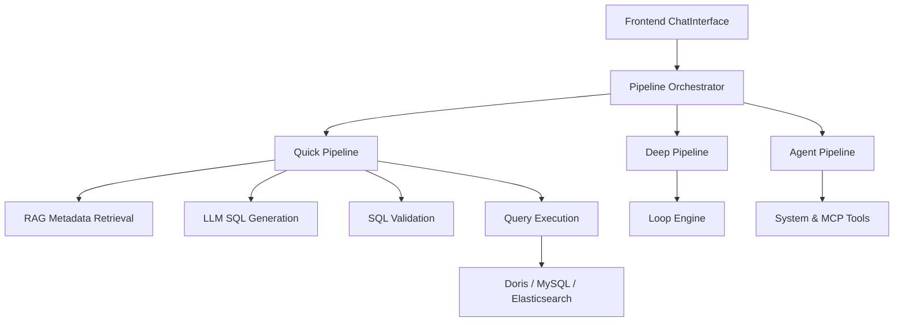
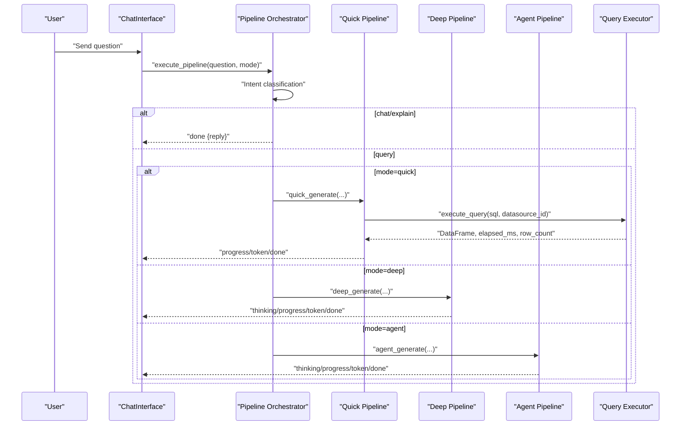
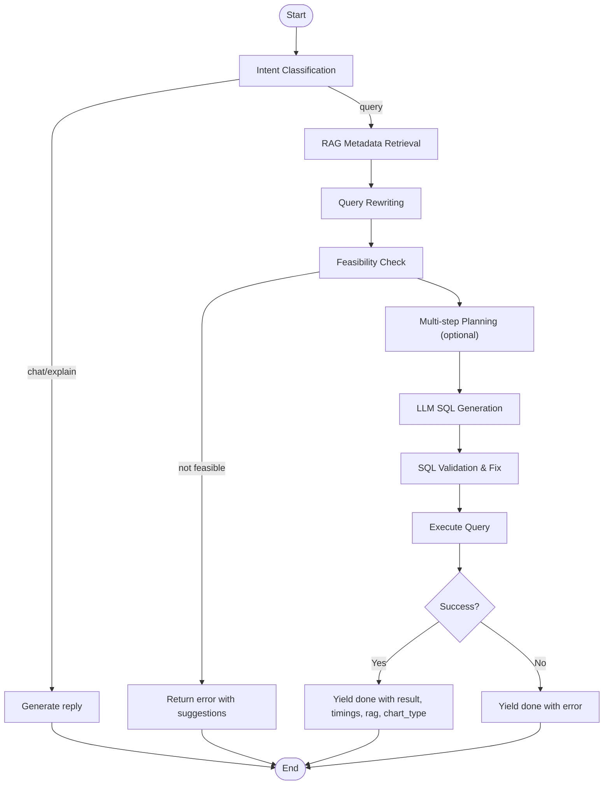
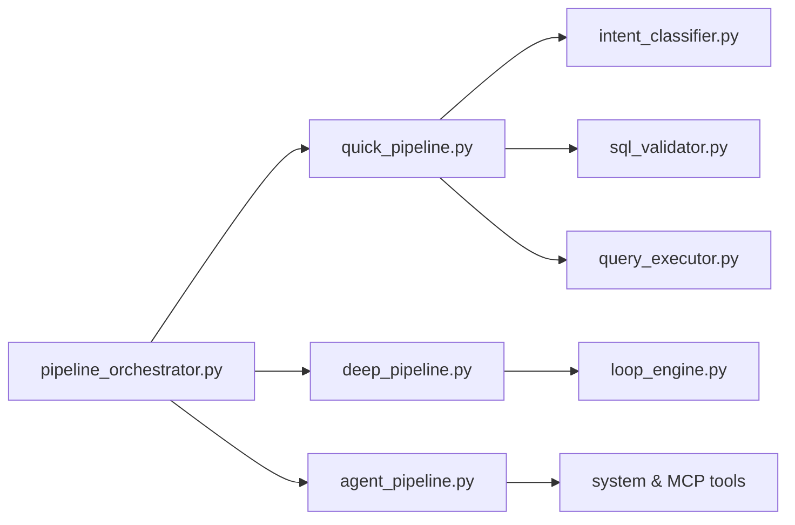

# Natural Language Query Processing

<cite>
**Referenced Files in This Document**
- [pipeline_orchestrator.py](file://services/datamind/nl2sql/orchestrator/pipeline_orchestrator.py)
- [quick_pipeline.py](file://services/datamind/nl2sql/orchestrator/quick_pipeline.py)
- [deep_pipeline.py](file://services/datamind/nl2sql/orchestrator/deep_pipeline.py)
- [agent_pipeline.py](file://services/datamind/nl2sql/orchestrator/agent_pipeline.py)
- [intent_classifier.py](file://services/datamind/nl2sql/intent/intent_classifier.py)
- [query_executor.py](file://services/datamind/nl2sql/sql/query_executor.py)
- [sql_validator.py](file://services/datamind/nl2sql/sql/sql_validator.py)
- [loop_engine.py](file://services/datamind/nl2sql/orchestrator/workflow/loop_engine.py)
- [ChatInterface.tsx](file://frontend/src/components/ai-assistant/ChatInterface.tsx)
- [aiAssistantExecutor.ts](file://frontend/src/utils/aiAssistantExecutor.ts)
</cite>

## Table of Contents
1. [Introduction](#introduction)
2. [Project Structure](#project-structure)
3. [Core Components](#core-components)
4. [Architecture Overview](#architecture-overview)
5. [Detailed Component Analysis](#detailed-component-analysis)
6. [Dependency Analysis](#dependency-analysis)
7. [Performance Considerations](#performance-considerations)
8. [Troubleshooting Guide](#troubleshooting-guide)
9. [Conclusion](#conclusion)
10. [Appendices](#appendices)

## Introduction
This document explains AI-DataHub’s Natural Language Query Processing system that converts natural language questions into optimized SQL queries and returns results with optional visualization recommendations. It covers three query modes (Quick, Deep, Agent), the end-to-end NL2SQL pipeline (intent classification, query understanding, metadata retrieval, SQL generation, validation, execution), streaming responses for real-time feedback, and integration with the frontend chat interface.

## Project Structure
The NL2SQL system is implemented primarily under services/datamind/nl2sql with orchestrators for different modes, intent classification, SQL validation and execution, and a loop engine for complex workflows. The frontend integrates via a chat component and an executor utility to handle UI actions.

**Diagram sources**
- [pipeline_orchestrator.py:73-237](file://services/datamind/nl2sql/orchestrator/pipeline_orchestrator.py#L73-L237)
- [quick_pipeline.py:120-473](file://services/datamind/nl2sql/orchestrator/quick_pipeline.py#L120-L473)
- [deep_pipeline.py:39-219](file://services/datamind/nl2sql/orchestrator/deep_pipeline.py#L39-L219)
- [agent_pipeline.py:1-800](file://services/datamind/nl2sql/orchestrator/agent_pipeline.py#L1-L800)
- [query_executor.py:566-624](file://services/datamind/nl2sql/sql/query_executor.py#L566-L624)

**Section sources**
- [pipeline_orchestrator.py:73-237](file://services/datamind/nl2sql/orchestrator/pipeline_orchestrator.py#L73-L237)
- [quick_pipeline.py:120-473](file://services/datamind/nl2sql/orchestrator/quick_pipeline.py#L120-L473)
- [deep_pipeline.py:39-219](file://services/datamind/nl2sql/orchestrator/deep_pipeline.py#L39-L219)
- [agent_pipeline.py:1-800](file://services/datamind/nl2sql/orchestrator/agent_pipeline.py#L1-L800)
- [query_executor.py:566-624](file://services/datamind/nl2sql/sql/query_executor.py#L566-L624)

## Core Components
- Pipeline Orchestrator: Routes requests to Quick, Deep, or Agent mode; handles non-query intents early.
- Intent Classifier: Fast regex-based detection for chat/correction/explain; falls back to LLM for nuanced cases.
- Quick Pipeline: Streamlined NL2SQL path for data queries only; includes RAG, LLM SQL generation, validation, execution.
- Deep Pipeline: Full RAG + Loop Engineering workflow with on-demand metadata supplementation and result analysis.
- Agent Pipeline: Autonomous tool-augmented agent with system tools, MCP tools, and sub-agents; supports ask_user interaction.
- SQL Validator and Executor: Safety checks, business rules, limit enforcement, and execution across Doris, MySQL, and Elasticsearch.
- Frontend Integration: Chat interface displays thinking, progress, results, and supports quick questions and stop generation.

**Section sources**
- [pipeline_orchestrator.py:73-237](file://services/datamind/nl2sql/orchestrator/pipeline_orchestrator.py#L73-L237)
- [intent_classifier.py:82-198](file://services/datamind/nl2sql/intent/intent_classifier.py#L82-L198)
- [quick_pipeline.py:120-473](file://services/datamind/nl2sql/orchestrator/quick_pipeline.py#L120-L473)
- [deep_pipeline.py:39-219](file://services/datamind/nl2sql/orchestrator/deep_pipeline.py#L39-L219)
- [agent_pipeline.py:1-800](file://services/datamind/nl2sql/orchestrator/agent_pipeline.py#L1-L800)
- [sql_validator.py:121-179](file://services/datamind/nl2sql/sql/sql_validator.py#L121-L179)
- [query_executor.py:193-256](file://services/datamind/nl2sql/sql/query_executor.py#L193-L256)
- [ChatInterface.tsx:17-314](file://frontend/src/components/ai-assistant/ChatInterface.tsx#L17-L314)

## Architecture Overview
The system uses a unified entry point to classify intent and route to the appropriate pipeline. Non-query intents are handled directly without heavy processing. Data queries proceed through RAG metadata retrieval, LLM-driven SQL generation, validation, and execution. Streaming events provide real-time progress and tokens.

**Diagram sources**
- [pipeline_orchestrator.py:73-237](file://services/datamind/nl2sql/orchestrator/pipeline_orchestrator.py#L73-L237)
- [quick_pipeline.py:120-473](file://services/datamind/nl2sql/orchestrator/quick_pipeline.py#L120-L473)
- [deep_pipeline.py:39-219](file://services/datamind/nl2sql/orchestrator/deep_pipeline.py#L39-L219)
- [agent_pipeline.py:1-800](file://services/datamind/nl2sql/orchestrator/agent_pipeline.py#L1-L800)
- [query_executor.py:566-624](file://services/datamind/nl2sql/sql/query_executor.py#L566-L624)

## Detailed Component Analysis

### Three Query Modes: Use Cases and Performance
- Quick Mode
  - Purpose: Fast data queries only; no agent routing or MCP tools.
  - Flow: Intent → RAG metadata → LLM SQL generation → Validate → Execute.
  - Performance: Optimized for speed; avoids heavy loops and agent overhead.
  - Guardrails: Blocks deep-only features (e.g., log analysis) by returning a friendly message.
- Deep Mode
  - Purpose: Full capability with RAG + Loop Engineering; supports metadata supplementation and result analysis.
  - Flow: Wraps loop engine; streams progress/thinking/tokens; filters metadata to tables used in SQL.
  - Performance: Budgeted for complex queries (~30s); may use multiple rounds.
- Agent Mode
  - Purpose: Autonomous tool-calling agent with system tools, MCP tools, and sub-agents; supports ask_user interaction.
  - Flow: Initializes agents lazily; runs tool-use loop with context compaction and doom-loop detection; yields progress/events.
  - Performance: Flexible but heavier; suitable for multi-step tasks requiring external tools or clarification.

**Section sources**
- [pipeline_orchestrator.py:73-237](file://services/datamind/nl2sql/orchestrator/pipeline_orchestrator.py#L73-L237)
- [quick_pipeline.py:120-473](file://services/datamind/nl2sql/orchestrator/quick_pipeline.py#L120-L473)
- [deep_pipeline.py:39-219](file://services/datamind/nl2sql/orchestrator/deep_pipeline.py#L39-L219)
- [agent_pipeline.py:1-800](file://services/datamind/nl2sql/orchestrator/agent_pipeline.py#L1-L800)

### NL2SQL Pipeline: End-to-End Flow

**Diagram sources**
- [intent_classifier.py:82-198](file://services/datamind/nl2sql/intent/intent_classifier.py#L82-L198)
- [quick_pipeline.py:120-473](file://services/datamind/nl2sql/orchestrator/quick_pipeline.py#L120-L473)
- [sql_validator.py:121-179](file://services/datamind/nl2sql/sql/sql_validator.py#L121-L179)
- [query_executor.py:566-624](file://services/datamind/nl2sql/sql/query_executor.py#L566-L624)

**Section sources**
- [intent_classifier.py:82-198](file://services/datamind/nl2sql/intent/intent_classifier.py#L82-L198)
- [quick_pipeline.py:120-473](file://services/datamind/nl2sql/orchestrator/quick_pipeline.py#L120-L473)
- [sql_validator.py:121-179](file://services/datamind/nl2sql/sql/sql_validator.py#L121-L179)
- [query_executor.py:566-624](file://services/datamind/nl2sql/sql/query_executor.py#L566-L624)

### Intent Classification and Query Understanding
- Fast-path classification using regex patterns for greetings, corrections, and explanations.
- Fallback to LLM-based classifier when needed; extracts refined_question and target_tables for downstream filtering.
- Handles conversation history to build context for correction and explain intents.

**Section sources**
- [intent_classifier.py:82-198](file://services/datamind/nl2sql/intent/intent_classifier.py#L82-L198)

### Metadata Retrieval and Query Rewriting
- Table selection via keyword-based pre-selection and RAG strategies.
- Query rewriting resolves pronouns, normalizes time expressions, and expands terms.
- Retrieves table_info, column_metadata, sql_templates, business_terms, and table_relations.

**Section sources**
- [quick_pipeline.py:202-243](file://services/datamind/nl2sql/orchestrator/quick_pipeline.py#L202-L243)

### SQL Generation, Validation, and Execution
- LLM generates SQL with structured JSON parsing; fallback extraction if needed.
- Validation enforces safety (SELECT/WITH only, no DDL/DML, LIMIT required), business rules (time range, sensitive fields), and fixes where possible.
- Execution routes to Doris/MySQL via pymysql or Elasticsearch via SQL/REST/DSL; sanitizes results and logs audit records.

**Section sources**
- [quick_pipeline.py:283-354](file://services/datamind/nl2sql/orchestrator/quick_pipeline.py#L283-L354)
- [sql_validator.py:121-179](file://services/datamind/nl2sql/sql/sql_validator.py#L121-L179)
- [query_executor.py:193-256](file://services/datamind/nl2sql/sql/query_executor.py#L193-L256)
- [query_executor.py:566-624](file://services/datamind/nl2sql/sql/query_executor.py#L566-L624)

### Agent Mode: Tool-Augmented Autonomous Processing
- System tools include table search, metadata retrieval, SQL generation/validation/execution, sample data preview, business term search, relation search, think, ask_user, and explain_error.
- Context compaction and token budgeting prevent runaway contexts; doom-loop detection terminates repetitive tool calls.
- ask_user pauses the loop until user response or timeout; supports cancellation.

**Section sources**
- [agent_pipeline.py:1-800](file://services/datamind/nl2sql/orchestrator/agent_pipeline.py#L1-L800)

### Deep Mode: Loop Engineering Workflow
- Wraps loop engine with callbacks to stream progress/thinking/tokens to SSE.
- Filters metadata to tables used in generated SQL; provides analysis summary and workflow info.
- Supports configurable workflows loaded from database with steps like metadata retrieval, LLM analysis, metadata supplement, SQL generation, execution, and result analysis.

**Section sources**
- [deep_pipeline.py:39-219](file://services/datamind/nl2sql/orchestrator/deep_pipeline.py#L39-L219)
- [loop_engine.py:1-200](file://services/datamind/nl2sql/orchestrator/workflow/loop_engine.py#L1-L200)

### Streaming Response Mechanism and Real-Time Processing
- Quick mode streams progress stages (rag, rewrite, llm, validate, execute) and tokens during LLM generation; final done event includes result, timings, rag details, and chart_type.
- Deep mode bridges loop_engine events to SSE via async queue; yields thinking, token, progress, and done events.
- Agent mode yields progress and thinking tokens throughout tool-use; ensures a done event even on errors or early exits.

**Section sources**
- [quick_pipeline.py:143-189](file://services/datamind/nl2sql/orchestrator/quick_pipeline.py#L143-L189)
- [quick_pipeline.py:283-354](file://services/datamind/nl2sql/orchestrator/quick_pipeline.py#L283-L354)
- [deep_pipeline.py:58-123](file://services/datamind/nl2sql/orchestrator/deep_pipeline.py#L58-L123)
- [agent_pipeline.py:125-200](file://services/datamind/nl2sql/orchestrator/agent_pipeline.py#L125-L200)

### Frontend Integration and User Experience
- ChatInterface manages messages, loading states, thinking expansion, quick questions, and send/stop controls.
- aiAssistantExecutor handles UI actions (navigation, form filling, button clicks) triggered by AI assistant outputs.
- Real-time updates via streaming events improve perceived responsiveness; thinking content provides transparency.

**Section sources**
- [ChatInterface.tsx:17-314](file://frontend/src/components/ai-assistant/ChatInterface.tsx#L17-L314)
- [aiAssistantExecutor.ts:27-502](file://frontend/src/utils/aiAssistantExecutor.ts#L27-L502)

## Dependency Analysis

**Diagram sources**
- [pipeline_orchestrator.py:73-237](file://services/datamind/nl2sql/orchestrator/pipeline_orchestrator.py#L73-L237)
- [quick_pipeline.py:120-473](file://services/datamind/nl2sql/orchestrator/quick_pipeline.py#L120-L473)
- [deep_pipeline.py:39-219](file://services/datamind/nl2sql/orchestrator/deep_pipeline.py#L39-L219)
- [agent_pipeline.py:1-800](file://services/datamind/nl2sql/orchestrator/agent_pipeline.py#L1-L800)
- [intent_classifier.py:82-198](file://services/datamind/nl2sql/intent/intent_classifier.py#L82-L198)
- [sql_validator.py:121-179](file://services/datamind/nl2sql/sql/sql_validator.py#L121-L179)
- [query_executor.py:566-624](file://services/datamind/nl2sql/sql/query_executor.py#L566-L624)
- [loop_engine.py:1-200](file://services/datamind/nl2sql/orchestrator/workflow/loop_engine.py#L1-L200)

**Section sources**
- [pipeline_orchestrator.py:73-237](file://services/datamind/nl2sql/orchestrator/pipeline_orchestrator.py#L73-L237)
- [quick_pipeline.py:120-473](file://services/datamind/nl2sql/orchestrator/quick_pipeline.py#L120-L473)
- [deep_pipeline.py:39-219](file://services/datamind/nl2sql/orchestrator/deep_pipeline.py#L39-L219)
- [agent_pipeline.py:1-800](file://services/datamind/nl2sql/orchestrator/agent_pipeline.py#L1-L800)

## Performance Considerations
- Quick mode minimizes latency by skipping agent routing and deep loops; ideal for straightforward data queries.
- Deep mode budgets ~30 seconds for complex queries; uses loop engineering to iteratively refine metadata and SQL.
- Agent mode balances flexibility with safeguards: context compaction, token budgets, doom-loop detection, and ask_user timeouts.
- SQL validation adds safety and performance guards (LIMIT enforcement, SELECT * blocking, sensitive field warnings).
- RAG strategies reduce unnecessary metadata load; filtering to used tables improves response size and clarity.

[No sources needed since this section provides general guidance]

## Troubleshooting Guide
- Non-query intents in Quick mode: If the question matches deep-only patterns (e.g., log analysis), Quick mode returns a message advising to switch to Agent mode.
- Feasibility failures: When RAG indicates insufficient context, the pipeline returns an error with suggestions to refine the question or adjust parameters.
- SQL validation errors: Common issues include missing LIMIT, SELECT *, DDL/DML keywords, or unsupported constructs; validator returns warnings or blocks execution.
- Execution errors: Query executor catches runtime exceptions and logs them; pipelines yield done events with error messages and timings.
- Agent mode errors: Orchestrator catches exceptions and yields a safe done event; ask_user can be cancelled or timed out.

**Section sources**
- [quick_pipeline.py:153-176](file://services/datamind/nl2sql/orchestrator/quick_pipeline.py#L153-L176)
- [quick_pipeline.py:258-271](file://services/datamind/nl2sql/orchestrator/quick_pipeline.py#L258-L271)
- [sql_validator.py:121-179](file://services/datamind/nl2sql/sql/sql_validator.py#L121-L179)
- [query_executor.py:566-624](file://services/datamind/nl2sql/sql/query_executor.py#L566-L624)
- [pipeline_orchestrator.py:190-237](file://services/datamind/nl2sql/orchestrator/pipeline_orchestrator.py#L190-L237)

## Conclusion
AI-DataHub’s NL2SQL system provides a robust, multi-mode approach to natural language querying. Quick mode offers fast, reliable SQL generation for data queries; Deep mode enables iterative refinement for complex scenarios; Agent mode supports autonomous tool use and user interaction. The pipeline integrates intent classification, RAG metadata retrieval, LLM-driven SQL generation, comprehensive validation, and secure execution across multiple data sources. Streaming responses ensure real-time feedback, while frontend components deliver a smooth user experience with transparency and control.

[No sources needed since this section summarizes without analyzing specific files]

## Appendices

### Example Query Types and Parameter Configurations
- Simple aggregation: “Show total sales per region last month”
  - Parameters: datasource_id, model_id, retrieval_strategy (if applicable)
- Multi-table join: “List users who placed orders in Q1”
  - Parameters: datasource_id, model_id, retrieval_strategy
- Log analysis (Agent mode): “Find errors in application logs yesterday”
  - Parameters: workspace_id for agent resources, retrieval_strategy
- Correction flow: “Change grouping to category instead of region”
  - Parameters: history with previous SQL and result summary

[No sources needed since this section provides conceptual examples]

### Visualization Recommendations
- Chart type is inferred from LLM output (e.g., “table”, “line”, “bar”) and included in the done payload.
- Frontend can render charts based on chart_type and result columns; quick mode includes brief summaries and thinking for transparency.

[No sources needed since this section provides conceptual guidance]