# RAG Pipeline

<cite>
**Referenced Files in This Document**
- [bm25.py](file://services/datamind/rag/bm25.py)
- [table_selector.py](file://services/datamind/rag/table_selector.py)
- [terminology_manager.py](file://services/datamind/rag/terminology_manager.py)
- [rag_retriever.py](file://services/datamind/rag/rag_retriever.py)
- [rag_retriever_v2.py](file://services/datamind/rag/rag_retriever_v2.py)
- [doris_store.py](file://services/shared/common/vector/doris_store.py)
- [hybrid.py](file://services/datamind/rag/strategies/hybrid.py)
- [full_table.py](file://services/datamind/rag/strategies/full_table.py)
- [column_first.py](file://services/datamind/rag/strategies/column_first.py)
- [bidirectional.py](file://services/datamind/rag/strategies/bidirectional.py)
- [two_stage.py](file://services/datamind/rag/strategies/two_stage.py)
- [graph.py](file://services/datamind/rag/strategies/graph.py)
- [graph_retriever.py](file://services/datamind/rag/graph_rag/graph_retriever.py)
</cite>

## Table of Contents
1. [Introduction](#introduction)
2. [Project Structure](#project-structure)
3. [Core Components](#core-components)
4. [Architecture Overview](#architecture-overview)
5. [Detailed Component Analysis](#detailed-component-analysis)
6. [Dependency Analysis](#dependency-analysis)
7. [Performance Considerations](#performance-considerations)
8. [Troubleshooting Guide](#troubleshooting-guide)
9. [Conclusion](#conclusion)

## Introduction
This document explains the Retrieval-Augmented Generation (RAG) pipeline used by AI-DataHub to retrieve relevant metadata for natural language queries. The pipeline combines:
- BM25 sparse retrieval for keyword-aware ranking over Chinese text
- Vector dense retrieval via Apache Doris HNSW index for semantic similarity
- Reciprocal Rank Fusion (RRF) to merge rankings from multiple sources
- Multiple retrieval strategies (full table, column-first, bidirectional, graph-based, two-stage)
- Terminology management for business term recognition and synonym expansion
- Table selection algorithms and context optimization for LLM prompts
- Performance tuning, caching, and monitoring guidance for production deployments

## Project Structure
The RAG pipeline is implemented under services/datamind/rag with supporting vector storage in services/shared/common/vector. Key modules include:
- BM25 implementation and RRF fusion
- Table and column selectors using hybrid retrieval
- Strategy implementations orchestrating retrieval flows
- Vector store abstraction backed by Doris HNSW
- Graph-based retrieval using NetworkX and optional Neo4j

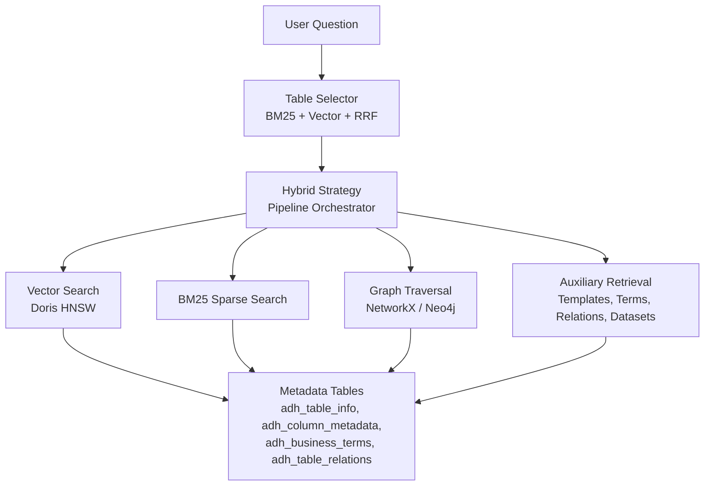

**Diagram sources**
- [hybrid.py:30-128](file://services/datamind/rag/strategies/hybrid.py#L30-L128)
- [table_selector.py:178-249](file://services/datamind/rag/table_selector.py#L178-L249)
- [doris_store.py:32-88](file://services/shared/common/vector/doris_store.py#L32-L88)
- [graph.py:196-331](file://services/datamind/rag/strategies/graph.py#L196-L331)

**Section sources**
- [hybrid.py:1-15](file://services/datamind/rag/strategies/hybrid.py#L1-L15)
- [table_selector.py:1-7](file://services/datamind/rag/table_selector.py#L1-L7)
- [doris_store.py:1-16](file://services/shared/common/vector/doris_store.py#L1-L16)

## Core Components
- BM25 sparse retriever for Chinese metadata with tokenization and IDF scoring
- Vector search integration with Apache Doris using HNSW approximate nearest neighbor search
- RRF fusion to combine BM25 and vector rankings into a unified result set
- Table selector that builds BM25 indexes and performs hybrid retrieval
- Terminology manager that loads synonyms and keywords from business terms with TTL caching
- Strategies that orchestrate retrieval flows and auxiliary data gathering

**Section sources**
- [bm25.py:22-143](file://services/datamind/rag/bm25.py#L22-L143)
- [bm25.py:146-173](file://services/datamind/rag/bm25.py#L146-L173)
- [table_selector.py:39-87](file://services/datamind/rag/table_selector.py#L39-L87)
- [terminology_manager.py:77-138](file://services/datamind/rag/terminology_manager.py#L77-L138)
- [doris_store.py:32-88](file://services/shared/common/vector/doris_store.py#L32-L88)

## Architecture Overview
The pipeline follows a consistent flow:
1. Generate embedding once per query
2. Select tables using BM25 + vector + RRF
3. Retrieve columns based on strategy (full table, two-stage, graph)
4. Parallel retrieval of templates, business terms, relations, and datasets
5. Fallback to information_schema if RAG returns no metadata

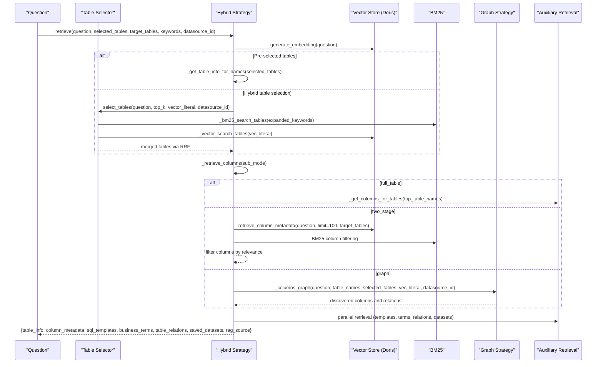

**Diagram sources**
- [hybrid.py:42-128](file://services/datamind/rag/strategies/hybrid.py#L42-L128)
- [table_selector.py:178-249](file://services/datamind/rag/table_selector.py#L178-L249)
- [graph.py:196-331](file://services/datamind/rag/strategies/graph.py#L196-L331)
- [rag_retriever.py:753-786](file://services/datamind/rag/rag_retriever.py#L753-L786)

## Detailed Component Analysis

### BM25 Implementation for Chinese Text Processing
- Tokenization uses jieba with stop word filtering; falls back to regex when jieba is unavailable
- Builds inverted index with per-document term frequencies, document lengths, and global document frequency
- Computes IDF using smoothed formula and scores documents via BM25 TF-IDF with length normalization
- Supports empty corpus and provides is_empty property for safe usage

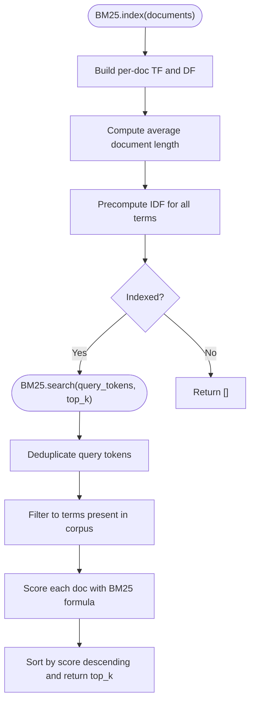

**Diagram sources**
- [bm25.py:43-86](file://services/datamind/rag/bm25.py#L43-L86)
- [bm25.py:88-139](file://services/datamind/rag/bm25.py#L88-L139)

**Section sources**
- [bm25.py:22-143](file://services/datamind/rag/bm25.py#L22-L143)

### Vector Search Integration with Apache Doris Using HNSW Indexing
- Uses Doris native l2_distance_approximate for fast approximate nearest neighbor search
- Provides a clean VectorStore abstraction with filters, output columns, and batch upserts
- Handles datasource scoping via raw SQL filters and supports both direct SQL and abstraction paths

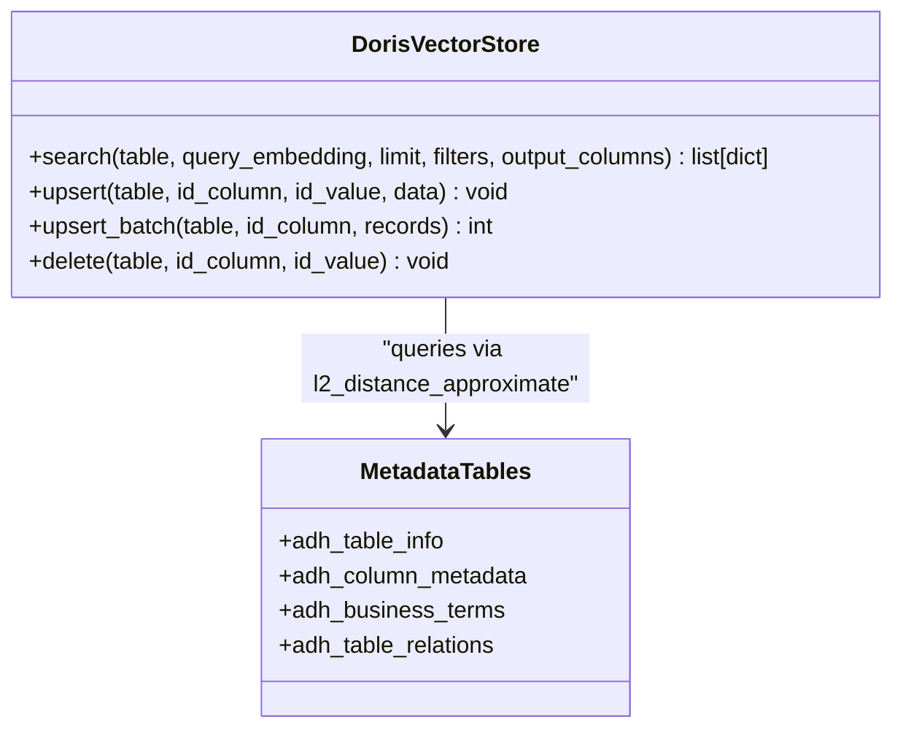

**Diagram sources**
- [doris_store.py:32-88](file://services/shared/common/vector/doris_store.py#L32-L88)
- [rag_retriever.py:105-142](file://services/datamind/rag/rag_retriever.py#L105-L142)

**Section sources**
- [doris_store.py:32-179](file://services/shared/common/vector/doris_store.py#L32-L179)
- [rag_retriever.py:74-142](file://services/datamind/rag/rag_retriever.py#L74-L142)

### RRF (Reciprocal Rank Fusion) for Result Ranking
- Merges multiple ranked lists using weighted reciprocal rank fusion
- Standard k=60 constant balances precision and recall across sources
- Used to combine BM25 and vector rankings for tables and columns

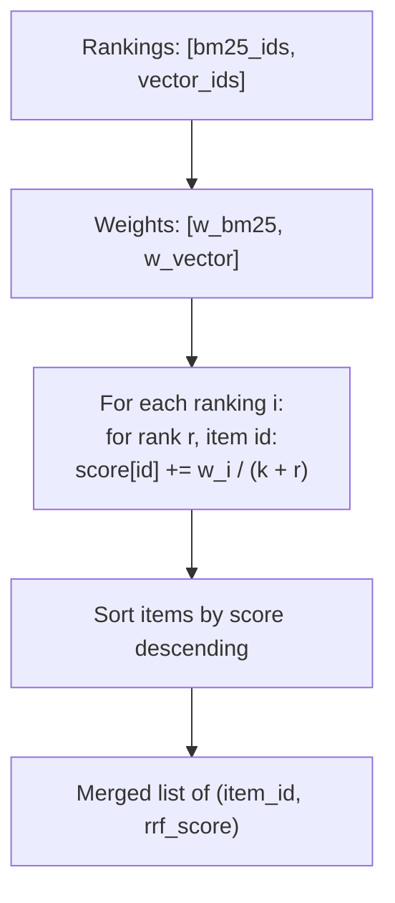

**Diagram sources**
- [bm25.py:146-173](file://services/datamind/rag/bm25.py#L146-L173)

**Section sources**
- [bm25.py:146-173](file://services/datamind/rag/bm25.py#L146-L173)

### Retrieval Strategies

#### Full Table Strategy
- Retrieves tables via vector search or pre-selected names
- Returns ALL columns from matched tables, then filters to key columns if needed
- Pros: comprehensive context; Cons: noisy context with many irrelevant columns

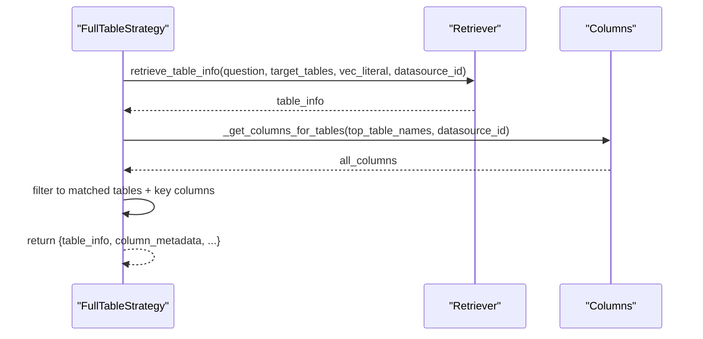

**Diagram sources**
- [full_table.py:20-92](file://services/datamind/rag/strategies/full_table.py#L20-L92)

**Section sources**
- [full_table.py:1-141](file://services/datamind/rag/strategies/full_table.py#L1-L141)

#### Column-First Strategy
- Directly searches columns using BM25 + vector + RRF, then derives parent tables
- Keeps hybrid-matched columns plus key columns for JOIN context
- Pros: precise and less noise; Cons: may miss related columns if embeddings do not match

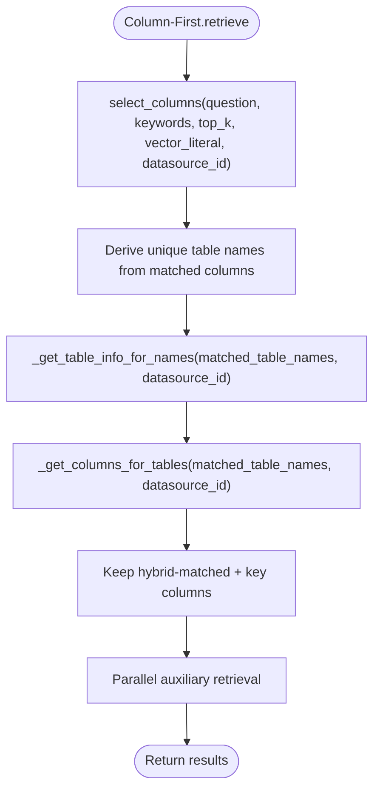

**Diagram sources**
- [column_first.py:20-100](file://services/datamind/rag/strategies/column_first.py#L20-L100)

**Section sources**
- [column_first.py:1-131](file://services/datamind/rag/strategies/column_first.py#L1-L131)

#### Bidirectional Strategy
- Runs table-first and column-first in parallel, then merges results
- Union of table names and columns from both paths ensures high recall
- Pros: best recall; Cons: more context than two-stage

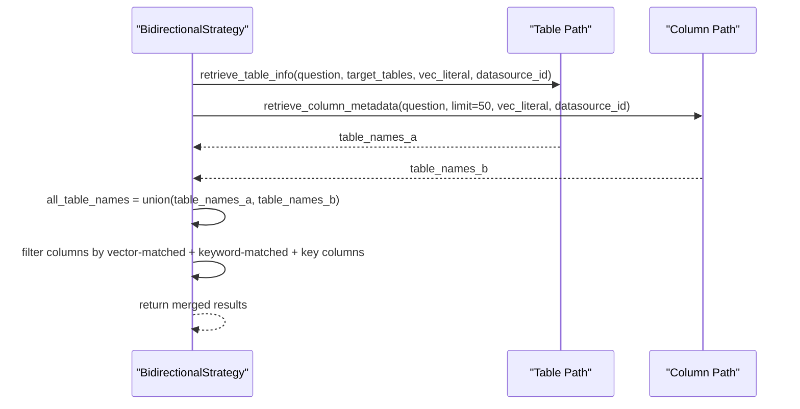

**Diagram sources**
- [bidirectional.py:21-110](file://services/datamind/rag/strategies/bidirectional.py#L21-L110)

**Section sources**
- [bidirectional.py:1-141](file://services/datamind/rag/strategies/bidirectional.py#L1-L141)

#### Graph-Based Strategy
- Builds a NetworkX directed graph from DB metadata (tables, columns, terms, relations)
- Uses vector search to find entry nodes, then ego_graph traversal to expand related metadata
- Only returns columns reached by traversal plus key columns for coverage

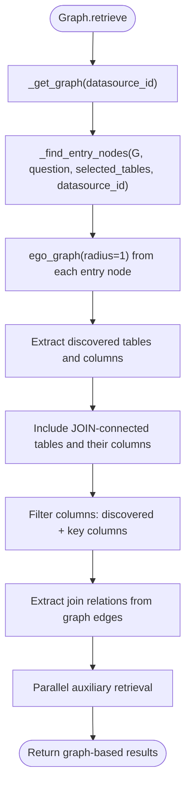

**Diagram sources**
- [graph.py:24-133](file://services/datamind/rag/strategies/graph.py#L24-L133)
- [graph.py:157-193](file://services/datamind/rag/strategies/graph.py#L157-L193)
- [graph.py:196-331](file://services/datamind/rag/strategies/graph.py#L196-L331)

**Section sources**
- [graph.py:1-358](file://services/datamind/rag/strategies/graph.py#L1-L358)

#### Two-Stage Strategy
- Stage 1: coarse table-level vector search
- Stage 2: per-table column filtering using vector and keyword matching
- Balances noise and relevance with fallback to all columns if filtering is too aggressive

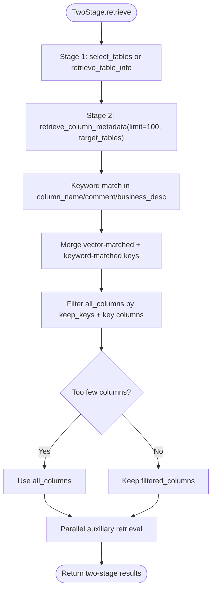

**Diagram sources**
- [two_stage.py:19-126](file://services/datamind/rag/strategies/two_stage.py#L19-L126)

**Section sources**
- [two_stage.py:1-157](file://services/datamind/rag/strategies/two_stage.py#L1-L157)

### Terminology Management for Business Term Recognition and Mapping
- Loads active business terms and table keywords from database with TTL caching (5 minutes)
- Builds synonym map from term_cn, term_en, and term_aliases
- Expands keywords with synonyms to improve BM25 and vector search recall
- Provides functions to get business keywords, all terms, and term mappings for specific tables

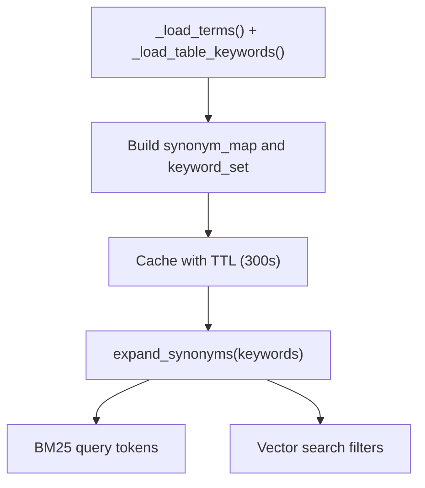

**Diagram sources**
- [terminology_manager.py:32-138](file://services/datamind/rag/terminology_manager.py#L32-L138)
- [terminology_manager.py:146-165](file://services/datamind/rag/terminology_manager.py#L146-L165)

**Section sources**
- [terminology_manager.py:1-185](file://services/datamind/rag/terminology_manager.py#L1-L185)

### Table Selection Algorithms
- Uses jieba tokenization and stop word filtering to extract meaningful keywords
- Builds BM25 index from table_name, comment, business_desc, region_tag, domain_tag
- Combines BM25 and vector search results via RRF to select top-k tables
- Supports datasource scoping and cache invalidation after metadata changes

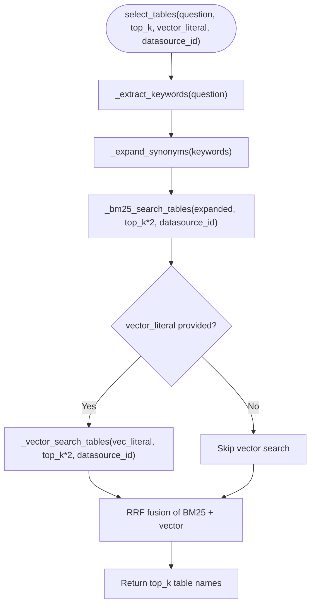

**Diagram sources**
- [table_selector.py:128-152](file://services/datamind/rag/table_selector.py#L128-L152)
- [table_selector.py:155-175](file://services/datamind/rag/table_selector.py#L155-L175)
- [table_selector.py:178-249](file://services/datamind/rag/table_selector.py#L178-L249)

**Section sources**
- [table_selector.py:1-276](file://services/datamind/rag/table_selector.py#L1-L276)

### Context Optimization for LLM Prompts
- Boosts time-related columns from matched tables to ensure temporal context
- Filters sensitive columns to protect PII and confidential data
- Includes SQL templates, business terms, table relations, and saved datasets for richer context
- Falls back to information_schema when RAG tables are empty or vector search fails

**Section sources**
- [rag_retriever.py:149-257](file://services/datamind/rag/rag_retriever.py#L149-L257)
- [rag_retriever.py:492-547](file://services/datamind/rag/rag_retriever.py#L492-L547)
- [rag_retriever.py:550-646](file://services/datamind/rag/rag_retriever.py#L550-L646)
- [rag_retriever.py:649-671](file://services/datamind/rag/rag_retriever.py#L649-L671)
- [rag_retriever.py:753-786](file://services/datamind/rag/rag_retriever.py#L753-L786)

## Dependency Analysis
The RAG pipeline has clear separation between retrieval logic, vector storage, and strategy orchestration:
- BM25 and RRF are core utilities used by table and column selectors
- Vector store abstraction decouples Doris-specific implementation from retrieval logic
- Strategies depend on retrievers and selectors but remain independent of storage details
- Graph strategy depends on NetworkX and optional Neo4j for advanced traversal

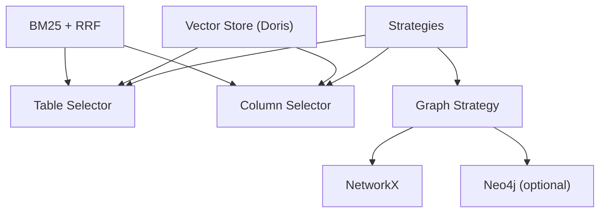

**Diagram sources**
- [bm25.py:22-173](file://services/datamind/rag/bm25.py#L22-L173)
- [table_selector.py:178-249](file://services/datamind/rag/table_selector.py#L178-L249)
- [doris_store.py:32-88](file://services/shared/common/vector/doris_store.py#L32-L88)
- [graph.py:196-331](file://services/datamind/rag/strategies/graph.py#L196-L331)

**Section sources**
- [hybrid.py:30-128](file://services/datamind/rag/strategies/hybrid.py#L30-L128)
- [graph_retriever.py:14-376](file://services/datamind/rag/graph_rag/graph_retriever.py#L14-L376)

## Performance Considerations
- **Embedding reuse**: Generate embedding once per query and pass as vec_literal to avoid redundant calls
- **Caching**: 
  - RAG results cached with LRU (max 128 entries) keyed by question, target tables, keywords, datasource, and strategy
  - BM25 indexes cached per datasource to avoid rebuilding on each query
  - Terminology cache with 5-minute TTL reduces database load
  - Graph cache with 5-minute TTL avoids rebuilding NetworkX graph frequently
- **Parallel retrieval**: Use ThreadPoolExecutor to run auxiliary searches concurrently
- **Fallback mechanisms**: Information schema fallback ensures robustness when RAG tables are empty
- **Sensitive data filtering**: Remove sensitive columns early to reduce context size and protect privacy
- **Time column boosting**: Ensure temporal context is included for better LLM performance

**Section sources**
- [rag_retriever.py:30-40](file://services/datamind/rag/rag_retriever.py#L30-L40)
- [rag_retriever.py:262-320](file://services/datamind/rag/rag_retriever.py#L262-L320)
- [terminology_manager.py:20-24](file://services/datamind/rag/terminology_manager.py#L20-L24)
- [graph.py:18-21](file://services/datamind/rag/strategies/graph.py#L18-L21)
- [rag_retriever.py:769-786](file://services/datamind/rag/rag_retriever.py#L769-L786)

## Troubleshooting Guide
- **Empty RAG results**: Check if RAG tables exist and contain active rows; verify datasource scoping filters
- **Vector search failures**: Verify Doris connection and HNSW index availability; fall back to information_schema
- **BM25 index issues**: Ensure tokenizer is working correctly; check for missing jieba dependency
- **Graph traversal problems**: Validate graph construction and entry node detection; clear graph cache after metadata changes
- **Performance bottlenecks**: Monitor embedding generation latency; consider pre-computing vectors for frequent queries
- **Sensitive data exposure**: Review sensitive column filtering logic; adjust patterns if needed

**Section sources**
- [rag_retriever.py:140-142](file://services/datamind/rag/rag_retriever.py#L140-L142)
- [rag_retriever.py:255-257](file://services/datamind/rag/rag_retriever.py#L255-L257)
- [rag_retriever.py:545-547](file://services/datamind/rag/rag_retriever.py#L545-L547)
- [graph.py:149-154](file://services/datamind/rag/strategies/graph.py#L149-L154)

## Conclusion
AI-DataHub's RAG pipeline provides a robust, flexible, and performant solution for retrieving relevant metadata from complex data catalogs. By combining BM25 sparse search with vector dense search through RRF fusion, it achieves high recall and precision across diverse query types. The modular strategy architecture allows customization for different use cases, while comprehensive caching and fallback mechanisms ensure reliability in production environments. The integration with Apache Doris HNSW indexing enables scalable vector search, and the terminology management system enhances business term recognition and mapping. For optimal performance, tune embedding generation, leverage caching strategies, and monitor retrieval quality through logging and metrics.