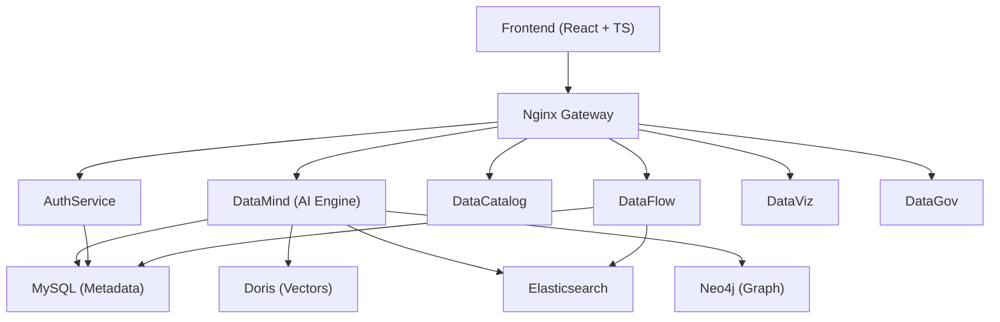
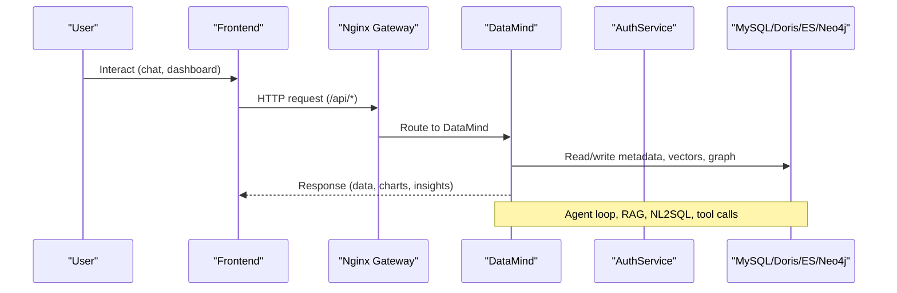
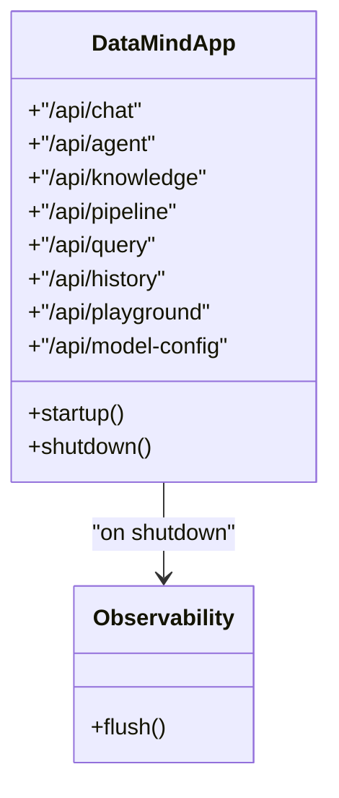
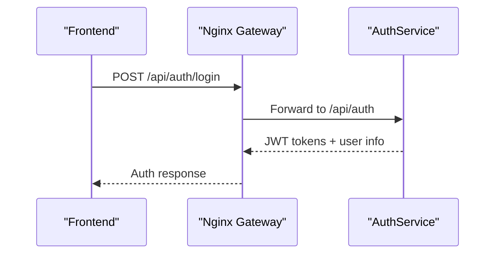
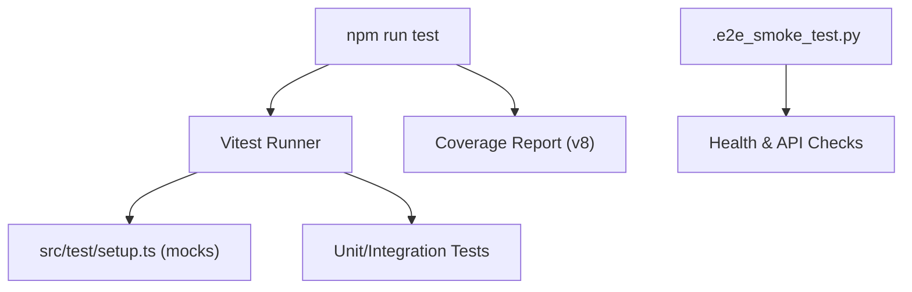
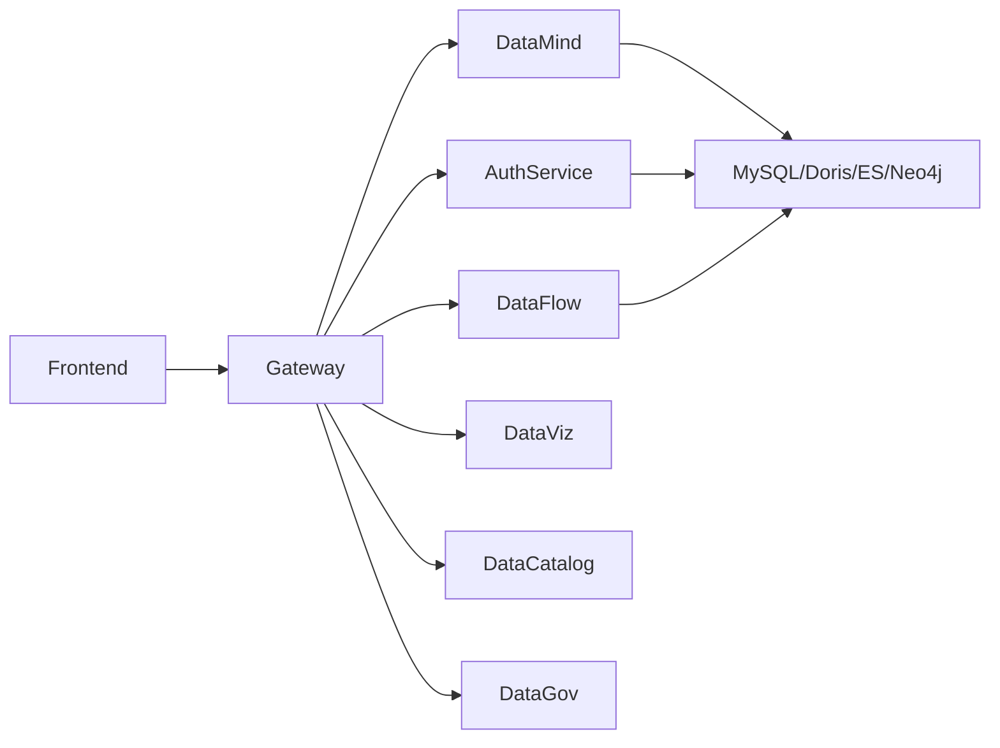

# Developer Guide

<cite>
**Referenced Files in This Document**
- [README.md](file://README.md)
- [docker-compose.yml](file://docker-compose.yml)
- [services/docker-compose.yml](file://services/docker-compose.yml)
- [services/gateway/nginx.conf](file://services/gateway/nginx.conf)
- [services/datamind/main.py](file://services/datamind/main.py)
- [services/authservice/main.py](file://services/authservice/main.py)
- [frontend/package.json](file://frontend/package.json)
- [frontend/vitest.config.ts](file://frontend/vitest.config.ts)
- [frontend/src/test/setup.ts](file://frontend/src/test/setup.ts)
- [frontend/src/stores/authStore.ts](file://frontend/src/stores/authStore.ts)
- [frontend/src/stores/chatStore.ts](file://frontend/src/stores/chatStore.ts)
- [frontend/src/stores/dashboardStore.ts](file://frontend/src/stores/dashboardStore.ts)
- [frontend/sdk/src/chatbi-dashboard.ts](file://frontend/sdk/src/chatbi-dashboard.ts)
- [.e2e_smoke_test.py](file://.e2e_smoke_test.py)
- [GIT_GUIDE.md](file://GIT_GUIDE.md)
</cite>

## Table of Contents
1. Introduction
2. Project Structure
3. Core Components
4. Architecture Overview
5. Detailed Component Analysis
6. Dependency Analysis
7. Performance Considerations
8. Troubleshooting Guide
9. Conclusion
10. Appendices

## Introduction
This guide explains how to contribute to AI-DataHub, a multi-agent natural language business intelligence platform. It covers the frontend React application with TypeScript, backend microservices architecture, shared utilities, development environment setup, coding standards, testing strategies, state management with Zustand, debugging and logging, performance profiling, contribution workflows, CI/CD, and release procedures.

## Project Structure
AI-DataHub is organized into:
- Frontend: React 18 + TypeScript + Vite + Tailwind CSS + Zustand for state management. Unit tests use Vitest with jsdom.
- Backend microservices: FastAPI services under services/ (datamind, authservice, datacatalog, dataflow, dataviz, datagov), plus shared libraries under services/shared/.
- Infrastructure: Docker Compose orchestrates services, Redis, Neo4j, and an Nginx gateway routing API paths to microservices.
- Shared utilities: Common modules for caching, database access, LLM clients, vector stores, MCP client, and models.



**Diagram sources**
- [services/docker-compose.yml:38-206](file://services/docker-compose.yml#L38-L206)
- [services/gateway/nginx.conf:145-182](file://services/gateway/nginx.conf#L145-L182)
- [docker-compose.yml:3-41](file://docker-compose.yml#L3-L41)

**Section sources**
- [README.md:28-66](file://README.md#L28-L66)
- [services/docker-compose.yml:38-206](file://services/docker-compose.yml#L38-L206)
- [docker-compose.yml:3-41](file://docker-compose.yml#L3-L41)

## Core Components
- DataMind (AI Engine): Exposes NL2SQL, agent orchestration, RAG, knowledge base, pipeline execution, query, history, playground, and model config endpoints. Initializes agent registry on startup and flushes observability events on shutdown.
- AuthService: Handles authentication, users, workspaces, roles, and audit logs.
- Gateway: Nginx routes /api/* paths to appropriate microservices.
- Frontend: UI pages, components, stores (Zustand), API clients, SDK for embedding dashboards and chat widgets.

Key entry points:
- DataMind: services/datamind/main.py
- AuthService: services/authservice/main.py
- Gateway: services/gateway/nginx.conf
- Frontend app: frontend/package.json scripts and vite configuration

**Section sources**
- [services/datamind/main.py:1-98](file://services/datamind/main.py#L1-L98)
- [services/authservice/main.py:1-71](file://services/authservice/main.py#L1-L71)
- [services/gateway/nginx.conf:145-182](file://services/gateway/nginx.conf#L145-L182)
- [frontend/package.json:1-1](file://frontend/package.json#L1-L1)

## Architecture Overview
The system follows a layered microservices architecture:
- Frontend communicates via REST APIs through an Nginx gateway.
- Services are independently deployable and share common infrastructure (Redis, MySQL, Doris, Neo4j, Elasticsearch).
- DataMind coordinates multi-agent workflows, RAG retrieval, and SQL generation/execution.
- AuthService manages identity, authorization, and workspace scoping.
- DataFlow handles scheduled tasks and integrations.
- DataViz provides dashboard and charting capabilities.
- DataCatalog exposes metadata, glossary, lineage, and tags.
- DataGov offers governance features like quality and security.



**Diagram sources**
- [services/gateway/nginx.conf:145-182](file://services/gateway/nginx.conf#L145-L182)
- [services/datamind/main.py:55-63](file://services/datamind/main.py#L55-L63)
- [services/docker-compose.yml:38-206](file://services/docker-compose.yml#L38-L206)

## Detailed Component Analysis

### DataMind Microservice (AI Engine)
Responsibilities:
- Exposes REST endpoints for chat, agent dispatch, knowledge, pipeline, query, history, playground, and model config.
- Initializes agent registry at startup; flushes Langfuse events on shutdown.
- Uses CORS middleware and structured logging.



**Diagram sources**
- [services/datamind/main.py:55-98](file://services/datamind/main.py#L55-L98)

**Section sources**
- [services/datamind/main.py:1-98](file://services/datamind/main.py#L1-L98)

### AuthService Microservice
Responsibilities:
- Authentication, user management, workspaces, roles, audit logging.
- Configured with lifespan hooks and CORS.



**Diagram sources**
- [services/authservice/main.py:29-58](file://services/authservice/main.py#L29-L58)
- [services/gateway/nginx.conf:145-182](file://services/gateway/nginx.conf#L145-L182)

**Section sources**
- [services/authservice/main.py:1-71](file://services/authservice/main.py#L1-L71)

### Frontend State Management (Zustand)
- Stores encapsulate domain state and actions:
  - authStore: login/logout, token persistence, user profile updates.
  - chatStore: conversations, messages, datasource/model selection, conversation lifecycle.
  - dashboardStore: dashboard and chart definitions, parameters, status.
- API client abstracts HTTP calls; stores call backend endpoints.

```mermaid
flowchart TD
Start(["User Action"]) --> StoreAction["Zustand Store Action"]
StoreAction --> APICall["HTTP Request via client"]
APICall --> Backend{"Service?"}
Backend --> |Auth| ASvc["AuthService"]
Backend --> |Chat| Dm["DataMind"]
Backend --> |Dashboard| Dv["DataViz"]
ASvc --> >StoreAction["Update state (token/user)"]
Dm --> >StoreAction["Update state (messages/conversations)"]
Dv --> >StoreAction["Update state (dashboards/charts)"]
```

**Diagram sources**
- [frontend/src/stores/authStore.ts:18-42](file://frontend/src/stores/authStore.ts#L18-L42)
- [frontend/src/stores/chatStore.ts:317-349](file://frontend/src/stores/chatStore.ts#L317-L349)
- [frontend/src/stores/dashboardStore.ts:1-55](file://frontend/src/stores/dashboardStore.ts#L1-L55)

**Section sources**
- [frontend/src/stores/authStore.ts:1-43](file://frontend/src/stores/authStore.ts#L1-L43)
- [frontend/src/stores/chatStore.ts:317-349](file://frontend/src/stores/chatStore.ts#L317-L349)
- [frontend/src/stores/dashboardStore.ts:1-55](file://frontend/src/stores/dashboardStore.ts#L1-L55)

### Testing Strategy
- Unit tests: Vitest with jsdom environment, global setup mocks localStorage and browser APIs.
- E2E smoke test: Python script validates key API endpoints across services.



**Diagram sources**
- [frontend/vitest.config.ts:1-21](file://frontend/vitest.config.ts#L1-L21)
- [frontend/src/test/setup.ts:1-67](file://frontend/src/test/setup.ts#L1-L67)
- [.e2e_smoke_test.py:39-69](file://.e2e_smoke_test.py#L39-L69)

**Section sources**
- [frontend/vitest.config.ts:1-21](file://frontend/vitest.config.ts#L1-L21)
- [frontend/src/test/setup.ts:1-67](file://frontend/src/test/setup.ts#L1-L67)
- [.e2e_smoke_test.py:39-69](file://.e2e_smoke_test.py#L39-L69)

### Extending Functionality

#### Adding a New Agent
- Create a new agent directory under services/datamind/config/agents/<agent_name>/ with skill.yaml and system.md.
- Restart DataMind to auto-discover the agent.
- Configure route patterns and capabilities in skill.yaml; define behavior in system.md.

**Section sources**
- [README.md:506-519](file://README.md#L506-L519)

#### Creating Custom Connectors
- Add connector implementations under services/shared/connectors/ or within service-specific connectors directories.
- Use shared db and cache utilities for consistent access patterns.

**Section sources**
- [services/shared/connectors/es_connector.py:1-200](file://services/shared/connectors/es_connector.py#L1-L200)

#### Building Plugins
- Leverage MCP (Model Context Protocol) client under services/shared/mcp_client/ to integrate external tools.
- Register tools and invoke them from agents or pipelines.

**Section sources**
- [services/shared/mcp_client/client.py:1-200](file://services/shared/mcp_client/client.py#L1-L200)
- [services/shared/mcp_client/tools.py:1-200](file://services/shared/mcp_client/tools.py#L1-L200)

#### Integrating External Tools
- Use MCP servers discovered via MCP Market; configure in admin UI and reference in agent skills.
- Validate connectivity and permissions before enabling in production.

**Section sources**
- [README.md:232-238](file://README.md#L232-L238)

### Debugging Techniques and Logging Strategies
- Backend logging: Structured logging configured per service; set LOG_LEVEL via environment variables.
- Observability: Langfuse integration for tracing LLM calls, token usage, and cost monitoring.
- Frontend debugging: Use browser devtools; Zustand devtools recommended for store inspection.

**Section sources**
- [services/datamind/main.py:19-26](file://services/datamind/main.py#L19-L26)
- [services/datamind/main.py:89-98](file://services/datamind/main.py#L89-L98)
- [README.md:217-220](file://README.md#L217-L220)

### Performance Profiling Tools
- Frontend: Consider adding web-vitals for performance metrics (FCP, LCP, CLS).
- Backend: Profile LLM calls via Langfuse; monitor service health endpoints.
- Database: Use Doris and MySQL query logs; leverage vector search performance tuning.

**Section sources**
- [frontend/FRONTEND_ANALYSIS.md:216-220](file://frontend/FRONTEND_ANALYSIS.md#L216-L220)
- [services/datamind/main.py:89-98](file://services/datamind/main.py#L89-L98)

## Dependency Analysis
Services communicate via HTTP through Nginx; shared dependencies include databases and caches.



**Diagram sources**
- [services/docker-compose.yml:38-206](file://services/docker-compose.yml#L38-L206)
- [services/gateway/nginx.conf:145-182](file://services/gateway/nginx.conf#L145-L182)

**Section sources**
- [services/docker-compose.yml:38-206](file://services/docker-compose.yml#L38-L206)
- [services/gateway/nginx.conf:145-182](file://services/gateway/nginx.conf#L145-L182)

## Performance Considerations
- Frontend:
  - Introduce code splitting with React.lazy/Suspense for large pages.
  - Use React Query or SWR for caching, retries, and background updates.
  - Optimize build with manualChunks and asset optimization.
- Backend:
  - Pre-warm agent registry on startup to reduce cold start latency.
  - Use connection pooling for databases and caches.
  - Monitor LLM token usage and costs via Langfuse.
- Infrastructure:
  - Scale services horizontally behind Nginx.
  - Tune vector search indexes and BM25 parameters.

[No sources needed since this section provides general guidance]

## Troubleshooting Guide
Common issues and resolutions:
- Service health checks: Verify /health endpoints for each service.
- Gateway routing: Ensure Nginx location blocks map correctly to service ports.
- Frontend tests: Confirm jsdom setup and mocks for localStorage and browser APIs.
- E2E smoke tests: Run .e2e_smoke_test.py to validate critical API paths.

**Section sources**
- [docker-compose.yml:21-26](file://docker-compose.yml#L21-L26)
- [services/gateway/nginx.conf:145-182](file://services/gateway/nginx.conf#L145-L182)
- [frontend/src/test/setup.ts:1-67](file://frontend/src/test/setup.ts#L1-L67)
- [.e2e_smoke_test.py:39-69](file://.e2e_smoke_test.py#L39-L69)

## Conclusion
AI-DataHub provides a robust, extensible platform for natural language BI with a clear separation of concerns across frontend, microservices, and shared utilities. By following the guidelines in this document, contributors can confidently add agents, connectors, plugins, and integrations while maintaining high quality through testing, observability, and performance best practices.

[No sources needed since this section summarizes without analyzing specific files]

## Appendices

### Development Environment Setup
- Local stack:
  - Start all services using Docker Compose in services/.
  - Configure environment variables for databases, LLM providers, and observability.
- Frontend development:
  - Install dependencies and run dev server.
  - Use Vitest for unit tests and coverage.

**Section sources**
- [services/docker-compose.yml:1-37](file://services/docker-compose.yml#L1-L37)
- [frontend/package.json:1-1](file://frontend/package.json#L1-L1)
- [frontend/vitest.config.ts:1-21](file://frontend/vitest.config.ts#L1-L21)

### Coding Standards and Contribution Workflow
- Branching and commits:
  - Follow conventional commit types (feat, fix, docs, style, refactor, test, chore).
  - Create feature branches and merge via pull requests.
- Code review:
  - Ensure tests pass locally and in CI.
  - Review for readability, performance, and security implications.
- Documentation:
  - Update README and inline comments where necessary.
  - Keep API contracts and configurations up to date.

**Section sources**
- [GIT_GUIDE.md:174-193](file://GIT_GUIDE.md#L174-L193)

### CI/CD Pipeline and Release Procedures
- CI:
  - Run Vitest unit tests and coverage reports.
  - Execute E2E smoke tests against deployed services.
- Release:
  - Tag versions and publish images via Docker Compose builds.
  - Validate health endpoints and perform rollback plans if needed.

[No sources needed since this section provides general guidance]

### SDK Integration Example
Embedding dashboards and chat widgets via the frontend SDK:
- Use chatbi-dashboard to render dashboards within shadow DOM.
- Handle errors gracefully and provide fallback UI.

**Section sources**
- [frontend/sdk/src/chatbi-dashboard.ts:105-167](file://frontend/sdk/src/chatbi-dashboard.ts#L105-L167)