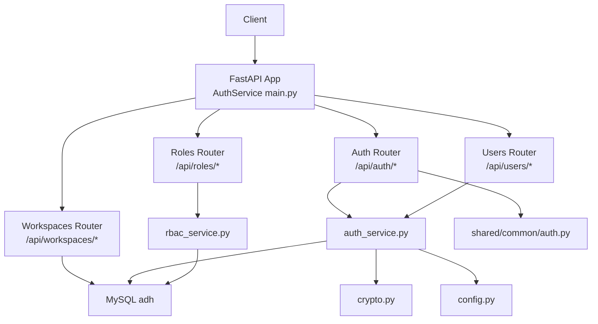
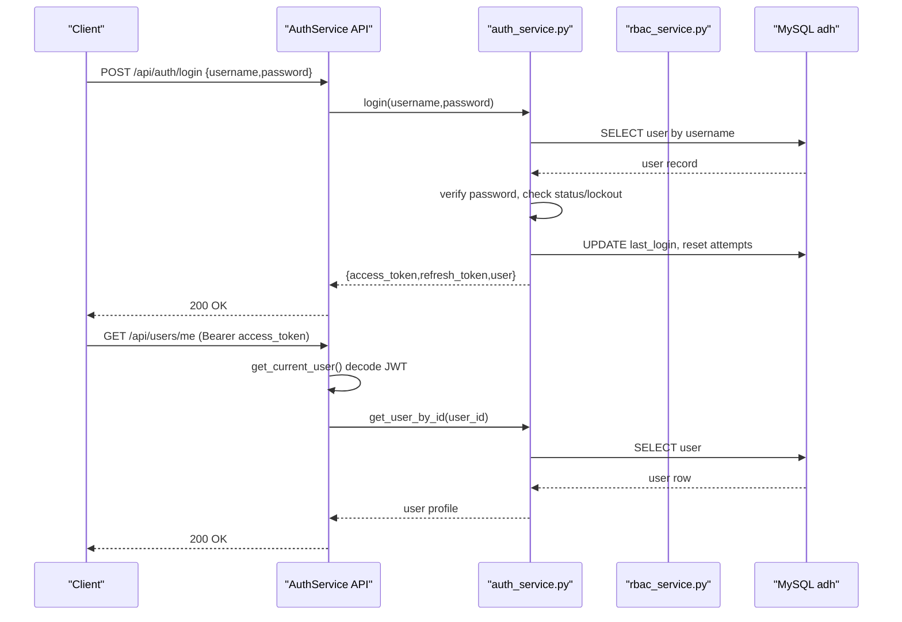
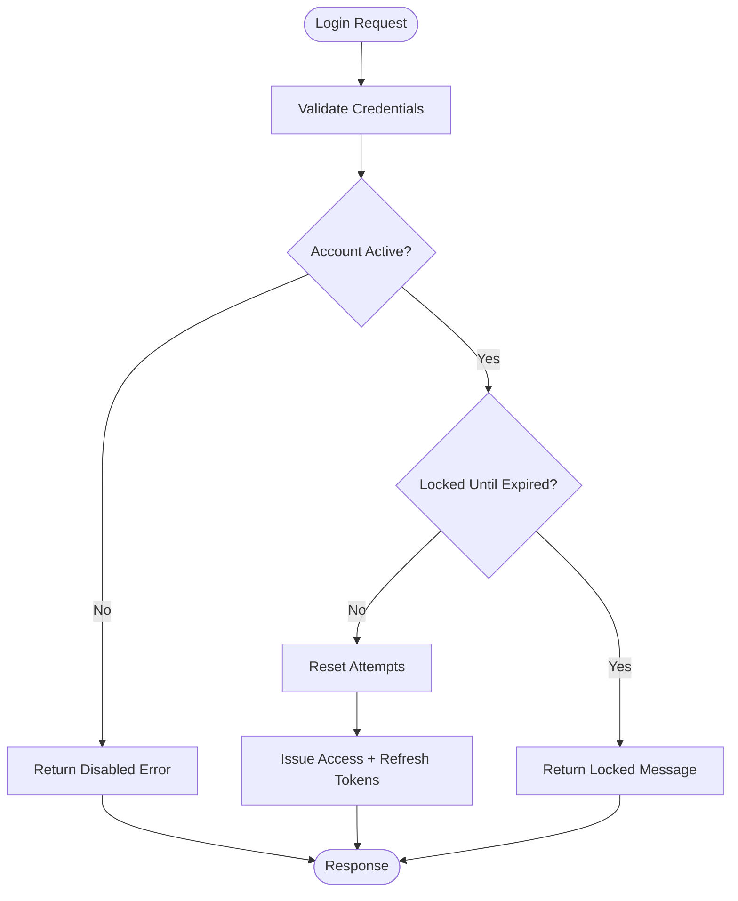
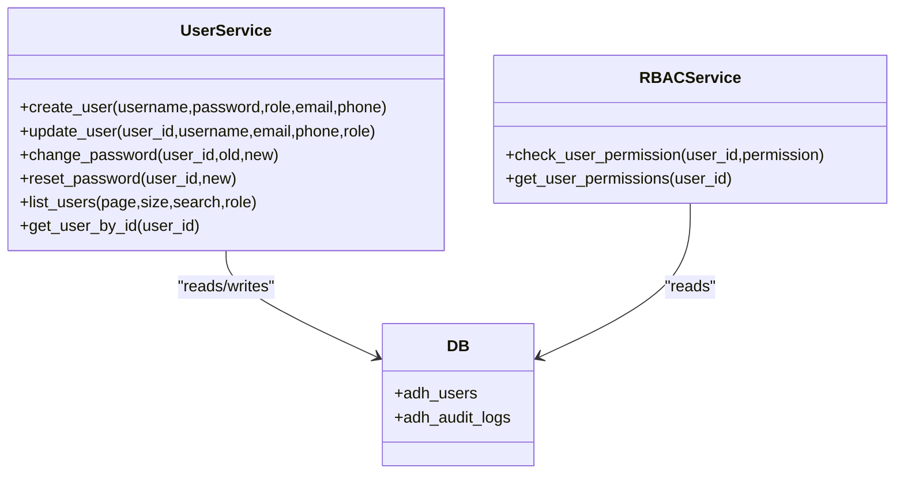
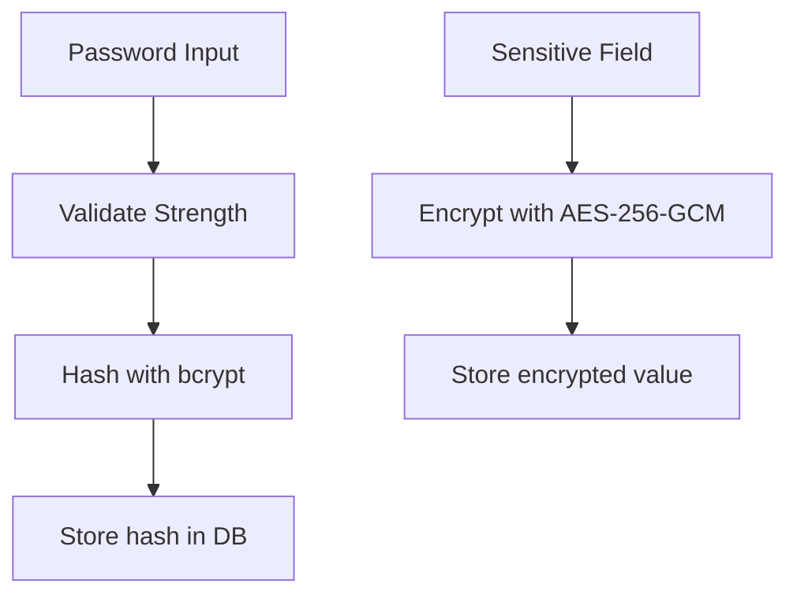
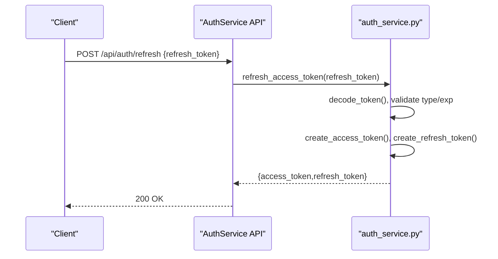
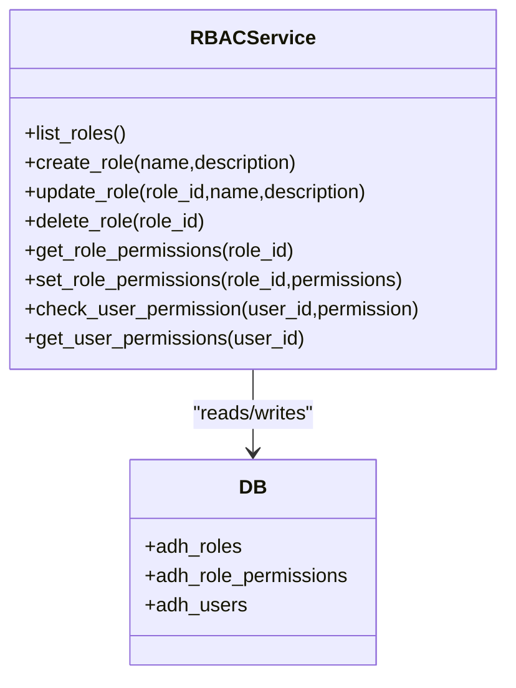
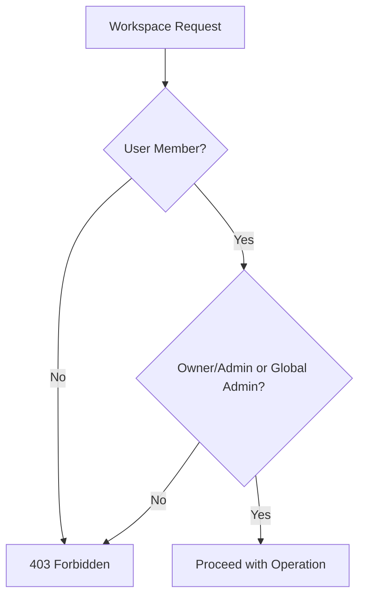
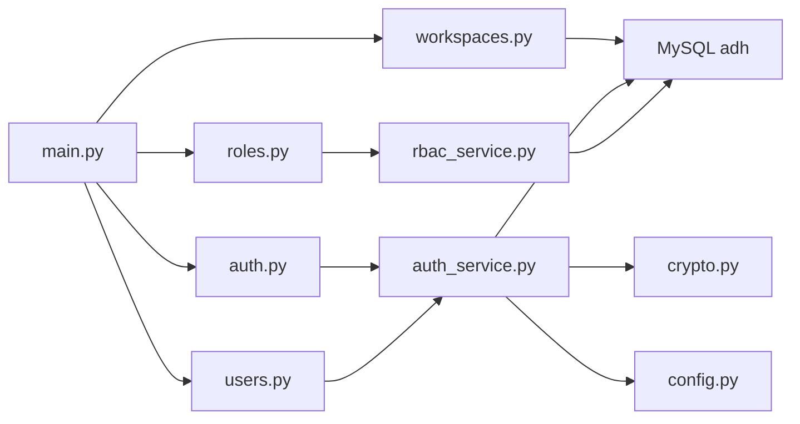

# Authentication & Authorization

<cite>
**Referenced Files in This Document**
- [main.py](file://services/authservice/main.py)
- [auth.py](file://services/authservice/api/auth.py)
- [users.py](file://services/authservice/api/users.py)
- [roles.py](file://services/authservice/api/roles.py)
- [workspaces.py](file://services/authservice/api/workspaces.py)
- [auth_service.py](file://services/authservice/services/auth_service.py)
- [rbac_service.py](file://services/authservice/services/rbac_service.py)
- [auth.py](file://services/shared/common/auth.py)
- [crypto.py](file://services/shared/common/crypto.py)
- [config.py](file://services/shared/common/config.py)
- [001_data_platform_tables.sql](file://services/shared/migrations/001_data_platform_tables.sql)
- [role_migration.sql](file://services/shared/migrations/role_migration.sql)
- [role_permission_migration.sql](file://services/shared/migrations/role_permission_migration.sql)
- [workspace_migration_v2.sql](file://docker/mysql/workspace_migration_v2.sql)
</cite>

## Table of Contents
1. Introduction
2. Project Structure
3. Core Components
4. Architecture Overview
5. Detailed Component Analysis
6. Dependency Analysis
7. Performance Considerations
8. Troubleshooting Guide
9. Conclusion
10. Appendices

## Introduction
This document explains AI-DataHub’s authentication and authorization system with a focus on:
- JWT-based authentication flow (login, refresh, logout)
- User registration and login processes
- Password security measures
- Session management via stateless JWT tokens
- Role-based access control (RBAC): roles, permissions, dynamic evaluation
- Workspace-level permissions and resource isolation
- API endpoints for authentication, user management, and role administration
- Security best practices and token refresh mechanisms
- Integration notes for external identity providers

## Project Structure
The authentication and authorization functionality is implemented in the authservice microservice and shared utilities:
- FastAPI application entrypoint registers routers for auth, users, workspaces, roles, and audit
- API routes define request/response contracts
- Services implement business logic for authentication, RBAC, and workspace membership
- Shared modules provide JWT validation, password hashing, encryption, and configuration
- Database migrations define schema for users, roles, permissions, and workspaces

**Diagram sources**
- [main.py:1-71](file://services/authservice/main.py#L1-L71)
- [auth.py:1-52](file://services/authservice/api/auth.py#L1-L52)
- [users.py:1-167](file://services/authservice/api/users.py#L1-L167)
- [roles.py:1-83](file://services/authservice/api/roles.py#L1-L83)
- [workspaces.py:1-464](file://services/authservice/api/workspaces.py#L1-L464)
- [auth_service.py:1-625](file://services/authservice/services/auth_service.py#L1-L625)
- [rbac_service.py:1-275](file://services/authservice/services/rbac_service.py#L1-L275)
- [auth.py:1-630](file://services/shared/common/auth.py#L1-L630)
- [crypto.py:1-76](file://services/shared/common/crypto.py#L1-L76)
- [config.py:1-163](file://services/shared/common/config.py#L1-L163)

**Section sources**
- [main.py:1-71](file://services/authservice/main.py#L1-L71)
- [config.py:1-163](file://services/shared/common/config.py#L1-L163)

## Core Components
- JWT Token Management: creation, decoding, expiration handling
- Authentication: username/password verification, lockout policy, audit logging
- User Management: create, update, change/reset password, status management, list/delete
- RBAC: roles CRUD, permission assignment, dynamic permission checks
- Workspace Management: membership, default selection, resource binding (datasources, MCP servers, agents)
- Security: bcrypt password hashing, AES-256-GCM encryption for sensitive fields, secret key management

**Section sources**
- [auth_service.py:22-114](file://services/authservice/services/auth_service.py#L22-L114)
- [auth_service.py:126-224](file://services/authservice/services/auth_service.py#L126-L224)
- [auth_service.py:306-571](file://services/authservice/services/auth_service.py#L306-L571)
- [rbac_service.py:27-275](file://services/authservice/services/rbac_service.py#L27-L275)
- [workspaces.py:40-464](file://services/authservice/api/workspaces.py#L40-L464)
- [crypto.py:15-76](file://services/shared/common/crypto.py#L15-L76)
- [config.py:76-82](file://services/shared/common/config.py#L76-L82)

## Architecture Overview
The system uses stateless JWTs for authentication and database-backed RBAC for authorization. Requests are validated by FastAPI dependencies that decode tokens and extract user context. Business logic resides in services that interact with MySQL to enforce permissions and workspace boundaries.

**Diagram sources**
- [auth.py:21-41](file://services/authservice/api/auth.py#L21-L41)
- [auth_service.py:126-224](file://services/authservice/services/auth_service.py#L126-L224)
- [auth.py:58-85](file://services/shared/common/auth.py#L58-L85)

**Section sources**
- [auth.py:21-41](file://services/authservice/api/auth.py#L21-L41)
- [auth_service.py:126-224](file://services/authservice/services/auth_service.py#L126-L224)
- [auth.py:58-85](file://services/shared/common/auth.py#L58-L85)

## Detailed Component Analysis

### JWT-Based Authentication Flow
- Login endpoint validates credentials, enforces account status and lockout, updates last login, and issues access and refresh tokens
- Refresh endpoint exchanges a valid refresh token for new token pair after verifying user existence and active status
- Logout endpoint is a no-op due to stateless tokens; clients should discard tokens locally

**Diagram sources**
- [auth_service.py:126-193](file://services/authservice/services/auth_service.py#L126-L193)
- [auth_service.py:196-224](file://services/authservice/services/auth_service.py#L196-L224)

**Section sources**
- [auth.py:21-51](file://services/authservice/api/auth.py#L21-L51)
- [auth_service.py:126-224](file://services/authservice/services/auth_service.py#L126-L224)

### User Registration and Login Processes
- Create user: validates password strength, hashes password, encrypts email/phone, ensures uniqueness, auto-adds to default workspace
- Update user: validates changes, encrypts sensitive fields, prevents duplicate usernames/emails
- Change/reset password: validates strength, verifies old password for self-change, resets attempts on admin reset
- List users: pagination and filtering by search and role; encrypted fields decrypted on read

**Diagram sources**
- [auth_service.py:306-571](file://services/authservice/services/auth_service.py#L306-L571)
- [rbac_service.py:220-275](file://services/authservice/services/rbac_service.py#L220-L275)

**Section sources**
- [users.py:14-167](file://services/authservice/api/users.py#L14-L167)
- [auth_service.py:306-571](file://services/authservice/services/auth_service.py#L306-L571)

### Password Security Measures
- Password hashing: bcrypt with salted rounds
- Strength validation: minimum length, must include letters and digits
- Sensitive field encryption: AES-256-GCM for email/phone using derived key from ADH_SECRET_KEY
- Audit logging: log actions like password changes and resets

**Diagram sources**
- [auth_service.py:72-90](file://services/authservice/services/auth_service.py#L72-L90)
- [crypto.py:20-60](file://services/shared/common/crypto.py#L20-L60)

**Section sources**
- [auth_service.py:72-90](file://services/authservice/services/auth_service.py#L72-L90)
- [crypto.py:20-60](file://services/shared/common/crypto.py#L20-L60)

### Session Management
- Stateless sessions via JWT access tokens (24h expiry) and refresh tokens (7d expiry)
- Token payload includes user identity and role; expiration enforced during decode
- Clients store tokens securely and use refresh endpoint to obtain new tokens when needed

**Diagram sources**
- [auth_service.py:95-114](file://services/authservice/services/auth_service.py#L95-L114)
- [auth_service.py:196-224](file://services/authservice/services/auth_service.py#L196-L224)

**Section sources**
- [auth_service.py:95-114](file://services/authservice/services/auth_service.py#L95-L114)
- [auth_service.py:196-224](file://services/authservice/services/auth_service.py#L196-L224)

### Role-Based Access Control (RBAC)
- Roles: CRUD operations for roles; system roles cannot be modified/deleted
- Permissions: stored as resource:action strings; assigned to roles via role-permission associations
- Dynamic evaluation: check_user_permission grants all permissions to admin users; otherwise queries role permissions
- Permission inheritance: not explicitly hierarchical; admins bypass checks; other users rely on role mappings

**Diagram sources**
- [rbac_service.py:27-275](file://services/authservice/services/rbac_service.py#L27-L275)

**Section sources**
- [roles.py:14-83](file://services/authservice/api/roles.py#L14-L83)
- [rbac_service.py:27-275](file://services/authservice/services/rbac_service.py#L27-L275)

### Workspace-Level Permissions and Resource Isolation
- Workspaces isolate resources such as datasources, MCP servers, and agents
- Membership model: users belong to workspaces with roles (member, admin, owner); default workspace assignment on user creation
- Cross-workspace access: requires explicit membership or global admin role; endpoints enforce membership checks before operations
- Default workspace: users can set a default workspace; created users are added to default workspace automatically

**Diagram sources**
- [workspaces.py:96-148](file://services/authservice/api/workspaces.py#L96-L148)
- [workspaces.py:204-243](file://services/authservice/api/workspaces.py#L204-L243)
- [workspaces.py:246-282](file://services/authservice/api/workspaces.py#L246-L282)

**Section sources**
- [workspaces.py:40-464](file://services/authservice/api/workspaces.py#L40-L464)
- [workspace_migration_v2.sql:9-38](file://docker/mysql/workspace_migration_v2.sql#L9-L38)

### API Endpoints Summary
- Authentication
  - POST /api/auth/login: authenticate and return token pair
  - POST /api/auth/refresh: exchange refresh token for new tokens
  - POST /api/auth/logout: client-side token discard
- User Management
  - GET /api/users/me: current user profile
  - PUT /api/users/me: update current user profile
  - PUT /api/users/me/password: change own password
  - GET /api/users/: list users (admin)
  - POST /api/users/: create user (admin)
  - PUT /api/users/{user_id}: update user (admin)
  - PUT /api/users/{user_id}/password: reset password (admin)
  - PUT /api/users/{user_id}/status: enable/disable user (admin)
  - DELETE /api/users/{user_id}: delete user (admin)
- Role Administration
  - GET /api/roles/: list roles
  - POST /api/roles/: create role (admin)
  - PUT /api/roles/{role_id}: update role (admin)
  - DELETE /api/roles/{role_id}: delete role (admin)
  - GET /api/roles/{role_id}/permissions: get role permissions
  - PUT /api/roles/{role_id}/permissions: set role permissions (admin)
- Workspace Management
  - GET /api/workspaces/: list workspaces for current user
  - POST /api/workspaces/: create workspace (current user becomes owner)
  - PUT /api/workspaces/{workspace_id}: update workspace (owner/admin/global admin)
  - DELETE /api/workspaces/{workspace_id}: delete workspace (admin)
  - GET /api/workspaces/{workspace_id}/users: list workspace users
  - POST /api/workspaces/{workspace_id}/users: add user to workspace (owner/admin/global admin)
  - DELETE /api/workspaces/{workspace_id}/users/{target_user_id}: remove user (owner/admin/global admin)
  - POST /api/workspaces/{workspace_id}/set-default: set default workspace
  - GET /api/workspaces/{workspace_id}/tools: list bound datasources, MCP servers, agents

Note: Request/response structures are defined by Pydantic models in the respective API files.

**Section sources**
- [auth.py:12-41](file://services/authservice/api/auth.py#L12-L41)
- [users.py:14-167](file://services/authservice/api/users.py#L14-L167)
- [roles.py:14-83](file://services/authservice/api/roles.py#L14-L83)
- [workspaces.py:19-464](file://services/authservice/api/workspaces.py#L19-L464)

## Dependency Analysis
- FastAPI app wires routers to prefixes and tags
- API routes depend on shared auth dependencies for JWT validation and admin enforcement
- Services depend on database connections and crypto utilities
- Migrations define schema for roles, permissions, and workspaces used by services

**Diagram sources**
- [main.py:19-58](file://services/authservice/main.py#L19-L58)
- [auth.py:1-52](file://services/authservice/api/auth.py#L1-L52)
- [users.py:1-167](file://services/authservice/api/users.py#L1-L167)
- [roles.py:1-83](file://services/authservice/api/roles.py#L1-L83)
- [workspaces.py:1-464](file://services/authservice/api/workspaces.py#L1-L464)
- [auth_service.py:1-625](file://services/authservice/services/auth_service.py#L1-L625)
- [rbac_service.py:1-275](file://services/authservice/services/rbac_service.py#L1-L275)
- [crypto.py:1-76](file://services/shared/common/crypto.py#L1-L76)
- [config.py:1-163](file://services/shared/common/config.py#L1-L163)

**Section sources**
- [main.py:19-58](file://services/authservice/main.py#L19-L58)
- [auth_service.py:1-625](file://services/authservice/services/auth_service.py#L1-L625)
- [rbac_service.py:1-275](file://services/authservice/services/rbac_service.py#L1-L275)

## Performance Considerations
- JWT decoding is lightweight and stateless; avoid per-request DB lookups for user identity beyond initial decode
- Use pagination and filters for user listing to reduce payload size
- Encrypt/decrypt sensitive fields only when necessary; cache decrypted values at session scope if appropriate
- Ensure indexes exist on frequently queried columns (e.g., workspace_id, user_id) as defined in migrations

[No sources needed since this section provides general guidance]

## Troubleshooting Guide
- Invalid or expired tokens: ensure correct Bearer token and refresh before expiry; handle 401 responses appropriately
- Account locked: check lockout duration and retry after timeout; verify login attempt counters
- Permission denied: confirm user role and workspace membership; verify role permissions assignment
- Encryption errors: validate ADH_SECRET_KEY configuration; ensure encrypted fields are correctly formatted

**Section sources**
- [auth.py:58-85](file://services/shared/common/auth.py#L58-L85)
- [auth_service.py:229-275](file://services/authservice/services/auth_service.py#L229-L275)
- [rbac_service.py:220-275](file://services/authservice/services/rbac_service.py#L220-L275)
- [crypto.py:20-60](file://services/shared/common/crypto.py#L20-L60)

## Conclusion
AI-DataHub implements a robust, stateless JWT authentication system backed by database-driven RBAC and workspace isolation. The design emphasizes secure password handling, clear separation of concerns between API routes and services, and granular access controls through roles and workspace memberships. For production deployments, consider integrating external identity providers and implementing token revocation lists for enhanced security.

[No sources needed since this section summarizes without analyzing specific files]

## Appendices

### Database Schema Highlights
- Users and audit logs: user identities, roles, statuses, and action logs
- Roles and permissions: role definitions, permission assignments, and data access scopes
- Workspaces: isolation boundaries with membership and resource bindings

**Section sources**
- [001_data_platform_tables.sql:290-386](file://services/shared/migrations/001_data_platform_tables.sql#L290-L386)
- [role_migration.sql:8-59](file://services/shared/migrations/role_migration.sql#L8-L59)
- [role_permission_migration.sql:8-44](file://services/shared/migrations/role_permission_migration.sql#L8-L44)
- [workspace_migration_v2.sql:9-159](file://docker/mysql/workspace_migration_v2.sql#L9-L159)