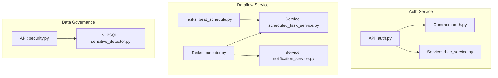
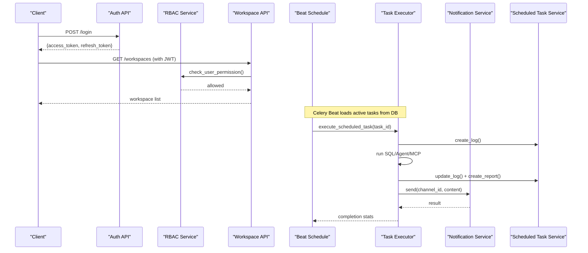
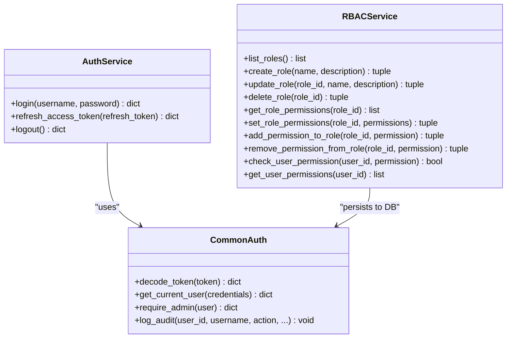
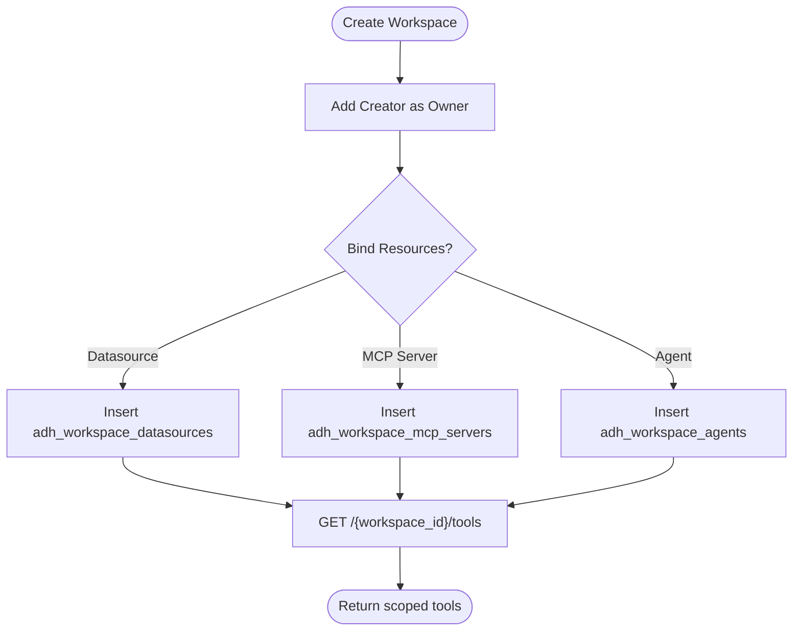
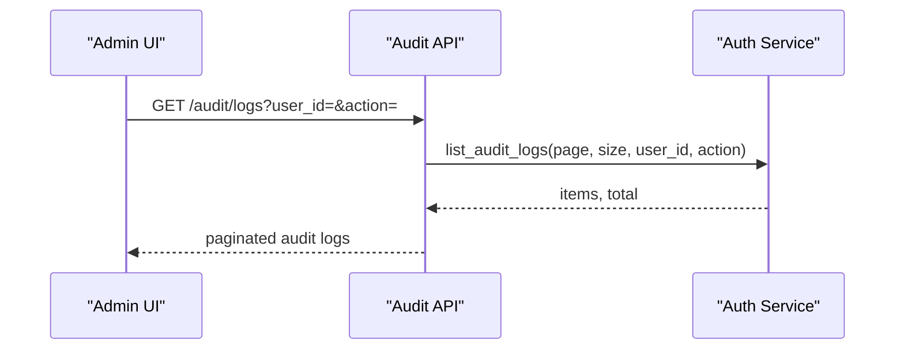
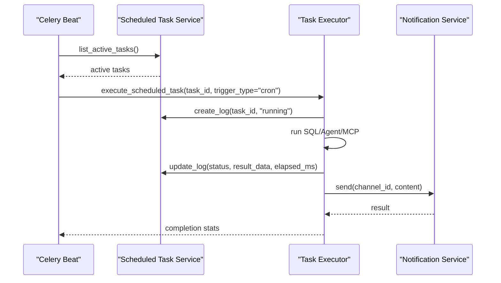
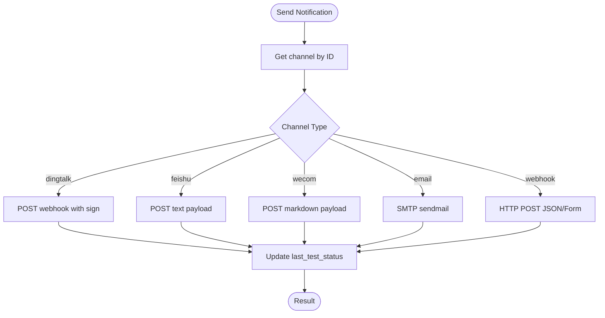
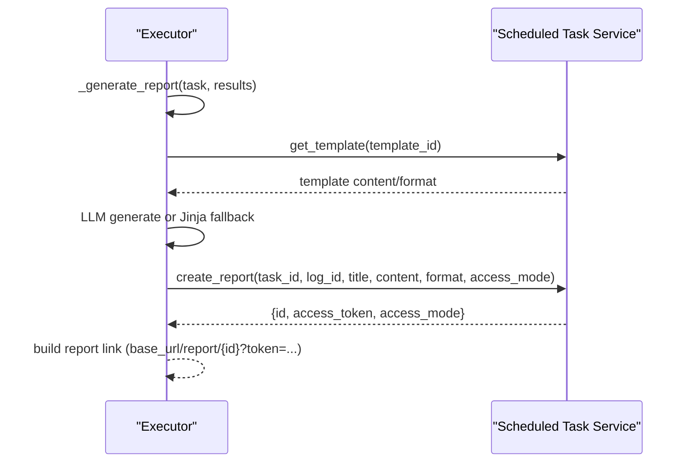
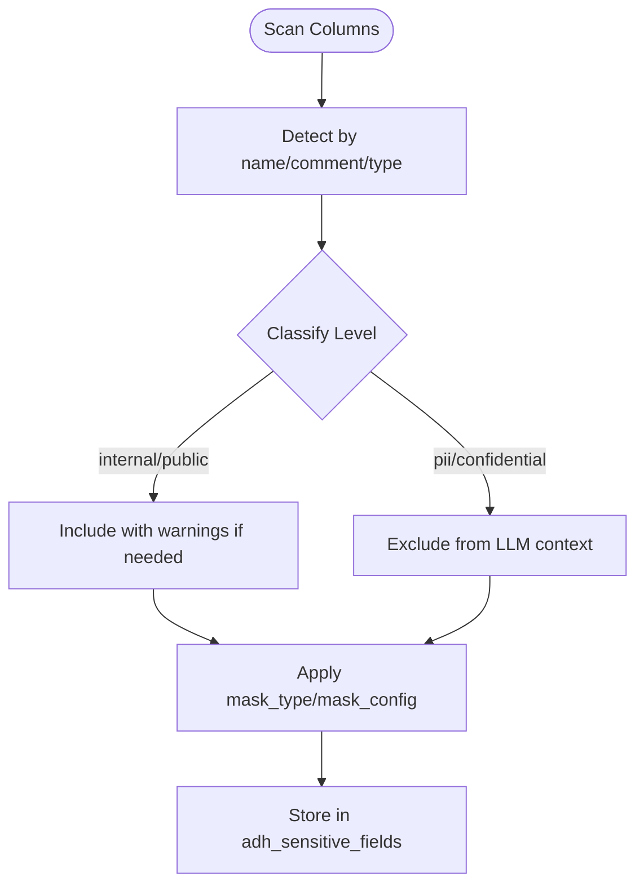
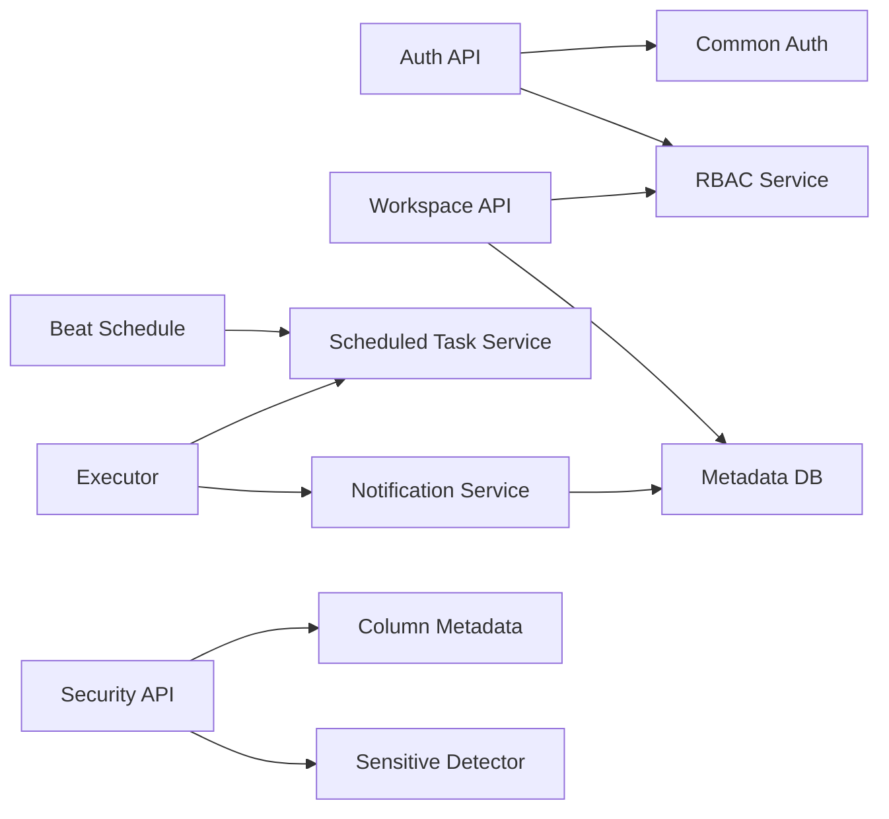

# Enterprise Features

<cite>
**Referenced Files in This Document**
- [auth.py](file://services/authservice/api/auth.py)
- [rbac_service.py](file://services/authservice/services/rbac_service.py)
- [workspaces.py](file://services/authservice/api/workspaces.py)
- [auth.py](file://services/shared/common/auth.py)
- [scheduled_task_service.py](file://services/dataflow/services/scheduled_task_service.py)
- [notification_service.py](file://services/dataflow/services/notification_service.py)
- [beat_schedule.py](file://services/dataflow/tasks/beat_schedule.py)
- [executor.py](file://services/dataflow/tasks/executor.py)
- [security.py](file://services/datagov/api/security.py)
- [sensitive_detector.py](file://services/datamind/nl2sql/sql/sensitive_detector.py)
- [audit.py](file://services/authservice/api/audit.py)
- [docker-compose.full.yml](file://docker-compose.full.yml)
</cite>

## Table of Contents
1. [Introduction](#introduction)
2. [Project Structure](#project-structure)
3. [Core Components](#core-components)
4. [Architecture Overview](#architecture-overview)
5. [Detailed Component Analysis](#detailed-component-analysis)
6. [Dependency Analysis](#dependency-analysis)
7. [Performance Considerations](#performance-considerations)
8. [Troubleshooting Guide](#troubleshooting-guide)
9. [Conclusion](#conclusion)
10. [Appendices](#appendices)

## Introduction
This document explains AI-DataHub’s enterprise-grade capabilities: JWT authentication with role-based access control, workspace isolation for multi-tenancy, audit logging for compliance, scheduled task execution with cron scheduling, multi-channel notifications (DingTalk, Feishu, WeCom, Email, Webhook), report generation, sensitive data protection with column-level classification and query audit trails, workspace management, integration configuration, monitoring and alerting, disaster recovery procedures, scalability considerations, performance tuning, and operational best practices for production deployments.

## Project Structure
AI-DataHub is organized as a set of services under services/, each exposing APIs and business logic:
- authservice: Authentication, RBAC, user management, audit logs
- dataflow: Scheduled tasks, Celery execution, notification channels, reports
- datagov: Sensitive data management API
- datamind: Agent orchestration and NL2SQL components including sensitivity detection
- shared: Common utilities (JWT, crypto, DB connections)
- docker: Database migrations and initialization scripts
- frontend: UI for admin, workspace, scheduled tasks, and reporting

**Diagram sources**
- [auth.py:21-51](file://services/authservice/api/auth.py#L21-L51)
- [rbac_service.py:27-275](file://services/authservice/services/rbac_service.py#L27-L275)
- [auth.py:32-99](file://services/shared/common/auth.py#L32-L99)
- [scheduled_task_service.py:25-714](file://services/dataflow/services/scheduled_task_service.py#L25-L714)
- [notification_service.py:33-283](file://services/dataflow/services/notification_service.py#L33-L283)
- [beat_schedule.py:19-69](file://services/dataflow/tasks/beat_schedule.py#L19-L69)
- [executor.py:482-800](file://services/dataflow/tasks/executor.py#L482-L800)
- [security.py:31-151](file://services/datagov/api/security.py#L31-L151)
- [sensitive_detector.py:94-167](file://services/datamind/nl2sql/sql/sensitive_detector.py#L94-L167)

**Section sources**
- [auth.py:21-51](file://services/authservice/api/auth.py#L21-L51)
- [workspaces.py:40-464](file://services/authservice/api/workspaces.py#L40-L464)
- [scheduled_task_service.py:25-714](file://services/dataflow/services/scheduled_task_service.py#L25-L714)
- [notification_service.py:33-283](file://services/dataflow/services/notification_service.py#L33-L283)
- [security.py:31-151](file://services/datagov/api/security.py#L31-L151)

## Core Components
- JWT Authentication and RBAC: Login, token refresh, logout; role-permission checks; admin privileges; workspace-scoped permissions.
- Workspace Isolation: Multi-tenant workspaces with user membership, default selection, resource binding (datasources, MCP servers, agents).
- Audit Logging: Centralized audit log ingestion and admin-only listing with filters.
- Scheduled Tasks: Cron-based scheduling via Celery Beat; dynamic schedule loading from DB; execution modes (SQL, agent, MCP); retry and timeout handling.
- Notifications: Multi-channel support (DingTalk, Feishu, WeCom, Email, Webhook) with test status tracking.
- Reports: Template-driven report generation using LLM or Jinja fallback; private/public access tokens; view counts.
- Sensitive Data Protection: Column-level sensitivity classification and masking; auto-scan by name/comment patterns; exclusion rules for LLM context.
- Monitoring and Alerting: Pipeline thresholds and metrics collection; channel test status; stale task cleanup.

**Section sources**
- [auth.py:21-51](file://services/authservice/api/auth.py#L21-L51)
- [rbac_service.py:27-275](file://services/authservice/services/rbac_service.py#L27-L275)
- [workspaces.py:40-464](file://services/authservice/api/workspaces.py#L40-L464)
- [audit.py:12-23](file://services/authservice/api/audit.py#L12-L23)
- [scheduled_task_service.py:25-714](file://services/dataflow/services/scheduled_task_service.py#L25-L714)
- [notification_service.py:33-283](file://services/dataflow/services/notification_service.py#L33-L283)
- [security.py:31-151](file://services/datagov/api/security.py#L31-L151)
- [sensitive_detector.py:94-167](file://services/datamind/nl2sql/sql/sensitive_detector.py#L94-L167)

## Architecture Overview
The enterprise architecture integrates authentication, workspace isolation, scheduled execution, notifications, and reporting with strong auditability and security controls.

**Diagram sources**
- [auth.py:21-51](file://services/authservice/api/auth.py#L21-L51)
- [rbac_service.py:220-275](file://services/authservice/services/rbac_service.py#L220-L275)
- [workspaces.py:40-149](file://services/authservice/api/workspaces.py#L40-L149)
- [beat_schedule.py:37-69](file://services/dataflow/tasks/beat_schedule.py#L37-L69)
- [executor.py:482-800](file://services/dataflow/tasks/executor.py#L482-L800)
- [notification_service.py:136-283](file://services/dataflow/services/notification_service.py#L136-L283)
- [scheduled_task_service.py:223-385](file://services/dataflow/services/scheduled_task_service.py#L223-L385)

## Detailed Component Analysis

### JWT Authentication and Role-Based Access Control (RBAC)
- Login flow returns JWT pairs; refresh endpoint exchanges refresh tokens; logout is stateless but can integrate blocklists in production.
- RBAC supports CRUD on roles and granular permissions stored as resource:action strings; admin users have wildcard permissions; permission checks are enforced per request.
- Sensitive fields (email, phone) are encrypted at rest; password hashing uses bcrypt; login attempts and lockout policies protect accounts.

**Diagram sources**
- [auth.py:21-51](file://services/authservice/api/auth.py#L21-L51)
- [rbac_service.py:27-275](file://services/authservice/services/rbac_service.py#L27-L275)
- [auth.py:32-99](file://services/shared/common/auth.py#L32-L99)

**Section sources**
- [auth.py:21-51](file://services/authservice/api/auth.py#L21-L51)
- [rbac_service.py:27-275](file://services/authservice/services/rbac_service.py#L27-L275)
- [auth.py:184-203](file://services/shared/common/auth.py#L184-L203)
- [auth.py:234-289](file://services/shared/common/auth.py#L234-L289)

### Workspace Isolation and Multi-Tenancy
- Workspaces encapsulate resources: datasources, MCP servers, agents; users are members with roles (owner, admin, member); default workspace selection per user.
- Resource binding endpoints enforce workspace membership and admin roles for modifications; deletion cascades clean up memberships and bindings.
- Tools endpoint aggregates available resources scoped to the workspace.

**Diagram sources**
- [workspaces.py:64-169](file://services/authservice/api/workspaces.py#L64-L169)
- [workspaces.py:326-464](file://services/authservice/api/workspaces.py#L326-L464)

**Section sources**
- [workspaces.py:40-169](file://services/authservice/api/workspaces.py#L40-L169)
- [workspaces.py:174-298](file://services/authservice/api/workspaces.py#L174-L298)
- [workspaces.py:302-464](file://services/authservice/api/workspaces.py#L302-L464)

### Audit Logging for Compliance
- Audit entries capture user actions, targets, details, IP, module, and timestamps; admin-only listing supports filtering by user, action, module with pagination.
- Integration points: login success/failure, account lockouts, and other critical operations call audit logging helpers.

**Diagram sources**
- [audit.py:12-23](file://services/authservice/api/audit.py#L12-L23)
- [auth.py:594-630](file://services/shared/common/auth.py#L594-L630)

**Section sources**
- [audit.py:12-23](file://services/authservice/api/audit.py#L12-L23)
- [auth.py:594-630](file://services/shared/common/auth.py#L594-L630)

### Scheduled Task Execution with Cron-Based Scheduling
- Dynamic Beat schedule reads active tasks from DB and registers Celery periodic tasks; cron expressions parsed into Celery crontab kwargs.
- Executor supports multiple modes: direct SQL execution, agent orchestration (multi-agent), and MCP mode; generates reports and sends notifications; tracks retries and timeouts.
- Logs include status transitions, elapsed time, worker info, and optional report links; stale running logs are cleaned up.

**Diagram sources**
- [beat_schedule.py:19-69](file://services/dataflow/tasks/beat_schedule.py#L19-L69)
- [scheduled_task_service.py:199-210](file://services/dataflow/services/scheduled_task_service.py#L199-L210)
- [executor.py:482-800](file://services/dataflow/tasks/executor.py#L482-L800)
- [notification_service.py:136-283](file://services/dataflow/services/notification_service.py#L136-L283)

**Section sources**
- [beat_schedule.py:19-69](file://services/dataflow/tasks/beat_schedule.py#L19-L69)
- [scheduled_task_service.py:25-385](file://services/dataflow/services/scheduled_task_service.py#L25-L385)
- [executor.py:482-800](file://services/dataflow/tasks/executor.py#L482-L800)

### Multi-Channel Notifications (DingTalk, Feishu, WeCom, Email, Webhook)
- Notification service manages channels with workspace scoping; supports testing connectivity and updating last test status.
- Channel implementations:
  - DingTalk: webhook with optional HMAC signature
  - Feishu/Lark: group robot webhook
  - WeCom: group robot webhook
  - Email: SMTP with SSL/TLS options
  - Webhook: generic HTTP POST with JSON or form payloads

**Diagram sources**
- [notification_service.py:33-283](file://services/dataflow/services/notification_service.py#L33-L283)

**Section sources**
- [notification_service.py:33-283](file://services/dataflow/services/notification_service.py#L33-L283)

### Report Generation Capabilities
- Reports are created per execution log with title, content, format, access mode (private/public), and optional access token; view counts increment on retrieval.
- Executor builds report content using LLM with template style guidance or falls back to Jinja2 rendering; report links include base URL and token for private reports.

**Diagram sources**
- [executor.py:250-480](file://services/dataflow/tasks/executor.py#L250-L480)
- [scheduled_task_service.py:519-685](file://services/dataflow/services/scheduled_task_service.py#L519-L685)

**Section sources**
- [executor.py:250-480](file://services/dataflow/tasks/executor.py#L250-L480)
- [scheduled_task_service.py:519-685](file://services/dataflow/services/scheduled_task_service.py#L519-L685)

### Sensitive Data Protection and Query Audit Trails
- Column-level sensitivity classification detects PII/confidential columns by name/comment and data type; classification informs masking and LLM context exclusion.
- Auto-scan identifies potential sensitive fields based on regex-like keyword matching against column metadata; manual tagging allows fine-grained control.
- Query audit trails: scheduled execution logs record executed questions/SQL, outcomes, and errors; combined with system audit logs for compliance.

**Diagram sources**
- [security.py:110-151](file://services/datagov/api/security.py#L110-L151)
- [sensitive_detector.py:94-167](file://services/datamind/nl2sql/sql/sensitive_detector.py#L94-L167)

**Section sources**
- [security.py:31-151](file://services/datagov/api/security.py#L31-L151)
- [sensitive_detector.py:94-167](file://services/datamind/nl2sql/sql/sensitive_detector.py#L94-L167)
- [executor.py:570-588](file://services/dataflow/tasks/executor.py#L570-L588)

### Workspace Management: User Provisioning, Permissions, Resources, Monitoring
- User provisioning: create/update/delete users with password policy enforcement; sensitive fields encrypted; status toggling and reset flows.
- Permission assignment: roles and permissions managed via RBAC; workspace membership roles (owner/admin/member) control resource access.
- Resource allocation: bind datasources, MCP servers, and agents to workspaces; primary datasource marking supported.
- Monitoring: pipeline thresholds and metrics collection; channel test status; stale task cleanup; execution statistics per task.

**Section sources**
- [auth.py:163-182](file://services/shared/common/auth.py#L163-L182)
- [auth.py:344-591](file://services/shared/common/auth.py#L344-L591)
- [rbac_service.py:27-275](file://services/authservice/services/rbac_service.py#L27-L275)
- [workspaces.py:174-298](file://services/authservice/api/workspaces.py#L174-L298)
- [workspaces.py:326-464](file://services/authservice/api/workspaces.py#L326-L464)
- [scheduled_task_service.py:318-385](file://services/dataflow/services/scheduled_task_service.py#L318-L385)

### Enterprise Integrations, Monitoring, Alerting, Disaster Recovery
- Integrations: configure notification channels per workspace; bind datasources and MCP servers to workspaces; use templates for consistent reporting.
- Monitoring and alerting:
  - Frontend pipeline thresholds define quick/deep mode targets and warning thresholds; metrics collector maintains recent metrics.
  - Backend channel test status and execution logs provide observability; stale running logs are marked as timeout.
- Disaster recovery:
  - MySQL health checks and persistent volumes ensure database availability; backups rely on MySQL snapshots and volume persistence.
  - Application restart policies configured via Docker Compose; environment variables centralize secrets and configuration.

**Section sources**
- [notification_service.py:33-283](file://services/dataflow/services/notification_service.py#L33-L283)
- [workspaces.py:326-464](file://services/authservice/api/workspaces.py#L326-L464)
- [docker-compose.full.yml:7-83](file://docker-compose.full.yml#L7-L83)
- [executor.py:686-709](file://services/dataflow/services/scheduled_task_service.py#L686-L709)

## Dependency Analysis
Key dependencies and coupling:
- Auth service depends on common auth utilities for JWT validation, encryption, and audit logging.
- Workspace API depends on RBAC service for permission checks and DB connection for membership/resource management.
- Scheduled task service orchestrates execution logs, reports, and channels; executor consumes it for lifecycle management.
- Notification service depends on DB for channel config and external HTTP/SMTP endpoints.
- Sensitive data API depends on column metadata and classification logic to detect and manage sensitive fields.

**Diagram sources**
- [auth.py:21-51](file://services/authservice/api/auth.py#L21-L51)
- [rbac_service.py:27-275](file://services/authservice/services/rbac_service.py#L27-L275)
- [workspaces.py:40-464](file://services/authservice/api/workspaces.py#L40-L464)
- [beat_schedule.py:37-69](file://services/dataflow/tasks/beat_schedule.py#L37-L69)
- [executor.py:482-800](file://services/dataflow/tasks/executor.py#L482-L800)
- [notification_service.py:33-283](file://services/dataflow/services/notification_service.py#L33-L283)
- [security.py:31-151](file://services/datagov/api/security.py#L31-L151)
- [sensitive_detector.py:94-167](file://services/datamind/nl2sql/sql/sensitive_detector.py#L94-L167)

**Section sources**
- [auth.py:21-51](file://services/authservice/api/auth.py#L21-L51)
- [rbac_service.py:27-275](file://services/authservice/services/rbac_service.py#L27-L275)
- [workspaces.py:40-464](file://services/authservice/api/workspaces.py#L40-L464)
- [scheduled_task_service.py:25-714](file://services/dataflow/services/scheduled_task_service.py#L25-L714)
- [notification_service.py:33-283](file://services/dataflow/services/notification_service.py#L33-L283)
- [security.py:31-151](file://services/datagov/api/security.py#L31-L151)
- [sensitive_detector.py:94-167](file://services/datamind/nl2sql/sql/sensitive_detector.py#L94-L167)

## Performance Considerations
- Scheduled tasks:
  - Use LIMIT clauses for SQL queries to avoid large result sets; executor enforces defaults when missing.
  - Configure max_retries and timeouts to balance reliability and resource usage; stale running logs are cleaned up to prevent phantom states.
- Notifications:
  - External calls use timeouts; failures update channel test status for visibility.
- Reports:
  - LLM generation may be expensive; fallback to Jinja ensures resilience; limit rows included in prompts to reduce token usage.
- Workspace resources:
  - Binding only necessary datasources and MCP servers reduces scope and improves performance.
- Monitoring:
  - Frontend pipeline thresholds guide alerting; backend logs provide execution metrics and error diagnostics.

[No sources needed since this section provides general guidance]

## Troubleshooting Guide
- Authentication issues:
  - Invalid/expired tokens return 401; verify ADH_SECRET_KEY and token expiration handling.
  - Account lockout after repeated failed attempts; check locked_until and reset mechanisms.
- Workspace access:
  - 403 errors indicate insufficient membership or admin role; verify adh_workspace_users and roles.
- Scheduled tasks:
  - Inactive tasks skipped; check is_active flag and cron expression validity; review logs for errors and timeouts.
  - Stale running logs marked as timeout; adjust timeout_minutes as needed.
- Notifications:
  - Channel not found or unknown type raises errors; validate channel config and connectivity via test_channel.
  - SMTP/webhook failures update last_test_status; inspect logs for detailed messages.
- Reports:
  - Private reports require access token; ensure base URL and token propagation; view count increments on access.
- Sensitive data:
  - Scans may miss fields if naming conventions differ; manually tag sensitive columns; adjust classification rules.

**Section sources**
- [auth.py:21-51](file://services/authservice/api/auth.py#L21-L51)
- [auth.py:234-289](file://services/shared/common/auth.py#L234-L289)
- [workspaces.py:96-169](file://services/authservice/api/workspaces.py#L96-L169)
- [scheduled_task_service.py:159-210](file://services/dataflow/services/scheduled_task_service.py#L159-L210)
- [scheduled_task_service.py:686-709](file://services/dataflow/services/scheduled_task_service.py#L686-L709)
- [notification_service.py:136-283](file://services/dataflow/services/notification_service.py#L136-L283)
- [executor.py:553-610](file://services/dataflow/tasks/executor.py#L553-L610)
- [security.py:110-151](file://services/datagov/api/security.py#L110-L151)

## Conclusion
AI-DataHub provides a robust enterprise foundation with secure authentication, granular RBAC, workspace isolation, comprehensive audit logging, scalable scheduled execution, multi-channel notifications, and advanced reporting. Sensitive data protection and query audit trails support compliance requirements. Operational features like monitoring, alerting, and disaster recovery enable reliable production deployments. Following the recommended configurations and best practices will ensure secure, performant, and maintainable operations at scale.

[No sources needed since this section summarizes without analyzing specific files]

## Appendices

### Configuration Checklist for Production
- Set ADH_SECRET_KEY and secure credentials for databases and LLM providers.
- Configure notification channels per workspace and test connectivity.
- Define roles and permissions aligned with organizational structure; assign workspace roles appropriately.
- Enable audit logging and restrict access to audit logs for compliance.
- Tune scheduled task timeouts, retries, and cron expressions; monitor execution logs and stale tasks.
- Implement database backups and restore procedures; verify health checks and restart policies.

[No sources needed since this section provides general guidance]