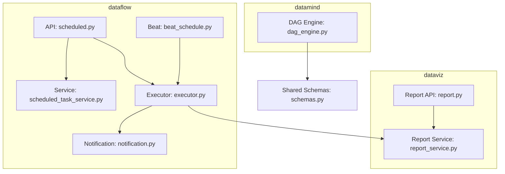
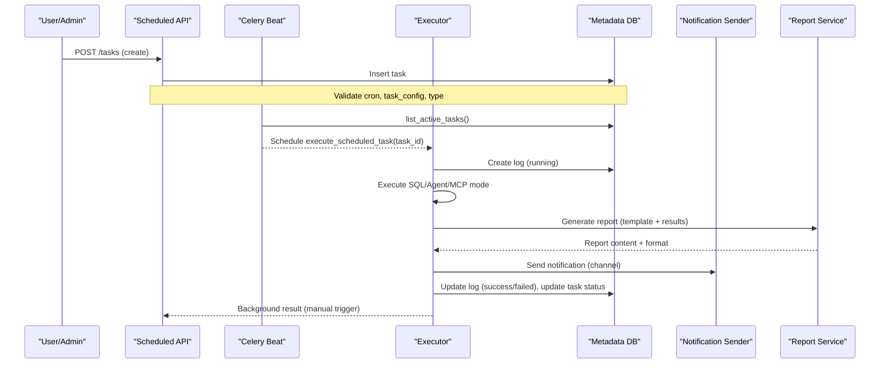
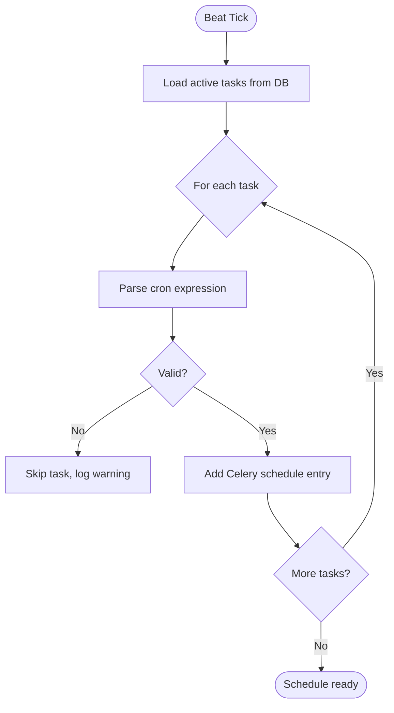
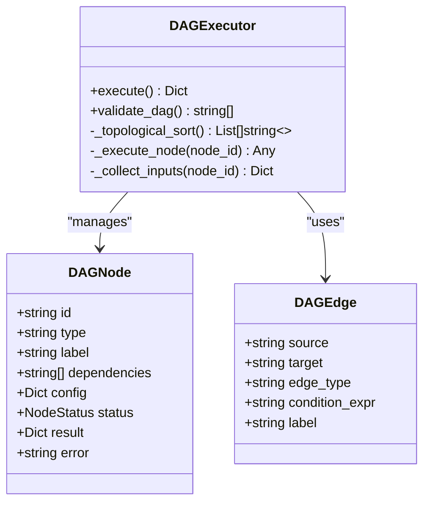
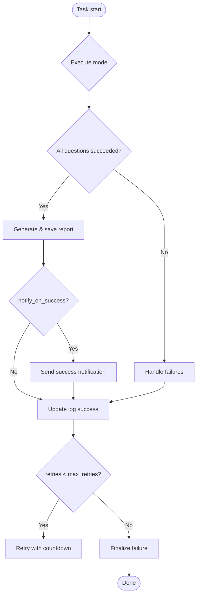
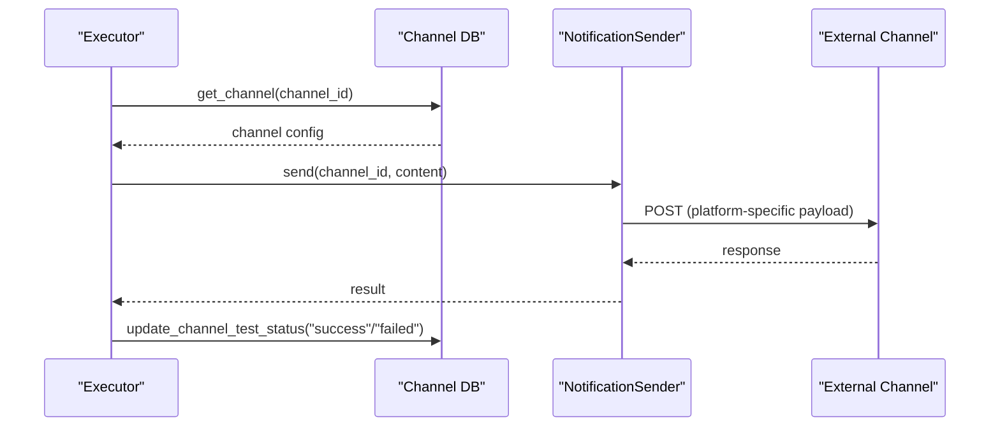
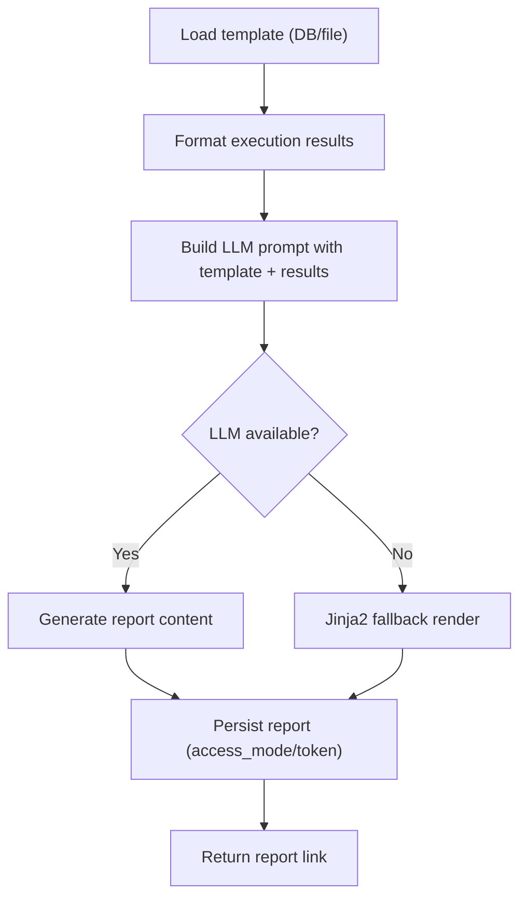
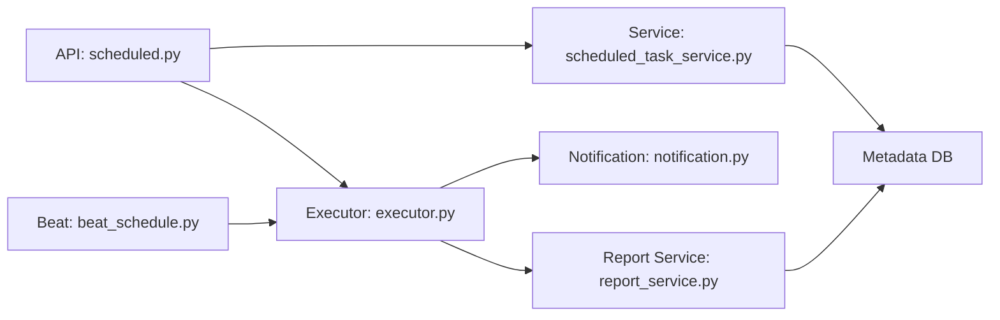

# Scheduled Tasks & Reports

<cite>
**Referenced Files in This Document**
- [scheduled.py](file://services/dataflow/api/scheduled.py)
- [scheduled_task_service.py](file://services/dataflow/services/scheduled_task_service.py)
- [executor.py](file://services/dataflow/tasks/executor.py)
- [beat_schedule.py](file://services/dataflow/tasks/beat_schedule.py)
- [notification.py](file://services/dataflow/tasks/notification.py)
- [report.py](file://services/dataviz/api/report.py)
- [report_service.py](file://services/dataviz/services/report_service.py)
- [dag_engine.py](file://services/datamind/nl2sql/orchestrator/workflow/dag_engine.py)
- [schemas.py](file://services/shared/models/schemas.py)
- [scheduled-tasks.md](file://docs/guides/scheduled-tasks.md)
</cite>

## Table of Contents
1. [Introduction](#introduction)
2. [Project Structure](#project-structure)
3. [Core Components](#core-components)
4. [Architecture Overview](#architecture-overview)
5. [Detailed Component Analysis](#detailed-component-analysis)
6. [Dependency Analysis](#dependency-analysis)
7. [Performance Considerations](#performance-considerations)
8. [Troubleshooting Guide](#troubleshooting-guide)
9. [Conclusion](#conclusion)
10. [Appendices](#appendices)

## Introduction
This document explains AI-DataHub’s scheduled task execution and report generation system. It covers cron-based scheduling with timezone support, task dependency management via DAG workflows, retry mechanisms, notification channels (DingTalk, Feishu, WeCom, Email, Webhook), report generation workflows and templates, monitoring and execution history, failure handling and alerting, API endpoints for task creation/scheduling/monitoring, complex workflows, conditional execution, external integrations, scalability considerations, and performance optimization strategies.

## Project Structure
The scheduled tasks and reports feature spans multiple services:
- dataflow service: APIs, service layer, Celery executor, Beat scheduler, notifications
- dataviz service: report generation APIs and LLM-driven report service
- datamind service: DAG workflow engine for dependency and conditional execution
- shared models: schemas for workflows and scheduled tasks

**Diagram sources**
- [scheduled.py:92-183](file://services/dataflow/api/scheduled.py#L92-L183)
- [scheduled_task_service.py:25-220](file://services/dataflow/services/scheduled_task_service.py#L25-L220)
- [executor.py:482-610](file://services/dataflow/tasks/executor.py#L482-L610)
- [beat_schedule.py:37-68](file://services/dataflow/tasks/beat_schedule.py#L37-L68)
- [notification.py:26-57](file://services/dataflow/tasks/notification.py#L26-L57)
- [report.py:14-96](file://services/dataviz/api/report.py#L14-L96)
- [report_service.py:85-144](file://services/dataviz/services/report_service.py#L85-L144)
- [dag_engine.py:60-117](file://services/datamind/nl2sql/orchestrator/workflow/dag_engine.py#L60-L117)
- [schemas.py:670-690](file://services/shared/models/schemas.py#L670-L690)

**Section sources**
- [scheduled.py:92-183](file://services/dataflow/api/scheduled.py#L92-L183)
- [scheduled_task_service.py:25-220](file://services/dataflow/services/scheduled_task_service.py#L25-L220)
- [executor.py:482-610](file://services/dataflow/tasks/executor.py#L482-L610)
- [beat_schedule.py:37-68](file://services/dataflow/tasks/beat_schedule.py#L37-L68)
- [notification.py:26-57](file://services/dataflow/tasks/notification.py#L26-L57)
- [report.py:14-96](file://services/dataviz/api/report.py#L14-L96)
- [report_service.py:85-144](file://services/dataviz/services/report_service.py#L85-L144)
- [dag_engine.py:60-117](file://services/datamind/nl2sql/orchestrator/workflow/dag_engine.py#L60-L117)
- [schemas.py:670-690](file://services/shared/models/schemas.py#L670-L690)

## Core Components
- Scheduled Task API: CRUD for tasks, logs, channels, templates, and generated reports; manual trigger and toggle; pagination and workspace scoping.
- Scheduled Task Service: Persistence for tasks, logs, channels, templates, reports; normalization helpers; cleanup utilities.
- Executor: Celery task orchestrator that runs SQL or Agent/MCP modes, generates reports, sends notifications, handles retries and cancellation.
- Beat Scheduler: Loads active tasks from DB into Celery Beat schedule dynamically on each tick.
- Notification Sender: Multi-channel messaging (DingTalk, Feishu, WeCom, Email, Webhook) with test capability.
- Report Generation: LLM-powered report content generation using templates; storage and retrieval with access control.
- DAG Workflow Engine: Dependency-based execution with parallel layers, conditional branching, and progress tracking.

**Section sources**
- [scheduled.py:92-183](file://services/dataflow/api/scheduled.py#L92-L183)
- [scheduled_task_service.py:25-220](file://services/dataflow/services/scheduled_task_service.py#L25-L220)
- [executor.py:482-610](file://services/dataflow/tasks/executor.py#L482-L610)
- [beat_schedule.py:37-68](file://services/dataflow/tasks/beat_schedule.py#L37-L68)
- [notification.py:26-57](file://services/dataflow/tasks/notification.py#L26-L57)
- [report_service.py:85-144](file://services/dataviz/services/report_service.py#L85-L144)
- [dag_engine.py:60-117](file://services/datamind/nl2sql/orchestrator/workflow/dag_engine.py#L60-L117)

## Architecture Overview
End-to-end flow from scheduling to reporting and notification:

**Diagram sources**
- [scheduled.py:111-183](file://services/dataflow/api/scheduled.py#L111-L183)
- [beat_schedule.py:37-68](file://services/dataflow/tasks/beat_schedule.py#L37-L68)
- [executor.py:482-610](file://services/dataflow/tasks/executor.py#L482-L610)
- [report_service.py:85-144](file://services/dataviz/services/report_service.py#L85-L144)
- [notification.py:26-57](file://services/dataflow/tasks/notification.py#L26-L57)

## Detailed Component Analysis

### Cron-Based Scheduling with Timezone Support
- Dynamic Beat schedule loads active tasks from the database and builds Celery schedules per task’s cron expression.
- Timezone is stored per task and used by upstream schedulers; cron parsing validates 5-field expressions.
- Manual trigger uses FastAPI BackgroundTasks to run asynchronously without blocking the event loop.

**Diagram sources**
- [beat_schedule.py:19-68](file://services/dataflow/tasks/beat_schedule.py#L19-L68)
- [scheduled_task_service.py:199-210](file://services/dataflow/services/scheduled_task_service.py#L199-L210)

**Section sources**
- [beat_schedule.py:19-68](file://services/dataflow/tasks/beat_schedule.py#L19-L68)
- [scheduled_task_service.py:199-210](file://services/dataflow/services/scheduled_task_service.py#L199-L210)
- [scheduled.py:111-183](file://services/dataflow/api/scheduled.py#L111-L183)

### Task Dependency Management and Conditional Execution
- DAG engine supports dependency graphs, topological sorting, parallel execution of independent nodes, and conditional edges.
- Workflows can be defined with steps and edges; condition expressions enable branching based on prior node outputs.
- Integration point: scheduled tasks can orchestrate multi-step workflows through agent modes or MCP contexts.

**Diagram sources**
- [dag_engine.py:27-65](file://services/datamind/nl2sql/orchestrator/workflow/dag_engine.py#L27-L65)
- [dag_engine.py:60-117](file://services/datamind/nl2sql/orchestrator/workflow/dag_engine.py#L60-L117)
- [schemas.py:670-690](file://services/shared/models/schemas.py#L670-L690)

**Section sources**
- [dag_engine.py:60-117](file://services/datamind/nl2sql/orchestrator/workflow/dag_engine.py#L60-L117)
- [schemas.py:670-690](file://services/shared/models/schemas.py#L670-L690)

### Retry Mechanisms and Failure Handling
- The executor uses Celery’s retry mechanism with configurable max_retries; failed executions update logs and task status.
- Stale running logs are cleaned up by marking them as timeout after a configurable threshold.
- Notifications on failure are sent when enabled; channel test status is updated to reflect outcomes.

**Diagram sources**
- [executor.py:482-610](file://services/dataflow/tasks/executor.py#L482-L610)
- [scheduled_task_service.py:686-709](file://services/dataflow/services/scheduled_task_service.py#L686-L709)

**Section sources**
- [executor.py:482-610](file://services/dataflow/tasks/executor.py#L482-L610)
- [scheduled_task_service.py:686-709](file://services/dataflow/services/scheduled_task_service.py#L686-L709)

### Notification Channels
- Supported channels: DingTalk (webhook + optional HMAC sign), Feishu/Lark (webhook), WeCom (webhook), Email (SMTP), Webhook (generic HTTP).
- Each channel has configuration fields; messages can use custom message templates with variables like task name, date, time, totals, and report links.
- Test endpoint verifies connectivity and updates last_test_at and last_test_status.

**Diagram sources**
- [notification.py:26-57](file://services/dataflow/tasks/notification.py#L26-L57)
- [notification.py:61-214](file://services/dataflow/tasks/notification.py#L61-L214)
- [scheduled_task_service.py:494-517](file://services/dataflow/services/scheduled_task_service.py#L494-L517)

**Section sources**
- [notification.py:61-214](file://services/dataflow/tasks/notification.py#L61-L214)
- [scheduled.py:298-368](file://services/dataflow/api/scheduled.py#L298-L368)

### Report Generation Workflows and Template Management
- Report generation uses LLM to produce markdown/html content guided by a template; fallback to Jinja2 rendering if LLM fails.
- Templates are stored in DB with format (markdown/html); system templates cannot be modified/deleted.
- Generated reports are persisted with access control (public/private tokens) and viewable via API.

**Diagram sources**
- [executor.py:250-376](file://services/dataflow/tasks/executor.py#L250-L376)
- [report_service.py:85-144](file://services/dataviz/services/report_service.py#L85-L144)
- [scheduled_task_service.py:637-685](file://services/dataflow/services/scheduled_task_service.py#L637-L685)

**Section sources**
- [executor.py:250-376](file://services/dataflow/tasks/executor.py#L250-L376)
- [report_service.py:85-144](file://services/dataviz/services/report_service.py#L85-L144)
- [scheduled_task_service.py:521-685](file://services/dataflow/services/scheduled_task_service.py#L521-L685)

### Output Formats
- Current implementation stores reports as markdown or html content; frontend renders accordingly.
- No direct PDF/Excel/image export in the referenced code paths; output formats supported by the system are markdown and html.

**Section sources**
- [report_service.py:118-136](file://services/dataviz/services/report_service.py#L118-L136)
- [scheduled_task_service.py:637-685](file://services/dataflow/services/scheduled_task_service.py#L637-L685)

### Task Monitoring, Execution History, and Alerting
- Execution logs capture status, timing, worker info, result summaries, and report links.
- Stats endpoint aggregates total runs, success/failure counts, success rate, and average elapsed time.
- Alerts via configured channels on success/failure; stale running logs auto-cleanup to timeout.

**Section sources**
- [scheduled_task_service.py:221-385](file://services/dataflow/services/scheduled_task_service.py#L221-L385)
- [scheduled_task_service.py:318-343](file://services/dataflow/services/scheduled_task_service.py#L318-L343)
- [scheduled_task_service.py:686-709](file://services/dataflow/services/scheduled_task_service.py#L686-L709)

### API Endpoints Summary
- Task CRUD: GET/POST/PUT/DELETE /tasks; PATCH /tasks/{id}/toggle; POST /tasks/{id}/trigger
- Logs: GET /tasks/{id}/logs; GET /logs/{id}; PATCH /logs/{id}/status; POST /logs/cleanup-stale; DELETE /logs/cleanup
- Channels: GET/POST/PUT/DELETE /channels; POST /channels/{id}/test
- Templates: GET/POST/PUT/DELETE /templates
- Reports: GET /reports/{id}?token=...

**Section sources**
- [scheduled.py:92-446](file://services/dataflow/api/scheduled.py#L92-L446)

### Complex Task Workflows and External Integrations
- Use agent/mcp modes to integrate with external systems via MCP servers and allowed agents.
- DAG workflows enable multi-step pipelines with conditional branching and parallel execution.
- Example patterns:
  - Daily sales report: query mode with SQL, generate markdown report, notify DingTalk.
  - Multi-agent analysis: agent mode with context and allowed agents, produce insights, email summary.
  - Conditional pipeline: DAG with branches based on thresholds, skip downstream on failure.

**Section sources**
- [executor.py:117-247](file://services/dataflow/tasks/executor.py#L117-L247)
- [dag_engine.py:60-117](file://services/datamind/nl2sql/orchestrator/workflow/dag_engine.py#L60-L117)
- [scheduled-tasks.md:29-82](file://docs/guides/scheduled-tasks.md#L29-L82)

## Dependency Analysis
Key dependencies and coupling:
- API depends on service layer for persistence and validation.
- Executor depends on service layer for logs/channels/templates/reports and on dataviz services for datasource execution and report generation.
- Beat scheduler depends on service layer to load active tasks.
- Notification sender depends on service layer to fetch channel configs.
- Report service depends on LLM client and DB for templates and queries.

**Diagram sources**
- [scheduled.py:92-183](file://services/dataflow/api/scheduled.py#L92-L183)
- [scheduled_task_service.py:25-220](file://services/dataflow/services/scheduled_task_service.py#L25-L220)
- [executor.py:482-610](file://services/dataflow/tasks/executor.py#L482-L610)
- [beat_schedule.py:37-68](file://services/dataflow/tasks/beat_schedule.py#L37-L68)
- [notification.py:26-57](file://services/dataflow/tasks/notification.py#L26-L57)
- [report_service.py:85-144](file://services/dataviz/services/report_service.py#L85-L144)

**Section sources**
- [scheduled.py:92-183](file://services/dataflow/api/scheduled.py#L92-L183)
- [scheduled_task_service.py:25-220](file://services/dataflow/services/scheduled_task_service.py#L25-L220)
- [executor.py:482-610](file://services/dataflow/tasks/executor.py#L482-L610)
- [beat_schedule.py:37-68](file://services/dataflow/tasks/beat_schedule.py#L37-L68)
- [notification.py:26-57](file://services/dataflow/tasks/notification.py#L26-L57)
- [report_service.py:85-144](file://services/dataviz/services/report_service.py#L85-L144)

## Performance Considerations
- Use Celery queues and workers to scale task execution horizontally; assign dedicated queue for scheduled tasks.
- Limit SQL result sizes (e.g., LIMIT clauses) to reduce memory usage and network overhead.
- Configure timeouts and max_retries appropriately to balance reliability and resource consumption.
- Avoid heavy synchronous operations in FastAPI background tasks; prefer async flows for agent modes.
- Cache frequently accessed templates and channel configurations where appropriate.
- Monitor average elapsed_ms and success rates to identify bottlenecks.

[No sources needed since this section provides general guidance]

## Troubleshooting Guide
Common issues and resolutions:
- Invalid cron expression: Ensure 5-field format; API validates and returns errors.
- Empty SQL or question: Executor records failure with clear error messages.
- Notification failures: Check channel config and test endpoint; last_test_status reflects outcome.
- Stale running logs: Use cleanup endpoint to mark long-running tasks as timeout.
- Report generation errors: LLM fallback ensures basic report content; check logs for details.

**Section sources**
- [scheduled.py:111-183](file://services/dataflow/api/scheduled.py#L111-L183)
- [executor.py:48-77](file://services/dataflow/tasks/executor.py#L48-L77)
- [notification.py:55-57](file://services/dataflow/tasks/notification.py#L55-L57)
- [scheduled_task_service.py:686-709](file://services/dataflow/services/scheduled_task_service.py#L686-L709)

## Conclusion
AI-DataHub’s scheduled task and report system provides robust cron-based scheduling, flexible execution modes (SQL, Agent, MCP), comprehensive notifications across popular channels, and LLM-driven report generation with template management. DAG workflows enable complex dependency and conditional logic. The system includes strong monitoring, logging, and failure handling with retry capabilities. While current report outputs are markdown/html, the architecture supports extension for additional formats. Scalability is achieved through Celery queues and parallel execution, with performance tuning via timeouts, limits, and caching.

[No sources needed since this section summarizes without analyzing specific files]

## Appendices

### API Reference
- Tasks:
  - GET /tasks?workspace_id=&page=&size=
  - GET /tasks/{task_id}
  - POST /tasks
  - PUT /tasks/{task_id}
  - DELETE /tasks/{task_id}
  - PATCH /tasks/{task_id}/toggle?is_active=
  - POST /tasks/{task_id}/trigger
- Logs:
  - GET /tasks/{task_id}/logs?page=&size=&status=
  - GET /logs/{log_id}
  - PATCH /logs/{log_id}/status?status=&error_message=
  - POST /logs/cleanup-stale?timeout_minutes=
  - DELETE /logs/cleanup?days=
- Channels:
  - GET /channels?workspace_id=
  - GET /channels/{channel_id}
  - POST /channels
  - PUT /channels/{channel_id}
  - DELETE /channels/{channel_id}
  - POST /channels/{channel_id}/test
- Templates:
  - GET /templates?workspace_id=
  - GET /templates/{template_id}
  - POST /templates
  - PUT /templates/{template_id}
  - DELETE /templates/{template_id}
- Reports:
  - GET /reports/{report_id}?token=

**Section sources**
- [scheduled.py:92-446](file://services/dataflow/api/scheduled.py#L92-L446)

### Configuration Examples
- DingTalk: webhook_url, secret (optional)
- Feishu: webhook_url
- WeCom: webhook_url
- Email: smtp_host, smtp_port, smtp_user, smtp_password, use_ssl, from_addr, to_addrs
- Webhook: url, method, headers, content_type

**Section sources**
- [notification.py:61-214](file://services/dataflow/tasks/notification.py#L61-L214)

### Best Practices
- Name tasks clearly and avoid peak hours for execution.
- Set reasonable timeouts and retries based on workload complexity.
- Test notification channels before enabling tasks.
- Use DAG workflows for complex multi-step processes with conditional branches.
- Monitor execution stats and logs regularly to maintain reliability.

**Section sources**
- [scheduled-tasks.md:111-135](file://docs/guides/scheduled-tasks.md#L111-L135)