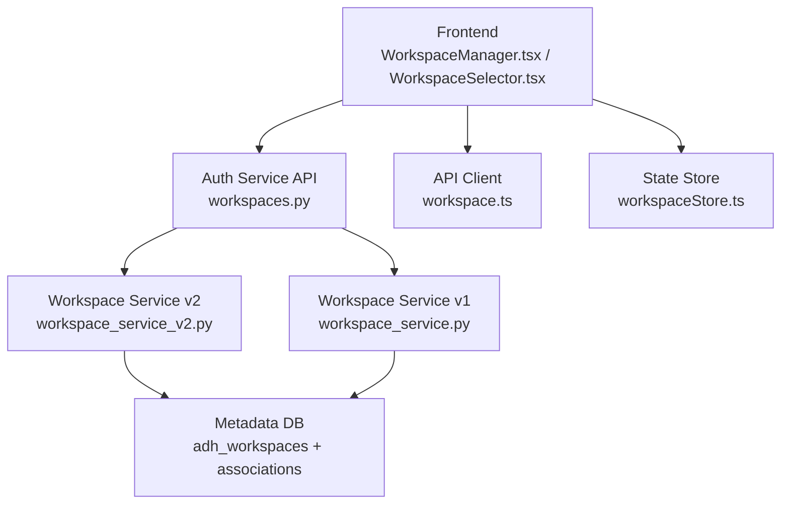
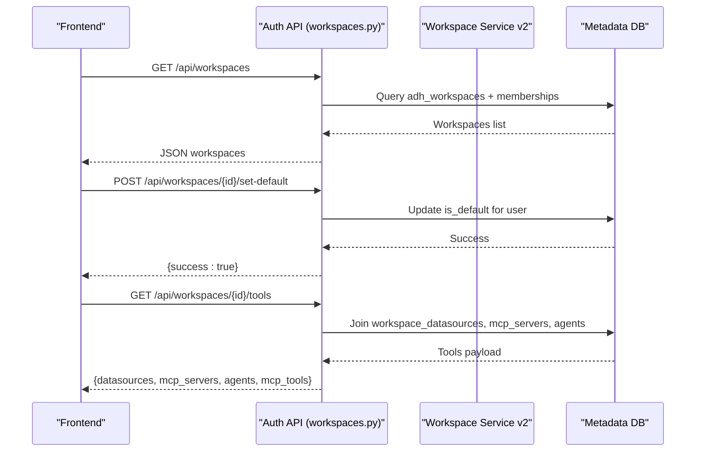
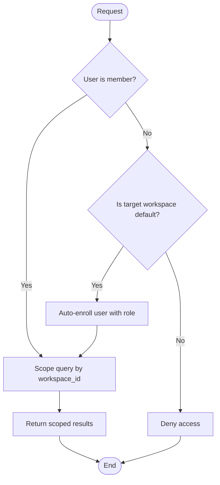
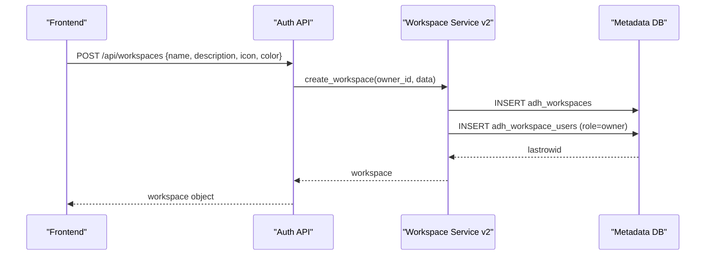
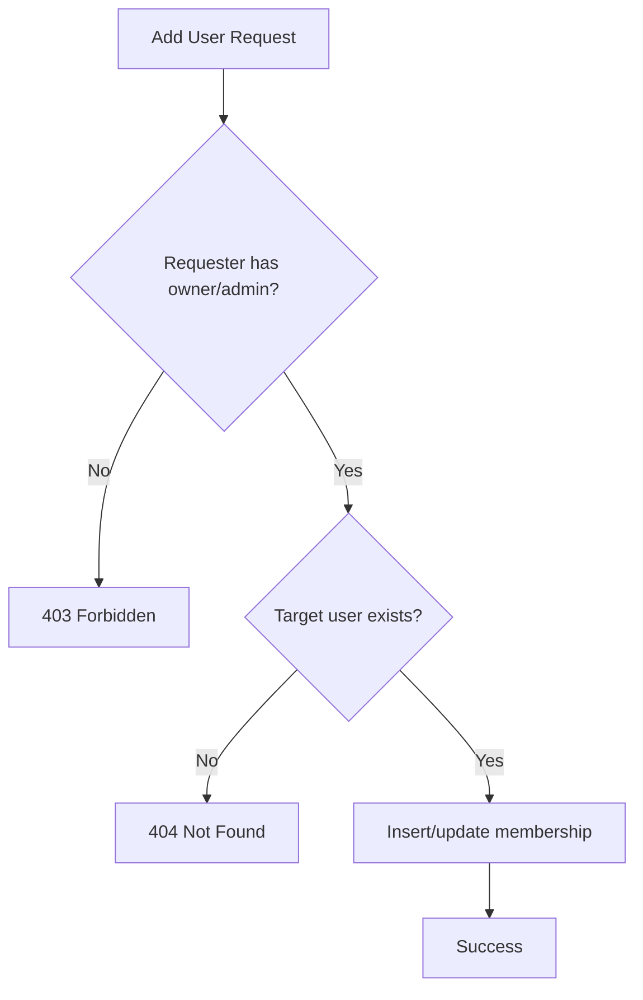
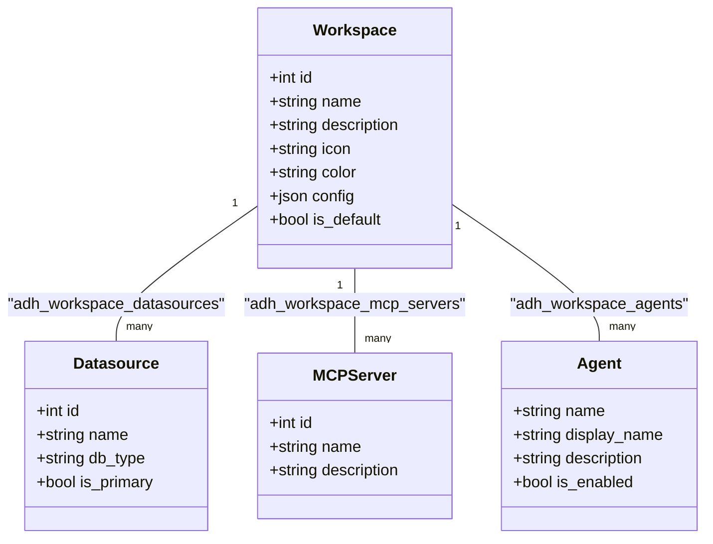
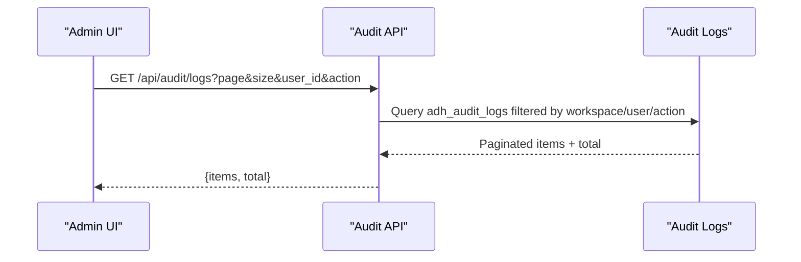
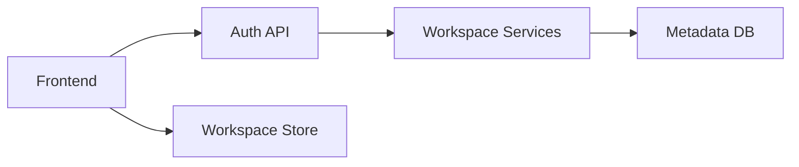

# Workspace Management

<cite>
**Referenced Files in This Document**
- [workspaces.py](file://services/authservice/api/workspaces.py)
- [workspace_service.py](file://services/dataflow/services/workspace_service.py)
- [workspace_service_v2.py](file://services/dataflow/services/workspace_service_v2.py)
- [workspace.ts](file://frontend/src/api/workspace.ts)
- [WorkspaceManager.tsx](file://frontend/src/pages/WorkspaceManager.tsx)
- [WorkspaceSelector.tsx](file://frontend/src/components/WorkspaceSelector.tsx)
- [workspaceStore.ts](file://frontend/src/stores/workspaceStore.ts)
- [workspace_migration.sql](file://docker/mysql/workspace_migration.sql)
- [workspace_migration_v2.sql](file://docker/mysql/workspace_migration_v2.sql)
- [audit.py](file://services/authservice/api/audit.py)
- [AuditLog.tsx](file://frontend/src/pages/admin/AuditLog.tsx)
- [governance.ts](file://frontend/src/api/governance.ts)
</cite>

## Table of Contents
1. [Introduction](#introduction)
2. [Project Structure](#project-structure)
3. [Core Components](#core-components)
4. [Architecture Overview](#architecture-overview)
5. [Detailed Component Analysis](#detailed-component-analysis)
6. [Dependency Analysis](#dependency-analysis)
7. [Performance Considerations](#performance-considerations)
8. [Troubleshooting Guide](#troubleshooting-guide)
9. [Conclusion](#conclusion)
10. [Appendices](#appendices)

## Introduction
This document explains AI-DataHub’s workspace management system with a focus on multi-tenancy, isolation mechanisms, data segregation, lifecycle operations (creation, configuration, user provisioning, deletion), settings and resource associations, sharing and collaboration, audit logging, API usage, frontend interface, programmatic administration, performance considerations for large-scale deployments, and migration strategies between workspaces.

## Project Structure
The workspace feature spans multiple services and the frontend:
- Backend APIs expose workspace CRUD, membership, default selection, and tool bindings.
- Services implement workspace context, access checks, and association management.
- Frontend provides workspace selection, management UI, and API clients.
- Database migrations define workspace tables and propagate workspace_id across core entities to enforce isolation.

**Diagram sources**
- [workspaces.py:40-169](file://services/authservice/api/workspaces.py#L40-L169)
- [workspace_service_v2.py:28-154](file://services/dataflow/services/workspace_service_v2.py#L28-L154)
- [workspace_service.py:17-168](file://services/dataflow/services/workspace_service.py#L17-L168)
- [workspace.ts:70-141](file://frontend/src/api/workspace.ts#L70-L141)
- [WorkspaceManager.tsx:87-229](file://frontend/src/pages/WorkspaceManager.tsx#L87-L229)
- [WorkspaceSelector.tsx:22-118](file://frontend/src/components/WorkspaceSelector.tsx#L22-L118)
- [workspaceStore.ts:1-72](file://frontend/src/stores/workspaceStore.ts#L1-L72)

**Section sources**
- [workspaces.py:40-169](file://services/authservice/api/workspaces.py#L40-L169)
- [workspace_service_v2.py:28-154](file://services/dataflow/services/workspace_service_v2.py#L28-L154)
- [workspace_service.py:17-168](file://services/dataflow/services/workspace_service.py#L17-L168)
- [workspace.ts:70-141](file://frontend/src/api/workspace.ts#L70-L141)
- [WorkspaceManager.tsx:87-229](file://frontend/src/pages/WorkspaceManager.tsx#L87-L229)
- [WorkspaceSelector.tsx:22-118](file://frontend/src/components/WorkspaceSelector.tsx#L22-L118)
- [workspaceStore.ts:1-72](file://frontend/src/stores/workspaceStore.ts#L1-L72)

## Core Components
- Workspace API (Auth service): Provides endpoints to list, create, update, delete workspaces; manage users and roles; set default workspace; bind datasources and MCP servers; retrieve workspace tools.
- Workspace Services (Dataflow): Provide programmatic methods for workspace CRUD, user management, datasource binding, default workspace handling, and context resolution.
- Frontend: Workspace manager UI, selector component, and API client functions for workspace operations.
- Database schema: Defines workspace entity, membership, and association tables; migrates existing tables to include workspace_id for isolation.

Key responsibilities:
- Multi-tenant isolation via workspace_id on core tables and membership enforcement.
- Resource scoping: datasources, MCP servers, agents bound per workspace.
- Collaboration: role-based membership (owner, admin, member, viewer).
- Auditability: audit logs accessible via admin endpoints and UI.

**Section sources**
- [workspaces.py:40-169](file://services/authservice/api/workspaces.py#L40-L169)
- [workspace_service_v2.py:28-154](file://services/dataflow/services/workspace_service_v2.py#L28-L154)
- [workspace_service.py:17-168](file://services/dataflow/services/workspace_service.py#L17-L168)
- [workspace.ts:70-141](file://frontend/src/api/workspace.ts#L70-L141)
- [workspace_migration_v2.sql:9-52](file://docker/mysql/workspace_migration_v2.sql#L9-L52)

## Architecture Overview
The system enforces multi-tenancy by associating all relevant resources with a workspace_id and controlling access through workspace membership. The Auth service exposes REST endpoints that validate user membership and delegate to services for data operations. The frontend manages workspace selection and configuration through typed API calls and state stores.

**Diagram sources**
- [workspaces.py:40-61](file://services/authservice/api/workspaces.py#L40-L61)
- [workspaces.py:302-323](file://services/authservice/api/workspaces.py#L302-L323)
- [workspaces.py:326-371](file://services/authservice/api/workspaces.py#L326-L371)
- [workspace_service_v2.py:33-68](file://services/dataflow/services/workspace_service_v2.py#L33-L68)

## Detailed Component Analysis

### Multi-Tenancy and Isolation Strategy
- Data segregation: All core tables receive a workspace_id column and are indexed for efficient filtering. This ensures queries scoped to a workspace return only that tenant’s data.
- Membership enforcement: Endpoints check workspace membership before allowing operations. Non-members are denied unless they are system admins where applicable.
- Default workspace: Users can set a default workspace; the system supports auto-enrollment into default workspaces for convenience when accessing resources.

**Diagram sources**
- [workspace_service_v2.py:335-404](file://services/dataflow/services/workspace_service_v2.py#L335-L404)
- [workspaces.py:285-297](file://services/authservice/api/workspaces.py#L285-L297)

**Section sources**
- [workspace_migration_v2.sql:55-120](file://docker/mysql/workspace_migration_v2.sql#L55-L120)
- [workspace_service_v2.py:335-404](file://services/dataflow/services/workspace_service_v2.py#L335-L404)
- [workspaces.py:285-297](file://services/authservice/api/workspaces.py#L285-L297)

### Workspace Lifecycle Operations

#### Creation
- API: Create workspace sets name, description, icon, color, owner, and initializes config. Creator becomes owner.
- Service v2: Creates workspace row, inserts owner membership, commits transaction, returns created workspace.

**Diagram sources**
- [workspaces.py:64-93](file://services/authservice/api/workspaces.py#L64-L93)
- [workspace_service_v2.py:70-98](file://services/dataflow/services/workspace_service_v2.py#L70-L98)

**Section sources**
- [workspaces.py:64-93](file://services/authservice/api/workspaces.py#L64-L93)
- [workspace_service_v2.py:70-98](file://services/dataflow/services/workspace_service_v2.py#L70-L98)

#### Configuration
- Settings: Name, description, icon, color, and JSON config stored per workspace.
- Modes and retrieval strategy: Configurable allowed_modes and default_mode influence quick/deep/agent behaviors.
- Frontend templates: Predefined templates populate defaults for modes, retrieval strategy, and agent selections.

**Section sources**
- [workspace_service_v2.py:105-134](file://services/dataflow/services/workspace_service_v2.py#L105-L134)
- [WorkspaceManager.tsx:47-83](file://frontend/src/pages/WorkspaceManager.tsx#L47-L83)
- [WorkspaceManager.tsx:337-400](file://frontend/src/pages/WorkspaceManager.tsx#L337-L400)

#### User Provisioning and Roles
- Add/remove users: Admins or owners can add members with roles and remove them (except owners cannot be removed).
- Role enforcement: Membership checks ensure only authorized users modify workspace settings or resources.

**Diagram sources**
- [workspaces.py:204-243](file://services/authservice/api/workspaces.py#L204-L243)
- [workspaces.py:246-282](file://services/authservice/api/workspaces.py#L246-L282)

**Section sources**
- [workspaces.py:174-282](file://services/authservice/api/workspaces.py#L174-L282)
- [workspace_service_v2.py:158-227](file://services/dataflow/services/workspace_service_v2.py#L158-L227)

#### Deletion
- Delete workspace: Removes memberships and associated workspace bindings; deletes workspace record. Admin-only operation.

**Section sources**
- [workspaces.py:151-169](file://services/authservice/api/workspaces.py#L151-L169)
- [workspace_service_v2.py:136-154](file://services/dataflow/services/workspace_service_v2.py#L136-L154)

### Workspace Settings and Resource Associations
- Datasources: Bind/unbind datasources per workspace; one primary datasource supported.
- MCP Servers: Bind/unbind MCP servers per workspace.
- Agents: Enable/disable agents per workspace with optional config overrides.

**Diagram sources**
- [workspace_migration.sql:28-69](file://docker/mysql/workspace_migration.sql#L28-L69)
- [workspace_service.py:20-60](file://services/dataflow/services/workspace_service.py#L20-L60)
- [workspaces.py:326-371](file://services/authservice/api/workspaces.py#L326-L371)

**Section sources**
- [workspace_migration.sql:28-69](file://docker/mysql/workspace_migration.sql#L28-L69)
- [workspace_service.py:20-60](file://services/dataflow/services/workspace_service.py#L20-L60)
- [workspaces.py:326-420](file://services/authservice/api/workspaces.py#L326-L420)

### Sharing and Collaboration
- Membership model: owner, admin, member, viewer roles control permissions.
- Default workspace enrollment: When accessing a default workspace, non-members may be auto-enrolled depending on system rules.
- Public visibility flag: Workspace includes an is_public field to allow visibility beyond members.

**Section sources**
- [workspace_service_v2.py:335-404](file://services/dataflow/services/workspace_service_v2.py#L335-L404)
- [workspace_migration.sql:9-25](file://docker/mysql/workspace_migration.sql#L9-L25)

### Audit Logging Within Workspaces
- Audit endpoint: Admins can list audit logs with filters (user, action, date range).
- RLS audit table: Row-level security actions are logged with workspace_id for traceability.
- Frontend: Audit log UI displays user, action, target type/id, details, IP, and timestamp.

**Diagram sources**
- [audit.py:12-22](file://services/authservice/api/audit.py#L12-L22)
- [workspace_migration_v2.sql:87-91](file://docker/mysql/workspace_migration_v2.sql#L87-L91)
- [AuditLog.tsx:125-156](file://frontend/src/pages/admin/AuditLog.tsx#L125-L156)

**Section sources**
- [audit.py:12-22](file://services/authservice/api/audit.py#L12-L22)
- [workspace_migration_v2.sql:87-91](file://docker/mysql/workspace_migration_v2.sql#L87-L91)
- [governance.ts:21-31](file://frontend/src/api/governance.ts#L21-L31)
- [AuditLog.tsx:125-156](file://frontend/src/pages/admin/AuditLog.tsx#L125-L156)

### Workspace API Examples
- List workspaces: GET /api/workspaces
- Create workspace: POST /api/workspaces
- Update workspace: PUT /api/workspaces/{id}
- Delete workspace: DELETE /api/workspaces/{id}
- Set default workspace: POST /api/workspaces/{id}/set-default
- Get workspace tools: GET /api/workspaces/{id}/tools
- Manage datasources: POST/DELETE /api/workspaces/{id}/datasources
- Manage MCP servers: POST/DELETE /api/workspaces/{id}/mcp-servers

These endpoints are implemented in the Auth service and consumed by the frontend API client.

**Section sources**
- [workspaces.py:40-169](file://services/authservice/api/workspaces.py#L40-L169)
- [workspace.ts:70-141](file://frontend/src/api/workspace.ts#L70-L141)

### Frontend Workspace Management Interface
- Workspace Manager page: Lists workspaces, allows creation/editing/deletion, setting default, and configuring datasources/MCP servers/agents.
- Workspace Selector: Dropdown to switch current workspace, with “Manage workspaces” option.
- State store: Persists current workspace ID and loads workspaces on app start.

**Section sources**
- [WorkspaceManager.tsx:87-229](file://frontend/src/pages/WorkspaceManager.tsx#L87-L229)
- [WorkspaceSelector.tsx:22-118](file://frontend/src/components/WorkspaceSelector.tsx#L22-L118)
- [workspaceStore.ts:1-72](file://frontend/src/stores/workspaceStore.ts#L1-L72)

### Programmatic Workspace Administration
- Use workspace service methods to programmatically create/update/delete workspaces, manage users, associate datasources/MCP servers, and resolve workspace context.
- Example flows:
  - Create workspace with owner membership.
  - Add user with role assignment.
  - Bind datasource as primary.
  - Retrieve workspace tools including MCP tools filtered by whitelist.

**Section sources**
- [workspace_service_v2.py:70-154](file://services/dataflow/services/workspace_service_v2.py#L70-L154)
- [workspace_service_v2.py:158-227](file://services/dataflow/services/workspace_service_v2.py#L158-L227)
- [workspace_service.py:63-108](file://services/dataflow/services/workspace_service.py#L63-L108)

## Dependency Analysis
- API depends on services for business logic and database interactions.
- Services depend on metadata DB connections and execute SQL queries scoped by workspace_id.
- Frontend depends on API client and state store to manage workspace context and UI state.

**Diagram sources**
- [workspaces.py:40-169](file://services/authservice/api/workspaces.py#L40-L169)
- [workspace_service_v2.py:28-154](file://services/dataflow/services/workspace_service_v2.py#L28-L154)
- [workspace_store.ts:1-72](file://frontend/src/stores/workspaceStore.ts#L1-L72)

**Section sources**
- [workspaces.py:40-169](file://services/authservice/api/workspaces.py#L40-L169)
- [workspace_service_v2.py:28-154](file://services/dataflow/services/workspace_service_v2.py#L28-L154)
- [workspace_store.ts:1-72](file://frontend/src/stores/workspaceStore.ts#L1-L72)

## Performance Considerations
- Indexes: Ensure indexes on workspace_id across tables to optimize scoped queries.
- Query patterns: Prefer joins with workspace filters to minimize result sets.
- Tool discovery: Filter MCP tools by whitelist to reduce payload size.
- Pagination: Use pagination for audit logs and large lists.
- Caching: Consider caching workspace tools and metadata where appropriate.

[No sources needed since this section provides general guidance]

## Troubleshooting Guide
Common issues and resolutions:
- Access denied errors: Verify user membership and roles; ensure requester has owner/admin privileges for modifications.
- Missing datasources/MCP servers: Confirm bindings exist in association tables; check primary flags.
- Default workspace not applied: Ensure is_default is set correctly for the user; verify frontend state persistence.
- Audit logs empty: Confirm logging is enabled and workspace_id is populated in audit entries.

**Section sources**
- [workspaces.py:285-297](file://services/authservice/api/workspaces.py#L285-L297)
- [workspace_service_v2.py:335-404](file://services/dataflow/services/workspace_service_v2.py#L335-L404)
- [audit.py:12-22](file://services/authservice/api/audit.py#L12-L22)

## Conclusion
AI-DataHub’s workspace management system provides robust multi-tenancy through explicit workspace_id scoping and membership enforcement. It supports comprehensive lifecycle operations, flexible resource associations, collaboration via roles, and auditability. The frontend offers intuitive management and selection interfaces, while programmatic APIs enable automation. Proper indexing and query design are essential for scaling to large deployments.

[No sources needed since this section summarizes without analyzing specific files]

## Appendices

### Migration Strategies Between Workspaces
- Add workspace_id columns to existing tables and index them.
- Migrate existing records to a default workspace initially.
- Reassign resources to new workspaces as needed using association tables.
- Validate data integrity post-migration and update application code to scope queries by workspace_id.

**Section sources**
- [workspace_migration_v2.sql:55-159](file://docker/mysql/workspace_migration_v2.sql#L55-L159)