# Advanced Scenarios

<cite>
**Referenced Files in This Document**
- [README.md](file://README.md)
- [services/datamind/main.py](file://services/datamind/main.py)
- [services/datamind/agent/router.py](file://services/datamind/agent/router.py)
- [services/datamind/agent/base.py](file://services/datamind/agent/base.py)
- [services/datamind/agent/configurable_agent.py](file://services/datamind/agent/configurable_agent.py)
- [services/datamind/nl2sql/orchestrator/pipeline_orchestrator.py](file://services/datamind/nl2sql/orchestrator/pipeline_orchestrator.py)
- [services/datamind/rag/rag_retriever.py](file://services/datamind/rag/rag_retriever.py)
- [services/dataflow/services/scheduled_task_service.py](file://services/dataflow/services/scheduled_task_service.py)
- [services/dataflow/tasks/executor.py](file://services/dataflow/tasks/executor.py)
- [frontend/src/components/DashboardChart.tsx](file://frontend/src/components/DashboardChart.tsx)
- [frontend/src/stores/dashboardStore.ts](file://frontend/src/stores/dashboardStore.ts)
- [frontend/src/api/workspace.ts](file://frontend/src/api/workspace.ts)
- [services/shared/common/cache/factory.py](file://services/shared/common/cache/factory.py)
</cite>

## Table of Contents
1. Introduction
2. Project Structure
3. Core Components
4. Architecture Overview
5. Detailed Component Analysis
6. Dependency Analysis
7. Performance Considerations
8. Troubleshooting Guide
9. Conclusion

## Introduction
This document provides advanced guidance for operating AI-DataHub at scale, focusing on multi-workspace setups, custom agent development, complex RAG configurations, enterprise integration patterns, orchestration of multiple agents, advanced scheduling with conditional logic, large-scale data processing, real-time analytics pipelines, cross-database queries, and advanced dashboard techniques including custom charts, real-time updates, and complex filtering. It also covers API automation and programmatic access via SDKs, performance optimization, caching strategies, and production scaling considerations.

## Project Structure
AI-DataHub is a multi-service platform:
- Frontend (React 18): dashboards, chat, admin, workspace management
- DataMind service: NL2SQL, agent orchestration, RAG, knowledge base
- DataFlow service: scheduled tasks, background execution, notifications
- Shared services: cache, LLM clients, vector stores, MCP client
- Databases: MySQL (metadata), Doris (analytics + vectors), Elasticsearch (logs/metrics/traces)

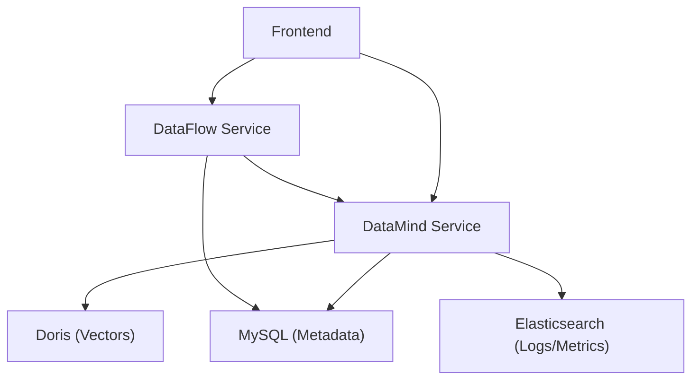

**Diagram sources**
- [services/datamind/main.py:28-63](file://services/datamind/main.py#L28-L63)
- [services/dataflow/tasks/executor.py:482-588](file://services/dataflow/tasks/executor.py#L482-L588)
- [README.md:28-66](file://README.md#L28-L66)

**Section sources**
- [README.md:28-66](file://README.md#L28-L66)
- [services/datamind/main.py:28-63](file://services/datamind/main.py#L28-L63)

## Core Components
- Agent Router: routes user intent to the best-suited agent using regex quick-route and LLM-based classification; supports forced routing and fallbacks.
- Pipeline Orchestrator: selects Quick/Deep/Agent modes; initializes agents lazily; streams progress events.
- Configurable Agent: DB-driven agent that binds MCP tools and datasources, runs autonomous tool-calling loops with protection limits.
- RAG Retriever: hybrid sparse (BM25) + dense (vector) retrieval over table/column metadata, SQL templates, business terms, relations; includes sensitive column filtering and information_schema fallback.
- Scheduled Task Executor: Celery-backed executor supporting query, agent, and MCP modes; generates reports from templates; sends notifications; persists logs and reports.
- Dashboard UI: G2-based chart rendering with time aggregation, grouping, and many chart types; store-managed refresh and parameterization.
- Cache Factory: pluggable local or Redis cache with TTL and stats.

**Section sources**
- [services/datamind/agent/router.py:1-266](file://services/datamind/agent/router.py#L1-L266)
- [services/datamind/nl2sql/orchestrator/pipeline_orchestrator.py:1-237](file://services/datamind/nl2sql/orchestrator/pipeline_orchestrator.py#L1-L237)
- [services/datamind/agent/configurable_agent.py:1-233](file://services/datamind/agent/configurable_agent.py#L1-L233)
- [services/datamind/rag/rag_retriever.py:1-800](file://services/datamind/rag/rag_retriever.py#L1-L800)
- [services/dataflow/tasks/executor.py:482-800](file://services/dataflow/tasks/executor.py#L482-L800)
- [frontend/src/components/DashboardChart.tsx:1-800](file://frontend/src/components/DashboardChart.tsx#L1-L800)
- [services/shared/common/cache/factory.py:1-130](file://services/shared/common/cache/factory.py#L1-L130)

## Architecture Overview
The system orchestrates natural language queries through three modes:
- Quick: fast path for SQL-only queries
- Deep: full RAG + loop engineering without agent routing
- Agent: autonomous multi-agent planning with MCP tools

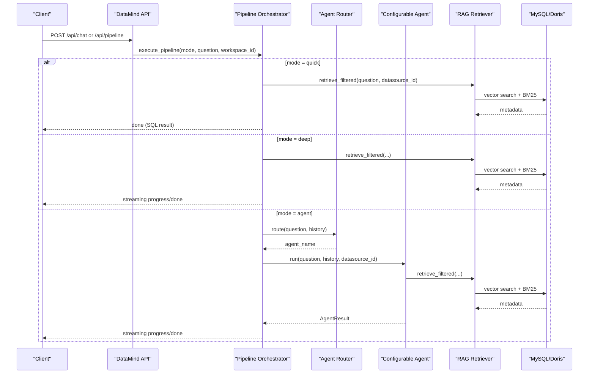

**Diagram sources**
- [services/datamind/nl2sql/orchestrator/pipeline_orchestrator.py:73-237](file://services/datamind/nl2sql/orchestrator/pipeline_orchestrator.py#L73-L237)
- [services/datamind/agent/router.py:167-266](file://services/datamind/agent/router.py#L167-L266)
- [services/datamind/rag/rag_retriever.py:753-786](file://services/datamind/rag/rag_retriever.py#L753-L786)

## Detailed Component Analysis

### Multi-Workspace Setup and Resource Isolation
- Workspaces isolate datasources, agents, and MCP servers per tenant.
- Frontend exposes workspace CRUD and resource binding APIs.
- Backend services scope operations by workspace_id for tasks, logs, and resources.

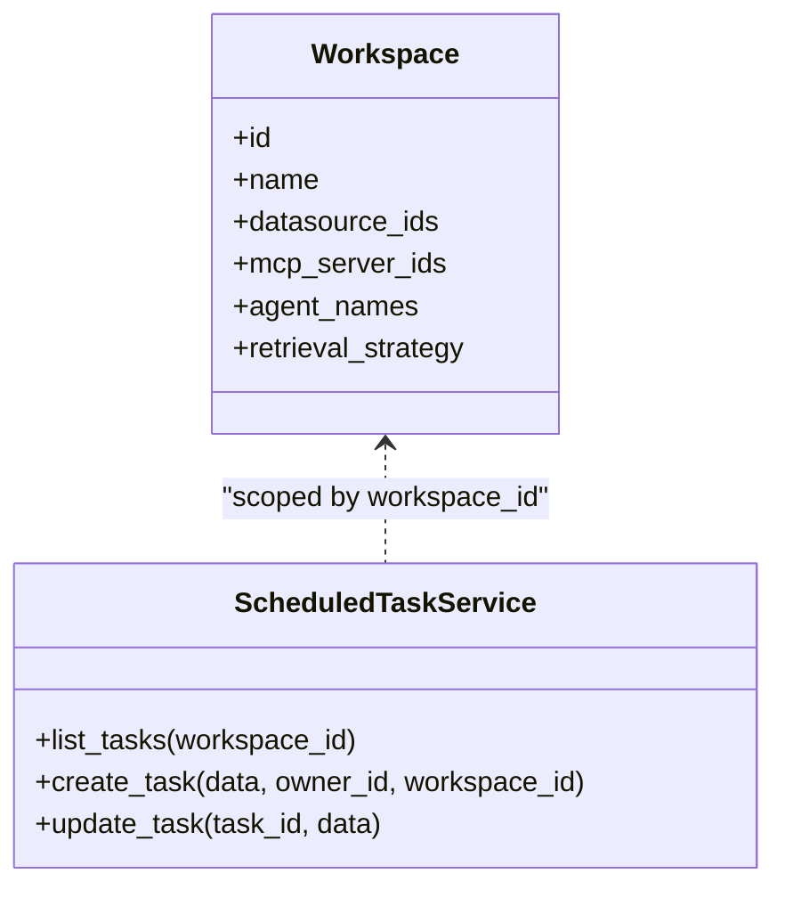

**Diagram sources**
- [frontend/src/api/workspace.ts:1-141](file://frontend/src/api/workspace.ts#L1-L141)
- [services/dataflow/services/scheduled_task_service.py:30-108](file://services/dataflow/services/scheduled_task_service.py#L30-L108)

**Section sources**
- [frontend/src/api/workspace.ts:1-141](file://frontend/src/api/workspace.ts#L1-L141)
- [services/dataflow/services/scheduled_task_service.py:30-108](file://services/dataflow/services/scheduled_task_service.py#L30-L108)

### Custom Agent Development
- Create a DB-configured agent with system prompt, MCP bindings, datasource bindings, and optional extra config.
- The configurable agent collects available tools, builds a system prompt, and executes an autonomous loop with protection limits.

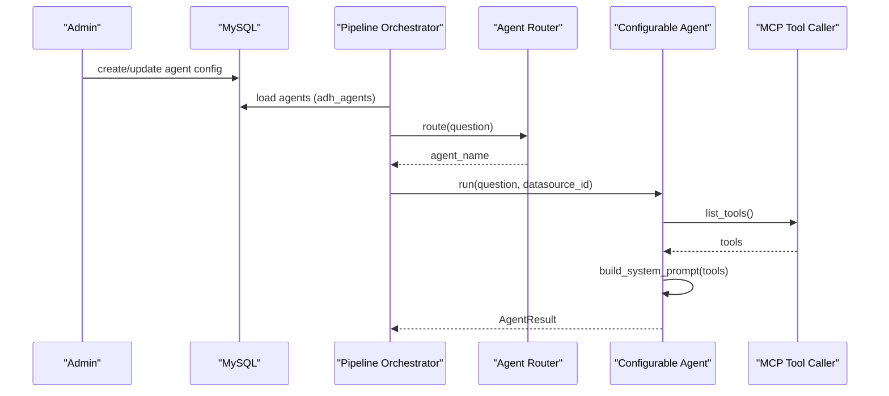

**Diagram sources**
- [services/datamind/nl2sql/orchestrator/pipeline_orchestrator.py:18-70](file://services/datamind/nl2sql/orchestrator/pipeline_orchestrator.py#L18-L70)
- [services/datamind/agent/configurable_agent.py:21-156](file://services/datamind/agent/configurable_agent.py#L21-L156)
- [services/datamind/agent/router.py:167-266](file://services/datamind/agent/router.py#L167-L266)

**Section sources**
- [services/datamind/agent/configurable_agent.py:21-156](file://services/datamind/agent/configurable_agent.py#L21-L156)
- [services/datamind/nl2sql/orchestrator/pipeline_orchestrator.py:18-70](file://services/datamind/nl2sql/orchestrator/pipeline_orchestrator.py#L18-L70)

### Complex RAG Configurations
- Hybrid retrieval combines BM25 sparse and vector dense ranking via Reciprocal Rank Fusion.
- Supports target table boosting, keyword expansion, sensitive column filtering, and information_schema fallback.
- Retrieves table info, column metadata, SQL templates, business terms, and table relations.

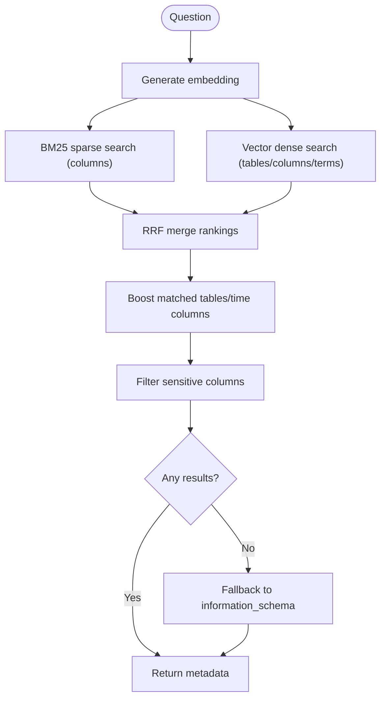

**Diagram sources**
- [services/datamind/rag/rag_retriever.py:369-463](file://services/datamind/rag/rag_retriever.py#L369-L463)
- [services/datamind/rag/rag_retriever.py:753-786](file://services/datamind/rag/rag_retriever.py#L753-L786)

**Section sources**
- [services/datamind/rag/rag_retriever.py:369-463](file://services/datamind/rag/rag_retriever.py#L369-L463)
- [services/datamind/rag/rag_retriever.py:753-786](file://services/datamind/rag/rag_retriever.py#L753-L786)

### Enterprise Integration Patterns
- MCP integration enables external tool usage within agents.
- Scheduled tasks support query, agent, and MCP modes with report generation and multi-channel notifications.
- Workspace-scoped resource binding isolates integrations per tenant.

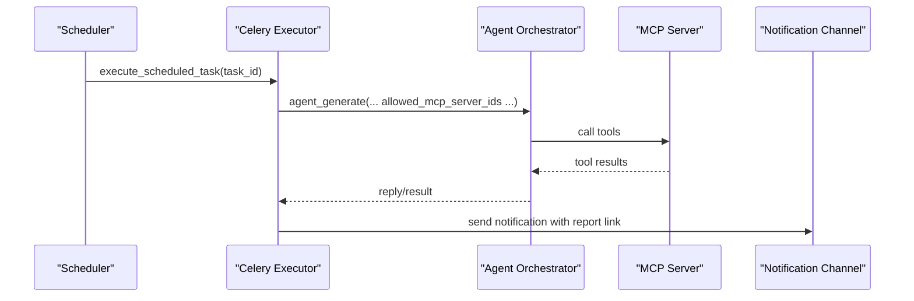

**Diagram sources**
- [services/dataflow/tasks/executor.py:482-588](file://services/dataflow/tasks/executor.py#L482-L588)
- [services/dataflow/tasks/executor.py:198-247](file://services/dataflow/tasks/executor.py#L198-L247)

**Section sources**
- [services/dataflow/tasks/executor.py:482-588](file://services/dataflow/tasks/executor.py#L482-L588)
- [services/dataflow/tasks/executor.py:198-247](file://services/dataflow/tasks/executor.py#L198-L247)

### Orchestration of Multiple Agents for Sophisticated Analysis
- The orchestrator initializes agents lazily and can dispatch to specialized sub-agents based on intent.
- Protection mechanisms include max iterations, timeouts, and doom-loop detection.

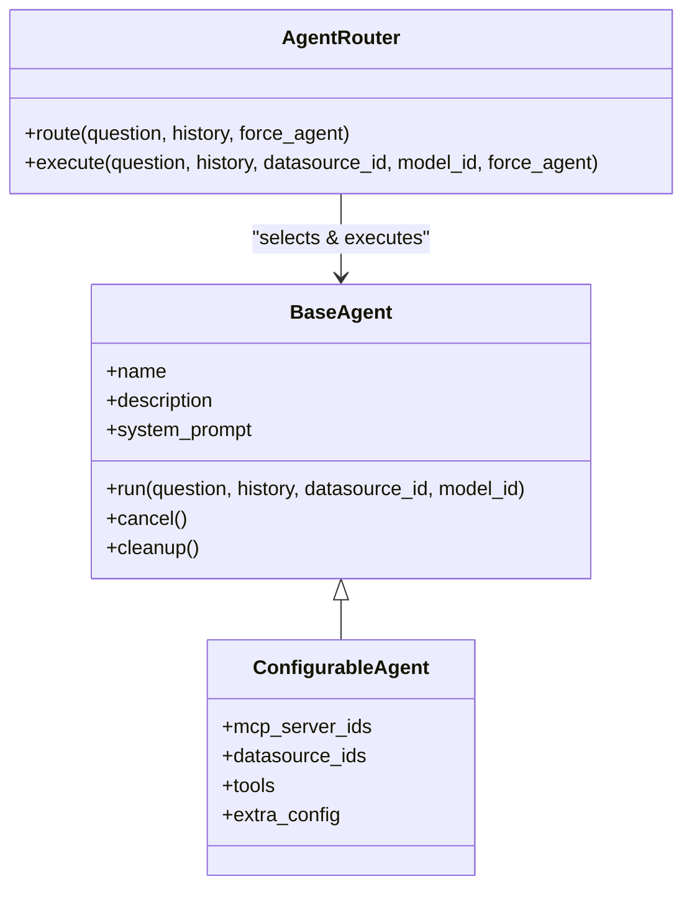

**Diagram sources**
- [services/datamind/agent/base.py:17-129](file://services/datamind/agent/base.py#L17-L129)
- [services/datamind/agent/configurable_agent.py:21-156](file://services/datamind/agent/configurable_agent.py#L21-L156)
- [services/datamind/agent/router.py:167-266](file://services/datamind/agent/router.py#L167-L266)

**Section sources**
- [services/datamind/agent/base.py:17-129](file://services/datamind/agent/base.py#L17-L129)
- [services/datamind/agent/router.py:167-266](file://services/datamind/agent/router.py#L167-L266)

### Advanced Scheduling with Conditional Logic
- Tasks can be configured with cron expressions, timezones, timeouts, retries, and channels.
- Execution modes: direct SQL, agent-driven analysis, or MCP-driven automation.
- Reports are generated using style-aware templates and persisted with access control.

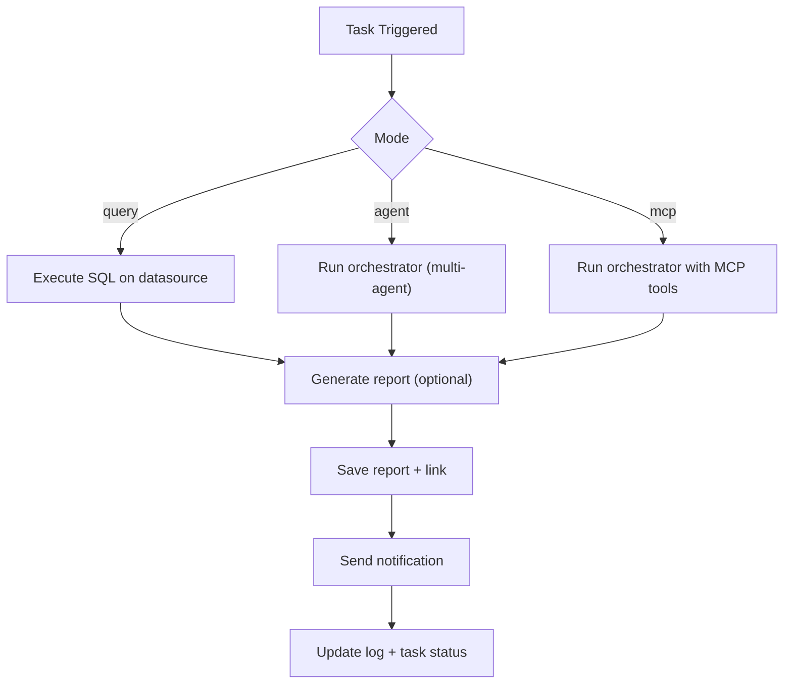

**Diagram sources**
- [services/dataflow/tasks/executor.py:482-588](file://services/dataflow/tasks/executor.py#L482-L588)
- [services/dataflow/services/scheduled_task_service.py:71-108](file://services/dataflow/services/scheduled_task_service.py#L71-L108)

**Section sources**
- [services/dataflow/tasks/executor.py:482-588](file://services/dataflow/tasks/executor.py#L482-L588)
- [services/dataflow/services/scheduled_task_service.py:71-108](file://services/dataflow/services/scheduled_task_service.py#L71-L108)

### Large-Scale Data Processing and Real-Time Analytics Pipelines
- Use agent mode for autonomous planning across multiple steps and tools.
- Leverage RAG to select relevant tables/columns efficiently before querying.
- For real-time dashboards, use server-side pagination and incremental refresh.

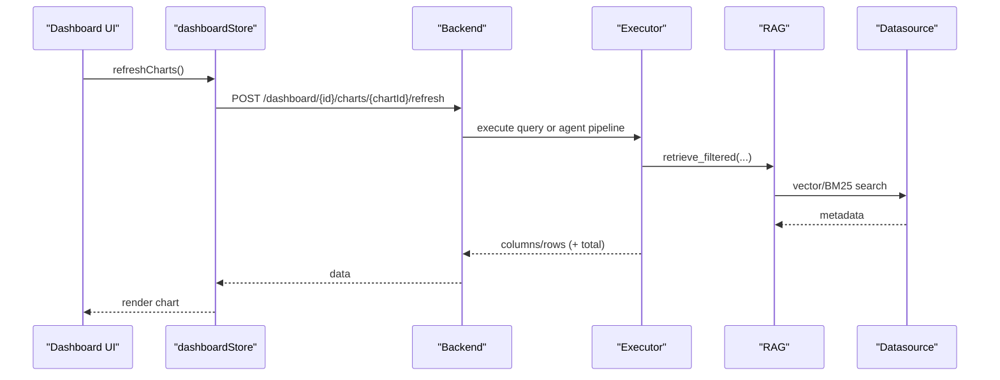

**Diagram sources**
- [frontend/src/stores/dashboardStore.ts:270-327](file://frontend/src/stores/dashboardStore.ts#L270-L327)
- [services/datamind/rag/rag_retriever.py:753-786](file://services/datamind/rag/rag_retriever.py#L753-L786)

**Section sources**
- [frontend/src/stores/dashboardStore.ts:270-327](file://frontend/src/stores/dashboardStore.ts#L270-L327)

### Cross-Database Queries
- RAG retrieves metadata across datasources and boosts results by workspace filters.
- Executors can target specific datasources per task or agent configuration.

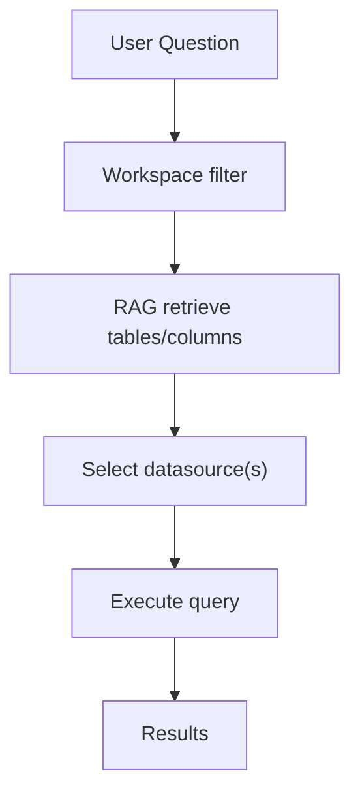

**Diagram sources**
- [services/datamind/rag/rag_retriever.py:74-142](file://services/datamind/rag/rag_retriever.py#L74-L142)
- [services/dataflow/tasks/executor.py:43-77](file://services/dataflow/tasks/executor.py#L43-L77)

**Section sources**
- [services/datamind/rag/rag_retriever.py:74-142](file://services/datamind/rag/rag_retriever.py#L74-L142)
- [services/dataflow/tasks/executor.py:43-77](file://services/dataflow/tasks/executor.py#L43-L77)

### Advanced Dashboard Techniques
- Custom chart development: extend G2 specs for new visualizations; support time aggregation, grouping, and series.
- Real-time updates: store-managed refresh with server-side pagination and count SQL.
- Complex filtering: global and cross filters, page parameters, and dynamic query composition.

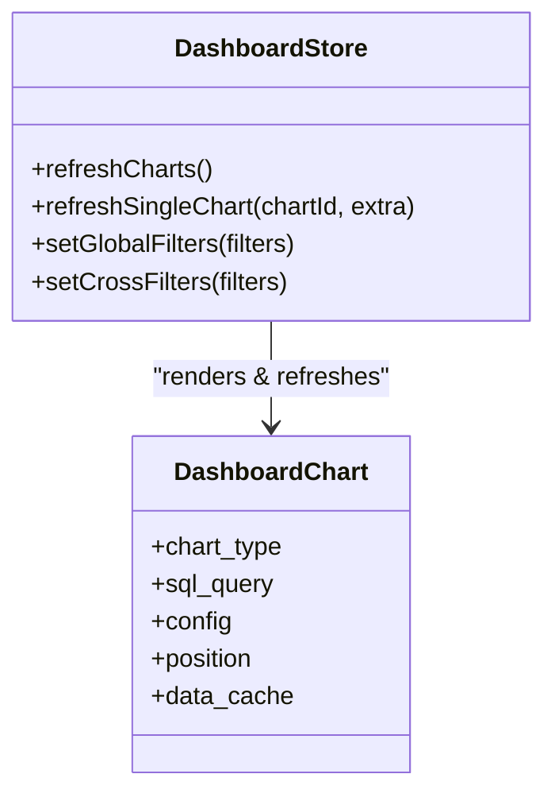

**Diagram sources**
- [frontend/src/components/DashboardChart.tsx:225-800](file://frontend/src/components/DashboardChart.tsx#L225-L800)
- [frontend/src/stores/dashboardStore.ts:270-327](file://frontend/src/stores/dashboardStore.ts#L270-L327)

**Section sources**
- [frontend/src/components/DashboardChart.tsx:225-800](file://frontend/src/components/DashboardChart.tsx#L225-L800)
- [frontend/src/stores/dashboardStore.ts:270-327](file://frontend/src/stores/dashboardStore.ts#L270-L327)

### API Automation and Programmatic Access via SDKs
- DataMind exposes REST endpoints for chat, pipeline, agent, knowledge, query, history, playground, and model config.
- Frontend SDK modules provide typed clients for embedding and dashboard components.

**Diagram sources**
- [services/datamind/main.py:28-63](file://services/datamind/main.py#L28-L63)

**Section sources**
- [services/datamind/main.py:28-63](file://services/datamind/main.py#L28-L63)

## Dependency Analysis
Key dependencies and coupling:
- Pipeline Orchestrator depends on Agent Router and RAG retriever; initializes agents lazily.
- Configurable Agent depends on MCP tool caller and AgentLoop; reads DB config.
- Scheduled Task Executor depends on DataMind orchestrator for agent mode and on notification/report services.
- Dashboard UI depends on backend APIs and uses G2 for rendering.

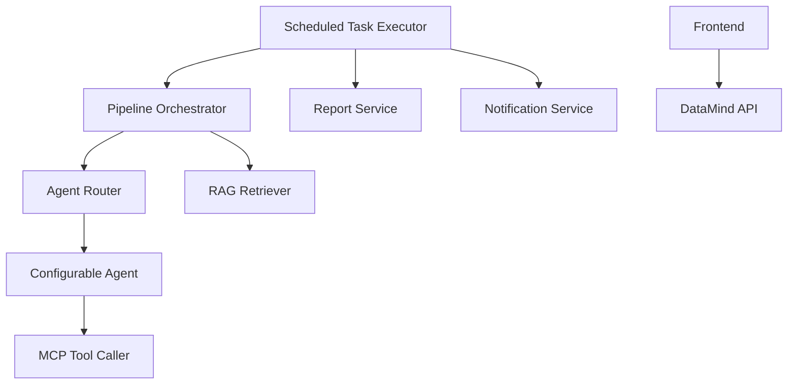

**Diagram sources**
- [services/datamind/nl2sql/orchestrator/pipeline_orchestrator.py:73-237](file://services/datamind/nl2sql/orchestrator/pipeline_orchestrator.py#L73-L237)
- [services/datamind/agent/router.py:167-266](file://services/datamind/agent/router.py#L167-L266)
- [services/datamind/agent/configurable_agent.py:157-176](file://services/datamind/agent/configurable_agent.py#L157-L176)
- [services/dataflow/tasks/executor.py:482-588](file://services/dataflow/tasks/executor.py#L482-L588)

**Section sources**
- [services/datamind/nl2sql/orchestrator/pipeline_orchestrator.py:73-237](file://services/datamind/nl2sql/orchestrator/pipeline_orchestrator.py#L73-L237)
- [services/dataflow/tasks/executor.py:482-588](file://services/dataflow/tasks/executor.py#L482-L588)

## Performance Considerations
- Use Quick mode for simple SQL queries to minimize latency.
- Enable hybrid RAG (BM25 + vector) with RRF fusion for better recall and precision.
- Apply workspace filters to reduce search space in RAG.
- Configure cache backend (local or Redis) with appropriate TTL for metadata and frequent queries.
- Limit agent iterations and set timeouts to prevent runaway loops.
- Use server-side pagination and count SQL for large datasets in dashboards.
- Pre-warm agent registry on startup to avoid cold-start delays.

[No sources needed since this section provides general guidance]

## Troubleshooting Guide
Common issues and resolutions:
- Agent routing failures: check active agents and route patterns; verify LLM routing fallback to sql_agent.
- RAG empty results: ensure embeddings exist; fall back to information_schema; validate datasource filters.
- Scheduled task timeouts: mark stale running logs as timeout; adjust max_iterations and timeouts.
- Notification failures: verify channel configuration and message template variables.
- Cache connectivity: if Redis unavailable, falls back to local cache automatically.

**Section sources**
- [services/datamind/agent/router.py:97-165](file://services/datamind/agent/router.py#L97-L165)
- [services/datamind/rag/rag_retriever.py:753-786](file://services/datamind/rag/rag_retriever.py#L753-L786)
- [services/dataflow/services/scheduled_task_service.py:688-709](file://services/dataflow/services/scheduled_task_service.py#L688-L709)
- [services/shared/common/cache/factory.py:77-108](file://services/shared/common/cache/factory.py#L77-L108)

## Conclusion
AI-DataHub provides a robust foundation for advanced scenarios: multi-workspace isolation, customizable agents, sophisticated RAG pipelines, enterprise integrations via MCP, scalable scheduling, and powerful dashboards. By leveraging hybrid retrieval, agent orchestration, and flexible caching, teams can build production-grade analytics platforms that scale and adapt to evolving business needs.

[No sources needed since this section summarizes without analyzing specific files]