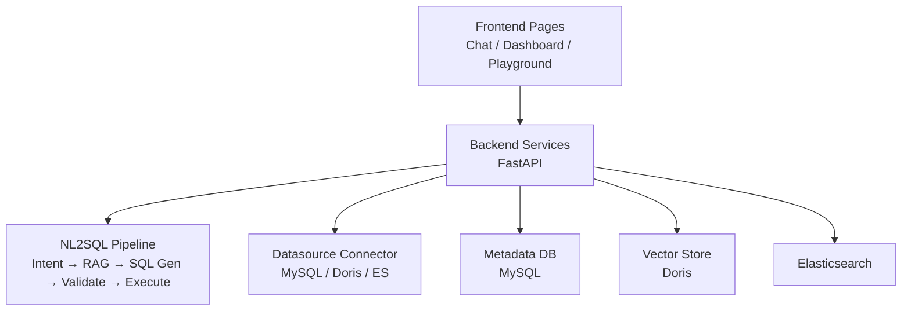
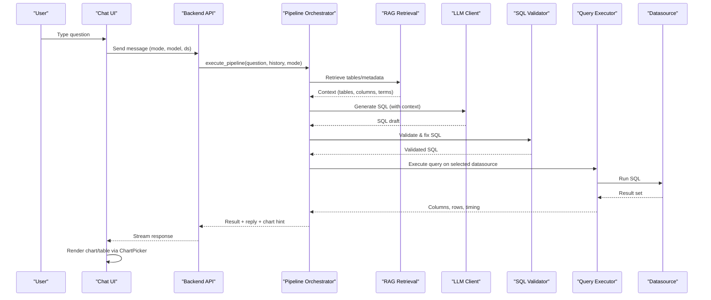
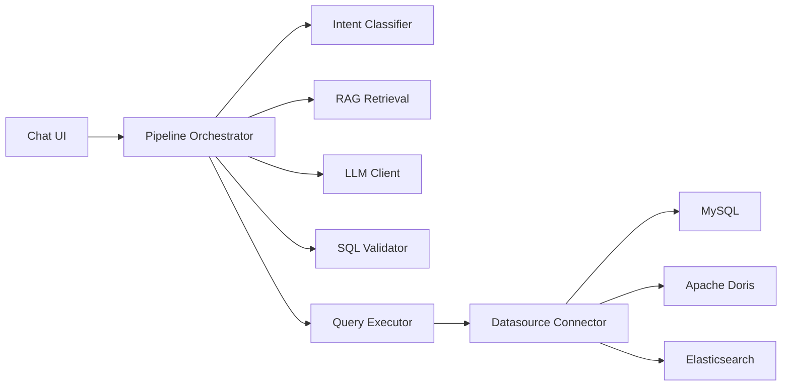
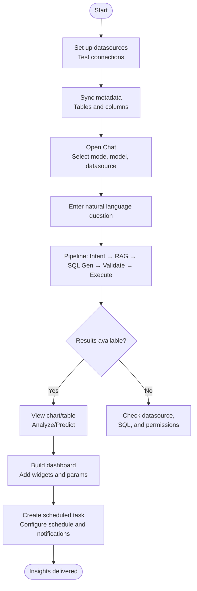

# Basic Usage Examples

<cite>
**Referenced Files in This Document**
- [README.md](file://README.md)
- [datasource-config.md](file://docs/guides/datasource-config.md)
- [scheduled-tasks.md](file://docs/guides/scheduled-tasks.md)
- [Chat.tsx](file://frontend/src/pages/Chat.tsx)
- [DashboardEditor.tsx](file://frontend/src/pages/DashboardEditor.tsx)
- [Playground.tsx](file://frontend/src/pages/Playground.tsx)
- [ChartPicker.tsx](file://frontend/src/components/ChartPicker.tsx)
- [DashboardExportImport.tsx](file://frontend/src/components/DashboardExportImport.tsx)
- [DashboardChart.tsx](file://frontend/src/components/DashboardChart.tsx)
- [datasource_db.py](file://services/shared/common/db/datasource_db.py)
- [query_executor.py](file://services/datamind/nl2sql/sql/query_executor.py)
- [quick_pipeline.py](file://services/datamind/nl2sql/orchestrator/quick_pipeline.py)
- [pipeline_orchestrator.py](file://services/datamind/nl2sql/orchestrator/pipeline_orchestrator.py)
- [intent_classifier.py](file://services/datamind/nl2sql/intent/intent_classifier.py)
- [analysis_agents_migration.sql](file://docker/mysql/analysis_agents_migration.sql)
</cite>

## Table of Contents
1. [Introduction](#introduction)
2. [Project Structure](#project-structure)
3. [Core Components](#core-components)
4. [Architecture Overview](#architecture-overview)
5. [Detailed Component Analysis](#detailed-component-analysis)
6. [Dependency Analysis](#dependency-analysis)
7. [Performance Considerations](#performance-considerations)
8. [Troubleshooting Guide](#troubleshooting-guide)
9. [Conclusion](#conclusion)
10. [Appendices](#appendices)

## Introduction
This guide provides practical, step-by-step examples to get started with AI-DataHub. You will learn how to:
- Set up data sources (MySQL, Apache Doris, Elasticsearch)
- Connect to databases and sync metadata
- Create your first natural language query using the chat interface
- Build a simple dashboard with charts and parameters
- Configure basic scheduled tasks for automated reporting
- Use the SQL playground for experimentation and testing
- Apply typical business scenarios: sales analysis, user behavior tracking, and performance monitoring

The system supports three query modes:
- Quick: fast RAG + SQL generation and execution
- Deep: enhanced loop with metadata supplement and self-correction
- Agent: autonomous tool calling with MCP integration

## Project Structure
AI-DataHub is organized into frontend (React), backend services (FastAPI), and shared components. Key areas for this guide:
- Frontend pages: Chat, Dashboard Editor, Playground
- Backend NL2SQL pipeline: intent classification, prompt building, SQL validation, execution
- Data source management and connectors
- Scheduled task configuration and execution

**Diagram sources**
- [Chat.tsx:38-800](file://frontend/src/pages/Chat.tsx#L38-L800)
- [DashboardEditor.tsx:16-337](file://frontend/src/pages/DashboardEditor.tsx#L16-L337)
- [Playground.tsx:54-531](file://frontend/src/pages/Playground.tsx#L54-L531)
- [quick_pipeline.py:1-27](file://services/datamind/nl2sql/orchestrator/quick_pipeline.py#L1-L27)
- [datasource_db.py:34-76](file://services/shared/common/db/datasource_db.py#L34-L76)

**Section sources**
- [README.md:28-66](file://README.md#L28-L66)
- [README.md:146-164](file://README.md#L146-L164)

## Core Components
- Chat Interface: Natural language queries, mode selection (Quick/Deep/Agent), datasource/model selectors, feedback, export, and visualization via ChartPicker.
- Dashboard Editor: Drag-and-drop canvas, chart templates, property panel, parameter binding, and export/import.
- Playground: SQL editor, table/column browser, saved queries, result table/chart views.
- NL2SQL Pipeline: Intent classifier, RAG retrieval, LLM SQL generation, validation, and execution against configured datasources.
- Datasource Management: Connection creation, test, and metadata sync; connector abstraction for MySQL/Doris/ES.

**Section sources**
- [Chat.tsx:38-800](file://frontend/src/pages/Chat.tsx#L38-L800)
- [DashboardEditor.tsx:16-337](file://frontend/src/pages/DashboardEditor.tsx#L16-L337)
- [Playground.tsx:54-531](file://frontend/src/pages/Playground.tsx#L54-L531)
- [quick_pipeline.py:1-27](file://services/datamind/nl2sql/orchestrator/quick_pipeline.py#L1-L27)
- [datasource_db.py:34-76](file://services/shared/common/db/datasource_db.py#L34-L76)

## Architecture Overview
End-to-end flow from natural language question to insight:

**Diagram sources**
- [pipeline_orchestrator.py:105-118](file://services/datamind/nl2sql/orchestrator/pipeline_orchestrator.py#L105-L118)
- [quick_pipeline.py:1-27](file://services/datamind/nl2sql/orchestrator/quick_pipeline.py#L1-L27)
- [intent_classifier.py:82-101](file://services/datamind/nl2sql/intent/intent_classifier.py#L82-L101)
- [query_executor.py:1-36](file://services/datamind/nl2sql/sql/query_executor.py#L1-L36)
- [datasource_db.py:34-76](file://services/shared/common/db/datasource_db.py#L34-L76)
- [Chat.tsx:38-800](file://frontend/src/pages/Chat.tsx#L38-L800)

## Detailed Component Analysis

### 1) Set Up Data Sources (MySQL, Apache Doris, Elasticsearch)
- Navigate to System Configuration → Data Configuration → Data Source Management.
- Click “New Data Source” and fill:
  - Name, Database Type (MySQL, Doris, Elasticsearch)
  - Host, Port, Database, Username, Password
  - Advanced: timeouts, connection pool size, SSL
- Test connection, then Save.
- Sync table metadata to enable NL2SQL discovery.

Practical tips:
- Use read-only accounts for security.
- Adjust timeouts based on network and query complexity.
- For Elasticsearch, ensure index names are quoted in queries.

**Section sources**
- [datasource-config.md:16-60](file://docs/guides/datasource-config.md#L16-L60)
- [datasource-config.md:84-98](file://docs/guides/datasource-config.md#L84-L98)
- [datasource_db.py:34-76](file://services/shared/common/db/datasource_db.py#L34-L76)

### 2) Connect to Databases and Execute Queries
- In Chat, select a datasource (for Quick/Deep modes).
- Enter a natural language question; choose mode (Quick/Deep/Agent) and model.
- The system retrieves metadata, generates SQL, validates it, executes, and returns results with recommended chart types.

Example flows:
- Quick: Fast path for simple queries.
- Deep: Loop with metadata supplement and correction.
- Agent: Autonomous tool calls and external integrations.

**Section sources**
- [Chat.tsx:38-800](file://frontend/src/pages/Chat.tsx#L38-L800)
- [quick_pipeline.py:1-27](file://services/datamind/nl2sql/orchestrator/quick_pipeline.py#L1-L27)
- [pipeline_orchestrator.py:105-118](file://services/datamind/nl2sql/orchestrator/pipeline_orchestrator.py#L105-L118)

### 3) Your First Natural Language Query
Steps:
- Open Chat page.
- Choose datasource and model.
- Type a question like “Show last 7 days’ order counts by region.”
- Review generated SQL, view chart or table, and optionally analyze or predict trends.

Expected responses:
- Text summary explaining findings
- Recommended chart type (e.g., line for trend)
- Interactive tabs: Chart, Table, SQL

**Section sources**
- [Chat.tsx:520-800](file://frontend/src/pages/Chat.tsx#L520-L800)
- [ChartPicker.tsx:17-31](file://frontend/src/components/ChartPicker.tsx#L17-L31)

### 4) Building Simple Dashboards
Steps:
- Go to Dashboard Editor.
- Drag chart types from the component library onto the canvas.
- Bind data by selecting datasource and writing SQL or using templates.
- Add widgets (labels, numbers, date ranges) and bind them to page parameters.
- Save and share via export/import JSON.

Key features:
- Templates for common dashboards
- Property panel for chart configuration
- Parameter binding for interactive filters
- Export/Import JSON for sharing

**Section sources**
- [DashboardEditor.tsx:16-337](file://frontend/src/pages/DashboardEditor.tsx#L16-L337)
- [DashboardExportImport.tsx:22-62](file://frontend/src/components/DashboardExportImport.tsx#L22-L62)
- [DashboardChart.tsx:1141-1176](file://frontend/src/components/DashboardChart.tsx#L1141-L1176)

### 5) Configuring Basic Scheduled Tasks
Steps:
- Navigate to System Configuration → Automation → Scheduled Tasks.
- Create a new task:
  - Name, description
  - Execution mode: SQL or Agent
  - Datasource selection
  - Schedule (cron expression)
  - Notification channels (DingTalk, Feishu, WeCom, Email, Webhook)
- Save and run manually to verify.

Use cases:
- Daily sales report at 9 AM
- Hourly metrics aggregation
- Weekly retention summaries

**Section sources**
- [scheduled-tasks.md:7-82](file://docs/guides/scheduled-tasks.md#L7-L82)
- [scheduled-tasks.md:84-134](file://docs/guides/scheduled-tasks.md#L84-L134)

### 6) Using the Playground for Experimentation
- Select a datasource and browse tables/columns.
- Write SQL and execute (Ctrl+Enter).
- View results in table or chart tabs.
- Save queries or mark as datasets for reuse.

Tips:
- For Elasticsearch, wrap index names in quotes.
- Use column hints to speed up query development.

**Section sources**
- [Playground.tsx:54-531](file://frontend/src/pages/Playground.tsx#L54-L531)

### 7) Business Scenarios and Example Workflows

#### Sales Analysis
- Goal: Track daily orders and revenue over time.
- Steps:
  - In Chat, ask “Daily order count and total amount for the past month.”
  - Choose line chart for trend; filter by region if needed.
  - Save as dashboard widget; add date range widget to filter.

Expected outcome:
- Time series chart showing order volume and revenue
- Summary insights about peaks and dips

**Section sources**
- [Chat.tsx:520-800](file://frontend/src/pages/Chat.tsx#L520-L800)
- [ChartPicker.tsx:99-107](file://frontend/src/components/ChartPicker.tsx#L99-L107)

#### User Behavior Tracking
- Goal: Analyze traffic, conversion funnel, and retention.
- Steps:
  - Use built-in agents for traffic, funnel, retention (registered in metadata).
  - Ask “Conversion funnel from visit to purchase over last week.”
  - Visualize steps and identify drop-off points.

Expected outcome:
- Funnel chart with step-wise conversion rates
- Recommendations to improve bottlenecks

**Section sources**
- [analysis_agents_migration.sql:1-14](file://docker/mysql/analysis_agents_migration.sql#L1-L14)
- [Chat.tsx:38-800](file://frontend/src/pages/Chat.tsx#L38-L800)

#### Performance Monitoring
- Goal: Monitor logs and metrics via Elasticsearch.
- Steps:
  - Configure Elasticsearch datasource.
  - In Chat or Playground, query logs by index and fields.
  - Create dashboard widgets for error rates and latency.

Expected outcome:
- Real-time charts of error frequency and latency trends
- Alerts via scheduled tasks and notifications

**Section sources**
- [datasource_db.py:52-62](file://services/shared/common/db/datasource_db.py#L52-L62)
- [Playground.tsx:354-356](file://frontend/src/pages/Playground.tsx#L354-L356)

### 8) Chat Interface Best Practices
- Mode selection:
  - Quick: simple, fast queries
  - Deep: complex multi-table or iterative refinement
  - Agent: advanced tool calling and external integrations
- Model selection: pick default or specific model per workspace
- Retrieval strategy: hybrid (BM25 + vector) recommended for accuracy
- Feedback: thumbs up/down to improve future results

**Section sources**
- [Chat.tsx:38-800](file://frontend/src/pages/Chat.tsx#L38-L800)
- [intent_classifier.py:82-101](file://services/datamind/nl2sql/intent/intent_classifier.py#L82-L101)

### 9) Chart Selection and Data Binding
- ChartPicker auto-detects numeric/string columns and suggests chart types.
- Bind X/Y axes and optional series grouping.
- Filter series dynamically in the UI.
- Fullscreen view for detailed inspection.

**Section sources**
- [ChartPicker.tsx:33-111](file://frontend/src/components/ChartPicker.tsx#L33-L111)
- [ChartPicker.tsx:113-195](file://frontend/src/components/ChartPicker.tsx#L113-L195)

### 10) Sharing Dashboards
- Export dashboard configuration to JSON for backup or sharing.
- Import JSON to recreate dashboards in other environments.
- Copy JSON to clipboard for quick distribution.

**Section sources**
- [DashboardExportImport.tsx:22-62](file://frontend/src/components/DashboardExportImport.tsx#L22-L62)
- [DashboardExportImport.tsx:115-178](file://frontend/src/components/DashboardExportImport.tsx#L115-L178)

## Dependency Analysis
High-level dependencies between components involved in end-to-end usage:

**Diagram sources**
- [Chat.tsx:38-800](file://frontend/src/pages/Chat.tsx#L38-L800)
- [pipeline_orchestrator.py:105-118](file://services/datamind/nl2sql/orchestrator/pipeline_orchestrator.py#L105-L118)
- [intent_classifier.py:82-101](file://services/datamind/nl2sql/intent/intent_classifier.py#L82-L101)
- [query_executor.py:1-36](file://services/datamind/nl2sql/sql/query_executor.py#L1-L36)
- [datasource_db.py:34-76](file://services/shared/common/db/datasource_db.py#L34-L76)

**Section sources**
- [README.md:28-66](file://README.md#L28-L66)
- [quick_pipeline.py:1-27](file://services/datamind/nl2sql/orchestrator/quick_pipeline.py#L1-L27)

## Performance Considerations
- Use Quick mode for simple queries to reduce latency.
- Tune retrieval strategies (hybrid recommended) for better accuracy.
- Adjust datasource timeouts and connection pool sizes based on workload.
- Avoid overly broad queries; use filters and limits where appropriate.
- Leverage cached metadata and pre-synced schemas to speed up NL2SQL.

[No sources needed since this section provides general guidance]

## Troubleshooting Guide
Common issues and resolutions:
- Connection failures: Verify host/port, credentials, firewall rules, and service status.
- Query errors: Check SQL syntax, field names, and datasource dialect specifics (e.g., quoting ES indices).
- Slow queries: Add filters, limit results, optimize indexes, and adjust timeouts.
- Scheduled task failures: Inspect logs, validate cron expressions, and confirm notification channel configurations.

**Section sources**
- [datasource-config.md:108-124](file://docs/guides/datasource-config.md#L108-L124)
- [scheduled-tasks.md:119-134](file://docs/guides/scheduled-tasks.md#L119-L134)
- [Playground.tsx:116-142](file://frontend/src/pages/Playground.tsx#L116-L142)

## Conclusion
You now have a practical foundation to use AI-DataHub effectively:
- Configure datasources and sync metadata
- Ask natural language questions and visualize results
- Build dashboards with charts and parameters
- Automate reports with scheduled tasks
- Experiment safely in the SQL playground

Start with Quick mode for simplicity, then explore Deep and Agent modes for more complex workflows. Use the playground and feedback mechanisms to refine queries and improve outcomes.

[No sources needed since this section summarizes without analyzing specific files]

## Appendices

### A) End-to-End Workflow Flowchart

[No sources needed since this diagram shows conceptual workflow, not actual code structure]