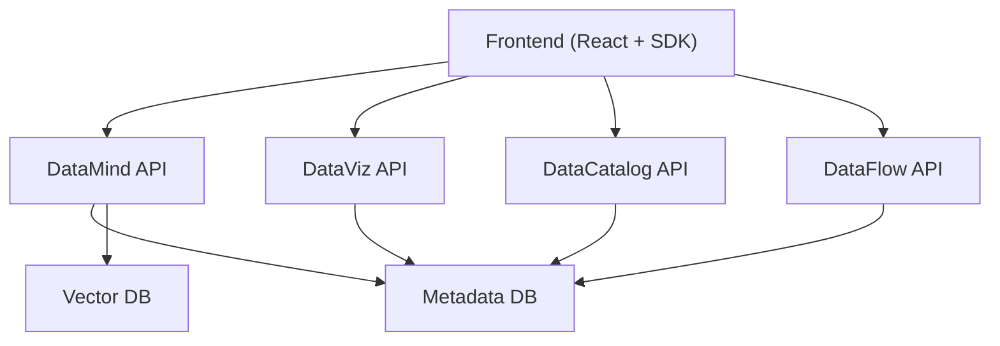
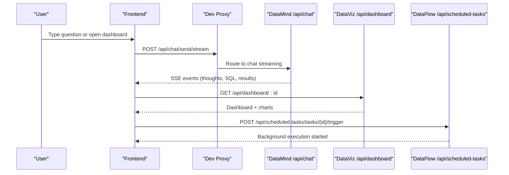
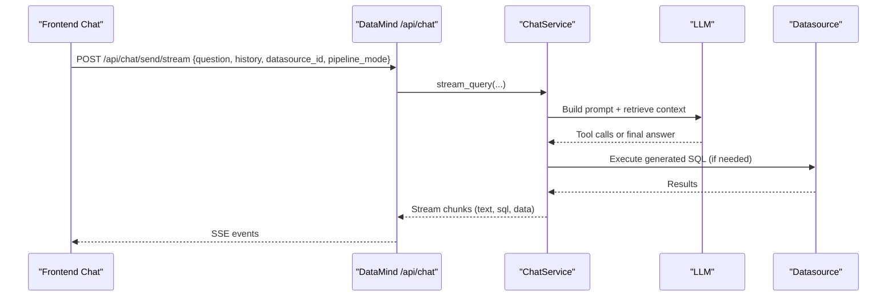
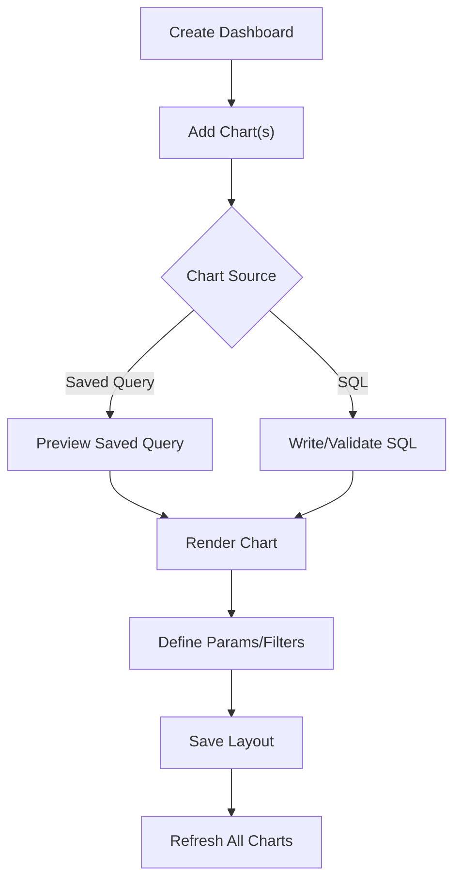
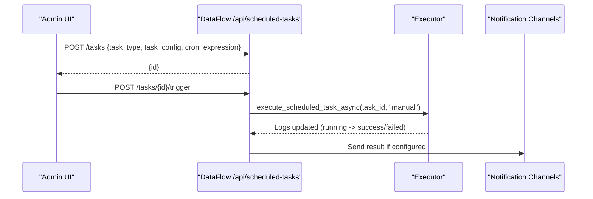
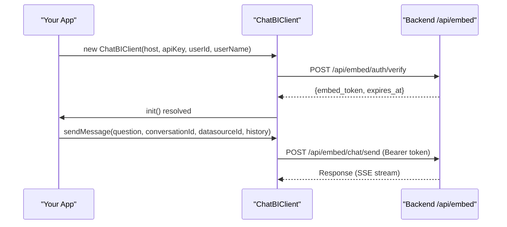
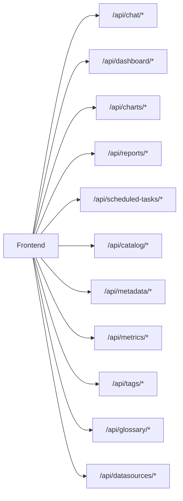

# Examples & Tutorials

<cite>
**Referenced Files in This Document**
- [README.md](file://README.md)
- [services/datamind/main.py](file://services/datamind/main.py)
- [services/dataviz/main.py](file://services/dataviz/main.py)
- [services/datacatalog/main.py](file://services/datacatalog/main.py)
- [services/datamind/api/chat.py](file://services/datamind/api/chat.py)
- [services/dataviz/api/dashboard.py](file://services/dataviz/api/dashboard.py)
- [services/dataflow/api/scheduled.py](file://services/dataflow/api/scheduled.py)
- [frontend/sdk/src/index.ts](file://frontend/sdk/src/index.ts)
- [frontend/sdk/src/api-client.ts](file://frontend/sdk/src/api-client.ts)
- [frontend/vite.config.ts](file://frontend/vite.config.ts)
- [frontend/src/pages/Chat.tsx](file://frontend/src/pages/Chat.tsx)
- [frontend/src/pages/Dashboard.tsx](file://frontend/src/pages/Dashboard.tsx)
- [docs/guides/datasource-config.md](file://docs/guides/datasource-config.md)
- [docs/guides/scheduled-tasks.md](file://docs/guides/scheduled-tasks.md)
</cite>

## Table of Contents
1. Introduction
2. Project Structure
3. Core Components
4. Architecture Overview
5. Detailed Component Analysis
6. Dependency Analysis
7. Performance Considerations
8. Troubleshooting Guide
9. Conclusion
10. Appendices

## Introduction
This document provides practical examples and tutorials for AI-DataHub usage patterns and integration scenarios. It covers business intelligence workflows, data analysis, automated reporting, dashboard creation, API usage, advanced multi-workspace setups, custom chart development, third-party integrations, troubleshooting, performance optimization, and production best practices. You will find step-by-step guides to set up data sources, create custom agents, build interactive dashboards, configure scheduled reports, and automate tasks via APIs.

## Project Structure
AI-DataHub is a microservices-based platform with:
- DataMind: NL2SQL, agent orchestration, RAG, knowledge base
- DataViz: Dashboards, charts, report generation
- DataCatalog: Metadata, metrics, tags, glossary, datasources
- DataFlow: Scheduled tasks, workflows, notifications
- Frontend: React UI with SDK for embedding and programmatic access

**Diagram sources**
- [services/datamind/main.py:28-63](file://services/datamind/main.py#L28-L63)
- [services/dataviz/main.py:38-58](file://services/dataviz/main.py#L38-L58)
- [services/datacatalog/main.py:25-50](file://services/datacatalog/main.py#L25-L50)
- [services/dataflow/api/scheduled.py:1-16](file://services/dataflow/api/scheduled.py#L1-L16)

**Section sources**
- [README.md:28-66](file://README.md#L28-L66)
- [services/datamind/main.py:28-63](file://services/datamind/main.py#L28-L63)
- [services/dataviz/main.py:38-58](file://services/dataviz/main.py#L38-L58)
- [services/datacatalog/main.py:25-50](file://services/datacatalog/main.py#L25-L50)

## Core Components
- Chat/NL2SQL streaming and non-streaming endpoints for natural language queries
- Dashboard CRUD, chart refresh, layout management, snapshots
- Scheduled tasks with cron scheduling, execution logs, notification channels, templates
- Embed SDK for integrating ChatBI and dashboards into external apps
- Frontend pages for chat and dashboard editing/viewing

**Section sources**
- [services/datamind/api/chat.py:21-91](file://services/datamind/api/chat.py#L21-L91)
- [services/dataviz/api/dashboard.py:29-88](file://services/dataviz/api/dashboard.py#L29-L88)
- [services/dataflow/api/scheduled.py:24-86](file://services/dataflow/api/scheduled.py#L24-L86)
- [frontend/sdk/src/index.ts:1-7](file://frontend/sdk/src/index.ts#L1-L7)
- [frontend/sdk/src/api-client.ts:1-168](file://frontend/sdk/src/api-client.ts#L1-L168)

## Architecture Overview
The system exposes REST APIs per service, with the frontend routing requests through proxies. The DataMind service handles NL2SQL and agent flows; DataViz manages dashboards and reports; DataCatalog provides metadata and datasource configuration; DataFlow orchestrates scheduled tasks and notifications.

**Diagram sources**
- [services/datamind/api/chat.py:35-63](file://services/datamind/api/chat.py#L35-L63)
- [services/dataviz/api/dashboard.py:197-212](file://services/dataviz/api/dashboard.py#L197-L212)
- [services/dataflow/api/scheduled.py:185-203](file://services/dataflow/api/scheduled.py#L185-L203)
- [frontend/vite.config.ts:45-54](file://frontend/vite.config.ts#L45-L54)

## Detailed Component Analysis

### Natural Language BI via Chat (Quick/Deep/Agent)
- Use streaming endpoint for real-time insights; non-streaming for batch responses
- Supports conversation history, workspace scoping, datasource selection, model selection, retrieval strategy
- Integrates MCP tools in Agent mode via @mentions in the UI

**Diagram sources**
- [services/datamind/api/chat.py:35-91](file://services/datamind/api/chat.py#L35-L91)
- [frontend/src/pages/Chat.tsx:38-61](file://frontend/src/pages/Chat.tsx#L38-L61)

**Section sources**
- [services/datamind/api/chat.py:21-91](file://services/datamind/api/chat.py#L21-L91)
- [frontend/src/pages/Chat.tsx:38-61](file://frontend/src/pages/Chat.tsx#L38-L61)

### Building Interactive Dashboards
- Create dashboards, add charts, define parameters, cross-filters, auto-refresh, and layouts
- Refresh individual charts or all charts; preview saved queries; manage snapshots from chat executions

**Diagram sources**
- [services/dataviz/api/dashboard.py:109-183](file://services/dataviz/api/dashboard.py#L109-L183)
- [services/dataviz/api/dashboard.py:275-388](file://services/dataviz/api/dashboard.py#L275-L388)
- [frontend/src/pages/Dashboard.tsx:18-33](file://frontend/src/pages/Dashboard.tsx#L18-L33)

**Section sources**
- [services/dataviz/api/dashboard.py:29-88](file://services/dataviz/api/dashboard.py#L29-L88)
- [services/dataviz/api/dashboard.py:109-183](file://services/dataviz/api/dashboard.py#L109-L183)
- [services/dataviz/api/dashboard.py:275-388](file://services/dataviz/api/dashboard.py#L275-L388)
- [frontend/src/pages/Dashboard.tsx:18-33](file://frontend/src/pages/Dashboard.tsx#L18-L33)

### Automated Reporting and Scheduled Tasks
- Create tasks with cron expressions; choose SQL or Agent mode; attach templates and notification channels
- Trigger manually, view logs, update status, cleanup stale logs, and generate reports

**Diagram sources**
- [services/dataflow/api/scheduled.py:111-133](file://services/dataflow/api/scheduled.py#L111-L133)
- [services/dataflow/api/scheduled.py:185-203](file://services/dataflow/api/scheduled.py#L185-L203)
- [services/dataflow/api/scheduled.py:211-290](file://services/dataflow/api/scheduled.py#L211-L290)

**Section sources**
- [services/dataflow/api/scheduled.py:24-86](file://services/dataflow/api/scheduled.py#L24-L86)
- [services/dataflow/api/scheduled.py:111-133](file://services/dataflow/api/scheduled.py#L111-L133)
- [services/dataflow/api/scheduled.py:185-203](file://services/dataflow/api/scheduled.py#L185-L203)
- [services/dataflow/api/scheduled.py:211-290](file://services/dataflow/api/scheduled.py#L211-L290)

### Embedding ChatBI and Dashboards via SDK
- Initialize client with host, api_key, user identity
- Auto token verification and refresh for secure embed sessions
- Methods to send messages (SSE), list conversations, fetch dashboards

**Diagram sources**
- [frontend/sdk/src/api-client.ts:17-77](file://frontend/sdk/src/api-client.ts#L17-L77)
- [frontend/sdk/src/api-client.ts:134-158](file://frontend/sdk/src/api-client.ts#L134-L158)

**Section sources**
- [frontend/sdk/src/index.ts:1-7](file://frontend/sdk/src/index.ts#L1-L7)
- [frontend/sdk/src/api-client.ts:1-168](file://frontend/sdk/src/api-client.ts#L1-L168)

### Multi-Workspace Setups
- Workspace-scoped dashboards, tasks, and metadata ensure isolation
- Frontend routes include workspace context; backend endpoints accept workspace_id where applicable

**Section sources**
- [services/dataviz/api/dashboard.py:97-107](file://services/dataviz/api/dashboard.py#L97-L107)
- [services/dataflow/api/scheduled.py:92-99](file://services/dataflow/api/scheduled.py#L92-L99)
- [services/datamind/api/chat.py:96-128](file://services/datamind/api/chat.py#L96-L128)

### Custom Agents and MCP Integration
- Add agents by creating config directories with skill.yaml and system.md
- In Agent mode, use @mentions to invoke MCP tools discovered from servers

**Section sources**
- [README.md:506-519](file://README.md#L506-L519)
- [frontend/src/pages/Chat.tsx:65-85](file://frontend/src/pages/Chat.tsx#L65-L85)

## Dependency Analysis
The frontend proxies API calls to backend services based on path prefixes. Services expose FastAPI routers under distinct prefixes.

**Diagram sources**
- [frontend/vite.config.ts:45-67](file://frontend/vite.config.ts#L45-L67)
- [services/datamind/main.py:55-63](file://services/datamind/main.py#L55-L63)
- [services/dataviz/main.py:54-58](file://services/dataviz/main.py#L54-L58)
- [services/datacatalog/main.py:40-50](file://services/datacatalog/main.py#L40-L50)

**Section sources**
- [frontend/vite.config.ts:45-67](file://frontend/vite.config.ts#L45-L67)
- [services/datamind/main.py:55-63](file://services/datamind/main.py#L55-L63)
- [services/dataviz/main.py:54-58](file://services/dataviz/main.py#L54-L58)
- [services/datacatalog/main.py:40-50](file://services/datacatalog/main.py#L40-L50)

## Performance Considerations
- Prefer streaming chat responses for better UX during long NL2SQL runs
- Use pagination and limits in chart refresh to avoid large payloads
- Configure connection pools and timeouts for datasources appropriately
- Schedule heavy tasks off peak hours; monitor execution logs and adjust cron schedules
- Leverage workspace scoping to reduce query scope and improve response times

[No sources needed since this section provides general guidance]

## Troubleshooting Guide
Common issues and resolutions:
- Chat/NL2SQL failures: Check datasource connectivity, SQL validity, and retrieval strategy; review conversation history and feedback
- Dashboard chart refresh errors: Validate SQL syntax, datasource permissions, and parameter values; inspect error details from refresh endpoints
- Scheduled task failures: Inspect execution logs, verify cron expression, check timeout and retries; test notification channels before scheduling
- Embed auth errors: Ensure API key and user identity are correct; handle token refresh automatically via SDK

**Section sources**
- [services/datamind/api/chat.py:68-91](file://services/datamind/api/chat.py#L68-L91)
- [services/dataviz/api/dashboard.py:331-354](file://services/dataviz/api/dashboard.py#L331-L354)
- [services/dataflow/api/scheduled.py:111-133](file://services/dataflow/api/scheduled.py#L111-L133)
- [services/dataflow/api/scheduled.py:211-290](file://services/dataflow/api/scheduled.py#L211-L290)
- [frontend/sdk/src/api-client.ts:29-77](file://frontend/sdk/src/api-client.ts#L29-L77)

## Conclusion
AI-DataHub enables natural language BI, robust dashboards, and automated reporting with a modular architecture. Use the provided APIs and SDK to integrate seamlessly into your applications, schedule recurring tasks, and scale across workspaces. Follow best practices for performance and reliability, and leverage troubleshooting resources to resolve issues quickly.

[No sources needed since this section summarizes without analyzing specific files]

## Appendices

### Quick Start: Set Up Data Sources
- Navigate to datasource management, create a new source, fill connection details, test connection, and save
- Sync table metadata and business terms to enable NL2SQL and discovery

**Section sources**
- [docs/guides/datasource-config.md:16-60](file://docs/guides/datasource-config.md#L16-L60)
- [docs/guides/datasource-config.md:84-98](file://docs/guides/datasource-config.md#L84-L98)

### Quick Start: Configure Scheduled Reports
- Create a task, select SQL or Agent mode, define cron schedule, choose notification channel, and save
- Manually trigger to validate; review logs and adjust as needed

**Section sources**
- [docs/guides/scheduled-tasks.md:7-82](file://docs/guides/scheduled-tasks.md#L7-L82)
- [docs/guides/scheduled-tasks.md:84-117](file://docs/guides/scheduled-tasks.md#L84-L117)

### API Usage Examples (Programmatic Access)
- Chat streaming: POST /api/chat/send/stream with question, history, datasource_id, pipeline_mode
- Dashboard operations: CRUD dashboards, add/update/delete charts, refresh charts, update layout
- Scheduled tasks: Create/update/delete tasks, toggle active, trigger manually, list logs, test channels, manage templates

**Section sources**
- [services/datamind/api/chat.py:35-91](file://services/datamind/api/chat.py#L35-L91)
- [services/dataviz/api/dashboard.py:97-212](file://services/dataviz/api/dashboard.py#L97-L212)
- [services/dataviz/api/dashboard.py:275-388](file://services/dataviz/api/dashboard.py#L275-L388)
- [services/dataflow/api/scheduled.py:92-168](file://services/dataflow/api/scheduled.py#L92-L168)
- [services/dataflow/api/scheduled.py:185-290](file://services/dataflow/api/scheduled.py#L185-L290)

### Advanced Scenarios
- Multi-workspace: Scope dashboards and tasks by workspace_id; isolate users and permissions
- Custom charts: Use API sources within chart configuration to pull data from external endpoints
- Third-party integrations: Use MCP servers and tools; discover and invoke via @mentions in Agent mode

**Section sources**
- [services/dataviz/api/dashboard.py:97-107](file://services/dataviz/api/dashboard.py#L97-L107)
- [frontend/src/components/AddChartModal.tsx:584-612](file://frontend/src/components/AddChartModal.tsx#L584-L612)
- [frontend/src/pages/Chat.tsx:65-85](file://frontend/src/pages/Chat.tsx#L65-L85)