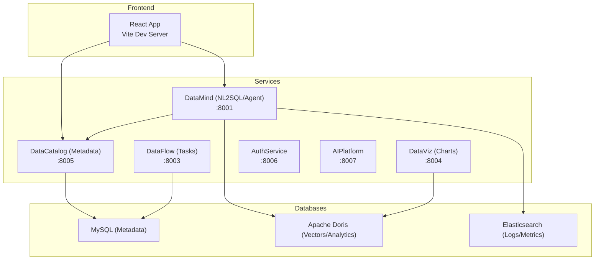
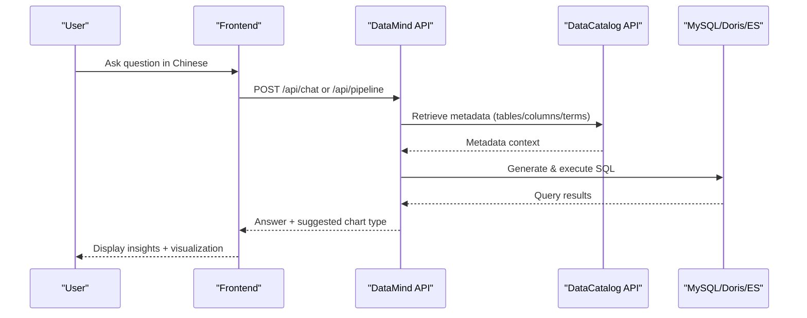
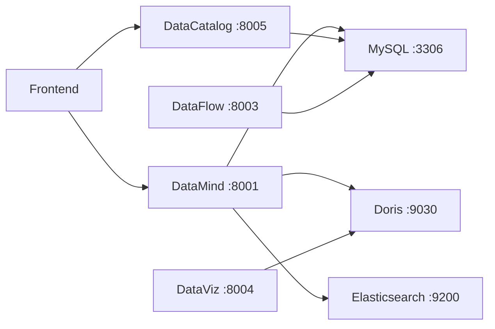

# Getting Started

<cite>
**Referenced Files in This Document**
- [README.md](file://README.md)
- [docker-compose.yml](file://docker-compose.yml)
- [docker-compose.full.yml](file://docker-compose.full.yml)
- [start-all.sh](file://start-all.sh)
- [services/shared/common/config.py](file://services/shared/common/config.py)
- [docker/mysql/init.sql](file://docker/mysql/init.sql)
- [sync/metadata_sync.py](file://sync/metadata_sync.py)
- [services/datamind/main.py](file://services/datamind/main.py)
- [services/datacatalog/main.py](file://services/datacatalog/main.py)
</cite>

## Table of Contents
1. [Introduction](#introduction)
2. [Project Structure](#project-structure)
3. [Core Components](#core-components)
4. [Architecture Overview](#architecture-overview)
5. [Detailed Component Analysis](#detailed-component-analysis)
6. [Dependency Analysis](#dependency-analysis)
7. [Performance Considerations](#performance-considerations)
8. [Troubleshooting Guide](#troubleshooting-guide)
9. [Conclusion](#conclusion)
10. [Appendices](#appendices)

## Introduction
AI-DataHub is a Natural Language Business Intelligence Platform that converts Chinese queries into optimized SQL and returns actionable insights with automatic visualization recommendations. It uses a multi-agent architecture to orchestrate intent analysis, metadata retrieval, SQL generation, execution, and chart recommendation. The platform supports multiple data sources including Apache Doris (analytics and vectors), MySQL (metadata), and Elasticsearch (logs/metrics/traces).

This guide helps you set up the platform quickly using either Docker-based deployment or a local development environment, configure essential environment variables, initialize databases, synchronize metadata, and run your first natural language query to see results and visualizations.

**Section sources**
- [README.md:14-26](file://README.md#L14-L26)
- [README.md:28-66](file://README.md#L28-L66)
- [README.md:146-164](file://README.md#L146-L164)
- [README.md:295-314](file://README.md#L295-L314)

## Project Structure
The repository organizes services as microservices under services/, each exposing FastAPI endpoints. A shared configuration layer centralizes environment variables for database connections, LLM settings, and service ports. Frontend assets are under frontend/ and can be served via Vite or packaged into a container. Database initialization scripts live under docker/mysql/.

**Diagram sources**
- [services/datamind/main.py:28-63](file://services/datamind/main.py#L28-L63)
- [services/datacatalog/main.py:25-50](file://services/datacatalog/main.py#L25-L50)
- [docker-compose.full.yml:6-107](file://docker-compose.full.yml#L6-L107)

**Section sources**
- [docker-compose.yml:3-48](file://docker-compose.yml#L3-L48)
- [docker-compose.full.yml:6-107](file://docker-compose.full.yml#L6-L107)
- [services/datamind/main.py:28-63](file://services/datamind/main.py#L28-L63)
- [services/datacatalog/main.py:25-50](file://services/datacatalog/main.py#L25-L50)

## Core Components
- DataMind: NL2SQL, agent orchestration, RAG, knowledge base, pipeline execution, playground, model config.
- DataCatalog: Metadata management, metrics, tags, glossary, lineage, datasources, menu.
- Shared Configuration: Unified env loading for metadata/vector DBs, LLM, embedding, Redis, Langfuse, Neo4j, service ports.
- Frontend: React UI for chat, dashboards, admin, workspace, history, and more.

Key responsibilities:
- DataMind exposes /api/chat, /api/pipeline, /api/query, /api/history, /api/playground, /api/model-config.
- DataCatalog exposes /api/catalog, /api/admin, /api/metrics, /api/tags, /api/datasources, /api/menu.
- Shared config reads METADATA_DB_* and VECTOR_DB_* to connect to MySQL/Doris; also supports legacy DORIS_* aliases.

**Section sources**
- [services/datamind/main.py:28-63](file://services/datamind/main.py#L28-L63)
- [services/datacatalog/main.py:25-50](file://services/datacatalog/main.py#L25-L50)
- [services/shared/common/config.py:35-163](file://services/shared/common/config.py#L35-L163)

## Architecture Overview
AI-DataHub follows a layered architecture:
- Frontend interacts with backend APIs.
- Orchestration layer routes requests through pipelines (Quick, Deep, Agent).
- Multi-Agent system coordinates specialized agents for SQL generation, execution, and analysis.
- Data layer includes MySQL (metadata), Apache Doris (analytics/vectors), and Elasticsearch (logs/metrics/traces).

**Diagram sources**
- [services/datamind/main.py:55-63](file://services/datamind/main.py#L55-L63)
- [services/datacatalog/main.py:40-50](file://services/datacatalog/main.py#L40-L50)
- [README.md:146-164](file://README.md#L146-L164)

## Detailed Component Analysis

### Installation Prerequisites
- Python 3.9+
- Node.js 18+
- Apache Doris (for analytics and vector search)
- MySQL (for metadata; optional if using Doris-only mode)
- Elasticsearch (optional, for log/metric/trace analysis)

These prerequisites are required to run the platform locally or via containers.

**Section sources**
- [README.md:295-314](file://README.md#L295-L314)

### Docker-Based Deployment
Use the full compose file to start MySQL, backend, and frontend together.

Steps:
1. Ensure Docker and Docker Compose are installed.
2. Start all services:
   - Run: docker compose -f docker-compose.full.yml up -d --build
3. Wait for services to become healthy:
   - Backend health check at http://localhost:8000/api/health
   - Frontend available at http://localhost:3000
4. Verify MySQL is initialized:
   - The compose file mounts init.sql to create the adh database and tables.

Notes:
- Ports can be overridden via environment variables BACKEND_PORT and FRONTEND_PORT.
- Embedding model cache is persisted across restarts.

**Section sources**
- [docker-compose.full.yml:6-107](file://docker-compose.full.yml#L6-L107)
- [docker/mysql/init.sql:1-6](file://docker/mysql/init.sql#L1-L6)

### Local Development Environment
Run services directly on your machine without containers.

Steps:
1. Prepare environment:
   - Create a virtual environment and install dependencies per service requirements.
   - Set environment variables in services/.env or backend/.env (the shared config loads these).
2. Initialize MySQL schema:
   - Execute docker/mysql/init.sql against your MySQL instance to create the adh database and tables.
3. Start services:
   - Use start-all.sh to launch all microservices and the frontend dev server.
   - Example: ./start-all.sh
4. Verify services:
   - Check logs under logs/ and status via the script’s status command.
   - Confirm frontend runs on port 3000 and backend on its configured port.

Service ports (from shared config):
- datamind: 8001
- datagov: 8002
- dataflow: 8003
- dataviz: 8004
- datacatalog: 8005
- authservice: 8006
- vectorservice: 8010
- graphservice: 8011

**Section sources**
- [start-all.sh:31-42](file://start-all.sh#L31-L42)
- [services/shared/common/config.py:122-131](file://services/shared/common/config.py#L122-L131)
- [docker/mysql/init.sql:1-6](file://docker/mysql/init.sql#L1-L6)

### Initial Configuration of Environment Variables
Unified configuration loads from services/.env or backend/.env. Key variables include:

- Metadata Database (MySQL):
  - METADATA_DB_TYPE, METADATA_DB_HOST, METADATA_DB_PORT, METADATA_DB_USER, METADATA_DB_PASSWORD, METADATA_DB_DATABASE
- Vector Database (Doris or MySQL fallback):
  - VECTOR_DB_TYPE, VECTOR_DB_HOST, VECTOR_DB_PORT, VECTOR_DB_USER, VECTOR_DB_PASSWORD, VECTOR_DB_DATABASE
- LLM:
  - ANTHROPIC_API_KEY, ANTHROPIC_BASE_URL, ANTHROPIC_MODEL
- Embedding:
  - EMBEDDING_MODEL_PATH, EMBEDDING_DIM, HF_ENDPOINT
- Optional Observability:
  - LANGFUSE_PUBLIC_KEY, LANGFUSE_SECRET_KEY, LANGFUSE_BASE_URL
- Application:
  - ADH_SECRET_KEY, ADH_DEFAULT_ADMIN_PASSWORD

Legacy aliases (deprecated but supported):
- DORIS_HOST, DORIS_PORT, DORIS_USER, DORIS_PASSWORD, DORIS_DATABASE
- CHATBI_SECRET_KEY

**Section sources**
- [services/shared/common/config.py:20-33](file://services/shared/common/config.py#L20-L33)
- [services/shared/common/config.py:35-163](file://services/shared/common/config.py#L35-L163)
- [README.md:477-504](file://README.md#L477-L504)

### Database Initialization Scripts
The MySQL initialization script creates the adh database and core tables for datasources, table/column metadata, SQL templates, business terms, dashboards, charts, conversations, users, audit logs, prompts, workflows, MCP servers, agents, and LLM models. It also inserts default system configurations and an admin user.

Key tables created:
- adh_datasources, adh_table_info, adh_column_metadata
- adh_sql_templates, adh_business_terms
- adh_dashboards, adh_charts, adh_chart_snapshots
- adh_conversations, adh_saved_queries
- adh_menu_items, adh_table_relations
- adh_users, adh_audit_logs, adh_applications, adh_embed_logs
- adh_system_config, adh_prompts, adh_prompt_versions
- adh_workflow_configs, adh_workflow_steps, adh_workflow_logs
- adh_sql_corrections, adh_pipeline_metrics
- adh_mcp_servers, adh_agents, adh_mcp_registry
- adh_llm_models

Default admin credentials:
- Username: admin
- Password: admin123

**Section sources**
- [docker/mysql/init.sql:1-6](file://docker/mysql/init.sql#L1-L6)
- [docker/mysql/init.sql:11-614](file://docker/mysql/init.sql#L11-L614)

### Metadata Synchronization
After setting up datasources, run metadata synchronization to populate table and column metadata into the adh database. The sync tool supports MySQL/Doris (via information_schema) and Elasticsearch (via mapping API).

Usage:
- python -m sync.metadata_sync

What it does:
- Scans datasources for tables and columns.
- Computes region/domain tags.
- Generates embeddings for table/column descriptions.
- Inserts or updates rows in adh_table_info and adh_column_metadata.
- Handles deletions when objects are removed from source systems.

For Elasticsearch:
- Builds client from datasource config.
- Lists indices and aliases.
- Flattens nested properties into field metadata.
- Merges mappings for aliases spanning multiple indices.

**Section sources**
- [sync/metadata_sync.py:1-11](file://sync/metadata_sync.py#L1-L11)
- [sync/metadata_sync.py:69-99](file://sync/metadata_sync.py#L69-L99)
- [sync/metadata_sync.py:106-158](file://sync/metadata_sync.py#L106-L158)
- [sync/metadata_sync.py:183-274](file://sync/metadata_sync.py#L183-L274)
- [sync/metadata_sync.py:318-520](file://sync/metadata_sync.py#L318-L520)
- [sync/metadata_sync.py:526-719](file://sync/metadata_sync.py#L526-L719)

### First Query Example
Once services are running and metadata is synchronized:

1. Open the frontend at http://localhost:3000.
2. Navigate to the Chat interface.
3. Enter a natural language question in Chinese, such as “近一个月每个医院的扫描次数趋势”.
4. The system will:
   - Understand intent and retrieve relevant metadata.
   - Generate optimized SQL targeting your configured datasources.
   - Execute the query and return results.
   - Recommend an appropriate chart type (e.g., line chart for trends).
   - Provide a concise analysis summary.

You can also use the Playground to test SQL directly or explore pipeline modes (Quick, Deep, Agent).

**Section sources**
- [README.md:14-26](file://README.md#L14-L26)
- [README.md:146-164](file://README.md#L146-L164)
- [services/datamind/main.py:55-63](file://services/datamind/main.py#L55-L63)

## Dependency Analysis
The platform’s runtime depends on:
- Services: DataMind, DataCatalog, DataFlow, DataViz, AuthService, AIPlatform, VectorService, GraphService.
- Databases: MySQL (metadata), Apache Doris (analytics/vectors), Elasticsearch (logs/metrics/traces).
- Optional: Redis (broker/backend), Neo4j (graph), Qdrant (vector store alternative), Langfuse (observability).

**Diagram sources**
- [services/shared/common/config.py:122-131](file://services/shared/common/config.py#L122-L131)
- [docker-compose.full.yml:6-107](file://docker-compose.full.yml#L6-L107)

**Section sources**
- [services/shared/common/config.py:122-131](file://services/shared/common/config.py#L122-L131)
- [docker-compose.full.yml:6-107](file://docker-compose.full.yml#L6-L107)

## Performance Considerations
- Prefer Apache Doris for vector search to leverage HNSW indexing for faster similarity retrieval.
- Use Elasticsearch only when needed for log/metric/trace analysis to avoid unnecessary overhead.
- Cache embeddings and reuse model weights via persistent volumes to speed up startup.
- Tune LLM parameters (temperature, max tokens) and pipeline modes based on query complexity.
- Monitor token usage and costs via Langfuse integration for observability and optimization.

[No sources needed since this section provides general guidance]

## Troubleshooting Guide
Common setup issues and verification steps:

- Service not starting:
  - Check logs under logs/ for each service.
  - Verify ports are free and not occupied by other processes.
  - Use start-all.sh status to see running services and PIDs.

- Database connection errors:
  - Ensure METADATA_DB_* and VECTOR_DB_* are correctly set.
  - Confirm MySQL is running and the adh database exists after executing init.sql.
  - For Doris, verify host/port/user/password and network access.

- Metadata sync failures:
  - Validate datasource credentials in adh_datasources.
  - For Elasticsearch, ensure index mappings are accessible and not empty.
  - Review error messages in sync output for missing fields or permission issues.

- Frontend cannot reach backend:
  - Confirm CORS is enabled and backend is listening on the expected port.
  - Check browser console for network errors and proxy settings.

- Health checks:
  - Backend health endpoint: GET http://localhost:8000/api/health
  - DataCatalog health endpoint: GET http://localhost:8005/health

**Section sources**
- [start-all.sh:232-282](file://start-all.sh#L232-L282)
- [docker-compose.full.yml:30-35](file://docker-compose.full.yml#L30-L35)
- [docker-compose.full.yml:78-83](file://docker-compose.full.yml#L78-L83)
- [services/datacatalog/main.py:53-56](file://services/datacatalog/main.py#L53-L56)

## Conclusion
You now have the essentials to deploy and operate AI-DataHub. Use Docker for quick setup or run services locally for development. Configure environment variables, initialize the database, synchronize metadata, and start asking questions in natural language to receive SQL-backed insights with recommended visualizations. Leverage the multi-agent architecture for complex analyses and integrate additional tools via MCP servers as needed.

[No sources needed since this section summarizes without analyzing specific files]

## Appendices

### Quick Reference: Commands
- Docker full deployment:
  - docker compose -f docker-compose.full.yml up -d --build
- Local services:
  - ./start-all.sh
  - ./start-all.sh status
- Metadata sync:
  - python -m sync.metadata_sync

**Section sources**
- [docker-compose.full.yml:3-5](file://docker-compose.full.yml#L3-L5)
- [start-all.sh:295-323](file://start-all.sh#L295-L323)
- [sync/metadata_sync.py:1-11](file://sync/metadata_sync.py#L1-L11)