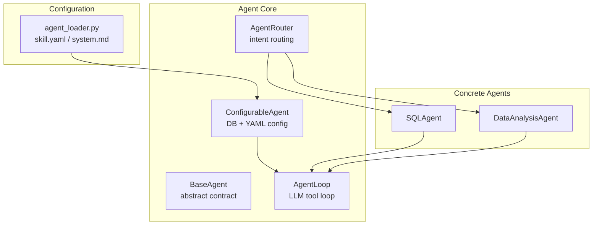
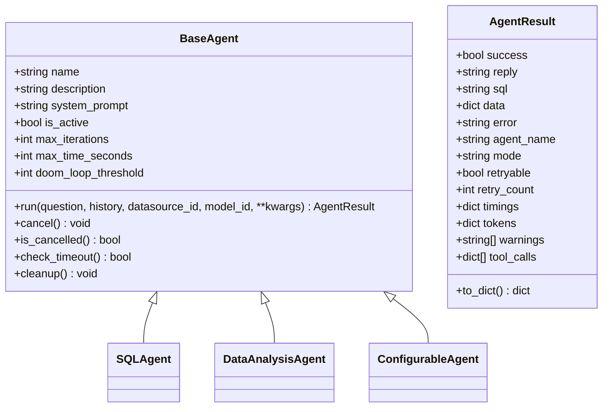
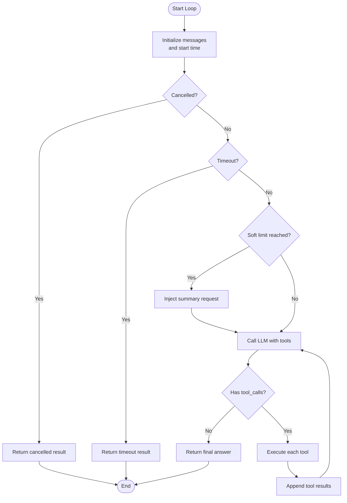
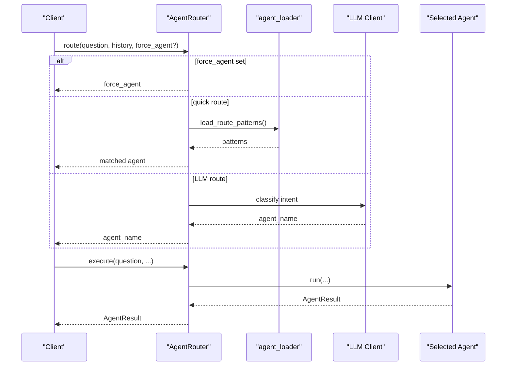
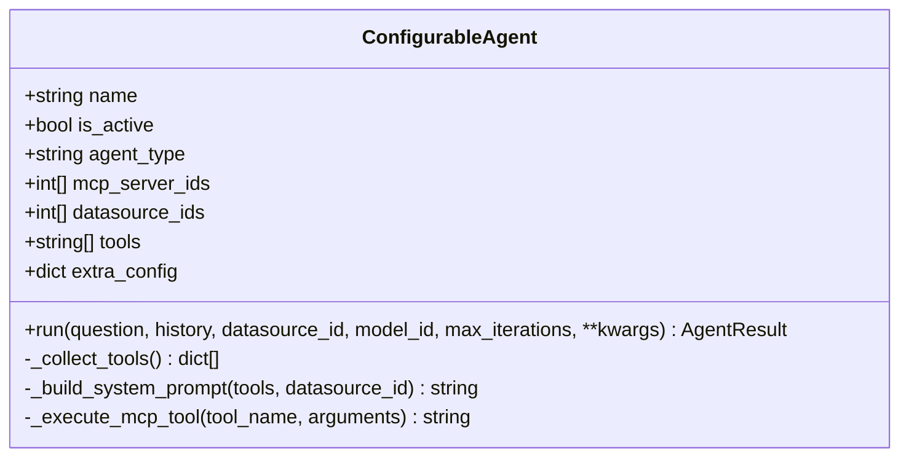
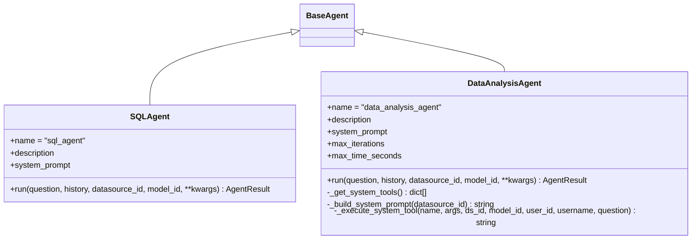
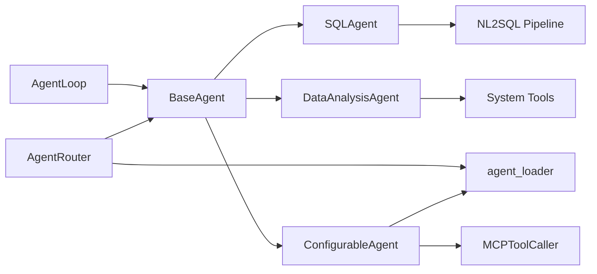

# Agent Framework & Architecture

<cite>
**Referenced Files in This Document**
- [base.py](file://services/datamind/agent/base.py)
- [agent_loop.py](file://services/datamind/agent/agent_loop.py)
- [router.py](file://services/datamind/agent/router.py)
- [configurable_agent.py](file://services/datamind/agent/configurable_agent.py)
- [sql_agent.py](file://services/datamind/agent/sql_agent.py)
- [data_analysis_agent.py](file://services/datamind/agent/data_analysis_agent.py)
- [agent_loader.py](file://services/datamind/config/agent_loader.py)
- [skill.yaml](file://services/datamind/config/agents/data_analysis/skill.yaml)
- [system.md](file://services/datamind/config/agents/data_analysis/system.md)
</cite>

## Table of Contents
1. [Introduction](#introduction)
2. [Project Structure](#project-structure)
3. [Core Components](#core-components)
4. [Architecture Overview](#architecture-overview)
5. [Detailed Component Analysis](#detailed-component-analysis)
6. [Dependency Analysis](#dependency-analysis)
7. [Performance Considerations](#performance-considerations)
8. [Troubleshooting Guide](#troubleshooting-guide)
9. [Conclusion](#conclusion)
10. [Appendices](#appendices)

## Introduction
This document explains the core agent framework architecture that powers intelligent, tool-calling agents for data and analysis tasks. It covers:
- BaseAgent abstract class: common lifecycle, context management, cancellation, timeout, and result modeling.
- AgentLoop: LLM-driven autonomous loop with soft limits, doom loop detection, timeout handling, and retry-friendly behavior.
- Router: intent-based routing using regex patterns and LLM classification to select the best agent.
- ConfigurableAgent: dynamic, DB-backed agent configuration via YAML skill files and runtime overrides.
- Concrete agents: SQLAgent and DataAnalysisAgent as examples of extending BaseAgent.
It also outlines architectural patterns, design principles, extension points, and practical integration guidance.

## Project Structure
The agent framework lives under services/datamind/agent and is configured via services/datamind/config/agents. Key responsibilities:
- base.py defines the abstract agent contract and shared result model.
- agent_loop.py implements the reusable LLM tool-calling loop with safety controls.
- router.py routes user queries to the appropriate agent.
- configurable_agent.py builds an agent from DB config and file-based skills.
- sql_agent.py and data_analysis_agent.py implement concrete agent behaviors.
- agent_loader.py loads skill metadata and prompts from YAML/Markdown.



**Diagram sources**
- [base.py:52-129](file://services/datamind/agent/base.py#L52-L129)
- [agent_loop.py:23-423](file://services/datamind/agent/agent_loop.py#L23-L423)
- [router.py:167-266](file://services/datamind/agent/router.py#L167-L266)
- [configurable_agent.py:21-233](file://services/datamind/agent/configurable_agent.py#L21-L233)
- [sql_agent.py:15-74](file://services/datamind/agent/sql_agent.py#L15-L74)
- [data_analysis_agent.py:22-164](file://services/datamind/agent/data_analysis_agent.py#L22-L164)
- [agent_loader.py:1-163](file://services/datamind/config/agent_loader.py#L1-L163)

**Section sources**
- [base.py:17-129](file://services/datamind/agent/base.py#L17-L129)
- [agent_loop.py:1-423](file://services/datamind/agent/agent_loop.py#L1-L423)
- [router.py:1-266](file://services/datamind/agent/router.py#L1-L266)
- [configurable_agent.py:1-233](file://services/datamind/agent/configurable_agent.py#L1-L233)
- [sql_agent.py:1-74](file://services/datamind/agent/sql_agent.py#L1-L74)
- [data_analysis_agent.py:1-164](file://services/datamind/agent/data_analysis_agent.py#L1-L164)
- [agent_loader.py:1-163](file://services/datamind/config/agent_loader.py#L1-L163)

## Core Components
- BaseAgent: Abstract base defining run(), cancel(), cleanup(), timeouts, and a standardized AgentResult dataclass for success, reply, SQL, data, errors, timings, tokens, warnings, and tool call logs.
- AgentLoop: Orchestrates LLM calls with tools, executes tool results back into the conversation, detects doom loops, enforces soft limits near max iterations, handles cancellation and timeouts, and returns structured results.
- AgentRouter: Routes incoming questions to the correct agent using quick regex matching from skill files and fallback LLM classification; provides execute() to run the selected agent.
- ConfigurableAgent: Reads DB-backed agent configuration (name, description, system prompt, MCP bindings, datasource bindings, tools, extra config), constructs system prompts with tool schemas, and runs via AgentLoop.
- SQLAgent: Wraps existing NL2SQL pipeline as an agent, returning unified AgentResult.
- DataAnalysisAgent: Uses AgentLoop with curated system tools to autonomously retrieve metadata, generate SQL, validate, execute, and analyze results.

**Section sources**
- [base.py:17-129](file://services/datamind/agent/base.py#L17-L129)
- [agent_loop.py:23-423](file://services/datamind/agent/agent_loop.py#L23-L423)
- [router.py:167-266](file://services/datamind/agent/router.py#L167-L266)
- [configurable_agent.py:21-233](file://services/datamind/agent/configurable_agent.py#L21-L233)
- [sql_agent.py:15-74](file://services/datamind/agent/sql_agent.py#L15-L74)
- [data_analysis_agent.py:22-164](file://services/datamind/agent/data_analysis_agent.py#L22-L164)

## Architecture Overview
The framework follows a layered, extensible design:
- Routing layer selects the best agent per query.
- Agent layer encapsulates domain-specific logic and uses a shared loop for tool calling.
- Loop layer standardizes LLM interaction, tool execution, safety checks, and observability.
- Configuration layer enables dynamic agent setup via DB and YAML skill files.

```mermaid
sequenceDiagram
participant Client as "Client"
participant Router as "AgentRouter"
participant Agent as "Selected Agent"
participant Loop as "AgentLoop"
participant LLM as "LLM Client"
participant Tools as "Tool Executor"
Client->>Router : route(question, history)
Router-->>Client : agent_name
Client->>Router : execute(question, history, ...)
Router->>Agent : run(question, history, ...)
Agent->>Loop : run(question, system_prompt, model_id, history)
Loop->>LLM : messages + tools
LLM-->>Loop : text or tool_calls
alt tool_calls
Loop->>Tools : execute_tool(name, input)
Tools-->>Loop : result
Loop->>LLM : append tool_result
else final answer
Loop-->>Agent : AgentResult
end
Agent-->>Router : AgentResult
Router-->>Client : AgentResult
```

**Diagram sources**
- [router.py:170-258](file://services/datamind/agent/router.py#L170-L258)
- [agent_loop.py:60-324](file://services/datamind/agent/agent_loop.py#L60-L324)
- [configurable_agent.py:90-156](file://services/datamind/agent/configurable_agent.py#L90-L156)
- [sql_agent.py:22-68](file://services/datamind/agent/sql_agent.py#L22-L68)
- [data_analysis_agent.py:56-101](file://services/datamind/agent/data_analysis_agent.py#L56-L101)

## Detailed Component Analysis

### BaseAgent and AgentResult
- Purpose: Define the agent contract and shared result structure.
- Key features:
  - Abstract run() method signature for all agents.
  - Lifecycle hooks: cancel(), cleanup().
  - Timeouts and cancellation checks via asyncio.Event and time tracking.
  - AgentResult carries success flags, human-readable reply, optional SQL/data, error details, timing, token usage, warnings, and tool call logs.



**Diagram sources**
- [base.py:17-129](file://services/datamind/agent/base.py#L17-L129)
- [sql_agent.py:15-74](file://services/datamind/agent/sql_agent.py#L15-L74)
- [data_analysis_agent.py:22-164](file://services/datamind/agent/data_analysis_agent.py#L22-L164)
- [configurable_agent.py:21-233](file://services/datamind/agent/configurable_agent.py#L21-L233)

**Section sources**
- [base.py:17-129](file://services/datamind/agent/base.py#L17-L129)

### AgentLoop: Tool Execution, Safety, and Observability
- Responsibilities:
  - Build initial message context from system prompt and recent history.
  - Call LLM with tools; process tool_use vs final answer.
  - Execute tools and feed results back into conversation.
  - Detect doom loops by tracking consecutive identical tool calls.
  - Enforce soft limits near max iterations to encourage summarization.
  - Handle cancellation and timeouts; return structured AgentResult.
  - Track tokens and integrate Langfuse traces when available.



**Diagram sources**
- [agent_loop.py:60-324](file://services/datamind/agent/agent_loop.py#L60-L324)

**Section sources**
- [agent_loop.py:23-423](file://services/datamind/agent/agent_loop.py#L23-L423)

### Router: Intelligent Agent Selection
- Capabilities:
  - Quick routing via compiled regex patterns loaded from skill files.
  - LLM-based classification for ambiguous cases, using active agent descriptions and recent history.
  - Force override support for specific agents.
  - Execute selected agent and wrap exceptions into AgentResult.



**Diagram sources**
- [router.py:43-199](file://services/datamind/agent/router.py#L43-L199)
- [router.py:201-258](file://services/datamind/agent/router.py#L201-L258)
- [agent_loader.py:43-115](file://services/datamind/config/agent_loader.py#L43-L115)

**Section sources**
- [router.py:1-266](file://services/datamind/agent/router.py#L1-L266)
- [agent_loader.py:1-163](file://services/datamind/config/agent_loader.py#L1-L163)

### ConfigurableAgent: Dynamic Agent Configuration
- Features:
  - Loads agent metadata and prompts from DB and YAML skill files.
  - Parses MCP server bindings, datasource bindings, and tool allowlists.
  - Builds system prompts including tool schemas for better LLM tool selection.
  - Runs via AgentLoop with MCP tool executor.
  - Supports per-request overrides for max_iterations and other settings.



**Diagram sources**
- [configurable_agent.py:21-233](file://services/datamind/agent/configurable_agent.py#L21-L233)

**Section sources**
- [configurable_agent.py:21-233](file://services/datamind/agent/configurable_agent.py#L21-L233)
- [agent_loader.py:30-115](file://services/datamind/config/agent_loader.py#L30-L115)
- [skill.yaml:1-23](file://services/datamind/config/agents/data_analysis/skill.yaml#L1-L23)
- [system.md:1-27](file://services/datamind/config/agents/data_analysis/system.md#L1-L27)

### Concrete Agents: SQLAgent and DataAnalysisAgent
- SQLAgent:
  - Wraps existing NL2SQL pipeline, collecting events and mapping them to AgentResult.
  - Suitable for straightforward data queries and reporting.
- DataAnalysisAgent:
  - Uses AgentLoop with curated system tools to autonomously perform multi-step analysis.
  - Enhances system prompt with datasource context and extracts generated SQL from tool calls.



**Diagram sources**
- [sql_agent.py:15-74](file://services/datamind/agent/sql_agent.py#L15-L74)
- [data_analysis_agent.py:22-164](file://services/datamind/agent/data_analysis_agent.py#L22-L164)

**Section sources**
- [sql_agent.py:15-74](file://services/datamind/agent/sql_agent.py#L15-L74)
- [data_analysis_agent.py:22-164](file://services/datamind/agent/data_analysis_agent.py#L22-L164)

## Dependency Analysis
Key dependencies and relationships:
- BaseAgent is extended by SQLAgent, DataAnalysisAgent, and ConfigurableAgent.
- AgentLoop depends on BaseAgent and integrates with LLM client and optional Langfuse tracing.
- Router depends on agent registry and loader to compile route patterns and classify intent.
- ConfigurableAgent depends on agent_loader for skill metadata and prompts, and on MCP tool caller for tool execution.
- SQLAgent depends on NL2SQL pipeline orchestrator; DataAnalysisAgent depends on system tools from orchestrator.



**Diagram sources**
- [base.py:52-129](file://services/datamind/agent/base.py#L52-L129)
- [agent_loop.py:23-423](file://services/datamind/agent/agent_loop.py#L23-L423)
- [router.py:167-266](file://services/datamind/agent/router.py#L167-L266)
- [configurable_agent.py:21-233](file://services/datamind/agent/configurable_agent.py#L21-L233)
- [sql_agent.py:15-74](file://services/datamind/agent/sql_agent.py#L15-L74)
- [data_analysis_agent.py:22-164](file://services/datamind/agent/data_analysis_agent.py#L22-L164)
- [agent_loader.py:1-163](file://services/datamind/config/agent_loader.py#L1-L163)

**Section sources**
- [base.py:52-129](file://services/datamind/agent/base.py#L52-L129)
- [agent_loop.py:23-423](file://services/datamind/agent/agent_loop.py#L23-L423)
- [router.py:167-266](file://services/datamind/agent/router.py#L167-L258)
- [configurable_agent.py:21-233](file://services/datamind/agent/configurable_agent.py#L21-L233)
- [sql_agent.py:15-74](file://services/datamind/agent/sql_agent.py#L15-L74)
- [data_analysis_agent.py:22-164](file://services/datamind/agent/data_analysis_agent.py#L22-L164)
- [agent_loader.py:1-163](file://services/datamind/config/agent_loader.py#L1-L163)

## Performance Considerations
- Soft limits: AgentLoop injects a summary request near max iterations to reduce unnecessary tool calls and improve response time.
- Doom loop detection: Prevents repeated identical tool calls, avoiding wasted cycles and potential infinite loops.
- Timeout enforcement: Ensures long-running agents do not block resources indefinitely.
- Token tracking: Aggregates input/output tokens across iterations for cost monitoring.
- Tool filtering: ConfigurableAgent can restrict available tools to reduce LLM decision space and latency.
- Quick routing: Regex-based fast path avoids LLM calls for clear intents, improving throughput.

[No sources needed since this section provides general guidance]

## Troubleshooting Guide
Common issues and resolutions:
- No tools available: ConfigurableAgent returns an error if no MCP tools are bound; verify mcp_server_ids and tools allowlist.
- Doom loop detected: Indicates repetitive tool calls; adjust agent prompts or tool inputs to diversify strategy.
- Max iterations exceeded: AgentLoop returns partial results; refine prompts or increase max_iterations cautiously.
- LLM call failures: Wrap retries at higher layers; check model configuration and network connectivity.
- Cancellation: Ensure upstream callers handle cancelled results gracefully.

**Section sources**
- [agent_loop.py:117-136](file://services/datamind/agent/agent_loop.py#L117-L136)
- [agent_loop.py:222-252](file://services/datamind/agent/agent_loop.py#L222-L252)
- [agent_loop.py:299-324](file://services/datamind/agent/agent_loop.py#L299-L324)
- [configurable_agent.py:117-128](file://services/datamind/agent/configurable_agent.py#L117-L128)

## Conclusion
The agent framework provides a robust, extensible foundation for building intelligent agents that autonomously call tools, manage context, and enforce safety constraints. BaseAgent standardizes behavior and results; AgentLoop centralizes LLM orchestration and safeguards; Router enables flexible intent-based dispatch; ConfigurableAgent supports dynamic configuration via DB and YAML. Concrete agents demonstrate how to leverage these primitives for SQL queries and complex data analysis workflows.

[No sources needed since this section summarizes without analyzing specific files]

## Appendices

### Extension Points and Best Practices
- Implementing a custom agent:
  - Subclass BaseAgent and implement run().
  - Use AgentLoop for LLM-driven tool calling if your agent needs autonomous tool selection.
  - Register your agent with the router if you want intent-based routing.
  - Provide skill.yaml and system.md for metadata, prompts, and route patterns.
- Integration with orchestration:
  - Expose execute() endpoints that delegate to AgentRouter.execute().
  - Pass datasource_id and model_id to enable context-aware tool execution.
  - Capture and surface AgentResult fields (timings, tokens, warnings, tool_calls) for observability.

[No sources needed since this section provides general guidance]