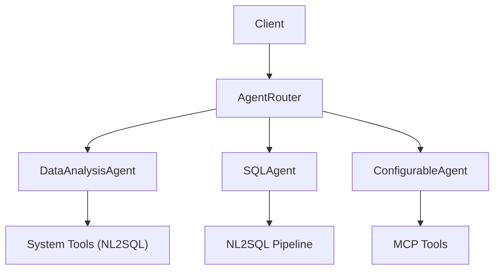
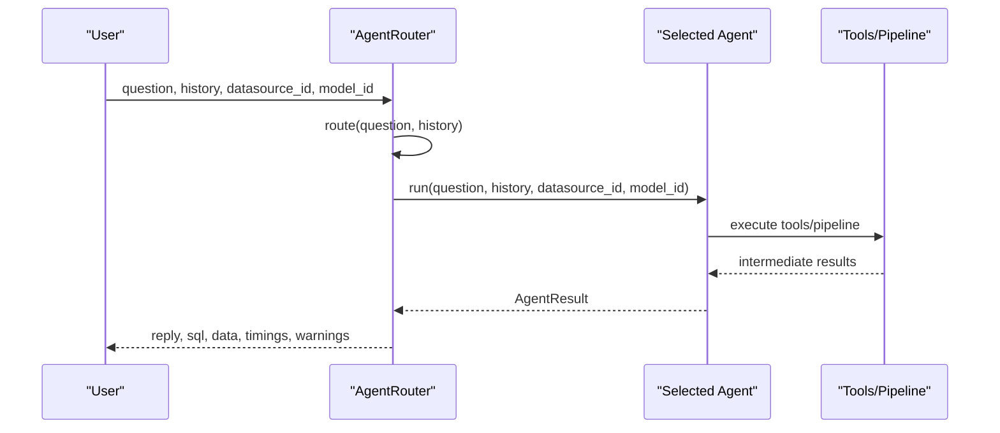
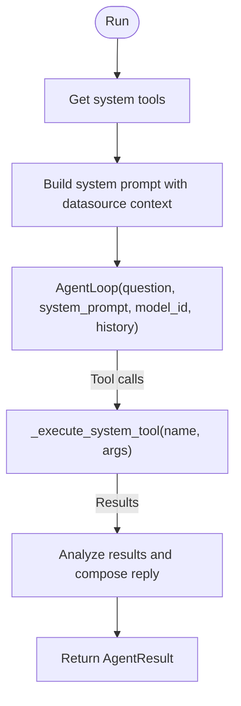
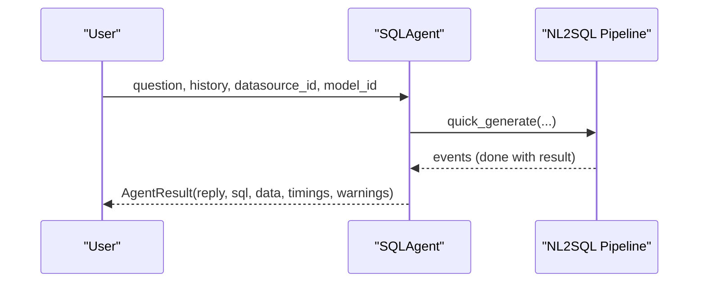
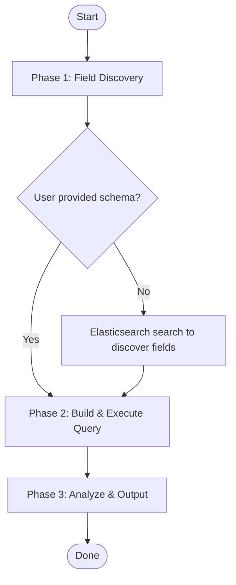
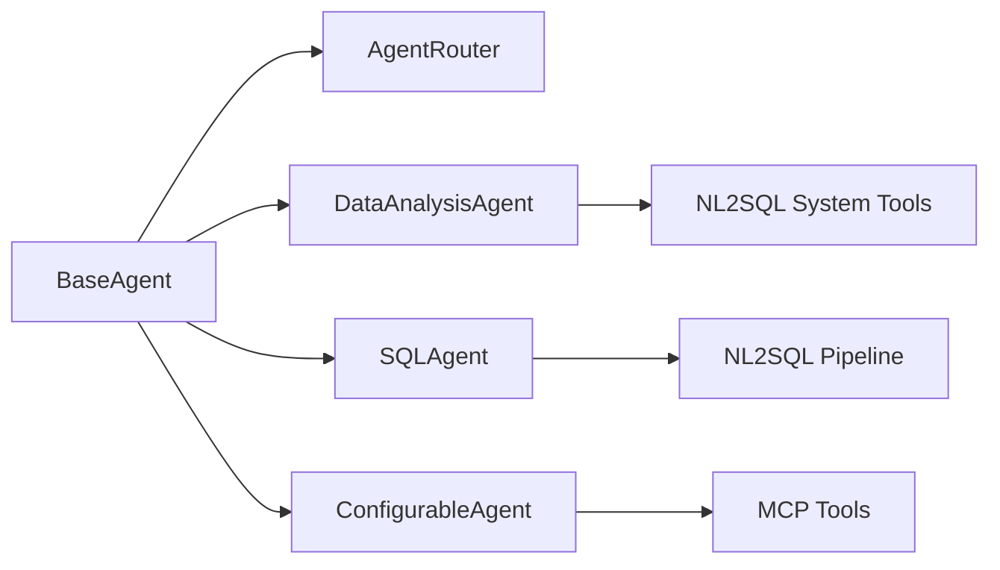

# Built-in Agents

<cite>
**Referenced Files in This Document**
- [base.py](file://services/datamind/agent/base.py)
- [data_analysis_agent.py](file://services/datamind/agent/data_analysis_agent.py)
- [sql_agent.py](file://services/datamind/agent/sql_agent.py)
- [configurable_agent.py](file://services/datamind/agent/configurable_agent.py)
- [router.py](file://services/datamind/agent/router.py)
- [skill.yaml (data_analysis)](file://services/datamind/config/agents/data_analysis/skill.yaml)
- [skill.yaml (anomaly)](file://services/datamind/config/agents/anomaly/skill.yaml)
- [skill.yaml (traffic)](file://services/datamind/config/agents/traffic/skill.yaml)
- [skill.yaml (user_profiling)](file://services/datamind/config/agents/user_profiling/skill.yaml)
- [skill.yaml (funnel)](file://services/datamind/config/agents/funnel/skill.yaml)
- [skill.yaml (retention)](file://services/datamind/config/agents/retention/skill.yaml)
- [skill.yaml (trend)](file://services/datamind/config/agents/trend/skill.yaml)
- [skill.yaml (report)](file://services/datamind/config/agents/report/skill.yaml)
- [system.md (log_analysis)](file://services/datamind/config/agents/log_analysis/system.md)
</cite>

## Table of Contents
1. Introduction
2. Project Structure
3. Core Components
4. Architecture Overview
5. Detailed Component Analysis
6. Dependency Analysis
7. Performance Considerations
8. Troubleshooting Guide
9. Conclusion

## Introduction
This document describes all built-in agents available in AI-DataHub for data analysis, SQL generation, and specialized analytics tasks. It covers:
- DataAnalysisAgent: end-to-end data exploration via metadata retrieval, SQL generation, execution, and result analysis.
- SQLAgent: natural language to SQL conversion with dialect support and query optimization through the existing NL2SQL pipeline.
- Specialized agents: log analysis, traffic analysis, user profiling, funnel analysis, retention analysis, anomaly detection, trend analysis, and report generation.

For each agent, we detail capabilities, input/output formats, configuration options, and example use cases.

## Project Structure
The agent subsystem is implemented under services/datamind/agent and is configured via skill files under services/datamind/config/agents. The router selects the appropriate agent based on regex patterns or LLM-based intent classification.

**Diagram sources**
- [router.py:167-200](file://services/datamind/agent/router.py#L167-L200)
- [data_analysis_agent.py:22-101](file://services/datamind/agent/data_analysis_agent.py#L22-L101)
- [sql_agent.py:15-68](file://services/datamind/agent/sql_agent.py#L15-L68)
- [configurable_agent.py:21-156](file://services/datamind/agent/configurable_agent.py#L21-L156)

**Section sources**
- [router.py:1-266](file://services/datamind/agent/router.py#L1-L266)
- [base.py:17-129](file://services/datamind/agent/base.py#L17-L129)

## Core Components
- BaseAgent and AgentResult define the common interface and execution contract for all agents.
- AgentRouter routes user questions to the best-suited agent using quick regex routing and LLM-based fallback.
- DataAnalysisAgent orchestrates metadata discovery, SQL generation/validation/execution, and result analysis via system tools.
- SQLAgent delegates to the NL2SQL quick/deep pipelines for robust SQL generation and execution.
- ConfigurableAgent loads dynamic configurations from the database and executes MCP tool calls autonomously.

Key responsibilities:
- Routing and dispatching requests to agents.
- Enforcing protection limits (max iterations, timeouts).
- Standardizing results via AgentResult.

**Section sources**
- [base.py:17-129](file://services/datamind/agent/base.py#L17-L129)
- [router.py:167-266](file://services/datamind/agent/router.py#L167-L266)
- [data_analysis_agent.py:22-164](file://services/datamind/agent/data_analysis_agent.py#L22-L164)
- [sql_agent.py:15-74](file://services/datamind/agent/sql_agent.py#L15-L74)
- [configurable_agent.py:21-233](file://services/datamind/agent/configurable_agent.py#L21-L233)

## Architecture Overview
The agent architecture centers around a router that selects an agent per request. Agents may call internal system tools (for DataAnalysisAgent), external MCP tools (for ConfigurableAgent), or the NL2SQL pipeline (for SQLAgent). All agents return a standardized AgentResult.

**Diagram sources**
- [router.py:167-258](file://services/datamind/agent/router.py#L167-L258)
- [data_analysis_agent.py:56-101](file://services/datamind/agent/data_analysis_agent.py#L56-L101)
- [sql_agent.py:22-68](file://services/datamind/agent/sql_agent.py#L22-L68)
- [configurable_agent.py:90-156](file://services/datamind/agent/configurable_agent.py#L90-L156)

## Detailed Component Analysis

### DataAnalysisAgent
Capabilities:
- End-to-end data exploration: table selection, metadata retrieval, SQL generation, validation, execution, and result analysis.
- Uses LLM-driven tool calling loop with protection limits and timeout checks.
- Integrates with system tools exposed by the NL2SQL orchestrator.

Input/Output:
- Inputs: question, optional history, datasource_id, model_id, plus optional kwargs like user_id/username.
- Outputs: AgentResult containing reply, generated SQL (if any), structured data, timings, tokens, warnings, and tool_calls.

Configuration:
- max_iterations: default 15 for complex queries.
- max_time_seconds: default 90 seconds.
- System prompt includes workflow guidance and environment context (engine type, datasource ID).

Use Cases:
- “What were total sales last month by region?”
- “Show top 10 users by login count this week.”
- “Compare conversion rates between two campaigns.”

**Diagram sources**
- [data_analysis_agent.py:56-101](file://services/datamind/agent/data_analysis_agent.py#L56-L101)
- [data_analysis_agent.py:103-158](file://services/datamind/agent/data_analysis_agent.py#L103-L158)

**Section sources**
- [data_analysis_agent.py:22-164](file://services/datamind/agent/data_analysis_agent.py#L22-L164)
- [skill.yaml (data_analysis):1-23](file://services/datamind/config/agents/data_analysis/skill.yaml#L1-L23)

### SQLAgent
Capabilities:
- Natural language to SQL conversion and execution via the existing NL2SQL pipeline.
- Supports multiple dialects and query optimization through the pipeline’s orchestrator.

Input/Output:
- Inputs: question, optional history, datasource_id, model_id, and optional retrieval_strategy.
- Outputs: AgentResult with reply, SQL, result data, timings, tokens, and warnings.

Use Cases:
- “How many orders did we process yesterday?”
- “List top 5 products by revenue in Q1.”
- “Show daily active users for the past 30 days.”

**Diagram sources**
- [sql_agent.py:22-68](file://services/datamind/agent/sql_agent.py#L22-L68)

**Section sources**
- [sql_agent.py:15-74](file://services/datamind/agent/sql_agent.py#L15-L74)

### ConfigurableAgent
Capabilities:
- DB-driven agent that reads system prompts, MCP bindings, and datasource bindings.
- Executes autonomous tool calling loops with MCP tools and supports per-request overrides.

Input/Output:
- Inputs: question, optional history, datasource_id, model_id, optional max_iterations override.
- Outputs: AgentResult with reply, data, timings, and errors if no tools are available.

Use Cases:
- Custom analytical workflows bound to specific MCP servers.
- Dynamic agent behavior without code changes.

**Section sources**
- [configurable_agent.py:21-233](file://services/datamind/agent/configurable_agent.py#L21-L233)

### AgentRouter
Capabilities:
- Routes user questions to the most suitable agent using:
  - Quick regex patterns loaded from agent skill files.
  - LLM-based classification when needed.
- Executes the selected agent and returns a standardized AgentResult.

Use Cases:
- Transparent routing for mixed intents across agents.
- Fallback to SQLAgent when no match is found.

**Section sources**
- [router.py:1-266](file://services/datamind/agent/router.py#L1-L266)

### Specialized Agents

#### Log Analysis Agent
Capabilities:
- Observability-focused agent for Elasticsearch logs, metrics, and traces.
- Strict three-phase flow: field discovery, query construction/execution, and analysis/output.
- Enforces strict state transitions and prohibits repeated identical tool calls.

Input/Output:
- Inputs: question (natural language), optionally index structure details.
- Outputs: concise analysis, tables for aggregations, and actionable insights.

Configuration:
- System prompt defines phases, rules, and tool usage (search, list_indices).

Use Cases:
- “Find error spikes in the last hour.”
- “Aggregate requests by endpoint and status code.”
- “Show top failing IPs and their URLs.”

**Diagram sources**
- [system.md (log_analysis):5-58](file://services/datamind/config/agents/log_analysis/system.md#L5-L58)
- [system.md (log_analysis):67-115](file://services/datamind/config/agents/log_analysis/system.md#L67-L115)

**Section sources**
- [system.md (log_analysis):1-115](file://services/datamind/config/agents/log_analysis/system.md#L1-L115)

#### Traffic Analysis Agent
Capabilities:
- Analyzes web traffic metrics such as UV/PV, page visit rankings, time-of-day distribution, and bounce rate.
- Works with various data sources (Elasticsearch, MySQL, Doris) and auto-generates queries based on bound datasources.

Input/Output:
- Inputs: question, optional time_range, optional page/path.
- Outputs: summarized metrics and insights.

Use Cases:
- “UV and PV for the last 7 days.”
- “Top 10 pages by visits today.”
- “Bounce rate by device type.”

**Section sources**
- [skill.yaml (traffic):1-27](file://services/datamind/config/agents/traffic/skill.yaml#L1-L27)

#### User Profiling Agent
Capabilities:
- Builds user profiles including geographic distribution, device types, new vs returning users, activity tiers, and behavioral features.

Input/Output:
- Inputs: question, optional dimension (e.g., geography, device, new/old).
- Outputs: segmented insights and distributions.

Use Cases:
- “Distribution of users by city.”
- “New vs returning user ratio this month.”
- “Active user segmentation by frequency.”

**Section sources**
- [skill.yaml (user_profiling):1-24](file://services/datamind/config/agents/user_profiling/skill.yaml#L1-L24)

#### Funnel Analysis Agent
Capabilities:
- Defines multi-step funnels, calculates step-wise conversion and drop-off rates, and identifies bottlenecks.

Input/Output:
- Inputs: question, optional steps definition (e.g., Visit → Register → Activate → Pay).
- Outputs: funnel metrics and bottleneck insights.

Use Cases:
- “Conversion funnel from signup to purchase.”
- “Where do users drop off most?”

**Section sources**
- [skill.yaml (funnel):1-23](file://services/datamind/config/agents/funnel/skill.yaml#L1-L23)

#### Retention Analysis Agent
Capabilities:
- Computes retention rates (next-day, 7-day, 30-day), analyzes user lifecycle, retention curves, and churn alerts.

Input/Output:
- Inputs: question, optional period (e.g., next-day, 7-day).
- Outputs: retention metrics and cohort insights.

Use Cases:
- “Next-day retention for last 30 days.”
- “Cohort retention curve for March signups.”

**Section sources**
- [skill.yaml (retention):1-24](file://services/datamind/config/agents/retention/skill.yaml#L1-L24)

#### Anomaly Detection Agent
Capabilities:
- Detects anomalies such as traffic spikes/drops, statistical outliers, YoY/MoM deviations, and metric baseline breaches.

Input/Output:
- Inputs: question, optional metric name.
- Outputs: identified anomalies and explanations.

Use Cases:
- “Detect abnormal spikes in error rate.”
- “Find metrics deviating from baseline.”

**Section sources**
- [skill.yaml (anomaly):1-24](file://services/datamind/config/agents/anomaly/skill.yaml#L1-L24)

#### Trend Analysis Agent
Capabilities:
- Analyzes time series trends, growth rates, moving averages, inflection points, seasonality, and forecasts.

Input/Output:
- Inputs: question, optional time_range.
- Outputs: trend summaries and forecasts.

Use Cases:
- “Weekly growth rate over the last quarter.”
- “Identify seasonal patterns in daily sales.”

**Section sources**
- [skill.yaml (trend):1-25](file://services/datamind/config/agents/trend/skill.yaml#L1-L25)

#### Report Generation Agent
Capabilities:
- Generates comprehensive reports based on task results and templates, providing insights, anomaly findings, and trend judgments beyond simple templating.

Input/Output:
- Inputs: task results and template references.
- Outputs: full analytical report with narrative insights.

Use Cases:
- “Generate weekly performance report.”
- “Create monthly executive summary with key metrics and anomalies.”

**Section sources**
- [skill.yaml (report):1-9](file://services/datamind/config/agents/report/skill.yaml#L1-L9)

## Dependency Analysis
Agents depend on shared infrastructure:
- BaseAgent provides lifecycle and protection mechanisms.
- AgentRouter coordinates routing and execution.
- DataAnalysisAgent depends on NL2SQL system tools.
- SQLAgent depends on the NL2SQL pipeline.
- ConfigurableAgent depends on MCP tool callers.

**Diagram sources**
- [base.py:52-129](file://services/datamind/agent/base.py#L52-L129)
- [router.py:167-266](file://services/datamind/agent/router.py#L167-L266)
- [data_analysis_agent.py:103-158](file://services/datamind/agent/data_analysis_agent.py#L103-L158)
- [sql_agent.py:34-68](file://services/datamind/agent/sql_agent.py#L34-L68)
- [configurable_agent.py:157-227](file://services/datamind/agent/configurable_agent.py#L157-L227)

**Section sources**
- [router.py:1-266](file://services/datamind/agent/router.py#L1-L266)
- [data_analysis_agent.py:103-158](file://services/datamind/agent/data_analysis_agent.py#L103-L158)
- [sql_agent.py:34-68](file://services/datamind/agent/sql_agent.py#L34-L68)
- [configurable_agent.py:157-227](file://services/datamind/agent/configurable_agent.py#L157-L227)

## Performance Considerations
- Protection Limits: Agents enforce max_iterations and max_time_seconds to prevent runaway loops and long-running tasks.
- Tool Call Efficiency: DataAnalysisAgent filters allowed tools to reduce overhead; log analysis enforces single-pass field discovery.
- Caching: Route pattern compilation is cached to speed up quick routing.
- Timeouts: BaseAgent tracks start time and exposes check_timeout for early termination.

[No sources needed since this section provides general guidance]

## Troubleshooting Guide
Common issues and resolutions:
- No tools available (ConfigurableAgent): Ensure MCP server IDs and tools are correctly bound; verify MCP tool listing succeeds.
- Routing failures: Check agent skill route_patterns and ensure agents are active; router falls back to SQLAgent if LLM routing fails.
- Execution timeouts: Increase max_time_seconds or reduce complexity; review tool call sequences for redundant operations.
- SQL generation errors: Validate datasource connectivity and permissions; inspect warnings and error messages in AgentResult.

**Section sources**
- [configurable_agent.py:117-128](file://services/datamind/agent/configurable_agent.py#L117-L128)
- [router.py:193-200](file://services/datamind/agent/router.py#L193-L200)
- [router.py:222-258](file://services/datamind/agent/router.py#L222-L258)
- [base.py:119-123](file://services/datamind/agent/base.py#L119-L123)

## Conclusion
AI-DataHub’s agent framework provides a flexible, extensible platform for data analysis and specialized analytics. DataAnalysisAgent offers end-to-end exploration via metadata and SQL orchestration, while SQLAgent leverages robust NL2SQL capabilities. Specialized agents cover critical business domains such as traffic, user profiling, funnels, retention, anomalies, trends, logs, and reporting. The router ensures intelligent dispatch, and standardized results enable consistent integration across the platform.

[No sources needed since this section summarizes without analyzing specific files]