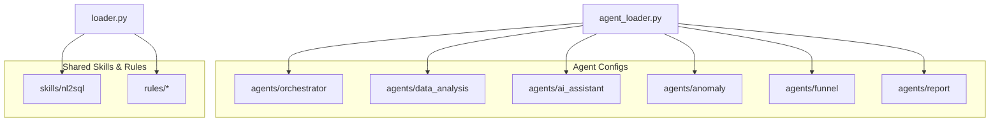
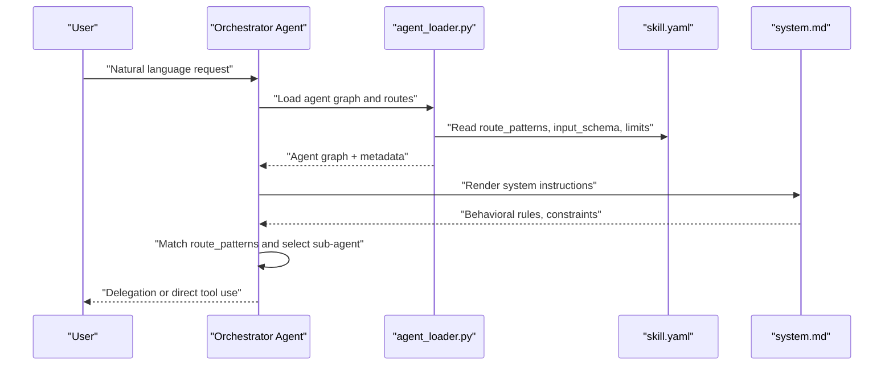
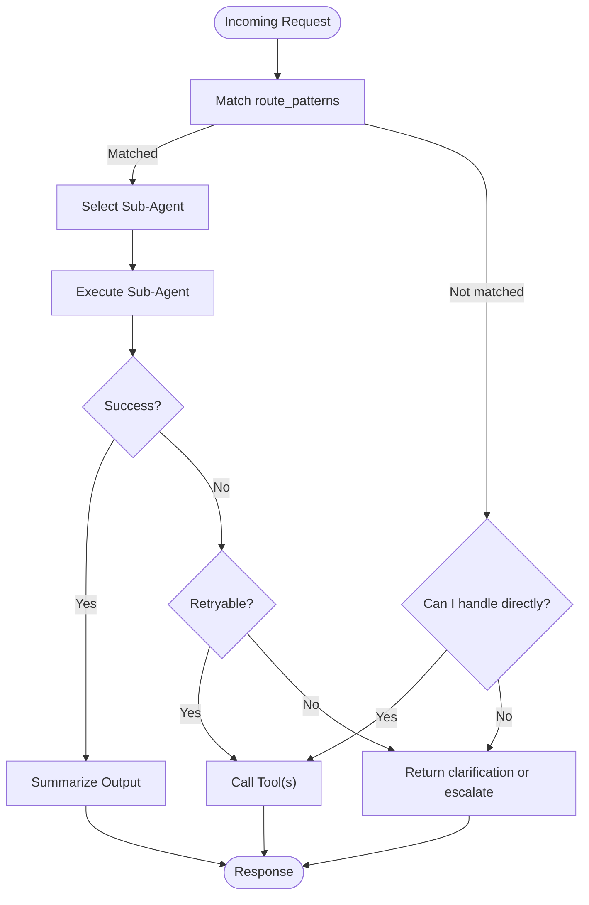
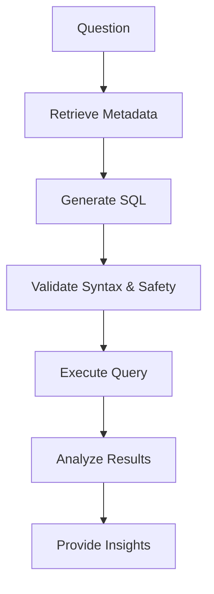
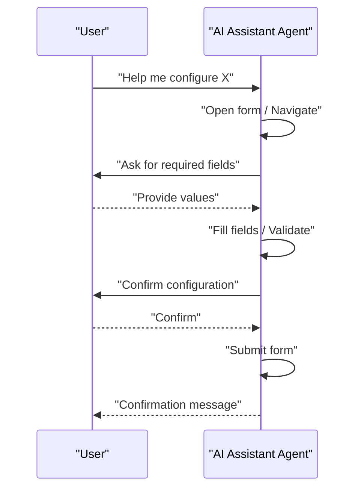
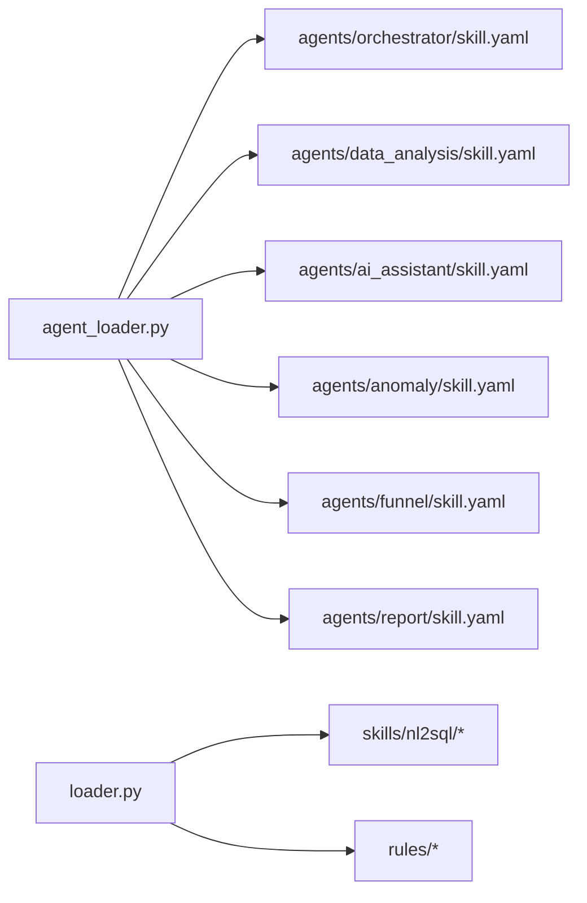

# Custom Agent Development

<cite>
**Referenced Files in This Document**
- [agent_loader.py](file://services/datamind/config/agent_loader.py)
- [loader.py](file://services/datamind/config/loader.py)
- [skill.yaml (orchestrator)](file://services/datamind/config/agents/orchestrator/skill.yaml)
- [system.md (orchestrator)](file://services/datamind/config/agents/orchestrator/system.md)
- [skill.yaml (data_analysis)](file://services/datamind/config/agents/data_analysis/skill.yaml)
- [system.md (data_analysis)](file://services/datamind/config/agents/data_analysis/system.md)
- [skill.yaml (ai_assistant)](file://services/datamind/config/agents/ai_assistant/skill.yaml)
- [system.md (ai_assistant)](file://services/datamind/config/agents/ai_assistant/system.md)
- [skill.yaml (anomaly)](file://services/datamind/config/agents/anomaly/skill.yaml)
- [skill.yaml (funnel)](file://services/datamind/config/agents/funnel/skill.yaml)
- [skill.yaml (report)](file://services/datamind/config/agents/report/skill.yaml)
</cite>

## Table of Contents
1. Introduction
2. Project Structure
3. Core Components
4. Architecture Overview
5. Detailed Component Analysis
6. Dependency Analysis
7. Performance Considerations
8. Troubleshooting Guide
9. Conclusion
10. Appendices

## Introduction
This document provides comprehensive guidance for developing custom agents in AI-DataHub using a prompt-driven design philosophy. In this approach, agent behavior is controlled through declarative configuration and markdown prompts rather than code changes. You define what an agent can do via skill.yaml metadata and how it should behave via system.md instructions. The runtime loader reads these files to build routing, tool exposure, and orchestration logic at startup or on demand.

Key benefits:
- No code recompilation to change agent behavior
- Version-controllable prompts and configurations
- Centralized loading with consistent structure across agents
- Clear separation between capabilities (skill.yaml) and behavior (system.md)

## Project Structure
AI-DataHub organizes agent definitions under services/datamind/config/agents/{agent_name}/ with two primary files per agent:
- skill.yaml: Declares agent identity, routing patterns, input schema, and operational limits
- system.md: Defines the agent’s instructions, constraints, and response formats

Shared skills and rules live under services/datamind/config/skills and services/datamind/config/rules, enabling reuse across agents.

**Diagram sources**
- [agent_loader.py:1-163](file://services/datamind/config/agent_loader.py#L1-L163)
- [loader.py:1-134](file://services/datamind/config/loader.py#L1-L134)

**Section sources**
- [agent_loader.py:1-163](file://services/datamind/config/agent_loader.py#L1-L163)
- [loader.py:1-134](file://services/datamind/config/loader.py#L1-L134)

## Core Components
- Agent skill.yaml: Metadata that defines routing, inputs, and operational parameters
- Agent system.md: Prompt-based instructions that control behavior, constraints, and output format
- Agent loader: Reads skill.yaml and system.md, builds routing and graph context for the orchestrator
- Shared skill loader: Loads reusable skills and rules for NL2SQL and other components

Highlights:
- Route matching uses regex-like patterns defined in skill.yaml route_patterns
- Input validation and documentation are expressed via input_schema
- Orchestration injects tools listing, agent graph, and scheduler rules into the orchestrator’s system prompt

**Section sources**
- [agent_loader.py:30-115](file://services/datamind/config/agent_loader.py#L30-L115)
- [loader.py:29-134](file://services/datamind/config/loader.py#L29-L134)

## Architecture Overview
The prompt-driven architecture centers around file-based configuration loaded by the agent loader. The orchestrator agent composes its system prompt with injected sections such as tools listing, available sub-agents, and scheduling rules.

**Diagram sources**
- [agent_loader.py:125-163](file://services/datamind/config/agent_loader.py#L125-L163)
- [system.md (orchestrator):1-31](file://services/datamind/config/agents/orchestrator/system.md#L1-L31)

## Detailed Component Analysis

### Orchestrator Agent
Purpose:
- Analyze user intent, select appropriate sub-agents, coordinate execution, reflect on errors, and summarize outputs.

Key behaviors:
- Delegates routine tasks (e.g., SQL generation and analysis) to specialized sub-agents
- Directly calls tools only when necessary (fallback after failure, no matching sub-agent, simple metadata retrieval)
- Prohibits bypassing sub-agents for complex queries when a matching sub-agent exists

Injection points:
- Tools listing placeholder
- Agent graph placeholder built from skill.yaml metadata
- Scheduler rules placeholder

**Diagram sources**
- [system.md (orchestrator):5-31](file://services/datamind/config/agents/orchestrator/system.md#L5-L31)
- [agent_loader.py:125-163](file://services/datamind/config/agent_loader.py#L125-L163)

**Section sources**
- [system.md (orchestrator):1-31](file://services/datamind/config/agents/orchestrator/system.md#L1-L31)
- [skill.yaml (orchestrator):1-7](file://services/datamind/config/agents/orchestrator/skill.yaml#L1-L7)

### Data Analysis Agent
Purpose:
- Convert natural language questions into SQL, execute queries safely, and analyze results to provide business insights.

Key behaviors:
- Retrieves metadata before generating SQL
- Enforces safety rules (no write operations, LIMIT required)
- Emphasizes data truthfulness; never fabricate results

Input schema:
- Required: question
- Optional: table, filter

**Diagram sources**
- [system.md (data_analysis):5-27](file://services/datamind/config/agents/data_analysis/system.md#L5-L27)
- [skill.yaml (data_analysis):11-23](file://services/datamind/config/agents/data_analysis/skill.yaml#L11-L23)

**Section sources**
- [system.md (data_analysis):1-27](file://services/datamind/config/agents/data_analysis/system.md#L1-L27)
- [skill.yaml (data_analysis):1-23](file://services/datamind/config/agents/data_analysis/skill.yaml#L1-L23)

### AI Assistant Agent
Purpose:
- Help users configure and operate AI-DataHub, answer questions, guide through forms, and navigate UI flows.

Key behaviors:
- Uses page navigation, form operations, state queries, and confirmation tools
- Guides users step-by-step for complex configurations (data sources, scheduled tasks, notifications, agents, workflows)

Input schema:
- Required: question
- Optional: context, module

**Diagram sources**
- [system.md (ai_assistant):13-105](file://services/datamind/config/agents/ai_assistant/system.md#L13-L105)
- [skill.yaml (ai_assistant):12-24](file://services/datamind/config/agents/ai_assistant/skill.yaml#L12-L24)

**Section sources**
- [system.md (ai_assistant):1-283](file://services/datamind/config/agents/ai_assistant/system.md#L1-L283)
- [skill.yaml (ai_assistant):1-24](file://services/datamind/config/agents/ai_assistant/skill.yaml#L1-L24)

### Anomaly Detection Agent
Purpose:
- Detect anomalies in metrics and trends (spikes, drops, deviations).

Routing:
- Matches phrases related to anomaly detection, monitoring, thresholds, and deviations.

Input schema:
- Required: question
- Optional: metric

**Section sources**
- [skill.yaml (anomaly):1-24](file://services/datamind/config/agents/anomaly/skill.yaml#L1-L24)

### Funnel Analysis Agent
Purpose:
- Analyze conversion funnels, compute step-wise conversion and churn rates, identify bottlenecks.

Routing:
- Matches funnel, conversion, churn, key path, and step-related queries.

Input schema:
- Required: question
- Optional: steps

**Section sources**
- [skill.yaml (funnel):1-23](file://services/datamind/config/agents/funnel/skill.yaml#L1-L23)

### Report Generation Agent
Purpose:
- Generate comprehensive reports based on task results and templates, providing insights beyond simple templating.

Routing:
- No default route patterns; typically invoked by orchestrator or workflow.

**Section sources**
- [skill.yaml (report):1-9](file://services/datamind/config/agents/report/skill.yaml#L1-L9)

## Dependency Analysis
The agent loader constructs the orchestrator’s view of available sub-agents by reading each agent’s skill.yaml and injecting input requirements into the agent graph. Shared skills and rules are loaded separately for reuse.

**Diagram sources**
- [agent_loader.py:118-163](file://services/datamind/config/agent_loader.py#L118-L163)
- [loader.py:89-134](file://services/datamind/config/loader.py#L89-L134)

**Section sources**
- [agent_loader.py:118-163](file://services/datamind/config/agent_loader.py#L118-L163)
- [loader.py:89-134](file://services/datamind/config/loader.py#L89-L134)

## Performance Considerations
- Keep route_patterns concise and specific to reduce false positives during routing
- Use max_retries and max_iterations judiciously to balance robustness and cost
- Prefer delegating complex tasks to specialized sub-agents to avoid redundant processing
- Cache or precompute metadata where possible to minimize repeated retrievals
- Limit query result sizes with LIMIT and early filtering to reduce downstream processing

[No sources needed since this section provides general guidance]

## Troubleshooting Guide
Common issues and remedies:
- Agent not matched: Verify route_patterns in skill.yaml align with expected user intents
- Missing inputs: Ensure input_schema required fields are provided; the orchestrator will highlight missing parameters
- Excessive retries: Adjust max_retries and max_iterations; inspect error types to determine retryability
- Prompt load failures: Check file paths and encoding; the loader logs warnings when files cannot be read
- Orchestration confusion: Review system.md constraints to ensure clear delegation rules and prohibited actions

Operational checks:
- Confirm agent directories exist under config/agents
- Validate YAML syntax in skill.yaml
- Ensure system.md contains placeholders for tools_listing, agent_graph, and scheduler_rules if used by the orchestrator

**Section sources**
- [agent_loader.py:30-64](file://services/datamind/config/agent_loader.py#L30-L64)
- [system.md (orchestrator):20-31](file://services/datamind/config/agents/orchestrator/system.md#L20-L31)

## Conclusion
AI-DataHub’s prompt-driven agent model enables rapid iteration and safe deployment of custom agents through declarative skill.yaml and system.md files. By defining clear routing patterns, input schemas, and behavioral constraints, you can compose powerful multi-agent workflows without modifying core code. Use the orchestrator to delegate intelligently, enforce safety and correctness, and maintain consistency across agents.

[No sources needed since this section summarizes without analyzing specific files]

## Appendices

### Step-by-Step: Creating a New Agent
1. Create directory: services/datamind/config/agents/{your_agent}/
2. Add skill.yaml with:
   - name, display_name, description
   - datasource_type (if applicable)
   - max_retries, max_iterations
   - route_patterns (regex-like strings)
   - input_schema (required and optional fields with descriptions and formats)
3. Add system.md with:
   - Role and responsibilities
   - Workflow steps
   - Rules and constraints
   - Response format expectations
4. Integrate with existing tools:
   - Reference MCP tools or internal functions in system.md
   - Ensure the orchestrator can discover your agent via skill.yaml
5. Test routing:
   - Provide sample inputs matching route_patterns
   - Verify correct delegation and tool usage
6. Iterate:
   - Refine route_patterns and system.md based on observed behavior

**Section sources**
- [agent_loader.py:30-115](file://services/datamind/config/agent_loader.py#L30-L115)
- [skill.yaml (data_analysis):1-23](file://services/datamind/config/agents/data_analysis/skill.yaml#L1-L23)
- [system.md (data_analysis):1-27](file://services/datamind/config/agents/data_analysis/system.md#L1-L27)

### Example Patterns and Best Practices
- Routing:
  - Use multiple route_patterns to cover synonyms and variations
  - Avoid overly broad patterns that match unrelated intents
- Inputs:
  - Clearly document required vs optional fields
  - Provide example formats to guide users
- Behavior:
  - Define explicit workflows and decision points
  - Include safety constraints (e.g., no destructive operations)
- Orchestration:
  - Delegate complex tasks to specialized agents
  - Use fallback strategies for transient errors

**Section sources**
- [skill.yaml (anomaly):1-24](file://services/datamind/config/agents/anomaly/skill.yaml#L1-L24)
- [skill.yaml (funnel):1-23](file://services/datamind/config/agents/funnel/skill.yaml#L1-L23)
- [system.md (orchestrator):5-31](file://services/datamind/config/agents/orchestrator/system.md#L5-L31)