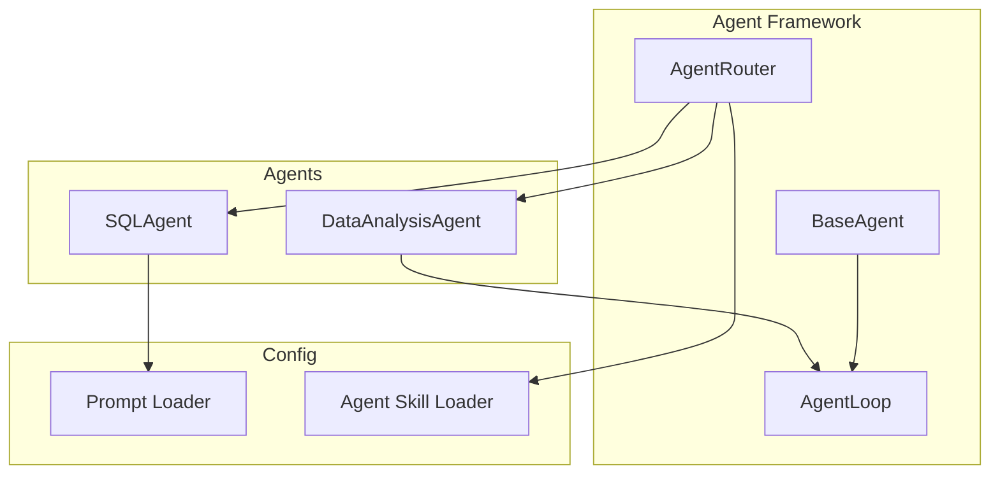
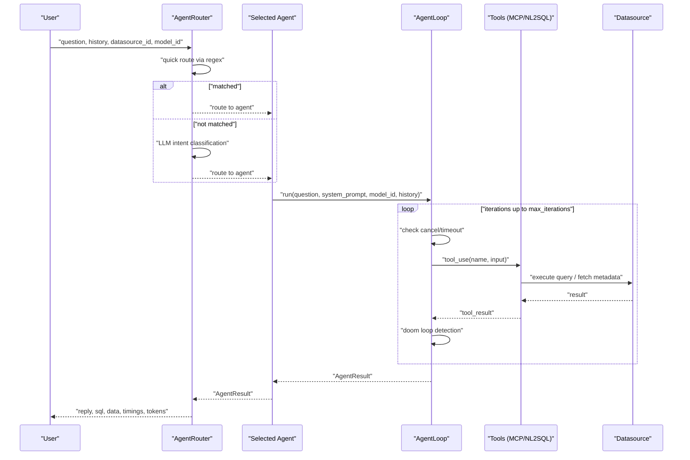
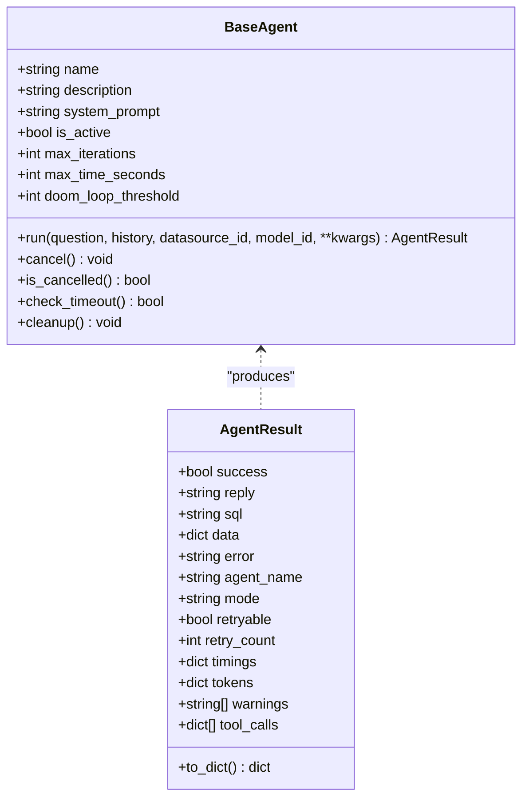
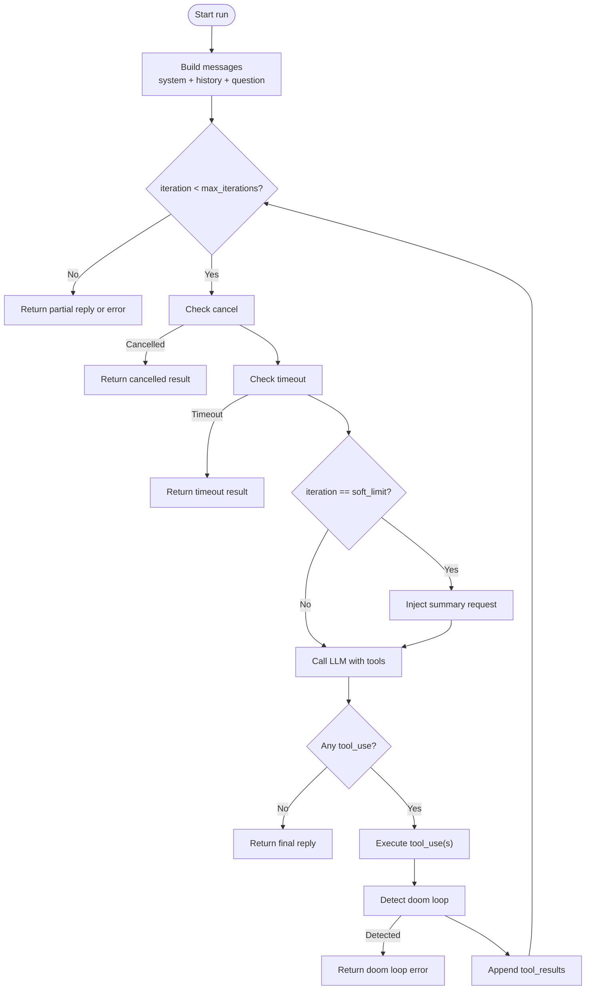
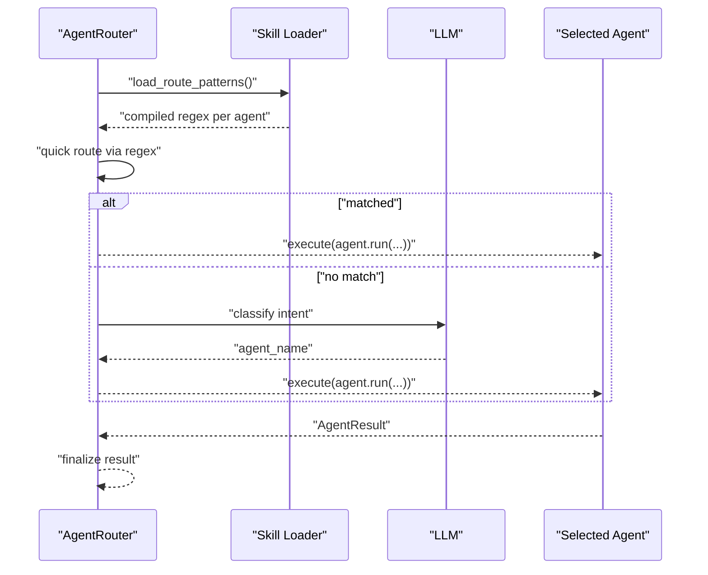
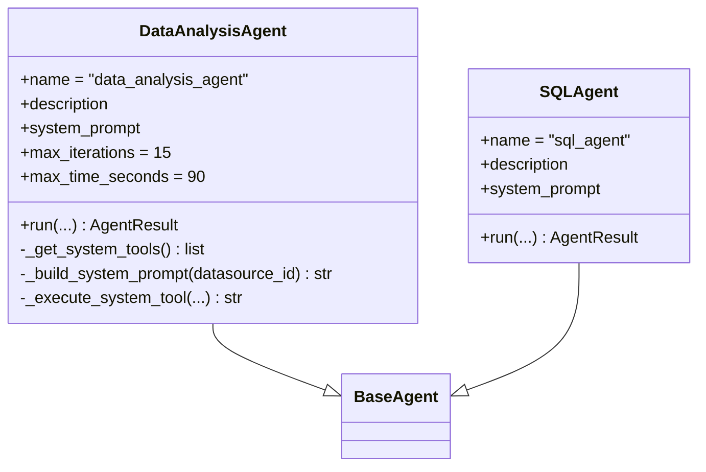
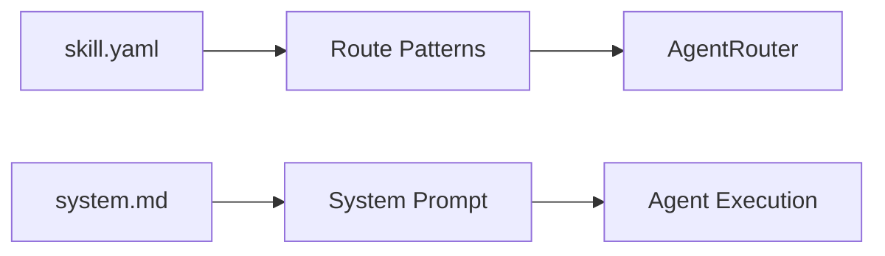
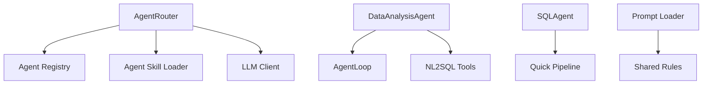

# Multi-Agent System

<cite>
**Referenced Files in This Document**
- [base.py](file://services/datamind/agent/base.py)
- [agent_loop.py](file://services/datamind/agent/agent_loop.py)
- [router.py](file://services/datamind/agent/router.py)
- [data_analysis_agent.py](file://services/datamind/agent/data_analysis_agent.py)
- [sql_agent.py](file://services/datamind/agent/sql_agent.py)
- [loader.py](file://services/datamind/config/loader.py)
- [agent_loader.py](file://services/datamind/config/agent_loader.py)
- [skill.yaml (data_analysis)](file://services/datamind/config/agents/data_analysis/skill.yaml)
- [system.md (data_analysis)](file://services/datamind/config/agents/data_analysis/system.md)
- [skill.yaml (orchestrator)](file://services/datamind/config/agents/orchestrator/skill.yaml)
- [system.md (orchestrator)](file://services/datamind/config/agents/orchestrator/system.md)
- [skill.yaml (anomaly)](file://services/datamind/config/agents/anomaly/skill.yaml)
- [skill.yaml (report)](file://services/datamind/config/agents/report/skill.yaml)
</cite>

## Table of Contents
1. Introduction
2. Project Structure
3. Core Components
4. Architecture Overview
5. Detailed Component Analysis
6. Dependency Analysis
7. Performance Considerations
8. Troubleshooting Guide
9. Conclusion
10. Appendices

## Introduction
This document explains AI-DataHub’s multi-agent system architecture and how it orchestrates intelligent agents to answer data questions, analyze logs, monitor traffic, profile users, build funnels, measure retention, detect anomalies, identify trends, and generate reports. The system is prompt-driven: agent behavior is controlled by markdown files and YAML skill definitions rather than code changes. It includes a robust AgentLoop with soft limits and doom loop detection, an intent Router for intelligent agent selection, and built-in agents that leverage MCP tools and datasource connections.

## Project Structure
The multi-agent system lives primarily under services/datamind:
- Agent framework: base class, loop, router, and concrete agents
- Prompt and skill configuration: per-agent skill.yaml and system.md files
- NL2SQL pipeline integration for SQL generation and execution
- Shared LLM client and tooling utilities

**Diagram sources**
- [base.py:52-129](file://services/datamind/agent/base.py#L52-L129)
- [agent_loop.py:23-66](file://services/datamind/agent/agent_loop.py#L23-L66)
- [router.py:167-266](file://services/datamind/agent/router.py#L167-L266)
- [data_analysis_agent.py:22-164](file://services/datamind/agent/data_analysis_agent.py#L22-L164)
- [sql_agent.py:15-74](file://services/datamind/agent/sql_agent.py#L15-L74)
- [loader.py:29-134](file://services/datamind/config/loader.py#L29-L134)
- [agent_loader.py:30-163](file://services/datamind/config/agent_loader.py#L30-L163)

**Section sources**
- [base.py:52-129](file://services/datamind/agent/base.py#L52-L129)
- [agent_loop.py:23-66](file://services/datamind/agent/agent_loop.py#L23-L66)
- [router.py:167-266](file://services/datamind/agent/router.py#L167-L266)
- [data_analysis_agent.py:22-164](file://services/datamind/agent/data_analysis_agent.py#L22-L164)
- [sql_agent.py:15-74](file://services/datamind/agent/sql_agent.py#L15-L74)
- [loader.py:29-134](file://services/datamind/config/loader.py#L29-L134)
- [agent_loader.py:30-163](file://services/datamind/config/agent_loader.py#L30-L163)

## Core Components
- BaseAgent: Abstract foundation defining lifecycle, cancellation, timeout checks, and result schema.
- AgentLoop: Reusable LLM-driven tool-calling loop with soft limits and doom loop detection.
- AgentRouter: Intent-based routing using quick regex patterns from skill.yaml and LLM classification fallback.
- Built-in Agents: Data analysis and SQL agents implemented as BaseAgent subclasses; others are configured via skill.yaml and system.md.

Key responsibilities:
- BaseAgent sets protection parameters (max iterations, time limit, doom loop threshold).
- AgentLoop manages message history, tool calls, timeouts, cancellations, token tracking, and Langfuse tracing.
- Router loads route patterns from skill.yaml, compiles regexes, and selects the best agent.
- Agents encapsulate domain logic and integrate with NL2SQL or MCP tools.

**Section sources**
- [base.py:17-129](file://services/datamind/agent/base.py#L17-L129)
- [agent_loop.py:23-66](file://services/datamind/agent/agent_loop.py#L23-L66)
- [router.py:17-266](file://services/datamind/agent/router.py#L17-L266)
- [data_analysis_agent.py:22-164](file://services/datamind/agent/data_analysis_agent.py#L22-L164)
- [sql_agent.py:15-74](file://services/datamind/agent/sql_agent.py#L15-L74)

## Architecture Overview
High-level flow:
- User question enters AgentRouter.
- Router attempts quick match via compiled regex patterns from each agent’s skill.yaml.
- If no quick match, Router uses LLM to classify intent and pick an agent.
- Selected agent runs its own loop (AgentLoop), calling tools (MCP or NL2SQL) until final answer or safety limits.
- Results include reply, optional SQL, structured data, timings, tokens, warnings, and tool call logs.

**Diagram sources**
- [router.py:167-266](file://services/datamind/agent/router.py#L167-L266)
- [agent_loop.py:60-324](file://services/datamind/agent/agent_loop.py#L60-L324)
- [data_analysis_agent.py:56-101](file://services/datamind/agent/data_analysis_agent.py#L56-L101)
- [sql_agent.py:22-68](file://services/datamind/agent/sql_agent.py#L22-L68)

## Detailed Component Analysis

### BaseAgent and AgentResult
- BaseAgent defines name, description, system_prompt, protection config, and lifecycle methods (run, cancel, cleanup).
- AgentResult carries success flag, reply, optional SQL, structured data, error, agent_name, mode, retry flags, timings, tokens, warnings, and tool_calls log.

**Diagram sources**
- [base.py:17-129](file://services/datamind/agent/base.py#L17-L129)

**Section sources**
- [base.py:17-129](file://services/datamind/agent/base.py#L17-L129)

### AgentLoop: Tool Calling with Soft Limits and Doom Loop Detection
- Builds initial messages from system prompt, recent history, and user question.
- Iteratively calls LLM with available tools, executes tool_use responses, and appends tool results.
- Enforces:
  - Cancellation check
  - Timeout check
  - Soft limit injection near max iterations to request summarization
  - Doom loop detection based on consecutive identical tool calls
- Tracks tokens and integrates with Langfuse for observability.

**Diagram sources**
- [agent_loop.py:60-324](file://services/datamind/agent/agent_loop.py#L60-L324)

**Section sources**
- [agent_loop.py:60-324](file://services/datamind/agent/agent_loop.py#L60-L324)

### AgentRouter: Intelligent Agent Selection
- Quick route: loads regex patterns from each agent’s skill.yaml and matches against the question.
- LLM route: builds a compact prompt describing active agents and their descriptions, then asks the LLM to choose one; falls back to sql_agent if uncertain.
- Executes selected agent and returns AgentResult.

**Diagram sources**
- [router.py:43-199](file://services/datamind/agent/router.py#L43-L199)
- [router.py:201-258](file://services/datamind/agent/router.py#L201-L258)
- [agent_loader.py:110-122](file://services/datamind/config/agent_loader.py#L110-L122)

**Section sources**
- [router.py:43-199](file://services/datamind/agent/router.py#L43-L199)
- [router.py:201-258](file://services/datamind/agent/router.py#L201-L258)
- [agent_loader.py:110-122](file://services/datamind/config/agent_loader.py#L110-L122)

### Built-in Agents
- DataAnalysisAgent: Uses AgentLoop with NL2SQL system tools to retrieve metadata, generate SQL, validate, execute, and analyze results. Configurable datasource context injected into system prompt.
- SQLAgent: Wraps existing NL2SQL quick pipeline as an agent, returning standardized AgentResult.

**Diagram sources**
- [data_analysis_agent.py:22-164](file://services/datamind/agent/data_analysis_agent.py#L22-L164)
- [sql_agent.py:15-74](file://services/datamind/agent/sql_agent.py#L15-L74)
- [base.py:52-129](file://services/datamind/agent/base.py#L52-L129)

**Section sources**
- [data_analysis_agent.py:22-164](file://services/datamind/agent/data_analysis_agent.py#L22-L164)
- [sql_agent.py:15-74](file://services/datamind/agent/sql_agent.py#L15-L74)

### Prompt-Driven Design and Skill Definitions
- Each agent has a directory under config/agents/{agent_name}/:
  - skill.yaml: metadata (name, display_name, description, datasource_type, max_retries, max_iterations, route_patterns, input_schema).
  - system.md: system prompt controlling agent behavior.
- Orchestrator agent coordinates delegation to sub-agents and enforces rules about when to delegate vs call tools directly.
- Prompt loader supports loading shared rules and dialect-specific prompts.

**Diagram sources**
- [agent_loader.py:30-122](file://services/datamind/config/agent_loader.py#L30-L122)
- [loader.py:29-134](file://services/datamind/config/loader.py#L29-L134)
- [skill.yaml (data_analysis):1-23](file://services/datamind/config/agents/data_analysis/skill.yaml#L1-L23)
- [system.md (data_analysis):1-27](file://services/datamind/config/agents/data_analysis/system.md#L1-L27)
- [skill.yaml (orchestrator):1-7](file://services/datamind/config/agents/orchestrator/skill.yaml#L1-L7)
- [system.md (orchestrator):1-31](file://services/datamind/config/agents/orchestrator/system.md#L1-L31)

**Section sources**
- [agent_loader.py:30-122](file://services/datamind/config/agent_loader.py#L30-L122)
- [loader.py:29-134](file://services/datamind/config/loader.py#L29-L134)
- [skill.yaml (data_analysis):1-23](file://services/datamind/config/agents/data_analysis/skill.yaml#L1-L23)
- [system.md (data_analysis):1-27](file://services/datamind/config/agents/data_analysis/system.md#L1-L27)
- [skill.yaml (orchestrator):1-7](file://services/datamind/config/agents/orchestrator/skill.yaml#L1-L7)
- [system.md (orchestrator):1-31](file://services/datamind/config/agents/orchestrator/system.md#L1-L31)

### Retry Logic and Parallel Execution
- Retry logic:
  - Per-agent max_retries defined in skill.yaml; effective value can be overridden by DB config.
  - AgentLoop does not auto-retry failed tools; failures are logged and returned in tool_calls_log. Higher-level orchestration can decide retries based on retryable flags in AgentResult.
- Parallel execution:
  - The provided AgentLoop executes tool_use sequentially within an iteration. For parallelism, implement concurrent tool execution at the execute_tool_fn level or in the agent’s tool executor.

**Section sources**
- [agent_loader.py:67-107](file://services/datamind/config/agent_loader.py#L67-L107)
- [agent_loop.py:215-297](file://services/datamind/agent/agent_loop.py#L215-L297)
- [base.py:17-33](file://services/datamind/agent/base.py#L17-L33)

### Datasource Connections and MCP Tool Integration
- Datasource context:
  - DataAnalysisAgent injects engine type and datasource_id into the system prompt to guide SQL generation.
  - NL2SQL components provide connection parameters and execution utilities.
- MCP tools:
  - Agents can use MCP tools via the tool execution layer; ensure MCP servers are registered and tools are exposed to the agent’s tool set.

**Section sources**
- [data_analysis_agent.py:117-133](file://services/datamind/agent/data_analysis_agent.py#L117-L133)
- [data_analysis_agent.py:135-158](file://services/datamind/agent/data_analysis_agent.py#L135-L158)

### Debugging Techniques and Performance Optimization
- Observability:
  - AgentLoop integrates with Langfuse for traces and generations, capturing inputs, outputs, usage, and metadata.
  - Tool calls are logged with arguments, results, errors, and elapsed times.
- Safety and performance:
  - Tune max_iterations and max_time_seconds per agent (via skill.yaml or defaults).
  - Use route_patterns to reduce LLM routing overhead and improve latency.
  - Monitor tool_call logs to identify repeated or failing tools.
- Diagnostics:
  - Inspect AgentResult.timings and tokens for performance bottlenecks.
  - Use force_agent in Router.execute to isolate issues to specific agents.

**Section sources**
- [agent_loop.py:93-110](file://services/datamind/agent/agent_loop.py#L93-L110)
- [agent_loop.py:356-423](file://services/datamind/agent/agent_loop.py#L356-L423)
- [agent_loop.py:254-297](file://services/datamind/agent/agent_loop.py#L254-L297)
- [router.py:170-199](file://services/datamind/agent/router.py#L170-L199)

## Dependency Analysis
- AgentRouter depends on:
  - Agent registry (registered instances)
  - Skill loader for route patterns
  - LLM client for intent classification
- DataAnalysisAgent depends on:
  - AgentLoop
  - NL2SQL orchestrator tools
- SQLAgent depends on:
  - NL2SQL quick pipeline
- Prompt loader supports shared rules and dialects.

**Diagram sources**
- [router.py:17-266](file://services/datamind/agent/router.py#L17-L266)
- [data_analysis_agent.py:22-164](file://services/datamind/agent/data_analysis_agent.py#L22-L164)
- [sql_agent.py:15-74](file://services/datamind/agent/sql_agent.py#L15-L74)
- [loader.py:29-134](file://services/datamind/config/loader.py#L29-L134)
- [agent_loader.py:30-163](file://services/datamind/config/agent_loader.py#L30-L163)

**Section sources**
- [router.py:17-266](file://services/datamind/agent/router.py#L17-L266)
- [data_analysis_agent.py:22-164](file://services/datamind/agent/data_analysis_agent.py#L22-L164)
- [sql_agent.py:15-74](file://services/datamind/agent/sql_agent.py#L15-L74)
- [loader.py:29-134](file://services/datamind/config/loader.py#L29-L134)
- [agent_loader.py:30-163](file://services/datamind/config/agent_loader.py#L30-L163)

## Performance Considerations
- Reduce routing cost:
  - Add precise route_patterns to skill.yaml to bypass LLM classification.
- Limit iterations and time:
  - Set appropriate max_iterations and max_time_seconds per agent to avoid long-running loops.
- Optimize tool calls:
  - Ensure tools return concise results; avoid excessive logging in tool outputs.
- Leverage caching:
  - Cache metadata and frequent queries where applicable at the tool layer.
- Monitor with Langfuse:
  - Track token usage and iteration counts to identify inefficiencies.

[No sources needed since this section provides general guidance]

## Troubleshooting Guide
Common issues and remedies:
- Doom loop detected:
  - Symptom: AgentLoop stops with “doom_loop_detected”.
  - Cause: Same tool called repeatedly with similar inputs beyond threshold.
  - Fix: Adjust agent prompt or tool design to vary inputs; increase doom_loop_threshold cautiously.
- Max iterations exceeded:
  - Symptom: AgentLoop returns partial reply or error after reaching max_iterations.
  - Fix: Increase max_iterations or refine prompts/tools to converge faster.
- Timeout:
  - Symptom: AgentLoop returns timeout error.
  - Fix: Increase max_time_seconds or optimize tool execution.
- Routing misclassification:
  - Symptom: Wrong agent selected.
  - Fix: Improve route_patterns or adjust agent descriptions; consider forcing agent for testing.
- Tool failures:
  - Symptom: Tool errors in tool_calls_log.
  - Fix: Validate tool inputs; add retry logic at higher orchestration layer if retryable.

**Section sources**
- [agent_loop.py:222-252](file://services/datamind/agent/agent_loop.py#L222-L252)
- [agent_loop.py:299-324](file://services/datamind/agent/agent_loop.py#L299-L324)
- [agent_loop.py:115-136](file://services/datamind/agent/agent_loop.py#L115-L136)
- [router.py:193-199](file://services/datamind/agent/router.py#L193-L199)

## Conclusion
AI-DataHub’s multi-agent system combines a robust agent framework, prompt-driven configuration, and intelligent routing to deliver scalable, safe, and observable data analysis workflows. By leveraging skill.yaml and system.md, teams can extend capabilities without code changes, while AgentLoop ensures reliability through soft limits and doom loop detection. The Router enables fast and accurate agent selection, and built-in agents integrate seamlessly with NL2SQL and MCP tools for comprehensive data operations.

[No sources needed since this section summarizes without analyzing specific files]

## Appendices

### Creating Custom Agents
Steps:
1. Create a new directory under services/datamind/config/agents/{your_agent}/.
2. Add skill.yaml with:
   - name, display_name, description
   - datasource_type (comma-separated or empty for all)
   - max_retries, max_iterations
   - route_patterns (regex strings)
   - input_schema (required and optional fields with descriptions and formats)
3. Add system.md with clear instructions, workflow, rules, and data authenticity constraints.
4. Register the agent implementation (subclass BaseAgent) and ensure it is discoverable by the router.
5. Test routing and execution; tune route_patterns and prompts iteratively.

**Section sources**
- [agent_loader.py:30-122](file://services/datamind/config/agent_loader.py#L30-L122)
- [skill.yaml (data_analysis):1-23](file://services/datamind/config/agents/data_analysis/skill.yaml#L1-L23)
- [system.md (data_analysis):1-27](file://services/datamind/config/agents/data_analysis/system.md#L1-L27)

### Agent Configuration Options Reference
- skill.yaml fields:
  - name: unique identifier used by router and registry
  - display_name: human-readable label
  - description: used for LLM routing context
  - datasource_type: allowed database types (e.g., mysql,doris); empty means any
  - max_retries: default override for retry attempts
  - max_iterations: default override for loop iterations
  - route_patterns: regex patterns for quick routing
  - input_schema: required and optional inputs with descriptions and formats
- system.md:
  - Defines agent behavior, workflow steps, rules, and constraints
- Orchestrator:
  - Coordinates delegation to sub-agents and enforces policy on direct tool usage

**Section sources**
- [skill.yaml (data_analysis):1-23](file://services/datamind/config/agents/data_analysis/skill.yaml#L1-L23)
- [skill.yaml (anomaly):1-24](file://services/datamind/config/agents/anomaly/skill.yaml#L1-L24)
- [skill.yaml (report):1-9](file://services/datamind/config/agents/report/skill.yaml#L1-L9)
- [system.md (orchestrator):1-31](file://services/datamind/config/agents/orchestrator/system.md#L1-L31)