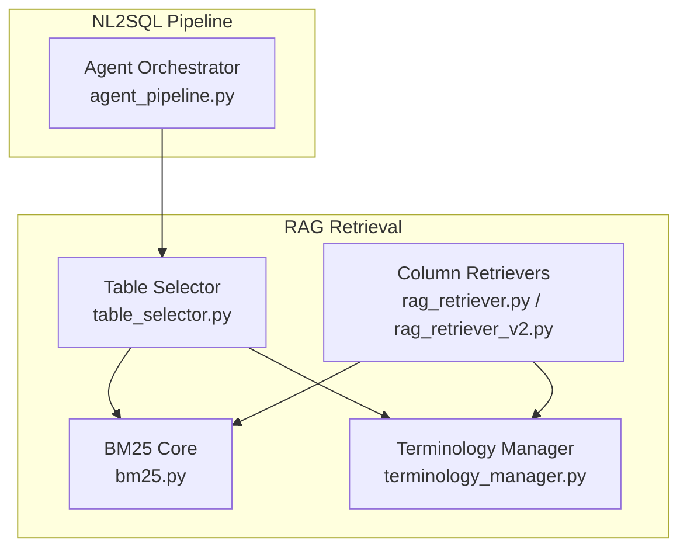
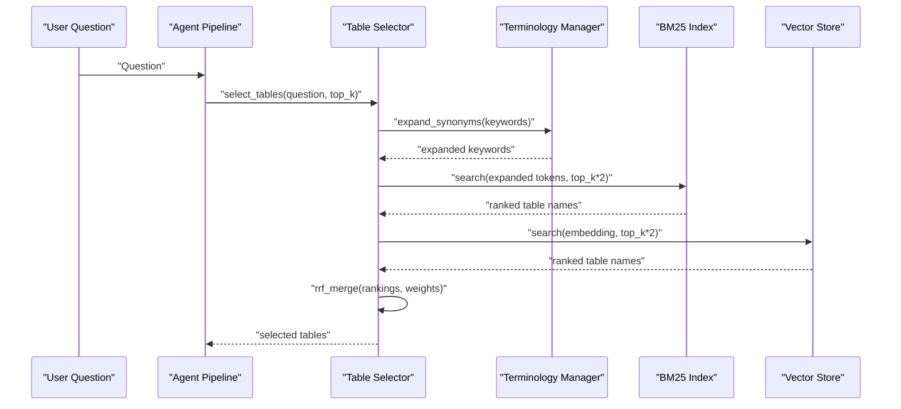
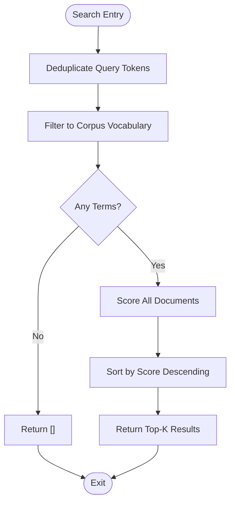
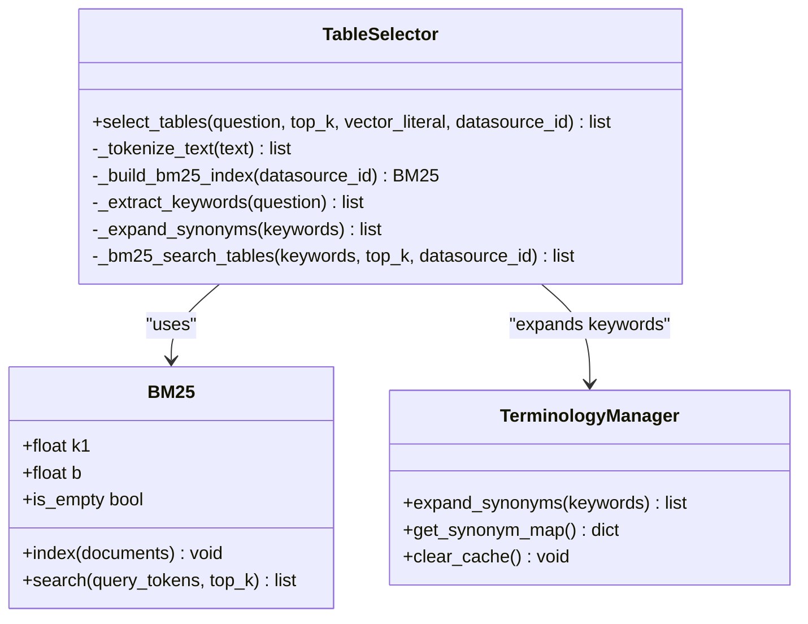
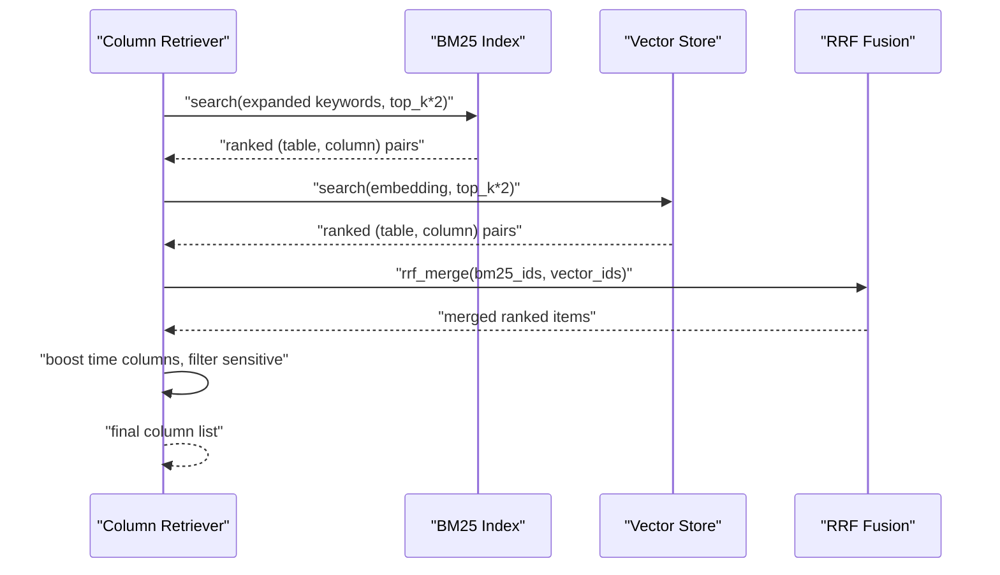
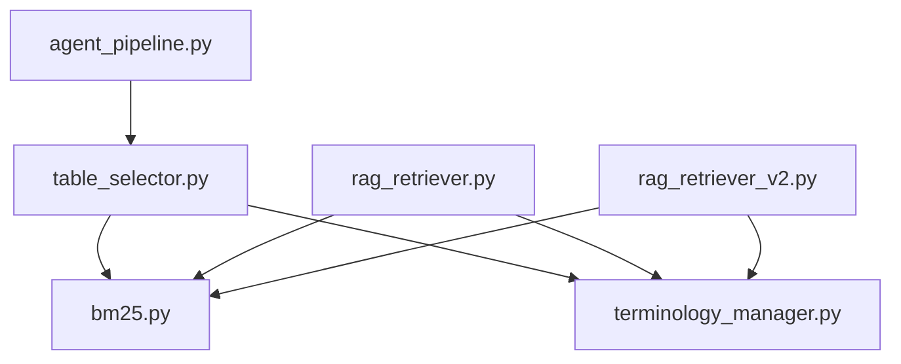

# BM25 Implementation

<cite>
**Referenced Files in This Document**
- [bm25.py](file://services/datamind/rag/bm25.py)
- [table_selector.py](file://services/datamind/rag/table_selector.py)
- [rag_retriever.py](file://services/datamind/rag/rag_retriever.py)
- [rag_retriever_v2.py](file://services/datamind/rag/rag_retriever_v2.py)
- [terminology_manager.py](file://services/datamind/rag/terminology_manager.py)
- [agent_pipeline.py](file://services/datamind/nl2sql/orchestrator/agent_pipeline.py)
</cite>

## Table of Contents
1. [Introduction](#introduction)
2. [Project Structure](#project-structure)
3. [Core Components](#core-components)
4. [Architecture Overview](#architecture-overview)
5. [Detailed Component Analysis](#detailed-component-analysis)
6. [Dependency Analysis](#dependency-analysis)
7. [Performance Considerations](#performance-considerations)
8. [Troubleshooting Guide](#troubleshooting-guide)
9. [Conclusion](#conclusion)

## Introduction
This document explains the pure Python BM25 sparse search implementation used for Chinese metadata retrieval in the NL2SQL pipeline. It covers tokenization, IDF calculation, relevance scoring, and how the table selector uses BM25 to filter candidate tables based on query similarity. It also documents indexing of metadata documents, parameter tuning options (k1, b), optimization techniques for large-scale searches, query processing examples, score interpretation, integration with the broader retrieval pipeline, performance considerations, caching strategies, and troubleshooting issues specific to Chinese text processing.

## Project Structure
The BM25-based retrieval is implemented under the RAG module and integrated into the NL2SQL agent pipeline:
- BM25 core algorithm and fusion utility are in bm25.py
- Table selection logic using BM25 + vector hybrid retrieval is in table_selector.py
- Column-level BM25 usage and hybrid retrieval are in rag_retriever.py and rag_retriever_v2.py
- Terminology expansion via business terms is in terminology_manager.py
- Agent orchestration invokes select_tables as a tool in agent_pipeline.py

**Diagram sources**
- [bm25.py:22-143](file://services/datamind/rag/bm25.py#L22-L143)
- [table_selector.py:128-249](file://services/datamind/rag/table_selector.py#L128-L249)
- [rag_retriever.py:260-463](file://services/datamind/rag/rag_retriever.py#L260-L463)
- [rag_retriever_v2.py:190-348](file://services/datamind/rag/rag_retriever_v2.py#L190-L348)
- [terminology_manager.py:140-156](file://services/datamind/rag/terminology_manager.py#L140-L156)
- [agent_pipeline.py:822-828](file://services/datamind/nl2sql/orchestrator/agent_pipeline.py#L822-L828)

**Section sources**
- [bm25.py:1-173](file://services/datamind/rag/bm25.py#L1-L173)
- [table_selector.py:1-276](file://services/datamind/rag/table_selector.py#L1-L276)
- [rag_retriever.py:1-800](file://services/datamind/rag/rag_retriever.py#L1-L800)
- [rag_retriever_v2.py:1-800](file://services/datamind/rag/rag_retriever_v2.py#L1-L800)
- [terminology_manager.py:1-185](file://services/datamind/rag/terminology_manager.py#L1-L185)
- [agent_pipeline.py:822-828](file://services/datamind/nl2sql/orchestrator/agent_pipeline.py#L822-L828)

## Core Components
- BM25 class: Pure Python Okapi BM25 scorer over pre-tokenized documents with configurable k1 and b parameters. Supports indexing and top-k search. Includes Reciprocal Rank Fusion (RRF) merge utility.
- Table Selector: Tokenizes user questions (Chinese segmentation via jieba with regex fallback), expands synonyms from business terms, builds per-datasource BM25 indexes from table metadata, performs BM25 sparse retrieval, merges with vector dense results via RRF, and returns selected table names.
- Column Retrievers: Build BM25 indexes from column metadata and perform hybrid retrieval similar to table selection; integrate time-related column boosting and sensitive column filtering.
- Terminology Manager: Loads active business terms and table keywords from the database, caches them with TTL, and provides synonym expansion for queries.

Key responsibilities:
- Tokenization and stopword handling for Chinese text
- Indexing of metadata documents (tables/columns)
- Query expansion via synonyms
- Hybrid retrieval (sparse BM25 + dense vector) with RRF fusion
- Caching of indexes and metadata per datasource

**Section sources**
- [bm25.py:22-143](file://services/datamind/rag/bm25.py#L22-L143)
- [table_selector.py:39-87](file://services/datamind/rag/table_selector.py#L39-L87)
- [rag_retriever.py:260-463](file://services/datamind/rag/rag_retriever.py#L260-L463)
- [terminology_manager.py:77-156](file://services/datamind/rag/terminology_manager.py#L77-L156)

## Architecture Overview
The retrieval architecture combines sparse keyword matching (BM25) with dense semantic matching (vector embeddings). The table selector orchestrates this hybrid approach:

**Diagram sources**
- [table_selector.py:178-249](file://services/datamind/rag/table_selector.py#L178-L249)
- [terminology_manager.py:146-156](file://services/datamind/rag/terminology_manager.py#L146-L156)
- [bm25.py:88-118](file://services/datamind/rag/bm25.py#L88-L118)

**Section sources**
- [table_selector.py:178-249](file://services/datamind/rag/table_selector.py#L178-L249)
- [agent_pipeline.py:822-828](file://services/datamind/nl2sql/orchestrator/agent_pipeline.py#L822-L828)

## Detailed Component Analysis

### BM25 Algorithm
- Tokenization: Accepts pre-tokenized documents (lists of strings). For Chinese, tokenization is performed by table_selector._tokenize_text using jieba or regex fallback.
- IDF Calculation: Uses smoothed IDF formula log((N - df + 0.5) / (df + 0.5) + 1) where N is document count and df is document frequency.
- Relevance Scoring: Computes BM25 TF component per term: (tf * (k1 + 1)) / (tf + k1 * (1 - b + b * dl/avgdl)), then sums idf * tf_component across query terms.
- Search: Deduplicates query tokens, filters to corpus vocabulary, scores all documents, sorts descending, and returns top-k.

**Diagram sources**
- [bm25.py:88-118](file://services/datamind/rag/bm25.py#L88-L118)
- [bm25.py:120-139](file://services/datamind/rag/bm25.py#L120-L139)

**Section sources**
- [bm25.py:22-143](file://services/datamind/rag/bm25.py#L22-L143)

### Table Selector Functionality
- Keyword Extraction: Uses jieba.lcut with stopword filtering and minimum token length; falls back to regex if jieba is unavailable.
- Synonym Expansion: Expands keywords using terminology_manager.expand_synonyms, which loads business terms and table keywords from the database with TTL caching.
- BM25 Index Building: Builds per-datasource BM25 index from table metadata fields (table_name, table_comment, table_business_desc, region_tag, domain_tag).
- Hybrid Retrieval: Combines BM25 sparse results with vector dense results using RRF fusion with equal weights.
- Caching: Maintains per-datasource caches for table metadata and BM25 indexes; supports clearing cache after metadata changes.

**Diagram sources**
- [bm25.py:22-143](file://services/datamind/rag/bm25.py#L22-L143)
- [table_selector.py:39-249](file://services/datamind/rag/table_selector.py#L39-L249)
- [terminology_manager.py:140-156](file://services/datamind/rag/terminology_manager.py#L140-L156)

**Section sources**
- [table_selector.py:39-249](file://services/datamind/rag/table_selector.py#L39-L249)
- [terminology_manager.py:77-156](file://services/datamind/rag/terminology_manager.py#L77-L156)

### Column-Level BM25 Integration
- Indexing: Builds BM25 indexes from column metadata (column_name, column_comment, business_desc) per datasource.
- Retrieval: Performs hybrid retrieval combining BM25 sparse and vector dense results using RRF fusion.
- Post-processing: Boosts time-related columns from matched tables and filters sensitive columns.

**Diagram sources**
- [rag_retriever.py:290-463](file://services/datamind/rag/rag_retriever.py#L290-L463)
- [rag_retriever_v2.py:190-348](file://services/datamind/rag/rag_retriever_v2.py#L190-L348)

**Section sources**
- [rag_retriever.py:290-463](file://services/datamind/rag/rag_retriever.py#L290-L463)
- [rag_retriever_v2.py:190-348](file://services/datamind/rag/rag_retriever_v2.py#L190-L348)

### Integration with NL2SQL Pipeline
The agent pipeline integrates BM25-based table selection as a tool:
- Tool Definition: select_tables is defined as a tool with description indicating BM25+vector hybrid retrieval
- Invocation: Agent calls select_tables with question and optional datasource_id
- Result Usage: Selected tables guide subsequent metadata retrieval and SQL generation

**Section sources**
- [agent_pipeline.py:822-828](file://services/datamind/nl2sql/orchestrator/agent_pipeline.py#L822-L828)

## Dependency Analysis
The BM25 implementation has clear dependency relationships:
- BM25 core is independent and self-contained
- Table selector depends on BM25, terminology manager, and vector store
- Column retrievers depend on BM25 and terminology manager
- Agent pipeline depends on table selector

**Diagram sources**
- [bm25.py:1-173](file://services/datamind/rag/bm25.py#L1-L173)
- [table_selector.py:1-276](file://services/datamind/rag/table_selector.py#L1-L276)
- [rag_retriever.py:1-800](file://services/datamind/rag/rag_retriever.py#L1-L800)
- [rag_retriever_v2.py:1-800](file://services/datamind/rag/rag_retriever_v2.py#L1-L800)
- [terminology_manager.py:1-185](file://services/datamind/rag/terminology_manager.py#L1-L185)
- [agent_pipeline.py:822-828](file://services/datamind/nl2sql/orchestrator/agent_pipeline.py#L822-L828)

**Section sources**
- [bm25.py:1-173](file://services/datamind/rag/bm25.py#L1-L173)
- [table_selector.py:1-276](file://services/datamind/rag/table_selector.py#L1-L276)

## Performance Considerations
- Index Construction: BM25 index building is O(N*D) where N is number of documents and D is average document length. Per-datasource caching avoids repeated construction.
- Query Processing: BM25 search is O(Q*V) where Q is unique query terms and V is vocabulary size. Query deduplication reduces redundant scoring.
- Memory Usage: In-memory storage of term frequencies, document lengths, and IDF values. Large corpora may require memory management strategies.
- Tokenization: Jieba segmentation is efficient but can be resource-intensive. Regex fallback provides graceful degradation.
- Caching: Multiple levels of caching including table metadata, BM25 indexes, terminology data with TTL, and RAG results cache.
- Hybrid Retrieval: RRF fusion provides robust combination of sparse and dense results without requiring score normalization.

Optimization techniques:
- Per-datasource isolation prevents cross-contamination and enables targeted indexing
- Early termination in search when no matching terms exist
- Efficient data structures (defaultdict, sets) for term frequency and deduplication
- Connection pooling for database operations
- Parallel execution in some retrieval paths (thread pool for concurrent searches)

[No sources needed since this section provides general guidance]

## Troubleshooting Guide
Common issues with Chinese text processing and their solutions:

- Missing Jieba Library: Falls back to regex-based tokenization, which may produce less accurate results. Install jieba for optimal performance.
- Stop Word Filtering: Ensure comprehensive stop word lists for Chinese to remove common words that don't contribute to meaning.
- Token Length Filtering: Minimum token length of 2 characters helps remove noise but may miss important single-character terms.
- Synonym Expansion Failures: Database connectivity issues or empty business terms table can limit query expansion. Check terminology manager cache and database status.
- Index Staleness: Metadata changes require cache clearing to rebuild BM25 indexes. Use clear_cache functions when metadata updates occur.
- Performance Degradation: Large datasets may cause slow indexing. Consider partitioning by datasource and optimizing index refresh schedules.
- Vector Search Fallback: When vector search fails, system falls back to information_schema. Check vector store connectivity and configuration.

Debugging steps:
- Enable debug logging to inspect tokenization results and intermediate rankings
- Verify datasource_id filtering is working correctly
- Check cache invalidation after metadata updates
- Monitor memory usage during index construction
- Validate Chinese text encoding and preprocessing

**Section sources**
- [table_selector.py:39-55](file://services/datamind/rag/table_selector.py#L39-L55)
- [terminology_manager.py:77-156](file://services/datamind/rag/terminology_manager.py#L77-L156)
- [rag_retriever.py:769-786](file://services/datamind/rag/rag_retriever.py#L769-L786)

## Conclusion
The BM25 implementation provides a robust foundation for Chinese metadata retrieval in the NL2SQL pipeline. The pure Python implementation ensures portability while delivering effective sparse search capabilities. Combined with vector dense retrieval and synonym expansion, it creates a powerful hybrid search system that effectively handles the complexities of Chinese text processing. The modular design allows for easy maintenance and extension, while caching strategies ensure good performance for large-scale deployments.

Key strengths:
- Accurate Chinese text tokenization with fallback mechanisms
- Effective BM25 scoring with configurable parameters
- Robust hybrid retrieval combining sparse and dense approaches
- Comprehensive caching and performance optimizations
- Seamless integration with existing NL2SQL pipeline

Future enhancements could include:
- Advanced Chinese-specific tokenization improvements
- Dynamic parameter tuning based on corpus characteristics
- Distributed indexing for very large datasets
- Enhanced synonym expansion with machine learning models
- Real-time index updates for dynamic metadata environments

[No sources needed since this section summarizes without analyzing specific files]