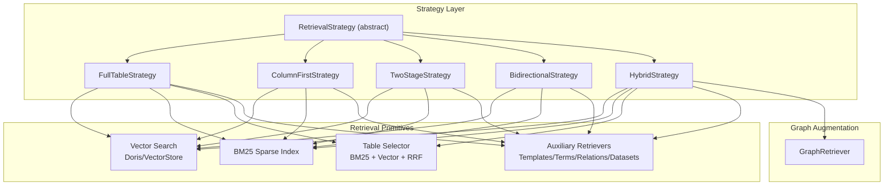
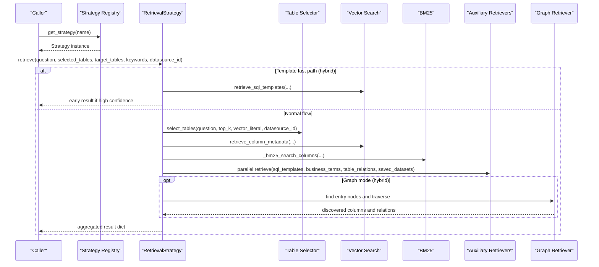
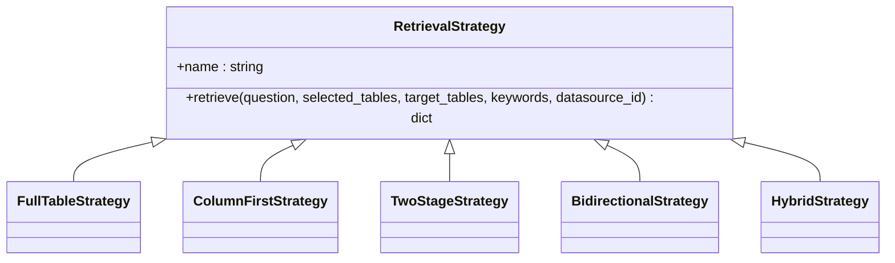
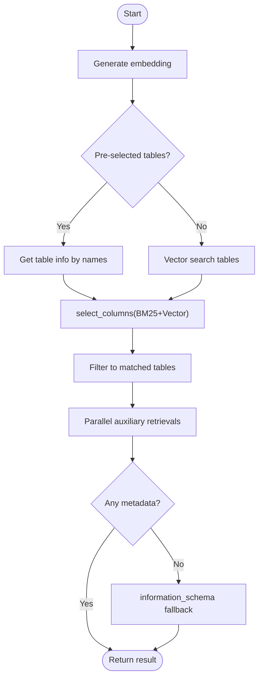
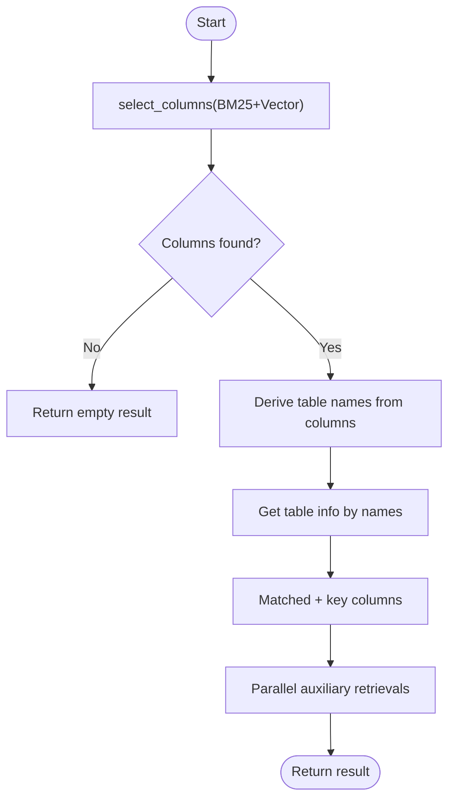
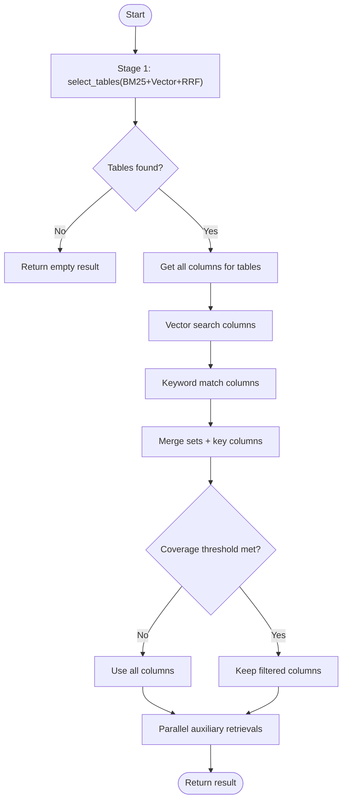
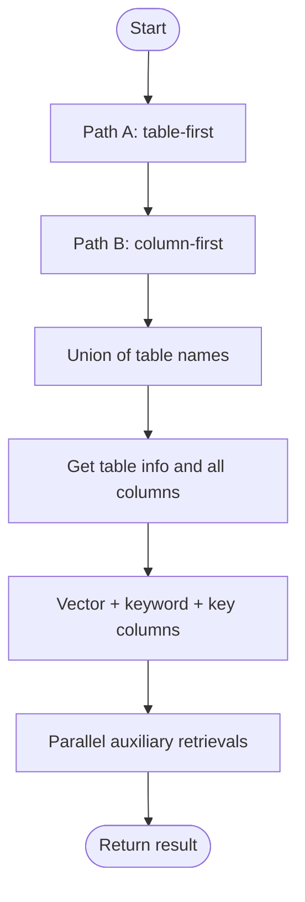
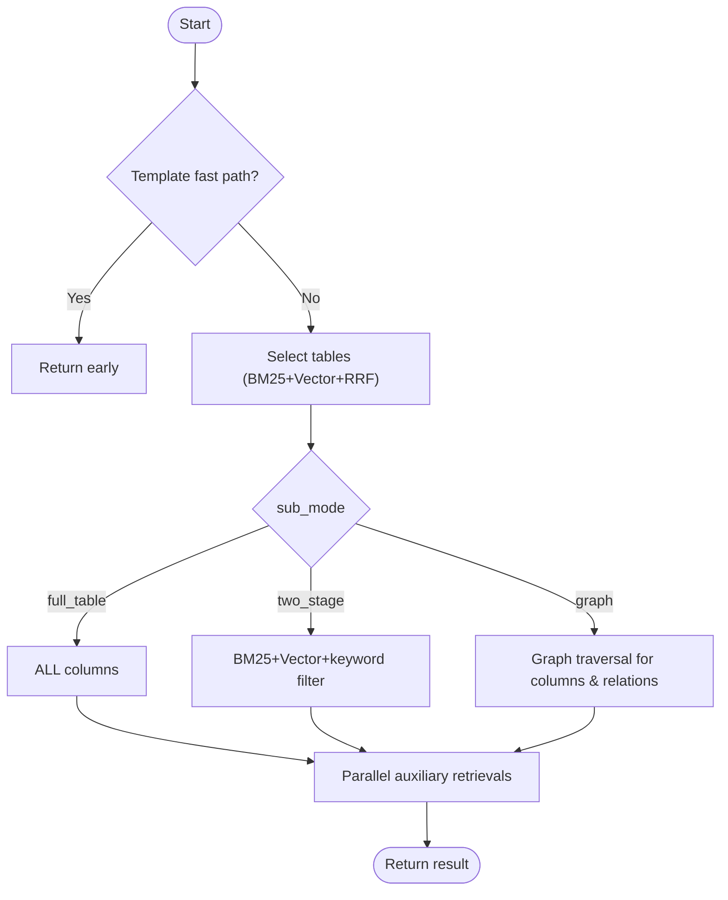
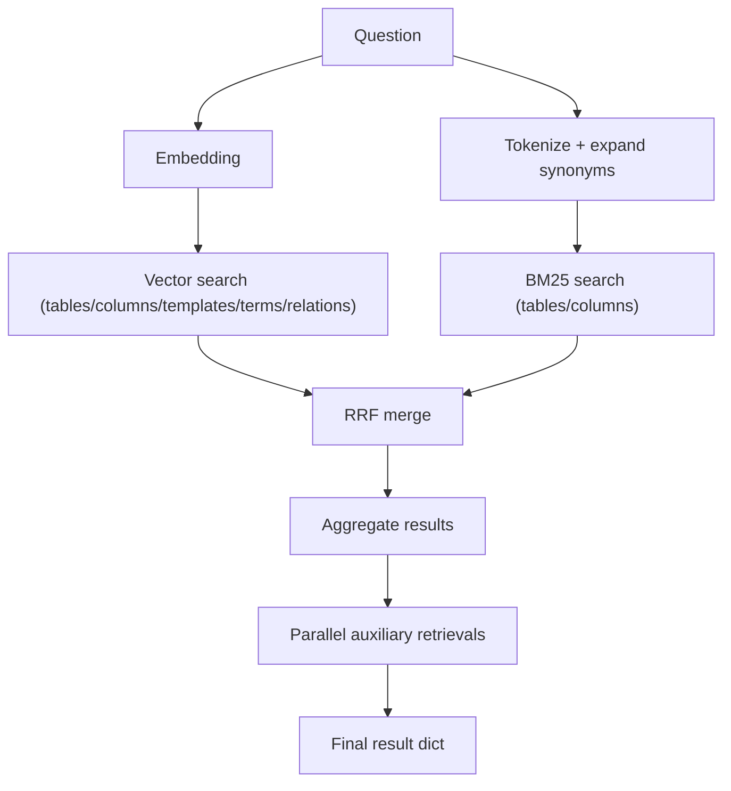
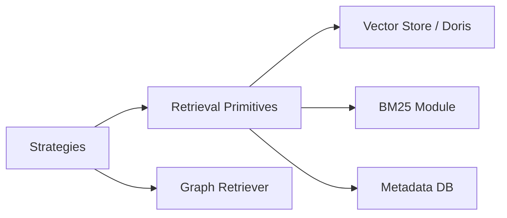

# RAG Architecture & Strategies

<cite>
**Referenced Files in This Document**
- [rag_retriever.py](file://services/datamind/rag/rag_retriever.py)
- [rag_retriever_v2.py](file://services/datamind/rag/rag_retriever_v2.py)
- [table_selector.py](file://services/datamind/rag/table_selector.py)
- [bm25.py](file://services/datamind/rag/bm25.py)
- [strategies/__init__.py](file://services/datamind/rag/strategies/__init__.py)
- [strategies/base.py](file://services/datamind/rag/strategies/base.py)
- [strategies/full_table.py](file://services/datamind/rag/strategies/full_table.py)
- [strategies/column_first.py](file://services/datamind/rag/strategies/column_first.py)
- [strategies/two_stage.py](file://services/datamind/rag/strategies/two_stage.py)
- [strategies/bidirectional.py](file://services/datamind/rag/strategies/bidirectional.py)
- [strategies/hybrid.py](file://services/datamind/rag/strategies/hybrid.py)
- [graph_rag/graph_retriever.py](file://services/datamind/rag/graph_rag/graph_retriever.py)
</cite>

## Table of Contents
1. Introduction
2. Project Structure
3. Core Components
4. Architecture Overview
5. Detailed Component Analysis
6. Dependency Analysis
7. Performance Considerations
8. Troubleshooting Guide
9. Conclusion
10. Appendices

## Introduction
This document explains the Retrieval-Augmented Generation (RAG) pipeline used by the NL2SQL system to retrieve relevant metadata for natural language questions. It covers the overall architecture, strategy pattern implementation, and each retrieval strategy: full_table, column_first, two_stage, bidirectional, and hybrid. It details selection logic, execution flow, result aggregation, configuration options, performance characteristics, and recommended use cases.

## Project Structure
The RAG subsystem is implemented under services/datamind/rag with a clear separation between:
- Retrieval primitives: vector search, BM25 sparse search, table/column selection, and auxiliary retrievals (templates, business terms, relations, saved datasets).
- Strategy layer: pluggable strategies that orchestrate retrieval flows and return a uniform result contract.
- Graph augmentation: optional graph-based traversal for discovery and relation extraction.

**Diagram sources**
- [strategies/base.py:10-43](file://services/datamind/rag/strategies/base.py#L10-L43)
- [strategies/full_table.py:15-92](file://services/datamind/rag/strategies/full_table.py#L15-L92)
- [strategies/column_first.py:15-100](file://services/datamind/rag/strategies/column_first.py#L15-L100)
- [strategies/two_stage.py:19-126](file://services/datamind/rag/strategies/two_stage.py#L19-L126)
- [strategies/bidirectional.py:16-110](file://services/datamind/rag/strategies/bidirectional.py#L16-L110)
- [strategies/hybrid.py:30-128](file://services/datamind/rag/strategies/hybrid.py#L30-L128)
- [graph_rag/graph_retriever.py:14-295](file://services/datamind/rag/graph_rag/graph_retriever.py#L14-L295)

**Section sources**
- [strategies/__init__.py:10-31](file://services/datamind/rag/strategies/__init__.py#L10-L31)
- [strategies/base.py:10-43](file://services/datamind/rag/strategies/base.py#L10-L43)

## Core Components
- Retrieval primitives:
  - Vector search over table info, column metadata, SQL templates, business terms, and table relations via Doris HNSW or a VectorStore abstraction.
  - BM25 sparse indexing and search for tables and columns with Chinese tokenization and stop-word filtering.
  - Table selector combining BM25 and vector results using Reciprocal Rank Fusion (RRF).
  - Auxiliary retrievers for SQL templates, business terms, table relations, and saved datasets.
- Strategy layer:
  - Abstract base class defining a uniform retrieve() interface returning table_info, column_metadata, business_terms, table_relations, sql_templates, saved_datasets, and rag_source.
  - Concrete strategies implementing different retrieval flows and column filtering policies.
- Graph augmentation:
  - Optional graph traversal to discover related tables/columns and extract join relations.

Key responsibilities and data contracts are consistent across strategies, enabling interchangeable use and downstream prompt building without strategy-specific code.

**Section sources**
- [rag_retriever.py:74-142](file://services/datamind/rag/rag_retriever.py#L74-L142)
- [rag_retriever.py:149-257](file://services/datamind/rag/rag_retriever.py#L149-L257)
- [rag_retriever.py:369-463](file://services/datamind/rag/rag_retriever.py#L369-L463)
- [rag_retriever.py:492-547](file://services/datamind/rag/rag_retriever.py#L492-L547)
- [rag_retriever.py:550-646](file://services/datamind/rag/rag_retriever.py#L550-L646)
- [rag_retriever.py:674-750](file://services/datamind/rag/rag_retriever.py#L674-L750)
- [table_selector.py:178-249](file://services/datamind/rag/table_selector.py#L178-L249)
- [bm25.py:22-143](file://services/datamind/rag/bm25.py#L22-L143)
- [bm25.py:146-173](file://services/datamind/rag/bm25.py#L146-L173)

## Architecture Overview
The RAG pipeline uses a strategy pattern to select and execute retrieval flows. Each strategy composes primitive retrievers (vector, BM25, table/column selectors, auxiliary) and aggregates results into a unified dict. The default strategy is hybrid, which adds a template fast path and supports sub-modes for column handling.

**Diagram sources**
- [strategies/__init__.py:34-55](file://services/datamind/rag/strategies/__init__.py#L34-L55)
- [strategies/hybrid.py:42-128](file://services/datamind/rag/strategies/hybrid.py#L42-L128)
- [table_selector.py:178-249](file://services/datamind/rag/table_selector.py#L178-L249)
- [rag_retriever.py:492-547](file://services/datamind/rag/rag_retriever.py#L492-L547)
- [graph_rag/graph_retriever.py:243-295](file://services/datamind/rag/graph_rag/graph_retriever.py#L243-L295)

## Detailed Component Analysis

### Strategy Pattern and Selection Logic
- Base interface defines retrieve() with standardized inputs and outputs, ensuring downstream components remain strategy-agnostic.
- Registry maps strategy names to classes and provides defaults from system configuration.
- Default strategy is hybrid; fallback occurs when an unknown name is provided.

**Diagram sources**
- [strategies/base.py:10-43](file://services/datamind/rag/strategies/base.py#L10-L43)
- [strategies/full_table.py:15-92](file://services/datamind/rag/strategies/full_table.py#L15-L92)
- [strategies/column_first.py:15-100](file://services/datamind/rag/strategies/column_first.py#L15-L100)
- [strategies/two_stage.py:19-126](file://services/datamind/rag/strategies/two_stage.py#L19-L126)
- [strategies/bidirectional.py:16-110](file://services/datamind/rag/strategies/bidirectional.py#L16-L110)
- [strategies/hybrid.py:30-128](file://services/datamind/rag/strategies/hybrid.py#L30-L128)

**Section sources**
- [strategies/__init__.py:18-55](file://services/datamind/rag/strategies/__init__.py#L18-L55)
- [strategies/base.py:10-61](file://services/datamind/rag/strategies/base.py#L10-L61)

### Full Table Strategy
- Flow:
  - Generate embedding once.
  - Select tables via pre-selected list or vector search.
  - Retrieve columns using BM25 + vector hybrid selection, then filter to matched tables.
  - Parallel auxiliary retrievals for templates, terms, relations, datasets.
  - Fallback to information_schema if both table and column metadata are empty.
- Configuration:
  - No runtime parameters beyond standard retrieve() inputs.
- Performance:
  - Comprehensive context; may include many irrelevant columns.
  - Uses parallelism for auxiliary retrievals to reduce latency.
- Use case recommendation:
  - When recall is prioritized and LLM can handle larger context windows.

**Diagram sources**
- [strategies/full_table.py:20-92](file://services/datamind/rag/strategies/full_table.py#L20-L92)
- [rag_retriever.py:369-463](file://services/datamind/rag/rag_retriever.py#L369-L463)

**Section sources**
- [strategies/full_table.py:15-141](file://services/datamind/rag/strategies/full_table.py#L15-L141)

### Column First Strategy
- Flow:
  - Directly retrieve columns via BM25 + vector hybrid selection.
  - Derive unique table names from matched columns.
  - Fetch table info for derived tables.
  - Build column set including matched columns plus key columns for JOIN context.
  - Parallel auxiliary retrievals.
- Configuration:
  - Standard retrieve() inputs only.
- Performance:
  - Precise and less noisy; may miss related columns if embeddings do not match well.
- Use case recommendation:
  - When keyword-aware precision is important and context size should be minimized.

**Diagram sources**
- [strategies/column_first.py:20-100](file://services/datamind/rag/strategies/column_first.py#L20-L100)

**Section sources**
- [strategies/column_first.py:15-131](file://services/datamind/rag/strategies/column_first.py#L15-L131)

### Two Stage Strategy
- Flow:
  - Stage 1: coarse table selection via table_selector (BM25 + vector + RRF), falling back to vector-only if needed.
  - Stage 2: per-table column filtering using vector search and keyword matching; ensure minimum coverage and preserve key columns.
  - Parallel auxiliary retrievals.
- Configuration:
  - Standard retrieve() inputs only.
- Performance:
  - Balanced noise vs relevance; second stage adds latency but improves precision.
- Use case recommendation:
  - When you want better precision than full_table while retaining broader context.

**Diagram sources**
- [strategies/two_stage.py:24-126](file://services/datamind/rag/strategies/two_stage.py#L24-L126)
- [table_selector.py:178-249](file://services/datamind/rag/table_selector.py#L178-L249)

**Section sources**
- [strategies/two_stage.py:19-157](file://services/datamind/rag/strategies/two_stage.py#L19-L157)

### Bidirectional Strategy
- Flow:
  - Path A: table-first retrieval (same as full_table).
  - Path B: column-first retrieval to derive tables.
  - Merge table names from both paths; fetch table info and columns.
  - Filter columns by vector matches, keyword matches, and key columns; ensure minimum coverage.
  - Parallel auxiliary retrievals.
- Configuration:
  - Standard retrieve() inputs only.
- Performance:
  - Best recall; more context than two_stage due to union of paths.
- Use case recommendation:
  - When missing relevant tables/columns is unacceptable and context budget allows.

**Diagram sources**
- [strategies/bidirectional.py:21-110](file://services/datamind/rag/strategies/bidirectional.py#L21-L110)

**Section sources**
- [strategies/bidirectional.py:16-141](file://services/datamind/rag/strategies/bidirectional.py#L16-L141)

### Hybrid Strategy
- Flow:
  - Step 0: Template fast path (currently disabled to avoid premature exit; templates are included naturally via normal flow).
  - Step 1: Table retrieval using table_selector (BM25 + vector + RRF), with fallback to pure vector search.
  - Step 2: Column retrieval based on sub_mode:
    - full_table: return ALL columns for matched tables.
    - two_stage: BM25 + vector + keyword filtering with safety thresholds.
    - graph: entry node discovery and ego-graph traversal to discover columns and relations.
  - Step 3: Parallel auxiliary retrieval (templates, terms, relations, datasets).
- Configuration:
  - sub_mode parameter controls column handling: "full_table", "two_stage", "graph".
- Performance:
  - Unified pipeline with flexible column handling; graph mode adds traversal cost but enriches relations.
- Use case recommendation:
  - Default choice for most scenarios; choose sub_mode based on desired precision vs recall trade-off.

**Diagram sources**
- [strategies/hybrid.py:42-128](file://services/datamind/rag/strategies/hybrid.py#L42-L128)
- [strategies/hybrid.py:185-212](file://services/datamind/rag/strategies/hybrid.py#L185-L212)
- [strategies/hybrid.py:222-281](file://services/datamind/rag/strategies/hybrid.py#L222-L281)
- [strategies/hybrid.py:316-413](file://services/datamind/rag/strategies/hybrid.py#L316-L413)

**Section sources**
- [strategies/hybrid.py:30-461](file://services/datamind/rag/strategies/hybrid.py#L30-L461)

### Retrieval Primitives and Aggregation
- Vector search:
  - Retrieves table info, column metadata, SQL templates, business terms, and table relations using Doris HNSW or VectorStore abstraction.
  - Supports datasource filtering and boosting by target tables.
- BM25 sparse search:
  - Tokenizes text (Chinese via jieba with stop words), builds inverted index, and scores documents.
  - Used for table and column selection.
- RRF fusion:
  - Merges rankings from BM25 and vector searches to improve robustness.
- Auxiliary retrievals:
  - Templates, business terms, relations, and saved datasets retrieved in parallel to minimize latency.

**Diagram sources**
- [table_selector.py:178-249](file://services/datamind/rag/table_selector.py#L178-L249)
- [bm25.py:146-173](file://services/datamind/rag/bm25.py#L146-L173)
- [rag_retriever.py:369-463](file://services/datamind/rag/rag_retriever.py#L369-L463)

**Section sources**
- [rag_retriever.py:74-142](file://services/datamind/rag/rag_retriever.py#L74-L142)
- [rag_retriever.py:149-257](file://services/datamind/rag/rag_retriever.py#L149-L257)
- [rag_retriever.py:492-547](file://services/datamind/rag/rag_retriever.py#L492-L547)
- [rag_retriever.py:550-646](file://services/datamind/rag/rag_retriever.py#L550-L646)
- [rag_retriever.py:674-750](file://services/datamind/rag/rag_retriever.py#L674-L750)
- [table_selector.py:178-249](file://services/datamind/rag/table_selector.py#L178-L249)
- [bm25.py:22-143](file://services/datamind/rag/bm25.py#L22-L143)
- [bm25.py:146-173](file://services/datamind/rag/bm25.py#L146-L173)

## Dependency Analysis
- Strategies depend on:
  - Retrieval primitives for vector/BM25 searches and auxiliary retrievals.
  - Table selector for combined BM25 + vector table selection.
  - Graph retriever optionally for graph-based discovery and relation extraction.
- Common dependencies:
  - Embedding generation and conversion utilities.
  - Metadata and vector database connections.
- Coupling:
  - Strategies are loosely coupled via the abstract base class and uniform result contract.
  - Primitives are reused across strategies, promoting cohesion.

**Diagram sources**
- [strategies/base.py:10-43](file://services/datamind/rag/strategies/base.py#L10-L43)
- [rag_retriever.py:74-142](file://services/datamind/rag/rag_retriever.py#L74-L142)
- [bm25.py:22-143](file://services/datamind/rag/bm25.py#L22-L143)
- [graph_rag/graph_retriever.py:14-295](file://services/datamind/rag/graph_rag/graph_retriever.py#L14-L295)

**Section sources**
- [strategies/__init__.py:18-55](file://services/datamind/rag/strategies/__init__.py#L18-L55)
- [rag_retriever.py:74-142](file://services/datamind/rag/rag_retriever.py#L74-L142)
- [bm25.py:22-143](file://services/datamind/rag/bm25.py#L22-L143)
- [graph_rag/graph_retriever.py:14-295](file://services/datamind/rag/graph_rag/graph_retriever.py#L14-L295)

## Performance Considerations
- Latency:
  - Parallel auxiliary retrievals reduce total time.
  - Two-stage and graph modes add processing steps; consider trade-offs.
- Recall vs Precision:
  - full_table maximizes recall; column_first emphasizes precision.
  - two_stage balances both; bidirectional maximizes recall at higher context cost.
- Indexing:
  - BM25 indexes are built per datasource and cached; updates require cache clearing.
- Vector search:
  - Doris HNSW offers approximate nearest neighbor search; ensure appropriate limits and filters.
- Context size:
  - Larger column sets increase prompt size; prefer precise strategies when context budgets are tight.

[No sources needed since this section provides general guidance]

## Troubleshooting Guide
- Empty metadata:
  - Strategies fall back to information_schema when vector/RAG returns no results; check datasource filters and active flags.
- Missing columns:
  - Ensure key columns are preserved; verify keyword matching and vector search limits.
- Cache staleness:
  - Clear table and BM25 caches after metadata changes to reflect updates.
- Errors in retrievals:
  - Auxiliary retrievals are wrapped with try/except; failures are logged and do not block overall flow.

**Section sources**
- [rag_retriever.py:753-786](file://services/datamind/rag/rag_retriever.py#L753-L786)
- [rag_retriever_v2.py:507-533](file://services/datamind/rag/rag_retriever_v2.py#L507-L533)
- [table_selector.py:117-125](file://services/datamind/rag/table_selector.py#L117-L125)

## Conclusion
The RAG pipeline employs a flexible strategy pattern to tailor metadata retrieval for NL2SQL tasks. The hybrid strategy serves as the default, offering a template fast path and configurable column handling modes. Strategies balance recall and precision through combinations of vector search, BM25 sparse retrieval, and RRF fusion, with optional graph-based discovery for richer context. Proper configuration and understanding of each strategy’s characteristics enable optimal performance and accuracy in diverse NL2SQL scenarios.

[No sources needed since this section summarizes without analyzing specific files]

## Appendices

### Strategy Configuration Options
- Global:
  - retrieval_strategy: system config key to select default strategy.
- Hybrid sub_mode:
  - full_table: return all columns for matched tables.
  - two_stage: apply BM25 + vector + keyword filtering with safeguards.
  - graph: use graph traversal to discover columns and relations.

**Section sources**
- [strategies/__init__.py:48-55](file://services/datamind/rag/strategies/__init__.py#L48-L55)
- [strategies/hybrid.py:35-40](file://services/datamind/rag/strategies/hybrid.py#L35-L40)

### Integration with NL2SQL Pipeline
- Strategies return a uniform dict consumed by prompt builders and LLMs, enabling seamless integration without strategy-specific code.
- Downstream components rely on keys: table_info, column_metadata, business_terms, table_relations, sql_templates, saved_datasets, rag_source.

**Section sources**
- [strategies/base.py:15-43](file://services/datamind/rag/strategies/base.py#L15-L43)