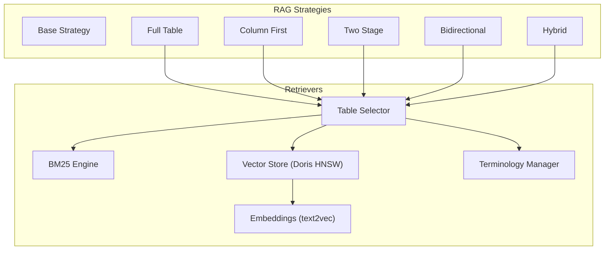
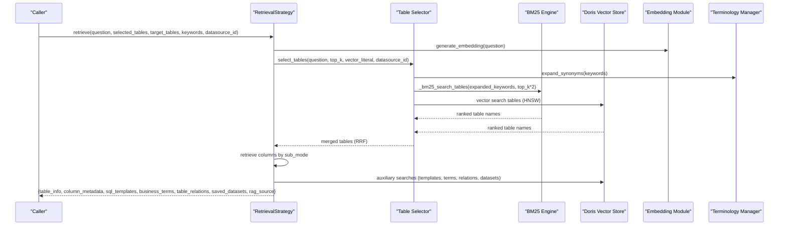
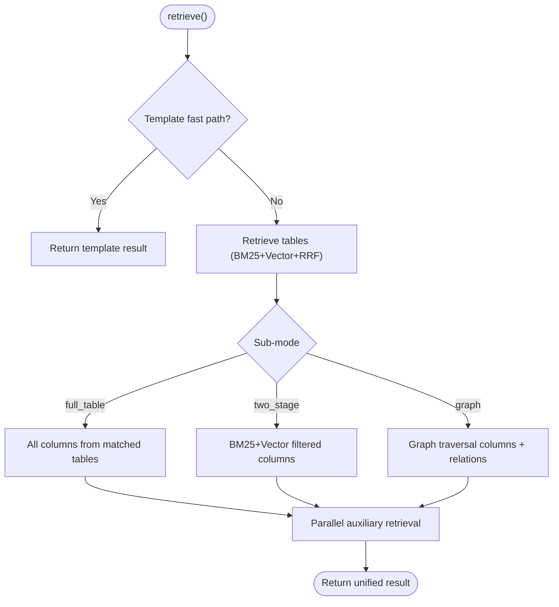
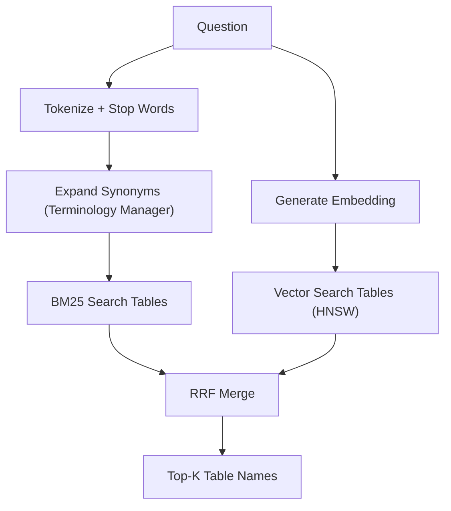
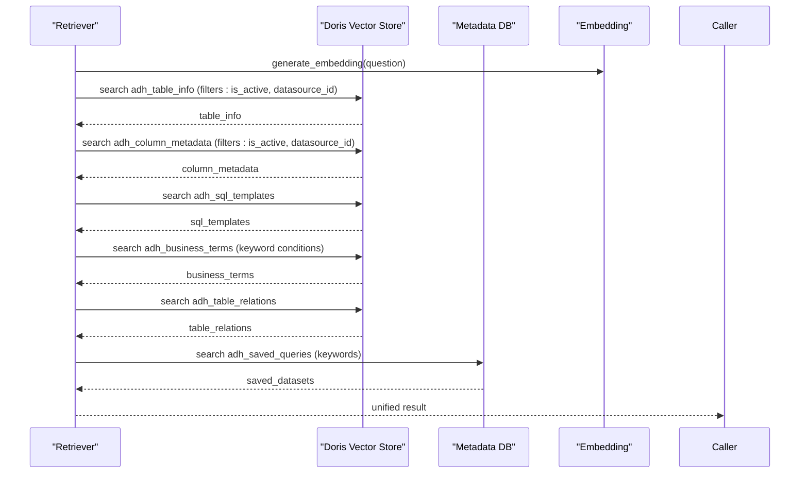
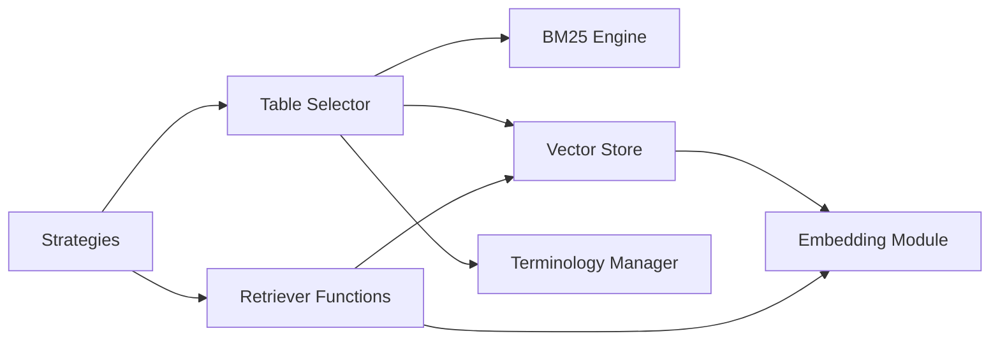

# RAG Pipeline

<cite>
**Referenced Files in This Document**
- [rag_retriever.py](file://services/datamind/rag/rag_retriever.py)
- [rag_retriever_v2.py](file://services/datamind/rag/rag_retriever_v2.py)
- [table_selector.py](file://services/datamind/rag/table_selector.py)
- [terminology_manager.py](file://services/datamind/rag/terminology_manager.py)
- [bm25.py](file://services/datamind/rag/bm25.py)
- [strategies/__init__.py](file://services/datamind/rag/strategies/__init__.py)
- [strategies/base.py](file://services/datamind/rag/strategies/base.py)
- [strategies/full_table.py](file://services/datamind/rag/strategies/full_table.py)
- [strategies/column_first.py](file://services/datamind/rag/strategies/column_first.py)
- [strategies/two_stage.py](file://services/datamind/rag/strategies/two_stage.py)
- [strategies/bidirectional.py](file://services/datamind/rag/strategies/bidirectional.py)
- [strategies/hybrid.py](file://services/datamind/rag/strategies/hybrid.py)
- [doris_store.py](file://services/shared/common/vector/doris_store.py)
- [embedding.py](file://services/shared/common/llm/embedding.py)
</cite>

## Table of Contents
1. Introduction
2. Project Structure
3. Core Components
4. Architecture Overview
5. Detailed Component Analysis
6. Dependency Analysis
7. Performance Considerations
8. Troubleshooting Guide
9. Conclusion

## Introduction
This document explains AI-DataHub’s Retrieval-Augmented Generation (RAG) pipeline for natural language to SQL. It covers the hybrid retrieval strategy that combines BM25 sparse search with vector dense search using Apache Doris HNSW indexing, retrieval strategies (full_table, column_first, two_stage, bidirectional, and hybrid), table selection logic, terminology management for business terms, metadata retrieval processes, vector embedding generation via text2vec-base-chinese, similarity search implementation, result fusion using Reciprocal Rank Fusion (RRF), configuration options for tuning performance and caching, monitoring retrieval effectiveness, guidance on optimizing metadata quality, managing terminology databases, and troubleshooting accuracy issues.

## Project Structure
The RAG pipeline is implemented under services/datamind/rag with supporting infrastructure in services/shared/common:
- Retrieval strategies define pluggable workflows for metadata retrieval.
- The retriever provides vector and BM25-based functions for tables, columns, templates, business terms, relations, and saved datasets.
- Table selector performs hybrid table selection using BM25 + vector + RRF.
- Terminology manager loads synonyms and keywords from the business terms database with TTL caching.
- BM25 implements Okapi BM25 scoring and RRF fusion.
- Vector store abstracts Doris HNSW similarity search; embedding module generates 768-dim vectors using text2vec-base-chinese with a hash fallback.

**Diagram sources**
- [strategies/__init__.py:10-31](file://services/datamind/rag/strategies/__init__.py#L10-L31)
- [table_selector.py:178-249](file://services/datamind/rag/table_selector.py#L178-L249)
- [bm25.py:22-173](file://services/datamind/rag/bm25.py#L22-L173)
- [doris_store.py:32-88](file://services/shared/common/vector/doris_store.py#L32-L88)
- [embedding.py:115-158](file://services/shared/common/llm/embedding.py#L115-L158)
- [terminology_manager.py:77-137](file://services/datamind/rag/terminology_manager.py#L77-L137)

**Section sources**
- [strategies/__init__.py:10-31](file://services/datamind/rag/strategies/__init__.py#L10-L31)
- [table_selector.py:178-249](file://services/datamind/rag/table_selector.py#L178-L249)
- [bm25.py:22-173](file://services/datamind/rag/bm25.py#L22-L173)
- [doris_store.py:32-88](file://services/shared/common/vector/doris_store.py#L32-L88)
- [embedding.py:115-158](file://services/shared/common/llm/embedding.py#L115-L158)
- [terminology_manager.py:77-137](file://services/datamind/rag/terminology_manager.py#L77-L137)

## Core Components
- Retrieval strategies: Pluggable interfaces returning uniform metadata dicts for downstream NL2SQL prompt building.
- Retriever functions: Vector and BM25-based retrieval for tables, columns, SQL templates, business terms, table relations, and saved datasets; includes LRU caching and information_schema fallback.
- Table selector: Hybrid table selection combining BM25 and vector search with RRF fusion; supports synonym expansion from terminology manager.
- Terminology manager: Loads active business terms and table keywords into a cached synonym map and keyword set with TTL refresh.
- BM25 engine: Pure-Python Okapi BM25 scoring and RRF fusion utility.
- Vector store: Doris HNSW-backed vector search abstraction with filters and output column selection.
- Embeddings: text2vec-base-chinese model with LRU cache and hash fallback; produces 768-dim vectors compatible with HNSW index.

**Section sources**
- [strategies/base.py:10-61](file://services/datamind/rag/strategies/base.py#L10-L61)
- [rag_retriever.py:74-786](file://services/datamind/rag/rag_retriever.py#L74-L786)
- [table_selector.py:39-152](file://services/datamind/rag/table_selector.py#L39-L152)
- [terminology_manager.py:32-137](file://services/datamind/rag/terminology_manager.py#L32-L137)
- [bm25.py:22-173](file://services/datamind/rag/bm25.py#L22-L173)
- [doris_store.py:32-88](file://services/shared/common/vector/doris_store.py#L32-L88)
- [embedding.py:115-158](file://services/shared/common/llm/embedding.py#L115-L158)

## Architecture Overview
The pipeline orchestrates multiple retrieval paths to assemble rich context for NL2SQL:
- Table selection uses BM25 + vector + RRF to identify candidate tables.
- Column selection applies hybrid retrieval per strategy to reduce noise while preserving key columns.
- Auxiliary retrieval fetches SQL templates, business terms, table relations, and saved datasets in parallel.
- Results are fused and returned as a unified dict with rag_source indicating the path taken.

**Diagram sources**
- [strategies/hybrid.py:42-128](file://services/datamind/rag/strategies/hybrid.py#L42-L128)
- [table_selector.py:178-249](file://services/datamind/rag/table_selector.py#L178-L249)
- [bm25.py:88-173](file://services/datamind/rag/bm25.py#L88-L173)
- [doris_store.py:32-88](file://services/shared/common/vector/doris_store.py#L32-L88)
- [embedding.py:115-158](file://services/shared/common/llm/embedding.py#L115-L158)
- [terminology_manager.py:146-156](file://services/datamind/rag/terminology_manager.py#L146-L156)

## Detailed Component Analysis

### Hybrid Retrieval Strategy
- Purpose: Unified strategy combining BM25 sparse + vector dense retrieval with RRF fusion and optional graph traversal for column handling.
- Flow:
  - Step 0: Template fast path (disabled in current code; templates included naturally).
  - Step 1: Table retrieval via table_selector (BM25 + vector + RRF) or pre-selected tables.
  - Step 2: Column retrieval based on sub_mode: full_table (all columns), two_stage (filtered columns), graph (graph traversal).
  - Step 3: Parallel auxiliary retrieval for templates, terms, relations, datasets.
- Output: Uniform dict with table_info, column_metadata, sql_templates, business_terms, table_relations, saved_datasets, rag_source.

**Diagram sources**
- [strategies/hybrid.py:42-128](file://services/datamind/rag/strategies/hybrid.py#L42-L128)
- [strategies/hybrid.py:185-281](file://services/datamind/rag/strategies/hybrid.py#L185-L281)
- [strategies/hybrid.py:316-413](file://services/datamind/rag/strategies/hybrid.py#L316-L413)

**Section sources**
- [strategies/hybrid.py:30-128](file://services/datamind/rag/strategies/hybrid.py#L30-L128)
- [strategies/hybrid.py:148-181](file://services/datamind/rag/strategies/hybrid.py#L148-L181)
- [strategies/hybrid.py:185-281](file://services/datamind/rag/strategies/hybrid.py#L185-L281)
- [strategies/hybrid.py:316-413](file://services/datamind/rag/strategies/hybrid.py#L316-L413)

### Full Table Strategy
- Approach: Retrieve tables via vector search or pre-selection; return all columns from matched tables; filter by matched tables if needed; parallel auxiliary retrieval.
- Use case: Comprehensive context with higher recall but potentially more noise.

**Section sources**
- [strategies/full_table.py:15-92](file://services/datamind/rag/strategies/full_table.py#L15-L92)
- [strategies/full_table.py:95-141](file://services/datamind/rag/strategies/full_table.py#L95-L141)

### Column First Strategy
- Approach: Directly search columns using BM25 + vector + RRF; derive unique tables from matched columns; include key columns for JOIN context; parallel auxiliary retrieval.
- Use case: Precise column-level relevance with less noise; may miss related columns if embeddings do not match.

**Section sources**
- [strategies/column_first.py:15-100](file://services/datamind/rag/strategies/column_first.py#L15-L100)
- [strategies/column_first.py:103-131](file://services/datamind/rag/strategies/column_first.py#L103-L131)

### Two Stage Strategy
- Approach: Stage 1 selects tables (via table_selector or vector search); Stage 2 retrieves all columns for matched tables and filters using vector-matched keys plus keyword matches; ensures minimum coverage and key columns; parallel auxiliary retrieval.
- Use case: Balanced noise/relevance with controlled latency.

**Section sources**
- [strategies/two_stage.py:19-126](file://services/datamind/rag/strategies/two_stage.py#L19-L126)
- [strategies/two_stage.py:129-157](file://services/datamind/rag/strategies/two_stage.py#L129-L157)

### Bidirectional Strategy
- Approach: Run table-first and column-first in parallel; merge table names; filter columns by vector-matched keys plus keyword matches and key columns; ensure minimum coverage; parallel auxiliary retrieval.
- Use case: Best recall without missing relevant tables/columns; more context than two_stage.

**Section sources**
- [strategies/bidirectional.py:16-110](file://services/datamind/rag/strategies/bidirectional.py#L16-L110)
- [strategies/bidirectional.py:113-141](file://services/datamind/rag/strategies/bidirectional.py#L113-L141)

### Table Selection Logic
- Keyword extraction: Uses jieba segmentation with stop words; falls back to regex if jieba unavailable.
- Synonym expansion: Dynamically loaded from adh_business_terms via terminology manager with TTL caching.
- BM25 sparse retrieval: Builds inverted index over table_name, comment, business_desc, region_tag, domain_tag; tokenizes query and documents; scores and ranks.
- Vector dense retrieval: Uses Doris HNSW l2_distance_approximate; filters by datasource and active status.
- RRF fusion: Merges BM25 and vector rankings with configurable k and weights; returns top-k table names.

**Diagram sources**
- [table_selector.py:39-87](file://services/datamind/rag/table_selector.py#L39-L87)
- [table_selector.py:128-175](file://services/datamind/rag/table_selector.py#L128-L175)
- [table_selector.py:178-249](file://services/datamind/rag/table_selector.py#L178-L249)
- [bm25.py:88-173](file://services/datamind/rag/bm25.py#L88-L173)
- [terminology_manager.py:77-137](file://services/datamind/rag/terminology_manager.py#L77-L137)

**Section sources**
- [table_selector.py:39-87](file://services/datamind/rag/table_selector.py#L39-L87)
- [table_selector.py:128-175](file://services/datamind/rag/table_selector.py#L128-L175)
- [table_selector.py:178-249](file://services/datamind/rag/table_selector.py#L178-L249)
- [bm25.py:88-173](file://services/datamind/rag/bm25.py#L88-L173)
- [terminology_manager.py:77-137](file://services/datamind/rag/terminology_manager.py#L77-L137)

### Metadata Retrieval Processes
- Table info: Vector search over adh_table_info with active and datasource filters; boosts matching tables if target_tables provided; fallback to information_schema if empty.
- Column metadata: Vector search over adh_column_metadata; prioritizes time-related columns from matched tables; deduplicates and filters sensitive columns; supports BM25 + vector hybrid selection via select_columns.
- SQL templates: Vector search over adh_sql_templates; ensures rules column exists; returns templates with usage metrics.
- Business terms: Vector search over adh_business_terms; supports keyword filtering; boosts keyword-matched terms.
- Table relations: Vector search over adh_table_relations; boosts relations involving target tables.
- Saved datasets: Keyword search over adh_saved_queries where is_dataset=1.

**Diagram sources**
- [rag_retriever.py:74-786](file://services/datamind/rag/rag_retriever.py#L74-L786)
- [rag_retriever_v2.py:59-533](file://services/datamind/rag/rag_retriever_v2.py#L59-L533)
- [doris_store.py:32-88](file://services/shared/common/vector/doris_store.py#L32-L88)
- [embedding.py:115-158](file://services/shared/common/llm/embedding.py#L115-L158)

**Section sources**
- [rag_retriever.py:74-786](file://services/datamind/rag/rag_retriever.py#L74-L786)
- [rag_retriever_v2.py:59-533](file://services/datamind/rag/rag_retriever_v2.py#L59-L533)

### Terminology Management
- Loads active business terms and table keywords from adh_business_terms and adh_table_info.
- Builds synonym map: term_cn, term_en, term_aliases mapped to full synonym sets; adds table keywords.
- Caches results with TTL (5 minutes) to reduce DB load.
- Provides expand_synonyms and get_business_keywords for retrieval pipelines.

**Section sources**
- [terminology_manager.py:32-137](file://services/datamind/rag/terminology_manager.py#L32-L137)
- [terminology_manager.py:140-185](file://services/datamind/rag/terminology_manager.py#L140-L185)

### Vector Embedding Generation and Similarity Search
- Embeddings: text2vec-base-chinese via sentence-transformers; 768-dim vectors; LRU cache (256 entries); fallback to character bigram hashing if model unavailable.
- Similarity search: Doris HNSW index using l2_distance_approximate; supports filters (is_active, datasource_id) and output column selection; raw SQL path for v1 and VectorStore abstraction for v2.

**Section sources**
- [embedding.py:34-158](file://services/shared/common/llm/embedding.py#L34-L158)
- [embedding.py:161-199](file://services/shared/common/llm/embedding.py#L161-L199)
- [doris_store.py:32-88](file://services/shared/common/vector/doris_store.py#L32-L88)
- [rag_retriever.py:105-142](file://services/datamind/rag/rag_retriever.py#L105-L142)
- [rag_retriever_v2.py:59-88](file://services/datamind/rag/rag_retriever_v2.py#L59-L88)

### Result Fusion Using RRF
- BM25 and vector rankings are merged using Reciprocal Rank Fusion with configurable k (default 60) and per-ranking weights (default 1.0).
- Applied for both table selection and column selection to combine sparse and dense signals.

**Section sources**
- [bm25.py:146-173](file://services/datamind/rag/bm25.py#L146-L173)
- [table_selector.py:227-249](file://services/datamind/rag/table_selector.py#L227-L249)
- [rag_retriever.py:417-436](file://services/datamind/rag/rag_retriever.py#L417-L436)

## Dependency Analysis
- Strategies depend on retriever functions and table selector for metadata retrieval.
- Table selector depends on BM25 engine, terminology manager, and vector store for hybrid selection.
- Retriever functions depend on embedding module for vector generation and vector store for similarity search.
- Vector store abstracts Doris HNSW operations; embedding module provides consistent vector dimensions.

**Diagram sources**
- [strategies/__init__.py:10-31](file://services/datamind/rag/strategies/__init__.py#L10-L31)
- [table_selector.py:178-249](file://services/datamind/rag/table_selector.py#L178-L249)
- [rag_retriever.py:74-786](file://services/datamind/rag/rag_retriever.py#L74-L786)
- [doris_store.py:32-88](file://services/shared/common/vector/doris_store.py#L32-L88)
- [embedding.py:115-158](file://services/shared/common/llm/embedding.py#L115-L158)
- [terminology_manager.py:77-137](file://services/datamind/rag/terminology_manager.py#L77-L137)

**Section sources**
- [strategies/__init__.py:10-31](file://services/datamind/rag/strategies/__init__.py#L10-L31)
- [table_selector.py:178-249](file://services/datamind/rag/table_selector.py#L178-L249)
- [rag_retriever.py:74-786](file://services/datamind/rag/rag_retriever.py#L74-L786)
- [doris_store.py:32-88](file://services/shared/common/vector/doris_store.py#L32-L88)
- [embedding.py:115-158](file://services/shared/common/llm/embedding.py#L115-L158)
- [terminology_manager.py:77-137](file://services/datamind/rag/terminology_manager.py#L77-L137)

## Performance Considerations
- Caching:
  - RAG results LRU cache (max 128 entries) keyed by question, target tables, keywords, datasource, strategy name.
  - Embedding LRU cache (max 256 entries) to avoid repeated model calls.
  - Terminology cache with 5-minute TTL to reduce DB queries.
  - BM25 indexes and table metadata caches per datasource to speed up repeated selections.
- Parallelism:
  - ThreadPoolExecutor used for parallel auxiliary retrieval (templates, terms, relations, datasets) to reduce latency.
- Indexing:
  - Doris HNSW index for efficient vector similarity search; use l2_distance_approximate for performance.
- Tuning:
  - Adjust top_k for table and column selection to balance recall and context size.
  - Modify RRF k and weights to influence fusion behavior.
  - Configure VECTOR_DB_TYPE and connection parameters for optimal vector store performance.
  - Set EMBEDDING_MODEL_PATH and EMBEDDING_DIM for embedding compatibility with HNSW index.

[No sources needed since this section provides general guidance]

## Troubleshooting Guide
- Empty metadata:
  - If RAG returns no table_info or column_metadata, pipeline falls back to information_schema; check datasource filters and active flags.
- Vector search failures:
  - Ensure embedding dimension matches EMBEDDING_DIM; verify HNSW index exists and is accessible; check network and credentials for Doris.
- BM25 index empty:
  - Verify adh_table_info and adh_column_metadata contain active rows; rebuild BM25 indexes after metadata changes.
- Sensitive columns filtered:
  - Review sensitive column detection logic; adjust filters if necessary to retain required columns.
- Terminology cache stale:
  - Call clear_cache on terminology manager to force refresh; check TTL settings and DB connectivity.
- Monitoring:
  - Inspect rag_source in results to understand which path was taken (vector_search, information_schema_fallback, hybrid:sub_mode).
  - Log warnings and errors from retriever functions to diagnose failures in vector or BM25 searches.

**Section sources**
- [rag_retriever.py:753-786](file://services/datamind/rag/rag_retriever.py#L753-L786)
- [rag_retriever_v2.py:507-533](file://services/datamind/rag/rag_retriever_v2.py#L507-L533)
- [embedding.py:147-158](file://services/shared/common/llm/embedding.py#L147-L158)
- [terminology_manager.py:180-185](file://services/datamind/rag/terminology_manager.py#L180-L185)

## Conclusion
AI-DataHub’s RAG pipeline delivers robust metadata retrieval for NL2SQL through a hybrid strategy that combines BM25 sparse search with vector dense search using Apache Doris HNSW indexing. The pluggable strategy architecture enables flexible retrieval modes (full_table, column_first, two_stage, bidirectional, hybrid) tailored to different accuracy and latency requirements. Terminology management enhances keyword expansion and filtering, while caching and parallelism optimize performance. Proper configuration of embeddings, vector stores, and retrieval parameters ensures effective and scalable retrieval for diverse data catalogs.

[No sources needed since this section summarizes without analyzing specific files]