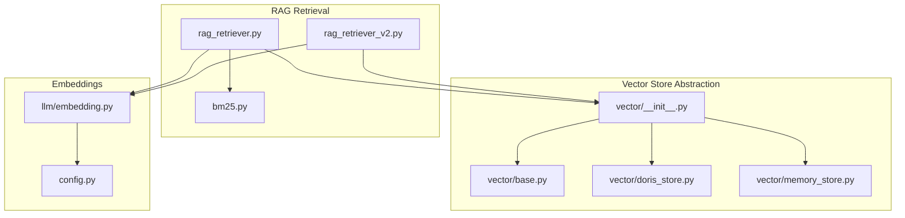
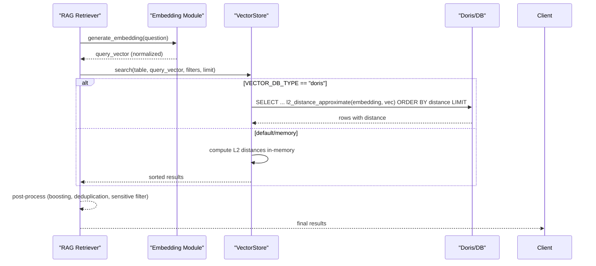
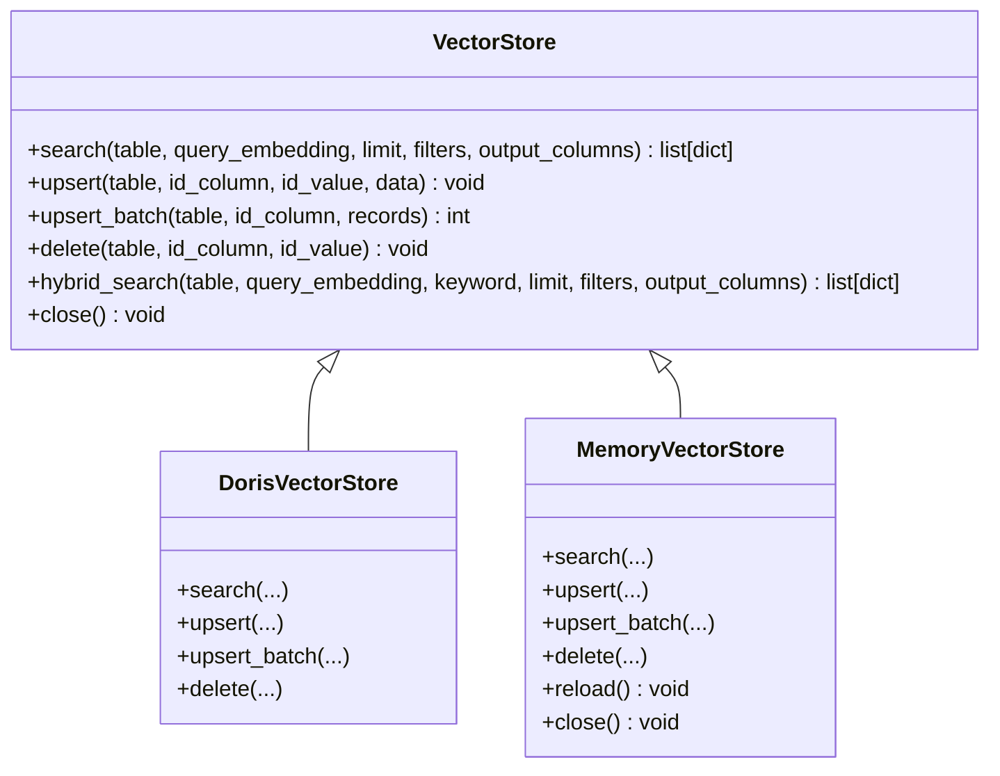
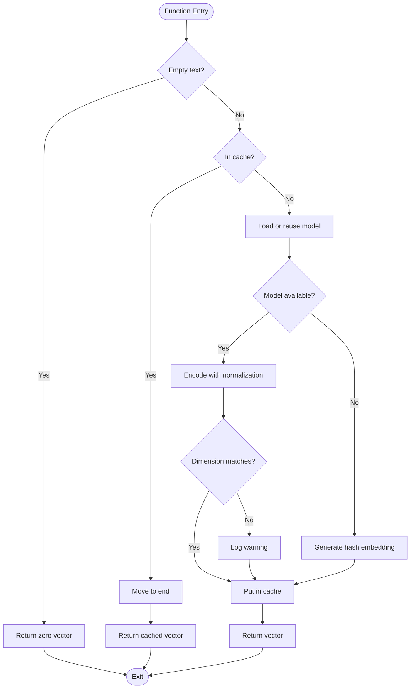
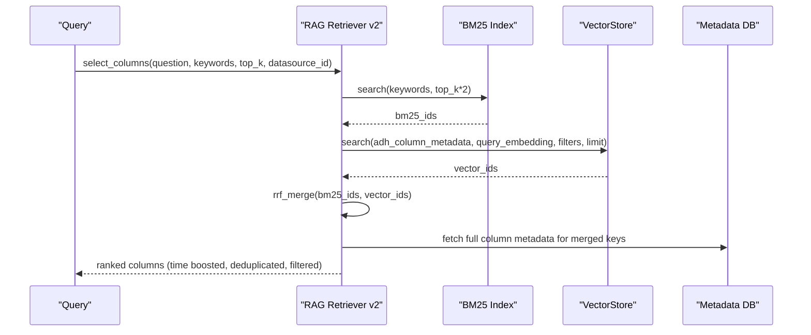
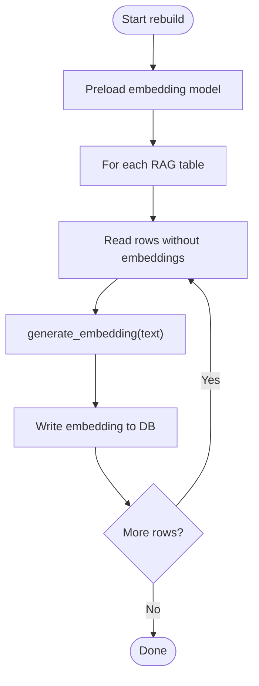
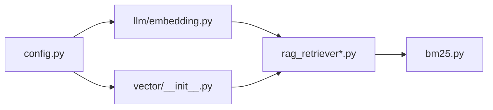

# Vector Search & Embeddings

<cite>
**Referenced Files in This Document**
- [vector/__init__.py](file://services/shared/common/vector/__init__.py)
- [vector/base.py](file://services/shared/common/vector/base.py)
- [vector/doris_store.py](file://services/shared/common/vector/doris_store.py)
- [vector/memory_store.py](file://services/shared/common/vector/memory_store.py)
- [llm/embedding.py](file://services/shared/common/llm/embedding.py)
- [rag_retriever.py](file://services/datamind/rag/rag_retriever.py)
- [rag_retriever_v2.py](file://services/datamind/rag/rag_retriever_v2.py)
- [bm25.py](file://services/datamind/rag/bm25.py)
- [config.py](file://services/shared/common/config.py)
- [rebuild_vectors.py](file://sync/rebuild_vectors.py)
</cite>

## Table of Contents
1. Introduction
2. Project Structure
3. Core Components
4. Architecture Overview
5. Detailed Component Analysis
6. Dependency Analysis
7. Performance Considerations
8. Troubleshooting Guide
9. Conclusion
10. Appendices

## Introduction
This document explains the vector search and embedding generation used in the RAG pipeline. It covers:
- Integration with Apache Doris HNSW indexing for high-dimensional vector similarity search
- Use of the text2vec-base-chinese model to generate semantic embeddings for metadata
- A vector store abstraction layer supporting both Doris and memory backends (plus a Qdrant option)
- Configuration for vector dimensions, distance metrics, and index parameters
- Embedding generation process, batch processing capabilities, and caching strategies
- Guidance on optimizing performance, managing vector databases, and troubleshooting similarity accuracy

## Project Structure
The vector and embedding subsystem spans shared services and the datamind RAG module:
- Shared vector abstraction and implementations live under services/shared/common/vector
- Embedding generation is implemented in services/shared/common/llm/embedding.py
- RAG retrieval logic uses either raw SQL against Doris or the vector store abstraction
- BM25 sparse retrieval complements dense vector search for hybrid ranking
- Configuration centralizes environment-driven settings for vector DBs and embeddings

**Diagram sources**
- [rag_retriever.py:1-800](file://services/datamind/rag/rag_retriever.py#L1-L800)
- [rag_retriever_v2.py:1-800](file://services/datamind/rag/rag_retriever_v2.py#L1-L800)
- [bm25.py:1-173](file://services/datamind/rag/bm25.py#L1-L173)
- [vector/__init__.py:1-56](file://services/shared/common/vector/__init__.py#L1-L56)
- [vector/base.py:1-120](file://services/shared/common/vector/base.py#L1-L120)
- [vector/doris_store.py:1-179](file://services/shared/common/vector/doris_store.py#L1-L179)
- [vector/memory_store.py:1-236](file://services/shared/common/vector/memory_store.py#L1-L236)
- [llm/embedding.py:1-199](file://services/shared/common/llm/embedding.py#L1-L199)
- [config.py:1-163](file://services/shared/common/config.py#L1-L163)

**Section sources**
- [vector/__init__.py:1-56](file://services/shared/common/vector/__init__.py#L1-L56)
- [config.py:46-99](file://services/shared/common/config.py#L46-L99)

## Core Components
- VectorStore abstraction: defines search, upsert, upsert_batch, delete, and hybrid_search interfaces
- DorisVectorStore: implements search via l2_distance_approximate over Doris tables; supports filters and output columns
- MemoryVectorStore: in-memory fallback using numpy L2 distance; auto-loads active rows from metadata DB
- Embedding module: loads sentence-transformers model (text2vec-base-chinese), generates normalized vectors, caches results, and falls back to hash-based embeddings when needed
- RAG retrievers: orchestrate embedding generation, vector search, filtering, boosting, and hybrid merging with BM25
- Configuration: environment variables control vector DB type, host/port, dimension, distance metric, and embedding model path

Key responsibilities:
- Decouple retrieval logic from storage backend via VectorStore
- Provide fast ANN search through Doris HNSW while keeping development-friendly in-memory mode
- Ensure consistent vector dimensions and normalization across components
- Offer hybrid retrieval combining dense vectors and sparse BM25 scores

**Section sources**
- [vector/base.py:10-120](file://services/shared/common/vector/base.py#L10-L120)
- [vector/doris_store.py:32-179](file://services/shared/common/vector/doris_store.py#L32-L179)
- [vector/memory_store.py:32-236](file://services/shared/common/vector/memory_store.py#L32-L236)
- [llm/embedding.py:34-199](file://services/shared/common/llm/embedding.py#L34-L199)
- [rag_retriever.py:74-786](file://services/datamind/rag/rag_retriever.py#L74-L786)
- [rag_retriever_v2.py:59-533](file://services/datamind/rag/rag_retriever_v2.py#L59-L533)
- [config.py:46-99](file://services/shared/common/config.py#L46-L99)

## Architecture Overview
The system composes three layers:
- Retrieval layer: RAG functions build queries, generate embeddings, apply filters, and merge results
- Vector store layer: abstracts backend-specific search and mutation operations
- Storage layer: Doris HNSW index for production-scale ANN search; in-memory store for development/fallback

**Diagram sources**
- [rag_retriever.py:74-142](file://services/datamind/rag/rag_retriever.py#L74-L142)
- [rag_retriever_v2.py:59-88](file://services/datamind/rag/rag_retriever_v2.py#L59-L88)
- [vector/doris_store.py:35-88](file://services/shared/common/vector/doris_store.py#L35-L88)
- [vector/memory_store.py:102-161](file://services/shared/common/vector/memory_store.py#L102-L161)
- [llm/embedding.py:115-158](file://services/shared/common/llm/embedding.py#L115-L158)

## Detailed Component Analysis

### Vector Store Abstraction Layer
- Base interface: search, upsert, upsert_batch, delete, hybrid_search
- Factory: get_vector_store selects implementation based on VECTOR_DB_TYPE
- Doris implementation: builds SQL with l2_distance_approximate, supports filters and output columns
- Memory implementation: loads active records into memory, computes L2 distances with numpy, supports filters and output columns

**Diagram sources**
- [vector/base.py:10-120](file://services/shared/common/vector/base.py#L10-L120)
- [vector/doris_store.py:32-179](file://services/shared/common/vector/doris_store.py#L32-L179)
- [vector/memory_store.py:32-236](file://services/shared/common/vector/memory_store.py#L32-L236)

**Section sources**
- [vector/__init__.py:21-56](file://services/shared/common/vector/__init__.py#L21-L56)
- [vector/base.py:10-120](file://services/shared/common/vector/base.py#L10-L120)
- [vector/doris_store.py:32-179](file://services/shared/common/vector/doris_store.py#L32-L179)
- [vector/memory_store.py:32-236](file://services/shared/common/vector/memory_store.py#L32-L236)

### Embedding Generation and Caching
- Model loading: lazy singleton using sentence-transformers; defaults to text2vec-base-chinese
- Normalization: encode with normalize_embeddings=True for consistent cosine/L2 behavior
- Cache: LRU cache (size 256) keyed by input text; cleared on model reload
- Fallback: character bigram hashing to EMBEDDING_DIM if model unavailable
- Utility: converts vectors to SQL array literals for Doris queries

**Diagram sources**
- [llm/embedding.py:115-199](file://services/shared/common/llm/embedding.py#L115-L199)

**Section sources**
- [llm/embedding.py:34-199](file://services/shared/common/llm/embedding.py#L34-L199)
- [config.py:91-99](file://services/shared/common/config.py#L91-L99)

### RAG Retrieval with Hybrid Ranking
- Dense retrieval: vector search over table_info, column_metadata, sql_templates, business_terms, table_relations
- Sparse retrieval: BM25 over tokenized column metadata
- Fusion: Reciprocal Rank Fusion (RRF) merges sparse and dense rankings
- Post-processing: boost time-related columns, deduplicate, filter sensitive columns, apply datasource filters

**Diagram sources**
- [rag_retriever_v2.py:264-348](file://services/datamind/rag/rag_retriever_v2.py#L264-L348)
- [bm25.py:22-173](file://services/datamind/rag/bm25.py#L22-L173)

**Section sources**
- [rag_retriever.py:369-463](file://services/datamind/rag/rag_retriever.py#L369-L463)
- [rag_retriever_v2.py:264-348](file://services/datamind/rag/rag_retriever_v2.py#L264-L348)
- [bm25.py:22-173](file://services/datamind/rag/bm25.py#L22-L173)

### Batch Rebuild and Maintenance
- Rebuild script regenerates embeddings for all RAG tables using the configured model
- Writes embeddings to METADATA_DB (default mode) or Doris depending on VECTOR_DB_TYPE
- Uses batching and progress reporting; preloads model once for efficiency

**Diagram sources**
- [rebuild_vectors.py:231-269](file://sync/rebuild_vectors.py#L231-L269)

**Section sources**
- [rebuild_vectors.py:1-269](file://sync/rebuild_vectors.py#L1-L269)

## Dependency Analysis
- Retrieval depends on embedding generation and vector store abstraction
- Vector store selection depends on configuration
- BM25 provides sparse retrieval independent of vector DB
- Embedding module depends on configuration for model path, dimension, and HF endpoint

**Diagram sources**
- [config.py:46-99](file://services/shared/common/config.py#L46-L99)
- [llm/embedding.py:115-199](file://services/shared/common/llm/embedding.py#L115-L199)
- [vector/__init__.py:21-56](file://services/shared/common/vector/__init__.py#L21-L56)
- [rag_retriever.py:74-786](file://services/datamind/rag/rag_retriever.py#L74-L786)
- [rag_retriever_v2.py:59-533](file://services/datamind/rag/rag_retriever_v2.py#L59-L533)
- [bm25.py:22-173](file://services/datamind/rag/bm25.py#L22-L173)

**Section sources**
- [config.py:46-99](file://services/shared/common/config.py#L46-L99)
- [vector/__init__.py:21-56](file://services/shared/common/vector/__init__.py#L21-L56)
- [llm/embedding.py:115-199](file://services/shared/common/llm/embedding.py#L115-L199)
- [rag_retriever.py:74-786](file://services/datamind/rag/rag_retriever.py#L74-L786)
- [rag_retriever_v2.py:59-533](file://services/datamind/rag/rag_retriever_v2.py#L59-L533)
- [bm25.py:22-173](file://services/datamind/rag/bm25.py#L22-L173)

## Performance Considerations
- Use Doris HNSW for production-scale vector search; it leverages l2_distance_approximate for fast ANN queries
- Keep EMBEDDING_DIM aligned with vector index dimension; mismatched dimensions cause errors or degraded accuracy
- Normalize embeddings during encoding to ensure stable distance computations
- Leverage LRU caches:
  - Embedding cache reduces repeated model calls
  - RAG result cache avoids redundant retrievals for identical queries
- Prefer vector store abstraction for portability; use raw SQL only when necessary for Doris-specific optimizations
- Tune limits and fetch sizes:
  - Increase fetch_limit for column metadata to ensure coverage before post-processing
  - Adjust top_k for BM25 and vector stages to balance recall and latency
- Parallelize independent retrievals (templates, terms, relations) where possible

[No sources needed since this section provides general guidance]

## Troubleshooting Guide
Common issues and resolutions:
- Dimension mismatch between embeddings and index:
  - Ensure EMBEDDING_DIM equals VECTOR_DIM and that stored vectors match expected size
  - If model returns unexpected dimension, log and proceed but verify downstream compatibility
- Model load failures:
  - Verify EMBEDDING_MODEL_PATH and network access to HF mirror
  - On failure, system falls back to hash embedding; note reduced semantic quality
- Empty or stale results:
  - Run rebuild_vectors to regenerate embeddings for all RAG tables
  - For memory store, call reload to refresh from metadata DB
- Incorrect filtering:
  - Confirm datasource_id filters are applied correctly via _raw or key-value filters
  - Validate that is_active flags are set for relevant rows
- Sensitive column exposure:
  - Ensure sensitive detection runs after retrieval to avoid leaking restricted fields

**Section sources**
- [llm/embedding.py:131-158](file://services/shared/common/llm/embedding.py#L131-L158)
- [vector/memory_store.py:40-101](file://services/shared/common/vector/memory_store.py#L40-L101)
- [rag_retriever.py:249-254](file://services/datamind/rag/rag_retriever.py#L249-L254)
- [rebuild_vectors.py:231-269](file://sync/rebuild_vectors.py#L231-L269)

## Conclusion
The RAG pipeline integrates robust embedding generation with flexible vector search backends. The abstraction layer enables seamless switching between Doris HNSW and in-memory stores, while hybrid retrieval improves relevance by combining dense and sparse signals. Proper configuration, caching, and maintenance procedures ensure scalable and accurate semantic search for metadata discovery.

[No sources needed since this section summarizes without analyzing specific files]

## Appendices

### Configuration Reference
- Vector database selection and connection:
  - VECTOR_DB_TYPE: "default", "doris", "qdrant"
  - VECTOR_DB_HOST, VECTOR_DB_PORT, VECTOR_DB_USER, VECTOR_DB_PASSWORD, VECTOR_DB_DATABASE
- Vector search parameters:
  - VECTOR_DIM: vector dimension (default 768)
  - VECTOR_DISTANCE: distance metric (e.g., "l2")
- Embedding model settings:
  - EMBEDDING_MODEL_PATH: model identifier (default text2vec-base-chinese)
  - EMBEDDING_DIM: embedding dimension (default 768)
  - EMBEDDING_HF_ENDPOINT: Hugging Face mirror endpoint
  - EMBEDDING_MODEL_CACHE_DIR: optional cache directory

**Section sources**
- [config.py:46-99](file://services/shared/common/config.py#L46-L99)

### Best Practices
- Always normalize embeddings during encoding
- Keep EMBEDDING_DIM consistent across model, index, and queries
- Use VECTOR_DB_TYPE="doris" in production for performance
- Periodically rebuild embeddings when metadata changes significantly
- Monitor cache hit rates for embeddings and RAG results to tune sizes
- Combine BM25 and vector search via RRF for better recall and precision

[No sources needed since this section provides general guidance]