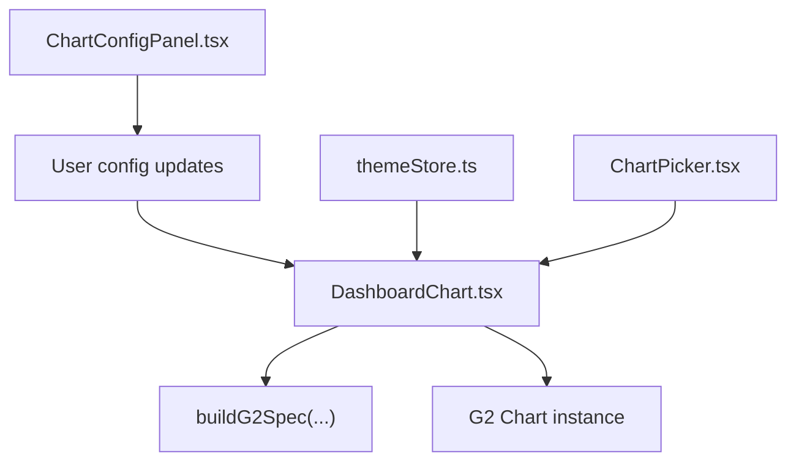
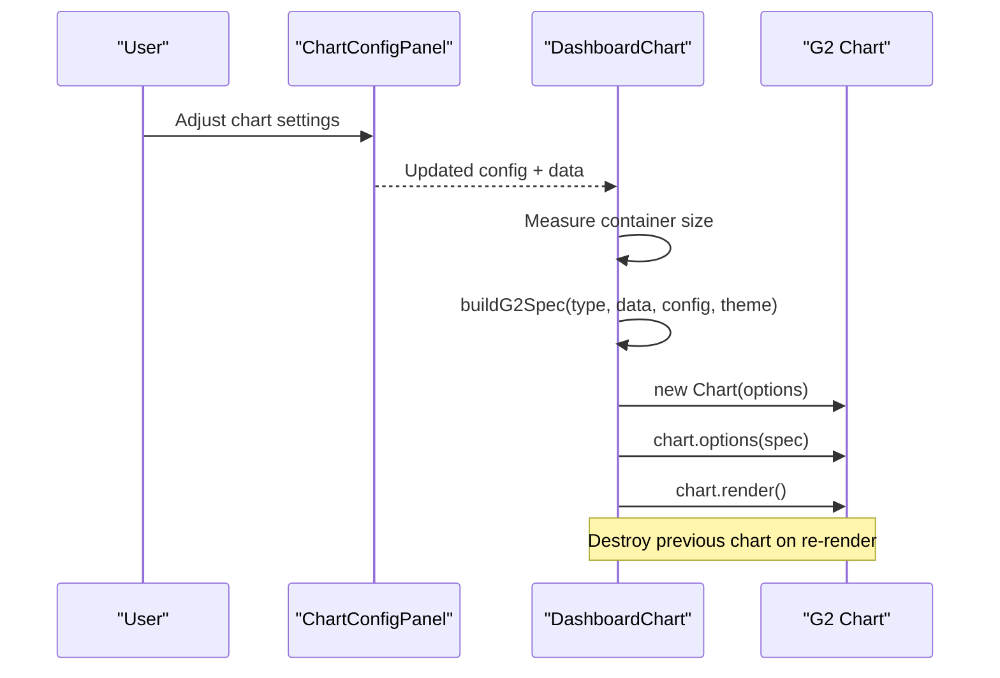
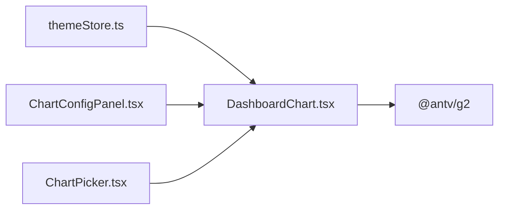

# Chart Types & Customization

<cite>
**Referenced Files in This Document**
- [DashboardChart.tsx](file://frontend/src/components/DashboardChart.tsx)
- [ChartConfigPanel.tsx](file://frontend/src/components/ChartConfigPanel.tsx)
- [themeStore.ts](file://frontend/src/stores/themeStore.ts)
- [ChartPicker.tsx](file://frontend/src/components/ChartPicker.tsx)
</cite>

## Table of Contents
1. Introduction
2. Project Structure
3. Core Components
4. Architecture Overview
5. Detailed Component Analysis
6. Dependency Analysis
7. Performance Considerations
8. Troubleshooting Guide
9. Conclusion

## Introduction
This document explains the supported chart types and customization options in the dashboard visualization system. It covers built-in charts (line, bar, pie, funnel, scatter, area, gauge), configuration schemas, styling and color schemes, theme integration, data binding, formatting, tooltips, legends, interactive elements, responsive behavior, accessibility considerations, browser compatibility, and performance optimization for large datasets and complex visualizations.

## Project Structure
The visualization layer is implemented as a React component that builds an AntV G2 specification from data and user configuration, then renders it into a container. A configuration panel exposes UI controls to adjust chart type, axes, grouping, time aggregation, styles, and datasource bindings. Theme state drives dark/light palettes and axis label styling.

**Diagram sources**
- [DashboardChart.tsx:225-941](file://frontend/src/components/DashboardChart.tsx#L225-L941)
- [DashboardChart.tsx:944-1139](file://frontend/src/components/DashboardChart.tsx#L944-L1139)
- [ChartConfigPanel.tsx:32-102](file://frontend/src/components/ChartConfigPanel.tsx#L32-L102)
- [themeStore.ts:1-50](file://frontend/src/stores/themeStore.ts#L1-L50)
- [ChartPicker.tsx:17-31](file://frontend/src/components/ChartPicker.tsx#L17-L31)

**Section sources**
- [DashboardChart.tsx:225-941](file://frontend/src/components/DashboardChart.tsx#L225-L941)
- [DashboardChart.tsx:944-1139](file://frontend/src/components/DashboardChart.tsx#L944-L1139)
- [ChartConfigPanel.tsx:32-102](file://frontend/src/components/ChartConfigPanel.tsx#L32-L102)
- [themeStore.ts:1-50](file://frontend/src/stores/themeStore.ts#L1-L50)
- [ChartPicker.tsx:17-31](file://frontend/src/components/ChartPicker.tsx#L17-L31)

## Core Components
- DashboardChart: Central rendering component. Builds G2 specs per chart type, handles map charts, widgets, tables, and lifecycle management.
- ChartConfigPanel: UI for configuring chart type, axes, grouping, time aggregation, style, and datasource. Persists selections and executes SQL previews.
- themeStore: Provides current theme and dark mode flag used by charts to select palettes and text colors.
- ChartPicker: Quick preview tool that auto-detects columns and series, and renders via DashboardChart.

Key responsibilities:
- Data preparation and grouping/aggregation
- Spec generation per chart type
- Responsive sizing with ResizeObserver
- Map data loading and geo rendering
- Widget and table_value rendering
- Theme-aware styling

**Section sources**
- [DashboardChart.tsx:225-941](file://frontend/src/components/DashboardChart.tsx#L225-L941)
- [DashboardChart.tsx:944-1139](file://frontend/src/components/DashboardChart.tsx#L944-L1139)
- [ChartConfigPanel.tsx:32-102](file://frontend/src/components/ChartConfigPanel.tsx#L32-L102)
- [themeStore.ts:1-50](file://frontend/src/stores/themeStore.ts#L1-L50)
- [ChartPicker.tsx:17-31](file://frontend/src/components/ChartPicker.tsx#L17-L31)

## Architecture Overview
The flow starts with data and configuration entering DashboardChart. The component computes dimensions, optionally loads map data, builds a G2 spec via buildG2Spec, and renders a G2 Chart instance. Configuration changes from ChartConfigPanel trigger re-renders. Theme affects palette and labels.

**Diagram sources**
- [DashboardChart.tsx:944-1139](file://frontend/src/components/DashboardChart.tsx#L944-L1139)
- [DashboardChart.tsx:225-941](file://frontend/src/components/DashboardChart.tsx#L225-L941)
- [ChartConfigPanel.tsx:32-102](file://frontend/src/components/ChartConfigPanel.tsx#L32-L102)

## Detailed Component Analysis

### Supported Chart Types
Built-in types are declared and handled in the spec builder. Each type maps to a specific G2 element or view composition.

- Basic charts: bar, line, pie, area, scatter, radar, funnel, waterfall
- Data display: text_display, table_value, big_number_trend, gauge
- Time series: timeseries_line, timeseries_bar, timeseries_area, calendar_heatmap
- Advanced: heatmap, boxplot, bubble, sankey, tree, treemap, rose, radial_bar, word_cloud
- Geo: china_map, world_map
- Widgets: widget_label, widget_text, widget_number, widget_date, widget_daterange, widget_select, widget_multi_select, widget_search, widget_reset, widget_export

Notes:
- Pie uses stacked interval with theta coordinate.
- Funnel uses symmetryY transform and transpose coordinate.
- Gauge binds a single value field.
- Text display supports number/percent/currency/raw formats and optional YoY/MoM comparison.
- Big number trend shows total, change percent, and a small line.
- Heatmap and calendar_heatmap use cell views with color scales.
- Boxplot computes min/q1/median/q3/max.
- Sankey requires nodes and links derived from source/target/value columns.
- Tree/treemap support hierarchical data via parent/name/value columns.
- Rose uses polar coordinates; radial_bar uses polar intervals.
- Word cloud uses wordCloud element.
- Maps load TopoJSON and render geoPath with value coloring.

**Section sources**
- [DashboardChart.tsx:1708-1752](file://frontend/src/components/DashboardChart.tsx#L1708-L1752)
- [DashboardChart.tsx:315-941](file://frontend/src/components/DashboardChart.tsx#L315-L941)

### Chart Configuration Schema
Configuration is a flexible object consumed by buildG2Spec and rendered by ChartConfigPanel. Common keys include:

- Mapping: xCol, yCol, groupCol, nameCol, valCol, parentCol, categoryCol, dataCol, sourceCol, targetCol, valueCol, dateCol, timeCol, valCol
- Time aggregation: enableTimeAgg, timeGranularity, aggMethod
- Display: title, showXAxis, xAxisLabelRotate, showYAxis, yAxisName, showGrid
- Style: colors, borderRadius, padding, valueFormat, valuePrefix, valueSuffix, valueFontSize, showComparison, yoyColumn, momColumn
- Table_value: maxRows, showIndex, striped, enablePagination, pageSize, enableServerPagination, pageLimit, countSql, links[]
- Widget: paramKey, label, labelPosition, placeholder, defaultValue, bind_param, options, min, max, step, rangeMaxDays, widgetStyle
- Geo: nameCol, valueCol

These fields drive data transformation, encoding, scales, transforms, and UI behaviors.

**Section sources**
- [DashboardChart.tsx:225-941](file://frontend/src/components/DashboardChart.tsx#L225-L941)
- [ChartConfigPanel.tsx:234-757](file://frontend/src/components/ChartConfigPanel.tsx#L234-L757)

### Styling Options and Color Schemes
- Palette selection: light/dark palettes are chosen based on theme store.
- Axis labels: font size, weight, and fill adapt to theme.
- Legend labels: styled per theme.
- Per-chart overrides: colors array can be selected in the style tab.
- Borders and padding: configurable via sliders.
- Text display: format, prefix/suffix, and comparison indicators.

**Section sources**
- [DashboardChart.tsx:225-237](file://frontend/src/components/DashboardChart.tsx#L225-L237)
- [DashboardChart.tsx:315-941](file://frontend/src/components/DashboardChart.tsx#L315-L941)
- [ChartConfigPanel.tsx:670-712](file://frontend/src/components/ChartConfigPanel.tsx#L670-L712)
- [themeStore.ts:1-50](file://frontend/src/stores/themeStore.ts#L1-L50)

### Theme Integration
- Dark mode detection: useThemeStore provides isDark.
- Palettes: separate arrays for light and dark themes.
- Text and legend styles: computed per theme.
- Theme class applied at root level for global CSS variables.

**Section sources**
- [DashboardChart.tsx:225-237](file://frontend/src/components/DashboardChart.tsx#L225-L237)
- [themeStore.ts:1-50](file://frontend/src/stores/themeStore.ts#L1-L50)

### Data Binding and Formatting
- Column auto-detection: numeric vs string columns; series detection by cardinality.
- Grouping: multi-series via groupCol for applicable chart types.
- Time aggregation: automatic granularity detection and aggregation methods (sum, avg, max, min, count).
- Value formatting: number, percent, currency, raw; prefix/suffix; YoY/MoM comparisons.
- Table_value: server-side pagination with page_limit/page_offset/count_sql; drill-through links with parameter mapping.

**Section sources**
- [DashboardChart.tsx:50-186](file://frontend/src/components/DashboardChart.tsx#L50-L186)
- [DashboardChart.tsx:225-301](file://frontend/src/components/DashboardChart.tsx#L225-L301)
- [DashboardChart.tsx:487-607](file://frontend/src/components/DashboardChart.tsx#L487-L607)
- [DashboardChart.tsx:1401-1599](file://frontend/src/components/DashboardChart.tsx#L1401-L1599)
- [ChartPicker.tsx:48-95](file://frontend/src/components/ChartPicker.tsx#L48-L95)

### Tooltips, Legends, and Interactions
- Tooltips: enabled per chart; shared tooltip for line/bar/area/time series; custom items for geo maps.
- Legends: color legends positioned right or inline; label styles themed.
- Interactions: hover states, click-to-drill-through for table cells, button widgets for search/reset/export.

**Section sources**
- [DashboardChart.tsx:315-941](file://frontend/src/components/DashboardChart.tsx#L315-L941)
- [DashboardChart.tsx:1081-1116](file://frontend/src/components/DashboardChart.tsx#L1081-L1116)
- [DashboardChart.tsx:1319-1388](file://frontend/src/components/DashboardChart.tsx#L1319-L1388)

### Interactive Elements and Widgets
- Parameter widgets: label, text, number, date, date range, select, multi-select.
- Button widgets: search (refreshes charts), reset (clears params), export (CSV download).
- Drill-through: table_value supports column-based links to other pages with parameter mapping and open modes (modal, new page, same page).

**Section sources**
- [DashboardChart.tsx:1141-1388](file://frontend/src/components/DashboardChart.tsx#L1141-L1388)
- [DashboardChart.tsx:1401-1599](file://frontend/src/components/DashboardChart.tsx#L1401-L1599)
- [ChartConfigPanel.tsx:133-231](file://frontend/src/components/ChartConfigPanel.tsx#L133-L231)
- [ChartConfigPanel.tsx:396-531](file://frontend/src/components/ChartConfigPanel.tsx#L396-L531)

### Responsive Behavior
- Container measurement: ResizeObserver and window resize events update width/height.
- Dimensions passed to G2 spec to ensure proper layout.
- Auto-fit disabled to honor explicit dimensions.

**Section sources**
- [DashboardChart.tsx:989-1016](file://frontend/src/components/DashboardChart.tsx#L989-L1016)
- [DashboardChart.tsx:1039-1139](file://frontend/src/components/DashboardChart.tsx#L1039-L1139)

### Accessibility Considerations
- Themed contrast: axis labels and legend text adapt to theme for readability.
- Tooltips provide context for values and categories.
- Keyboard interaction: native inputs and buttons are accessible; avoid custom overlays that trap focus.
- Recommendations: add aria-labels to interactive widgets and ensure color choices meet contrast guidelines.

[No sources needed since this section provides general guidance]

### Browser Compatibility
- Uses modern APIs: ResizeObserver, fetch, URLSearchParams.
- Polyfills may be required for older browsers if not provided by the app runtime.
- TopoJSON parsing relies on topojson-client library.

[No sources needed since this section provides general guidance]

### Custom Chart Development Patterns and ECharts Integration
- Current implementation uses AntV G2 via @antv/g2.
- To integrate ECharts:
  - Add ECharts dependency and create a wrapper similar to DashboardChart’s pattern: compute dimensions, build an ECharts option object, and manage lifecycle (init/update/dispose).
  - Expose a new chart type in CHART_TYPES and handle it in a switch block analogous to buildG2Spec.
  - Reuse theme and configuration patterns already established for consistency.

[No sources needed since this section provides general guidance]

### Plugin Architecture
- Extendable via adding new cases in the spec builder and corresponding UI controls in ChartConfigPanel.
- For advanced needs, consider registering custom G2 plugins or components and wiring them through the spec.

[No sources needed since this section provides general guidance]

## Dependency Analysis
High-level dependencies among key files:

**Diagram sources**
- [themeStore.ts:1-50](file://frontend/src/stores/themeStore.ts#L1-L50)
- [DashboardChart.tsx:1-10](file://frontend/src/components/DashboardChart.tsx#L1-L10)
- [ChartConfigPanel.tsx:1-17](file://frontend/src/components/ChartConfigPanel.tsx#L1-L17)
- [ChartPicker.tsx:1-7](file://frontend/src/components/ChartPicker.tsx#L1-L7)

**Section sources**
- [DashboardChart.tsx:1-10](file://frontend/src/components/DashboardChart.tsx#L1-L10)
- [ChartConfigPanel.tsx:1-17](file://frontend/src/components/ChartConfigPanel.tsx#L1-L17)
- [ChartPicker.tsx:1-7](file://frontend/src/components/ChartPicker.tsx#L1-L7)
- [themeStore.ts:1-50](file://frontend/src/stores/themeStore.ts#L1-L50)

## Performance Considerations
- Time aggregation: reduce large datasets by aggregating to appropriate granularity before rendering.
- Series filtering: limit visible series to improve interactivity.
- Pagination: use server-side pagination for table_value to avoid loading full datasets client-side.
- Memoization: ChartPicker memoizes column lists and filtered rows to minimize recomputation.
- Chart lifecycle: destroy previous chart instances before re-render to prevent memory leaks.
- Map data: cache loaded TopoJSON and reuse features across renders.

**Section sources**
- [DashboardChart.tsx:94-186](file://frontend/src/components/DashboardChart.tsx#L94-L186)
- [DashboardChart.tsx:1047-1139](file://frontend/src/components/DashboardChart.tsx#L1047-L1139)
- [ChartPicker.tsx:48-95](file://frontend/src/components/ChartPicker.tsx#L48-L95)

## Troubleshooting Guide
Common issues and resolutions:
- Empty or missing data: ensure data.columns and data.rows are present; otherwise, a placeholder is shown.
- Map charts not rendering: verify map data loaded successfully; check network requests for TopoJSON URLs.
- Incorrect axes: confirm xCol/yCol types match expectations (string vs number); use groupCol for multi-series.
- Time aggregation misbehavior: validate time column format and choose correct granularity; check aggregation method.
- Table_value pagination: ensure server-side pagination parameters are sent when enabled; verify count_sql if provided.
- Theme mismatch: confirm theme store reflects desired mode; axis and legend styles depend on isDark.

Error handling:
- Render errors are caught and logged; previous chart instances are destroyed to avoid conflicts.
- Network errors during map data fetching are logged to console.

**Section sources**
- [DashboardChart.tsx:1390-1399](file://frontend/src/components/DashboardChart.tsx#L1390-L1399)
- [DashboardChart.tsx:1018-1037](file://frontend/src/components/DashboardChart.tsx#L1018-L1037)
- [DashboardChart.tsx:1129-1131](file://frontend/src/components/DashboardChart.tsx#L1129-L1131)

## Conclusion
The dashboard visualization system provides a comprehensive set of chart types with robust configuration, theme-aware styling, and interactive capabilities. It leverages AntV G2 for rendering, supports responsive layouts, and includes practical features like time aggregation, server-side pagination, and drill-through navigation. Extending the system involves adding new chart types in the spec builder and corresponding UI controls, following established patterns for data binding and theming.