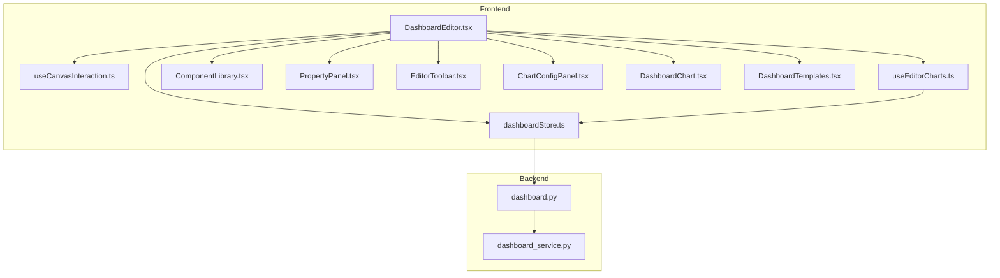
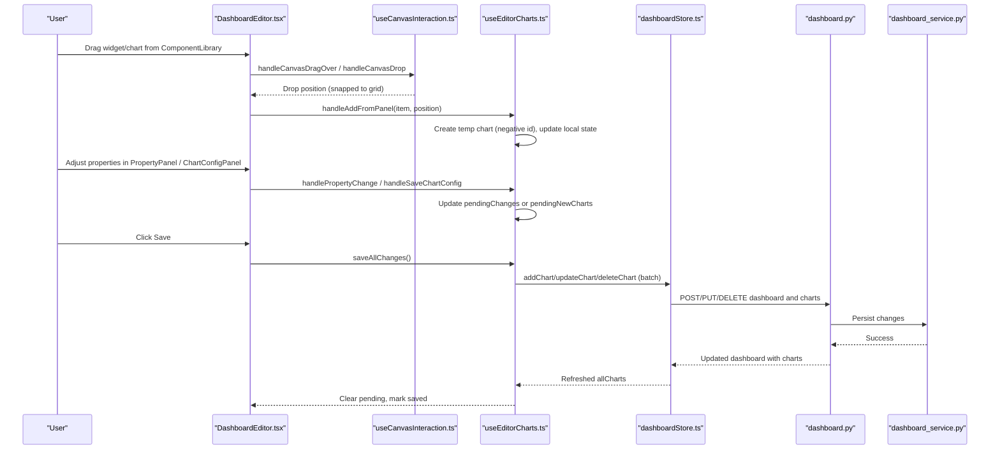
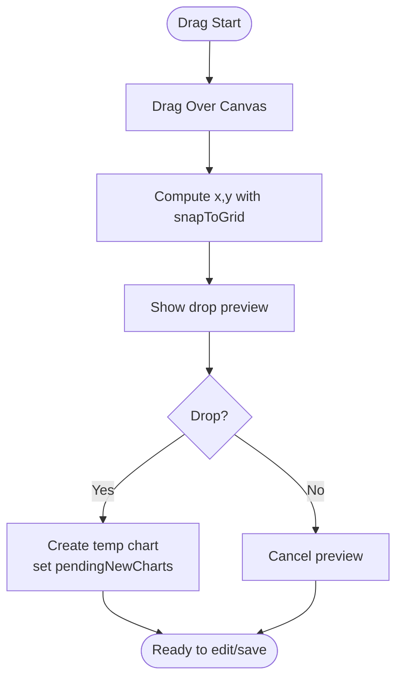
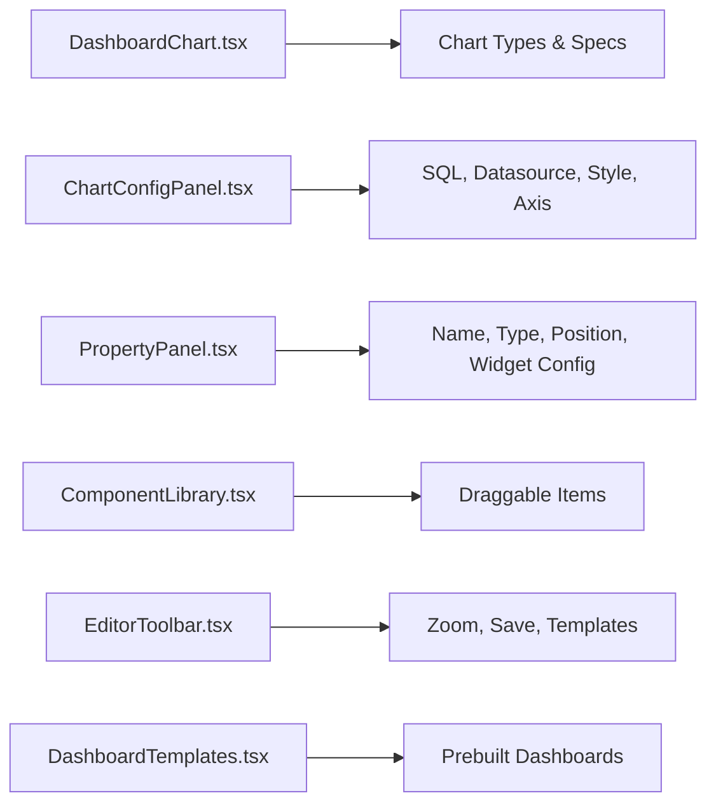
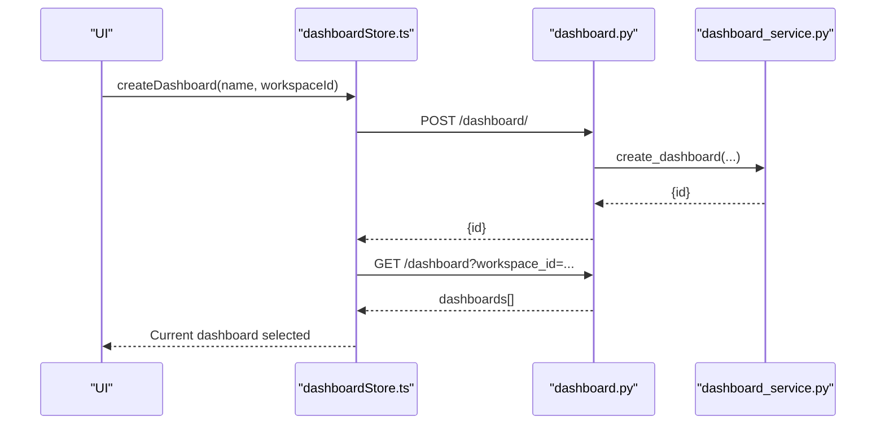
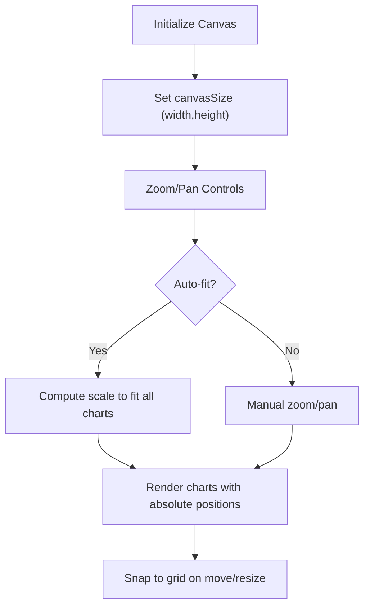
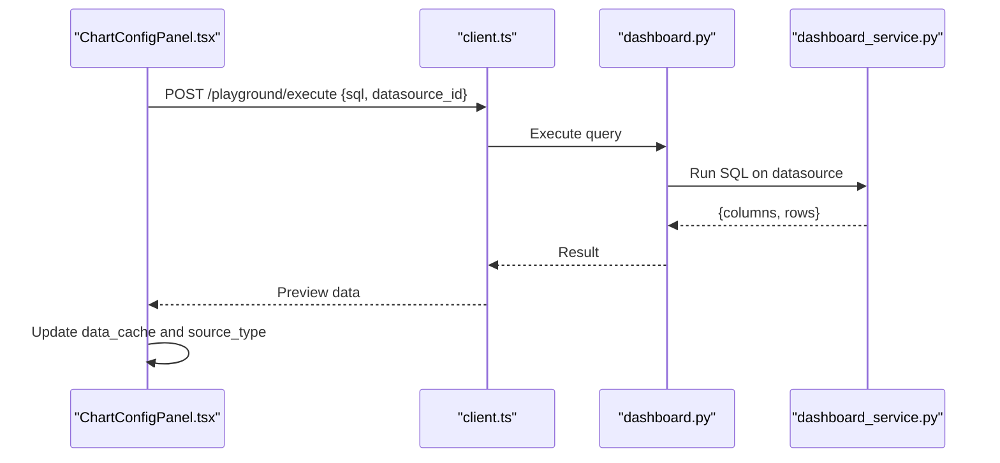
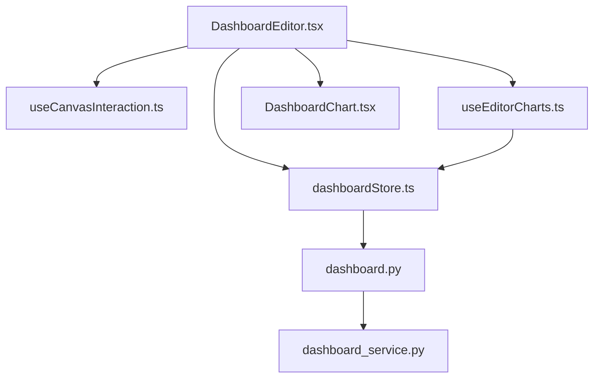

# Dashboard Builder & Editor

<cite>
**Referenced Files in This Document**
- [DashboardEditor.tsx](file://frontend/src/pages/DashboardEditor.tsx)
- [useCanvasInteraction.ts](file://frontend/src/hooks/useCanvasInteraction.ts)
- [useEditorCharts.ts](file://frontend/src/hooks/useEditorCharts.ts)
- [dashboardStore.ts](file://frontend/src/stores/dashboardStore.ts)
- [ComponentLibrary.tsx](file://frontend/src/components/editor/ComponentLibrary.tsx)
- [PropertyPanel.tsx](file://frontend/src/components/editor/PropertyPanel.tsx)
- [EditorToolbar.tsx](file://frontend/src/components/editor/EditorToolbar.tsx)
- [ChartConfigPanel.tsx](file://frontend/src/components/ChartConfigPanel.tsx)
- [DashboardChart.tsx](file://frontend/src/components/DashboardChart.tsx)
- [DashboardTemplates.tsx](file://frontend/src/components/DashboardTemplates.tsx)
- [dashboard.py](file://services/dataviz/api/dashboard.py)
- [dashboard_service.py](file://services/dataviz/services/dashboard_service.py)
</cite>

## Table of Contents
1. [Introduction](#introduction)
2. [Project Structure](#project-structure)
3. [Core Components](#core-components)
4. [Architecture Overview](#architecture-overview)
5. [Detailed Component Analysis](#detailed-component-analysis)
6. [Dependency Analysis](#dependency-analysis)
7. [Performance Considerations](#performance-considerations)
8. [Troubleshooting Guide](#troubleshooting-guide)
9. [Conclusion](#conclusion)
10. [Appendices](#appendices)

## Introduction
This document explains the dashboard builder and editor functionality, focusing on:
- Drag-and-drop interface for creating dashboards
- Chart positioning and layout management with grid snapping and responsive canvas
- Component-based architecture (charts, widgets, panels, toolbar)
- Dashboard CRUD operations (create, edit, copy, delete)
- Layout system with grid positioning, zoom/pan, and canvas sizing
- Chart configuration panels, property editors, and real-time preview
- Workspace isolation via workspace-scoped APIs
- Performance considerations for large dashboards with multiple charts and complex data sources

## Project Structure
The editor is a React application composed of:
- A page-level editor that orchestrates state and UI panels
- Hooks for canvas interaction and chart lifecycle
- A Zustand store for dashboard and chart persistence
- Reusable panels for component library, properties, and chart configuration
- Backend API endpoints and services for CRUD and data refresh



**Diagram sources**
- [DashboardEditor.tsx:16-337](file://frontend/src/pages/DashboardEditor.tsx#L16-L337)
- [useCanvasInteraction.ts:1-264](file://frontend/src/hooks/useCanvasInteraction.ts#L1-L264)
- [useEditorCharts.ts:1-283](file://frontend/src/hooks/useEditorCharts.ts#L1-L283)
- [dashboardStore.ts:1-348](file://frontend/src/stores/dashboardStore.ts#L1-L348)
- [ComponentLibrary.tsx:1-148](file://frontend/src/components/editor/ComponentLibrary.tsx#L1-L148)
- [PropertyPanel.tsx:1-573](file://frontend/src/components/editor/PropertyPanel.tsx#L1-L573)
- [EditorToolbar.tsx:1-113](file://frontend/src/components/editor/EditorToolbar.tsx#L1-L113)
- [ChartConfigPanel.tsx:1-800](file://frontend/src/components/ChartConfigPanel.tsx#L1-L800)
- [DashboardChart.tsx:1-800](file://frontend/src/components/DashboardChart.tsx#L1-L800)
- [DashboardTemplates.tsx:1-220](file://frontend/src/components/DashboardTemplates.tsx#L1-L220)
- [dashboard.py:97-388](file://services/dataviz/api/dashboard.py#L97-L388)
- [dashboard_service.py:1-200](file://services/dataviz/services/dashboard_service.py#L1-L200)

**Section sources**
- [DashboardEditor.tsx:16-337](file://frontend/src/pages/DashboardEditor.tsx#L16-L337)
- [dashboard.py:97-388](file://services/dataviz/api/dashboard.py#L97-L388)

## Core Components
- DashboardEditor: Orchestrates the editor UI, integrates drag-and-drop, selection, panels, and save flow.
- useCanvasInteraction: Manages pan, zoom, drag, resize, grid snapping, and visual feedback.
- useEditorCharts: Manages local staging of new/updated/deleted charts and batch saving to backend.
- dashboardStore: Centralized state for dashboards, charts, parameters, and server sync.
- ComponentLibrary: Draggable palette of chart types and widgets.
- PropertyPanel: In-context editing of chart/widget properties and canvas settings.
- ChartConfigPanel: Advanced chart configuration including SQL execution and preview.
- DashboardChart: Rendering engine for many chart types using G2.
- DashboardTemplates: Predefined templates to bootstrap dashboards quickly.
- EditorToolbar: Zoom controls, save, template access, panel toggles.

**Section sources**
- [DashboardEditor.tsx:16-337](file://frontend/src/pages/DashboardEditor.tsx#L16-L337)
- [useCanvasInteraction.ts:1-264](file://frontend/src/hooks/useCanvasInteraction.ts#L1-L264)
- [useEditorCharts.ts:1-283](file://frontend/src/hooks/useEditorCharts.ts#L1-L283)
- [dashboardStore.ts:1-348](file://frontend/src/stores/dashboardStore.ts#L1-L348)
- [ComponentLibrary.tsx:1-148](file://frontend/src/components/editor/ComponentLibrary.tsx#L1-L148)
- [PropertyPanel.tsx:1-573](file://frontend/src/components/editor/PropertyPanel.tsx#L1-L573)
- [ChartConfigPanel.tsx:1-800](file://frontend/src/components/ChartConfigPanel.tsx#L1-L800)
- [DashboardChart.tsx:1-800](file://frontend/src/components/DashboardChart.tsx#L1-L800)
- [DashboardTemplates.tsx:1-220](file://frontend/src/components/DashboardTemplates.tsx#L1-L220)
- [EditorToolbar.tsx:1-113](file://frontend/src/components/editor/EditorToolbar.tsx#L1-L113)

## Architecture Overview
The editor uses a layered architecture:
- UI layer: Panels and toolbar render the canvas and provide user interactions.
- Interaction layer: Hooks handle drag/resize/pan/zoom and compute positions with grid snapping.
- State layer: Local staging tracks pending changes; store persists to backend.
- Data layer: Backend API provides CRUD for dashboards/charts and executes queries on configured datasources.



**Diagram sources**
- [DashboardEditor.tsx:91-138](file://frontend/src/pages/DashboardEditor.tsx#L91-L138)
- [useCanvasInteraction.ts:67-156](file://frontend/src/hooks/useCanvasInteraction.ts#L67-L156)
- [useEditorCharts.ts:91-239](file://frontend/src/hooks/useEditorCharts.ts#L91-L239)
- [dashboardStore.ts:157-219](file://frontend/src/stores/dashboardStore.ts#L157-L219)
- [dashboard.py:110-388](file://services/dataviz/api/dashboard.py#L110-L388)
- [dashboard_service.py:1-200](file://services/dataviz/services/dashboard_service.py#L1-L200)

## Detailed Component Analysis

### Drag-and-Drop Interface
- ComponentLibrary exposes draggable items for charts and widgets.
- DashboardEditor handles drag start, drag over, and drop events, computing drop coordinates snapped to the grid.
- Preview shows a dashed rectangle at the intended drop location.
- On drop, a new chart/widget is created locally with default size and config, then staged until save.



**Diagram sources**
- [DashboardEditor.tsx:91-138](file://frontend/src/pages/DashboardEditor.tsx#L91-L138)
- [useCanvasInteraction.ts:65-66](file://frontend/src/hooks/useCanvasInteraction.ts#L65-L66)
- [useEditorCharts.ts:91-124](file://frontend/src/hooks/useEditorCharts.ts#L91-L124)

**Section sources**
- [ComponentLibrary.tsx:51-101](file://frontend/src/components/editor/ComponentLibrary.tsx#L51-L101)
- [DashboardEditor.tsx:91-138](file://frontend/src/pages/DashboardEditor.tsx#L91-L138)
- [useEditorCharts.ts:91-124](file://frontend/src/hooks/useEditorCharts.ts#L91-L124)

### Chart Positioning and Layout Management
- Grid snapping ensures consistent alignment.
- Dragging existing charts updates their position in local staging.
- Resizing enforces minimum sizes per chart/widget type and clamps within canvas bounds.
- Pan and zoom allow navigation across large canvases; auto-fit computes scale to fit all elements.

```mermaid
classDiagram
class CanvasState {
+number scale
+{x : number,y : number} panOffset
+{width : number,height : number} canvasSize
+number gridSize
+handleDragStart(chartId)
+handleResizeStart(chartId)
+handlePanStart(event)
+handleWheel(event)
+resetZoom()
}
class EditorCharts {
+allCharts
+pendingChanges
+pendingNewCharts
+handleDragEnd(chartId,pos)
+handleResizeEnd(chartId,pos)
+saveAllChanges()
}
CanvasState --> EditorCharts : "callbacks"
```

**Diagram sources**
- [useCanvasInteraction.ts:32-156](file://frontend/src/hooks/useCanvasInteraction.ts#L32-L156)
- [useEditorCharts.ts:126-155](file://frontend/src/hooks/useEditorCharts.ts#L126-L155)

**Section sources**
- [useCanvasInteraction.ts:67-205](file://frontend/src/hooks/useCanvasInteraction.ts#L67-L205)
- [useEditorCharts.ts:126-155](file://frontend/src/hooks/useEditorCharts.ts#L126-L155)

### Component-Based Architecture
- Charts: Rendered by DashboardChart with G2 specs built per chart type. Supports bar, line, area, pie, scatter, radar, gauge, funnel, heatmap, text display, big number trend, timeseries variants, tree/treemap, waterfall, sankey, boxplot, bubble.
- Widgets: Special chart types prefixed with widget_ used for filters and interactive controls.
- Panels: ComponentLibrary (palette), PropertyPanel (in-context edits), ChartConfigPanel (advanced config), EditorToolbar (actions).
- Templates: Predefined layouts to accelerate creation.



**Diagram sources**
- [DashboardChart.tsx:225-800](file://frontend/src/components/DashboardChart.tsx#L225-L800)
- [ChartConfigPanel.tsx:108-800](file://frontend/src/components/ChartConfigPanel.tsx#L108-L800)
- [PropertyPanel.tsx:63-187](file://frontend/src/components/editor/PropertyPanel.tsx#L63-L187)
- [ComponentLibrary.tsx:21-101](file://frontend/src/components/editor/ComponentLibrary.tsx#L21-L101)
- [EditorToolbar.tsx:28-113](file://frontend/src/components/editor/EditorToolbar.tsx#L28-L113)
- [DashboardTemplates.tsx:33-119](file://frontend/src/components/DashboardTemplates.tsx#L33-L119)

**Section sources**
- [DashboardChart.tsx:225-800](file://frontend/src/components/DashboardChart.tsx#L225-L800)
- [ChartConfigPanel.tsx:108-800](file://frontend/src/components/ChartConfigPanel.tsx#L108-L800)
- [PropertyPanel.tsx:63-187](file://frontend/src/components/editor/PropertyPanel.tsx#L63-L187)
- [ComponentLibrary.tsx:21-101](file://frontend/src/components/editor/ComponentLibrary.tsx#L21-L101)
- [EditorToolbar.tsx:28-113](file://frontend/src/components/editor/EditorToolbar.tsx#L28-L113)
- [DashboardTemplates.tsx:33-119](file://frontend/src/components/DashboardTemplates.tsx#L33-L119)

### Dashboard CRUD Operations
- Create: New dashboards are created via store method which calls backend endpoint.
- Read: Load dashboards list and current dashboard details with charts.
- Update: Edit dashboard metadata and chart properties; changes staged locally then saved.
- Delete: Remove dashboards or individual charts; reflected immediately in UI.
- Copy: Duplicate a dashboard including its charts.



**Diagram sources**
- [dashboardStore.ts:122-163](file://frontend/src/stores/dashboardStore.ts#L122-L163)
- [dashboard.py:97-121](file://services/dataviz/api/dashboard.py#L97-L121)
- [dashboard_service.py:1-200](file://services/dataviz/services/dashboard_service.py#L1-L200)

**Section sources**
- [dashboardStore.ts:122-219](file://frontend/src/stores/dashboardStore.ts#L122-L219)
- [dashboard.py:97-388](file://services/dataviz/api/dashboard.py#L97-L388)

### Layout System: Grid Positioning, Responsive Design, Mobile Adaptation
- Grid: Snap-to-grid values ensure consistent placement; adjustable grid size in PropertyPanel.
- Canvas: Fixed logical size (e.g., 1920x1080) with zoom/pan for navigation; auto-fit scales to container.
- Responsive: The editor uses absolute positioning within a transform-based canvas; resizing and zoom adapt to viewport.
- Mobile: While not explicitly optimized for mobile editing, the same principles apply; smaller screens benefit from zoom-out and simplified panels.



**Diagram sources**
- [useCanvasInteraction.ts:40-66](file://frontend/src/hooks/useCanvasInteraction.ts#L40-L66)
- [useCanvasInteraction.ts:135-156](file://frontend/src/hooks/useCanvasInteraction.ts#L135-L156)
- [PropertyPanel.tsx:463-573](file://frontend/src/components/editor/PropertyPanel.tsx#L463-L573)

**Section sources**
- [useCanvasInteraction.ts:40-156](file://frontend/src/hooks/useCanvasInteraction.ts#L40-L156)
- [PropertyPanel.tsx:463-573](file://frontend/src/components/editor/PropertyPanel.tsx#L463-L573)

### Chart Configuration Panels, Property Editors, Real-Time Preview
- ChartConfigPanel:
  - Tabs for basic, style, axis, datasource.
  - SQL editor with execute and preview data.
  - Datasource selector and drill-through link configuration for table_value charts.
  - Time aggregation options and formatting controls.
- PropertyPanel:
  - Inline editing of name, type, position, and widget-specific configs.
  - Style settings for background, text, borders, radius, padding, font, opacity, shadow, alignment.
  - Canvas properties: size, background color, grid size, zoom.
- Real-time preview:
  - Execute SQL returns columns and rows; preview stored in chart’s data_cache for immediate rendering.



**Diagram sources**
- [ChartConfigPanel.tsx:79-98](file://frontend/src/components/ChartConfigPanel.tsx#L79-L98)
- [dashboard.py:169-182](file://services/dataviz/api/dashboard.py#L169-L182)
- [dashboard_service.py:162-200](file://services/dataviz/services/dashboard_service.py#L162-L200)

**Section sources**
- [ChartConfigPanel.tsx:108-800](file://frontend/src/components/ChartConfigPanel.tsx#L108-L800)
- [PropertyPanel.tsx:63-187](file://frontend/src/components/editor/PropertyPanel.tsx#L63-L187)
- [useEditorCharts.ts:171-201](file://frontend/src/hooks/useEditorCharts.ts#L171-L201)

### Workspace Isolation, Sharing Mechanisms, Collaboration Features
- Workspace isolation:
  - Backend endpoints accept workspace context; listing dashboards is scoped by workspace_id.
  - Frontend store loads dashboards with workspace parameter and sets current workspace context.
- Sharing mechanisms:
  - Dashboard has an is_public flag; while not fully implemented here, it indicates intent for sharing.
  - Templates enable quick duplication and reuse across workspaces.
- Collaboration features:
  - No real-time collaboration is evident in the analyzed files; concurrent edits would rely on optimistic UI and last-write-wins semantics unless extended.

**Section sources**
- [dashboard.py:97-107](file://services/dataviz/api/dashboard.py#L97-L107)
- [dashboardStore.ts:122-141](file://frontend/src/stores/dashboardStore.ts#L122-L141)
- [dashboardStore.ts:157-183](file://frontend/src/stores/dashboardStore.ts#L157-L183)
- [DashboardTemplates.tsx:33-119](file://frontend/src/components/DashboardTemplates.tsx#L33-L119)

## Dependency Analysis
Key dependencies and relationships:
- DashboardEditor depends on hooks and stores for state and interaction.
- useEditorCharts depends on dashboardStore for server sync.
- dashboardStore depends on API client to call backend endpoints.
- Backend API delegates to service layer for business logic and database operations.
- Chart rendering depends on G2 via DashboardChart.



**Diagram sources**
- [DashboardEditor.tsx:16-337](file://frontend/src/pages/DashboardEditor.tsx#L16-L337)
- [useEditorCharts.ts:1-283](file://frontend/src/hooks/useEditorCharts.ts#L1-L283)
- [dashboardStore.ts:1-348](file://frontend/src/stores/dashboardStore.ts#L1-L348)
- [dashboard.py:97-388](file://services/dataviz/api/dashboard.py#L97-L388)
- [dashboard_service.py:1-200](file://services/dataviz/services/dashboard_service.py#L1-L200)
- [DashboardChart.tsx:1-800](file://frontend/src/components/DashboardChart.tsx#L1-L800)

**Section sources**
- [DashboardEditor.tsx:16-337](file://frontend/src/pages/DashboardEditor.tsx#L16-L337)
- [useEditorCharts.ts:1-283](file://frontend/src/hooks/useEditorCharts.ts#L1-L283)
- [dashboardStore.ts:1-348](file://frontend/src/stores/dashboardStore.ts#L1-L348)
- [dashboard.py:97-388](file://services/dataviz/api/dashboard.py#L97-L388)
- [dashboard_service.py:1-200](file://services/dataviz/services/dashboard_service.py#L1-L200)
- [DashboardChart.tsx:1-800](file://frontend/src/components/DashboardChart.tsx#L1-L800)

## Performance Considerations
- Large dashboards:
  - Use server-side pagination for table_value charts to limit payload size.
  - Enable time aggregation to reduce data points for time series.
  - Cache query results in data_cache to avoid repeated refreshes during editing.
- Efficient rendering:
  - Limit visible charts when zoomed out; consider virtualization if needed.
  - Avoid excessive re-renders by batching property changes and deferring saves.
- Network efficiency:
  - Batch save changes instead of persisting each change individually.
  - Refresh only necessary charts when parameters change.
- Backend optimization:
  - Ensure datasource connections have appropriate timeouts.
  - Sanitize and validate parameters to prevent expensive or malicious queries.

[No sources needed since this section provides general guidance]

## Troubleshooting Guide
Common issues and resolutions:
- SQL execution failures:
  - Check datasource selection and connection.
  - Validate SQL syntax and parameter placeholders.
  - Inspect error messages returned by backend.
- Parameter substitution errors:
  - Ensure placeholder keys match nested parameter structure.
  - Verify no illegal characters in parameter values.
- Chart not updating:
  - Confirm data_cache is refreshed after parameter changes.
  - Use refresh single chart endpoint to force reload.
- Layout not saving:
  - Ensure all pending changes are saved before leaving editor.
  - Check network requests for successful responses.

**Section sources**
- [ChartConfigPanel.tsx:79-98](file://frontend/src/components/ChartConfigPanel.tsx#L79-L98)
- [dashboard_service.py:99-150](file://services/dataviz/services/dashboard_service.py#L99-L150)
- [dashboardStore.ts:285-327](file://frontend/src/stores/dashboardStore.ts#L285-L327)
- [useEditorCharts.ts:203-239](file://frontend/src/hooks/useEditorCharts.ts#L203-L239)

## Conclusion
The dashboard builder and editor provide a robust, component-based environment for designing dashboards with drag-and-drop, precise layout control, and rich chart configuration. The separation of concerns between UI, interaction, state, and data layers enables scalability and maintainability. Workspace isolation ensures secure multi-tenant usage, while templates accelerate creation. For performance, leverage server-side pagination, time aggregation, and caching strategies. Future enhancements could include real-time collaboration and advanced responsive design optimizations for mobile editing.

[No sources needed since this section summarizes without analyzing specific files]

## Appendices
- Chart types supported: bar, line, area, pie, scatter, radar, gauge, funnel, heatmap, text_display, big_number_trend, timeseries_line/bar/area, tree/treemap, waterfall, sankey, boxplot, bubble.
- Widget types: label, search, reset, export, select, multi_select, number, date_range.
- Template examples: sales overview, traffic analysis, financial report, user analytics, performance monitor, empty dashboard.

[No sources needed since this section lists capabilities without analyzing specific files]