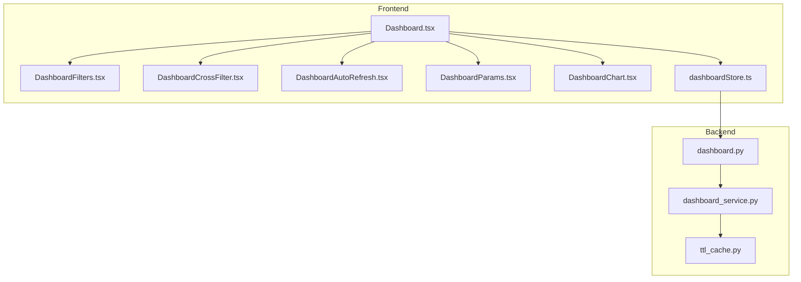
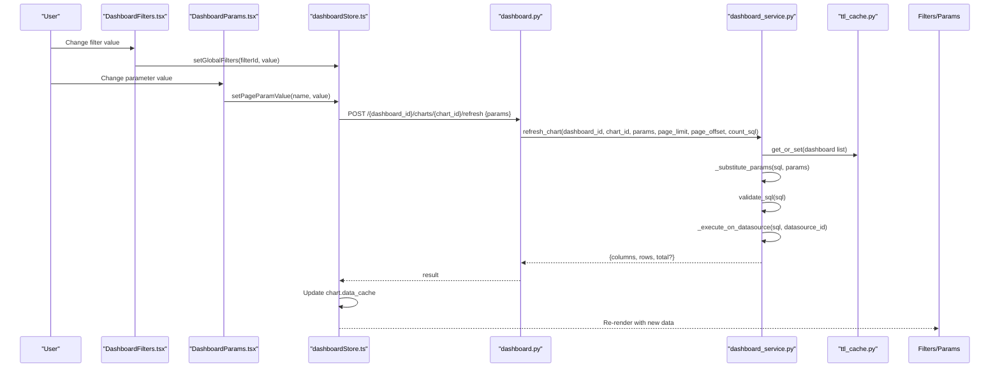
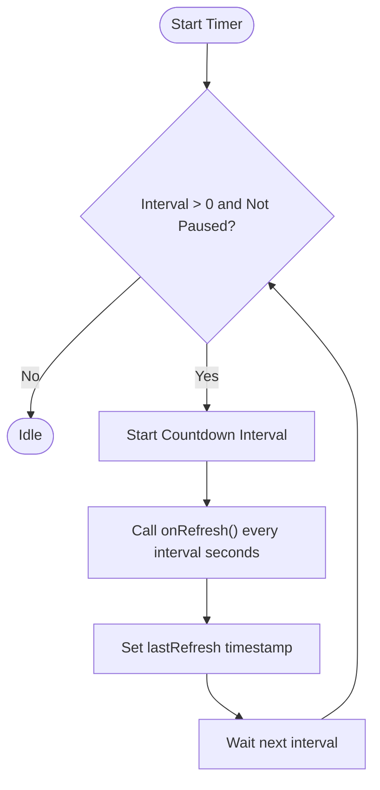
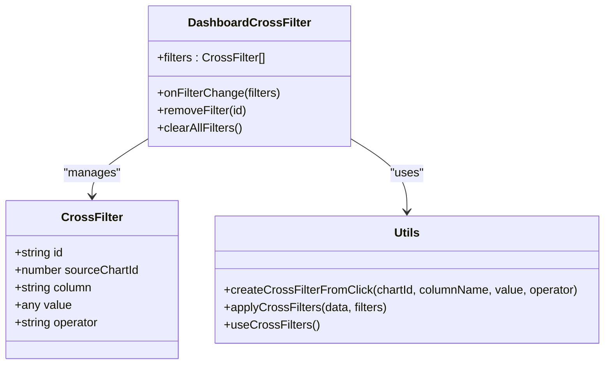
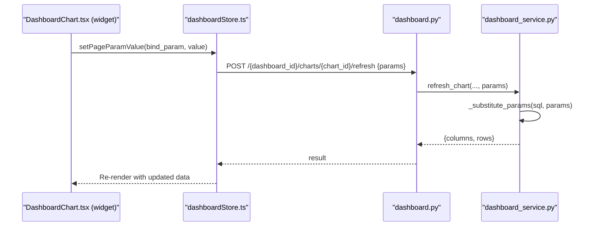
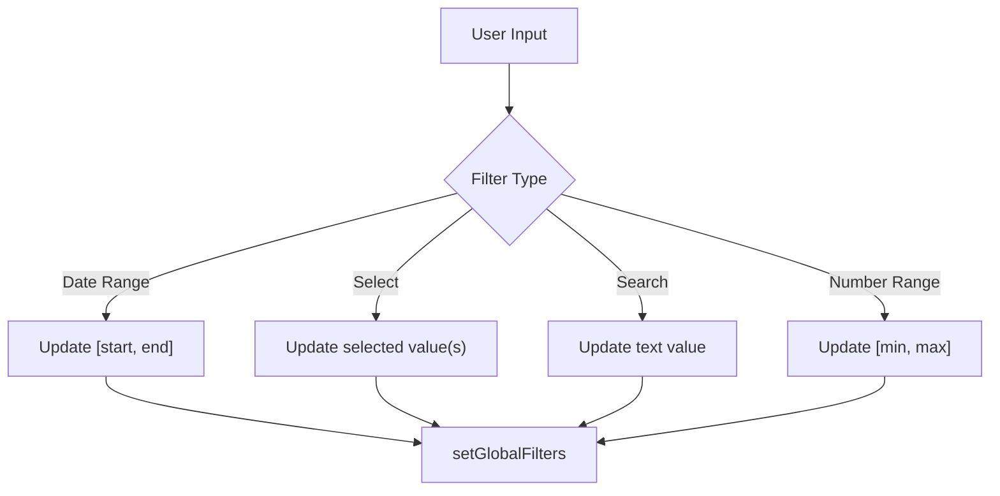
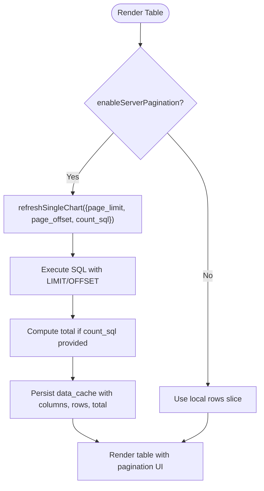
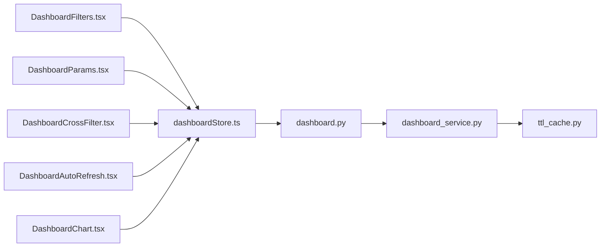

# Real-time Updates & Filtering

<cite>
**Referenced Files in This Document**
- [Dashboard.tsx](file://frontend/src/pages/Dashboard.tsx)
- [DashboardFilters.tsx](file://frontend/src/components/DashboardFilters.tsx)
- [DashboardCrossFilter.tsx](file://frontend/src/components/DashboardCrossFilter.tsx)
- [DashboardAutoRefresh.tsx](file://frontend/src/components/DashboardAutoRefresh.tsx)
- [DashboardParams.tsx](file://frontend/src/components/DashboardParams.tsx)
- [DashboardChart.tsx](file://frontend/src/components/DashboardChart.tsx)
- [dashboardStore.ts](file://frontend/src/stores/dashboardStore.ts)
- [dashboard.py](file://services/dataviz/api/dashboard.py)
- [dashboard_service.py](file://services/dataviz/services/dashboard_service.py)
- [ttl_cache.py](file://services/shared/common/ttl_cache.py)
</cite>

## Table of Contents
1. Introduction
2. Project Structure
3. Core Components
4. Architecture Overview
5. Detailed Component Analysis
6. Dependency Analysis
7. Performance Considerations
8. Troubleshooting Guide
9. Conclusion

## Introduction
This document explains how real-time data updates and filtering work across the dashboard system. It covers automatic refresh mechanisms, polling intervals, parameter binding, cross-filtering between charts, dynamic query execution, filter components (date ranges, dropdowns, text search, numeric ranges), parameter propagation, conditional logic, and state management. It also provides guidance on implementing custom filters, optimizing query performance for large datasets, caching strategies, error handling, and user experience considerations for live dashboards.

## Project Structure
The real-time update and filtering capabilities span frontend components, a global store, and backend services:
- Frontend components provide interactive filters, auto-refresh controls, parameter inputs, cross-filter UI, and chart rendering with server-side pagination and drill-through links.
- The global store manages dashboard state, parameters, filters, and triggers data refreshes via API calls.
- Backend APIs expose endpoints to list dashboards, refresh individual or all charts, and persist layout changes. The service layer executes SQL safely, substitutes parameters, applies pagination, and caches results.

**Diagram sources**
- [Dashboard.tsx:1-120](file://frontend/src/pages/Dashboard.tsx#L1-L120)
- [DashboardFilters.tsx:1-179](file://frontend/src/components/DashboardFilters.tsx#L1-L179)
- [DashboardCrossFilter.tsx:1-194](file://frontend/src/components/DashboardCrossFilter.tsx#L1-L194)
- [DashboardAutoRefresh.tsx:1-171](file://frontend/src/components/DashboardAutoRefresh.tsx#L1-L171)
- [DashboardParams.tsx:1-64](file://frontend/src/components/DashboardParams.tsx#L1-L64)
- [DashboardChart.tsx:944-1140](file://frontend/src/components/DashboardChart.tsx#L944-L1140)
- [dashboardStore.ts:101-348](file://frontend/src/stores/dashboardStore.ts#L101-L348)
- [dashboard.py:97-388](file://services/dataviz/api/dashboard.py#L97-L388)
- [dashboard_service.py:613-766](file://services/dataviz/services/dashboard_service.py#L613-L766)
- [ttl_cache.py:109-110](file://services/shared/common/ttl_cache.py#L109-L110)

**Section sources**
- [Dashboard.tsx:330-523](file://frontend/src/pages/Dashboard.tsx#L330-L523)
- [dashboardStore.ts:101-348](file://frontend/src/stores/dashboardStore.ts#L101-L348)
- [dashboard.py:97-388](file://services/dataviz/api/dashboard.py#L97-L388)

## Core Components
- DashboardFilters: Renders date range, select, multi-select, search, and number range filters. Emits change events that update global filters in the store.
- DashboardCrossFilter: Manages cross-chart filters with operators (eq, neq, contains, gt, lt, between). Provides utilities to create and apply filters to dataset rows.
- DashboardAutoRefresh: Implements configurable polling intervals with pause/resume, manual refresh, countdown timer, and last refresh timestamp.
- DashboardParams: Renders page-level parameters (text, number, date, select) and binds values to pageParamValues in the store.
- DashboardChart: Renders multiple chart types, supports widget controls, server-side pagination, drill-through links, and map visualizations. Initializes default parameter values and triggers refresh when needed.
- dashboardStore: Centralized state for dashboards, charts, parameters, filters, and refresh actions. Persists data cache per chart and exposes methods to refresh single or all charts.

Key responsibilities:
- Parameter binding: Widget controls update paramValues and optionally bind to pageParamValues.
- Cross-filtering: Click interactions can generate cross-filters; these are applied client-side to displayed data.
- Auto-refresh: Polling triggers refreshCharts which calls refreshSingleChart for each relevant chart.
- Dynamic queries: Backend substitutes {{param_name}} placeholders into SQL before execution.

**Section sources**
- [DashboardFilters.tsx:9-179](file://frontend/src/components/DashboardFilters.tsx#L9-L179)
- [DashboardCrossFilter.tsx:7-194](file://frontend/src/components/DashboardCrossFilter.tsx#L7-L194)
- [DashboardAutoRefresh.tsx:8-171](file://frontend/src/components/DashboardAutoRefresh.tsx#L8-L171)
- [DashboardParams.tsx:6-64](file://frontend/src/components/DashboardParams.tsx#L6-L64)
- [DashboardChart.tsx:944-1140](file://frontend/src/components/DashboardChart.tsx#L944-L1140)
- [dashboardStore.ts:63-348](file://frontend/src/stores/dashboardStore.ts#L63-L348)

## Architecture Overview
Real-time updates flow from user interactions through the frontend store to backend services and back to the UI.

**Diagram sources**
- [DashboardFilters.tsx:25-118](file://frontend/src/components/DashboardFilters.tsx#L25-L118)
- [DashboardParams.tsx:12-64](file://frontend/src/components/DashboardParams.tsx#L12-L64)
- [dashboardStore.ts:270-327](file://frontend/src/stores/dashboardStore.ts#L270-L327)
- [dashboard.py:331-371](file://services/dataviz/api/dashboard.py#L331-L371)
- [dashboard_service.py:124-150](file://services/dataviz/services/dashboard_service.py#L124-L150)
- [dashboard_service.py:613-703](file://services/dataviz/services/dashboard_service.py#L613-L703)
- [ttl_cache.py:253-262](file://services/dataviz/services/dashboard_service.py#L253-L262)

## Detailed Component Analysis

### Automatic Refresh Mechanism
- DashboardAutoRefresh sets up timers for periodic refresh based on selected interval. It supports pause/resume and manual refresh, updating last refresh time and showing a countdown.
- The Dashboard page wires this component to call refreshCharts from the store, which iterates over charts and invokes refreshSingleChart with optional pagination parameters.

**Diagram sources**
- [DashboardAutoRefresh.tsx:49-93](file://frontend/src/components/DashboardAutoRefresh.tsx#L49-L93)
- [Dashboard.tsx:510-523](file://frontend/src/pages/Dashboard.tsx#L510-L523)
- [dashboardStore.ts:270-283](file://frontend/src/stores/dashboardStore.ts#L270-L283)

**Section sources**
- [DashboardAutoRefresh.tsx:13-171](file://frontend/src/components/DashboardAutoRefresh.tsx#L13-L171)
- [Dashboard.tsx:510-523](file://frontend/src/pages/Dashboard.tsx#L510-L523)
- [dashboardStore.ts:270-283](file://frontend/src/stores/dashboardStore.ts#L270-L283)

### Cross-Filtering Between Charts
- DashboardCrossFilter maintains active filters with source chart context and operator-based conditions.
- Utilities allow creating filters from click events and applying them to dataset rows client-side.
- The Dashboard page integrates cross-filter UI and propagates changes to the store.

**Diagram sources**
- [DashboardCrossFilter.tsx:7-194](file://frontend/src/components/DashboardCrossFilter.tsx#L7-L194)

**Section sources**
- [DashboardCrossFilter.tsx:21-156](file://frontend/src/components/DashboardCrossFilter.tsx#L21-L156)
- [Dashboard.tsx:522-523](file://frontend/src/pages/Dashboard.tsx#L522-L523)

### Parameter Binding and Dynamic Query Execution
- DashboardParams renders page-level parameters and updates pageParamValues in the store.
- Widgets inside DashboardChart can bind their values to page parameters using bind_param configuration.
- Backend service substitutes {{param_name}} placeholders in SQL with sanitized values before execution.

**Diagram sources**
- [DashboardChart.tsx:1141-1173](file://frontend/src/components/DashboardChart.tsx#L1141-L1173)
- [dashboardStore.ts:285-327](file://frontend/src/stores/dashboardStore.ts#L285-L327)
- [dashboard.py:331-371](file://services/dataviz/api/dashboard.py#L331-L371)
- [dashboard_service.py:124-150](file://services/dataviz/services/dashboard_service.py#L124-L150)

**Section sources**
- [DashboardParams.tsx:12-64](file://frontend/src/components/DashboardParams.tsx#L12-L64)
- [DashboardChart.tsx:1141-1173](file://frontend/src/components/DashboardChart.tsx#L1141-L1173)
- [dashboard_store.ts:285-327](file://frontend/src/stores/dashboardStore.ts#L285-L327)
- [dashboard_service.py:124-150](file://services/dataviz/services/dashboard_service.py#L124-L150)

### Filter Components
- Date Range: Two date inputs bound to an array value; onChange updates global filters.
- Dropdown Selectors: Single and multi-select options rendered via Select components; values propagate to filters.
- Text Search: Input with search icon; emits string values for filtering.
- Numeric Range: Min/max inputs bound to an array; onChange updates filter values.

**Diagram sources**
- [DashboardFilters.tsx:30-118](file://frontend/src/components/DashboardFilters.tsx#L30-L118)

**Section sources**
- [DashboardFilters.tsx:30-118](file://frontend/src/components/DashboardFilters.tsx#L30-L118)

### Data Caching and Server-Side Pagination
- Chart data is cached in the store as JSON strings within chart objects; parsed on render to avoid repeated requests.
- For tables with large datasets, server-side pagination is supported via page_limit, page_offset, and optional count_sql.
- Backend validates SQL safety, applies LIMIT/OFFSET, computes totals when possible, and persists data_cache after refresh.

**Diagram sources**
- [DashboardChart.tsx:1401-1599](file://frontend/src/components/DashboardChart.tsx#L1401-L1599)
- [dashboardStore.ts:285-327](file://frontend/src/stores/dashboardStore.ts#L285-L327)
- [dashboard_service.py:613-703](file://services/dataviz/services/dashboard_service.py#L613-L703)

**Section sources**
- [DashboardChart.tsx:1401-1599](file://frontend/src/components/DashboardChart.tsx#L1401-L1599)
- [dashboardStore.ts:285-327](file://frontend/src/stores/dashboardStore.ts#L285-L327)
- [dashboard_service.py:613-703](file://services/dataviz/services/dashboard_service.py#L613-L703)

### Error Handling and UX Considerations
- Store catches errors during refresh and shows toast notifications for failures.
- Loading states are tracked per chart via refreshingChartIds to display spinners and disable controls appropriately.
- Auto-refresh disables manual refresh while loading and resets countdown after manual refresh.
- Cross-filter UI allows removing individual filters or clearing all at once.

**Section sources**
- [dashboardStore.ts:315-327](file://frontend/src/stores/dashboardStore.ts#L315-L327)
- [DashboardAutoRefresh.tsx:87-93](file://frontend/src/components/DashboardAutoRefresh.tsx#L87-L93)
- [DashboardCrossFilter.tsx:28-37](file://frontend/src/components/DashboardCrossFilter.tsx#L28-L37)

## Dependency Analysis
The following diagram maps key dependencies among components and services involved in real-time updates and filtering.

**Diagram sources**
- [DashboardFilters.tsx:25-118](file://frontend/src/components/DashboardFilters.tsx#L25-L118)
- [DashboardParams.tsx:12-64](file://frontend/src/components/DashboardParams.tsx#L12-L64)
- [DashboardCrossFilter.tsx:21-156](file://frontend/src/components/DashboardCrossFilter.tsx#L21-L156)
- [DashboardAutoRefresh.tsx:49-93](file://frontend/src/components/DashboardAutoRefresh.tsx#L49-L93)
- [DashboardChart.tsx:944-1140](file://frontend/src/components/DashboardChart.tsx#L944-L1140)
- [dashboardStore.ts:270-327](file://frontend/src/stores/dashboardStore.ts#L270-L327)
- [dashboard.py:331-371](file://services/dataviz/api/dashboard.py#L331-L371)
- [dashboard_service.py:613-703](file://services/dataviz/services/dashboard_service.py#L613-L703)
- [ttl_cache.py:109-110](file://services/shared/common/ttl_cache.py#L109-L110)

**Section sources**
- [dashboardStore.ts:270-327](file://frontend/src/stores/dashboardStore.ts#L270-L327)
- [dashboard.py:331-371](file://services/dataviz/api/dashboard.py#L331-L371)
- [dashboard_service.py:613-703](file://services/dataviz/services/dashboard_service.py#L613-L703)

## Performance Considerations
- Use server-side pagination for large tables to reduce payload size and improve responsiveness.
- Leverage TTL caching for dashboard lists to minimize database load.
- Avoid excessive auto-refresh intervals; choose intervals appropriate for data volatility.
- Validate and sanitize SQL parameters to prevent injection and ensure safe execution.
- Limit chart data sizes by configuring maxRows and enabling server-side pagination where applicable.
- Debounce or throttle frequent parameter changes if needed to reduce refresh storms.

[No sources needed since this section provides general guidance]

## Troubleshooting Guide
Common issues and resolutions:
- Refresh fails with SQL validation error: Ensure SQL is safe and does not contain prohibited patterns; check parameter substitution and sanitization.
- No data displayed: Verify chart has sql_query or config data; check data_cache parsing and ensure columns/rows exist.
- Cross-filters not applied: Confirm filter operators and values match data types; verify applyCrossFilters logic and column names.
- Auto-refresh not triggering: Check interval selection and paused state; ensure onRefresh callback is wired correctly.
- Large dataset lag: Enable server-side pagination and configure count_sql for accurate totals; adjust page_limit and pageSize.

**Section sources**
- [dashboard_service.py:677-680](file://services/dataviz/services/dashboard_service.py#L677-L680)
- [DashboardChart.tsx:1390-1399](file://frontend/src/components/DashboardChart.tsx#L1390-L1399)
- [DashboardCrossFilter.tsx:119-156](file://frontend/src/components/DashboardCrossFilter.tsx#L119-L156)
- [DashboardAutoRefresh.tsx:49-93](file://frontend/src/components/DashboardAutoRefresh.tsx#L49-L93)

## Conclusion
The dashboard system provides robust real-time updates and filtering through a combination of frontend components, centralized state management, and backend services. Automatic refresh with configurable intervals, cross-filtering, parameter binding, and server-side pagination enable responsive and scalable dashboards. Caching and SQL validation enhance performance and safety. By following the guidance in this document, you can implement custom filters, optimize queries, manage filter state effectively, and deliver a smooth user experience for live data visualization.

[No sources needed since this section summarizes without analyzing specific files]