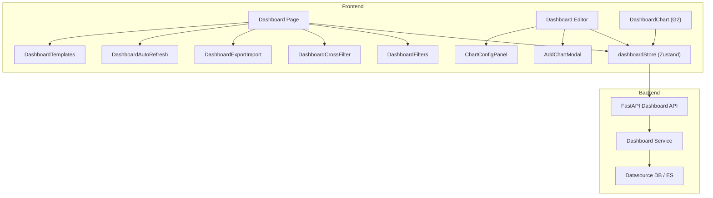
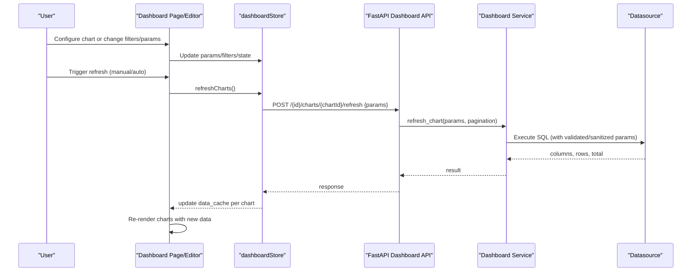
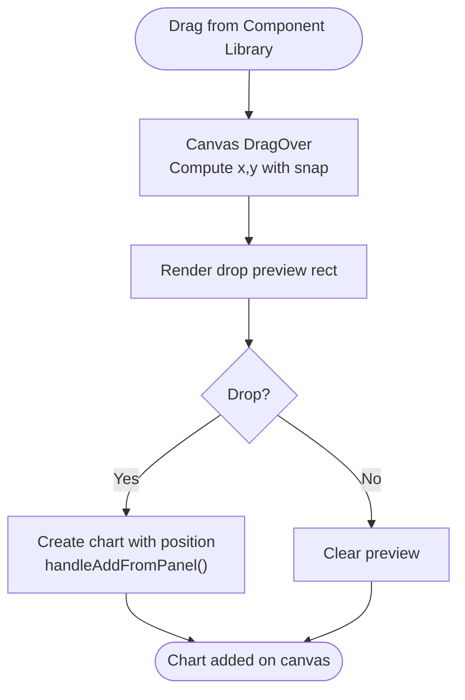
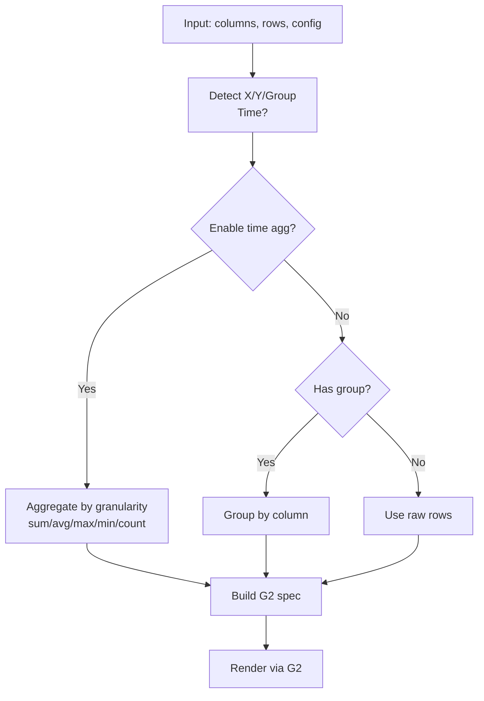
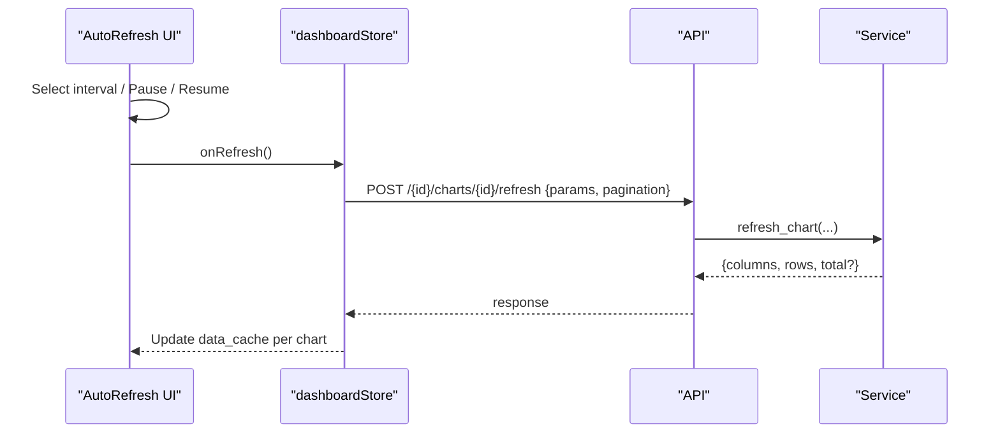
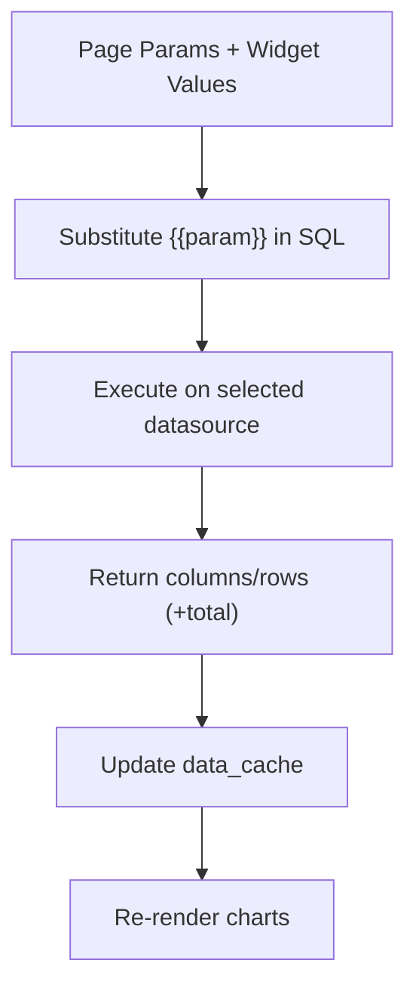
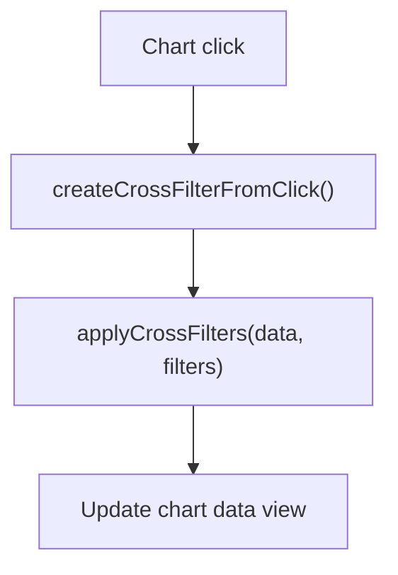
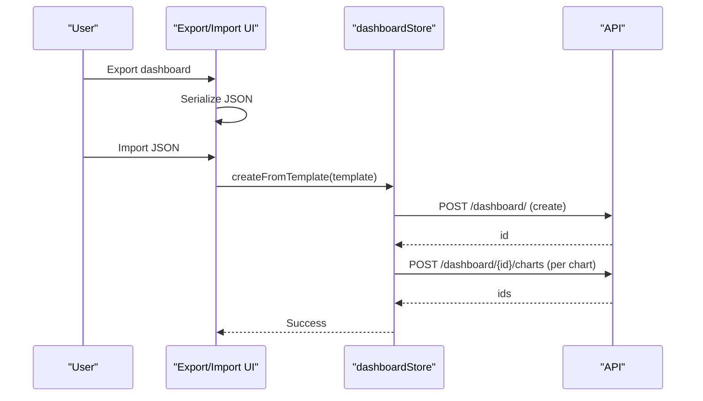
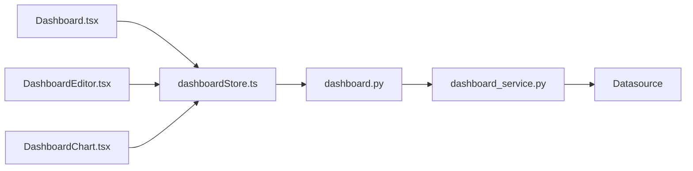

# Visualization & Dashboards

<cite>
**Referenced Files in This Document**
- [Dashboard.tsx](file://frontend/src/pages/Dashboard.tsx)
- [DashboardEditor.tsx](file://frontend/src/pages/DashboardEditor.tsx)
- [DashboardChart.tsx](file://frontend/src/components/DashboardChart.tsx)
- [dashboardStore.ts](file://frontend/src/stores/dashboardStore.ts)
- [dashboard.py](file://services/dataviz/api/dashboard.py)
- [dashboard_service.py](file://services/dataviz/services/dashboard_service.py)
- [AddChartModal.tsx](file://frontend/src/components/AddChartModal.tsx)
- [ChartConfigPanel.tsx](file://frontend/src/components/ChartConfigPanel.tsx)
- [DashboardFilters.tsx](file://frontend/src/components/DashboardFilters.tsx)
- [DashboardCrossFilter.tsx](file://frontend/src/components/DashboardCrossFilter.tsx)
- [DashboardExportImport.tsx](file://frontend/src/components/DashboardExportImport.tsx)
- [DashboardAutoRefresh.tsx](file://frontend/src/components/DashboardAutoRefresh.tsx)
- [DashboardTemplates.tsx](file://frontend/src/components/DashboardTemplates.tsx)
- [useComponentData.ts](file://frontend/src/hooks/useComponentData.ts)
</cite>

## Table of Contents
1. Introduction
2. Project Structure
3. Core Components
4. Architecture Overview
5. Detailed Component Analysis
6. Dependency Analysis
7. Performance Considerations
8. Troubleshooting Guide
9. Conclusion

## Introduction
This document explains AI-DataHub’s visualization and dashboard capabilities, focusing on the drag-and-drop dashboard builder, ECharts-compatible chart rendering via AntV G2, chart type recommendations based on data characteristics, real-time refresh, supported chart types, dashboard CRUD, sharing/export/import, responsive design, component-based architecture with cross-filtering and parameter binding, dynamic data sources, customization, interactivity, performance optimization for large datasets, mobile responsiveness, accessibility, and browser compatibility.

## Project Structure
The dashboard system spans frontend pages, reusable components, a state store, and backend APIs/services:
- Frontend pages orchestrate dashboards and editors
- Reusable components implement charts, filters, cross-filters, export/import, auto-refresh, templates, and configuration panels
- A Zustand store manages dashboard state, parameters, filters, and refresh flows
- Backend FastAPI endpoints expose CRUD and refresh operations backed by service logic that executes SQL against configured datasources

**Diagram sources**
- [Dashboard.tsx:330-800](file://frontend/src/pages/Dashboard.tsx#L330-L800)
- [DashboardEditor.tsx:16-337](file://frontend/src/pages/DashboardEditor.tsx#L16-L337)
- [DashboardChart.tsx:225-800](file://frontend/src/components/DashboardChart.tsx#L225-L800)
- [dashboardStore.ts:101-348](file://frontend/src/stores/dashboardStore.ts#L101-L348)
- [dashboard.py:97-388](file://services/dataviz/api/dashboard.py#L97-L388)
- [dashboard_service.py:250-790](file://services/dataviz/services/dashboard_service.py#L250-L790)

**Section sources**
- [Dashboard.tsx:330-800](file://frontend/src/pages/Dashboard.tsx#L330-L800)
- [DashboardEditor.tsx:16-337](file://frontend/src/pages/DashboardEditor.tsx#L16-L337)
- [dashboardStore.ts:101-348](file://frontend/src/stores/dashboardStore.ts#L101-L348)
- [dashboard.py:97-388](file://services/dataviz/api/dashboard.py#L97-L388)
- [dashboard_service.py:250-790](file://services/dataviz/services/dashboard_service.py#L250-L790)

## Core Components
- Dashboard page: lists dashboards, settings, global filters, cross-filters, search, auto-refresh, export/import, templates, and renders charts on a fixed canvas with pan/zoom.
- Dashboard editor: full drag-and-drop canvas with left panel (component library), right panel (properties), toolbar (zoom, save, templates), and drop preview.
- Chart renderer: builds AntV G2 specs per chart type; supports time aggregation, grouping, themes, tooltips, legends, and custom views.
- Store: centralizes CRUD, parameters, filters, favorites, pagination, and refresh flows.
- Backend API/service: exposes endpoints for dashboard/chart CRUD, layout, refresh, snapshots, and datasource listing; executes SQL safely with parameter substitution and optional server-side pagination.

Key responsibilities:
- Drag-and-drop builder: handled in the editor via hooks and event handlers for drag start/end and resize end.
- Chart type recommendations: automatic column detection and time-series helpers guide axis/group selection and aggregation.
- Real-time refresh: auto-refresh timer and manual refresh trigger coordinated through the store and backend refresh endpoint.
- Cross-filtering and parameters: UI components manage filter states and bind to chart queries via placeholders.
- Export/import: JSON serialization/deserialization of dashboard configurations.

**Section sources**
- [Dashboard.tsx:330-800](file://frontend/src/pages/Dashboard.tsx#L330-L800)
- [DashboardEditor.tsx:16-337](file://frontend/src/pages/DashboardEditor.tsx#L16-L337)
- [DashboardChart.tsx:225-800](file://frontend/src/components/DashboardChart.tsx#L225-L800)
- [dashboardStore.ts:101-348](file://frontend/src/stores/dashboardStore.ts#L101-L348)
- [dashboard.py:97-388](file://services/dataviz/api/dashboard.py#L97-L388)
- [dashboard_service.py:250-790](file://services/dataviz/services/dashboard_service.py#L250-L790)

## Architecture Overview
End-to-end flow from user interaction to rendered charts:

**Diagram sources**
- [dashboardStore.ts:270-327](file://frontend/src/stores/dashboardStore.ts#L270-L327)
- [dashboard.py:331-354](file://services/dataviz/api/dashboard.py#L331-L354)
- [dashboard_service.py:613-705](file://services/dataviz/services/dashboard_service.py#L613-L705)

## Detailed Component Analysis

### Drag-and-Drop Dashboard Builder
- Canvas interactions: pan, zoom, grid snapping, and element selection are managed via hooks and event handlers in the editor.
- Drop preview: shows placement rectangle while dragging from the component library.
- Positioning: default sizes for widgets vs charts; collision-free placement algorithm when adding charts from the dashboard page.

**Diagram sources**
- [DashboardEditor.tsx:91-129](file://frontend/src/pages/DashboardEditor.tsx#L91-L129)
- [Dashboard.tsx:524-553](file://frontend/src/pages/Dashboard.tsx#L524-L553)

**Section sources**
- [DashboardEditor.tsx:16-337](file://frontend/src/pages/DashboardEditor.tsx#L16-L337)
- [Dashboard.tsx:524-553](file://frontend/src/pages/Dashboard.tsx#L524-L553)

### Chart Rendering and Type Recommendations
- Chart spec builder: constructs AntV G2 specifications per chart type, handling axes, series, colors, themes, and interactions.
- Data intelligence:
  - Automatic X/Y column detection by type inference
  - Group column detection for multi-series line/bar/area
  - Time column detection and parsing
  - Time aggregation with auto granularity and aggregation methods
- Supported chart types include: bar, line, area, pie, scatter, radar, gauge, funnel, heatmap, text display (KPI), big number trend, timeseries variants, tree/treemap, waterfall, sankey, boxplot, bubble, and table value with pagination/drill-through.

**Diagram sources**
- [DashboardChart.tsx:51-186](file://frontend/src/components/DashboardChart.tsx#L51-L186)
- [DashboardChart.tsx:225-301](file://frontend/src/components/DashboardChart.tsx#L225-L301)

**Section sources**
- [DashboardChart.tsx:225-800](file://frontend/src/components/DashboardChart.tsx#L225-L800)

### Real-Time Data Refresh
- Auto-refresh: configurable interval with pause/resume, countdown, and last refresh timestamp.
- Manual refresh: triggers store-level refresh which calls backend refresh for each chart.
- Server-side pagination: optional count query and LIMIT/OFFSET injection for large datasets.

**Diagram sources**
- [DashboardAutoRefresh.tsx:24-171](file://frontend/src/components/DashboardAutoRefresh.tsx#L24-L171)
- [dashboardStore.ts:270-327](file://frontend/src/stores/dashboardStore.ts#L270-L327)
- [dashboard.py:331-354](file://services/dataviz/api/dashboard.py#L331-L354)
- [dashboard_service.py:613-705](file://services/dataviz/services/dashboard_service.py#L613-L705)

**Section sources**
- [DashboardAutoRefresh.tsx:24-171](file://frontend/src/components/DashboardAutoRefresh.tsx#L24-L171)
- [dashboardStore.ts:270-327](file://frontend/src/stores/dashboardStore.ts#L270-L327)
- [dashboard_service.py:613-705](file://services/dataviz/services/dashboard_service.py#L613-L705)

### Parameter Binding and Dynamic Data Sources
- Parameters:
  - Page-level parameters with types (string, number, date, date_range) and defaults
  - Widget controls bound to page parameters via bind_param
  - SQL placeholder substitution with safe escaping and nested key support
- Dynamic data sources:
  - Per-chart datasource selection
  - Execution via backend service against configured MySQL/ES
  - Preview and execute SQL in configuration panel

**Diagram sources**
- [Dashboard.tsx:42-98](file://frontend/src/pages/Dashboard.tsx#L42-L98)
- [ChartConfigPanel.tsx:79-98](file://frontend/src/components/ChartConfigPanel.tsx#L79-L98)
- [dashboard_service.py:124-150](file://services/dataviz/services/dashboard_service.py#L124-L150)
- [dashboard_service.py:162-212](file://services/dataviz/services/dashboard_service.py#L162-L212)

**Section sources**
- [Dashboard.tsx:42-98](file://frontend/src/pages/Dashboard.tsx#L42-L98)
- [ChartConfigPanel.tsx:79-98](file://frontend/src/components/ChartConfigPanel.tsx#L79-L98)
- [dashboard_service.py:124-150](file://services/dataviz/services/dashboard_service.py#L124-L150)
- [dashboard_service.py:162-212](file://services/dataviz/services/dashboard_service.py#L162-L212)

### Cross-Filtering and Global Filters
- Global filters: date ranges, selects, search, number ranges; active filter count badge; clear all.
- Cross-filters: create from chart clicks, apply operators (eq, neq, contains, gt, lt, between), visualize active filters, clear all.

**Diagram sources**
- [DashboardCrossFilter.tsx:103-156](file://frontend/src/components/DashboardCrossFilter.tsx#L103-L156)
- [DashboardFilters.tsx:25-155](file://frontend/src/components/DashboardFilters.tsx#L25-L155)

**Section sources**
- [DashboardCrossFilter.tsx:1-194](file://frontend/src/components/DashboardCrossFilter.tsx#L1-L194)
- [DashboardFilters.tsx:1-179](file://frontend/src/components/DashboardFilters.tsx#L1-L179)

### Dashboard CRUD, Sharing, Export/Import, Templates
- CRUD: create, update, delete, copy, reorder dashboards; add/update/delete charts; batch layout save.
- Sharing: status flags and public flag influence visibility; default dashboard selection.
- Export/Import: JSON export with versioning; import from file or paste; creates new dashboard with charts.
- Templates: built-in templates for sales, traffic, finance, user analytics, performance monitoring; apply to create dashboards quickly.

**Diagram sources**
- [DashboardExportImport.tsx:22-101](file://frontend/src/components/DashboardExportImport.tsx#L22-L101)
- [dashboardStore.ts:329-346](file://frontend/src/stores/dashboardStore.ts#L329-L346)
- [dashboard.py:110-121](file://services/dataviz/api/dashboard.py#L110-L121)
- [dashboard.py:275-287](file://services/dataviz/api/dashboard.py#L275-L287)

**Section sources**
- [DashboardExportImport.tsx:1-224](file://frontend/src/components/DashboardExportImport.tsx#L1-L224)
- [dashboardStore.ts:157-224](file://frontend/src/stores/dashboardStore.ts#L157-L224)
- [dashboard.py:110-121](file://services/dataviz/api/dashboard.py#L110-L121)
- [dashboard.py:275-287](file://services/dataviz/api/dashboard.py#L275-L287)
- [DashboardTemplates.tsx:33-119](file://frontend/src/components/DashboardTemplates.tsx#L33-L119)

### Customization and Interactivity
- Chart styling: color palettes, border radius, padding, axis toggles, label rotation, grid lines.
- Text/KPI displays: formatting (number, percent, currency), prefix/suffix, comparison indicators (YoY/MoM).
- Drill-through links: map table columns to target dashboards/pages with parameter mapping and open modes.
- Widgets: text/number/date/select inputs with min/max/step, options, labels, placeholders, and binding to page parameters.

**Section sources**
- [ChartConfigPanel.tsx:670-757](file://frontend/src/components/ChartConfigPanel.tsx#L670-L757)
- [ChartConfigPanel.tsx:533-609](file://frontend/src/components/ChartConfigPanel.tsx#L533-L609)
- [ChartConfigPanel.tsx:396-531](file://frontend/src/components/ChartConfigPanel.tsx#L396-L531)
- [AddChartModal.tsx:240-275](file://frontend/src/components/AddChartModal.tsx#L240-L275)

### Responsive Design Principles
- Fixed canvas size with pan/zoom to fit viewport; scale computed from container dimensions.
- Grid-based layout ensures consistent spacing and alignment across screen sizes.
- Toolbar and panels collapse/expand to maximize chart space on smaller screens.

**Section sources**
- [Dashboard.tsx:434-456](file://frontend/src/pages/Dashboard.tsx#L434-L456)
- [DashboardEditor.tsx:194-217](file://frontend/src/pages/DashboardEditor.tsx#L194-L217)

### Accessibility and Browser Compatibility
- Use semantic UI primitives (buttons, inputs, dialogs) with accessible labels and keyboard navigation.
- Tooltips and badges provide context without relying solely on color.
- Avoid non-standard features; rely on standard DOM APIs and modern browsers’ support for fetch, AbortController, and CSS transforms.

[No sources needed since this section provides general guidance]

## Dependency Analysis
Frontend dependencies:
- Pages depend on store for state and side effects
- Components depend on store and shared UI primitives
- Chart rendering depends on G2 and theme store

Backend dependencies:
- API routes depend on services for business logic
- Services depend on metadata and datasource connections
- SQL execution uses validation and sanitization utilities

**Diagram sources**
- [Dashboard.tsx:330-800](file://frontend/src/pages/Dashboard.tsx#L330-L800)
- [DashboardEditor.tsx:16-337](file://frontend/src/pages/DashboardEditor.tsx#L16-L337)
- [dashboardStore.ts:101-348](file://frontend/src/stores/dashboardStore.ts#L101-L348)
- [dashboard.py:97-388](file://services/dataviz/api/dashboard.py#L97-L388)
- [dashboard_service.py:250-790](file://services/dataviz/services/dashboard_service.py#L250-L790)

**Section sources**
- [dashboardStore.ts:101-348](file://frontend/src/stores/dashboardStore.ts#L101-L348)
- [dashboard.py:97-388](file://services/dataviz/api/dashboard.py#L97-L388)
- [dashboard_service.py:250-790](file://services/dataviz/services/dashboard_service.py#L250-L790)

## Performance Considerations
- Data caching: charts persist results in data_cache to avoid repeated queries; parsed once per render.
- Pagination: server-side pagination reduces payload size; optional count SQL improves accuracy.
- Time aggregation: pre-aggregates time series to reduce client-side processing.
- Debounced refresh: auto-refresh intervals prevent excessive requests; manual refresh resets countdown.
- Memoization: chart data maps and callbacks are memoized to minimize re-renders.

Recommendations:
- Prefer server-side pagination for large tables
- Use time aggregation for high-frequency time series
- Limit visible columns and rows in previews
- Use appropriate datasource limits and indexes

[No sources needed since this section provides general guidance]

## Troubleshooting Guide
Common issues and resolutions:
- Chart refresh fails: check SQL validity and parameter substitution; review error messages from backend refresh endpoint.
- No data displayed: verify datasource selection and SQL execution; ensure columns/rows returned.
- Cross-filters not applied: confirm operator and value types; ensure column names match dataset.
- Export/import errors: validate JSON structure; ensure required fields present.

Debugging steps:
- Inspect network requests for refresh calls and payloads
- Check store state for paramValues and pageParamValues
- Validate SQL using the playground execute endpoint
- Review backend logs for SQL validation and execution errors

**Section sources**
- [dashboard_store.ts:285-327](file://frontend/src/stores/dashboardStore.ts#L285-L327)
- [dashboard.py:331-354](file://services/dataviz/api/dashboard.py#L331-L354)
- [dashboard_service.py:613-705](file://services/dataviz/services/dashboard_service.py#L613-L705)
- [DashboardExportImport.tsx:78-101](file://frontend/src/components/DashboardExportImport.tsx#L78-L101)

## Conclusion
AI-DataHub’s visualization and dashboard system provides a robust, component-based platform for building interactive dashboards with drag-and-drop editing, rich chart types powered by AntV G2, parameter-driven queries, cross-filtering, real-time refresh, and export/import workflows. The architecture cleanly separates frontend concerns, state management, and backend execution, enabling scalability, customization, and maintainability. For optimal performance, leverage server-side pagination, time aggregation, and caching strategies. Ensure accessibility and responsive design for broad usability across devices and browsers.