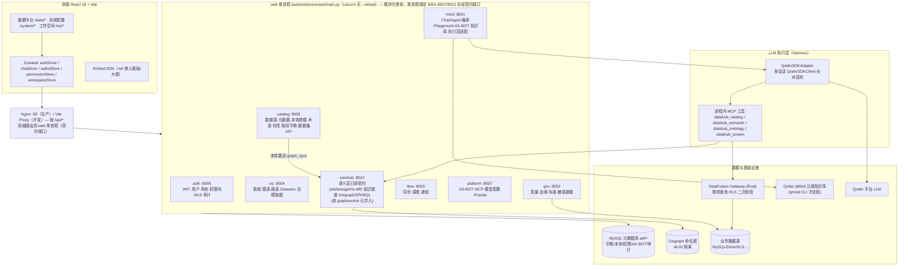
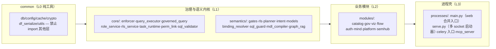
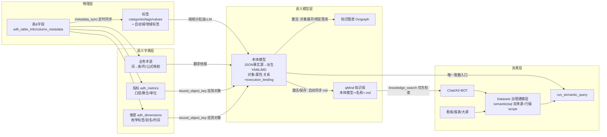
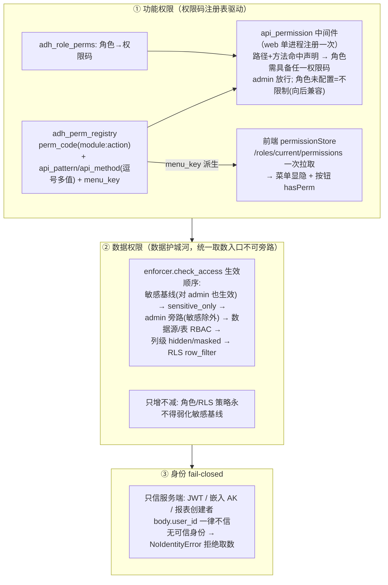
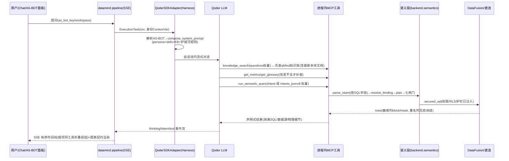

# AI-DataHub 项目架构

> 自然语言商业智能平台 — 语义层为唯一事实源：自然语言 → 声明式意图 → 受控取数 → 可视化 → 洞察。
>
> 本文档与代码实际状态同步（2026-09）。历史版本中的向量检索服务（embedding/Doris 向量）与
> `execute_sql` 裸 SQL 通道均已下线，统一走 GraphRAG + 关键词/BM25 与 `run_semantic_query`。

---

## 一、整体分层架构



### 模块职责速查（web 单进程内）

> 下表前缀均为 `backend/`。Phase 4 起对外 REST 路径/端口与微服务时代**完全一致**（web 单进程同时绑定全部契约端口），服务名仅作为端口 health body 的 `service` 字段保留旧口径。

| 模块 | 契约端口 | 职责 | 关键代码 |
|---|---|---|---|
| modules/auth | 8006 | JWT 认证、用户/角色、权限码注册表、RLS 策略、审计、系统监控 | `api/roles.py`、`core/rls_service.py` |
| modules/mind | 8001 | Chat/Agent 编排（SSE 管道）、SQL Playground、AS-BOT API、知识库管理、执行层适配 | `agent/`、`execution/`、`api/playground.py`、`api/as_bot.py`、`rag/qmind_retriever.py` |
| modules/catalog | 8005 | 数据源、元数据、本体建模（生成/激活/YAML 导入）、业务术语、标签、指标/维度字典、本体→知识库同步 | `modules/catalog/services/ontology_service.py`、`ontology_kb_sync.py`、`api/metrics.py` |
| modules/viz | 8004 | 看板、图表、报表、可视化大屏、UI 字模库、Datasets 治理建模层、治理取数 | `modules/viz/services/dataset_service.py`、`core/governed_query.py` |
| modules/gov | 8002 | 数据质量、血缘、数据标准、敏感字段治理（敏感基线唯一来源） | — |
| modules/flow | 8003 | 元数据/数据同步任务、定时调度、通知渠道、报告模板 | — |
| modules/platform | 8007 | AS-BOT 管理、MCP 服务市场、模型配置、Prompt 版本、执行层注册表 | `api/as_bots.py` |
| modules/semhub | 8012 | 语义层只读契约端点（AST/血缘/RLS diff 预览/provenance）、知识图谱查询（Oxigraph SPARQL，原 graphservice :8011 已并入退役） | `graph/graph_service.py` |
| dataengine | 8082 (GATEWAY_PORT) | Rust DataFusion 联邦查询网关，MySQL/Doris/SLS provider，RLS 二次校验（Phase 7 将被 semantics 内嵌引擎替代后退役） | `src/` |

### 分层模块图与部署视图（Phase 4 起）



- 依赖规则：`common ← core/semantics ← modules ← processes` 箭头单向；**L2 之间横向 import 禁止**，由 `tests/test_layering_contract.py` AST 门禁强制（白名单登记：eval/adapters、core/task_runtime 回调表、mind→其他 modules 编排调用）。
- 部署拓扑（`start-all.sh` 11→4 进程）：**web**（合并入口，单进程绑 8001-8007/8012）+ **celery-worker** + **celery-beat** + **dataengine**(Rust)；开发可选 `python -m backend.processes.serve --reload` 单进程热重载（同为多端口，vite 代理零改动）。

---

## 二、模块关联（语义层要素的分工与数据流）



### 各模块定位（一句话）

| 模块 | 定位 | 回答的问题 |
|---|---|---|
| 表 & 字段 | 技术元数据（同步而来） | 数据物理上在哪 |
| 标签管理 | 数据资产分类面（人工 + 自动域/地域标签） | 这张表属于什么类别 |
| 业务术语 | 同义词词典（词 → 表/列/公式） | 这个业务词指哪列 |
| 指标中心 | 度量/维度字典（唯一口径权威，**编辑单一入口**：指标字典/维度字典双 Tab） | 这个数怎么算、这个词指哪列 |
| 本体建模 | 业务世界语法（对象-属性-关系 + 物理绑定） | 数据在业务上是什么 |
| 本体可视化 | 关系探索 + SPARQL（不含字典管理） | 实体之间怎么连 |
| Datasets | BI 治理建模层（语义对象/SQL 双来源 + 行级范围） | 分析资产怎么复用同一口径 |
| qMind 知识库 | AI 的权威上下文（含自动同步的本体文档） | 回答/建模前查什么 |

> 治理原则：指标/维度字典的**读写唯一入口**是 datacatalog `/api/metrics`（指标中心双 Tab：
> 指标字典/维度字典）；知识图谱页不再内嵌字典管理，graphservice 的字典端点已下线，
> 避免双编辑器对同一张表各写一套字段映射造成漂移。人工维护的维度别名/枚举标签
> 优先级高于本体回写（sync_enums_to_dimensions 只补空白不覆盖）。

---

## 三、数据标注与同步链路

| 链路 | 触发 | 实现 | 一致性要点 |
|---|---|---|---|
| 元数据同步 | 手动 / dataflow 定时 | `sync/metadata_sync.py` → `adh_table_info` / `adh_column_metadata`；按表名规则自动提取 `domain_tag/region_tag` | 视图不得被 `TABLE_TYPE='BASE TABLE'` 过滤系统性丢弃 |
| 本体生成 | 页面按钮 / AS-BOT 工具 | LLM 按域标签分批（每批 ≤20 表）归纳 → JSON 草案 → 人工编辑 → **激活** | 同一数据源仅一个 active 版本，旧版自动归档，可回滚 |
| 本体 → 知识图谱 | 激活 / 激活态保存 / YAML 导入 | `graph_builder` → Oxigraph 命名图 `ds:ID`；对象 MD 段展开进 `adh_ontology_objects` | **先落库 json_content 再重建图谱**（否则图谱滞后一次保存）；全局聚合图 ds:0 需单独触发重建 |
| 本体 → qMind 知识库 | `ontology_service` 服务层钩子（save/activate/archive/delete） | `ontology_kb_sync.py`：md_content 以固定标题「本体模型-<名称>.md」先删旧再 upload（幂等）；后台线程 + 静默失败 | 仅 `source_config.sync_ontology=true` 的 active qMind KB；文档归属 active 版本，同名多版本共享一篇 |
| 本体枚举 → 维度字典 | 激活 / 激活态保存 | `sync_enums_to_dimensions`：enum → `value_labels`、属性名/描述 → `aliases` | **人工标签优先**，冲突不覆盖只记日志；字典缺维度行的枚举列入 gaps 供人工决策 |
| YAML 导入 | 页面 / AS-BOT | `ontology_yaml_import.import_palantir_yaml`：Palantir 多域 YAML 合并为单模型 `{datasource}-全量本体` | 激活态允许就地编辑，保存时按真实表元数据重算 execution_binding 并联动刷新 |
| 数据源身份 | 数据源增删改 | `adh_datasources.name` 全局唯一（UNIQUE）；`adh_ontology_bindings` 与 canonical `execution_binding` 同时持久化 `datasource_name` | 删除重建（同名）自动重解析；解析结果回填当前 live datasource_id |

---

## 四、技术栈

| 层 | 选型 | 备注 |
|---|---|---|
| 前端 | React 18 + TypeScript + Vite + Tailwind + shadcn/Radix + Zustand + G2/ECharts + ReactFlow + react-markdown | vitest 单测；vite 改 config 自动重启 |
| 后端 | Python 3.10 + FastAPI **web 单进程**（`backend/processes/main.py`，模块化单体分层） | uvicorn **无 --reload**，改代码/路由重启 web（`./stop-all.sh web && ./start-all.sh -d`）；进程拓扑 = web + celery-worker + celery-beat + dataengine |
| 数据访问 | DBUtils 连接池 + PyMySQL；`backend/common/db`（元数据）/ `datasource_db`（业务源） | 数据源配置来自 `.env`（`services/.env` 优先、`backend/.env` 兜底） |
| 查询引擎 | Rust DataFusion Gateway（axum 0.7 路由语法 `:id`），MySQL/Doris/SLS provider；不可用时 pymysql/psycopg2 直连兜底 | 连接池 key 不含凭据 → 密码轮换需 PUT 下推或重启引擎 |
| 存储 | MySQL（OLTP 元数据，全部 `adh_*` 表）；Oxigraph（RDF 命名图，Docker 命名卷）；Doris（可选 OLAP / 可观测大表） | embedding 与 Doris 向量检索已全量移除，统一 GraphRAG + 关键词/BM25 |
| LLM | Qoder 平台（qoder-agent-sdk）；`QoderSDKClient` 按会话长对话池，失败回落单发 `query()+resume` | 认证 `QODER_PERSONAL_ACCESS_TOKEN` |
| 知识库 | Qoder qMind 云端 Notebook（qmind CLI 子进程，`QMIND_TOKEN` 自动换取 job token） | 真实 notebook 由 CLI 创建后产品页导入，禁止 SQL 种子假条目 |
| 网关 | Nginx（生产，`services/dataengine/nginx.conf`）/ Vite proxy（开发，`frontend/vite.config.ts`） | 新增服务前缀两处都要配 |
| 可观测 | 自研 span/用量采集（`backend/observability`），MySQL=OLTP / Doris=OLAP 分库 | 未开启即全链路 no-op、绝不抛出 |
| 迁移 | `docker/mysql/*.sql` 幂等脚本（CREATE IF NOT EXISTS + INSERT IGNORE + information_schema 判列） | 应用时**必须引号感知分词**，禁止按 `;` 朴素切分 |

---

## 五、权限体系（三层正交）



### 功能权限要点

- 单一事实源：`adh_perm_registry`（权限码声明 API 模式 + 菜单 key）+ `adh_role_perms`；
  角色配置页（RoleManagement → 功能权限 Tab）按模块分组勾选，不再逐菜单/逐接口配置。
- 中间件对 `api_pattern`/`api_method` 做**笛卡尔展开**匹配（fnmatch `*` 通配）；
  「读语义但用 POST」的端点（如数据集 preview/query）需独立权限码（`dataset:query`），
  否则会被 manage 误拦。
- 内置系统资源（如系统种子 AS-BOT/知识库）仅 admin 可编辑（前端只读 + 后端 403 双保险）。
- 权限码 pattern 必须按各服务**实际挂载路径**核对（如本体真实前缀 `/api/catalog/ontology`、
  看板 `/api/dashboard` 无 s），否则管控静默空转。

### 数据权限要点（详见 `.qoder/rules/security-guardrails.md`）

- 任何返回数据行的执行必须经 `semantics.execute`（全平台唯一取数执行口，内部经 `execute_query_with_permission` / 封装 `governed_execute`）。
- RLS 行过滤以包裹子查询注入，保留原表别名，覆盖 FROM 与 JOIN 两侧。
- `validate_sql`：仅 SELECT/WITH，禁 DDL/DML/多语句，缺 LIMIT 自动补默认后再校验。
- 结果序列化经 `df_to_columns_rows` 无损消歧重名列。
- 审计成功与拒绝均落库；可观测/审计改动不得抛异常影响主链路。

---

## 六、执行层与 AS-BOT 配置管理

```
AS-BOT(配置单元 "what") ──注入──▶ Harness(QoderSDKAdapter "how") ──驱动──▶ LLM(model)
```

| 维度 | 机制 |
|---|---|
| AS-BOT 解析 | `adh_as_bots` 按 工作空间绑定 + 用户角色 + 会话选定 `as_bot_key` 合并（`resolve_as_bots`/`default_as_bot`）；AS-BOT 与智能问数同载体、不同入口，无哨兵特化；系统/业务域由工具授权（`system` 组）判定（`tool_policy.is_system_scope`） |
| 工具粒度 | `tools.groups`（catalog/query/semantic/ontology/screen/system）；`tools.mcp = {group: [tool,...]}` 逐工具勾选（权限完全下放配置，无代码硬删工具组）；`tools.standard` 标准工具白名单 → 生成 deny-list（注意：空数组=不限制，必须显式配置） |
| 知识库绑定 | `knowledge_base_ids` → ① 注入 system_prompt（引导优先检索）② `ctx.extra.bound_knowledge_base_ids` → `knowledge_search` 按绑定范围检索。语义：`None`=不限库；`[]`=明确无绑定直接回退 graphrag |
| 技能绑定 | `skills` 名称数组 → `config/skills/<name>/SKILL.md` 文件夹按名加载提示词 |
| 生效保障 | options 稳定投影指纹（含 system_prompt/tools/mcp/agents/ctx）→ **换绑后下一轮自动 resume 重建长对话**，历史保留 |
| 基础设施黑盒 | `datasource_id/workspace_id/user_id` 由服务端 ContextVar 注入工具 handler，LLM 不可见、不可传、不可猜 |
| 写动作直执行 | 菜单与功能权限码（`perm_link.require_write_perm`，`ai_access='write'`，fail-closed）+ AS-BOT 工具授权把关后**直执行**；审计落库（`decided_by`/`approved_by` 服务端注入）；旧审批通道（`adh_as_bot_approvals`/角色动作矩阵）已退役 |
| 执行层注册表 | `adh_execution_layers`（cli-qoder 必须 `config.mode=sdk` 才走 QoderSDKAdapter，否则 AS-BOT 注入/语义工具全失效）；默认外部层取第一个 healthy 非 builtin |

---

## 七、LLM 功能设计架构

### 端到端时序（一次 Chat 取数）



### 语义层编译链路

```
intent(JSON) ──intent.py 解析(拒 sql/raw_sql/statement)──▶ SemanticQuery
    ──binding_resolver 三级解析(name 优先)──▶ ResolvedBinding(物理表+方言+护栏)
    ──planner 编译(指标/维度/枚举/相对时间 time_window)──▶ PlannedExecution(base_sql)
    ──gates 七闸门 identity→permission→preflight→proposal→approval→execute→audit──▶ rows
```

- SQL 方言在语义层保留、引擎边界单点转译（失败回退）；相对时间一律 `time_window`（`7d/24h/1M`）。
- 本体对象绑定 SQL 模板（漏斗/留存等高级函数）时，`params` 按声明传参，模板 variables 由知识库文档可查。

### 工具链路优化四原则

1. **折叠展示**：前端 ProcessTimeline 把相邻同名工具调用折叠成组（思考段打断分组）。
2. **批量调用**：`run_semantic_query.intents_json`（≤8）、`knowledge_search.questions`、
   `get_glossary.keywords` —— 一次传全，压缩轮次。
3. **知识库优先**：先 `knowledge_search`（知识库含自动同步的最新本体文档），
   够用直接组装 intent，不全再 `get_metrics/get_glossary` 补查。
4. **本体自动同步**：语义层更新 → qMind 知识库文档刷新（幂等），保证 AI 上下文与口径同源。

### Chat / AS-BOT / Datasets 的关系

- **Chat**（工作空间）：业务分析对话，走选定 AS-BOT；产物按图表契约渲染，赞踩关联可观测 trace。
- **AS-BOT 面板**（数据中台/系统配置 Header 入口）：与智能问数**同一载体、不同入口**——继承当前角色的 AS-BOT 配置（`asbot:use` 门禁）；系统/业务域与工具面由工具授权承担，写动作由菜单与功能权限码把关直执行；会话历史与 Chat 合并共用。
- **Datasets**（dataviz 治理建模层）：语义对象/SQL 双来源，行级 scope 与 RLS/敏感基线
  **AND 叠加、只收紧不放宽**；看板/报表/Chat（`query_dataset`）共用同一执行路径同一年口径；
  SQL Playground 保存查询可联动建集（`adh_saved_queries.dataset_id` 回写）。

---

## 附：关键约定与红线

- 服务以 uvicorn 无 `--reload` 常驻：接口/权限代码改动后重启 **web 单进程**（绑 8001-8007/8012）方生效。
- 触碰 `enforcer.py / query_executor.py / governed_query.py / playground.py /
  semantic_query.py / df_serialize.py` 后必须跑护城河三套回归测试。
- 长对话池：流中断/异常即退役回落单发；跨线程埋点须 `contextvars.copy_context().run` 传播 recorder。
- 前端接口路径与后端真实挂载前缀必须核对（vite proxy + nginx 两处网关配置）。
- 系统内置组件（AS-BOT/知识库种子）严禁 SQL 占位种子，真实资源经 CLI/产品页创建。
